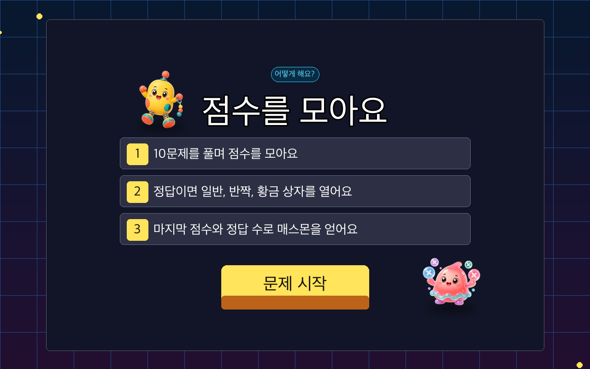
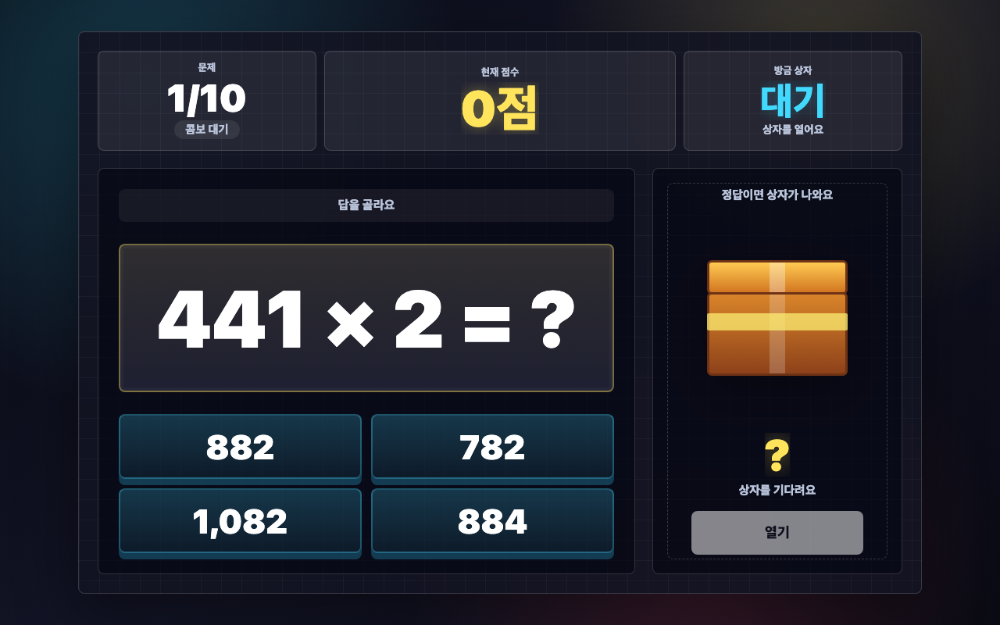
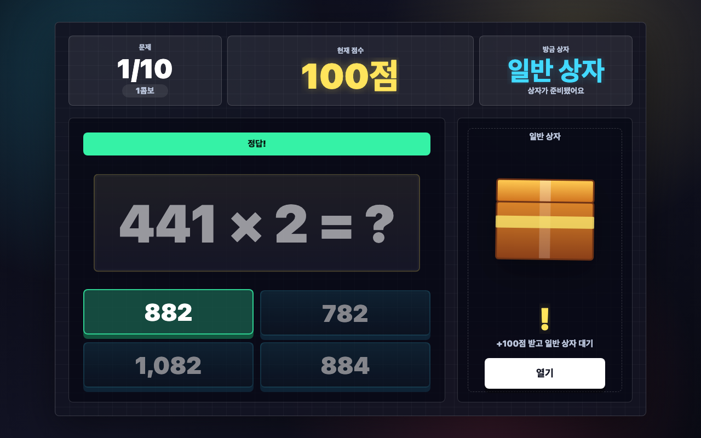
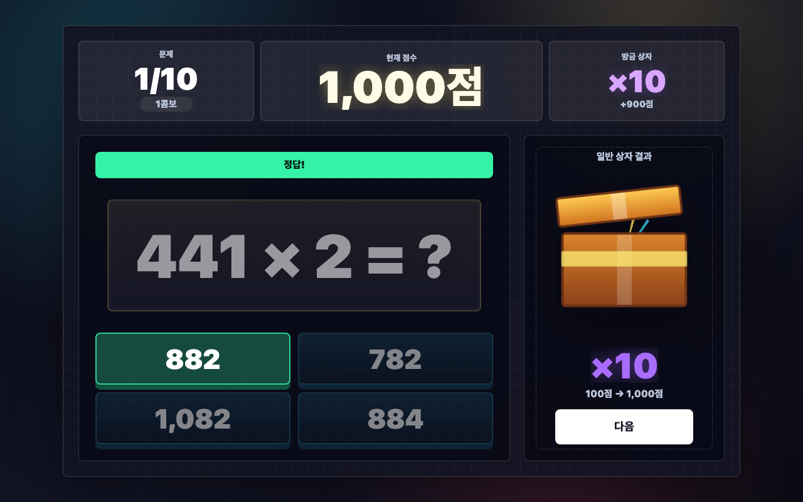
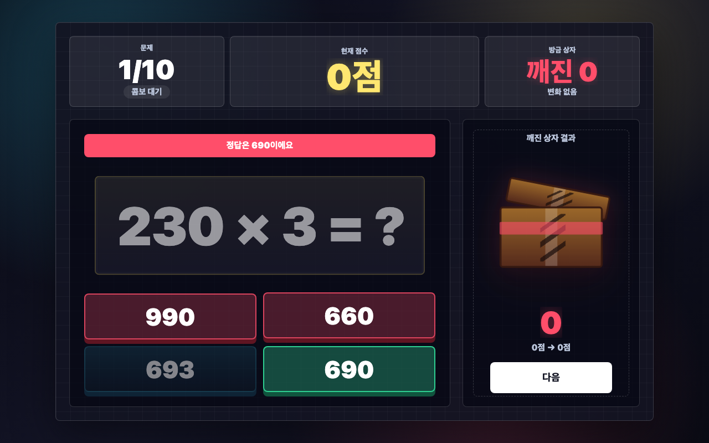
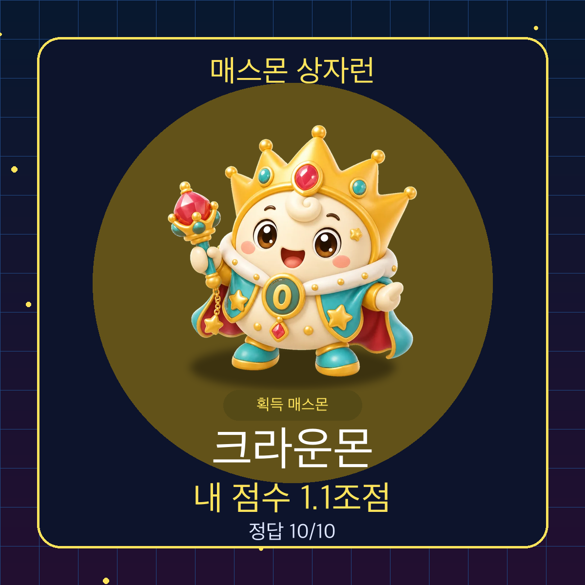
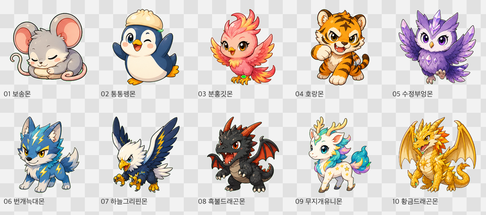

# 매스몬 상자런 설명 보고서

## 2026-08-23 공통 보상 정책 v2 검수

- 확률·점수·결과 기준은 `_shared/contracts/mathmon-unified-reward-v2.json`의 `mathmon-unified-reward-v2`를 단일 기준으로 사용합니다.
- 처음에 맞힌 문제는 `69% 보통 / 10% 작은 하락 / 12% 큰 보상 / 5% 대박 / 3.8% 그대로 / 0.2% 특별`입니다.
- 한 번이라도 틀린 문제는 정답 보상표를 다시 쓰지 않습니다. `50% 작은 감점 / 50% 그대로`만 나오며, 양수·대박·특별 보상은 나오지 않습니다.
- 따라서 오답은 정답보다 불리하지만 무조건 감점되지는 않습니다. 누적값을 지우는 `0으로 초기화`도 쓰지 않습니다.
- 1~4단원 17개 실행본을 대상으로 경계값 검사와 차시당 10만 회 확률 시뮬레이션을 통과했습니다. 아래 제작 이력에 남은 v1 명칭이나 예전 확률표는 현재 실행 기준이 아니며 이 절의 v2 기준으로 대체됩니다.


## 1. 개요

`매스몬 상자런`은 3학년 2학기 1단원에서 다루는 세 자리 수 × 한 자리 수 계산을 짧고 반복적인 게임 흐름으로 연습하는 에듀잇티 수학 게임입니다. 학생은 문제를 맞히면 상자를 열고, 상자 안의 보상으로 점수가 크게 오르거나 내려갑니다. 최종 점수와 정답 수에 따라 서로 다른 매스몬을 얻습니다.

핵심 목표는 단순 계산 반복을 `한 문제만 더` 풀고 싶게 만드는 것입니다.

## 2. 학습 설계

- 문제 유형: 받아올림 없는 세 자리 수 × 한 자리 수
- 문제 은행: 조건을 만족하는 186개 후보에서 매 판 10문제 랜덤 추출
- 라운드 길이: 10문제
- 입력 방식: 4지선다 선택
- 콤보 점수: 연속 정답이면 기본 정답 점수가 `+100`부터 `+500`까지 커짐
- 정답 보상: 일반, 반짝, 황금 상자 중 하나 열기
- 오답 처리: 1회 오답은 재도전, 2회 오답은 깨진 상자 자동 열기
- 결과 칭찬: 정답 수와 점수에 따라 한 줄 칭찬 표시
- 소리 피드백: 낮은 볼륨의 기존 BGM과 Kenney CC0 샘플 기반 정답, 오답, 상자, 보상, 결과 효과음 제공. 설정 모달에서 배경 소리와 효과 소리를 따로 켜고 끔
- 최종 보상: 점수와 정답 수 조건을 함께 통과한 매스몬 획득

문제는 각 자리 숫자와 곱하는 수를 조합할 때 자리별 곱이 9를 넘지 않도록 만들어 받아올림이 생기지 않게 구성했습니다. 후보 문제는 총 186개이며, 한 판이 시작될 때 섞은 뒤 10개만 뽑아 반복 플레이마다 다른 문제 흐름이 나오게 했습니다.

### 교육적 의도

이 게임에서 곱셈 문제는 그 자체로 끝나는 반복 과제가 아니라, 점수 변화와 매스몬 획득으로 이어지는 `행동의 도구`입니다. 학생은 문제를 맞혀야 상자를 열 수 있고, 상자 결과에 따라 점수가 크게 오르거나 내려갑니다. 계산은 예측 가능한 영역이지만 보상은 예측 불가능하게 설계되어 있어, 학생은 같은 유형의 문제를 풀면서도 매번 다른 결과를 경험합니다.

교육적으로는 반복 연습에 게임의 간헐적 보상을 결합한 구조입니다. 학생은 단순히 정답을 맞히는 데서 멈추지 않고, 다음 상자와 최종 매스몬을 기대하며 더 많은 문제에 자발적으로 접근합니다. 이때 무작위성은 계산 학습을 흐리는 장치가 아니라, 이미 배운 계산 절차를 더 자주 사용하게 만드는 동기 장치로 작동합니다. 결과적으로 학생은 점수와 보상이라는 외적 목표를 따라가면서도, 실제로는 받아올림 없는 세 자리 수 곱셈의 자리별 계산 과정을 반복적으로 확인하고 숙달하게 됩니다.

## 3. 게임 흐름

```text
첫 화면 -> 설명 1(푸는 법) -> 설명 2(상자와 순위 목표) -> 문제 풀이 -> 상자 보상 -> 다음 문제 -> 최종 매스몬 -> 전국 순위
```

정답을 맞히면 콤보 점수를 받고 색깔 상자가 준비됩니다. 연속으로 맞힐수록 기본 정답 점수가 `+100`, `+200`, `+300`, `+400`, `+500`까지 커집니다. 정답 상자는 일반, 반짝, 황금 3단계이며 황금 상자일수록 좋은 보상 확률이 조금 더 높습니다. 상자에서는 `+`, `-`, `×`, `÷`, `0`, `-를 +로` 같은 효과가 한 번 적용됩니다. 점수는 음수와 큰 수를 모두 허용합니다. 결과 화면에서는 정답 수와 점수에 맞춘 짧은 칭찬 문장을 함께 보여 줍니다.

2번 틀리면 상자를 피할 수 없도록 깨진 상자가 자동으로 열립니다. 깨진 상자는 일반 상자보다 불리한 보상 풀이 적용되어, 일부러 틀려 위험을 피하는 전략을 막습니다.

## 4. 화면별 설명

### 첫 화면


첫 화면은 `generated-title-overlay` 표준으로 이관했습니다. `cover-generated.webp`는 글자 없는 상자런 배경만 맡고, 게임 제목은 독립 생성형 `title-logo-generated.webp`, 시작 버튼 표면은 독립 생성형 `start-button-generated.webp`가 맡습니다. HTML은 브랜드/단원/배움주제 배지, 한 줄 목표, 실제 시작 버튼 hitbox와 접근성 제목을 맡습니다. 이전 일체형 포스터 커버는 `cover-legacy-poster.*`로 보존했습니다.

### 설명 화면



설명 화면은 생성 이미지 2장 흐름입니다. 첫 장 `tutorial-solve-generated.webp`는 받아올림 없는 세 자리 수 × 한 자리 수를 자리마다 곱하는 방법을 보여 주고, 버튼은 `다음`입니다. 둘째 장 `tutorial-goal-generated.webp`는 10문제를 풀며 상자 점수를 얻고 마지막에 매스몬과 전국 순위를 확인한다는 목표를 보여 줍니다. HTML은 숨김 접근성 설명, `data-tutorial-step`, 투명 hitbox만 맡고 보이는 설명 UI를 다시 그리지 않습니다.

### 문제 화면



문제와 선택지가 가장 크게 보이도록 구성했습니다. 상단에는 문제 진행도, 현재 점수, 방금 상자 결과가 표시됩니다.

### 정답 후 상자 대기



정답을 맞히면 문제 카드가 살짝 작아지고 상자가 강조됩니다. 학생은 `열기` 버튼을 눌러 보상을 확인합니다.

### 일반 상자 결과



상자가 열리면 효과가 크게 표시되고 점수가 즉시 바뀝니다. 큰 숫자 변화가 게임의 핵심 자극입니다.

### 깨진 상자 대기



2번 틀리면 정답을 보여 주고 모든 선택지를 잠급니다. 상자는 어둡게 변하고 균열이 생긴 뒤 자동으로 열립니다.

### 깨진 상자 결과


깨진 상자는 `-500`, `-5000`, `÷2`, `0`, 가끔 `+100` 중 하나가 나옵니다. 학생이 일부러 틀려 상자 위험을 피하는 편법을 막는 장치입니다.

### 최종 결과


최종 결과는 이미지 생성으로 새로 만든 RasterStage 시상식 무대를 배경으로 사용합니다. 무대를 왼쪽으로 치우치게 두고 매스몬을 그 무대 중앙에 올린 뒤, 매스몬 이름은 `result-title-*-generated.webp` 생성형 타이틀 이미지로 크게 보여 줍니다. 정답 수는 `_shared/result-count/result-correct-*-generated.webp` 생성형 숫자 이미지가 맡고, 단일 SVG 동적 레이어는 실제 점수값, `순위`, `이미지 받기`, `다시` 버튼 표면만 그립니다. 실제 클릭은 같은 위치의 투명 hitbox가 맡고, 칭찬 문구는 접근성용 숨김 텍스트로만 남겼습니다. 매스몬은 점수만이 아니라 정답 수 조건도 함께 봅니다.

### 전국 순위 화면

결과 화면의 `순위` 버튼을 누르면 마지막 전국 순위 화면으로 이동합니다. 이 화면은 `_shared/scoreboard` 공통 SVG 순위판을 사용하며, 생성 이미지는 축하 배경과 상단 타이틀 아트만 맡고 순위판·내 기록 박스·순위 행·버튼·동적 글자는 SVG가 직접 그립니다. 상단 상태 문장은 제거했고, API 주소가 없으면 순위 목록 영역 안에 `순위 기능이 켜지면 여기에 10위까지 보여요.` 안내만 보이며 게임 결과는 그대로 유지됩니다.

백엔드 연동 지점은 `index.html`의 `LESSON_ID = "3-2-1-1-mathmon-box-run"`, `SCOREBOARD_API_URL`, `scoreboardBridge`, `scoreboardAnswers`, `scoreboardScreen`입니다. 업체는 정적 HTML을 열기 전에 `window.MATHMON_SCOREBOARD_API_URL`만 주입하면 됩니다. 1차시는 깨진 상자에서 `0`이나 `÷2`가 나올 수 있으므로, 서버에는 보상 이름이 아니라 실제 점수 변화량 `after - before`를 `broken.amount`로 보냅니다. 이 항목을 빼면 점수 검증이 맞지 않을 수 있습니다.

### 이미지 받기



학생은 자신이 얻은 매스몬 이미지를 받을 수 있습니다. 다운로드 이미지에는 매스몬, 내 점수, 정답 수가 함께 들어갑니다.

### 결과 화면 QA

`node scripts/qa-unit1-result-screens.mjs`로 1280x800, 1024x768에서 결과 화면을 열어 확인했습니다. CSS 결과 카드 잔존, 텍스트 넘침, Stage 밖 SVG 글자, 버튼 hitbox 충돌, SVG 큰 결과명 잔존, 고정 SVG 보조 라벨 잔존, 정답 수 폰트 텍스트 잔존은 0건입니다. 2026-07-04 다양성 보상팩 교체 뒤에는 최고 점수 상태에서 `황금드래곤몬` WebP와 생성형 타이틀 자산 로딩, 이미지 받기 1200x1200 PNG 생성을 추가 확인했습니다. 첫 보상 상태는 0점/0개로 강제 표시해 `보송몬` 타이틀, WebP, 다운로드 파일명 `cottonpuff-0-score.png`를 확인했습니다.

## 5. 매스몬 설명



| 단계 | 매스몬 | 점수 조건 | 정답 수 조건 | 설명 |
| --- | --- | ---: | ---: | --- |
| 1 | 보송몬 | 0점 이상 | 0개 이상 | 작고 폭신한 시작 매스몬입니다. |
| 2 | 통통펭몬 | 500점 이상 | 2개 이상 | 상자를 보면 통통 뛰는 매스몬입니다. |
| 3 | 분홍깃몬 | 5,000점 이상 | 4개 이상 | 밝은 깃털로 점수를 올리는 매스몬입니다. |
| 4 | 호랑몬 | 50,000점 이상 | 5개 이상 | 씩씩하게 상자를 지키는 매스몬입니다. |
| 5 | 수정부엉몬 | 500,000점 이상 | 6개 이상 | 반짝이는 눈으로 답을 찾는 매스몬입니다. |
| 6 | 번개늑대몬 | 5,000,000점 이상 | 7개 이상 | 번개처럼 달려 높은 점수를 잡는 매스몬입니다. |
| 7 | 하늘그리핀몬 | 50,000,000점 이상 | 8개 이상 | 하늘에서 큰 점수를 지키는 매스몬입니다. |
| 8 | 흑불드래곤몬 | 500,000,000점 이상 | 8개 이상 | 뜨거운 힘으로 큰 상자를 여는 매스몬입니다. |
| 9 | 무지개유니몬 | 5,000,000,000점 이상 | 9개 이상 | 무지갯빛으로 행운을 부르는 매스몬입니다. |
| 10 | 황금드래곤몬 | 50,000,000,000점 이상 | 10개 | 이번 판 최고 보물을 지키는 전설 매스몬입니다. |

## 6. 편법 방지 규칙

초반에 점수를 크게 얻은 뒤 일부러 틀려 상자를 피하는 전략을 막기 위해 두 가지 규칙을 넣었습니다.

- 모든 문제는 상자로 끝납니다. 정답이면 일반 상자, 2회 오답이면 깨진 상자가 열립니다.
- 매스몬은 점수만 보지 않고 정답 수 조건도 함께 봅니다.

예를 들어 10만점 이상을 얻어도 정답 수가 1/10이면 보송몬만 얻습니다. 반대로 10/10을 맞히고 높은 점수까지 얻으면 황금드래곤몬까지 도달할 수 있습니다.

## 7. 공개 패키지 구성

이 폴더는 별도 빌드 없이 바로 열 수 있는 정적 패키지입니다.

- `index.html`
- `cover-source.png`, `cover-generated.png`, `cover-generated.webp`
- `title-logo-source.png`, `title-logo-generated.png`, `title-logo-generated.webp`
- `start-button-source.png`, `start-button-generated.png`, `start-button-generated.webp`
- `cover-legacy-poster.png`, `cover-legacy-poster.webp`(이전 일체형 포스터 커버 보존본)
- `tutorial-solve-source.png`, `tutorial-solve-generated.webp`
- `tutorial-goal-source.png`, `tutorial-goal-generated.webp`
- `tutorial-fulltext-source.png`, `tutorial-fulltext-generated.webp`(이전 포스터 보존본, 현재 실행 경로에서는 미사용)
- `result-generated-v3-source.png`, `result-generated-v3.webp`
- `result-title-*-source.png`, `result-title-*-transparent-raw.png`, `result-title-*-generated.webp`
- `../_shared/result-count/result-correct-count-source.png`, `result-correct-*-generated.webp`
- `eduitit-logo-mark.png`
- `assets/audio/*.wav`
- `assets/mathmon/diversity-reward-pack/*.webp`
- `mathmon-0-almon.png` ~ `mathmon-9-kingdragonmon.png`(1단원 기본 10종 기준 이미지 보존본)
- `screenshots/*.png`
- `README.md`
- `REPORT.md`

브라우저에서 `index.html`을 열면 바로 실행됩니다.

효과음은 `_shared/audio/kenney/`에 출처와 카탈로그를 남긴 Kenney CC0 샘플 중 이 차시에서 참조하는 파일만 `assets/audio/`에 복사했습니다. 사용 팩은 Interface Sounds, Impact Sounds, RPG Audio, Digital Audio, Music Jingles입니다. 자산 일치와 길이 검사는 루트에서 `node scripts/check-audio-assets.mjs`로 확인합니다.

## 8. 설정 버튼 업데이트

오른쪽 위 전역 버튼은 기존 소리 버튼 대신 원형 톱니바퀴 설정 버튼으로 바꿨습니다. 설정 모달에서는 `배경 소리`와 `효과 소리`를 따로 켜고 끌 수 있으며, 설정은 시리즈 공통 localStorage 키인 `mathmon-audio-bgm-enabled`, `mathmon-audio-sfx-enabled`에 저장합니다. 예전 `mathmon-box-run-bgm-enabled=off` 값이 있으면 새 BGM 키가 없을 때만 이어받습니다.

`방법 다시 보기`는 현재 화면 이름을 저장한 뒤 설명 1장부터 복습 모드로 보여 줍니다. 첫 클릭은 `다음`으로 설명 2장으로 넘어가고, 설명 2장의 `계속하기`를 누르면 문제/보상/결과 상태를 초기화하지 않고 원래 화면으로 돌아옵니다. `처음부터`는 바로 리셋하지 않고 `처음부터 할까요?` 확인을 거친 뒤 첫 화면으로 돌아갑니다.

설정 모달 문구와 새 매스몬 설명은 `설정`, `배경 소리`, `효과 소리`, `상자를 보면 통통 뛰는 매스몬이에요!`, `하늘에서 큰 점수를 지키는 매스몬이에요!`처럼 짧은 말만 사용했습니다. Humanizer 기준으로 번역투나 제작자 용어 없이 초3 학생이 바로 읽을 수 있는 말로 확인했습니다.

## 9. 설정/소리 QA

- 정적 검사: `node --check scripts/check-stage-ratio.mjs`, `node --check scripts/qa-mathmon-audio-smoke.mjs`, `node scripts/check-stage-ratio.mjs`, `node scripts/check-audio-assets.mjs`
- 브라우저 오디오/설정 QA: `node scripts/qa-mathmon-audio-smoke.mjs`
- 화면 QA: 1280x800, 1024x768에서 첫 화면, 설명, 문제 화면의 설정 버튼과 배지/HUD 충돌 0건을 확인했습니다. 설정 모달 텍스트 넘침 0건, 버튼 클릭 영역 충돌 0건을 확인했습니다.

## 10. 전국 순위 QA

- 정적 검사: `node --check _shared/scoreboard/scoreboard-ui.js`, 1차시 inline script 파싱, `node scripts/check-stage-ratio.mjs`, `git diff --check`
- 백엔드 검사: `cd scoreboard-api && bun test`, `bun run typecheck`, `bun run lint`
- 브라우저 QA: 1280x800, 1024x768, 856x544에서 결과 화면 `순위` 클릭, 전국 순위 화면 진입, 10행 샘플 렌더, `결과로` hitbox 복귀를 확인했습니다. SVG `<text>` Stage 밖 이탈, 보이는 HTML 버튼 텍스트, `foreignObject`, 버튼 겹침 0건을 확인했습니다.
- 2026-07-02 추가 QA: `scoreboard-title-box-generated.webp` 생성형 타이틀 자산을 적용하고 1280x800, 1024x768, 856x544에서 타이틀 가독성, 배경 겹침, 상단 상태 문구 제거, 목록/버튼 위치를 다시 확인했습니다.

## 11. 2026-07-02 설명 화면 2장 이관

설명 화면을 생성 이미지 2장 흐름으로 바꿨습니다. 첫 장은 `tutorial-solve-source.png`와 `tutorial-solve-generated.webp`가 맡고, 자리마다 곱하는 방법과 `다음` 버튼을 보여 줍니다. 둘째 장은 `tutorial-goal-source.png`와 `tutorial-goal-generated.webp`가 맡고, 문제를 맞히면 상자를 열어 점수를 얻고 마지막에 전국 순위를 볼 수 있음을 알려 줍니다.

HTML은 보이는 설명을 다시 그리지 않고 접근성용 숨김 설명, 단계 전환 상태값, 투명 hitbox만 맡습니다. 첫 클릭은 `solve`에서 `goal`로 넘어가고, 둘째 클릭은 `상자 열기`로 첫 문제를 시작합니다. 설정의 `방법 다시 보기`도 같은 두 장을 보여 준 뒤 원래 화면으로 돌아옵니다.

학생 문구는 `일의 자리부터 곱해요.`, `십의 자리도 곱해요.`, `백의 자리까지 곱해요.`, `상자 열기`처럼 짧은 행동 말로 유지했습니다. 로컬 Chrome QA와 배포본 QA에서 1280×800 기준 `시작 → 설명 1장 → 다음 → 설명 2장 → 상자 열기 → 문제 화면` 흐름을 확인했고, 설명 이미지 표시, 버튼 aria-label, Stage 비율, inline script 파싱, `git diff --check`를 통과했습니다. 에듀잇티 운영 런처는 `https://kakio426.github.io/eduitit-math-3-2/3-2-1-1-mathmon-box-run/?v=3bc3c71&scoreboardApi=https%3A%2F%2Feduitit.site`를 iframe으로 엽니다.

## 12. 2026-07-05 첫 화면 표준 이관

첫 화면을 이전 `legacy-raster-poster` 예외에서 `generated-title-overlay`와 `generated-button-art` 표준으로 옮겼습니다. 새 `cover-generated.webp`는 글자 없는 배경이며, 제목과 시작 버튼은 각각 생성형 독립 자산으로 올립니다. 커버 안의 매스몬과 상자는 배경 생성 단계에서 함께 들어간 장면이고, 별도 캐릭터 PNG를 얹지 않았습니다.

학생 문구는 `점수를 모아 매스몬을 얻어요.`, `받아올림이 없는 (세 자리 수)×(한 자리 수)`, `시작`처럼 짧은 말로 유지했습니다. Chrome CDP QA에서 1280×800 `screenshots/01-cover.png`와 1024×768 `screenshots/tablet-cover.png`를 새로 캡처했고, 커버 배지·제목·목표·시작 버튼·설정 버튼의 Stage 밖 이탈과 겹침은 0건으로 확인했습니다.
