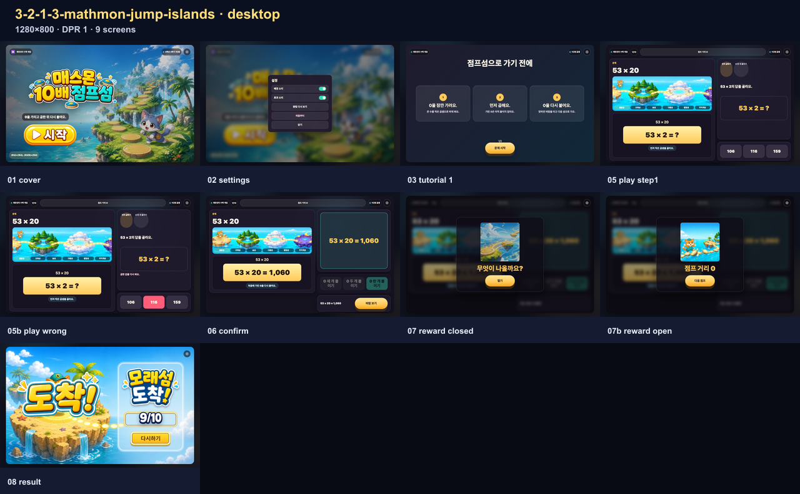
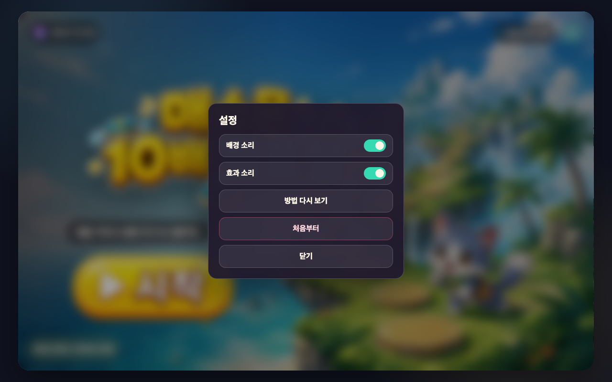
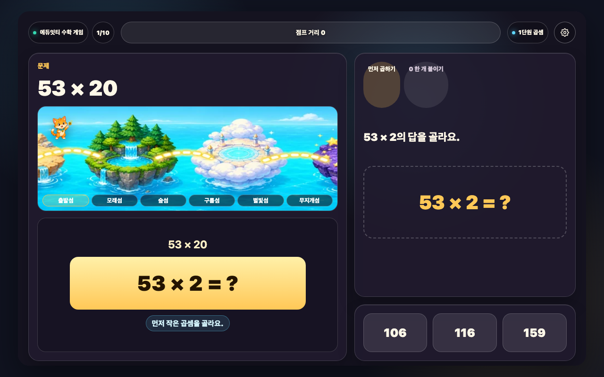
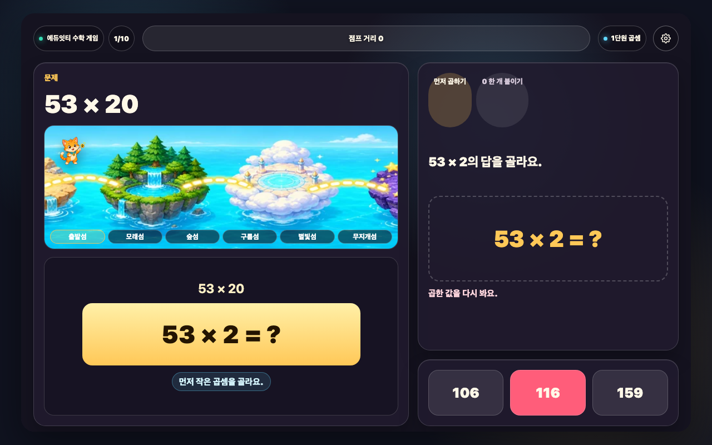
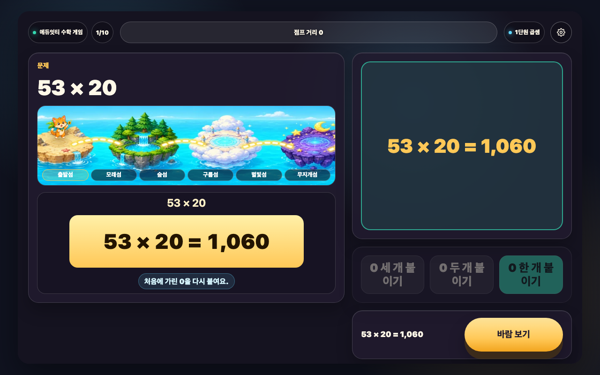
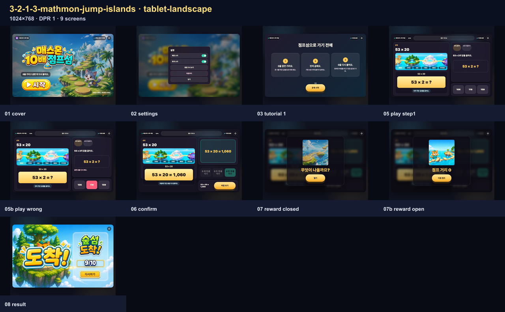
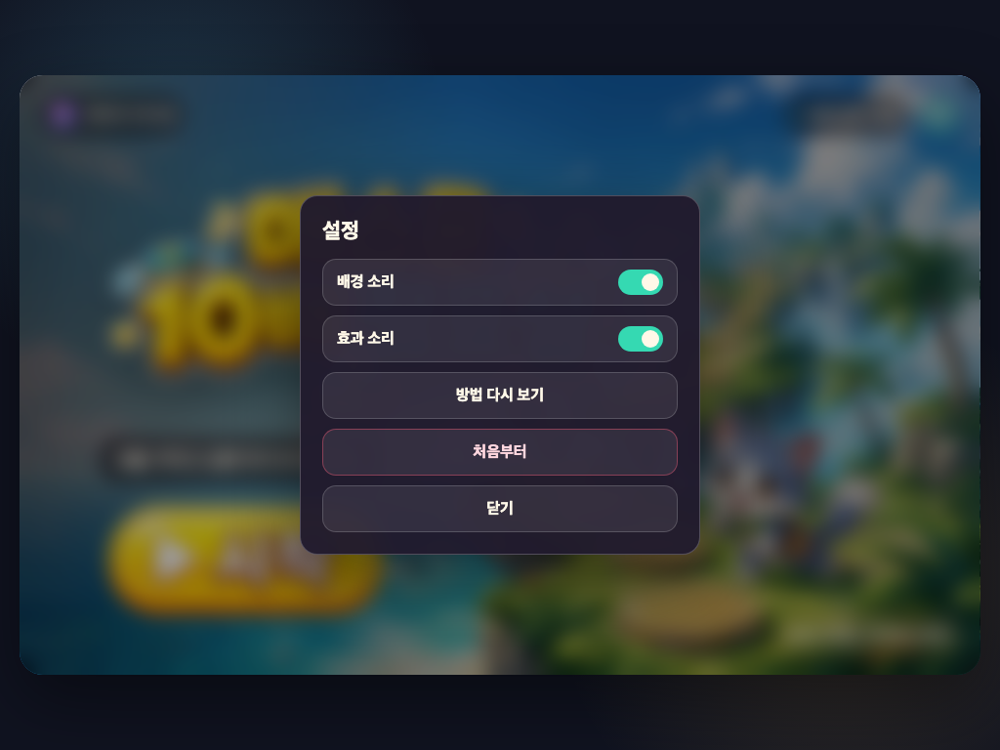
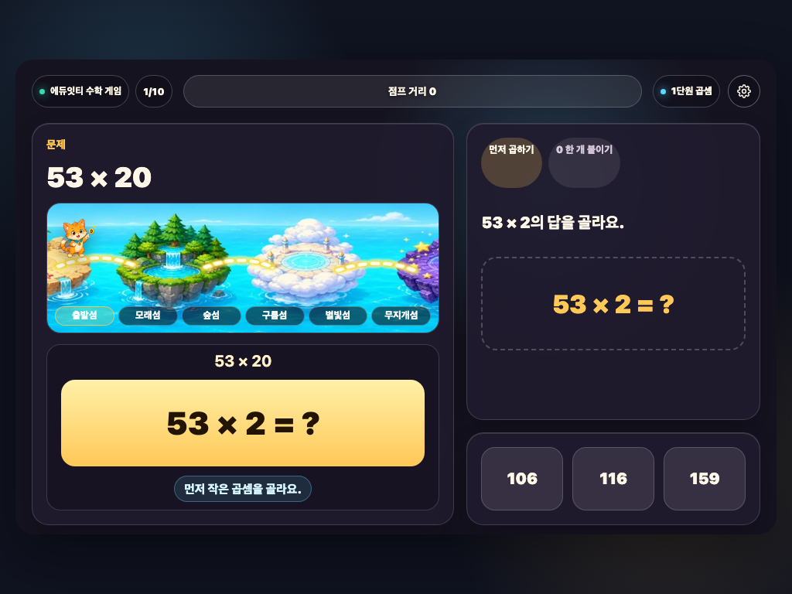
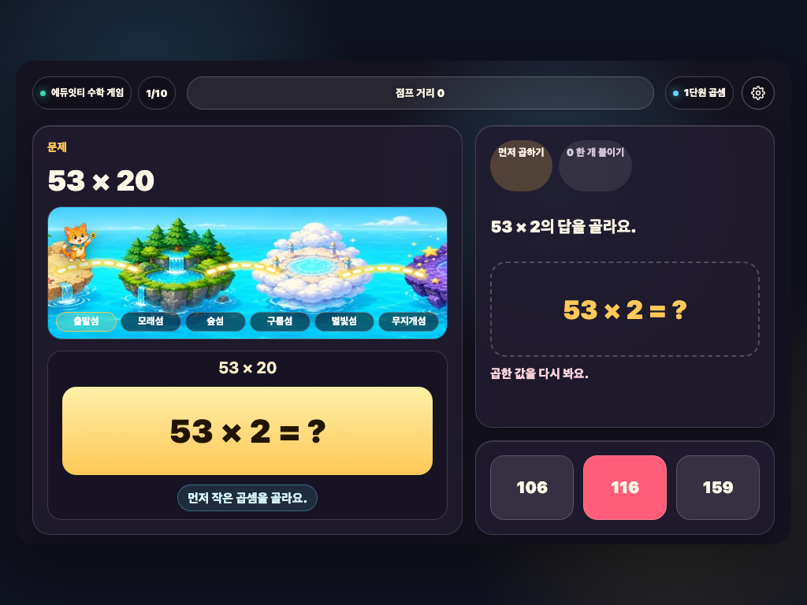
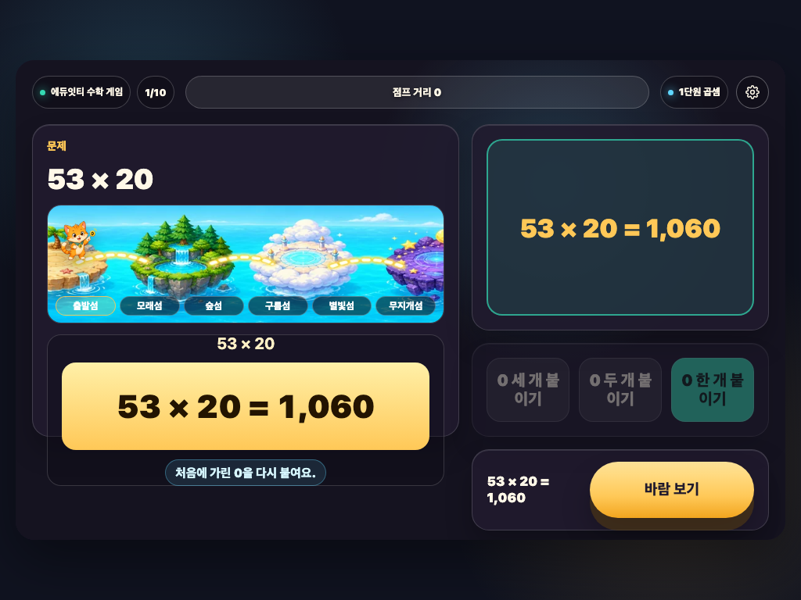

# 매스몬 10배 점프섬 REPORT

## 구현 요약

- 대상: 3학년 2학기 1단원 3차시 `(몇십)×(몇십), (몇십몇)×(몇십)`
- 배포 파일: `3-2-1-3-mathmon-jump-islands/index.html`
- 제작 원본: `_lessons/3-2-1-3-mathmon-jump-islands/lesson.json`, `model.js`, `view.js`, `lesson.css`
- 공용 엔진: `_engine/v1` 산출물
- Stage: `16:10`, `1280x800`
- 선언 마커: `data-engine-version="mathmon-engine-v1"`, `data-workbench-type="jump-islands"`, `data-reward-mode="modal-art"`, `data-result-render-mode="fullscene-score-slot"`, `data-scoreboard-enabled="false"`

## 엔진 이관 범위

공용 엔진이 맡는 부분:

- 첫 화면, 설명 화면, 문제 흐름, 설정 모달
- 정답 확인 후 보상 버튼 노출
- 보상 이벤트 선택과 적용
- 보상 이미지 모달
- 결과 화면 전환과 공용 정답 수 이미지 연결
- 순위 진입과 관련 네트워크 요청 차단

1-3 차시가 맡는 부분:

- 10배/100배 문제 생성
- 작은 곱 선택과 0 붙이기 검증
- 점프섬 지도 조작판 렌더링
- 바람 이미지와 결과 섬 이미지 연결

## 문제 구조

한 판은 10문제입니다.

- `(A0)×(B0)`: `A×B`를 고르고 `0 두 개 붙이기`
- `(AB)×(C0)`: `AB×C`를 고르고 `0 한 개 붙이기`
- 각 문제는 두 단계를 모두 첫 시도에 맞혀야 정답 수 1개로 셉니다.
- 최종 답은 한 판 안에서 겹치지 않게 뽑습니다.

## 보상과 결과

보상은 `modal-art` 모드입니다. 문제 화면을 가리지 않도록 보상은 모달 이미지 한 장과 바람 이름, 다음 버튼만 보여 줍니다.

보상 이벤트:

| 바람 | 변화 | 가중치 |
| --- | ---: | ---: |
| 살랑 바람 | +2~+5 | 6400 |
| 앞바람 | -8~-4 | 1700 |
| 잠깐 멈춤 | 0 | 1284 |
| 쌩쌩 바람 | +8~+13 | 598 |
| 무지개 길 | +14 | 18 |
| 길이 흔들렸어요 | -14~-8 | 오답 문제 |

결과는 `fullscene-score-slot` 모드입니다. `result-final-*` 이미지가 도착 섬 장면과 버튼 표면을 맡고, 정답 수는 `_shared/result-count/result-correct-*-generated.webp` 공용 이미지로 표시합니다.

## 순위 기능

현재 제품 정책에 따라 순위 기능은 비활성화했습니다. `scoreboard.enabled=false`이며 결과 화면의 진입 버튼은 숨김·비활성 상태입니다. 현재 흐름 QA는 순위·리더보드·점수 API 관련 네트워크 요청이 0건인지 함께 검사합니다.

## 검증

실행한 검사:

- `node scripts/build-lesson.mjs 3-2-1-3-mathmon-jump-islands`
- `node scripts/check-lesson-contract.mjs`
- `node scripts/qa-lesson-flow.mjs 3-2-1-3-mathmon-jump-islands 12345`
- `node scripts/qa-unit1-result-screens.mjs`
- 생성된 `index.html` 인라인 스크립트 문법 검사
- 브라우저 QA `1280x800`: cover → tutorial → 10문제 → reward modal → result
- 브라우저 QA `1024x768`: 같은 흐름 완주

브라우저 QA 결과:

- 텍스트 넘침 0건
- 보이는 이미지 누락 0건
- 결과 정답 수 생성 이미지 정상 표시
- 결과 화면 다시 하기 hitbox 정상 작동
- 순위 화면 진입 0건
- 순위 관련 네트워크 요청 0건

증거 파일:

- 데스크톱 전체 흐름: `screenshots/report-flow-desktop-contact-sheet.png`
- 태블릿 가로 전체 흐름: `screenshots/report-flow-tablet-landscape-contact-sheet.png`
- 현재 실행본 해시와 캡처 목록: `screenshots/report-evidence-manifest.json`

## 현재 화면 설명과 화면 크기

- 시작: 제목, 한 줄 목표, 공용 시작 버튼이 먼저 보입니다.
- 설명: 곱셈에서 0을 붙이는 순서를 한 장에서 확인합니다.
- 문제: 작은 곱을 고른 뒤 0을 붙여 답을 완성합니다.
- 보상: 정답 확인 뒤 바람 상자를 열고 다음 문제로 갑니다.
- 결과: 도착한 섬과 정답 수, 다시 하기 버튼을 보여 줍니다.
- 화면 크기: 1280×800과 1024×768에서 같은 흐름을 확인했습니다.

<!-- REPORT-EVIDENCE-ALL:START -->

## 2026-08-04 최신 원본 스크린샷 전수

- 실행본 SHA-256: `4e32f5998cd52304fe230d14080bf292feb713964713444b0321f7410d3d80d8`
- 생성 시각: `2026-08-04T15:32:01.309Z`
- 등록 화면 크기: `2개`
- 아래에 직접 삽입한 원본 캡처: `18장`
- 컨택시트만으로 대신하지 않고 manifest에 기록된 원본 캡처를 한 장씩 모두 연결했습니다.

### desktop · 1280×800 · DPR 1 · 9장

#### 시작 화면 · `engine-flow-desktop-01-cover.png`

- 학생이 보는 것: 매스몬 점프섬 제목과 한 줄 목표, 시작 버튼을 봅니다.
- 판단하거나 누르는 것: 게임을 시작할 준비가 되면 시작을 누릅니다.
- 화면에서 확인되는 수학 관계: (몇십)×(몇십), (몇십몇)×(몇십)을 배우는 차시임을 확인합니다.
- 다음 상태로 넘어가는 이유: 문제를 푸는 방법을 보는 설명 화면으로 이동합니다.

#### 설정 화면 · `engine-flow-desktop-02-settings.png`

- 학생이 보는 것: 배경 소리·효과 소리와 방법 다시 보기, 처음부터, 닫기를 봅니다.
- 판단하거나 누르는 것: 필요한 소리나 이동 행동 하나를 고릅니다.
- 화면에서 확인되는 수학 관계: 수학 문제는 바꾸지 않고 게임 조작만 설정합니다.
- 다음 상태로 넘어가는 이유: 설정을 마치면 열기 전 화면으로 돌아갑니다.

#### 설명 1 · 풀이 방법 · `engine-flow-desktop-03-tutorial-1.png`

- 학생이 보는 것: (몇십)×(몇십), (몇십몇)×(몇십) 문제를 푸는 방법과 게임 흐름을 그림으로 봅니다.
- 판단하거나 누르는 것: 그림 속 순서와 누를 곳을 확인한 뒤 다음 행동 버튼을 누릅니다.
- 화면에서 확인되는 수학 관계: (몇십)×(몇십), (몇십몇)×(몇십)에서 무엇을 비교하거나 계산하는지 확인합니다.
- 다음 상태로 넘어가는 이유: 다음 설명으로 이동합니다.

#### 문제 상태 · 05-play-step1 · `engine-flow-desktop-05-play-step1.png`

- 학생이 보는 것: 현재 문제, 핵심 계산판이나 물건, 고를 수 있는 답을 봅니다.
- 판단하거나 누르는 것: 문제에서 묻는 값이나 관계에 맞는 답 하나를 고릅니다.
- 화면에서 확인되는 수학 관계: (몇십)×(몇십), (몇십몇)×(몇십)을 이용해 선택지를 판단합니다.
- 다음 상태로 넘어가는 이유: 고른 답에 따라 오답 또는 정답 확인 상태로 이동합니다.

#### 오답 확인 · 05b-play-wrong · `engine-flow-desktop-05b-play-wrong.png`

- 학생이 보는 것: 고른 답이 계산판이나 물건에 들어간 모습과 짧은 오답 피드백을 봅니다.
- 판단하거나 누르는 것: 어디가 맞지 않는지 확인하고 같은 문제에서 다른 답을 고릅니다.
- 화면에서 확인되는 수학 관계: (몇십)×(몇십), (몇십몇)×(몇십)의 관계와 고른 답이 왜 맞지 않는지 확인합니다.
- 다음 상태로 넘어가는 이유: 같은 문제에서 다시 판단할 수 있는 상태로 돌아갑니다.

#### 마지막 확인 · 06-confirm · `engine-flow-desktop-06-confirm.png`

- 학생이 보는 것: 마지막으로 완성된 계산이나 값과 보상으로 가는 행동 버튼을 봅니다.
- 판단하거나 누르는 것: 완성된 관계를 읽은 뒤 보상 확인 버튼을 누릅니다.
- 화면에서 확인되는 수학 관계: (몇십)×(몇십), (몇십몇)×(몇십)의 완성값을 보상 화면 전에 다시 확인합니다.
- 다음 상태로 넘어가는 이유: 수학 관계를 확인한 뒤 보상 상태로 이동합니다.

#### 닫힌 보상 · `engine-flow-desktop-07-reward-closed.png`

- 학생이 보는 것: 결과가 아직 드러나지 않은 보상 그림과 열기 버튼을 봅니다.
- 판단하거나 누르는 것: 이번 점프 거리 변화를 확인하기 위해 열기를 누릅니다.
- 화면에서 확인되는 수학 관계: 뒤 문제 화면에는 방금 완성한 계산이나 관계가 그대로 남습니다.
- 다음 상태로 넘어가는 이유: 학생이 직접 연 뒤에만 이번 보상 사건이 공개됩니다.

#### 열린 보상 · `engine-flow-desktop-07b-reward-open.png`

- 학생이 보는 것: 보상 사건 그림과 이번 점프 거리 변화, 다음 행동 버튼을 봅니다.
- 판단하거나 누르는 것: 이번 변화를 확인하고 다음을 누릅니다.
- 화면에서 확인되는 수학 관계: 수학 정답과 무작위 보상 변화가 서로 분리되어 있음을 확인합니다.
- 다음 상태로 넘어가는 이유: 현재 진행 장면의 변화를 본 뒤 다음 문제나 결과로 이동합니다.

#### 실제 결과 · `engine-flow-desktop-08-result.png`

- 학생이 보는 것: 완성 장면과 결과 이름, 정답 수, 다음 목표, 다시 버튼을 봅니다.
- 판단하거나 누르는 것: 현재 결과와 다음 목표를 비교하고 다시 도전할지 결정합니다.
- 화면에서 확인되는 수학 관계: 한 판의 정답과 점프 거리 변화가 하나의 결과 단계로 정리됩니다.
- 다음 상태로 넘어가는 이유: 다시를 누르면 새 문제 순서와 새 보상 흐름으로 시작합니다.

### tablet-landscape · 1024×768 · DPR 1 · 9장

#### 시작 화면 · `engine-flow-tablet-landscape-01-cover.png`

- 학생이 보는 것: 매스몬 점프섬 제목과 한 줄 목표, 시작 버튼을 봅니다.
- 판단하거나 누르는 것: 게임을 시작할 준비가 되면 시작을 누릅니다.
- 화면에서 확인되는 수학 관계: (몇십)×(몇십), (몇십몇)×(몇십)을 배우는 차시임을 확인합니다.
- 다음 상태로 넘어가는 이유: 문제를 푸는 방법을 보는 설명 화면으로 이동합니다.

#### 설정 화면 · `engine-flow-tablet-landscape-02-settings.png`

- 학생이 보는 것: 배경 소리·효과 소리와 방법 다시 보기, 처음부터, 닫기를 봅니다.
- 판단하거나 누르는 것: 필요한 소리나 이동 행동 하나를 고릅니다.
- 화면에서 확인되는 수학 관계: 수학 문제는 바꾸지 않고 게임 조작만 설정합니다.
- 다음 상태로 넘어가는 이유: 설정을 마치면 열기 전 화면으로 돌아갑니다.

#### 설명 1 · 풀이 방법 · `engine-flow-tablet-landscape-03-tutorial-1.png`

- 학생이 보는 것: (몇십)×(몇십), (몇십몇)×(몇십) 문제를 푸는 방법과 게임 흐름을 그림으로 봅니다.
- 판단하거나 누르는 것: 그림 속 순서와 누를 곳을 확인한 뒤 다음 행동 버튼을 누릅니다.
- 화면에서 확인되는 수학 관계: (몇십)×(몇십), (몇십몇)×(몇십)에서 무엇을 비교하거나 계산하는지 확인합니다.
- 다음 상태로 넘어가는 이유: 다음 설명으로 이동합니다.

#### 문제 상태 · 05-play-step1 · `engine-flow-tablet-landscape-05-play-step1.png`

- 학생이 보는 것: 현재 문제, 핵심 계산판이나 물건, 고를 수 있는 답을 봅니다.
- 판단하거나 누르는 것: 문제에서 묻는 값이나 관계에 맞는 답 하나를 고릅니다.
- 화면에서 확인되는 수학 관계: (몇십)×(몇십), (몇십몇)×(몇십)을 이용해 선택지를 판단합니다.
- 다음 상태로 넘어가는 이유: 고른 답에 따라 오답 또는 정답 확인 상태로 이동합니다.

#### 오답 확인 · 05b-play-wrong · `engine-flow-tablet-landscape-05b-play-wrong.png`

- 학생이 보는 것: 고른 답이 계산판이나 물건에 들어간 모습과 짧은 오답 피드백을 봅니다.
- 판단하거나 누르는 것: 어디가 맞지 않는지 확인하고 같은 문제에서 다른 답을 고릅니다.
- 화면에서 확인되는 수학 관계: (몇십)×(몇십), (몇십몇)×(몇십)의 관계와 고른 답이 왜 맞지 않는지 확인합니다.
- 다음 상태로 넘어가는 이유: 같은 문제에서 다시 판단할 수 있는 상태로 돌아갑니다.

#### 마지막 확인 · 06-confirm · `engine-flow-tablet-landscape-06-confirm.png`

- 학생이 보는 것: 마지막으로 완성된 계산이나 값과 보상으로 가는 행동 버튼을 봅니다.
- 판단하거나 누르는 것: 완성된 관계를 읽은 뒤 보상 확인 버튼을 누릅니다.
- 화면에서 확인되는 수학 관계: (몇십)×(몇십), (몇십몇)×(몇십)의 완성값을 보상 화면 전에 다시 확인합니다.
- 다음 상태로 넘어가는 이유: 수학 관계를 확인한 뒤 보상 상태로 이동합니다.

#### 닫힌 보상 · `engine-flow-tablet-landscape-07-reward-closed.png`

- 학생이 보는 것: 결과가 아직 드러나지 않은 보상 그림과 열기 버튼을 봅니다.
- 판단하거나 누르는 것: 이번 점프 거리 변화를 확인하기 위해 열기를 누릅니다.
- 화면에서 확인되는 수학 관계: 뒤 문제 화면에는 방금 완성한 계산이나 관계가 그대로 남습니다.
- 다음 상태로 넘어가는 이유: 학생이 직접 연 뒤에만 이번 보상 사건이 공개됩니다.

#### 열린 보상 · `engine-flow-tablet-landscape-07b-reward-open.png`

- 학생이 보는 것: 보상 사건 그림과 이번 점프 거리 변화, 다음 행동 버튼을 봅니다.
- 판단하거나 누르는 것: 이번 변화를 확인하고 다음을 누릅니다.
- 화면에서 확인되는 수학 관계: 수학 정답과 무작위 보상 변화가 서로 분리되어 있음을 확인합니다.
- 다음 상태로 넘어가는 이유: 현재 진행 장면의 변화를 본 뒤 다음 문제나 결과로 이동합니다.

#### 실제 결과 · `engine-flow-tablet-landscape-08-result.png`

- 학생이 보는 것: 완성 장면과 결과 이름, 정답 수, 다음 목표, 다시 버튼을 봅니다.
- 판단하거나 누르는 것: 현재 결과와 다음 목표를 비교하고 다시 도전할지 결정합니다.
- 화면에서 확인되는 수학 관계: 한 판의 정답과 점프 거리 변화가 하나의 결과 단계로 정리됩니다.
- 다음 상태로 넘어가는 이유: 다시를 누르면 새 문제 순서와 새 보상 흐름으로 시작합니다.

<!-- REPORT-EVIDENCE-ALL:END -->
