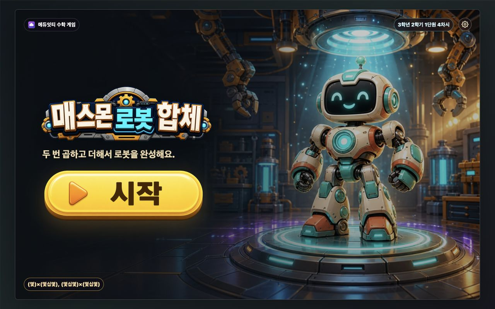
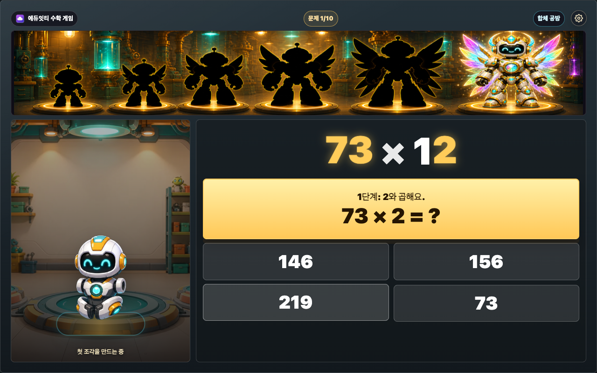
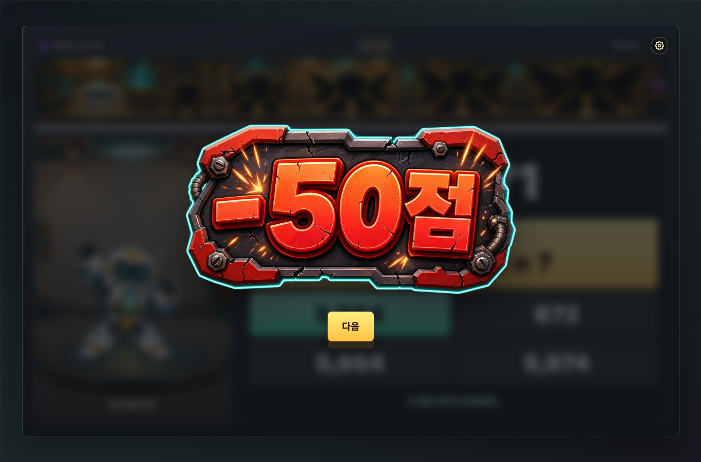
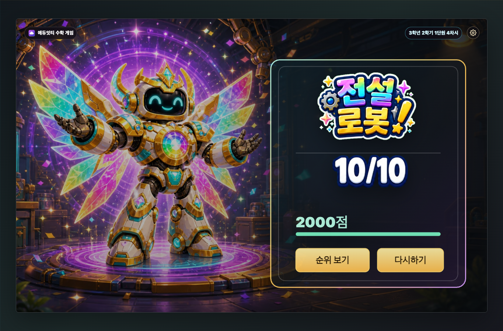

# 매스몬 로봇 합체

에듀잇티 수학 게임 시리즈 4탄입니다.

- 대상: 3학년 2학기 1단원 4차시
- 학습: (몇)×(몇십몇), (몇십몇)×(몇십몇)
- 문제: 두 자리 수를 일의 자리와 십의 자리로 나누어 계산하는 문제 10개 랜덤 출제
- 방식: `첫 부품 -> 두 번째 부품 -> 합체 덧셈` 3단계 선택형
- 보상: 한 문제를 끝낼 때마다 합체 점수 이미지가 1번 뜸
- 결과: 총 합체 에너지와 정답 수를 함께 측정해 소형 -> 중형 -> 대형 -> 거대 -> 초거대 로봇 매스몬 등급 중 도달 등급을 보여 줌. 무지개 코어를 얻으면 전설 로봇 매스몬이 열림
- 순위: 결과 뒤 `순위 보기`를 누르면 이번 주 전국 합체 순위 화면으로 이동. API 주소가 설정된 경우 서버가 만든 기록 이름으로 점수를 제출하고 10위까지 보여 줌
- 실행: `index.html`을 브라우저에서 열기

## 설계 의도

`매스몬 로봇 합체`는 1단원 곱셈의 종합 차시입니다. 학생은 한 번에 큰 곱을 맞히는 대신, 아랫수를 일의 자리와 십의 자리로 나누어 두 개의 곱셈 부품을 만든 뒤 더합니다.

예를 들어 `23 × 45`는 `23 × 5 = 115`, `23 × 40 = 920`, `115 + 920 = 1,035` 순서로 합체합니다. 2단계의 `23 × 40`은 3차시에서 배운 0 처리를 다시 쓰게 하고, 3단계의 덧셈은 두 값을 자리 맞춰 더하는 대표 오개념을 다룹니다.

보상은 로봇 합체 결과 하나로만 이어집니다. 문제 안에서 한 번이라도 틀리면 그 문제는 점수가 줄어드는 보상으로 처리해 일부러 틀려 보상을 노리는 흐름을 막습니다. 결과는 도감 수집이 아니라 한 판에서 도달한 합체 등급 자체가 보상입니다.

## 화면

대표 스크린샷은 `screenshots/` 폴더에 저장합니다.









최신 보상 화면은 생성형 점수 이미지가 배경 위에 바로 떠 보이도록 구성했습니다. 퍼센트 텍스트와 사각 카드 배경은 보이지 않고, `+50점`, `+100점`, `+200점`, `+500점`, `-50점`, `-100점`, `0점`, `무지개` 8개 점수 자산만 교체됩니다.

## RasterStage 이미지

- `fusion-workshop-generated.png`: 문제 화면 합체 공방 배경 생성 이미지 원본
- `fusion-workshop-generated.webp`: 문제 화면 합체 공방 배포용 WebP
- `play-robot-goal-strip-source.png`: 문제 화면 상단 로봇 목표 지도 생성 이미지 원본
- `play-robot-goal-strip-generated.webp`: 문제 화면 상단 로봇 목표 지도 배포용 WebP
- `play-robot-goal-*-source.png`: 결과 로봇 톤에 맞춰 다시 만든 상단 목표 지도 생성 원본 6장
- `play-robot-goal-small-generated.png/webp`: 소형 로봇만 컬러로 켜지고 나머지는 실루엣인 상단 목표 지도
- `play-robot-goal-medium-generated.png/webp`: 중형 로봇만 컬러로 켜지고 나머지는 실루엣인 상단 목표 지도
- `play-robot-goal-large-generated.png/webp`: 대형 로봇만 컬러로 켜지고 나머지는 실루엣인 상단 목표 지도
- `play-robot-goal-giant-generated.png/webp`: 거대 로봇만 컬러로 켜지고 나머지는 실루엣인 상단 목표 지도
- `play-robot-goal-ultra-generated.png/webp`: 초거대 로봇만 컬러로 켜지고 나머지는 실루엣인 상단 목표 지도
- `play-robot-goal-legend-generated.png/webp`: 전설 로봇만 컬러로 켜지고 나머지는 실루엣인 상단 목표 지도
- `cover-robot-mathmon-generated.png/webp`: 첫 화면 로봇형 매스몬 표지
- `result-small-generated.png/webp`: 소형 로봇 매스몬 결과 화면
- `result-medium-generated.png/webp`: 중형 로봇 매스몬 결과 화면
- `result-large-generated.png/webp`: 대형 로봇 매스몬 결과 화면
- `result-giant-generated.png/webp`: 거대 로봇 매스몬 결과 화면
- `result-ultra-generated.png/webp`: 초거대 로봇 매스몬 결과 화면
- `result-legend-generated.png/webp`: 무지개 코어 전설 로봇 매스몬 결과 화면
- `result-retry-generated.png/webp`: 다시하기 결과 화면
- `reward-score-*-source.png`: 보상 화면 고정 점수 이미지 생성 원본 8장
- `reward-score-*-generated.webp`: 보상 화면 고정 점수 배포용 투명 WebP 8장

첫 화면과 결과 화면은 생성 이미지를 RasterStage 배경으로 씁니다. 첫 화면은 제목·목표·시작 버튼을 표준 오버레이로 두고, 결과 화면은 큰 `초거대 로봇!` 같은 등급 문구와 `9/10` 같은 정답 수를 생성형 이미지로 보여 줍니다. 단일 SVG 동적 레이어는 `100%`, `순위 보기`, `다시하기` 버튼 표면만 그립니다. 첫 화면은 `cover-robot-mathmon-generated.webp`를 사용해, 매스몬 자체가 둥글고 친근한 로봇형 캐릭터로 보이도록 했습니다.

문제 화면은 생성 이미지 합체 공방 배경 위에 HTML/CSS 합체 보드를 올립니다. 상단 목표 지도는 3차시 지도처럼 생성 이미지가 로봇 실루엣과 합체 길을 담당합니다. 진행 상태는 하단바나 좌표 마커를 올리지 않고, 소형부터 전설까지 상태별 목표 지도 6장을 미리 준비해 현재 등급 로봇이 컬러로 켜진 이미지로 통째 교체합니다. 목표 지도는 `1280×190` 배너 슬롯으로 표시하고, 가로 배치는 그대로 유지합니다. 2026-07-08 최종 보정에서는 배너 높이를 190으로 늘리고, 아래 문제/왼쪽 상자 높이를 줄여 Stage 안에 맞췄습니다. 하단에 받침대가 한 번 더 보이던 중복 밴드는 이미지에서 잘라내고, 남은 장면을 1280×190으로 세로 재샘플해 한 장 이미지처럼 보이게 했습니다. 여섯 상태 모두 소형부터 전설까지 6개 로봇 슬롯이 보이고, 현재 로봇을 제외한 다섯 로봇은 검은 실루엣으로 남깁니다. 결과 화면 로봇과 같은 흰색 몸체, 청록 코어, 금색 포인트, 무지개 날개 계열로 맞췄습니다. 왼쪽 합체 공방은 하단 조각 카드 두 장을 걷어내고 로봇과 한 줄 상태만 보이게 정리했습니다. 교체 순간에는 강한 빛과 스캔 효과가 지나가 이미지가 바뀌는 티를 줄이고, 무지개 코어를 얻었을 때만 전설 로봇 이미지가 켜집니다. 보상 화면은 `+50점`, `+100점`, `+200점`, `+500점`, `-50점`, `-100점`, `0점`, `무지개` 생성형 점수 이미지 8장만 바꿔 보여 줍니다. 이 점수 이미지는 투명 WebP라 보상 배경 위에 바로 떠 보이고, 네모 카드처럼 잘린 배경은 없습니다. 결과 화면 6장도 등급별 몸집, 색, 배경 에너지 차이가 분명하게 보이도록 다시 생성했습니다. 부품 1, 부품 2, 합체 수는 학생의 선택에 따라 채워지며, 마지막 단계에서 두 부품이 가운데로 합쳐지는 CSS 연출이 적용됩니다.

## 작업실 파일 구성

- `index.html`: 게임 본문
- `cover-robot-mathmon-generated.webp`: 첫 화면 로봇형 매스몬 표지
- `play-robot-goal-*-generated.webp`: 문제 화면 상단 로봇 목표 지도 상태 이미지 6장
- `fusion-workshop-generated.webp`: 문제 화면 합체 공방 배경
- `reward-score-*-generated.webp`: 보상 화면 고정 점수 이미지 8장
- `result-*-generated.webp`: 합체 등급별 결과 RasterStage 배경
- `result-title-*-generated.webp`: 합체 등급별 결과 생성형 타이틀 이미지
- `eduitit-logo-mark.png`: 에듀잇티 로고
- `../_shared/scoreboard/*`: 공통 전국 순위 배경, 생성형 타이틀 이미지, SVG UI, API 브리지
- `screenshots/`: 화면별 스크린샷
- `REPORT.md`: 게임 설명, 화면 흐름, 보상 구조
- `QUALITY_AUDIT.md`: 1-1, 1-2 기준 비교와 보강 기록

학생용 static 사본에는 실행에 필요한 `index.html`, WebP 배경, 로고, 문서만 복사합니다. PNG 원본과 `screenshots/`는 작업실에 보관합니다.

## 검증 산출물

- `screenshots/comparison-1-1-1-2-1-4.png`: 1-1, 1-2, 1-4 화면 비교
- `screenshots/raster-assets-contact-sheet.png`: 최종 RasterStage 이미지 세트
- `screenshots/play-robot-goal-result-matched-contact-sheet.png`: 1280×190 상단 목표 지도 6종
- `screenshots/reward-score-contact-sheet.png`: 보상 점수 이미지 8종 렌더링 상태
- `screenshots/04-reward.png`, `screenshots/07-defect-reward.png`: 최신 투명 배경 보상 화면
- `screenshots/08-result-retry.png`: 정답 수와 에너지가 부족한 재도전 결과

## 전국 순위 백엔드 연결

기본 파일만 열면 순위 기능은 꺼진 안내 상태로 동작합니다. 실제 서버를 붙일 때는 게임을 열기 전에 아래 값을 주입합니다.

```html
<script>
  window.MATHMON_SCOREBOARD_API_URL = "https://your-scoreboard-api.example.com";
</script>
```

연동 위치는 `index.html`의 `SCOREBOARD_API_URL`, `scoreboardBridge`, `scoreboardAnswers`, `scoreboardScreen`입니다. 4차시는 `partial1`, `partial2`, `fusion` 세 단계 선택과 합체 보상을 서버에 보냅니다. 자세한 업체 인계 문서는 `../scoreboard-api/docs/GAME_INTEGRATION.md`를 기준으로 합니다.
