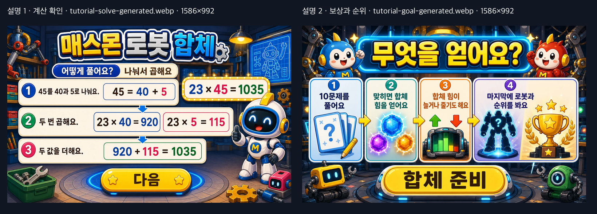

# 매스몬 로봇 합체 수정 보고서

<!-- CURRENT-PUBLIC-RUNTIME:START -->

## 현재 공개 실행본

- 보고서 기준: `eduitit-current-public-report-v1`
- 공개 입력 커밋: `ff5ac0d6d20a81da93d4af8f635f0eea1163a3cf`
- 입력 커밋 시각: `2026-09-07T07:00:11+09:00`
- 제작 보고서 원본 SHA-256: `ed355af0057c4fa3c41f76f98b2f1676da4a0245f46d2ce4763338384aa5ab0f`
- 실제 실행 진입점: `3-2-1-4-mathmon-fusion/index.html`
- 실행 진입점 SHA-256: `b642d593416dd888fbc6182b78612eee0d54d0f1b0e3938f7566df9c7fc21181`
- Pages 파일 집합 SHA-256: `143e83ac739b965b8cfe8cf96b5c694b742b1e0103a8d28b16432cda5500016c` (94개)
- 상세 화면 증거: 이전 검수 자료이며 현재 실행본의 최신 화면 근거로 사용하지 않음
- 공개 페이지: https://kakio426.github.io/eduitit-math-3-2/3-2-1-4-mathmon-fusion/
- 공개 보고서: https://github.com/kakio426/eduitit-math-3-2/blob/main/3-2-1-4-mathmon-fusion/REPORT.md

<!-- CURRENT-PUBLIC-RUNTIME:END -->

최종 수정일: 2026-09-06

## 2026-09-06 공개 실행본 최신화

9월 6일 공개 실행본에는 문제 단계 안내와 결과 화면 정리, 독립 실행을 위한 공용 파일 묶음이 반영되었습니다.

- 문제 단계 안내를 `단계 이름 / 이번 행동 / 계산식`으로 나누고, 계산식을 더 크게 배치했습니다.
- 결과 화면에서는 내부 합체 힘 수치와 진행 막대를 숨기고, 완성 로봇·결과명·정답 수·다시하기에 집중하도록 정리했습니다.
- 결과 화면의 `순위 보기` 버튼은 숨기고, 생성 이미지로 만든 `다시하기` 버튼과 실제 클릭 영역을 같은 위치에 맞췄습니다.
- 정답 수 이미지를 결과판 안쪽으로 옮겨 결과명·정답 수·다시하기가 같은 축에서 읽히도록 맞췄습니다.
- 공용 브랜드, 시작 버튼, 정답 수, 다시하기, 순위 화면, 배경 음악 파일을 차시 내부 `assets/runtime-vendor/`에 묶었습니다. 공개 페이지는 상위 폴더의 공용 파일 없이도 실행됩니다.
- `mathmon-result-qa-v1` 결과 QA는 컴퓨터와 태블릿 가로 화면에서 PASS이며, 현재 실행 파일과 QA 의존 파일의 SHA-256도 일치합니다.

현재 학생 흐름은 결과 화면에서 완성 로봇과 실제 정답 수를 확인한 뒤 `다시하기`로 새 게임을 시작하는 구조입니다. 순위 서버 연동 코드는 보존되어 있지만 결과 화면에서는 순위 이동 버튼을 표시하지 않습니다.

## 2026-08-23 공통 보상 정책 v2 검수

- 확률·점수·결과 기준은 `_shared/contracts/mathmon-unified-reward-v2.json`의 `mathmon-unified-reward-v2`를 단일 기준으로 사용합니다.
- 처음에 맞힌 문제는 `69% 보통 / 10% 작은 하락 / 12% 큰 보상 / 5% 대박 / 3.8% 그대로 / 0.2% 특별`입니다.
- 한 번이라도 틀린 문제는 정답 보상표를 다시 쓰지 않습니다. `50% 작은 감점 / 50% 그대로`만 나오며, 양수·대박·특별 보상은 나오지 않습니다.
- 따라서 오답은 정답보다 불리하지만 무조건 감점되지는 않습니다. 누적값을 지우는 `0으로 초기화`도 쓰지 않습니다.
- 1~4단원 17개 실행본을 대상으로 경계값 검사와 차시당 10만 회 확률 시뮬레이션을 통과했습니다. 아래 제작 이력에 남은 v1 명칭이나 예전 확률표는 현재 실행 기준이 아니며 이 절의 v2 기준으로 대체됩니다.


기존 대규모 수정일: 2026-07-10

## 1. 개요

`매스몬 로봇 합체`는 3학년 2학기 1단원 4차시의 (몇)×(몇십몇), (몇십몇)×(몇십몇)을 연습하는 게임입니다. 학생은 아래 수를 일의 자리와 십의 자리로 나누어 두 곱셈 조각을 만들고, 마지막에 두 값을 더해 로봇을 완성합니다.

학생 목표 문장은 `두 번 곱하고 더해서 로봇을 완성해요.`입니다.

## 2. 이번 수정의 핵심

이번 수정에서는 기존 화면 구조를 유지하면서 정확성과 결과 신뢰도를 보강했습니다.

- 잘못된 수 모형이 들어 있던 계산 설명 이미지를 정확한 식 중심 이미지로 교체
- 정답을 고른 직후 현재 계산식의 `?`가 실제 답으로 바뀌는 확인 상태 추가
- `합체 점수`, `합체 에너지`, `합체 힘`을 학생 화면에서 `합체 힘`으로 통일
- 보상 이미지와 문구를 이벤트 원래 값이 아닌 실제 점수 변화량에 맞춤
- 무지개 보상 이미지를 `무지개`에서 `+800점`으로 교체
- 설정의 배경 소리 스위치를 실제 반복 음악 재생과 연결
- 0점부터 시작하는 구조에서 도달하지 않던 `다시 도전` 결과 분기 제거
- 서버가 세션 seed로 문제, 정답, 보상을 다시 계산하도록 4차시 전용 검증 추가

## 3. 학습 흐름

```text
첫 화면
-> 계산 설명
-> 보상과 순위 설명
-> 문제 1단계
-> 정답 확인
-> 문제 2단계
-> 정답 확인
-> 두 값 더하기
-> 완성식과 합체 연출
-> 합체 힘 보상
-> 10문제 완료
-> 로봇 결과
-> 다시하기
```

문제 화면은 한 번에 한 행동만 크게 보여 줍니다. 현재 곱할 자리만 노란색으로 강조하고, 선택지는 한 덩어리로 유지합니다.

정답을 고르면 다음 단계로 즉시 바뀌지 않습니다. 예를 들어 `7×5=?`에서 35를 고르면 카드가 초록색으로 바뀌고 `7×5=35`, `5와 곱한 값은 35예요.`가 보인 뒤 다음 단계로 넘어갑니다.

## 4. 생성 이미지 수정

### 계산 설명

`tutorial-solve-generated.webp`는 아래 식을 정확하게 보여 줍니다.

- `45 = 40 + 5`
- `23 × 40 = 920`
- `23 × 5 = 115`
- `920 + 115 = 1035`
- `23 × 45 = 1035`

기존 설명에서 개수와 식이 맞지 않던 수 모형은 제거했습니다. 생성 원본은 `tutorial-solve-source.png`, 배포본은 `tutorial-solve-generated.webp`이며 둘 다 `1586×992`입니다.

### 보상과 순위 설명

`tutorial-goal-generated.webp`는 아래 4단계만 보여 줍니다.

1. 10문제를 풀어요.
2. 맞히면 합체 힘을 얻어요.
3. 합체 힘이 늘거나 줄기도 해요.
4. 마지막에 로봇과 순위를 봐요.

### 무지개 보상

`reward-score-rainbow-generated.webp`의 보이는 글자를 `+800점`으로 바꿨습니다. 생성 원본은 평면 크로마키 배경의 `reward-score-rainbow-source.png`로 보관하고, 배포본은 배경을 제거한 투명 WebP `960×615`입니다.




## 5. 보상 계산

보상은 `합체 힘` 하나입니다.

- 정답 문제: `+50`, `+100`, `-50`, `+200`, `+500`, `0`, `+800`
- 문제 안에서 첫 선택이 한 번이라도 틀렸을 때: `-100`
- 점수 범위: `0~8000`
- 결과 기준: 소형 0, 중형 100, 대형 200, 거대 500, 초거대 1500, 전설 2000

점수 적용 뒤 `actualDelta`를 계산해 이미지와 문구를 정합니다. 따라서 0점에서 `-100`이 나와도 아래처럼 표시합니다.

- 점수: `0점`
- 이미지: `reward-score-zero-generated.webp`
- 문구: `합체 힘은 그대로예요.`

50점에서 `-100`이 나오면 실제 변화량인 `-50점` 이미지와 문구를 보여 줍니다. 서버 제출에는 원래 이벤트 `leak/-100`을 남겨 오답 판정은 유지합니다.


## 6. 결과 화면

0점부터 소형 로봇이므로 별도 실패 결과는 도달하지 않았습니다. 이 분기를 제거하고 모든 결과가 소형부터 전설까지 6단계 안에서 끝나도록 정리했습니다.

- 합체 힘 0점: 소형 로봇과 실제 정답 수를 표시
- 합체 힘 2000점 이상: 전설 로봇과 실제 정답 수를 표시
- 모든 결과: 완성 로봇, 결과명, 실제 정답 수, `다시하기`
- 결과 화면에서는 합체 힘 수치·진행 막대·`순위 보기`를 표시하지 않음

예전 `result-retry-*`, `result-title-retry-*`, `08-result-retry.png`는 삭제하지 않고 `_archive/legacy-retry-state/`로 옮겼습니다.


## 7. 순위 서버 검증

새 파일 `scoreboard-api/src/validators/fusion-validator.ts`가 4차시 전용 검증을 맡습니다.

서버는 세션 seed로 다음을 다시 만듭니다.

- (한 자리)×(두 자리) 5문제
- (두 자리)×(두 자리) 5문제
- 문제 순서
- `partial1`, `partial2`, `fusion` 정답
- 문제별 랜덤 보상

클라이언트가 보낸 `expected`를 정답으로 믿지 않습니다. 조작된 정답값은 `fusion_expected_answer_mismatch`, seed와 다른 보상은 `fusion_reward_seed_mismatch`로 거절합니다. 오답이 있었던 문제는 `leak/-100`만 허용합니다.

공통 순위 브리지의 `start/reset`은 세션 Promise를 반환하도록 바꿨습니다. 4차시는 문제 시작 전에 이 Promise를 기다려 서버 seed와 브라우저 seed가 어긋나지 않게 했습니다.

## 8. 배경 소리

Tallbeard Studios의 CC0 번들 플레이어 13번 `Sketchbook 2025-11-26`을 사용합니다. OGG 원본과 출처·라이선스·해시는 `_shared/audio/music/tallbeard/sketchbook-2025-11-26/`에 보관합니다.

- 게임 시작: 배경 소리가 켜져 있으면 약 70.6초 OGG를 Web Audio 버퍼로 불러와 반복 재생
- 기본 믹스: 최대 gain `0.025`, 시작·중지 `1.2초` 페이드
- 정답·보상·결과 효과음: 배경음을 gain `0.008`까지 잠깐 낮춘 뒤 복귀
- 배경 소리 끄기: 페이드 후 재생 중지
- 다시 켜기: 처음부터 재생
- 탭 숨김: 즉시 중지
- 다시 보임: 설정이 켜져 있으면 다시 시작

효과 소리는 기존처럼 별도 스위치와 키를 사용합니다.

## 9. 화면 QA

아래 PNG 목록은 2026-07-10 수정 당시의 사람 검토 자료입니다. 현재 9월 실행본의 최신 판정은 `screenshots/result-qa-receipt.json`의 컴퓨터·태블릿 가로 PASS 기록을 기준으로 합니다.

### 컴퓨터 `1280×800`

- 첫 화면: `screenshots/01-cover.png`
- 설명 1·2: `screenshots/02-tutorial-solve.png`, `screenshots/03-tutorial-goal.png`
- 문제 1단계: `screenshots/04-problem-step1.png`
- 정답 확인: `screenshots/05-problem-confirmed.png`
- 문제 2단계: `screenshots/06-problem-step2.png`
- 무지개 보상: `screenshots/05-reward-rainbow.png`
- 변화 없음 보상: `screenshots/07-reward-zero.png`
- 오답 뒤 실제 변화량 0: `screenshots/07-defect-reward.png`
- 소형·전설 결과: `screenshots/08-result-small.png`, `screenshots/06-result-legend.png`

### 태블릿 가로 `1024×768`

- 첫 화면: `screenshots/06-tablet-cover.png`
- 설명 1·2: `screenshots/09-tablet-tutorial-solve.png`, `screenshots/10-tablet-tutorial-goal.png`
- 문제 1·2단계: `screenshots/08-tablet-problem.png`, `screenshots/11-tablet-problem-step2.png`
- 보상: `screenshots/12-tablet-reward-zero.png`
- 결과: `screenshots/13-tablet-result-legend.png`

### 텍스트 넘침·요소 겹침 QA

위 두 화면 크기에서 첫 화면, 설명 2장, 문제 1·2단계, 정답 확인, 보상 모달, 소형·전설 결과를 확인했습니다.

- 문서 스크롤 크기가 viewport를 넘지 않음
- 보이는 요소가 `.stage-shell` 밖으로 나간 상태 0개
- 문제, 선택지, 상단 목표 지도, 설정 버튼 사이 겹침 0개
- 보상 이미지와 다음 버튼 겹침 0개
- 결과 SVG 버튼 표면과 HTML hitbox가 같은 좌표 안에 있고 패널 경계를 넘지 않음

### Humanizer 학생 문구 QA

첫 화면 목표, 설명 이미지, 문제 지시문, 정답 확인, 힌트, 보상, 결과 문구를 다시 읽었습니다.

- `합체 점수`, `합체 에너지`를 `합체 힘`으로 통일
- `합체 공방`을 문제 상단에서 `로봇 합체`로 변경
- `측정 중`을 `확인 중`으로 변경
- 한 문장에 행동 하나만 남김
- `부분곱`, `게이트`, `메커니즘` 같은 제작자 말은 학생 화면에 사용하지 않음

## 10. 정적·백엔드 검증

- `bun test ./tests/lesson-validator.test.ts`: 13개 통과
- `bun run check`: 린트·타입 검사와 전체 테스트 20개 통과
- `bun run typecheck`: 통과
- 프런트엔드 seed `12345`와 서버 seed `12345`의 문제 10개·보상 10개 일치
- inline script 파싱: 통과
- `node scripts/check-stage-ratio.mjs`: 통과
- `git diff --check`: 통과
