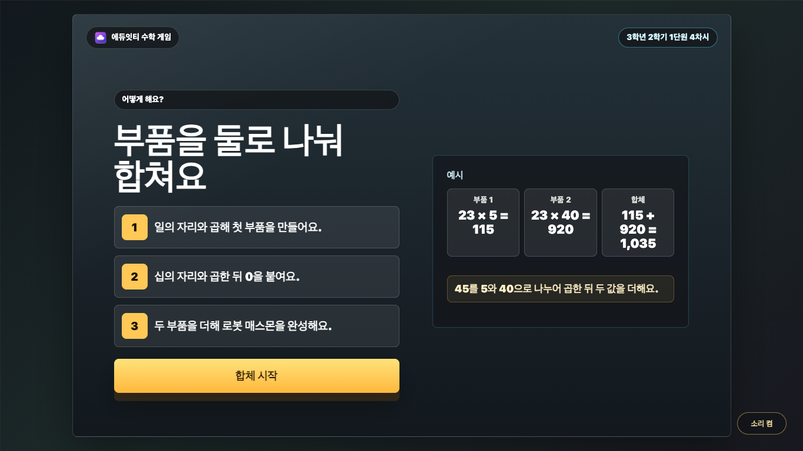
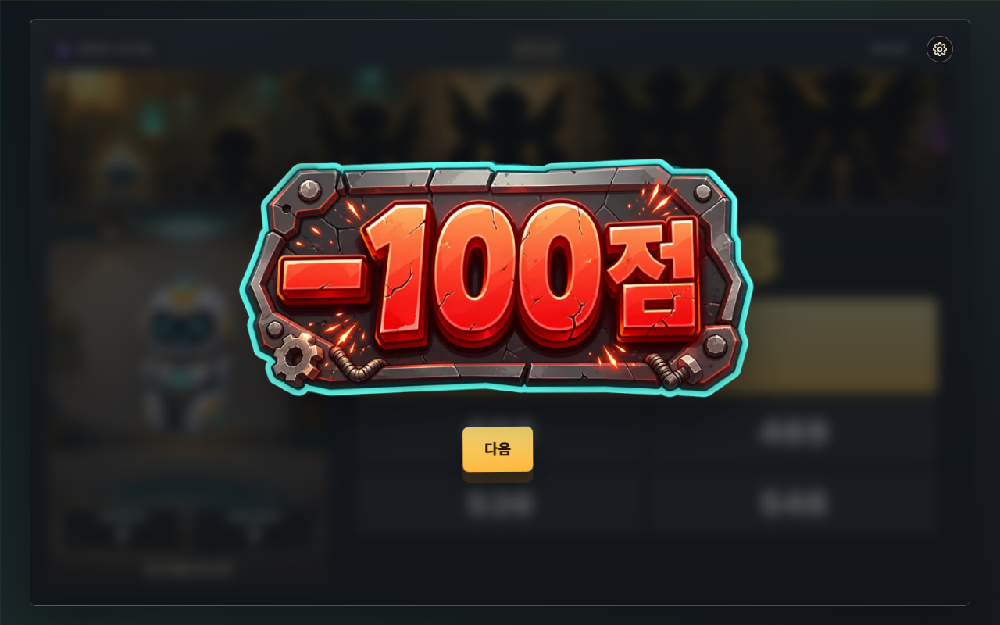
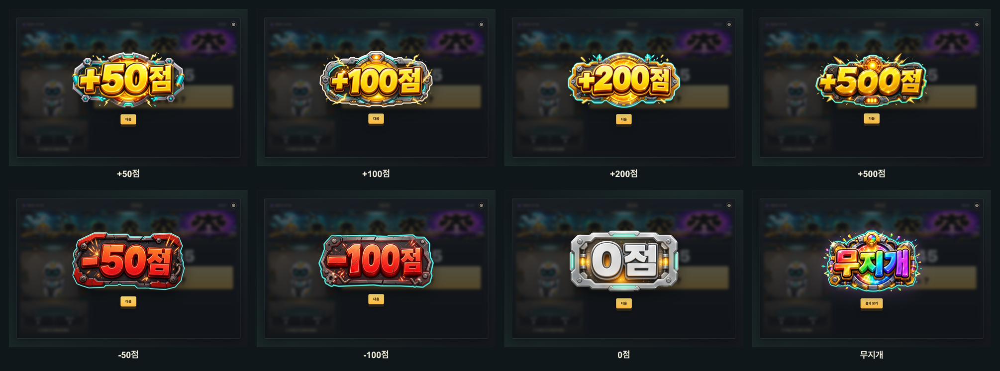
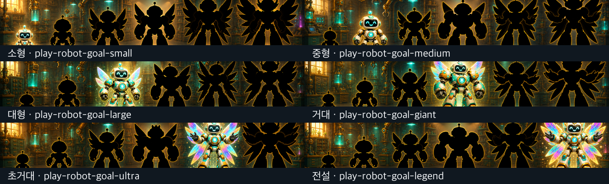

# 매스몬 로봇 합체 설명 보고서

## 1. 개요

`매스몬 로봇 합체`는 3학년 2학기 1단원 4차시에서 다루는 (몇)×(몇십몇), (몇십몇)×(몇십몇) 계산을 게임 흐름으로 연습하는 에듀잇티 수학 게임입니다. 학생은 아랫수를 일의 자리와 십의 자리로 나누어 두 곱셈 부품을 만들고, 마지막에 두 값을 더해 최종 곱을 완성합니다.

핵심 목표는 `두 번 곱하고 자리 맞춰 더하는 과정`을 눈에 보이는 합체 보드로 반복하게 만드는 것입니다.

## 2. 학습 설계

- 문제 유형: (몇)×(몇십몇), (몇십몇)×(몇십몇)
- 문제 은행: 두 유형을 섞어 매 판 10문제 랜덤 추출
- 라운드 길이: 10문제
- 입력 방식: 부분곱 1, 부분곱 2, 합체 덧셈 3단계 4지선다 선택
- 1단계: `윗수 × 아랫수의 일의 자리` 값을 골라 첫 부품 완성
- 2단계: `윗수 × 아랫수의 십의 자리`를 계산한 뒤 0을 붙인 값을 골라 두 번째 부품 완성
- 3단계: 두 부분곱을 더해 최종 곱 완성
- 오답 설계: 받아올림 실수, 0 빠뜨림, 부분곱2를 십의 자리로 밀지 않고 더하는 자리 어긋난 덧셈을 대표 오답으로 포함
- 보상: 한 문제 완료마다 합체 점수 이미지 1장을 보여 줌. 정답 문제는 `+50점`, `+100점`, `+200점`, `+500점`, `-50점`, `0점`, `무지개` 중 하나가 나오고, 오답이 있었던 문제는 `-100점`으로 처리. 어떤 보상이 나와도 10문제를 모두 푼 뒤에만 결과로 이동
- 결과 등급: 합체 에너지와 정답 수 조건을 함께 사용해 소형 -> 중형 -> 대형 -> 거대 -> 초거대 합체 중 하나를 공개
- 비밀 등급: 무지개 코어를 얻으면 전설 합체 결과가 열림
- 최종 보상: 도달한 합체 등급 자체가 보상이며, 매스몬 도감 수집 구조는 사용하지 않음

### 교육적 의도

두 자리 수 곱셈은 답만 맞히면 어떤 자리에서 실수했는지 흐려지기 쉽습니다. 이 게임은 `23 × 45`를 `23 × 5`, `23 × 40`, `115 + 920`으로 분리해 보여 줍니다. 특히 두 번째 부분곱에서 0을 빠뜨리는 실수와, 마지막 덧셈에서 `115 + 92`처럼 자리 맞춤을 놓치는 실수를 선택지 안에 넣어 대표 오개념을 다시 점검하게 했습니다.

합체 보상은 단일 중심 보상입니다. 보상 화면에서는 퍼센트 대신 생성형 점수 이미지를 크게 보여 주고, 한 판이 끝난 뒤 내부 합체 힘과 정답 수를 측정해 완성 로봇 등급을 공개합니다. 결과는 차시 자체 완결형 보상이며, 2차시의 행성 도달 구조와 같은 방식으로 `도달 등급`을 보여 줍니다.

## 3. 게임 흐름

```text
첫 화면 -> 설명 1(나누어 곱하기) -> 설명 2(합체와 순위 목표) -> 부품 1 -> 부품 2 -> 합체 덧셈 -> 합체 점수 이미지 -> 다음 문제 -> 10문제 완료 -> 에너지 측정 -> 로봇 매스몬 등급 결과 -> 전국 순위
```

학생은 먼저 첫 곱셈 부품을 고릅니다. 예를 들어 `23 × 45`에서는 `23 × 5 = 115`를 고릅니다. 다음에는 십의 자리 4가 40을 뜻한다는 것을 확인하며 `23 × 40 = 920`을 고릅니다. 마지막으로 `115 + 920 = 1,035`를 골라 로봇 합체를 완성합니다.

## 4. 화면별 설명

### 첫 화면

첫 화면은 `cover-generated.webp`를 RasterStage 배경으로 사용합니다. 로봇형 매스몬이 있는 대표 장면 위에 GPT Image로 만든 독립 타이틀 아트 `title-poster-generated.webp`를 얹고, 시작 버튼은 별도 생성형 버튼 자산 `start-button-generated.webp`로 보여 줍니다. 실제 클릭은 같은 크기의 HTML 버튼이 맡고, 접근성용 실제 제목은 숨김 텍스트로 유지합니다.


### 설명 화면



설명 화면은 생성 이미지 2장 흐름입니다. 첫 장 `tutorial-solve-generated.webp`는 `45 = 40 + 5`, `23 × 40`, `23 × 5`, `920 + 115`처럼 아래 수를 둘로 나누어 따로 곱한 뒤 더하는 방법을 보여 주고, 버튼은 `다음`입니다. 둘째 장 `tutorial-goal-generated.webp`는 10문제를 풀며 합체 힘을 얻고 마지막에 로봇 등급과 전국 순위를 확인한다는 목표를 보여 줍니다. HTML은 숨김 접근성 설명, `data-tutorial-step`, 투명 hitbox만 맡고 보이는 설명 UI를 다시 그리지 않습니다.

학생이 실제로 누르는 둘째 장 행동은 `합체 준비`입니다.

### 문제 화면

문제 화면은 왼쪽에 로봇 합체 상태, 오른쪽에 문제식과 선택지를 둡니다. 왼쪽 로봇 영역은 방금 만든 값이 어느 부품으로 들어갔는지만 보여 주는 보조판으로 줄이고, 오른쪽 계산판에는 큰 문제식, 현재 식, 선택지를 한 흐름으로 배치했습니다.

합체 보드는 부품 1, 부품 2, 합체 수 세 칸으로 구성됩니다. 각 단계가 끝나면 해당 부품 칸이 채워집니다. 왼쪽 로봇은 생성형 스프라이트 4장으로 `대기 -> 첫 조각 결합 -> 둘째 조각 결합 -> 완성` 상태를 바꾸고, 부품이 날아와 붙는 CSS 모션으로 정답 확인을 보여 줍니다. 마지막 단계에서는 두 부품이 합쳐진 뒤 완성 수가 노란 코어처럼 강조됩니다. 문제 화면의 공방 배경은 `fusion-workshop-generated.webp`를 사용하고, 합체 부품과 보드 상태는 HTML/CSS로 반응하게 했습니다.

학생 풀이 흐름 QA에서는 기존 화면이 `46 × 19`와 `먼저 9와 곱해요`를 보여 주는 데서 멈춰, 학생이 왜 다음에 일의 자리와 곱하는지, 고른 값이 어디에 남는지 충분히 확인하기 어려운 상태로 판단했습니다. 수정 뒤에는 큰 흰 문제식의 윗수와 현재 아랫수 자리만 노란색으로 바뀌고 살짝 움직입니다. 현재 식 카드에는 `46 × 9 = ?`처럼 지금 풀 계산만 가운데에 보입니다. 정답 뒤에는 `9와 곱한 값은 414예요.`처럼 짧은 확인 문구와 왼쪽 부품 값이 먼저 바뀐 뒤 다음 단계로 넘어가게 했습니다.


### 보상 화면

한 문제의 3단계 계산이 끝나면 화면 중앙에 생성형 점수 이미지가 뜹니다. 보이는 값은 `+50점`, `+100점`, `+200점`, `+500점`, `-50점`, `-100점`, `0점`, `무지개` 8장으로 고정했습니다. 제목, 긴 설명, CSS 숫자는 보이지 않게 숨기고, 학생 화면에는 점수 이미지와 `다음` 또는 `결과 보기` 버튼만 남겼습니다.

정답 문제는 여러 점수 이미지 중 하나가 랜덤으로 나오며, 문제 안에서 한 번이라도 틀리면 `-100점` 이미지만 나옵니다. `+500점`도 조기 종료가 아니라 큰 보상 이미지일 뿐이고, 어떤 보상이 떠도 10문제를 모두 푼 뒤에만 결과로 이동합니다. 내부 합체 힘 값은 기존 등급·순위 검증 범위를 유지해 백엔드 검증과 어긋나지 않게 했습니다.




8개 점수 이미지는 모두 투명 배경 WebP로 후처리했습니다. 그래서 보상 모달 위에서는 이미지 바깥 사각 배경이 보이지 않고, 생성형 타이틀 아트만 떠 있는 것처럼 보입니다.



### 결과 화면

결과 화면은 도달 등급별 RasterStage 배경 6장과 다시하기 배경 1장을 사용합니다. 소형, 중형, 대형, 거대, 초거대, 전설 합체 이미지가 따로 있으며, 등급이 올라갈수록 몸집, 색 포인트, 배경 에너지 효과가 분명히 커지도록 다시 생성했습니다. 큰 등급 문구는 `result-title-*-generated.webp` 생성형 타이틀 이미지가 맡고, 정답 수는 `_shared/result-count/result-correct-*-generated.webp` 생성형 숫자 이미지가 맡습니다. SVG 동적 레이어는 실제 합체 힘 값, `순위 보기`, `다시하기` 버튼 표면을 정확한 좌표에 그립니다. 실제 클릭은 투명 HTML hitbox가 맡습니다. 합체 힘 바와 버튼 사이에는 충분한 여백을 두어 붙어 보이지 않게 했습니다.


### 결과 화면 QA

`node scripts/qa-unit1-result-screens.mjs`로 1280x800, 1024x768에서 결과 화면을 열어 확인했습니다. CSS 결과 카드 잔존, 텍스트 넘침, Stage 밖 SVG 글자, 버튼 hitbox 충돌, SVG 큰 결과명 잔존, 고정 SVG 보조 라벨 잔존, 정답 수 폰트 텍스트 잔존은 0건입니다.

### 전국 순위 화면

결과 화면의 `순위 보기` 버튼을 누르면 마지막 전국 순위 화면으로 이동합니다. 이 화면은 `_shared/scoreboard` 공통 SVG 순위판을 사용하며, 생성 이미지는 축하 배경과 상단 타이틀 아트만 맡고 순위판·내 기록 박스·순위 행·버튼·동적 글자는 SVG가 직접 그립니다. 상단 상태 문장은 제거했고, API 주소가 없으면 순위 목록 영역 안에 `순위 기능이 켜지면 여기에 10위까지 보여요.` 안내만 보이며 게임 결과는 그대로 유지됩니다.

백엔드 연동 지점은 `index.html`의 `LESSON_ID = "3-2-1-4-mathmon-fusion"`, `SCOREBOARD_API_URL`, `scoreboardBridge`, `scoreboardAnswers`, `scoreboardScreen`입니다. 업체는 정적 HTML을 열기 전에 `window.MATHMON_SCOREBOARD_API_URL`만 주입하면 됩니다. 4차시는 서버 점수로 내부 합체 힘을 보내고, 문제마다 `partial1`, `partial2`, `fusion` 세 단계 선택과 합체 보상(`normal`, `smallExplosion`, `megaFuel`, `instantLaunch`, `emptyTank`, `rainbowFuel`, `leak`)을 함께 보냅니다. 보상 화면의 `+50점` 같은 생성형 점수 이미지는 학생에게 보이는 표현이고, 서버 검증용 `amount`는 기존 허용 범위를 유지합니다. `instantLaunch`는 기존 연동 호환을 위한 이벤트 id이며, 4차시에서는 조기 종료 없이 큰 보상 이미지로만 처리됩니다. `emptyTank`는 서버에서도 점수를 0으로 만들고, `rainbowFuel`은 결과값에 `rainbowCore`를 함께 보냅니다.

### 다시하기 결과 화면

합체 에너지가 부족하거나 정답 수가 부족하면 `result-retry-generated.webp`를 RasterStage 배경으로 사용합니다. 로봇 부품이 안전하게 쉬고 있는 장면 위에 다시 도전 문구와 `다시하기` 버튼을 보여 줍니다.

## 5. 매스몬 역할

4탄에서 매스몬은 둥글고 친근한 로봇형 캐릭터로 등장합니다. 학생이 얻는 중심 보상은 `로봇 매스몬 등급 도달`이며, 도감 수집 구조는 사용하지 않습니다.

## 6. 공개 패키지 구성

이 폴더는 별도 빌드 없이 바로 열 수 있는 정적 패키지입니다. 학생용 static 사본에는 실행에 필요한 파일만 복사하고, PNG 원본과 스크린샷은 작업실에 보관합니다.

- `index.html`
- `cover-generated.webp`
- `title-poster-source.png`, `title-poster-generated.png`, `title-poster-generated.webp`
- `start-button-source.png`, `start-button-generated.png`, `start-button-generated.webp`
- `tutorial-solve-source.png`, `tutorial-solve-generated.webp`
- `tutorial-goal-source.png`, `tutorial-goal-generated.webp`
- `tutorial-fulltext-source.png`, `tutorial-fulltext-generated.webp`(이전 포스터 보존본, 현재 실행 경로에서는 미사용)
- `tutorial-dynamic-bg-source.png`, `tutorial-dynamic-bg-generated.webp`(이전 비교안 보존본, 현재 학생 기본 흐름에서는 미사용)
- `play-robot-goal-strip-source.png`, `play-robot-goal-strip-generated.png`, `play-robot-goal-strip-generated.webp`
- `play-robot-goal-*-source.png`(상태별 목표 지도 생성 원본 6장)
- `play-robot-goal-*-generated.png`(상태별 목표 지도 runtime 배너 6장, 1280×190)
- `play-robot-goal-*-generated.webp`(상태별 목표 지도 배포용 WebP 6장, 1280×190)
- `fusion-workshop-generated.webp`
- `mathmon-rfa-01-standby.webp`
- `mathmon-rfa-02-one-part.webp`
- `mathmon-rfa-03-two-parts.webp`
- `mathmon-rfa-04-complete.webp`
- `reward-score-plus-50-source.png`, `reward-score-plus-50-generated.webp`
- `reward-score-plus-100-source.png`, `reward-score-plus-100-generated.webp`
- `reward-score-plus-200-source.png`, `reward-score-plus-200-generated.webp`
- `reward-score-plus-500-source.png`, `reward-score-plus-500-generated.webp`
- `reward-score-minus-50-source.png`, `reward-score-minus-50-generated.webp`
- `reward-score-minus-100-source.png`, `reward-score-minus-100-generated.webp`
- `reward-score-zero-source.png`, `reward-score-zero-generated.webp`
- `reward-score-rainbow-source.png`, `reward-score-rainbow-generated.webp`
- `result-small-generated.webp`
- `result-medium-generated.webp`
- `result-large-generated.webp`
- `result-giant-generated.webp`
- `result-ultra-generated.webp`
- `result-legend-generated.webp`
- `result-retry-generated.webp`
- `result-title-robots-source.png`, `result-title-*-source.png`, `result-title-*-transparent-raw.png`, `result-title-*-generated.webp`
- `eduitit-logo-mark.png`
- `README.md`
- `REPORT.md`
- `QUALITY_AUDIT.md`

브라우저에서 `index.html`을 열면 바로 실행됩니다.

작업실 보관물:

- `*-generated.png`: 생성 이미지 원본
- `_shared/mathmon/robot-fusion-action-pack/`: 로봇 합체 액션 생성 원본, 투명 PNG, WebP 배포본, 컨택시트
- `screenshots/*.png`: 화면 검증 스크린샷과 비교 시트

## 7. 검증 보강 기록

1-1 `매스몬 상자런`, 1-2 `매스몬 로켓발사 대작전`과 화면 증거를 비교해 부족했던 산출물을 보강했습니다.

- 성공 결과뿐 아니라 재도전 결과 화면을 실제 플레이로 캡처했습니다.
- 합체 등급별 RasterStage 이미지가 모두 준비되어 있는지 컨택시트로 확인했습니다.
- 학생 화면에서 쓰지 않는 `mathmon-8-unicornmon.png`는 4차시 패키지와 static 사본에서 제거했습니다.
- 첫 화면 정체성 혼선을 줄이기 위해 매스몬 자체를 로봇형 캐릭터로 재정의하고, 둥글고 친근한 로봇 매스몬 이미지 세트로 교체했습니다.

### 2026-07-01 문제 화면 UI 재정리

- 학생이 3초 안에 지금 할 일을 알 수 있도록 문제 화면을 왼쪽 로봇 상태판, 오른쪽 계산판의 2열 구조로 정리했습니다.
- 오른쪽 계산판에는 큰 문제식, 현재 식, 선택지만 남기고, 보상 장면과 긴 설명은 문제 풀이 흐름 밖으로 밀었습니다.
- 현재 단계 식은 카드 가운데에 고정하고, 큰 흰 문제식에서는 지금 곱하는 윗수와 아랫수 자리만 노란색으로 강조했습니다. 강조 숫자는 작은 숨쉬기 움직임으로 현재 쓰는 숫자임을 보여 줍니다.
- 상단 진행도와 장소 배지는 문제보다 커 보이지 않도록 같은 줄의 작은 보조 상태칩으로 맞췄습니다.
- 정답 뒤에는 선택지가 바로 사라지는 대신 방금 만든 값이 로봇 부품 칸에 들어가고, 한 줄 확인 문구가 보인 뒤 다음 단계로 넘어가게 했습니다.
- Humanizer 학생 문구 QA: `부분곱`, `합체 보드`, `정답 조건` 같은 제작자용 설명은 문제 풀이 화면에 쓰지 않고 `곱한 값`, `두 값을 더해요`, `답을 골라요`처럼 초3 학생이 바로 읽을 수 있는 말로 유지했습니다.
- 텍스트 넘침·요소 겹침 QA: 로컬 Chrome/Playwright에서 첫 화면, 설명 화면, 문제 1단계, 1단계 정답 확인, 문제 2단계, 2단계 정답 확인, 3단계, 보상 모달을 확인했습니다. 문제식, 현재 식 카드, 선택지, 피드백, 왼쪽 로봇 부품 값이 서로 덮이지 않고 화면 안에 들어오는 것을 확인했습니다.
- 큰 문제식 확대 QA: 1280×800과 1024×768에서 큰 문제식이 오른쪽 계산 상자 안에 들어오고 중앙 정렬되는지 확인했습니다. 분해 pill과 단계 칩은 렌더링되지 않으며, 현재 곱하는 숫자는 노란색과 작은 움직임으로 표시됩니다.

### 2026-07-01 로봇 합체 액션 자산 추가

- `_shared/mathmon/robot-fusion-action-pack/`에 4상태 로봇 합체 액션 팩을 등록했습니다. 생성 원본 스프라이트시트는 `raw-chromakey/mathmon-rfa-source-spritesheet.png`, 배포본은 `webp/mathmon-rfa-01-standby.webp`부터 `mathmon-rfa-04-complete.webp`까지입니다.
- 차시 실행 폴더에는 WebP 4장만 복사했습니다. 학생 화면에서는 정답 단계마다 로봇 이미지가 바뀌고, 마지막 합체 컷신에서는 완성 로봇 스프라이트가 중앙에 뜹니다.
- 모션 민감 사용자를 위해 `prefers-reduced-motion: reduce`에서는 부품 비행, 번쩍임, 충격파, 스파크 애니메이션을 끄고 상태 이미지만 즉시 바뀌도록 했습니다.

### 2026-07-01 상단 로봇 목표 지도 추가

- 문제 화면 상단을 3차시 `play-map-strip-generated.webp` 방식에 맞춰 생성 이미지 기반 목표 지도로 바꿨습니다. `play-robot-goal-strip-source.png`를 원본으로 보관하고, runtime에서는 상태별 1280×190 목표 지도 PNG 6장을 사용합니다.
- 로봇 목표 자체는 CSS 실루엣으로 그리지 않습니다. 생성 이미지 안에 소형부터 전설까지 이어지는 로봇 실루엣과 합체 길을 넣고, HTML은 접근성 상태와 전환 빛 효과만 맡습니다.
- 이 목표 지도는 별도 점수판이 아니라 기존 중심 보상인 합체 에너지를 시각화합니다. 로봇 외곽선에 맞추는 현재 표시, 하단 진행바, 원형 노드는 쓰지 않고 현재 단계 로봇이 켜진 목표판 이미지로 상태를 보여 줍니다.
- 목표 지도는 상단바 자체를 키우지 않고, 얇은 배너 안에서 로봇 실루엣과 발판이 모두 보이도록 이미지 구도를 조정했습니다. 문제 화면 과밀을 막기 위해 아래 계산 영역은 2열 구조 안에서 줄바꿈 없이 유지되도록 확인합니다.
- Humanizer 학생 문구 QA: 새로 보이는 문장형 안내는 넣지 않았습니다. 접근성 문구는 `멋진 로봇까지 가는 길`처럼 짧게 유지했습니다.

### 2026-07-01 상단 목표 지도 상태 이미지 실험

- 하단 에너지 레일과 원형 노드 오버레이를 제거했습니다. 목표 지도 위에는 좌표 마커, 동그라미, 진행바를 올리지 않습니다.
- `play-robot-goal-small-generated.png`부터 `play-robot-goal-legend-generated.png`까지 상태별 목표 지도 6장을 준비했습니다. 각 이미지는 같은 실루엣 목표판에서 현재 등급 슬롯이 해당 플랫폼에서 밝게 켜진 상태입니다.
- 로봇만 잘라 붙인 방식은 플랫폼과 배경이 직사각형으로 끊겨 보여 폐기했습니다. 현재 배포본은 기준 실루엣 목표판을 참조해 상태별 전체 배너를 다시 생성한 이미지이며, 로봇 주변 조명과 공방 배경이 한 장면으로 이어집니다.
- 상태별 목표 지도 6장을 runtime에 연결했습니다. 목표판 위에 별도 로봇 PNG/WebP를 얹지 않고, `play-robot-goal-*-generated.png` 이미지 자체를 점수 등급에 맞춰 통째로 바꿉니다.
- 이미지가 바뀌는 느낌을 줄이기 위해 교체 순간에는 목표 로봇 위치에서 빛 번짐이 터지고, 밝은 스캔 라이트가 목표판 전체를 지나갑니다. 모션 민감 설정에서는 전환 빛과 흔들림 애니메이션을 끕니다.
- 텍스트 넘침·요소 겹침 QA: `/Users/yubyeongju/ai mart/.omo/evidence/mathmon-fusion-goal-state-images/`에 1280×800 여섯 상태, 전환 중간 프레임, 1024×768 태블릿 상태 캡처를 남겼습니다. `summary.json` 기준 예전 하단바/노드/좌표 오버레이 셀렉터는 0개이고, 여섯 상태 모두 예상 이미지 파일로 교체되는 것을 확인했습니다.

### 2026-07-07 상단 목표 지도 재수정

- 실패 원인 1: 이전 1280×190 WebP 상태 배너는 파일 자체에서 맨 왼쪽 로봇의 몸과 발판이 잘려 runtime에서 제외했습니다.
- 실패 원인 2: 이후 만든 1280×260 PNG 상태 배너는 로봇은 보였지만 상단바가 너무 길어져 문제 화면을 누르는 방식으로만 맞출 수 있어 실패 자산으로 제외했습니다.
- 최종 기준: `play-robot-goal-small-generated.png`부터 `play-robot-goal-legend-generated.png`까지 6장을 다시 1280×190 PNG/WebP로 만들었습니다. 결과 화면의 보상 로봇과 같은 흰색 몸체, 청록 코어, 금색 포인트, 무지개 날개 계열로 맞췄고, 현재 단계 로봇 1개만 컬러로 켜지며 나머지 다섯 로봇은 검은 실루엣으로 남깁니다.
- runtime 연결: 목표판은 `aspect-ratio: 1280 / 190`으로 되돌리고, `GOAL_RAIL_ASSET_VERSION`은 `goal-state-20260707g`로 올렸습니다. 상단 목표판 위에 별도 로봇 PNG/WebP 오버레이는 없습니다.
- 컨택시트: `screenshots/play-robot-goal-result-matched-contact-sheet.png`에서 여섯 상태 모두 활성 로봇만 컬러이고, 3번째 이후 날개 흐름이 4번째 거대 로봇에도 이어지는 것을 확인했습니다.


- 텍스트 넘침·요소 겹침 QA: 로컬 Chrome(Playwright)에서 1280×800, 1024×768 문제 화면에 실제 시작 흐름으로 진입해 확인했습니다. 상단바 이미지는 natural size 1280×190으로 로드되고, 보기 4개가 모두 표시되며, Stage 밖 이탈 0건, 선택지 겹침 0건, 왼쪽 로봇 박스와 문제 박스 겹침 0건입니다. 최신 REPORT 대표 캡처는 `screenshots/03-problem.png`, 보상 캡처는 `screenshots/04-reward.png`와 `screenshots/07-defect-reward.png`입니다.
- 전환 보강: 상태 이미지가 갑자기 바뀌어 보이지 않도록 다음 배너 이미지를 숨은 레이어에 먼저 로드하고, 현재 배너가 에너지에 녹듯 어두워진 뒤 다음 배너가 밝게 올라오는 진화 전환을 추가했습니다. 일반 모션에서는 `.omo/evidence/mathmon-fusion-goal-evolution-transition/goal-evolution-transition-frames-localized.png`로 시작, 중간, 완료 프레임을 확인했고, `prefers-reduced-motion: reduce`에서는 즉시 교체됩니다.

### 2026-07-02 10문제 완료 흐름 핫픽스

- `완성 신호` 보상은 에너지 +10% 이벤트로만 처리하고, 결과 화면 이동 조건은 `현재 문제 번호가 10번째인가` 하나로 고정했습니다. 어떤 보상이 떠도 1~9번 문제 뒤에는 `다음`만 보입니다.
- 기존 연동 호환 때문에 이벤트 id `instantLaunch`는 유지하되, 4차시에서는 조기 종료 의미로 쓰지 않는다고 문서화했습니다.
- 번들 Chromium/Playwright에서 `Math.random()`을 0.9로 고정해 `완성 신호!`를 10번 연속 발생시켰습니다. 1~9번 보상 버튼은 모두 `다음`, 10번 보상 버튼만 `결과 보기`였고, 결과 화면의 정답 수는 `10/10`으로 확인했습니다.
- 같은 검증 중 1365×768 화면에서 선택지 그리드 높이가 부족해 1행과 2행 버튼 hitbox가 겹치는 문제를 발견했습니다. 목표판 높이와 문제 패널 행 높이를 조정해 선택지 그리드를 166px로 고정하고, 버튼 1행과 2행 사이에 10px 간격이 남는 것을 좌표로 확인했습니다.

### 2026-07-02 설명 화면 비교안 정리

- 설명 화면은 최종 채택 전 `image`, `svg`, `html` 세 가지 방식으로 비교했습니다. 현재 학생 기본 흐름은 `image` 하나로 고정했고, JS의 `TUTORIAL_VARIANTS`도 `image`만 허용합니다.
- 예전 `tutorial-fulltext-source.png`, `tutorial-fulltext-generated.webp`, `tutorial-dynamic-bg-source.png`, `tutorial-dynamic-bg-generated.webp`, SVG/HTML 설명 마크업은 비교용 보존물입니다. 현재 실행 경로에서는 `tutorial-solve-generated.webp`와 `tutorial-goal-generated.webp` 두 장만 학생에게 보입니다.
- Humanizer 학생 문구 QA는 최신 2장 흐름 기준으로 다시 정리했습니다. 화면 말은 `아래 수를 둘로 나눠요.`, `두 조각을 따로 곱해요.`, `두 값을 더해요.`, `합체 준비`처럼 초3 학생이 바로 읽을 수 있는 말로 유지했습니다.
- 로컬 Chrome과 배포본에서 1280×800 기본 진입 흐름을 다시 확인했습니다. `시작 → 설명 1장 → 다음 → 설명 2장 → 합체 준비 → 문제 화면` 순서로 동작하고, 이미지 로드, 투명 hitbox Stage 안 배치, 보이는 DOM 텍스트 overflow, 화면 밖 이탈이 0건이었습니다.

### 2026-07-01 결과 등급 이미지 재생성

- `result-small-generated.webp`부터 `result-legend-generated.webp`까지 결과 등급 6장을 image generation으로 다시 만들었습니다. 소형은 따뜻한 노란 공방, 중형은 파란 조명, 대형은 초록 에너지, 거대는 주황·금색 중량감, 초거대는 파랑·자홍 크리스털, 전설은 보라 포털과 무지개 날개가 보이도록 단계 차이를 키웠습니다.
- 오른쪽 점수/결과 HTML 슬롯이 읽히도록 각 결과 이미지의 오른쪽 영역은 비교적 비워 두었습니다. 큰 등급 문구는 별도 생성형 타이틀 이미지로 추가했고, 숫자와 버튼 표면은 동적 SVG가 맡습니다.
- 새 결과 이미지와 별도로, 상단 목표 지도 상태 6장은 기준 실루엣 목표판을 참조해 전체 배너 생성 방식으로 다시 만들었습니다. 최신 컨택시트는 `.omo/evidence/mathmon-fusion-result-regeneration/result-tier-contact.png`와 `.omo/evidence/mathmon-fusion-goal-seamless/seamless-runtime-contact.png`입니다.

### 2026-07-02 전국 순위 화면 추가

- 결과 화면에 `순위 보기` 버튼을 추가하고, 마지막 전국 순위 화면을 `_shared/scoreboard` 공통 SVG UI로 연결했습니다.
- 상단 `전국 합체 순위`는 따뜻한 금색 `scoreboard-title-fusion-generated.webp` 생성형 타이틀 이미지로 바꾸고, 기존 상단 상태 문구는 제거했습니다.
- 백엔드 연동 지점은 `LESSON_ID`, `SCOREBOARD_API_URL`, `scoreboardBridge`, `scoreboardAnswers`, `scoreboardScreen`입니다. 업체는 정적 HTML을 열기 전에 `window.MATHMON_SCOREBOARD_API_URL`만 주입하면 됩니다.
- 전국 순위 QA는 1280x800, 1024x768, 856x544에서 결과 화면 `순위 보기` 클릭, 전국 순위 화면 진입, 10행 샘플 렌더, `결과로` hitbox 복귀를 확인했습니다. 생성형 타이틀 가독성, 배경 겹침, 상단 상태 문구 제거, SVG `<text>` Stage 밖 이탈, 보이는 HTML 버튼 텍스트, `foreignObject`, 버튼 겹침 0건을 확인했습니다.
- 정적 검사는 `node --check _shared/scoreboard/scoreboard-ui.js`, 4차시 inline script 파싱, `node scripts/check-stage-ratio.mjs`, `git diff --check`를 통과했습니다.

### 2026-07-02 설명 화면 2장 이관

- 설명 화면을 생성 이미지 2장 흐름으로 바꿨습니다. 첫 장은 `tutorial-solve-source.png`와 `tutorial-solve-generated.webp`가 맡고, 아래 수를 둘로 나누어 따로 곱한 뒤 더하는 방법과 `다음` 버튼을 보여 줍니다.
- 둘째 장은 `tutorial-goal-source.png`와 `tutorial-goal-generated.webp`가 맡고, 문제를 맞히면 합체 힘을 얻고 마지막에 전국 순위를 볼 수 있음을 알려 줍니다.
- 기존 SVG/HTML 비교 흐름은 학생 기본 흐름에서 제외하고, 기본 variant를 `image` 하나로 고정했습니다. HTML은 접근성용 숨김 설명, 단계 전환 상태값, 투명 hitbox만 맡습니다.
- 첫 클릭은 `solve`에서 `goal`로 넘어가고, 둘째 클릭은 `합체 준비`로 첫 문제를 시작합니다. 학생 문구는 `아래 수를 둘로 나눠요.`, `두 조각을 따로 곱해요.`, `두 값을 더해요.`, `합체 준비`처럼 짧은 행동 말로 유지했습니다.
- 로컬 Chrome QA와 배포본 QA에서 1280×800 기준 `시작 → 설명 1장 → 다음 → 설명 2장 → 합체 준비 → 문제 화면` 흐름을 확인했고, 설명 이미지 표시, 버튼 aria-label, Stage 비율, inline script 파싱, `git diff --check`를 통과했습니다. 에듀잇티 운영 런처는 `https://kakio426.github.io/eduitit-math-3-2/3-2-1-4-mathmon-fusion/?v=3bc3c71&scoreboardApi=https%3A%2F%2Feduitit.site`를 iframe으로 엽니다.

### 2026-07-07 보상 점수 이미지 이관

- 보상 모달의 보이는 퍼센트 텍스트를 제거하고, 생성형 점수 이미지 8장으로 바꿨습니다. 학생 화면에 나오는 값은 `+50점`, `+100점`, `+200점`, `+500점`, `-50점`, `-100점`, `0점`, `무지개`뿐입니다.
- 각 자산은 image generation으로 만들고, 원본 `reward-score-*-source.png`와 배포본 `reward-score-*-generated.webp`를 차시 폴더에 보관했습니다. HTML/CSS 숫자나 로컬 폰트 합성으로 점수를 그리지 않습니다.
- 배포본 `reward-score-*-generated.webp` 8장은 가장자리와 연결된 어두운 생성 배경을 제거한 투명 WebP로 후처리해, 보상 화면에서 사각 카드 배경이 보이지 않게 했습니다.
- 보상 모달은 제목과 설명 문장을 `visually-hidden`으로 숨기고, 보이는 요소는 점수 이미지와 `다음` 또는 `결과 보기` 버튼만 남겼습니다.
- 내부 순위 검증용 `amount`는 기존 백엔드 허용 범위 안에 유지했습니다. 화면 점수 이미지는 학생에게 보이는 보상 표현이고, 결과 등급 계산은 기존 합체 힘 흐름을 그대로 사용합니다.
- Humanizer 학생 문구 QA: 새 접근성 문구는 `합체 점수 50점이 들어왔어요.`, `합체 점수 100점이 줄었어요.`, `이번 보상은 0점이에요. 다음 문제에서 다시 모아요.`처럼 짧게 유지했습니다. `퍼센트`, `결함 처리`, `이벤트` 같은 제작자 말은 보상 화면에서 보이지 않습니다.
- 텍스트 넘침·요소 겹침 QA: Playwright로 1365×900(실제 Stage 1280×800)과 1024×768에서 8개 보상 상태를 모두 캡처했습니다. `.omo/evidence/mathmon-fusion-reward-score-art/summary.json` 기준 Stage 밖 이탈 0건, 점수 이미지와 버튼 겹침 0건입니다. 대표 캡처는 같은 폴더의 `desktop-plus500.png`, `desktop-minus100.png`, `tablet-zero.png`, `tablet-rainbow.png`입니다.
- 투명 배경 재검증: Playwright로 같은 2개 화면 크기에서 8개 보상 상태를 다시 캡처했습니다. `.omo/evidence/mathmon-fusion-reward-alpha-qa/summary.json` 기준 실패 0건이며, 8개 WebP 모두 알파 채널과 투명 가장자리를 확인했습니다.
- 정적 검증: inline script 파싱, `node scripts/check-stage-ratio.mjs`, `git diff --check`, reward art 파일 존재 검사를 통과했습니다.
