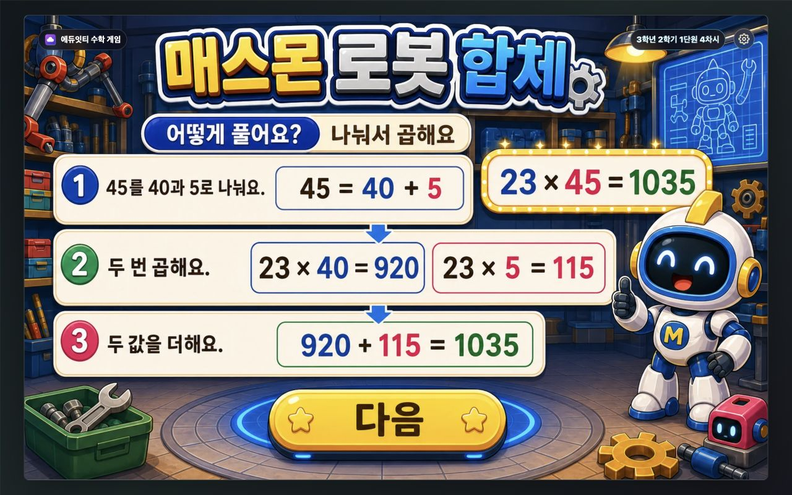
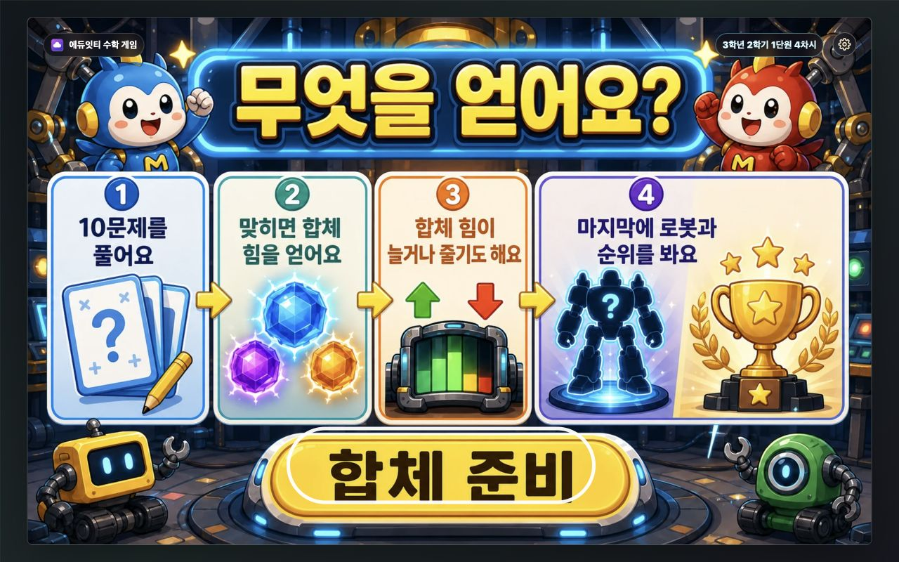
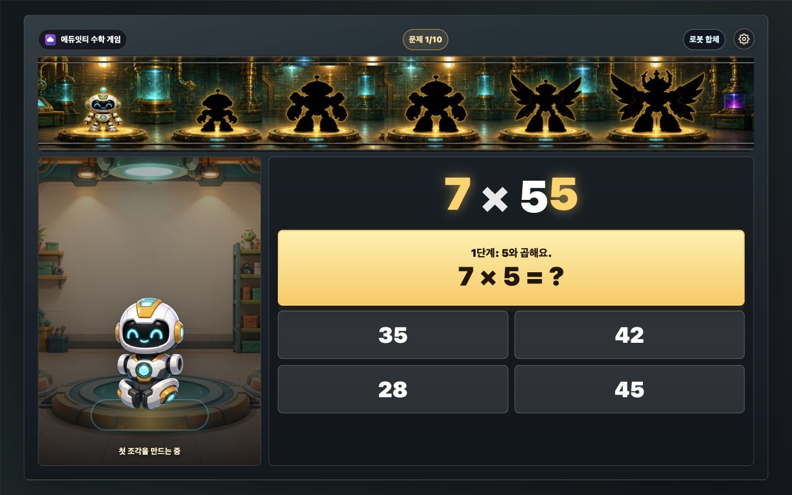
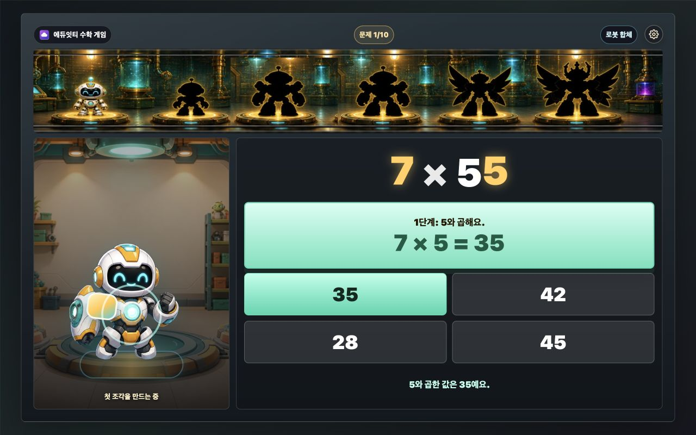
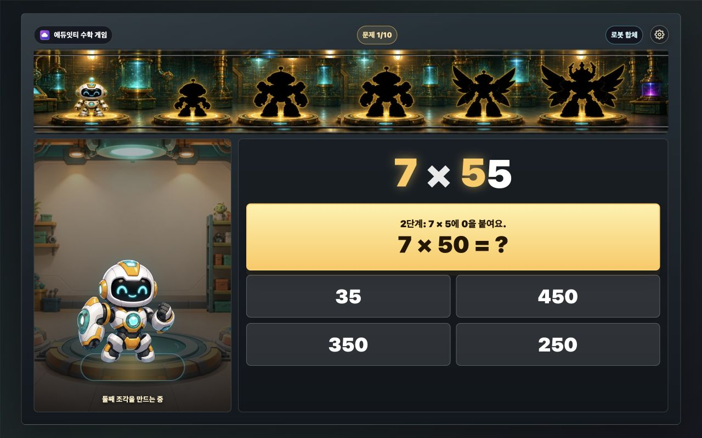
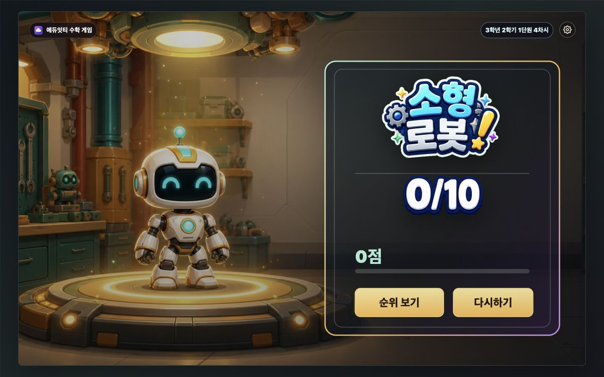
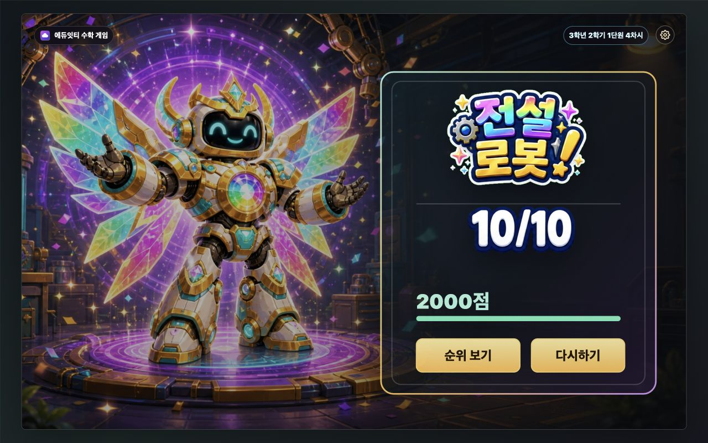
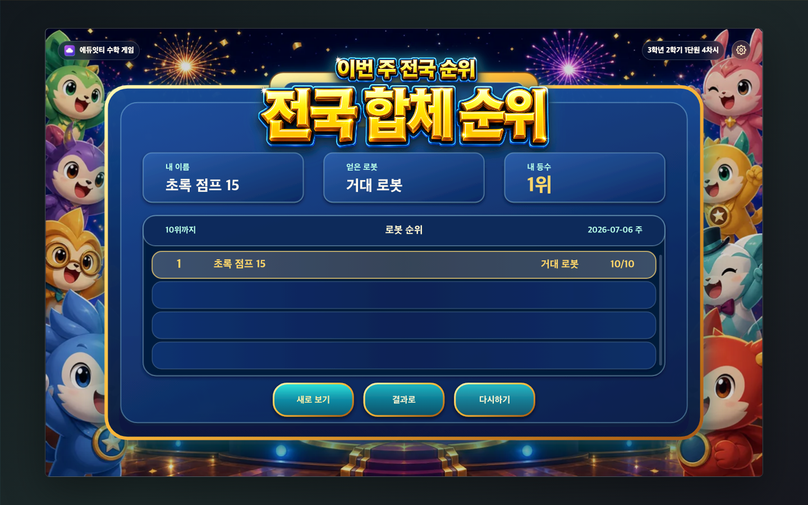
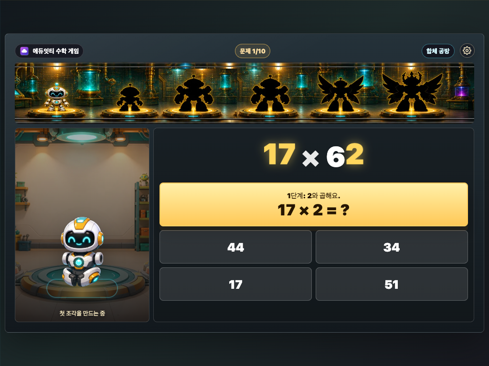
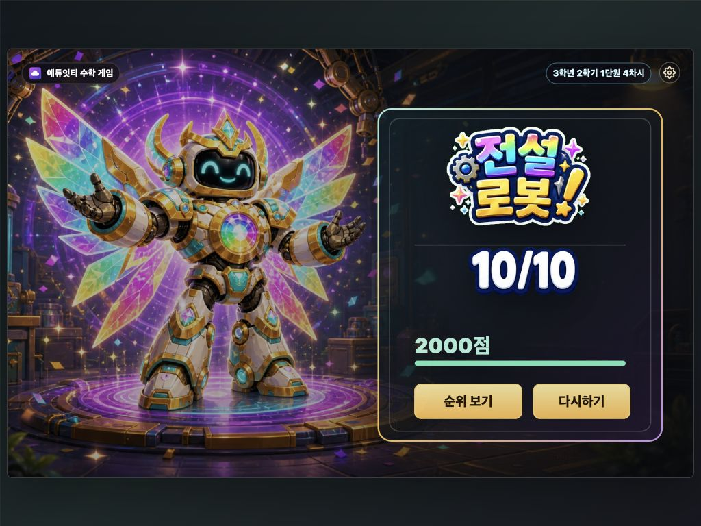

# 매스몬 로봇 합체 설명 보고서

## 바로가기

- [매스몬 로봇 합체 실행하기](https://kakio426.github.io/eduitit-math-3-2/3-2-1-4-mathmon-fusion/?scoreboardApi=https%3A%2F%2Feduitit.site)
- [GitHub 소스 보기](https://github.com/kakio426/eduitit-math-3-2/tree/main/3-2-1-4-mathmon-fusion)

> **콘텐츠 한 줄 소개**
> 아랫수를 십의 자리와 일의 자리로 나누어 두 번 곱한 뒤 더하고, 합체 힘을 모아 매스몬 로봇을 완성하는 게임입니다.

## 1. 개요

`매스몬 로봇 합체`는 3학년 2학기 1단원 4차시에서 (몇)×(몇십몇), (몇십몇)×(몇십몇)을 연습하는 에듀잇티 수학 게임입니다. 학생은 아랫수를 십의 자리와 일의 자리로 나눈 뒤 두 번 곱하고, 두 값을 더해 로봇을 완성합니다.

문제를 끝낼 때마다 합체 힘이 무작위로 늘거나 줄어듭니다. 마지막에는 모은 합체 힘에 따라 소형부터 전설까지 서로 다른 매스몬 로봇을 만납니다.

핵심 목표는 곱셈의 계산 과정을 한 단계씩 눈으로 확인하면서 `다음에는 더 큰 로봇을 만들고 싶다`는 마음으로 반복해서 도전하게 만드는 것입니다.

## 2. 학습 설계

- 문제 유형: (몇)×(몇십몇), (몇십몇)×(몇십몇)
- 라운드 길이: 10문제
- 문제 구성: (한 자리)×(두 자리) 5문제, (두 자리)×(두 자리) 5문제
- 입력 방식: 단계마다 4지선다 선택
- 1단계: 윗수와 아랫수의 일의 자리 곱하기
- 2단계: 윗수와 아랫수의 십의 자리 수 곱하기
- 3단계: 앞에서 구한 두 값 더하기
- 정답 확인: 고른 답이 계산식에 들어간 뒤 다음 단계로 이동
- 오답 처리: 첫 오답에는 힌트, 다시 틀리면 정답을 보여 주고 계속 진행
- 정답 보상: `+50`, `+100`, `-50`, `+200`, `+500`, `0`, `+800` 중 하나
- 오답이 있었던 문제: `-100` 이벤트 적용
- 최종 보상: 합체 힘에 따라 6단계 매스몬 로봇 공개
- 소리 피드백: 배경 소리와 효과 소리를 설정에서 따로 켜고 끔

예를 들어 `7×55`는 먼저 `7×5=35`를 구하고, 다음으로 `7×50=350`을 구합니다. 마지막에 `35+350=385`를 완성합니다. 한 화면에는 지금 풀 차례인 계산 하나만 크게 보여 줍니다.

### 교육적 의도

이 게임에서 곱셈은 로봇을 합체하는 데 필요한 행동입니다. 학생은 문제를 맞혀야 더 좋은 보상을 받을 기회가 생기고, 계산을 마칠 때마다 합체 힘의 변화를 확인합니다.

계산 과정은 예측할 수 있지만 보상은 매번 달라집니다. 정답을 많이 맞힐수록 유리하지만, 무작위 보상 때문에 같은 문제 수를 풀어도 결과 로봇은 달라질 수 있습니다. 아직 계산이 서툰 학생도 빈손으로 끝나지 않으며, 운이 좋으면 평소보다 더 큰 로봇까지 갈 수 있습니다.

이 구조는 두 자리 수 곱셈을 단순히 반복하는 대신 `이번에는 어떤 로봇이 나올까?`라는 기대와 연결합니다. 학생은 보상을 기다리며 같은 계산 절차를 여러 번 사용하고, 자연스럽게 자릿값과 두 곱의 합을 익힙니다.

## 3. 게임 흐름

```text
첫 화면
-> 설명 1(나누어 곱하는 법)
-> 설명 2(합체 힘과 순위 목표)
-> 문제 1단계
-> 정답 확인
-> 문제 2단계
-> 정답 확인
-> 두 값 더하기
-> 로봇 합체 연출
-> 합체 힘 보상
-> 다음 문제
-> 최종 로봇
-> 전국 순위
```

정답을 고르면 바로 다음 화면으로 넘어가지 않습니다. 현재 식의 `?`가 실제 답으로 바뀌고 짧은 확인 문구가 보입니다. 마지막 단계에서도 완성된 식과 로봇 합체 모습을 먼저 보여 준 뒤 보상으로 넘어갑니다.

## 4. 화면별 설명

### 첫 화면


첫 화면에는 게임 제목, 한 줄 목표, 시작 버튼이 먼저 보입니다. `cover-generated.webp`는 로봇 연구실 장면을 맡고, 제목은 `title-poster-generated.webp`, 시작 버튼은 `start-button-generated.webp`가 맡습니다. 매스몬 로봇은 배경 안에 함께 들어 있어 장면과 빛이 자연스럽게 이어집니다.

### 설명 1: 어떻게 풀어요?



첫 설명은 `23×45`를 예로 들어 아랫수 45를 40과 5로 나누는 방법을 보여 줍니다. `23×40=920`, `23×5=115`를 구한 뒤 `920+115=1035`로 합칩니다. 학생은 긴 설명을 읽지 않아도 식의 흐름을 따라갈 수 있습니다.

### 설명 2: 무엇을 얻어요?



둘째 설명은 한 판에 10문제를 풀고, 합체 힘이 늘거나 줄 수 있으며, 마지막에 로봇과 전국 순위를 확인한다는 약속을 보여 줍니다. `합체 준비`를 누르면 첫 문제가 시작됩니다.

### 문제 1단계



큰 문제 아래에는 지금 풀 계산 하나와 선택지 네 개만 펼쳐 둡니다. 현재 곱할 숫자는 노란색으로 강조합니다. 왼쪽 로봇은 계산 조각이 들어올 자리를 기다립니다.

### 정답 확인



정답을 고르면 계산 카드가 초록색으로 바뀌고 `7×5=35`처럼 답이 식 안에 들어갑니다. 학생이 방금 구한 값을 확인한 뒤 다음 단계로 넘어갑니다.

### 문제 2단계



둘째 단계에서는 십의 자리 수와 곱합니다. `7×50`처럼 0을 포함한 값을 선택하게 해, 십의 자리 곱에서 0을 빠뜨리지 않도록 돕습니다.

### 무지개 보상


문제를 완벽하게 풀어도 보상은 매번 다릅니다. 가장 큰 무지개 보상은 `+800점`이며, 이미지에도 실제 변화량을 그대로 보여 줍니다.

### 오답이 있었던 문제의 보상


문제 안에서 한 번이라도 틀리면 `-100` 이벤트가 적용됩니다. 다만 합체 힘은 0점 아래로 내려가지 않습니다. 0점에서 감점 이벤트가 나왔을 때는 `-100점`이 아니라 실제 변화량인 `0점`을 보여 줍니다.

### 소형 로봇 결과



합체 힘이 0점이어도 소형 로봇을 얻습니다. 계산이 아직 서툰 학생도 결과를 받고 다시 도전할 수 있습니다.

### 전설 로봇 결과



합체 힘이 2000점 이상이면 전설 로봇을 만납니다. 결과 화면은 생성형 로봇 장면과 생성형 결과 타이틀을 사용하고, 실제 합체 힘과 정답 수만 동적으로 바꿉니다. `순위 보기`와 `다시하기` 버튼으로 다음 행동을 바로 고를 수 있습니다.

### 전국 순위



결과 화면의 `순위 보기`를 누르면 이번 주 전국 합체 순위로 이동합니다. 순위판은 `_shared/scoreboard` 공통 SVG UI를 사용하며, 내 기록과 10위까지의 순위를 정확한 좌표에 표시합니다. API가 꺼져 있어도 게임과 결과 화면은 그대로 이용할 수 있습니다.

## 5. 합체 힘과 결과 로봇

| 단계 | 결과 | 합체 힘 | 설명 |
| --- | --- | ---: | --- |
| 1 | 소형 로봇 매스몬 | 0점 이상 | 첫 합체를 마친 작은 로봇입니다. |
| 2 | 중형 로봇 매스몬 | 100점 이상 | 합체 힘을 조금 더 모은 로봇입니다. |
| 3 | 대형 로봇 매스몬 | 200점 이상 | 몸집이 커진 대형 로봇입니다. |
| 4 | 거대 로봇 매스몬 | 500점 이상 | 연구실을 가득 채우는 거대 로봇입니다. |
| 5 | 초거대 로봇 매스몬 | 1500점 이상 | 높은 합체 힘으로 완성한 초거대 로봇입니다. |
| 6 | 전설 로봇 매스몬 | 2000점 이상 | 이번 판에서 만날 수 있는 최고 로봇입니다. |

정답 문제의 보상 확률은 `+50` 44%, `+100` 24%, `-50` 10%, `+200` 10%, `+500` 5%, `0` 4%, `+800` 3%입니다. 좋은 보상은 드물게 나오며, 한 판만으로 최고 결과를 쉽게 얻지 않도록 구성했습니다.

## 6. 편법 방지와 서버 검증

순위 서버가 연결되면 세션에서 받은 seed로 문제 10개와 보상을 정합니다. 브라우저와 서버는 같은 seed 계산을 사용합니다.

서버는 제출된 값을 그대로 믿지 않고 아래 항목을 다시 계산합니다.

- 문제 10개와 문제 순서
- `partial1`, `partial2`, `fusion` 세 단계 정답
- 정답 문제의 무작위 보상
- 오답이 있었던 문제의 `-100` 이벤트
- 0점 아래로 내려가지 않는 최종 합체 힘

클라이언트가 정답값이나 무지개 보상을 임의로 바꾸면 제출을 거절합니다. 10문제를 다 풀지 않은 기록도 순위에 올리지 않습니다.

## 7. 공개 패키지 구성

이 폴더는 별도 빌드 없이 실행할 수 있는 정적 패키지입니다.

- `index.html`
- `cover-generated.webp`
- `title-poster-generated.webp`
- `start-button-generated.webp`
- `tutorial-solve-source.png`, `tutorial-solve-generated.webp`
- `tutorial-goal-source.png`, `tutorial-goal-generated.webp`
- `fusion-workshop-generated.webp`
- `mathmon-rfa-01-standby.webp` ~ `mathmon-rfa-04-complete.webp`
- `play-robot-goal-*-1232-generated.webp`
- `reward-score-*-generated.webp`
- `result-*-generated.webp`
- `result-title-*-generated.webp`
- `../_shared/result-count/result-correct-*-generated.webp`
- `../_shared/scoreboard/*`
- `screenshots/*.png`
- `README.md`
- `REPORT.md`

현재 실행 경로에서 쓰지 않는 예전 실패 결과 자산은 `_archive/legacy-retry-state/`에 보존했습니다.

## 8. 설정과 소리

오른쪽 위 톱니바퀴를 누르면 설정 모달이 열립니다. `배경 소리`, `효과 소리`, `방법 다시 보기`, `처음부터`, `닫기`를 짧게 배치했습니다.

배경 음악은 Tallbeard Studios의 CC0 번들 플레이어 13번 `Sketchbook 2025-11-26`을 사용합니다. 약 70.6초 길이의 잔잔한 음악을 낮은 음량으로 반복 재생합니다. 정답이나 보상 효과음이 나올 때는 배경 음악이 잠깐 작아졌다가 돌아옵니다.

설정값은 시리즈 공통 키에 따로 저장합니다.

- 배경 소리: `mathmon-audio-bgm-enabled`
- 효과 소리: `mathmon-audio-sfx-enabled`

`방법 다시 보기`는 현재 문제와 점수를 지우지 않고 설명 2장을 다시 보여 줍니다. `처음부터`는 확인을 한 번 거친 뒤 첫 화면으로 돌아갑니다.

## 9. 화면 QA

### 컴퓨터 `1280×800`

- 첫 화면: `screenshots/01-cover.png`
- 설명 1·2: `screenshots/02-tutorial-solve.png`, `screenshots/03-tutorial-goal.png`
- 문제 1단계: `screenshots/04-problem-step1.png`
- 정답 확인: `screenshots/05-problem-confirmed.png`
- 문제 2단계: `screenshots/06-problem-step2.png`
- 무지개 보상: `screenshots/05-reward-rainbow.png`
- 오답 뒤 실제 변화량 0: `screenshots/07-defect-reward.png`
- 소형·전설 결과: `screenshots/08-result-small.png`, `screenshots/06-result-legend.png`
- 전국 순위: `screenshots/07-scoreboard-api.png`

### 태블릿 가로 `1024×768`





- 첫 화면: `screenshots/06-tablet-cover.png`
- 설명 1·2: `screenshots/09-tablet-tutorial-solve.png`, `screenshots/10-tablet-tutorial-goal.png`
- 문제 1·2단계: `screenshots/08-tablet-problem.png`, `screenshots/11-tablet-problem-step2.png`
- 보상: `screenshots/12-tablet-reward-zero.png`
- 결과: `screenshots/13-tablet-result-legend.png`

### 텍스트 넘침·요소 겹침 QA

두 화면 크기에서 첫 화면, 설명 2장, 문제 1·2단계, 정답 확인, 보상, 소형·전설 결과를 확인했습니다.

- 보이는 요소의 Stage 밖 이탈 0건
- 문제, 선택지, 목표 지도, 설정 버튼 겹침 0건
- 버튼과 카드 안의 텍스트 넘침 0건
- 보상 이미지와 다음 버튼 겹침 0건
- 결과 버튼 표면과 HTML hitbox 어긋남 0건

## 10. 검증 기록

- `bun run check`: 린트, 타입 검사, 전체 테스트 20개 통과
- 4차시 전용 검증 테스트: 조기 제출, 조작된 정답, 조작된 무지개 보상 거절 확인
- 프런트엔드와 서버의 seed `12345` 문제 10개·보상 10개 일치
- inline script 파싱 통과
- `node scripts/check-stage-ratio.mjs` 통과
- `git diff --check` 통과
- 최신 `REPORT.md`가 참조하는 스크린샷 파일 존재 확인
