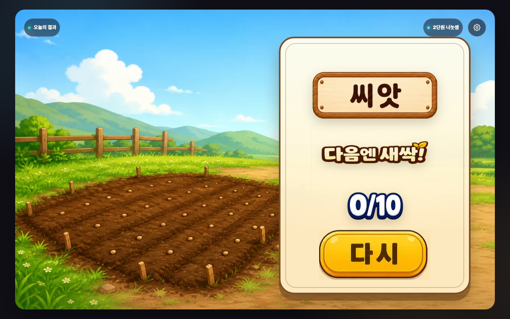
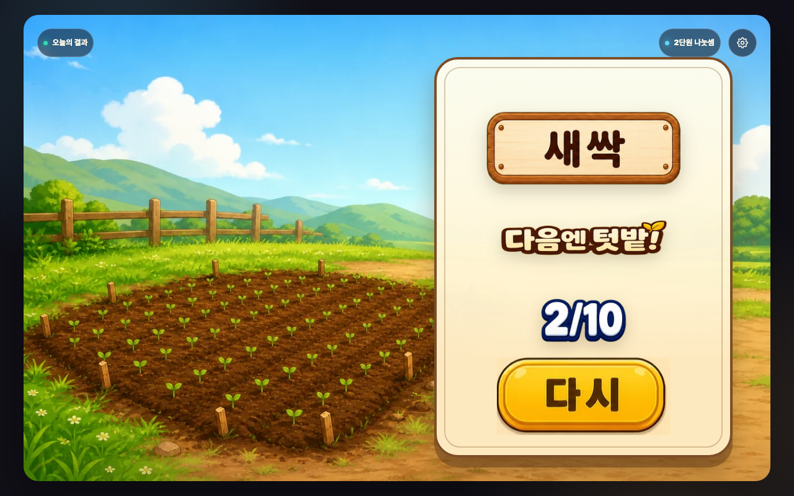
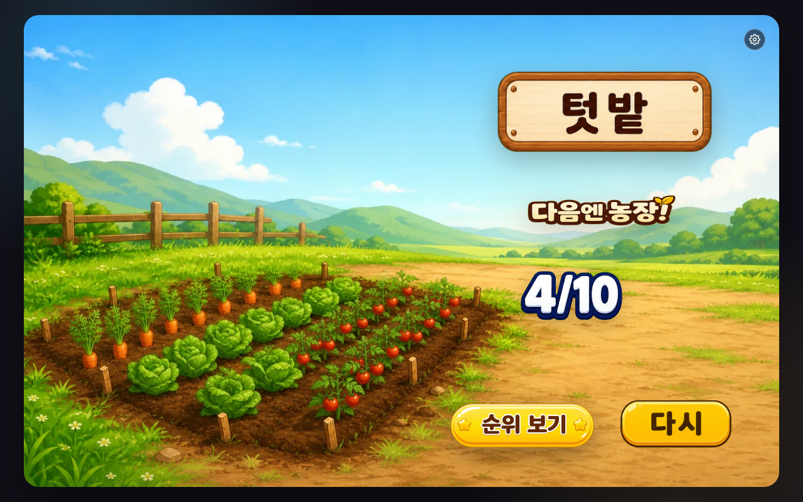
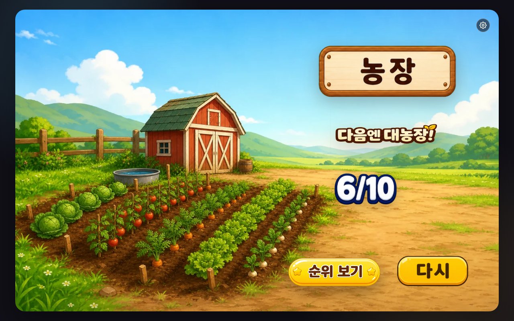
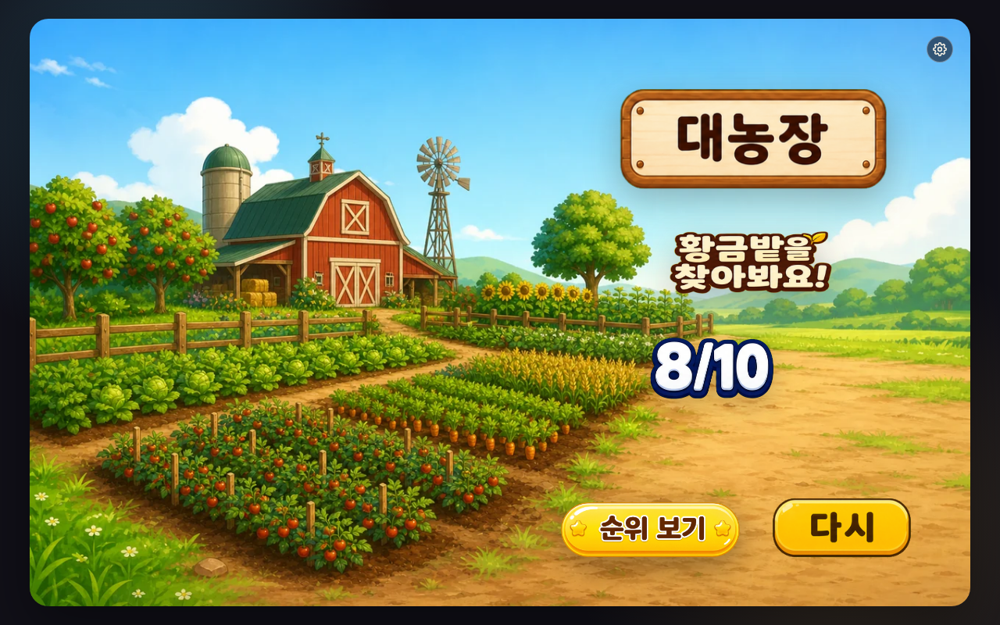
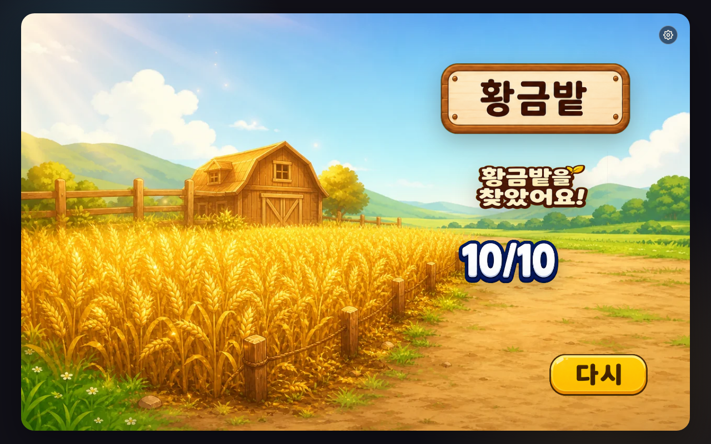

# 매스몬 나누기 농장 구현 보고서

- 갱신일: 2026-07-20
- 보상 버전: `farm-growth-v2`
- 주인공 보상: 6단계 농장 성장
- 문제 조작: 한 화면 한 결정의 3개 선택지 + 동일 바구니 확인
- 동행 매스몬 팩: `base-pack` / 여우몬

## 이번 구현 결과

- 문제 화면 배경을 채소·바구니·캐릭터·UI 패널이 없는 조용한 농장 작업대로 교체했습니다.
- 문제 화면에는 작은 현재 농장 배지만 남기고 수확 숫자, 성장 경로, 다음 목표를 숨겼습니다.
- 문제 상단을 좌우 두 패널로 나눴습니다. 왼쪽에는 전체 식만 크게 두고, 오른쪽에는 현재 계산과 질문만 두어 세 정보가 한 상자 안에서 섞이지 않게 했습니다.
- 설명 2를 `10문제를 풀고 농장을 키워요.`와 6단계 성장 순서를 보여 주는 생성 포스터로 교체했습니다.
- 문제 위를 덮던 보상 팝업을 없애고 `현재 농장+닫힌 바구니 → 사건 공개+농장 변화`의 별도 전체 보상 화면을 만들었습니다.
- 공용 엔진에 기존 차시와 분리된 `stage-reveal` 생명주기와 `onRewardPrepare`, `onRewardReveal` 훅을 추가했습니다.
- 빠른 연타와 이중 클릭에도 한 문제의 보상이 한 번만 적용되도록 잠갔습니다.
- 결과는 공통 배경 대신 6단계별 실제 농장 장면을 사용하고, 내부 수확 숫자와 게이지를 숨겼습니다.
- 결과 화면은 3-2-1-4의 결속 구조를 기준으로 다시 구성했습니다. 왼쪽에는 완성된 농장 장면, 오른쪽 결과판에는 농장 이름·다음 목표·정답 수·다시 버튼을 하나의 세로 축으로 묶었습니다.
- 결과판에서 의미 없이 떠 있던 단계 표시는 제거하고, 농장 이름을 가장 크게 보여 줍니다. 공용 `다시` 이미지 버튼은 모든 결과에서 같은 크기와 위치를 사용합니다.
- 농장·사건·닫힌 바구니는 생성 원본을 보존하고 배경 제거 후 투명 512×512 WebP로 연결했습니다.
- 문제 풀이 화면을 staged flow로 바꿨습니다. 첫 단계는 묶음, 다음 단계는 낱개만 보여 주며, 숫자 선택 버튼 없이 모든 당근을 직접 끌어 옮깁니다.
- 상단 질문 아래에는 `전체 당근`과 `바구니`만 남겼습니다. 답 카드와 같은 뜻을 반복하던 글자는 모두 제거했습니다.
- 문제 대기 화면의 `바구니마다 같은 양이어야 해요` 기본 문구, `바구니 1` 이름표, 바구니 아래 `?`, 오른쪽 `10개 묶음 8개` 요약을 제거했습니다.
- 전체 묶음은 `6개 그림 +2`처럼 줄이지 않고 최대 9개까지 모두 독립된 드래그 대상으로 표시합니다. 바구니는 화면 맨 아래에 크게 배치했습니다.
- 전체 수 글자를 데스크톱 `1.9rem`, 작은 Stage `1.5rem`으로 키웠습니다. 당근 묶음은 처음 들어온 수에 따라 `1~3 / 4~5 / 6~7 / 8~10` 네 구간으로 줄어들며, 나누는 중에는 크기가 흔들리지 않습니다. 데스크톱 기준 묶음 폭은 차례로 `112 / 92 / 76 / 62px`입니다.
- 바구니 안 묶음 수가 1·2·3·4개로 바뀔 때 생성 이미지 세트를 사용합니다. 모든 당근을 다르게 나누면 현재 상태를 유지하고 바구니끼리 다시 옮겨 고칠 수 있습니다.
- 정답 확인판에서는 `40 ÷ 4 = 10`, `8 ÷ 4 = 2`와 같은 양의 바구니를 먼저 보여 준 뒤 다음 단계로 넘어갑니다.
- 최종 상태에는 현재 문제 전체 식, `20 + 2 = 22`, `한 바구니에 22개`를 같은 중앙 축에 고정해 보여 줍니다.

## 학습 흐름

- 학생은 십의 자리에서 한 바구니에 넣을 묶음 수, 일의 자리에서 한 바구니에 넣을 낱개 수를 직접 결정합니다.
- 각 단계에는 보이는 당근과 바구니만 두고, 학생이 모든 당근을 직접 나눠 담습니다.
- 오답은 학생이 만든 분배 상태를 유지하며 `바구니를 똑같이 만들어요.`만 보여 줍니다. 넘친 바구니에서 부족한 바구니로 당근을 다시 끌어 옮길 수 있습니다.
- 정답 뒤에는 같은 양의 바구니와 `40 ÷ 4 = 10` 또는 `8 ÷ 4 = 2`를 1.45초 동안 확인합니다.
- 마지막에는 `10개 묶음 2개 + 낱개 2개 = 22개`와 완성식이 자동으로 이어집니다. 이미 정해진 몫을 다시 입력시키지 않습니다.
- 수학적 판단은 문제당 2번입니다. 직접 드래그를 우선한 제품 선택에 따라 물리 입력은 최소 4회·중앙값 12회·평균 10.87회·최대 18회입니다.
- 문제 은행은 유효한 식 30개에서 매 판 10개를 랜덤 선택하고, 한 판 내 중복을 막습니다.

## 보상 규칙과 목표 분포

| 사건 | 가중치 | 변화 |
|---|---:|---:|
| 일반 수확 | 6400 | `+6~+10` |
| 벌레 | 1500 | `-5~-2` |
| 대풍작 | 1200 | `+14~+22` |
| 황금 당근 | 500 | `+10` |
| 빈 바구니 | 380 | `0`, 누적값 유지 |
| 황금밭 | 20 | 특별 결과 직행 |
| 문제에서 실수 | 별도 | `-8~-4` |

농장 기준은 `씨앗 0`, `새싹 15·정답 2`, `텃밭 35·정답 4`, `농장 55·정답 6`, `대농장 78·정답 8`, `황금밭 특별 사건`입니다.

정답 수마다 50,000판, 총 550,000판을 고정 seed로 시뮬레이션했습니다.

- 8문제 정답에서 씨앗: `2.676%` — 목표 5% 미만 통과.
- 10문제 정답에서 씨앗+새싹: `1.720%` — 목표 3% 미만 통과.
- 10문제 정답에서 황금밭: `1.966%` — 목표 1~3% 통과.
- 10문제 정답에서도 대농장·황금밭이 보장되지 않음.
- 0개부터 10개까지 정답 수가 늘 때 평균 농장 단계가 매번 상승함.

## 보상 화면 상태 QA

강제 재현한 상태:

- 증가: `이번에 +8점 → 지금 18점`
- 감소: `이번에 -4점 → 지금 14점`
- 변화 없음: `이번에 0점 → 지금 40점`
- 황금밭 특별 사건: `황금밭 발견! → 지금 100점`

닫힌 상태에서는 `바구니 열기`만 보이고, 열린 상태에서는 사건 이미지와 `이번에 얻은 점수 → 현재 누적 점수`를 한 줄로 보여 줍니다. 목표까지 남은 점수는 보상 직후의 핵심 결과에서 제외했습니다. 레거시 `modal-art` 보상 팝업은 표시되지 않습니다.

## 생성 이미지 세트 QA

| 세트 | 계약 | 컨택시트 |
|---|---|---|
| 당근 묶음 바구니 | 4장, 투명 1536×1024, 1·2·3·4묶음 | `farm-basket-bundle-states-contact-sheet.png` |
| 문제 배경 | 4장, 1280×800 | `problem-backgrounds-v2-contact-sheet.png` |
| 농장 성장 | 6장, 투명 512×512 | `farm-growth-stages-v2-contact-sheet.png` |
| 보상 사건 | 6장+닫힌 바구니 1장, 투명 512×512 | `reward-events-v2-contact-sheet.png` |
| 결과 농장 | 6장, 1280×800 | `result-scenes-v3-contact-sheet.png` |
| 결과 농장명 | 6장, 투명 390×137 | `result-title-contact-sheet.png` |
| 다음 목표 타이틀 | 6장, 768×384 | `result-next-titles-v2-contact-sheet.png` |

현재 `index.html`이 참조하는 WebP의 `naturalWidth/naturalHeight`, 실제 렌더, 투명 배경, 상태별 파일명을 브라우저에서 확인했습니다. 당근 묶음 바구니 4장은 같은 1536×1024 캔버스와 기준선을 사용하며 각 묶음 수가 빠짐없이 보입니다. 결과는 모두 해당 `result.image`를 실제 배경으로 사용합니다.

## 최신 결과 화면 6종

모든 결과 화면은 `1280×800` 데스크톱 기준으로 현재 실행본에서 다시 캡처했습니다. 농장 장면은 왼쪽, 결과 정보는 오른쪽 결과판에 고정되며, 농장 이름·다음 목표·정답 수·다시 버튼은 같은 중앙 축을 공유합니다.

| 씨앗 | 새싹 |
|---|---|
|  |  |

| 텃밭 | 농장 |
|---|---|
|  |  |

| 대농장 | 황금밭 |
|---|---|
|  |  |

- 결과 농장명 자산은 원본 비율을 유지하며 `object-fit: contain`으로 표시합니다.
- 결과판 중심은 Stage 가로 약 74.5%에 두고, 6종 모두 같은 세로 슬롯을 사용합니다.
- 공용 다시 버튼 자산은 `_shared/result-actions/retry-button-generated.webp`이며 데스크톱 표시 크기는 `280×125px`입니다.
- 정답 수는 공용 생성 이미지 세트 `0/10`~`10/10`을 사용합니다.

## Humanizer 학생 문구 QA

확인한 대표 문구:

- `10문제를 풀고 농장을 키워요.`
- `똑같이 나누면 나눗셈`
- `한 바구니에 몇 묶음씩?` / `한 바구니에 몇 개씩?`
- `2묶음이 남아요.` / `2묶음이 넘쳐요.`
- `모든 바구니에 똑같이 들어갔어요.`
- `낱개 나누기`
- `묶음 나누기`
- `나눈 값 더하기`
- `20 + 2 = 22개`
- `수확 보기`

완료 계산판의 `1단계`, `2단계`는 계산 뜻이 바로 보이는 `묶음 나누기`, `낱개 나누기`로 바꿨습니다. 두 문구는 화면에서 이미 사용한 당근 묶음·낱개와 이어지고, 초3 학생이 소리 내어 읽어도 자연스럽습니다. AI 문체·번역투·어려운 한자어는 없습니다.

## 2026-07-20 묶음 크기 회귀 QA

- `1280×800`, `1024×768`, `918×897`, `934×987`에서 현재 문제 첫 단계 스크린샷을 다시 만들고 직접 확인했습니다.
- 4묶음 대표 문제에서 전체 수 글자와 당근 묶음이 이전보다 크게 보이며, 선택 테두리·묶음 숫자표·바구니 패널과 겹치지 않습니다.
- 8~10묶음 구간은 한 줄 고정 폭 `62px`(작은 Stage `52px`)과 간격 `6px`(작은 Stage `4px`)을 사용해 소스 패널 안에 들어갑니다. 각 드래그 대상은 최소 `56×56px`, 작은 Stage에서는 최소 `58×58px` 터치 영역을 유지합니다.
- `node scripts/qa-lesson2-divide-farm.mjs`에서 네 viewport 전체 흐름, 오답, 단계 확인, 보상, 결과 상태의 넘침·겹침 0건을 다시 확인했습니다.
- `바구니 열기`
- `다음`
- `새싹이 됐어요!`
- `농장까지 7 더`
- `농장까지 문제 1개 더`
- `황금밭을 찾아봐요!`

문제 화면 설명은 한 문장에 행동 하나만 두고, 보상 화면의 보이는 문구도 한 번에 한 줄로 제한했습니다. `점수`, `게이트`, `이벤트`, `보상 구조` 같은 제작자 말을 학생 화면에 쓰지 않았습니다. 긴 문구였던 `전체보다 더 많이 넣었어요`는 화면에서 보이는 차이를 바로 말하는 `넘쳐요`로 줄였습니다.

## 텍스트 넘침·요소 겹침 QA

상단 두 패널의 실제 rect를 검사해 패널 사이 간격 8px 이상, 전체 식은 왼쪽 패널 안, 현재 계산과 질문은 오른쪽 패널 안에 머무는지 문제 대기·오답·정답 확인 상태에서 확인합니다.

- 화면 크기: `1280×800`, `1024×768`, `918×897`, 당근·여우 회귀 화면 `934×987`, 완료 단계 간격 회귀 화면 `926×688`.
- 확인 상태: 표지, 설명 1·2, 문제 대기, 대표 오답 유지, 십의 자리 확인, 낱개 대기·확인, 최종 완성식, 보상 닫힘·열림, 결과.
- 실제 브라우저 rect 검사: 문제 조작판 직접 형제 겹침 `0px`, 당근·바구니·피드백 겹침 `0px`, 카드·라벨·이미지의 부모 밖 넘침 `0px`, 완료 요약의 직접 형제 겹침 `0px`, Stage 밖 조작부 `0px`, 깨진 이미지 `0건`.
- 수정 이력: `1024×768` 설명 카드의 당근 높이와 `918×897` 완료 요약의 낱개 당근 높이가 각각 부모를 넘던 문제를 고친 뒤 재검사했습니다.
- 추가 수정 이력: `918×897`에서 선택지 카드와 하단 피드백이 5px 겹치던 문제를 발견해 선택지·피드백 행을 재배분하고 다시 검사했습니다.
- 당근·여우 회귀: `934×987`, DPR 2에서 여우 반응 이미지가 첫 바구니와 가로 84px·세로 128px 겹치던 상태를 기록했습니다. 풀이 화면의 여우 반응 레이어를 숨기고, 낱개 당근 영역에 안쪽 여백과 잘림 경계를 두어 당근 끝이 원본 카드 테두리에 닿지 않게 고쳤습니다.
- 최대 묶음 회귀: seed `8`, `99 ÷ 3`의 `90`을 10개 묶음 이미지 9개로 생략 없이 표시하고, 이미지 사이 겹침 `0px`을 확인했습니다.
- 완료 단계 간격 회귀: `묶음 나누기`와 `낱개 나누기`를 각각 해당 식과 같은 행에 둡니다. 라벨과 식 사이 실제 간격을 `8~24px`, 세로 중심 차이를 `3px` 이하로 자동 검사해 단계 이름이 다시 멀어지지 않게 했습니다.
- 문제 핵심 패널은 현재 Stage 폭의 65% 이상이며, 드래그 당근과 바구니의 실제 터치 영역은 42×42px 이상입니다.
- 십의 자리와 낱개 정답 확인은 모두 자동 타이머 대신 확인 카드 아래 버튼으로 넘어갑니다. 십의 자리 뒤에는 `낱개 나누기`, 낱개 뒤에는 `나눈 값 더하기`가 보입니다. `1280×800`에서 버튼은 `300×48px`, `1024×768`·`918×897`·`934×987`에서 `260×44px`이며, 제목→바구니→식→버튼의 최소 세로 여백은 각각 `9px`, `9px`, `11px` 이상입니다. 각 확인 화면에서 1.8초를 기다려도 자동 전환되지 않고 버튼을 눌렀을 때만 다음 화면으로 이동하는 것을 현재 실행본에서 확인했습니다.
- 완료 화면의 `수확 보기`와 보상 공개 뒤 `다음`은 공용 `시작`·`다시`와 같은 금빛 캡슐 계열의 생성 이미지 버튼으로 바꿨습니다. 원본 크로마키 PNG, 배경 제거 PNG, 실행 WebP를 함께 보관하며, HTML 버튼에는 `aria-label`만 남겼습니다.
- `수확 보기`는 `1280×800`, `1024×768`, `918×897`, `934×987` 완료 화면에서 계산 카드·바구니 카드·완료 패널 아래선과 겹침 `0px`을 눈으로 확인했습니다. `다음`은 같은 네 화면 크기의 열린 보상 화면에서 결과 한 줄·보상 장면·Stage 아래선과 겹침 `0px`입니다. 두 버튼 모두 아트 ``와 HTML hitbox의 중심·너비·높이가 같은 rect를 사용합니다.
- `prefers-reduced-motion`에서는 농장·사건의 이동 전환을 제거하고 이미지 교체·밝기 변화만 사용합니다.

## 순위 기능 상태

현재 제품 정책에 따라 학생 흐름에서 전국 순위 문구·버튼·화면과 점수 제출·조회 요청은 비활성화했습니다. 10문제를 마치면 결과 화면에서 `다시`만 선택할 수 있습니다.

## 현재 검증

- `node scripts/build-lesson.mjs 3-2-2-1-mathmon-divide-farm` → 배포본 재생성
- `MATHMON_QA_VIEWPORT=desktop node scripts/qa-lesson-flow.mjs 3-2-2-1-mathmon-divide-farm 45` → 현재 결과 6종 캡처, 누락 이미지·텍스트 넘침 0건, `QA_LESSON_FLOW: PASS`
- `node scripts/qa-lesson-model.mjs 3-2-2-1-mathmon-divide-farm` → `QA_LESSON_MODEL: PASS`
- `node scripts/qa-lesson-flow.mjs 3-2-2-1-mathmon-divide-farm` → `QA_LESSON_FLOW: PASS`
- `node scripts/qa-lesson2-divide-farm.mjs` → 빌드·모델·3개 화면 크기 흐름 QA 묶음 통과
- `node scripts/simulate-lesson2-farm-growth.mjs` → 550,000판 분포·단조 상승 검사 통과
- `node scripts/check-stage-ratio.mjs` → Stage 계약 통과
- `node scripts/check-lesson-contract.mjs` → 엔진 차시 계약 통과
- `node scripts/check-lesson-visual-contract.mjs` → 생성 이미지·결과 세트 계약 통과
- `/Users/yubyeongju/Documents/eduitit/.venv/bin/python manage.py test mathmon_scoreboard` → v1+v2 점수 재계산·변조 거부 검사 통과

현재 결과 증거는 2026-07-19 실행본에서 다시 만든 `screenshots/engine-flow-desktop-08a-result-*.png` 6장입니다. 기존 문제·보상 회귀 캡처는 그대로 보존했습니다.
