# 매스몬 엘리베이터 설명 보고서

## 1. 개요

`매스몬 엘리베이터`는 3학년 2학기 2단원 2차시에서 다루는 내림 있는 (두 자리)÷(한 자리) 계산을 게임 흐름으로 연습하는 에듀잇티 수학 게임입니다. 학생은 십의 자리부터 나누고, 남은 십을 일의 자리로 내려 합친 뒤, 일의 자리 몫을 찾아 최종 몫을 완성합니다.

핵심 목표는 `남은 십을 아래로 내려 다시 나누는 과정`을 눈에 보이는 엘리베이터 행동으로 반복하게 만드는 것입니다.

## 2. 학습 설계

- 문제 유형: 내림 있는 (두 자리)÷(한 자리), 나머지 0
- 문제 은행: 나누는 수 2~8, 몫 두 자리, 십의 자리에서 남은 십이 생기는 문제만 필터링
- 라운드 길이: 10문제
- 입력 방식: 십의 자리, 내리기, 일의 자리 3단계 4지선다 선택
- 1단계: 십의 자리 몫과 남은 십을 고름
- 2단계: 남은 십을 일의 자리로 내려 합친 수를 고름
- 3단계: 내린 수를 나누어 일의 자리 몫을 고르고 최종 몫 자동 완성
- 대표 오답: 남은 십을 빠뜨리고 일의 자리만 나누는 선택지
- 최종 확인: 3단계 뒤 계산판에 최종 몫을 채우고 `답 N 완성!`을 보여 준 뒤, 학생이 `엘리베이터 움직이기`를 눌러 보상으로 넘어감
- 보상: 한 문제 완료마다 엘리베이터의 올라갈 힘 이벤트를 1회 적용. 정답 문제는 증가, 대량 증가, 감소, 급행, 멈춤, 무지개 힘 중 하나가 나오고, 오답이 있었던 문제는 감소 이벤트만 적용
- 결과 등급: 올라갈 힘과 맞힌 문제 수 조건을 함께 사용해 도착 층을 공개
- 비밀 등급: 무지개 힘을 얻으면 정답 수와 관계없이 꼭대기 전망대가 열림
- 최종 보상: 도착 층 자체가 보상이며, 매스몬 도감 수집 구조는 사용하지 않음

### 교육적 의도

내림 있는 나눗셈은 십의 자리에서 남은 수를 일의 자리와 합쳐야 하는데, 학생은 종종 남은 십을 버리고 일의 자리만 나누려 합니다. 이 게임은 `52 ÷ 4`를 `5 ÷ 4`, `1십 + 2 = 12`, `12 ÷ 4`로 쪼개 보여 줍니다.

특히 2단계 선택지에 `일의 자리만 2` 같은 오답을 항상 넣어, 내림 빠뜨림을 계산 과정 안에서 직접 비교하게 했습니다.

## 3. 게임 흐름

```text
첫 화면 -> 설명 화면 -> 십의 자리 나누기 -> 남은 십 내리기 -> 일의 자리 나누기 -> 최종 답 확인 -> 올라갈 힘 이벤트 -> 다음 문제 또는 급행 운행 -> 결과 확인 -> 도착 층 결과
```

학생은 먼저 십의 자리 몫과 남은 십을 고릅니다. 다음에는 남은 십을 일의 자리로 내려 합친 수를 고르고, 마지막으로 그 수를 나누어 최종 몫을 완성합니다.

## 4. 화면별 설명

### 첫 화면

첫 화면은 `cover-generated.webp`를 RasterStage 배경으로 사용합니다. 배경 래스터는 캐릭터 없는 엘리베이터 장면으로 재생성했고, base-pack `mathmon-5-eaglemon.webp`를 `.cover-mathmon` HTML 이미지로 얹습니다. 게임 제목은 GPT Image/imagegen으로 만든 `title-logo-generated.webp` 독립 래스터 오버레이이며, 실제 제목은 `visually-hidden` 텍스트로 남겼습니다. 한 줄 목표와 시작 버튼은 HTML로 유지해 선명하게 보이도록 했습니다.

### 설명 화면

설명 화면은 3단계만 보여 줍니다.

1. 십의 자리부터 나누고, 남은 십을 봐요.
2. 남은 십을 일의 자리로 내려 합쳐요.
3. 내린 수를 나누면 도착 층이 올라가요.

버튼 문구는 다음 행동이 바로 보이도록 `나누기 시작`으로 두었습니다.

### 문제 화면

문제 화면은 왼쪽에 엘리베이터 샤프트와 올라갈 힘 상태, 오른쪽에 문제와 나눗셈 보드, 선택지를 둡니다. 문제와 선택지가 가장 크게 보이도록 엘리베이터 샤프트는 보조 시각 요소로 제한했습니다. 엘리베이터 차체는 CSS gradient/pseudo-element가 아니라 imagegen 원본에서 배경을 제거한 `elevator-car-generated.webp` 스프라이트입니다.

나눗셈 보드는 몫 두 자리, 나누는 수, 나누어지는 수, 남은 십, 내린 수를 보여 줍니다. 각 단계가 끝나면 해당 칸이 채워지고, 마지막 단계에서는 최종 몫이 완성됩니다.
마지막 단계가 끝나도 보상 모달은 바로 뜨지 않습니다. 학생은 계산판에서 답을 먼저 확인하고 `엘리베이터 움직이기`를 눌러 다음 장면으로 갑니다.

### 보상 화면

한 문제의 3단계 계산을 확인한 뒤 화면 중앙에 올라갈 힘 이벤트가 뜹니다. 보상 이미지는 `reward-events-sprite-generated.png`의 3×2 스프라이트에서 이벤트별 칸을 골라 보여 줍니다. 보상 모달의 보이는 문구는 큰 변화량 1개와 버튼만 남겼습니다. 예: `힘 +7`, `힘 -8`, `힘 0`, `급행!`, `무지개!`. 제목과 설명은 접근성용 숨김 텍스트로만 유지합니다.

### 결과 화면

결과 화면은 도착 층별 RasterStage 배경을 동적으로 교체합니다. `result-basement-generated.webp`, `result-first-generated.webp`, `result-middle-generated.webp`, `result-view-generated.webp`, `result-roof-generated.webp`, `result-rainbow-generated.webp`, `result-retry-generated.webp`를 사용하고, 그 위에는 올라갈 힘, 맞힌 문제, 실제 다시하기 버튼만 HTML로 얹습니다. 도착 제목과 결과 칭찬 문장은 숨김 접근성 텍스트로만 둡니다. 결과 화면의 별도 독수리몬 HTML 오버레이는 제거했습니다. 독수리몬은 각 결과 generated bitmap 안에 도착 장소와 함께 포함했고, 로컬 합성으로 대신 만들지 않았습니다.

도착 층은 지하 정비층, 1층 로비, 중간층, 전망층, 옥상 정원, 꼭대기 전망대로 구분됩니다. 일반 층은 힘만으로 쉽게 열리지 않도록 맞힌 문제 수 조건을 함께 사용합니다. 무지개 힘은 특별 보상으로, 맞힌 문제 수가 낮아도 꼭대기 전망대에 바로 도착합니다. 실패 결과는 축하 무대가 아니라 다시 준비하는 안전한 장면으로 분리했습니다.

## 5. 검증 스크린샷

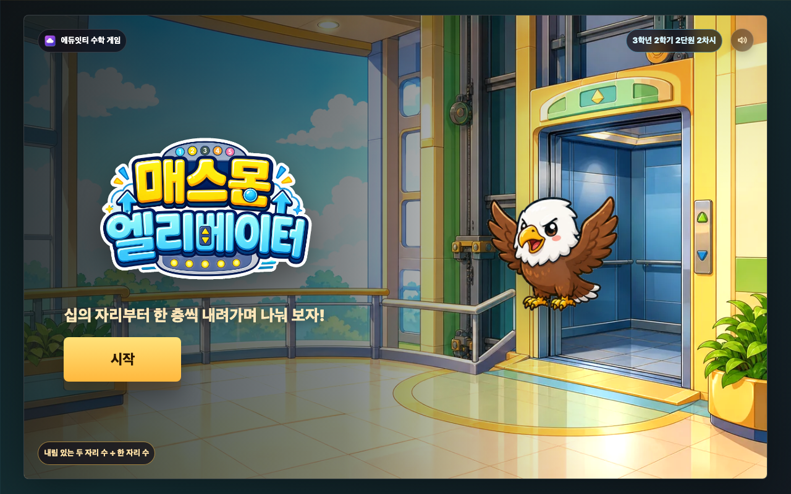
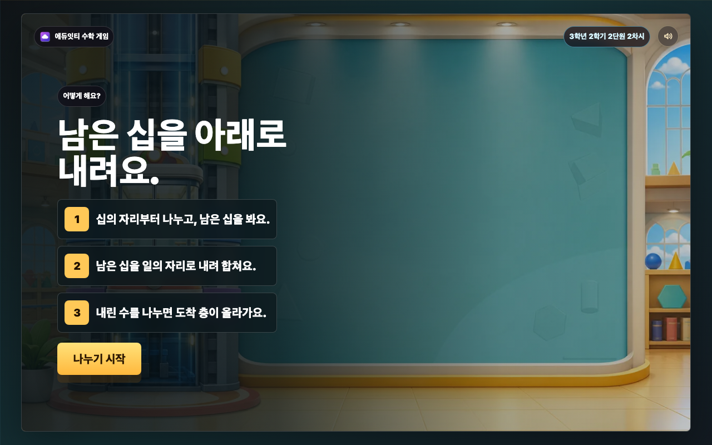
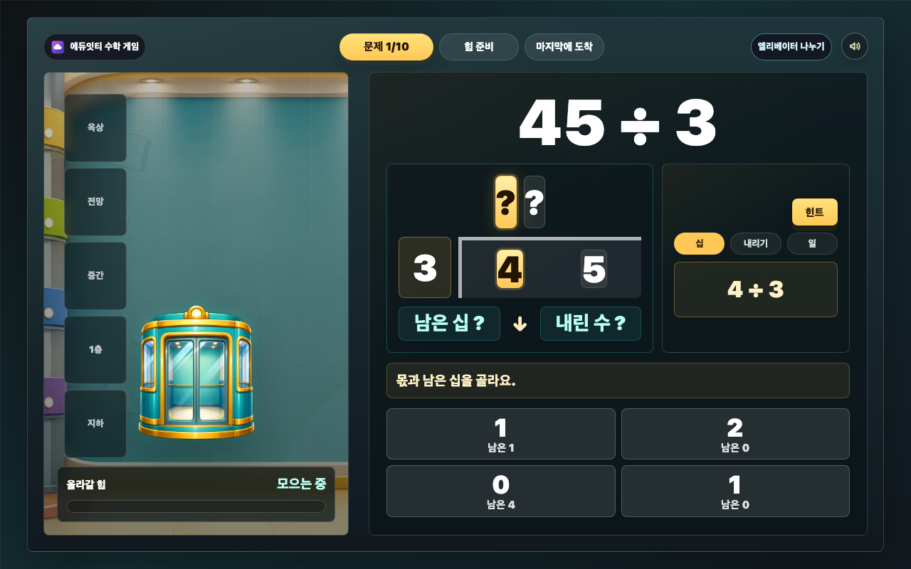
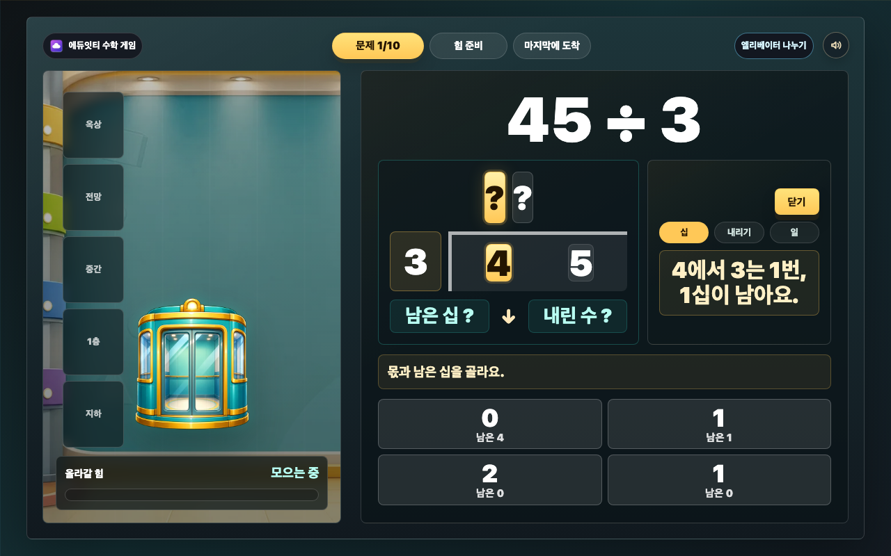
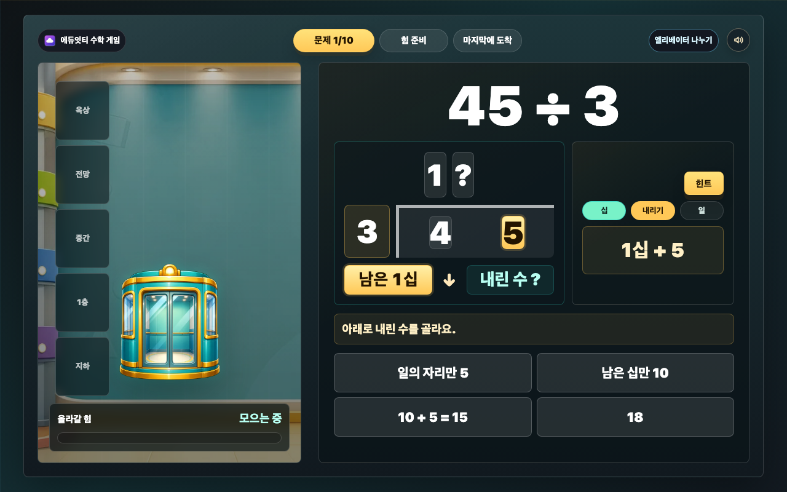
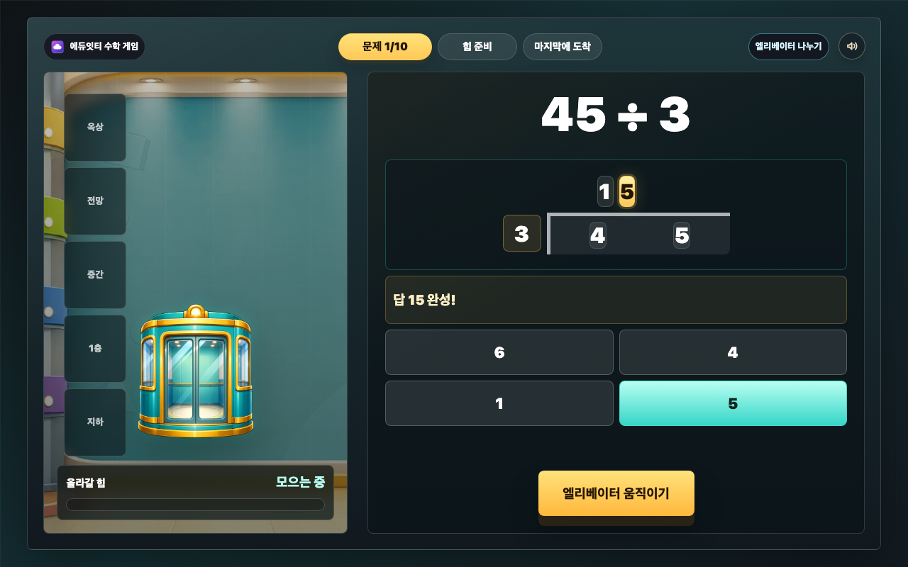
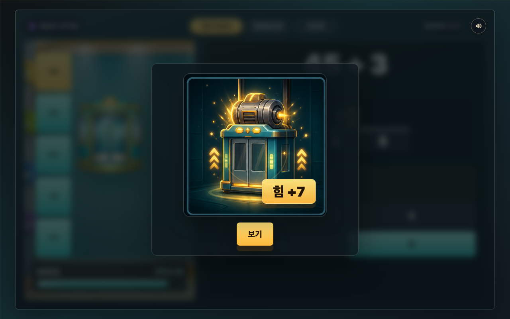
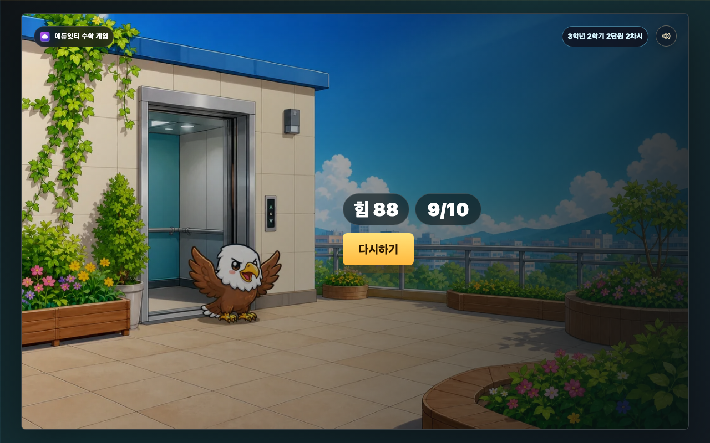
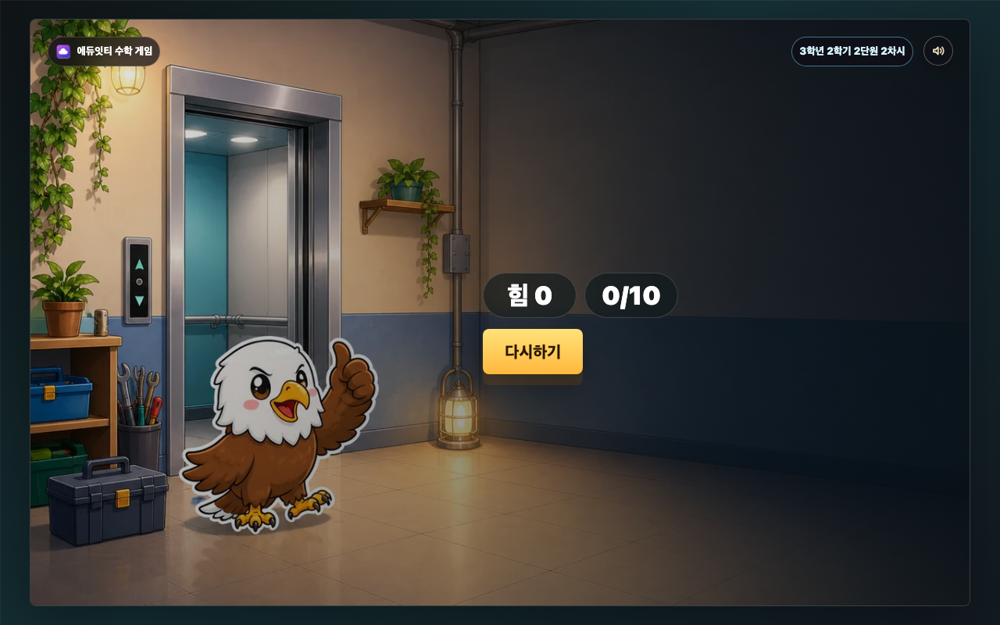
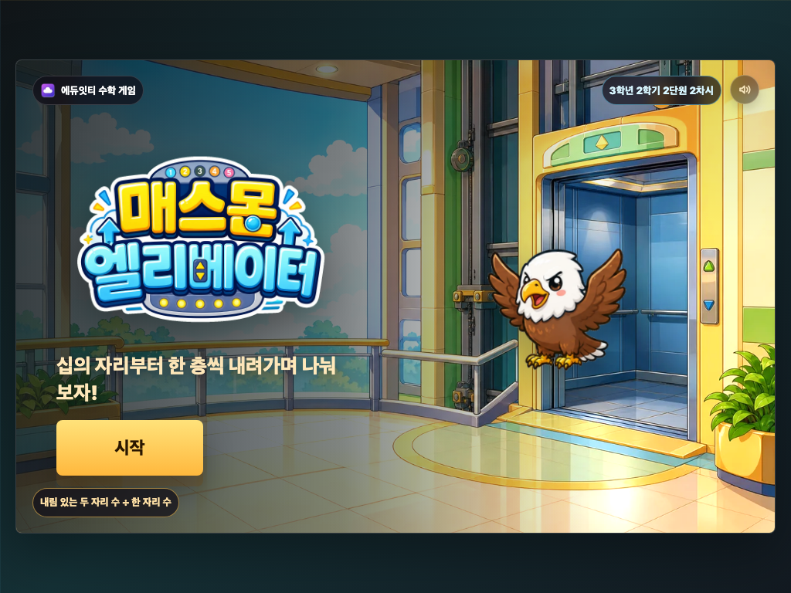
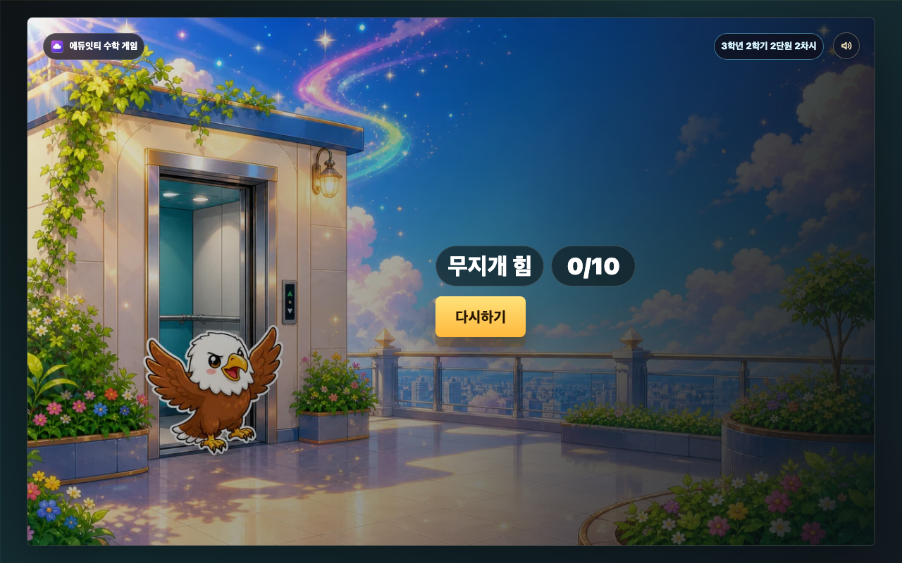
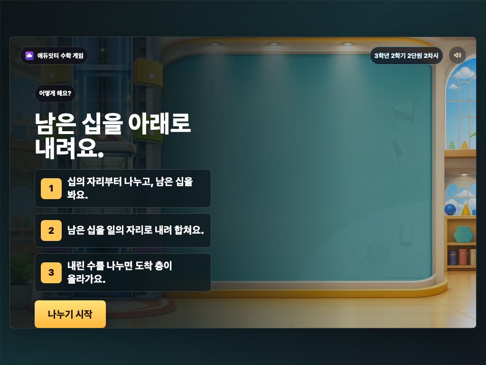
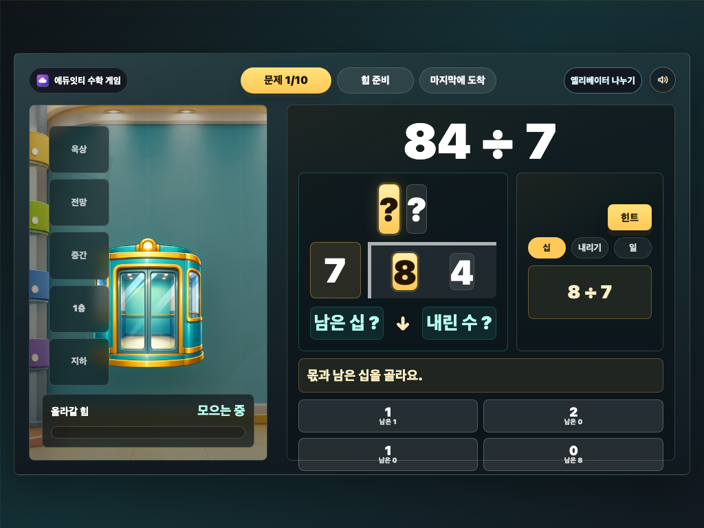
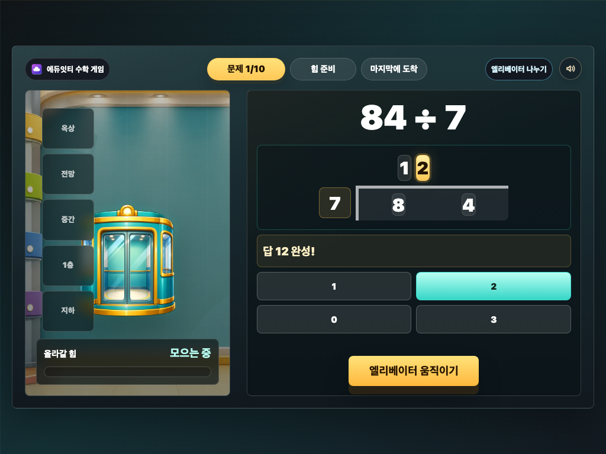
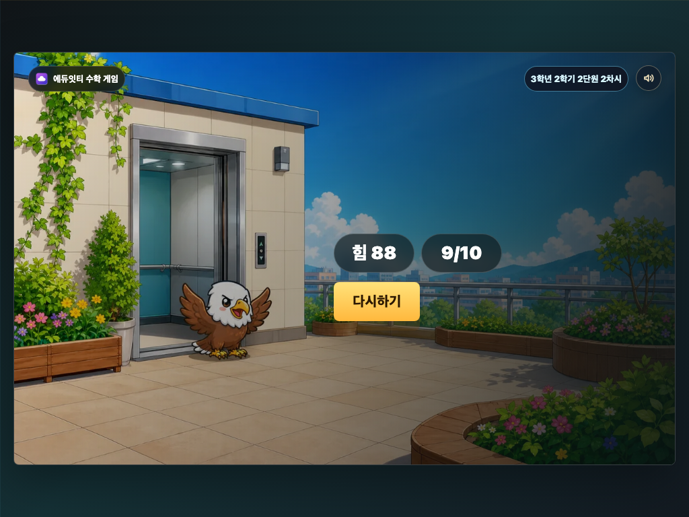

## 6. 매스몬 역할

매스몬은 첫 화면에서 엘리베이터 모험을 함께하는 동행 캐릭터로 등장합니다. 학생이 얻는 중심 보상은 `엘리베이터 도착 층`이며, 도감 수집 구조는 사용하지 않습니다. 결과 화면은 별도 매스몬 오버레이 없이, 생성 이미지 안에 포함된 독수리몬과 도착 장소를 보여 줍니다.

## 7. 공개 패키지 구성

이 폴더는 별도 빌드 없이 바로 열 수 있는 정적 패키지입니다. 학생용 static 사본에는 실행에 필요한 파일만 복사하고, PNG 원본과 스크린샷은 작업실에 보관합니다.

- `index.html`
- `cover-generated.webp`
- `title-logo-chromakey.png`
- `title-logo-generated.png`
- `title-logo-generated.webp`
- `board-shaft-generated.webp`
- `elevator-car-generated.webp`
- `reward-events-sprite-generated.png`
- `assets/mathmon/base-pack/mathmon-5-eaglemon.webp`
- `result-basement-generated.webp`
- `result-first-generated.webp`
- `result-middle-generated.webp`
- `result-view-generated.webp`
- `result-roof-generated.webp`
- `result-rainbow-generated.webp`
- `result-retry-generated.webp`
- `eduitit-logo-mark.png`
- `README.md`
- `REPORT.md`

작업실 보관물:

- `*-generated.png`: 생성 이미지 원본
- `elevator-car-source.png`: 엘리베이터 차체 생성 원본
- `elevator-car-generated.png`: 엘리베이터 차체 투명 PNG 원본
- `screenshots/*.png`: 화면 검증 스크린샷
- 루트 `scripts/qa-lesson2-elevator.mjs`: 수학 모델, 보상, 화면 흐름, 최신 스크린샷 QA

## 최신 하네스 리마스터 (2026-06-29)

- 마지막 단계 확인: 3단계 정답 뒤 보상 모달을 바로 띄우지 않고 `답 N 완성!`과 `엘리베이터 움직이기` 버튼을 먼저 보이게 했습니다.
- 학생 문구 정리: 문제 지시문을 `몫과 남은 십을 골라요`, `아래로 내린 수를 골라요`, `일의 자리 몫을 골라요`처럼 한 행동으로 줄였습니다.
- 보상 모달 단순화: 보이는 텍스트를 변화량 1개와 버튼으로 줄이고, 제목/설명은 숨김 접근성 텍스트로 옮겼습니다.
- 엘리베이터 차체 자산화: CSS gradient/pseudo-element 차체를 제거하고, imagegen 원본에서 배경 제거한 `elevator-car-generated.webp`를 연결했습니다. 외부 CDN 참조는 없습니다.
- 결과 화면 정리: 결과 화면의 보이는 HTML 오버레이를 `올라갈 힘`, `맞힌 문제`, 실제 `다시하기` 버튼으로 줄였습니다.
- 결과 매스몬 오버레이 제거: 생성 이미지처럼 보이게 로컬 합성을 하지 않기 위해 별도 HTML 캐릭터 오버레이를 제거하고, 결과 7종 bitmap 안에 도착 장소와 독수리몬을 함께 넣었습니다. 왼쪽 큰 도착 배지와 오른쪽 도착 제목은 화면에서 숨기고 접근성 텍스트로만 유지합니다.
- 결과 고정 문구 축소: 결과 제목과 칭찬 문장은 화면에 보이지 않게 숨김 접근성 텍스트로 내렸습니다.
- QA 자동화: `scripts/qa-lesson2-elevator.mjs`가 실제 문제 후보군과 `buildProblems()` 샘플, 대표 오답, 보상 6종, 오답 정전 경로, 최종 답 확인, 보상 모달 단순화, 결과 화면, 데스크톱/태블릿 주요 상태 스크린샷을 검증합니다.

## 검증 결과 (2026-06-29)

- 결과 자산: `result-basement/first/middle/view/roof/rainbow/retry-generated.png|webp` 7종을 imagegen 원본에서 1280×800으로 후처리했습니다. 생성 이미지에는 텍스트, 숫자, 버튼을 넣지 않았고, 각 장면 안에 독수리몬을 포함했습니다.
- 엘리베이터 자산: `elevator-car-source.png` 원본을 보관하고, 투명 `elevator-car-generated.png/webp`(560×640, alpha 포함)를 문제 화면에 연결했습니다. `index.html`에는 CDN 참조나 예전 CSS 차체 pseudo-element가 남아 있지 않습니다.
- 수학 QA: 후보 58개가 모두 두 자리 나눗셈, 나누는 수 2~8, 십의 자리 내림 있음, 최종 나머지 0 조건을 통과했습니다. 2단계와 3단계에는 남은 십을 빠뜨리는 대표 오답이 들어갑니다.
- 흐름 QA: 첫 화면 -> 설명 -> 1단계 -> 2단계 -> 3단계 -> 최종 답 확인 버튼 -> 보상 -> 결과 흐름을 브라우저에서 완주했습니다.
- 보상 QA: 증가, 감소, 대량 증가, 급행, 0, 무지개, 오답 정전 경로를 강제 확인했습니다.
- 텍스트 넘침·요소 겹침 QA: 1280×800 데스크톱과 1024×768 태블릿 가로 스크린샷에서 첫 화면, 설명, 문제 1단계, 문제 2단계, 힌트, 최종 답 확인, 보상, 일반 결과, retry 결과, 무지개 결과를 확인했습니다. 자동 overflow/clipping 검사와 `screenshots/qa-contact-sheet.png` 눈검수 모두 통과했습니다.
- 명령 검증: `node scripts/check-stage-ratio.mjs`, inline JS syntax check, `node --check scripts/qa-lesson2-elevator.mjs`, `node scripts/qa-lesson2-elevator.mjs` 모두 통과했습니다.
- 하네스 재점검: 결과 화면 고정 제목과 칭찬 문구는 숨김 접근성 텍스트로 내리고, 보이는 HTML 오버레이는 올라갈 힘, 맞힌 문제, 다시하기 버튼만 남겼습니다. QA 스크립트의 Chrome 임시 프로필은 `screenshots/.qa-profile/chrome-user-data` 아래로 제한하고 경로 가드를 추가했습니다.

## 완성도 폴리시 패스 (2026-06-24)

- 선택지 단순화: 십의 자리 단계 선택지를 `2, 남은 십 없음` 같은 문장형에서 큰 몫 + `남은 N` 두 줄 칩(`.choice-button--stack`)으로 바꿔 한눈에 읽히게 했습니다.
- 텍스트 과밀 제거: 단계 설명 문장(`step-meaning`)을 없애고, 현재 단계는 `step-formula`와 한 줄 지시문(`prompt`)만 남겼습니다.
- 보상 연출 보강: 보상 팝업의 힘 배지에 `requestAnimationFrame` 팝 모션을 추가했습니다.
- 첫 화면 밝기 보강: `cover .raster-bg`에 가벼운 `brightness/saturate` 보정을 적용했습니다.
- 매스몬 동행 통일: 첫 화면은 `assets/mathmon/base-pack/mathmon-5-eaglemon.webp`를 `.cover-mathmon`으로 연결했습니다. 2026-06-29 리마스터 뒤 결과 화면의 별도 매스몬 오버레이는 제거했습니다.
- 첫 화면 제목 아트 표준화: `title-logo-generated.webp`를 `.hero-title-art`로 얹고, 제목 텍스트는 접근성용 숨김 `<h1>`로 유지했습니다.
