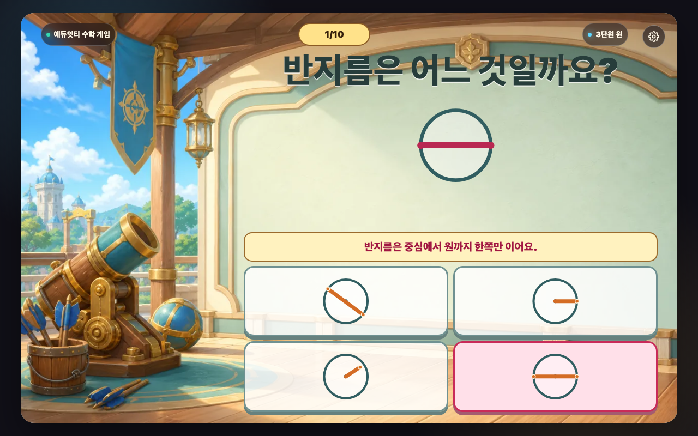
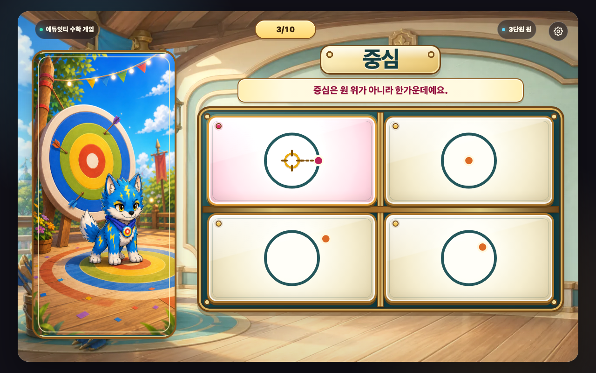
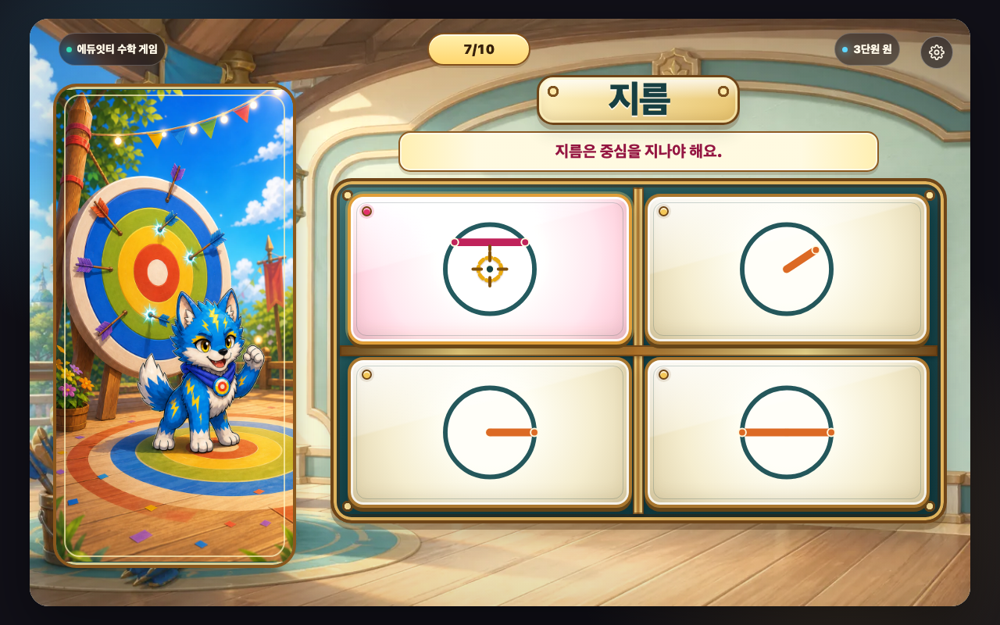
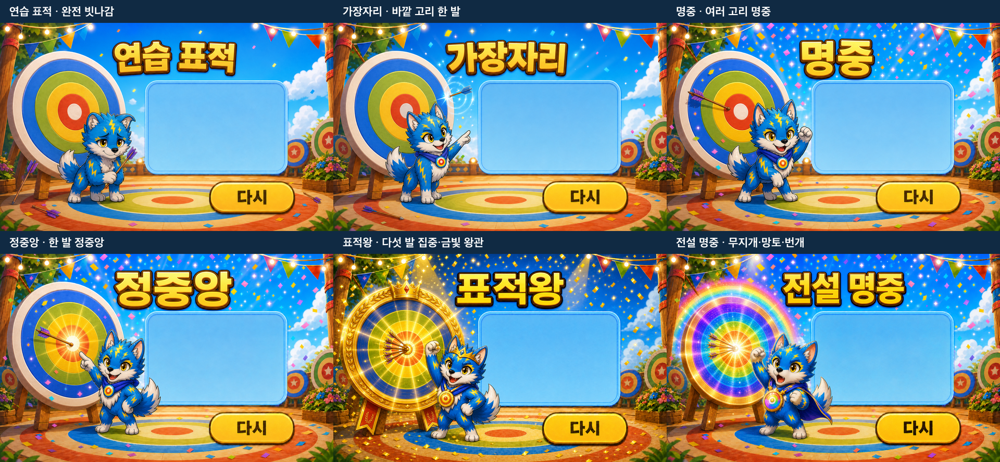

# 매스몬 표적 맞히기 제작·인수인계 보고서

- 최종 갱신일: 2026-07-29
- 대상: 초등학교 3학년 2학기 3단원 원 1차시
- 게임 공개 주소: [GitHub Pages에서 실행하기](https://kakio426.github.io/eduitit-math-3-2/3-2-3-1-mathmon-target-hit/)
- 보고서 공개 주소: [GitHub에서 REPORT.md 보기](https://github.com/kakio426/eduitit-math-3-2/blob/main/3-2-3-1-mathmon-target-hit/REPORT.md)
- 배포 폴더: `3-2-3-1-mathmon-target-hit/`
- 실행 파일: `3-2-3-1-mathmon-target-hit/index.html`
- 기준 화면: 16:10 Stage, 1280×800
- 권장 기기: 컴퓨터 및 태블릿 가로 화면
- 한 판 구성: 중심 4문제, 반지름 3문제, 지름 3문제
- 동행 매스몬: `diversity-reward-pack`의 번개늑대몬
- 보상 표준: `mathmon-unified-reward-v1`
- 전국 순위: 비활성화

## 1. 전달 요약

이 게임은 원의 중심·반지름·지름을 말로 외우는 대신, 네 개의 원 그림에서 알맞은 점이나 선분을 직접 고르며 위치 관계를 익히는 게임입니다.

한 원에 후보 네 개를 겹쳐 놓지 않습니다. 학생은 독립된 원 그림 네 개를 비교하고, `한가운데 점`, `중심에서 원까지`, `중심을 지나 원의 양쪽 끝까지`라는 관계를 보고 답을 고릅니다. 오답을 고르면 현재 원에서 중심 위치나 선분 끝점이 왜 다른지 바로 보이고, 정답을 고르면 같은 자리에서 완성된 관계를 충분히 확인한 뒤 `점수 보기`로 보상에 들어갑니다.

왼쪽 보상 장면은 최종 결과 이미지를 잘라 쓰지 않습니다. `연습 표적 → 가장자리 → 명중 → 정중앙 → 표적왕 → 전설 명중`의 플레이 전용 세로 이미지 6장을 사용하며, 단계가 오를수록 화살 위치·충격광·표적 장식·번개늑대몬 반응이 커집니다.

게임은 별도 서버 없이 GitHub Pages에서 정적 실행됩니다. 현재 제품 정책에 따라 랭킹 화면과 점수 제출·조회 요청은 모두 꺼져 있습니다.

## 2. 학습 목표와 수학 계약

### 학습 목표

원의 중심·반지름·지름을 점과 선분의 위치 관계로 구별합니다.

### 학생이 하는 판단

- 중심 문제: 원의 한가운데에 있는 점을 고릅니다.
- 반지름 문제: 중심에서 시작해 원까지 닿는 선분을 고릅니다.
- 지름 문제: 중심을 지나 원의 양쪽 끝까지 닿는 선분을 고릅니다.

### 문제 생성 규칙

- 한 판은 10문제입니다.
- 중심 4문제, 반지름 3문제, 지름 3문제를 섞어 냅니다.
- 문제마다 정답 1개와 대표 오개념 3개가 있습니다.
- 원과 선분의 회전·위치는 문제마다 달라집니다.
- 색이 아니라 점·선분·원의 실제 위치 관계로 답을 판단합니다.
- 각 문제의 선택지는 네 장이며, 정답 경로는 문제당 4회 입력입니다.
- 한 판 전체 입력 수는 43회입니다.

### 대표 오개념

| 개념 | 대표 오답 | 화면에서 보이는 이유 |
|---|---|---|
| 중심 | 점이 원의 테두리나 안쪽 한쪽에 있음 | 원 한가운데와 어긋난 위치를 표시 |
| 반지름 | 중심을 지나 양쪽 끝까지 이은 지름을 고름 | 중심에서 한쪽 원까지만 이어야 함을 표시 |
| 지름 | 원의 양쪽 끝은 잇지만 중심을 지나지 않음 | 중심점과 선분이 어긋난 위치를 표시 |

오답 뒤에는 같은 문제를 다시 고를 수 있습니다. 정답을 고르면 선택지 색만 바뀌지 않고, 고른 점이나 선분이 완성된 관계로 남고 한 줄 확인 문장이 나타납니다.

## 3. 학생 진행 흐름

1. **시작 화면**
   제목, 한 줄 목표, 시작 버튼을 먼저 봅니다.
2. **방법 보기 1**
   네 표적 중 알맞은 점이나 선분이 그려진 원을 고르는 방법을 봅니다.
3. **방법 보기 2**
   10문제를 풀고 덮인 표적을 열어 마지막 표적 이름을 확인하는 흐름을 봅니다.
4. **문제 풀기**
   `중심`, `반지름`, `지름` 중 현재 물음을 보고 원 그림 하나를 고릅니다.
5. **오답 확인**
   현재 원에서 점이나 선분이 어디에서 어긋났는지 봅니다.
6. **정답 확인**
   고른 관계가 완성된 모습과 짧은 확인 문장을 봅니다.
7. **점수 보기**
   정답 확인 화면을 충분히 본 뒤 학생이 보상 화면을 엽니다.
8. **보상 확인**
   닫힌 표적을 열면 이번 사건 그림과 실제 점수 변화가 공개됩니다.
9. **왼쪽 표적 변화**
   `다음`을 누르면 모달이 먼저 닫히고, 왼쪽 표적의 단계 효과가 재생됩니다.
10. **최종 결과**
    정답 수와 도달한 표적을 보여 주고 다음 표적 목표를 안내합니다.

## 4. 화면 설계

### 문제 화면

- 왼쪽 보상 장면: Stage 폭 25.78%, 1:2 세로 슬롯
- 오른쪽 학습 영역: Stage 폭 65.50%
- 핵심 2×2 표적 콘솔: Stage 폭 65.50%
- 문제 이름표: 교과 용어 한 단어만 표시
- 지시판: 현재 행동 한 문장만 표시
- 상단: 브랜드, 문제 수, 단원 배지, 설정 버튼을 같은 기준선에 배치

네 선택지는 황동 레일로 연결된 하나의 표적 콘솔 안에 있습니다. 문제 대기·오답·정답 확인에서 콘솔의 폭과 중심축이 움직이지 않습니다.

왼쪽 진행 장면은 최종 결과 장면과 별도입니다. 모든 플레이 이미지는 768×1536이며 `object-fit: contain`으로 표시합니다. 번개늑대몬 전신과 표적의 잘림은 없습니다.

### 설정 화면

설정 버튼은 Stage 오른쪽 위에 있고 다음 기능을 제공합니다.

- 배경 소리 켜기/끄기
- 효과 소리 켜기/끄기
- 방법 다시 보기
- 처음부터 다시 시작
- 설정 닫기

### 보상 화면

`3-2-2-4-mathmon-check-lock`과 같은 공통 `modal-art` 구조를 사용합니다.

- 닫힌 상태: 가려진 표적과 `열기` 버튼
- 열린 상태: 사건 그림, 실제 변화량, `다음` 버튼
- 보이는 설명 문장은 넣지 않음
- `점수 0` 사건은 누적 점수를 지우지 않음
- `다음`을 누른 뒤에만 왼쪽 표적 변화 효과가 재생됨

### 결과 화면

- 최종 결과 장면 6종은 각각 1280×800입니다.
- 결과 제목, 번개늑대몬, 표적, 오른쪽 정보판, `다시` 버튼 장식을 한 장면으로 통일했습니다.
- 오른쪽 정보판에는 생성형 다음 목표 타이틀과 공용 정답 수 이미지만 표시합니다.
- 결과 화면에서 표적 점수 막대를 반복하지 않습니다.
- `다시`는 장면 속 버튼과 같은 경계의 투명 HTML hitbox가 맡습니다.
- 결과 단계가 오를수록 제목을 가려도 차이를 알아볼 수 있게 만들었습니다.

| 단계 | 장면 차이 |
|---|---|
| 연습 표적 | 색 고리에 맞은 화살 없음, 바닥과 받침에 빗나간 화살, 조심스러운 자세 |
| 가장자리 | 바깥 파란 고리 끝의 한 발, 작은 파란 충격파 |
| 명중 | 여러 고리에 명중, 더 큰 축하와 자신 있는 반응 |
| 정중앙 | 정중앙 한 발과 밝은 중심광 |
| 표적왕 | 정중앙 다발 집중, 금빛 표적·왕관·우승 리본 |
| 전설 명중 | 무지개 표적, 망토, 번개 변신과 최고 단계 연출 |

## 5. 표적 점수와 결과 규칙

표적 점수는 0~100 범위에서 누적됩니다.

| 사건 | 확률 | 변화 |
|---|---:|---:|
| 일반 명중 | 64% | +6~10 |
| 작은 손해 | 15% | -5~-2 |
| 큰 명중 | 12% | +14~22 |
| 정중앙 | 5% | +30 |
| 빗나감 | 3.8% | 0 |
| 무지개 명중 | 0.2% | 100 및 특별 결과 |

- 오답이 있었던 문제는 최초 1회만 `-6~-3`이 적용됩니다.
- `빗나감`은 이번 변화만 0이며 지금까지 모은 점수는 유지합니다.
- 일반 결과는 표적 점수와 최소 정답 수를 함께 만족해야 올라갑니다.
- 특별 무지개 사건은 정답 1개 이상일 때 `전설 명중`을 보여 줍니다.

| 결과 | 최소 표적 점수 | 최소 정답 수 |
|---|---:|---:|
| 연습 표적 | 0 | 0 |
| 가장자리 | 15 | 2 |
| 명중 | 35 | 4 |
| 정중앙 | 55 | 6 |
| 표적왕 | 78 | 8 |
| 전설 명중 | 특별 사건 100 | 1 |

## 6. 최신 전체 화면 스크린샷

아래 이미지는 모두 현재 코드로 다시 빌드한 뒤 등록된 8개 QA 화면 크기에서 촬영한 전체 Stage 화면입니다. 화면 일부를 잘라 쓰지 않았습니다.

한 화면 크기마다 시작·설정·설명 2장·문제 대기·대표 오답 3종·정답 확인·닫힌/열린 보상·실제 결과·플레이 진행 6단계·연습 표적 0/10·최종 결과 6단계의 26개 상태를 저장했습니다. 전체 캡처는 208장입니다.

### 6.1 시작과 방법 보기

#### 1) 시작 화면


#### 2) 설정 화면


#### 3) 원의 관계 찾기


#### 4) 표적 점수와 최종 결과 안내


### 6.2 문제와 정답 확인

#### 5) 문제 대기


#### 6) 반지름을 지름으로 고른 오답



#### 7) 중심을 테두리에서 고른 오답



#### 8) 중심을 지나지 않는 지름 오답



#### 9) 정답 확인


### 6.3 문제 화면 왼쪽 진행 장면 6단계

플레이 진행 이미지는 최종 결과를 자른 그림이 아니라 좁은 세로 슬롯 전용 생성 이미지입니다.

#### 10) 연습 표적


#### 11) 가장자리


#### 12) 명중


#### 13) 정중앙


#### 14) 표적왕


#### 15) 전설 명중


### 6.4 보상

#### 16) 닫힌 보상


#### 17) 열린 보상


### 6.5 실제 결과와 최종 결과 6단계



#### 18) 한 판을 마친 실제 결과


#### 19) 연습 표적 0/10


#### 20) 연습 표적


#### 21) 가장자리


#### 22) 명중


#### 23) 정중앙


#### 24) 표적왕


#### 25) 전설 명중


## 7. 화면 크기 회귀 증거

같은 전체 흐름, 플레이 진행 6단계, 최종 결과 6단계를 아래 8개 조건에서 각각 다시 촬영했습니다.

| 이름 | 브라우저 크기 | DPR | 확인 목적 |
|---|---:|---:|---|
| desktop | 1280×800 | 1 | 기준 제작 화면 |
| tablet-landscape | 1024×768 | 1 | 태블릿 가로 |
| user-redesign-1082x897-dpr2 | 1082×897 | 2 | 문제 화면 리디자인 회귀 |
| user-reported-final-reward-ui-broken-1082x897-dpr2 | 1082×897 | 2 | 최종 보상 UI 위치 회귀 |
| user-reported-result-panel-axis-1082x897-dpr2 | 1082×897 | 2 | 결과 정보판 중심축 회귀 |
| user-reported-problem-title-side-spikes-1082x897-dpr2 | 1082×897 | 2 | 문제 이름표 불필요 장식 회귀 |
| user-reported-missing-left-reward-panel-1082x897-dpr2 | 1082×897 | 2 | 왼쪽 진행 장면 누락 회귀 |
| user-reported-left-reward-character-cropped-1082x897-dpr2 | 1082×897 | 2 | 진행 장면 캐릭터 잘림 회귀 |

### 태블릿 문제 화면


### 최종 보상 UI 제보 크기의 열린 보상


### 결과 정보판 중심축 제보 크기


### 문제 이름표 장식 제보 크기


### 왼쪽 진행 장면 누락 제보 크기


### 캐릭터 잘림 제보 크기의 전설 단계


각 화면 크기의 나머지 최신 캡처도 같은 `screenshots/engine-flow-<화면 이름>-*.png` 규칙으로 보관했습니다.

## 8. 이미지 자산 계약

| 구분 | 구성 | 실행 규격 |
|---|---|---|
| 시작 화면 | 글자 없는 대표 장면 + 제목 아트 + 공용 시작 버튼 | 1280×800 Stage |
| 설명 | 문제 조작 1장 + 보상 흐름 1장 | 각 1280×800 |
| 문제 배경 | 판타지 표적 훈련장 | 1280×800 |
| 문제 왼쪽 진행 | 표적 6단계 전용 세로 장면 | 각 768×1536 |
| 보상 | 닫힌 표적 1장 + 사건 6종 | 공통 모달 아트 |
| 결과 | 표적·번개늑대몬 장면 6종 | 각 1280×800 |
| 다음 목표 | 투명 생성형 타이틀 6종 | PNG |
| 정답 수 | 공용 생성형 숫자 0/10~10/10 | WebP |

주요 컨택시트:

- `reward-events-v3-contact-sheet.png`
- `play-target-progress-v2-contact-sheet.png`
- `play-vs-final-v2-contact-sheet.png`
- `result-tiers-v3-contact-sheet.png`

2026-07-29 결과 대비 강화에서 다시 생성한 원본:

- `result-practice-v3-source.png`
- `result-edge-v3-source.png`
- `result-targetking-v3-source.png`

이전 결과 자산과 v2 컨택시트는 `_archive/20260729-pre-result-tier-contrast/`에 보존했습니다.

## 9. 접근성·학생 문구

- 모든 실제 버튼은 키보드 포커스와 `aria-label`을 가집니다.
- 터치 영역은 최소 42×42px 이상입니다.
- 배경 소리와 효과 소리 설정은 브라우저에 저장됩니다.
- 문제 화면의 안내는 `표적 네 개 중 알맞은 그림을 골라요.`처럼 한 문장에 행동 하나만 담았습니다.
- `중심`, `반지름`, `지름`은 교과 용어이므로 유지하고 바로 아래 그림으로 뜻을 확인합니다.
- 보상 모달에는 긴 설명을 넣지 않고 변화량 한 덩어리만 보여 줍니다.
- 제작자 용어, 번역투, 어려운 한자어를 학생 화면에서 쓰지 않았습니다.

Humanizer 학생 문구 QA 결과:

- S1 0건
- S2 0건
- 자연도 A
- 수치·교과 의미·부정 표현·격식 수준 보존 6항 통과

## 10. 최신 자동 검증 결과

최종 실행 명령:

```bash
node scripts/build-lesson.mjs 3-2-3-1-mathmon-target-hit
node scripts/qa-engine-unit3-target-source.mjs
node scripts/check-lesson-visual-contract.mjs 3-2-3-1-mathmon-target-hit
node scripts/check-stage-ratio.mjs
node scripts/qa-lesson-flow.mjs 3-2-3-1-mathmon-target-hit
```

최종 결과:

- `QA_ENGINE_UNIT3_TARGET_SOURCE: PASS`
- `LESSON_VISUAL_CONTRACT: PASS`
- `Stage ratio contract OK`
- `QA_LESSON_FLOW: PASS`
- 8개 화면 크기 전체 흐름 통과
- 화면 크기별 26개 상태, 총 208개 캡처 최신화
- 플레이 진행 6단계 전수 렌더 통과
- 최종 결과 6단계 전수 렌더 통과
- 깨진 이미지 0건
- 텍스트 넘침 0건
- 의도하지 않은 요소 겹침 0건
- Stage 밖 이탈 0건
- 랭킹 관련 네트워크 요청 0건

기준 화면 실제 측정:

| 영역 | width×height | Stage 폭 비율 | 판정 |
|---|---:|---:|---|
| Stage | 1203.19×751.98 | 100% | 16:10 contain |
| 오른쪽 학습 영역 | 788.09×663.98 | 65.50% | 한 화면 한 행동 유지 |
| 핵심 2×2 표적 콘솔 | 788.09×441.98 | 65.50% | 가장 큰 단일 학습 영역 |
| 한 줄 지시판 | 614.70×52 | 51.09% | 문장 1개 |
| 문제 이름표 | 260×64 | 21.61% | 교과 용어 1개 |
| 최소 선택지 | 364.05×192.98 | 30.26% | 터치·글자 여유 확보 |

태블릿과 사용자 제보 화면에서도 왼쪽 진행 장면과 오른쪽 학습 영역의 교차는 0px입니다.

## 11. 업체 인수인계 안내

### 실행 방법

배포본은 다음 공개 주소로 바로 실행합니다.

`https://kakio426.github.io/eduitit-math-3-2/3-2-3-1-mathmon-target-hit/`

로컬 확인이 필요하면 저장소 루트에서 정적 서버를 연 뒤 같은 폴더의 `index.html`을 엽니다. `file://` 방식보다 HTTP 정적 서버 사용을 권장합니다.

### 수정 정본

- 수업 설정: `_lessons/3-2-3-1-mathmon-target-hit/lesson.json`
- 문제 생성·채점: `_lessons/3-2-3-1-mathmon-target-hit/model.js`
- 화면 렌더: `_lessons/3-2-3-1-mathmon-target-hit/view.js`
- 화면 스타일: `_lessons/3-2-3-1-mathmon-target-hit/lesson.css`
- 배포 HTML: `3-2-3-1-mathmon-target-hit/index.html`
- 전용 소스 회귀 검사: `scripts/qa-engine-unit3-target-source.mjs`
- 전체 브라우저 흐름 검사: `scripts/qa-lesson-flow.mjs`

정본을 수정한 뒤에는 `node scripts/build-lesson.mjs 3-2-3-1-mathmon-target-hit`을 실행해 배포 HTML을 다시 만듭니다.

### 외부 연동

- 필수 백엔드: 없음
- 사용자 로그인: 없음
- 점수 제출 API: 사용하지 않음
- 전국 순위 API: 비활성화
- 외부 CDN 의존: 없음
- 오디오 설정 저장 키: `mathmon-audio-bgm-enabled`, `mathmon-audio-sfx-enabled`

### 배포

`main` 브랜치에 게임 실행 파일이 포함된 커밋이 올라가면 `.github/workflows/pages.yml`이 정적 산출물을 검사하고 GitHub Pages에 배포합니다. 문서와 스크린샷은 저장소 인수인계 자료이며, Pages 산출물에서는 실행에 필요하지 않은 원본·보고서·QA 캡처가 제외될 수 있습니다.

## 12. 최종 판정

원의 중심·반지름·지름 판단, 대표 오개념 피드백, 정답 확인, 공통 보상, 왼쪽 진행 6단계, 대비가 강화된 최종 결과 6단계, 사용자 제보 화면 회귀, 학생 문구, 정적 배포 조건을 모두 확인했습니다.

업체가 공개 Page 주소로 실행하고 이 REPORT와 정본 파일 경로를 기준으로 유지보수할 수 있는 상태입니다.
