# 매스몬 두 배 다리 제작 보고 (3-2-3-3)

## 2026-08-23 공통 보상 정책 v2 검수

- 확률·점수·결과 기준은 `_shared/contracts/mathmon-unified-reward-v2.json`의 `mathmon-unified-reward-v2`를 단일 기준으로 사용합니다.
- 처음에 맞힌 문제는 `69% 보통 / 10% 작은 하락 / 12% 큰 보상 / 5% 대박 / 3.8% 그대로 / 0.2% 특별`입니다.
- 한 번이라도 틀린 문제는 정답 보상표를 다시 쓰지 않습니다. `50% 작은 감점 / 50% 그대로`만 나오며, 양수·대박·특별 보상은 나오지 않습니다.
- 따라서 오답은 정답보다 불리하지만 무조건 감점되지는 않습니다. 누적값을 지우는 `0으로 초기화`도 쓰지 않습니다.
- 1~4단원 17개 실행본을 대상으로 경계값 검사와 차시당 10만 회 확률 시뮬레이션을 통과했습니다. 아래 제작 이력에 남은 v1 명칭이나 예전 확률표는 현재 실행 기준이 아니며 이 절의 v2 기준으로 대체됩니다.

## 2026-07-27 살아 있는 다리 공방 리디자인

- 문제판과 흰 선택 카드가 따로 놀던 화면을 하나의 다리 제작대로 묶었습니다.
- 원, 정답 자리, 네 후보는 문제마다 하나의 `px/cm`를 함께 씁니다. 고른 길이는 원 아래 첫 기둥부터 같은 축척으로 놓입니다. 짧은 오답은 남은 틈, 긴 오답은 기둥 밖으로 나간 부분이 점선 치수로 보입니다.
- 정답은 다리 양끝이 잠기고 체크가 나타나며, `반지름 + 반지름 = 지름` 또는 `지름 ÷ 2 = 반지름`이 남습니다.
- 선택지 4개는 독립 카드가 아니라 하나의 2×2 목재 부품 선반에 놓았습니다. 각 부품은 상판·보·트러스를 갖춘 실제 다리 모양이며 1~14cm 전체 후보를 같은 단위 비례로 그립니다.
- `view.js`는 공통 길이 계산과 원·설치 다리·후보 다리 렌더러로 다시 짰습니다. 엔진과 템플릿은 바꾸지 않았습니다.
- `lesson.css`는 기존 선택 카드 보정 규칙을 덧붙이지 않고, HUD·작업대·상태·완료·공통 화면 순서로 전면 재작성했습니다. 예전 `.bridge-choice` 계열은 남기지 않았습니다.
- `problem-workshop-v3-generated.webp`는 기존 수달몬과 계곡을 살리면서 오른쪽의 카드·글자·선반을 없애 넓은 목재 작업면과 석벽만 남겼습니다.
- 닫힌 보상은 결과 화면을 잘라 쓰던 상태를 없애고 `reward-event-closed-v2-generated.webp`로 교체했습니다. 7상태 확인본은 `reward-events-v3-contact-sheet.png`입니다.
- 결과 화면은 정답 수, 다음 목표, 재시작 hitbox가 서로 겹치지 않게 위치를 분리했고, 생성 배경에 이미 있는 `다시` 버튼 위에는 별도 버튼 이미지를 덧씌우지 않습니다.
- 문제 수, 반지름 2~6cm 범위, 한 문제 한 선택, 보상 확률, 결과 등급은 바꾸지 않았습니다.

## 이번 고도화

- 기존 검은 패널과 왼쪽 점수 장치를 생성 이미지 기반의 밝은 판타지 다리 공방으로 교체했습니다.
- 숫자 버튼만 고르던 방식을 길이가 다른 다리 부품 4개 선택으로 바꿨습니다.
- 문제 화면을 `큰 질문 → 원 안의 두 반지름 → 한 줄 지시 → 다리 길이 선택지`로 줄였습니다.
- 오답에는 `≠` 비교만 보여 주고 빈칸은 유지하며, 정답에서만 빈칸과 완성식을 채웁니다.
- 소스 엔진을 `_lessons/3-2-3-3-mathmon-double-bridge/`로 분리하고 `index.html`을 빌드 산출물로 전환했습니다.

## 2026-07-12 1단원 기준 시각 흐름 보강

- 커버를 승인된 `zero-factory-animal-pack` 수달몬 장면으로 다시 만들고 설명·보상·결과까지 같은 주인공을 유지했습니다.
- 설명 1은 반지름 3 cm 두 조각과 다리 두 조각이 합쳐져 지름 6 cm가 되는 모습을 보여 줍니다.
- 설명 2에서는 풀이법을 반복하지 않고 `10문제 → 다리 힘 변화 → 다리 이름`만 보여 줍니다.
- 랜덤 보상 6종은 다리 연장·축소·큰 연장·완공·외나무·무지개 다리를 별도 이미지로 구분했습니다.
- 결과 6장은 모두 1280×800이며, 수달몬·다리·오른쪽 동적 정보판·고정 제목·`다시` 버튼 슬롯을 통일했습니다.
- 결과 컨택시트: `result-tiers-v2-contact-sheet.png`
- 표지 왼쪽 위는 실제 `eduitit-logo-mark.png`를 쓰며, 공용 상단 슬롯 좌표를 따릅니다.

## 수학 설계

- 지름 구하기 5개와 반지름 구하기 5개가 한 판에 균형 있게 나옵니다.
- 모든 문제에서 `지름 = 반지름 × 2`가 성립합니다.
- 지름 문제에는 두 배를 하지 않은 값, 반지름 문제에는 반으로 나누지 않은 값이 반드시 들어갑니다.
- 원 안의 중심점이 두 반지름의 경계를 표시하고, 전체 괄호가 지름을 표시합니다.
- 정답 확인 화면은 `r + r = d` 또는 `d ÷ 2 = r`을 완성합니다.

## 이미지·동적 UI 역할

- 생성 이미지: 다리 공방, 계곡, 목재, 장식용 공구
- SVG: 원, 중심점, 두 반지름, 지름 괄호, 다리 길이, `=`·`≠`
- HTML: 질문과 한 줄 문구, 접근성 버튼 hitbox
- 문제 배경: `problem-workshop-v3-generated.webp` 1586×992 원본을 1280×800 Stage에 cover 표시

### 2026-07-27 imagegen 기록

- 문제 배경 원본: `problem-workshop-v3-source.png`
  - 입력 이미지: 이전 공방 배경 `problem-stage-v2-generated.png`
  - 최종 편집 지시: 기존 수달몬·계곡·도르래·조명·원근은 유지하고, 오른쪽 벽의 선반과 소품을 지운 뒤 넓고 깨끗한 목재 작업대와 은은한 석벽으로 정리. 글자, 숫자, 원 도식, UI 카드, 버튼, 빈 패널, 추가 캐릭터는 만들지 않음.
  - 생성 원본 보관: `/Users/yubyeongju/.codex/generated_images/019fa189-5171-72f2-9d63-445a0400ecd8/call_bbjHMWphRJdZuWMcp5s4SVHl.png`
  - 배포본: `problem-workshop-v3-generated.png`, `problem-workshop-v3-generated.webp`
- 닫힌 보상 원본: `reward-event-closed-v2-source.png`
  - 기존 512×512 보상 장면의 수달몬·계곡 스타일을 고정하고, 내용이 보이지 않는 닫힌 목재 공구 상자를 중앙에 두도록 편집했습니다.
  - 배포본은 `reward-event-closed-v2-generated.png`와 `.webp`입니다.

## 보상 구조

- 중심 보상은 `다리 힘` 하나입니다.
- 일반 증감, 큰 증가, 한 번에 완공, 0, 무지개 이벤트를 유지했습니다.
- 문제 화면에서는 현재 힘과 결과 미리보기를 숨겼습니다.
- 정답 확인 뒤 학생이 `다리 보기`를 눌러 보상을 엽니다.

## Humanizer 학생 문구 QA

- `두 배 또는 반의 길이`를 실제 문제에서는 `두 반지름을 이은 길이`, `지름의 반인 길이`로 풀어 썼습니다.
- `반지름 하나만 놓였어요`, `끝까지 닿지 않아요`, `기둥 밖으로 나갔어요`처럼 화면에 보이는 상태를 그대로 말합니다.
- 길이 차이는 `여기만큼 짧아요`, `여기만큼 길어요`처럼 그림 바로 옆에서 짧게 말합니다.
- 문제 지시와 피드백은 한 문장에 행동이나 이유 하나만 담았습니다.
- 쉼표 과다, 번역투, 어려운 한자어, 제작자 용어는 발견되지 않았습니다. 자연도 등급 A이며 의미 보존 6항을 통과했습니다.

## 텍스트 넘침·요소 겹침 QA

- 1280×800: 첫 화면, 설정, 방법 2장, 문제, 오답, 정답 확인, 보상, 결과 확인
- 1024×768 태블릿 가로: 같은 전체 흐름 확인
- 1280×720, DPR 2 인앱 화면: 같은 전체 흐름 확인
- 자동 측정 결과: overflow 0, missingImages 0
- 눈으로 확인한 결과: 질문·원·지시문·선택지 겹침 0, 원 안의 라벨과 중심점 겹침 0, 오답 길이 표시와 완성식 겹침 0

## 2026-07-23 하네스 보완

- 목표를 `반지름 두 개를 이으면 지름이 돼요.`로 다듬고 학생 문구 전체를 Humanizer 기준으로 다시 읽었습니다.
- 공용 시작 버튼과 hitbox의 중심·너비·높이 차이는 두 화면 모두 1px 이하입니다.
- 문제 HUD의 브랜드·문제 수·단원·설정 버튼은 서로 겹치지 않습니다.
- 1280×800 브라우저에서 실제 Stage는 1203.19×751.98px, 작업 영역은 794.11×659.98px입니다. Stage 폭의 66.00%, 면적의 57.93%입니다.
- 1024×768 브라우저에서 실제 Stage는 983.06×614.41px, 작업 영역은 648.84×522.41px입니다. Stage 폭의 66.00%, 면적의 56.12%입니다.
- 핵심 문제판 면적은 데스크톱 28.24%, 태블릿 25.83%로 선택지 묶음보다 큽니다.
- 최소 선택지 크기는 데스크톱 392.55×130.95px, 태블릿 319.92×101.50px입니다.
- 설정 버튼은 42×42px, 브랜드·단원 배지는 14px, 문제 수는 16.8px, 태블릿 지시문은 18.43px 이상입니다.
- 선택지의 실제 렌더 글자는 18px 이상이며, 문제판·지시판·선택지 사이 실제 간격은 8px 이상입니다.
- 문제 SVG의 바깥 표면은 문제판 안에 들어오고, 반지름·지름 이름과 수치는 SVG 경계를 벗어나지 않습니다.
- 대기 문제판과 완료 패널의 좌우 경계·중심 차이는 1px 이하입니다.
- 지름·반지름 양방향 오개념 6종을 실제 문제 은행에서 찾아 두 화면으로 각각 캡처했습니다.
- 이전 전체 흐름 캡처는 `_archive/20260723-pre-harness-remediation/screenshots/`에 보관했습니다.

## 2026-07-27 최신 화면 측정

- 1280×800 브라우저에서 실제 Stage는 1203.19×751.98px, 작업 영역은 830.20×665.98px입니다. Stage 폭의 69.00%, 면적의 61.11%입니다.
- 1024×768 브라우저에서 실제 Stage는 983.06×614.41px, 작업 영역은 678.33×528.41px입니다. Stage 폭의 69.00%, 면적의 59.34%입니다.
- 1280×720 인앱 브라우저에서 실제 Stage는 1075.19×671.98px, 작업 영역은 741.89×585.98px입니다. Stage 폭의 69.00%, 면적의 60.17%입니다.
- 1순위 문제판 면적은 데스크톱 39.09%, 태블릿 32.39%, 인앱 35.53%로 부품 선반보다 큽니다.
- 선택지는 데스크톱 최소 407.09×75.50px, 태블릿 최소 331.16×75.50px, 인앱 최소 362.94×75.50px이며 터치 기준 42×42px을 넘습니다.
- 문제판·지시판·선택대 교차는 0px이고, 작업 영역 중심축은 세 영역이 같습니다.
- 지름·반지름 문제에서 짧음·김·핵심 오개념 6종과 정답 잠금 상태를 각각 캡처했습니다.
- 사용자가 올린 1820×1496 이미지는 CSS viewport 메타데이터가 없어 정확한 회귀 크기로 단정하지 않았습니다. 대신 현재 실행 브라우저에서 직접 읽은 1280×720, DPR 2를 `codex-in-app` 회귀 viewport로 추가했습니다.

## 2026-07-27 문제 가독성 회귀 수정

- 사용자가 문제를 발견한 실제 브라우저 크기 `994×632`를 `user-visibility-994x632` 회귀 viewport로 추가했습니다.
- 수정 전 증거는 `_archive/20260727-pre-visibility-hierarchy/user-reported-problem-visibility-994x632.png`에 보관했습니다.
- 문제 문장을 질감이 강한 석벽에서 분리해, 원과 다리 그림을 함께 담는 밝은 작업판의 첫 줄로 옮겼습니다.
- 세로로 작게 쌓였던 원과 다리를 좌우 비교 구조로 바꾸고, 같은 길이 비율을 쓰는 최대 320px 척도로 키웠습니다.
- 문제 작업 영역은 실제 Stage 폭의 75.00%이며, 1순위 문제판은 Stage 면적의 41.10%입니다. 선택지 선반은 14.38%, 한 줄 지시문은 6.42%입니다.
- 선택지 버튼은 최소 약 342.39×44.50px로 42×42px 터치 기준을 넘습니다.
- `994×632`의 문제 대기·대표 오답·오개념 6종·정답 확인·닫힌 보상·열린 보상·결과를 다시 캡처했습니다.
- 자동 측정 결과 문제판·지시문·선택지 교차 0px, 텍스트 넘침 0, 이미지 누락 0입니다.
- 학생 문구는 바꾸지 않았습니다. `반지름이 2 cm예요. 지름은?`, `두 반지름을 이은 길이를 골라요.`는 한 문장 한 행동이고, 어려운 한자어·제작자 용어·번역투가 없어 Humanizer 의미 보존 6항을 유지합니다.

## 검증 결과

- `node scripts/qa-engine-unit3-double-bridge-source.mjs` → PASS
- `node scripts/build-lesson.mjs 3-2-3-3-mathmon-double-bridge` → PASS
- `node scripts/check-lesson-contract.mjs 3-2-3-1-mathmon-target-hit 3-2-3-2-mathmon-compass-ring 3-2-3-3-mathmon-double-bridge 3-2-3-4-mathmon-circle-pattern` → PASS
- `node scripts/check-lesson-visual-contract.mjs 3-2-3-3-mathmon-double-bridge` → PASS
- `node scripts/check-stage-ratio.mjs --lesson=3-2-3-1-mathmon-target-hit --lesson=3-2-3-2-mathmon-compass-ring --lesson=3-2-3-3-mathmon-double-bridge --lesson=3-2-3-4-mathmon-circle-pattern` → PASS (대상 4개)
- `node scripts/check-rule-consistency.mjs` → PASS
- `node scripts/check-ranking-disabled.mjs` → PASS
- `node scripts/check-run-randomness.mjs` → PASS
- `node scripts/qa-lesson-flow.mjs 3-2-3-3-mathmon-double-bridge` → PASS
- 브라우저 QA: 1280×800, 1024×768, 1280×720 전체 흐름에서 이미지 누락·텍스트 넘침·요소 겹침 0

## 검증 자산

- 데스크톱: `screenshots/engine-flow-desktop-01-cover.png`부터 `08-result.png`
- 태블릿 가로: `screenshots/engine-flow-tablet-landscape-01-cover.png`부터 `08-result.png`
- 인앱 브라우저: `screenshots/engine-flow-codex-in-app-01-cover.png`부터 `08-result.png`
- 오답 상태: 각 화면군의 `05b-play-wrong.png`
- 정답 확인: 각 화면군의 `06-confirm.png`
- 닫힌 보상·열린 보상: 각 화면군의 `07-reward-closed.png`, `07b-reward-open.png`
- 오개념별 화면: 각 화면군의 `05m-p{1,2}-*.png`
- 기준 비교와 입력 통계: `BENCHMARK_AUDIT.md`

## 2026-07-31 최종 회귀

- 현재 소스로 다시 빌드한 뒤 `1280×800`, `1024×768`, `994×632`에서 표지·설정·방법 2장·문제 대기·오답 유형별 상태·정답 확인·닫힌/열린 보상·결과를 다시 캡처했습니다.
- 현재 실행본의 텍스트 넘침, 요소 교차, 이미지 누락, Stage 이탈은 모두 `0건`입니다. 결과 동적 요소의 공통 축과 투명 다시하기 hitbox도 허용 오차 안입니다.

## 2026-08-01 빈 보상 누적 유지 회귀

- `empty` 사건은 다리 힘을 비우지 않고 이번 변화만 `0`으로 처리합니다.
- 브라우저 하네스가 누적 다리 힘 `47`에서 빈 사건을 강제로 공개해 `이번 변화 0` 표기와 누적값 `47` 유지를 함께 검사합니다.

## 2026-08-01 현재 실측

- 이 절의 현재 측정값이 앞선 날짜의 작업영역 수치를 대체합니다.
- 작업영역은 1280×800에서 `902.41×665.98px`(Stage 폭 `75.00%`), 1024×768에서 `737.31×528.41px`(Stage 폭 `75.00%`)입니다.
- 추가 회귀 화면 1280×720과 994×632에서도 Stage 폭 `75.00%`를 유지합니다. 현재 캡처 전 상태에서 문제판·지시문·선택지 교차, 넘침, 이미지 누락은 모두 `0건`입니다.

## 2026-08-01 왼쪽 진행 보상 추가

- 표준: `stage-left-play-progress-v1`, 생성 세트 `generated-play-progress-v3-left-character`
- 상태: `log`, `small`, `bridge`, `big`, `grand`, `rainbow` 6장. 배포 파일은 각각 `768×1536`, `object-fit: contain`입니다.
- 생성 원본: `_shared/mathmon/zero-factory-animal-pack/lesson-scenes/3-2-3-3/play-progress-v1/source`
- 컨택시트: `_shared/mathmon/zero-factory-animal-pack/lesson-scenes/3-2-3-3/play-progress-v1/contact-sheets/play-bridge-progress-v1-contact-sheet.png`
- 실제 픽셀 앵커 검수: `_shared/mathmon/zero-factory-animal-pack/lesson-scenes/3-2-3-3/play-progress-v1/contact-sheets/play-bridge-progress-v1-anchor-audit.png`
- 패널 좌표 계약: Stage 기준 `left 1.65%`, `top 11%`, `width 19.2%`, `height 84%`; 학습 작업대는 `left 22.5%`를 유지합니다.
- 사용자 제보 회귀 `1082×987, DPR 2` 실측: 패널 중심↔왼쪽 레인 중심 `dx 0.008px`, 이미지↔패널 중심 `dx 0px`, 작업대 교차 `0px`입니다.
- 보상 전환: `modal-dismiss-world-impact-v2`; 모달이 닫힌 뒤 `320ms`의 시선 이동 여백, `1560ms`의 전용 효과, Stage 폭 `35%`의 효과 레이어를 사용합니다.
- 이미지 생성 방식: Codex 내장 `imagegen` 참조 이미지 모드. 수달몬 원본과 현재 결과 장면을 스타일 참조로 사용하고, 결과 이미지를 크롭하지 않은 별도 플레이 장면 6장을 생성했습니다.
- 브라우저 하네스 PASS: `1280×800`, `1024×768`, `1280×720 DPR 2`, `994×632`, 사용자 제보 `1082×987 DPR 2`의 문제 대기·오답·정답 확인·닫힌/열린 보상·단계 상승 효과·결과를 확인했습니다.
- 전 화면 최대 실측: 패널 네 변 계약 오차 `0.016px`, 패널 중심 오차 `0.016px`, 이미지 중심 오차 `0px`, 패널↔학습 영역 교차 `0px`, 글자 넘침·이미지 누락 `0건`입니다.
- `empty` fixture와 단계 상승 fixture는 같은 보상을 덮어쓰지 않도록 사용자 제보 화면과 데스크톱 화면에서 각각 독립 실행합니다. 이후 일반 보상도 `320ms + 1560ms` 효과가 끝나기 전에 다음 문제로 넘어가지 않는지 검사합니다.
- Humanizer 학생 문구 QA: 새 라벨 `지금의 다리`와 `외나무다리`~`무지개 다리`는 짧고 바로 이해되는 말입니다. 번역투·어른말·뜻 반복이 없어 수정하지 않았습니다.

## 2026-08-02 현재 화면 증거

- 시작·설명·문제·보상·결과 상태와 화면 크기별 현재 캡처: `screenshots/report-flow-desktop-contact-sheet.png`, `screenshots/report-flow-tablet-landscape-contact-sheet.png`, `screenshots/report-flow-user-feedback-reward-1079x929-contact-sheet.png`, `screenshots/report-flow-codex-in-app-contact-sheet.png`, `screenshots/report-flow-user-visibility-994x632-contact-sheet.png`, `screenshots/report-flow-user-reported-missing-left-progress-1082x987-dpr2-contact-sheet.png`
- 현재 실행본 해시와 캡처 목록: `screenshots/report-evidence-manifest.json`

## 2026-08-03 설명 2 다리 보상 연결 수정

- 사용자 제보 화면 `1079×929`의 설명 2에서 수달몬의 손이 세 개처럼 보이고, `10문제를 풀어요.` 칸의 다리 그림이 최종 결과와 이어지지 않는 문제를 수정했습니다.
- 새 생성 장면 `tutorial-page-2-v3-generated.webp`는 수달몬의 팔과 손을 각각 두 개로 고정하고, 외나무다리·작은 다리·나무 아치 다리·큰 돌다리·대교·무지개 다리 6단계를 최종 결과 세트와 같은 순서·재료감으로 보여 줍니다.
- 생성 원본은 `_shared/mathmon/zero-factory-animal-pack/lesson-scenes/3-2-3-3/tutorial-page-2-v3/source/tutorial-page-2-v3-source.png`, 배포본은 1280×800 WebP입니다.
- 이미지 생성 방식: Codex 내장 `imagegen` 정밀 편집. 기존 설명 2를 편집 대상으로, 결과 6단계 컨택시트와 승인된 수달몬 컨택시트를 참조 이미지로 사용했습니다.
- v3 제작 당시에는 기존 문구를 유지했지만, 사용자 후속 검토에서 `다리 힘`과 `다리 이름을 봐요`가 어색하다는 점을 확인했습니다. 현재 실행본은 아래 v4 문구로 교체했습니다.
- 브라우저 캡처: `screenshots/user-feedback-1079x929-tutorial-2-v3.png`, `screenshots/tutorial-page-2-v3-desktop-1280x800.png`, `screenshots/tutorial-page-2-v3-tablet-1024x768.png`.
- `1079×929` 실측에서 Stage와 설명 이미지의 네 변 오차는 모두 `0px`, 이미지 원본은 `1280×800`, `complete=true`, `object-fit: cover`였습니다. `1280×800`과 `1024×768`에서도 같은 배포본이 Stage 네 변을 정확히 채웠고 글자·다리·수달몬 잘림은 `0건`입니다.
- `node scripts/qa-engine-unit3-double-bridge-source.mjs`와 `node scripts/check-stage-ratio.mjs`는 통과했습니다. 이후 결과 하네스 전수 실행에서 발견된 `994×632` 완료 패널 높이 회귀도 수정했으며, 현재 전체 `qa-lesson-flow`가 통과합니다.

## 2026-08-03 설명 2 학생 문구 수정

- 사용자 확인을 받은 문구로 설명 2를 다시 생성했습니다. `맞히면 다리 힘이 늘어요.`는 `맞히면 다리가 더 멋져질 수 있어요.`, `가끔 줄어들 수도 있어요.`는 `가끔은 다리가 작아질 수도 있어요.`, `마지막에 다리 이름을 봐요.`는 `마지막에 내가 만든 다리를 봐요.`로 바꿨습니다.
- 현재 배포본은 `tutorial-page-2-v4-generated.webp`이며 1280×800입니다. 생성 원본과 계약·프롬프트는 `_shared/mathmon/zero-factory-animal-pack/lesson-scenes/3-2-3-3/tutorial-page-2-v4/`에 보관합니다.
- 이미지 생성 방식은 Codex 내장 `imagegen`의 `text-localization` 편집입니다. v3 설명 이미지를 유일한 편집 대상으로 사용하고, 수달몬 두 팔·두 손과 여섯 다리 단계·버튼·배경을 유지하도록 고정했습니다.
- Humanizer 학생 문구 QA: 보이지 않는 `다리 힘` 대신 화면에서 바로 보이는 `더 멋져질 수 있어요`와 `작아질 수도 있어요`를 사용했습니다. `다리 이름을 봐요`는 학생이 만든 결과를 직접 가리키는 `내가 만든 다리를 봐요`로 바꿨으며 자연도 등급은 A입니다.
- 브라우저 캡처: `screenshots/user-feedback-1079x929-tutorial-2-v4.png`, `screenshots/tutorial-page-2-v4-desktop-1280x800.png`, `screenshots/tutorial-page-2-v4-tablet-1024x768.png`.
- 세 화면 모두 새 `tutorial-page-2-v4-generated.webp`를 불러왔고 `naturalWidth/naturalHeight=1280×800`, `complete=true`였습니다. Stage와 이미지의 왼쪽·위·오른쪽·아래 경계 오차는 모두 `0px`이며 문구 잘림·수달몬 잘림·다리 누락은 `0건`입니다.

## 2026-08-03 정답 확인 효과·점수 문구 수정

- 정답을 고르면 선택한 길이, 원의 완성 관계, 문제판 테두리가 `680ms` 동안 약하게 빛난 뒤 완성식과 `점수 보기`가 나타납니다. 표준은 `bridge-answer-lock-effect-v1`이며 움직임 줄이기 환경에서는 이동 애니메이션을 끕니다.
- 완료 버튼은 `다리 보기`에서 `점수 보기`로 바꿨습니다. 열린 보상 모달의 한 덩어리 문구는 `이번 변화 +6` 형식에서 `뚝딱뚝딱 점수 +6` 형식으로 바꿨습니다.
- Humanizer 학생 문구 QA: `점수 보기`는 다음 행동을 바로 말하는 2어절 버튼이고, `뚝딱뚝딱 점수`는 다리 만들기 장면과 맞는 짧은 이름입니다. 번역투·어려운 한자어·불필요한 설명이 없어 자연도 A입니다. 의미 보존 검증 6항을 모두 통과했습니다.
- 새 회귀 화면 `user-feedback-reward-1079x929`을 등록했습니다. `1280×800`, `1024×768`, `1079×929`의 전체 흐름과 정답 효과 절정 화면을 현재 코드로 다시 캡처했습니다.
- 브라우저 하네스에서 정답 효과 중 완성식 유지, 완료 패널 조기 노출 0건, 선택지 교차 0건, 텍스트 넘침·이미지 누락 0건을 확인했습니다.
- 효과 캡처: `screenshots/engine-flow-desktop-05c-correct-effect.png`, `screenshots/engine-flow-tablet-landscape-05c-correct-effect.png`, `screenshots/engine-flow-user-feedback-reward-1079x929-05c-correct-effect.png`.
- 완료·보상 캡처: `screenshots/engine-flow-user-feedback-reward-1079x929-06-confirm.png`, `screenshots/engine-flow-user-feedback-reward-1079x929-07b-reward-open.png`.

## 2026-08-03 결과판 안쪽 배치 회귀 수정

- 사용자 제보 회귀 `1079×929`, 기본 DPR에서 결과 Stage 실제 rect는 `x=21.578px, y=140.797px, 1035.844×647.391px`입니다.
- 수정 전 결과판의 픽셀 중심은 Stage 기준 `x≈820`인데 동적 UI 축이 `x=975`라 진행 막대·정답 수·다음 목표가 오른쪽으로 밀렸습니다.
- 결과판 축을 `x=820`으로 맞추고 `진행 막대 → 정답 수 → 다음 목표`를 진한 결과판 안에 세로로 배치했습니다. 결과의 보이는 `다리 힘 70` 형식 숫자는 제거했으며, 배경에 포함된 `다시` 버튼은 기존 이미지 위치의 투명 hitbox를 유지했습니다.
- `lesson.json > qa.resultBoardAudit`에 결과 배경 픽셀 축 검사를 추가하고, `scripts/qa-lesson-flow.mjs`가 화면별 결과판 대상 노드만 검사하도록 보강했습니다.
- Humanizer 학생 문구 QA: 새 보이는 문구를 추가하지 않았고, 결과 화면에서 제작자용 누적값 문구 `다리 힘 숫자`를 제거했습니다. 결과판의 `6/10`, `다음엔 튼튼한 다리`는 짧고 자연스럽게 읽힙니다.
- 텍스트 넘침·요소 겹침 QA: `1079×929`에서 `log`, `small`, `bridge`, `big`, `grand`, `rainbow` 결과 전 단계를 확인했습니다. 결과판 안 동적 요소 교차 `0px`, Stage 이탈 `0건`, 텍스트 넘침 `0건`, 이미지 누락 `0건`입니다.

## 2026-08-03 결과 장면 v3 재제작

- 이전 수정은 작은 배경 결과판에 동적 요소를 억지로 맞춘 상태라 제목과 `다시` 버튼이 판 밖에 남는 회귀를 막지 못했습니다.
- 결과 배경 6장을 `1280×800`으로 다시 만들었습니다. 각 장면은 수달몬과 다리의 단계 차이는 유지하고, 오른쪽에는 글자와 버튼이 없는 큰 남색 결과판만 둡니다.
- 결과 이름 6종은 투명 생성 이미지로 분리했고, 정답 수·다리 힘 막대·다음 목표·공용 생성형 `다시` 버튼과 함께 결과판의 상태별 중심축에 배치합니다.
- 배경 전수 컨택시트는 `result-tiers-v3-contact-sheet.png`, 제목 전수 컨택시트는 `result-titles-v3-contact-sheet.png`입니다.
- 브라우저 하네스는 `#resultTitleArt`, 힘 문구, 진행 막대, 정답 수, 다음 목표, 다시 버튼의 실제 rect가 감지된 결과판 안쪽 여백에 포함되는지 검사합니다. 다시 버튼 이미지와 hitbox 경계 오차도 `1px` 이하로 검사합니다.
- 현재 실행본에서 `1280×800`, `1024×768`, 사용자 제보 `1082×987 DPR 2`를 다시 검사했습니다. 결과 6단계 전부 결과판 포함·공통 축·최소 간격·이미지/hitbox 일치 검사를 통과했고, 텍스트 넘침·요소 교차·이미지 누락은 모두 `0건`입니다.
- 최신 캡처: `screenshots/engine-flow-user-feedback-reward-1079x929-08c-result-cohesion-big.png`, `screenshots/engine-flow-user-feedback-reward-1079x929-08c-result-cohesion-grand.png`.
- 검증: `MATHMON_QA_VIEWPORT=user-feedback-reward-1079x929 node scripts/qa-lesson-flow.mjs 3-2-3-3-mathmon-double-bridge` → PASS.

## 2026-08-03 결과 장면 v4 다리 중심 재제작

- v3는 결과판과 캐릭터가 너무 커서 학생이 만든 다리가 보상처럼 보이지 않았습니다. 3-2-3-2의 결과 위계를 기준으로 `완성된 다리 → 결과 이름 → 정답 수 → 짧은 다음 안내 → 다시` 순서로 다시 구성했습니다.
- 생성 장면 6장은 모두 1280×800입니다. 외나무다리부터 무지개 다리까지 다리가 화면 왼쪽과 가운데를 크게 차지하고, 수달몬은 보조 역할로 줄였으며, 오른쪽 결과판은 필요한 정보만 담는 크기로 줄였습니다.
- 결과 화면의 `다리 힘 N` 문구와 진행 막대는 완전히 숨겼습니다. 누적값은 보상 계산에만 사용하고 결과 화면에는 노출하지 않습니다.
- 결과판에는 생성형 결과 이름, 공용 정답 수 이미지, `다음엔 …` 또는 `최고 단계예요!`, 공용 생성형 `다시` 버튼만 둡니다. 무지개 특별 결과는 잘못된 다음 단계가 나오지 않고 `최고 단계예요!`로 고정됩니다.
- 배경 전수 컨택시트는 `result-tiers-v4-contact-sheet.png`입니다. 각 상태의 실제 결과판 픽셀 중심은 `lesson.json > qa.resultBoardAudit.expectedAxisXByTier`에 따로 선언했습니다.
- 하네스는 진행 막대가 없는 결과 구성도 허용하되, 제목·정답 수·다음 안내·다시 버튼의 공통 축, 결과판 안쪽 포함, 요소 간 최소 간격, 버튼 이미지와 hitbox 네 변 오차 `1px` 이하를 계속 검사합니다.
- `1280×800`, `1024×768`, 사용자 제보 `1082×987 DPR 2`에서 결과 6단계를 전수 검사했습니다. 텍스트 넘침, 요소 교차, 이미지 누락, 결과판 이탈은 모두 `0건`입니다.
- Humanizer 학생 문구 QA: `튼튼한 다리`, `8/10`, `최고 단계예요!`, `다시`는 짧고 화면의 대상과 행동을 바로 가리킵니다. 번역투·어려운 한자어·뜻 반복이 없어 자연도 A이며 의미 보존 검증 6항을 통과했습니다.
- 최신 사용자 제보 화면 캡처: `screenshots/engine-flow-user-reported-missing-left-progress-1082x987-dpr2-08d-result-panel-grand.png`.

## 2026-08-03 결과 보상물 우선 스킬·하네스 승격

- 프로젝트 제작 스킬, `AGENTS.md`, `CLAUDE.md`, `LESSON_COMMONS.md`에 `result-primary-reward-dominance-v1`을 같은 용어와 수치로 추가했습니다.
- 결과 단계별 완성 다리 원본 경계를 `lesson.json > qa.resultRewardDominanceAudit.primaryRewardBoundsByTier`에 기록했습니다. 하네스는 실제 결과 이미지 픽셀에서 검출한 결과판과 비교해 다리 폭 `60%` 이상, 결과판 폭 `38%` 이하, 결과판 시작 `60%` 이후, 다리/결과판 폭 비 `1.45` 이상, 가림 `3%` 이하를 검사합니다.
- 결과 해석에 승인되지 않은 `#resultMeasureSvg`, 막대·채움 selector와 `다리 힘 N` 문구를 computed style·rect·보이는 텍스트로 검사합니다. 현재 모든 결과 단계에서 금지 노출 `0건`, 보이는 정보 노드 `4개`입니다.
- 실패 fixture `oversized-panel-tiny-reward`, `internal-metric-leak`, `reward-hidden-by-panel`을 추가했고 `node scripts/test-result-reward-dominance.mjs`가 모두 기대한 실패 원인으로 차단함을 확인했습니다.
- 변경 감지 게이트 `node scripts/check-result-panel-adoption.mjs origin/main`은 앞으로 결과 자산이나 `result/results`가 바뀌면 내부 포함 계약과 보상물 우선 계약을 둘 다 요구합니다.
- 브라우저 전체 흐름은 등록된 6개 viewport 전부 PASS입니다. 결과 6단계 × 6개 viewport에서 새 보상물 우선 검사를 전수 실행했고, `994×632`에서 함께 발견된 완료 패널 높이는 `162px → 154px`로 고쳐 `completion-density-v1`도 통과했습니다.
- 새 회귀 캡처: `screenshots/engine-flow-user-reported-missing-left-progress-1082x987-dpr2-08e-result-reward-dominance-{log,small,bridge,big,grand,rainbow}.png`.

## 2026-08-04 보기 확대·compact 보상 카드·다리 승급 효과 구분

- 사용자 제보 `1079×929`에서 문제와 보기 사이의 `현재 계산판` 띠를 화면과 DOM에서 제거했습니다. 정답·오답 피드백은 화면 읽기용 `aria-live` 요소로만 남겨 학습판 높이를 차지하지 않습니다.
- 보기 패널 고정 높이는 데스크톱 `228px`, `981~1100px` `204px`, `980px 이하` `196px`입니다. 제보 화면의 보기 패널은 `146px → 204px`, 보기 한 칸은 `58px → 81px`로 커졌습니다. `1280×800`에서는 한 칸이 `93px`입니다.
- `unit3-modal-art-compact-v2`를 추가하고 이 차시를 카드 `430×480px(43:48)`, 이미지 `250×250px`, 최대 폭 Stage `82%`로 이관했습니다. 기존 `unit3-modal-art-v1`의 `560×480px(7:6)`, 최대 폭 `88%`는 기존 차시 호환 규격으로 유지합니다.
- 제보 화면에서 compact 카드는 실제 `430×480px`, Stage 중심 오차 `dx=0px`, `dy=0.004px`, 이미지·라벨·버튼 교차 `0px`였습니다.
- 일반 점수 증가는 `900ms` 동안 왼쪽 진행 그림만 짧게 밝아지고 Stage 충격 레이어를 쓰지 않습니다. 다리 단계 상승은 `1800ms` 동안 진행 그림 교체·확대, 다리 이름 강조, Stage 폭 `35%`의 빛·원형 충격파를 함께 보여 줍니다. 최소 확인 시간은 `1400ms`입니다.
- `bridge-gain-vs-tier-v1` 계약과 고정 단계 상승 fixture가 일반 증가와 단계 상승의 클래스·지속 시간·Stage 충격 레이어 사용 여부를 검사합니다. 단계 상승 캡처는 `screenshots/engine-flow-user-feedback-reward-1079x929-07c-reward-impact.png`입니다.
- 상자 안 숫자 중심 정렬: `1079×929`에서 한 자리·두 자리 보기의 실제 글자 rect 최대 오차는 `dx=0.004px`, `dy=0px`, 잘림 `0건`입니다.
- 텍스트 넘침·요소 겹침 QA: 등록된 `1280×800`, `1024×768`, `1079×929`, `1280×720 DPR 2`, `994×632`, `1082×987 DPR 2`의 표지·설명·문제 대기·오답 6종·정답 확인·완료·닫힌/열린 보상·단계 상승·결과 전 단계를 현재 실행본으로 다시 캡처했습니다. 텍스트 넘침, 요소 교차, 이미지 누락은 모두 `0건`입니다.
- Humanizer 학생 문구 QA: 새로 보이는 학생 문구는 추가하지 않았습니다. 기존 `반지름은?`, `지름은?`, `점수 보기`, `두근두근!`, 다리 이름은 짧고 화면의 물건·행동을 바로 가리키며 번역투·어려운 한자어·뜻 반복이 없어 자연도 A를 유지합니다.
- 검증: `node scripts/qa-engine-unit3-double-bridge-source.mjs`, `node scripts/check-lesson-visual-contract.mjs 3-2-3-3-mathmon-double-bridge`, `node scripts/check-stage-ratio.mjs`, `node scripts/qa-lesson-flow.mjs 3-2-3-3-mathmon-double-bridge` 모두 PASS입니다.

## 2026-08-04 결과 장면 v5·오른쪽 UI 재배치

- 3-2-3-2 최종 화면의 정보 크기를 기준으로 제목·정답 수·다음 안내·`다시` 버튼을 결과판 전체 높이에 다시 나눴습니다. 제목 이미지는 단계 이름에 따라 Stage 기준 `220~320px`, `다시` 버튼은 `144×72px`에서 `320×120px`, 정답 수 이미지는 `135px`에서 `180px`로 키웠습니다. 네 요소의 공통 중심축은 `x=1038px`입니다.
- `result-*-v5-generated.webp` 6장은 모두 새로 생성한 1280×800 완성 장면입니다. 수달몬은 별도 이미지로 얹지 않고 다리·그림자·반사광과 함께 한 장면에서 생성했습니다.
- 결과 자산 컨택시트: `_shared/mathmon/zero-factory-animal-pack/lesson-scenes/3-2-3-3/result-fullscene-v5/contact-sheets/result-fullscene-v5-contact-sheet.png`
- 실제 브라우저 결과 6단계 컨택시트: `screenshots/result-all-tiers-user-feedback-1079x929-v5-contact-sheet.png`. 개별 캡처는 `screenshots/engine-flow-user-feedback-reward-1079x929-08c-result-cohesion-{log,small,bridge,big,grand,rainbow}.png`입니다.
- 결과 보상 우선 QA: 전 단계 다리 폭은 Stage의 `64.06~66.41%`, 결과판 폭은 `27.81%`, 다리/판 폭 비는 `2.30~2.39`, 다리와 결과판 교차는 `0%`입니다. 내부 `다리 힘 N`과 진행 막대는 결과 화면에서 보이지 않습니다.
- 텍스트 넘침·요소 겹침 QA: `1280×800`, `1024×768`, `1079×929`, `1280×720 DPR 2`, `994×632`, `1082×987 DPR 2`에서 결과 6단계를 모두 다시 캡처했습니다. 제목·정답 수·안내·다시 버튼의 판 이탈, 형제 교차, 이미지 누락은 모두 `0건`입니다.
- Humanizer 학생 문구 QA: 새 문구는 추가하지 않았고, 기존 `다음엔 …`, `최고 단계예요!`, `다시`는 한 행동만 짧게 말하며 번역투·어려운 한자어·뜻 반복이 없습니다. 자연도 A, 의미 변경 `0건`입니다.
- 검증: `node scripts/qa-engine-unit3-double-bridge-source.mjs`, `node scripts/check-lesson-visual-contract.mjs 3-2-3-3-mathmon-double-bridge`, `node scripts/check-stage-ratio.mjs`, `node scripts/test-result-panel-containment.mjs`, `node scripts/test-result-reward-dominance.mjs`, `node scripts/check-result-panel-adoption.mjs origin/main`, `node scripts/qa-lesson-flow.mjs 3-2-3-3-mathmon-double-bridge` 모두 PASS입니다.

## 2026-08-04 Orca 최종 동기화·최신 전체 화면 증거

- 캡처 기준은 `origin/main`과 동일한 커밋 `74ca29582208e7c3a52f1a8cdd38fb0499e599b8`입니다. 빌드 뒤 `index.html` SHA-256은 `6d413601e5399fb7172ab584975c1e1ca83996de824b8ff8527e1aa4fbdbc5e4`입니다.
- `lesson.json > qa.viewports`의 6개 화면 크기에서 전체 흐름을 다시 실행해 총 230장을 캡처했습니다. 시작·설정·설명 2장·문제 대기·오답 6종·정답 확인·완료·닫힌/열린 보상·단계 상승 효과·결과 6단계를 같은 빌드로 확인했습니다.
- `1280×800`, `1024×768`, `1079×929`, `1280×720 DPR 2`, `994×632`, `1082×987 DPR 2`에서 텍스트 넘침, 요소 교차, 이미지 누락, Stage 이탈은 모두 `0건`입니다.
- 문제 화면의 갈색 빈 계산판 띠는 보이지 않고, 문제판 아래에 네 선택지가 바로 이어집니다. 1079×929에서 보기 패널 높이는 `204px`, 보기 한 칸 높이는 `81px`입니다.
- 결과 6단계에서 다리 폭은 Stage의 `64.06~66.41%`, 결과판 폭은 `27.81%`, 다리/결과판 폭 비는 `2.30~2.39`, 다리와 결과판 교차는 `0%`입니다. 결과판의 제목·정답 수·다음 안내·`다시` 버튼은 모두 판 안에 들어갑니다.

### 시작

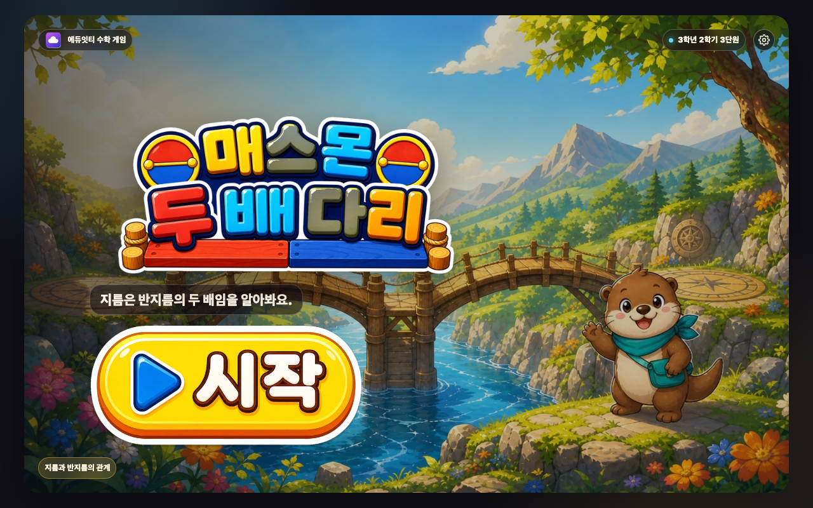

- 학생이 보는 것: 수달몬과 계곡 다리, 게임 제목, 한 줄 목표, `시작` 버튼입니다.
- 판단하거나 누르는 것: 게임을 시작할 준비가 되면 `시작`을 누릅니다.
- 화면에서 확인되는 수학 관계: 한 줄 목표에서 반지름 두 개를 이으면 지름이 된다는 배움 방향을 먼저 봅니다.
- 다음 상태로 넘어가는 이유: 문제를 풀기 전에 다리를 잇는 방법을 확인하기 위해 설명 1로 이동합니다.

### 설정

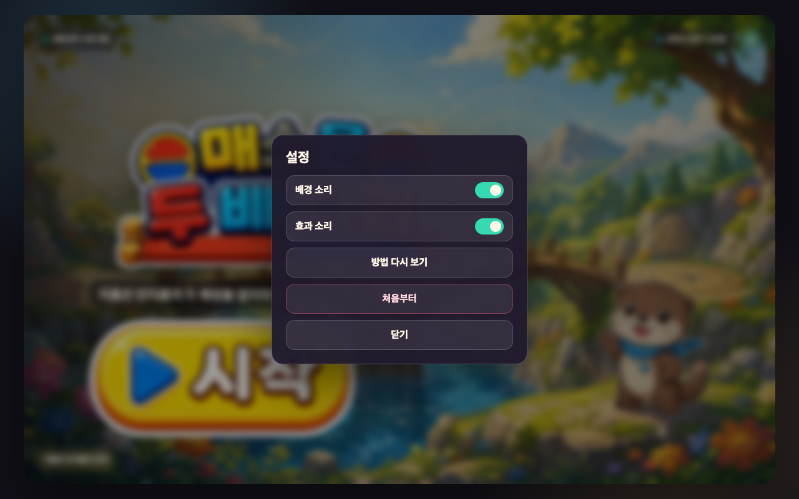

- 학생이 보는 것: 배경 소리·효과 소리, 방법 다시 보기, 처음부터, 닫기입니다.
- 판단하거나 누르는 것: 필요한 소리와 이동 행동 하나를 고릅니다.
- 화면에서 확인되는 수학 관계: 계산 내용을 바꾸지 않는 전역 조작만 모달 안에 모여 있습니다.
- 다음 상태로 넘어가는 이유: 설정을 마치면 원래 화면으로 돌아갑니다.

### 설명

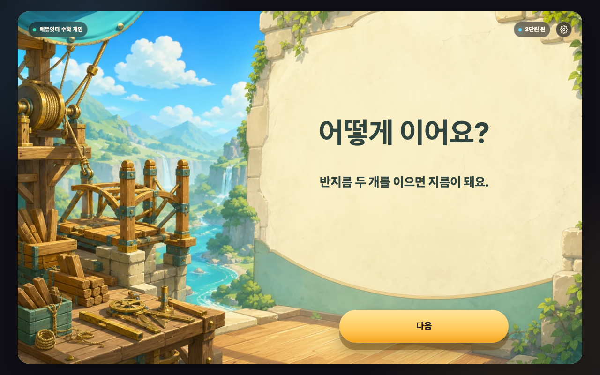

- 학생이 보는 것: 반지름 `3 cm + 3 cm = 6 cm`와 두 다리 조각이 이어지는 장면입니다.
- 판단하거나 누르는 것: 반지름 두 개가 지름 하나가 되는 모습을 확인하고 `다음`을 누릅니다.
- 화면에서 확인되는 수학 관계: `반지름 + 반지름 = 지름`입니다.
- 다음 상태로 넘어가는 이유: 풀이 방법을 확인했으므로 보상 목표를 보기 위해 설명 2로 이동합니다.

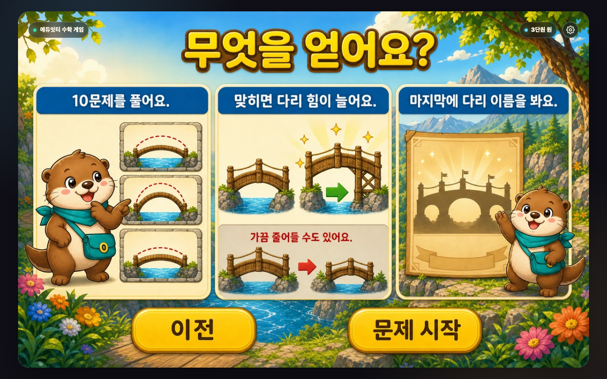

- 학생이 보는 것: 10문제와 여섯 다리 단계, 마지막에 완성한 다리를 보는 흐름입니다.
- 판단하거나 누르는 것: 게임의 목표를 확인하고 `문제 시작`을 누릅니다.
- 화면에서 확인되는 수학 관계: 문제에서 고른 길이가 다리 단계 변화로 이어집니다.
- 다음 상태로 넘어가는 이유: 방법과 목표를 모두 확인했으므로 첫 문제로 이동합니다.

### 문제

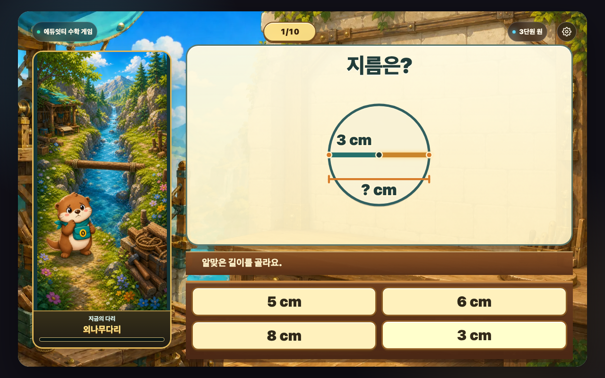

- 학생이 보는 것: 왼쪽의 현재 다리, 오른쪽의 원과 길이 관계, 바로 아래의 네 선택지입니다.
- 판단하거나 누르는 것: 주어진 지름 또는 반지름에 맞는 길이 하나를 고릅니다.
- 화면에서 확인되는 수학 관계: 지름은 반지름의 두 배이고 반지름은 지름의 반입니다.
- 다음 상태로 넘어가는 이유: 고른 값이 관계에 맞는지 확인하기 위해 오답 또는 정답 확인 상태로 이동합니다.

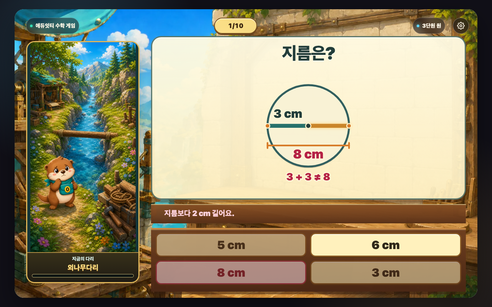

- 학생이 보는 것: 고른 길이와 정답 길이의 차이, 완성되지 않은 식입니다.
- 판단하거나 누르는 것: 짧거나 긴 이유를 그림으로 확인하고 다른 선택지를 고릅니다.
- 화면에서 확인되는 수학 관계: 두 반지름의 합이나 지름의 반과 고른 길이가 같지 않음을 `≠`로 봅니다.
- 다음 상태로 넘어가는 이유: 관계가 맞지 않으므로 같은 문제에서 다시 판단합니다.

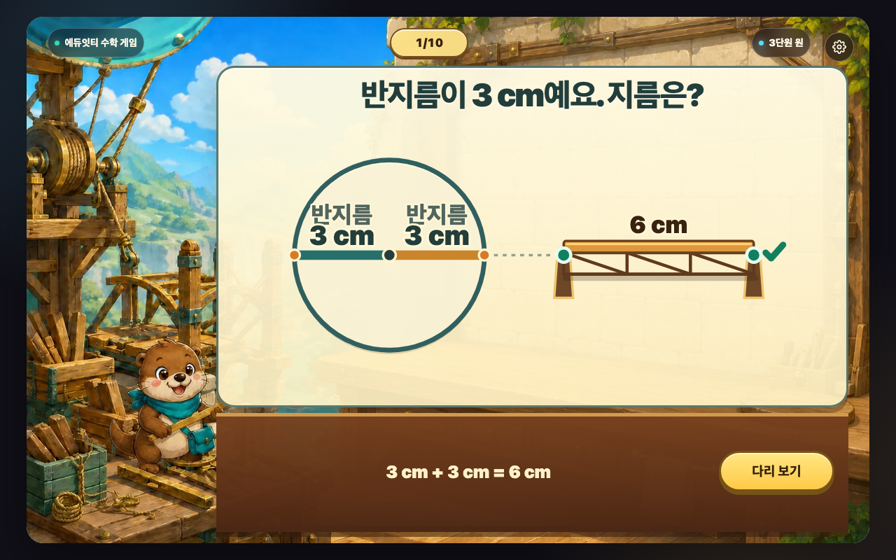

- 학생이 보는 것: 원 안에 들어간 정답 길이, 완성식, `점수 보기` 버튼입니다.
- 판단하거나 누르는 것: 완성된 관계를 읽은 뒤 아직 공개되지 않은 점수를 보기 위해 버튼을 누릅니다.
- 화면에서 확인되는 수학 관계: `반지름 + 반지름 = 지름` 또는 `지름 ÷ 2 = 반지름`이 완성됩니다.
- 다음 상태로 넘어가는 이유: 수학 관계 확인이 끝났으므로 랜덤 보상으로 이동합니다.

### 보상

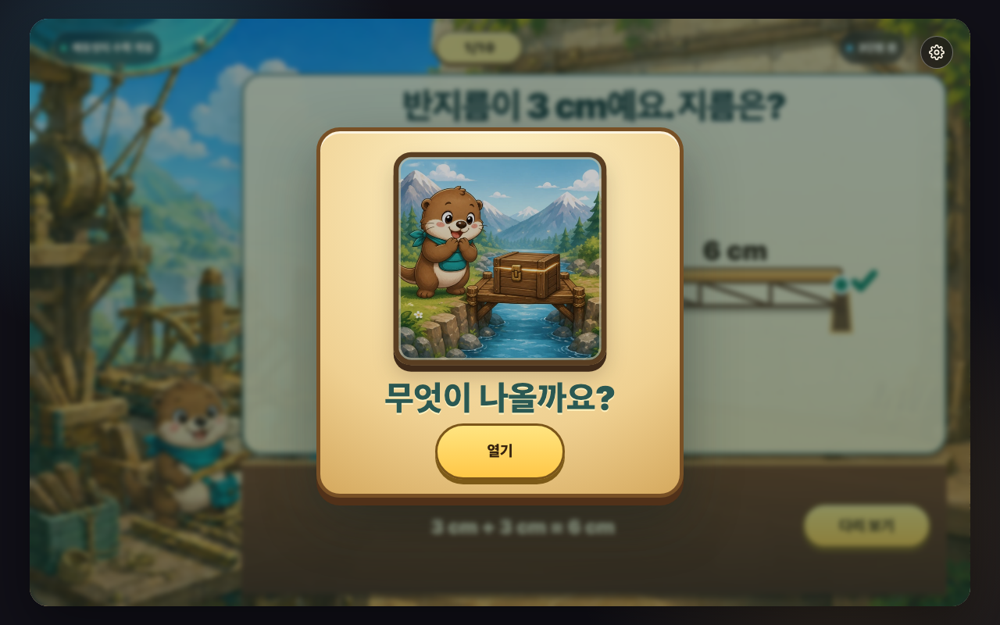

- 학생이 보는 것: 결과가 아직 보이지 않는 닫힌 보상 그림과 `열기` 버튼입니다.
- 판단하거나 누르는 것: 보상 결과를 확인하기 위해 `열기`를 누릅니다.
- 화면에서 확인되는 수학 관계: 뒤 문제 화면은 정답 확인 상태로 유지되어 방금 완성한 관계가 먼저 남습니다.
- 다음 상태로 넘어가는 이유: 학생이 직접 열기를 선택한 뒤에만 이번 점수가 공개됩니다.

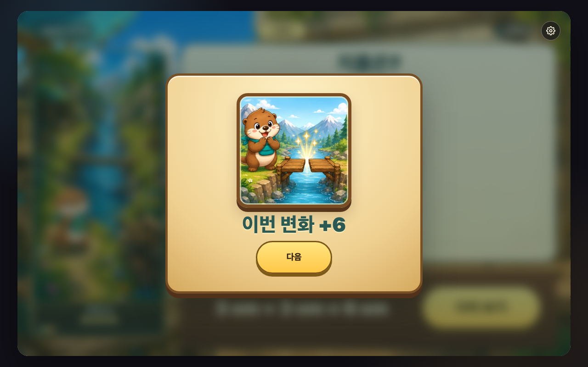

- 학생이 보는 것: 사건 그림과 `뚝딱뚝딱 점수 ±값`, `다음` 버튼입니다.
- 판단하거나 누르는 것: 이번 변화를 확인하고 다음 문제로 갈지 누릅니다.
- 화면에서 확인되는 수학 관계: 정답 확인과 랜덤 점수는 분리되어 계산은 예측 가능하고 보상은 예측 불가능합니다.
- 다음 상태로 넘어가는 이유: 보상을 한 번 확인한 뒤 모달을 닫고 다리의 실제 변화를 봅니다.

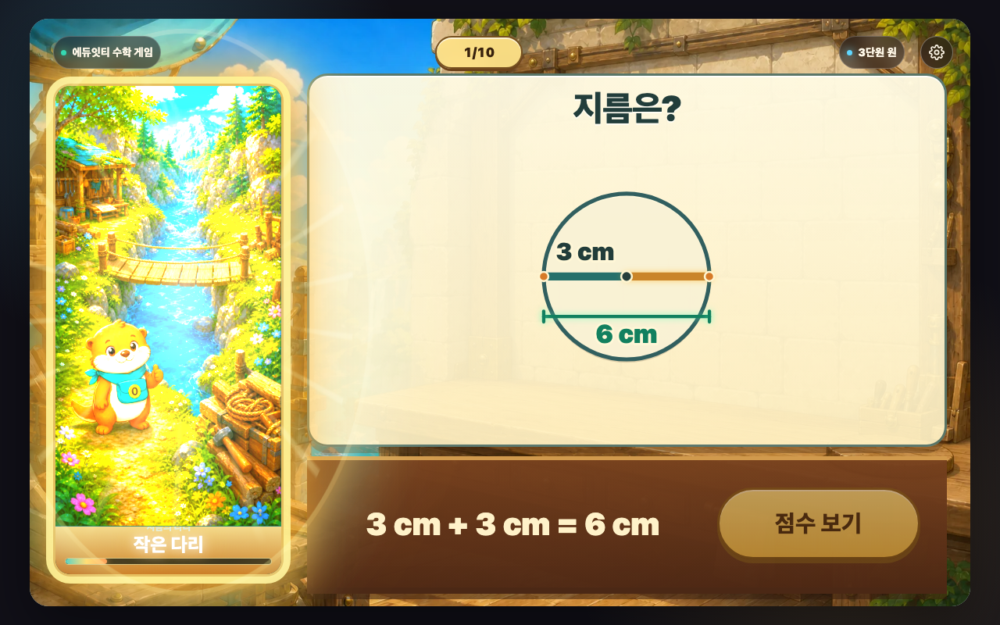

- 학생이 보는 것: 모달이 닫힌 뒤 왼쪽 다리가 바뀌고 Stage에 번지는 단계 상승 효과입니다.
- 판단하거나 누르는 것: 별도 입력 없이 점수가 다리 세계를 바꾸는 모습을 확인합니다.
- 화면에서 확인되는 수학 관계: 방금 문제의 결과가 현재 다리 단계에 한 번만 반영됩니다.
- 다음 상태로 넘어가는 이유: 최소 확인 시간이 끝난 뒤에만 다음 문제 또는 결과로 이동합니다.

### 결과

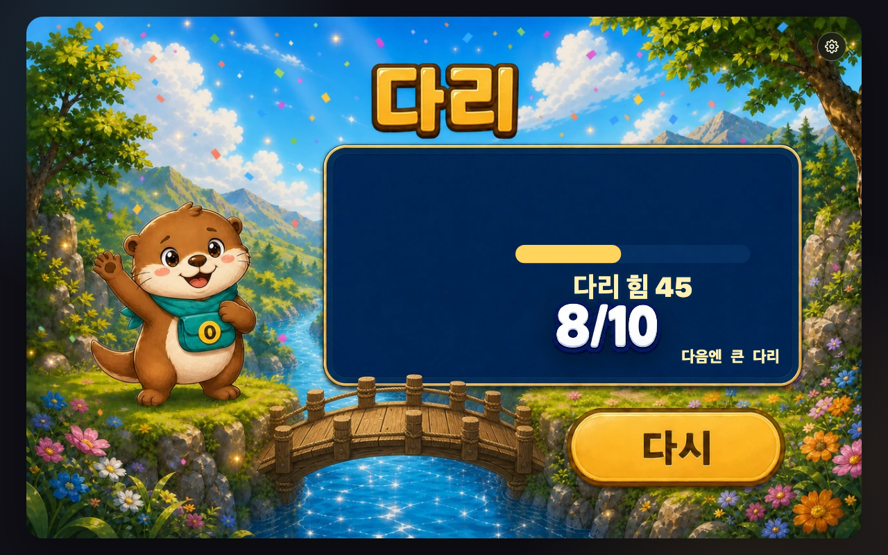

- 학생이 보는 것: 완성한 다리와 수달몬, 결과 이름, 정답 수, 다음 목표, 큰 `다시` 버튼입니다.
- 판단하거나 누르는 것: 현재 결과와 다음 목표를 비교하고 다시 도전할지 결정합니다.
- 화면에서 확인되는 수학 관계: 10문제의 정답 수와 누적 보상이 하나의 다리 단계로 정리됩니다.
- 다음 상태로 넘어가는 이유: `다시`를 누르면 새 문제 순서와 새 보상 흐름으로 재도전합니다.

### 화면 크기별 전체 상태

#### 1280×800 · DPR 1 · 39장

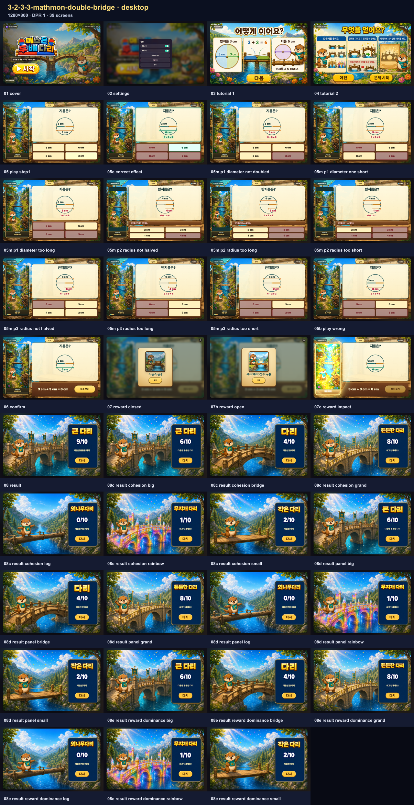

#### 1024×768 · DPR 1 · 39장

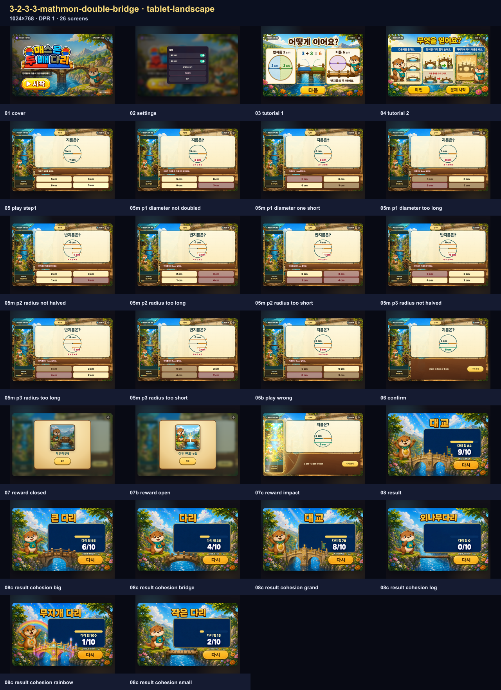

#### 1079×929 · DPR 1 · 36장

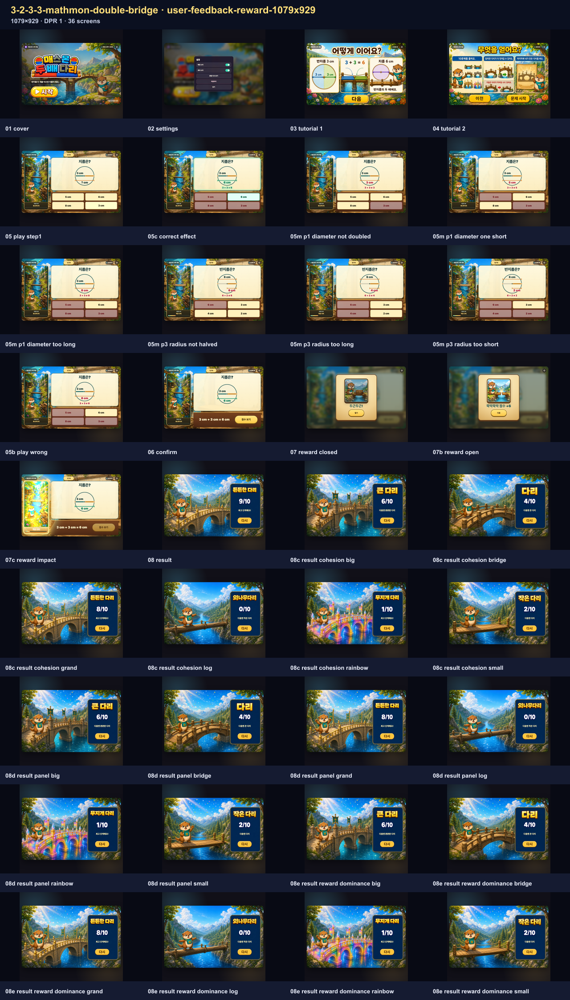

#### 1280×720 · DPR 2 · 39장

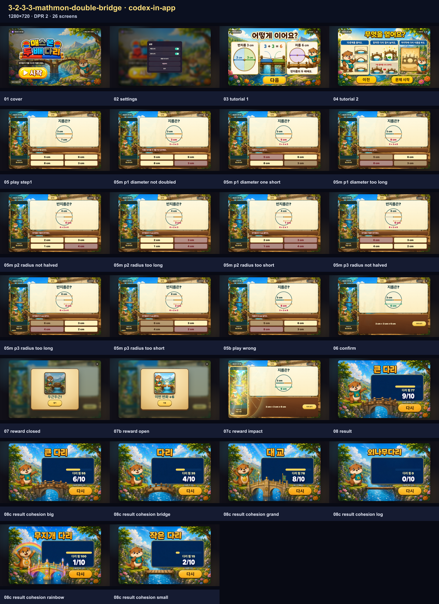

#### 994×632 · DPR 1 · 39장

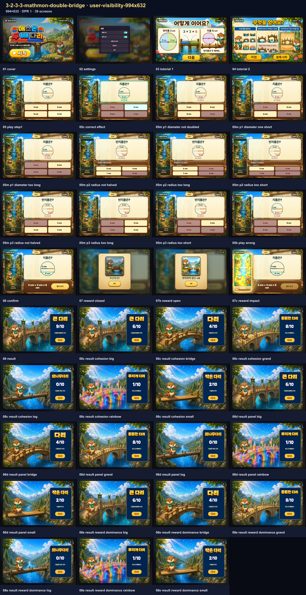

#### 1082×987 · DPR 2 · 38장

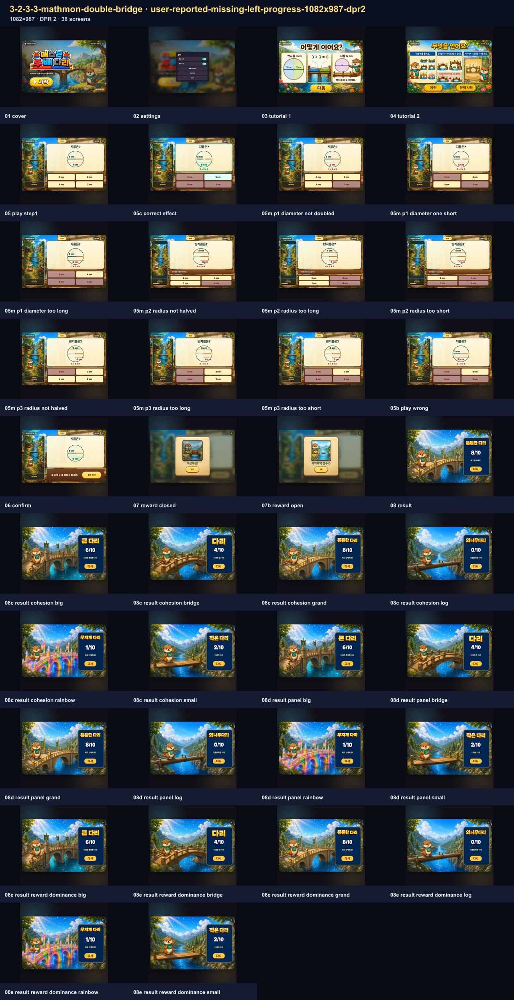

- 현재 실행본 해시, 각 원본 캡처 해시, viewport·DPR·파일 목록은 `screenshots/report-evidence-manifest.json`에 기록했습니다.
- 학생에게 보이는 새 문구는 추가하지 않았습니다. 기존 문구의 Humanizer 자연도 A와 의미 보존 상태를 유지합니다.

<!-- REPORT-EVIDENCE-ALL:START -->

## 2026-08-29 최신 원본 스크린샷 전수

- 실행본 SHA-256: `a1f507484457bc719f28ca75d43e3ee66d6cd2a09234ced0edb22819dd2f5347`
- 생성 시각: `2026-08-29T10:30:03.638Z`
- 등록 회귀 이름: `6개`
- 실제 실행 화면 조건: `6개`
- 동일 조건 별칭 통합: `0개`
- 아래에 직접 삽입한 원본 캡처: `188장`
- 같은 width×height×DPR과 같은 fixture 조건은 한 번만 실행하고, 과거 오류 이름은 별칭으로 보존했습니다.
- manifest에 기록된 실제 실행 원본 캡처를 한 장씩 연결했습니다.

### desktop · 1280×800 · DPR 1 · 37장

- 같은 실행으로 보존한 회귀 이름: 없음
- 캡처 범위: `full-flow`

#### 시작 화면 · `engine-flow-desktop-01-cover.png`

- 학생이 보는 것: 수달몬과 계곡 다리, 게임 제목, 한 줄 목표, 시작 버튼을 봅니다.
- 판단하거나 누르는 것: 게임을 시작할 준비가 되면 시작을 누릅니다.
- 화면에서 확인되는 수학 관계: 반지름 두 개를 이으면 지름이 된다는 배움 방향을 먼저 확인합니다.
- 다음 상태로 넘어가는 이유: 다리를 잇는 방법을 확인하는 설명 화면으로 이동합니다.

#### 설정 화면 · `engine-flow-desktop-02-settings.png`

- 학생이 보는 것: 배경 소리·효과 소리와 방법 다시 보기, 처음부터, 닫기를 봅니다.
- 판단하거나 누르는 것: 필요한 소리나 이동 행동 하나를 고릅니다.
- 화면에서 확인되는 수학 관계: 수학 문제는 바꾸지 않고 게임 조작만 설정합니다.
- 다음 상태로 넘어가는 이유: 설정을 마치면 열기 전 화면으로 돌아갑니다.

#### 설명 1 · 풀이 방법 · `engine-flow-desktop-03-tutorial-1.png`

- 학생이 보는 것: 두 반지름을 이어 하나의 지름을 만드는 예를 봅니다.
- 판단하거나 누르는 것: 반지름 두 개가 지름 하나가 되는 모습을 확인하고 다음을 누릅니다.
- 화면에서 확인되는 수학 관계: 반지름 + 반지름 = 지름 관계를 확인합니다.
- 다음 상태로 넘어가는 이유: 문제 수와 다리 목표를 보는 설명 2로 이동합니다.

#### 설명 2 · 보상과 목표 · `engine-flow-desktop-04-tutorial-2.png`

- 학생이 보는 것: 10문제와 여섯 다리 단계, 마지막 결과 흐름을 봅니다.
- 판단하거나 누르는 것: 게임 목표를 확인하고 문제 시작을 누릅니다.
- 화면에서 확인되는 수학 관계: 문제에서 고른 길이가 다리 단계 변화로 이어짐을 확인합니다.
- 다음 상태로 넘어가는 이유: 첫 번째 반지름·지름 문제로 이동합니다.

#### 문제 대기 · `engine-flow-desktop-05-play-step1.png`

- 학생이 보는 것: 왼쪽 현재 다리와 오른쪽 원의 길이 관계, 네 선택지를 봅니다.
- 판단하거나 누르는 것: 주어진 지름 또는 반지름에 맞는 길이 하나를 고릅니다.
- 화면에서 확인되는 수학 관계: 지름은 반지름의 두 배이고 반지름은 지름의 반임을 판단합니다.
- 다음 상태로 넘어가는 이유: 고른 길이에 따라 오답 또는 정답 확인 상태로 이동합니다.

#### 정답 선택 효과 · `engine-flow-desktop-05c-correct-effect.png`

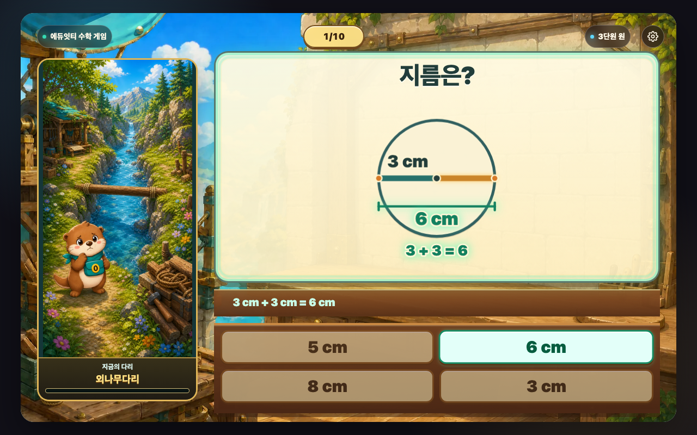

- 학생이 보는 것: 고른 정답이 원과 길이 그림에 들어가는 짧은 효과를 봅니다.
- 판단하거나 누르는 것: 별도 입력 없이 자신이 고른 길이가 적용되는 모습을 확인합니다.
- 화면에서 확인되는 수학 관계: 선택한 길이가 반지름·지름 관계를 정확히 완성합니다.
- 다음 상태로 넘어가는 이유: 완성식과 점수 보기 버튼이 있는 정답 확인으로 이어집니다.

#### 05n-next-problem-clean · `engine-flow-desktop-05n-next-problem-clean.png`

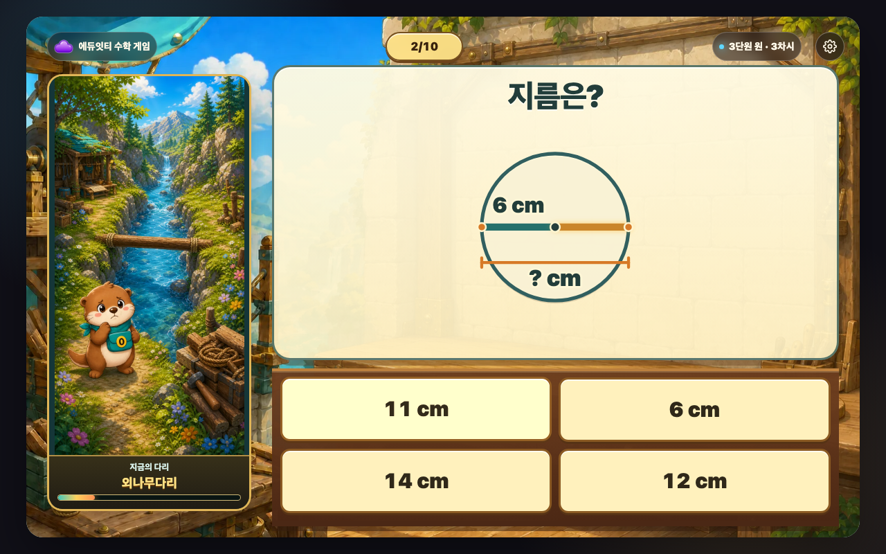

- 학생이 보는 것: 현재 게임 상태의 모든 보이는 요소를 확인합니다.
- 판단하거나 누르는 것: 이 상태에서 요구되는 한 가지 행동이나 자동 전환을 확인합니다.
- 화면에서 확인되는 수학 관계: 반지름과 지름의 관계가 화면 상태에 맞게 유지되는지 확인합니다.
- 다음 상태로 넘어가는 이유: 정해진 게임 흐름의 다음 상태로 이동합니다.

#### 1번 문제 유형 · 지름을 반으로 나누지 않은 오답 · `engine-flow-desktop-05m-p1-radius-not-halved.png`

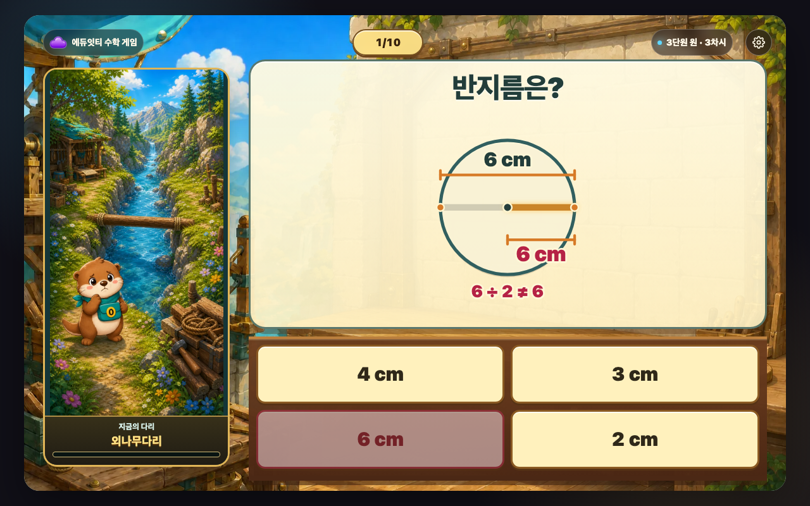

- 학생이 보는 것: 고른 길이와 목표 길이가 맞지 않는 원 그림과 오답 표시를 봅니다.
- 판단하거나 누르는 것: 길이가 짧은지, 긴지, 두 배나 반으로 계산하지 않았는지 확인합니다.
- 화면에서 확인되는 수학 관계: 반지름 두 개의 합 또는 지름의 반과 고른 길이가 같지 않음을 확인합니다.
- 다음 상태로 넘어가는 이유: 같은 문제에서 다른 길이를 다시 고릅니다.

#### 1번 문제 유형 · 반지름보다 긴 오답 · `engine-flow-desktop-05m-p1-radius-too-long.png`

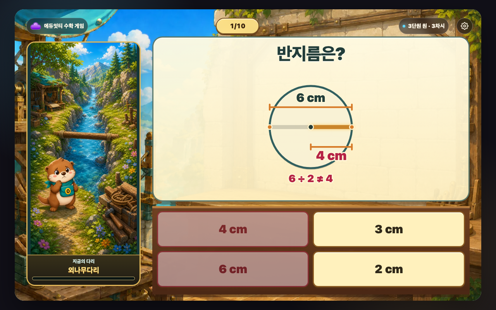

- 학생이 보는 것: 고른 길이와 목표 길이가 맞지 않는 원 그림과 오답 표시를 봅니다.
- 판단하거나 누르는 것: 길이가 짧은지, 긴지, 두 배나 반으로 계산하지 않았는지 확인합니다.
- 화면에서 확인되는 수학 관계: 반지름 두 개의 합 또는 지름의 반과 고른 길이가 같지 않음을 확인합니다.
- 다음 상태로 넘어가는 이유: 같은 문제에서 다른 길이를 다시 고릅니다.

#### 1번 문제 유형 · 반지름보다 짧은 오답 · `engine-flow-desktop-05m-p1-radius-too-short.png`

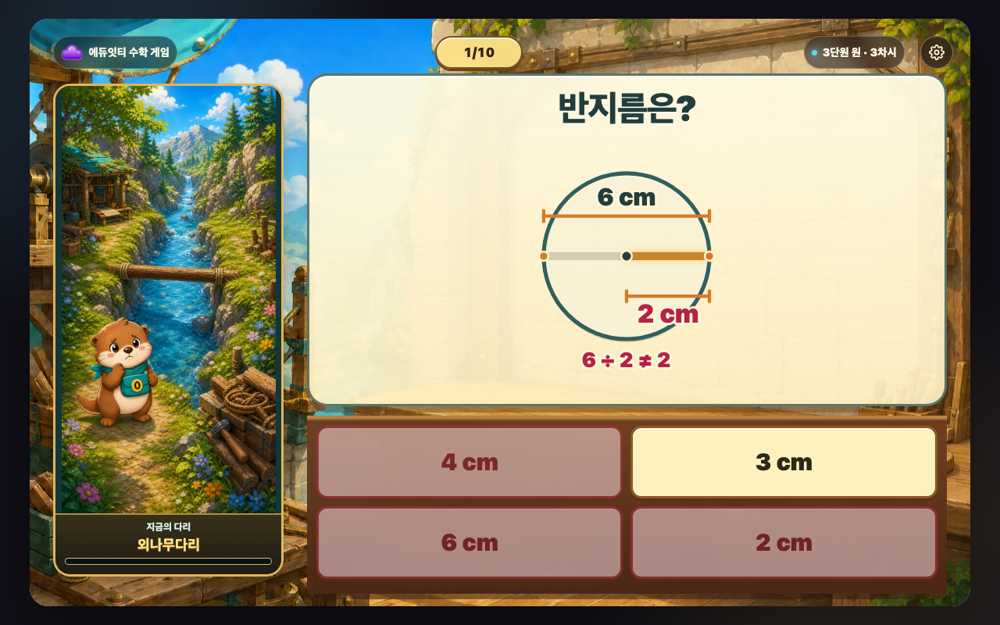

- 학생이 보는 것: 고른 길이와 목표 길이가 맞지 않는 원 그림과 오답 표시를 봅니다.
- 판단하거나 누르는 것: 길이가 짧은지, 긴지, 두 배나 반으로 계산하지 않았는지 확인합니다.
- 화면에서 확인되는 수학 관계: 반지름 두 개의 합 또는 지름의 반과 고른 길이가 같지 않음을 확인합니다.
- 다음 상태로 넘어가는 이유: 같은 문제에서 다른 길이를 다시 고릅니다.

#### 2번 문제 유형 · 반지름을 두 배 하지 않은 오답 · `engine-flow-desktop-05m-p2-diameter-not-doubled.png`

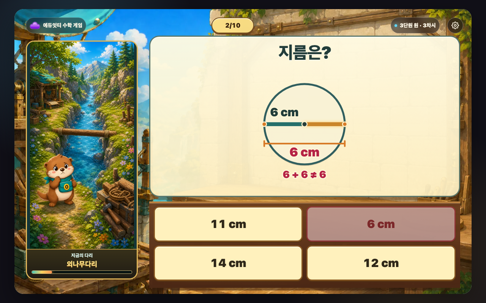

- 학생이 보는 것: 고른 길이와 목표 길이가 맞지 않는 원 그림과 오답 표시를 봅니다.
- 판단하거나 누르는 것: 길이가 짧은지, 긴지, 두 배나 반으로 계산하지 않았는지 확인합니다.
- 화면에서 확인되는 수학 관계: 반지름 두 개의 합 또는 지름의 반과 고른 길이가 같지 않음을 확인합니다.
- 다음 상태로 넘어가는 이유: 같은 문제에서 다른 길이를 다시 고릅니다.

#### 2번 문제 유형 · 지름보다 1 cm 짧은 오답 · `engine-flow-desktop-05m-p2-diameter-one-short.png`

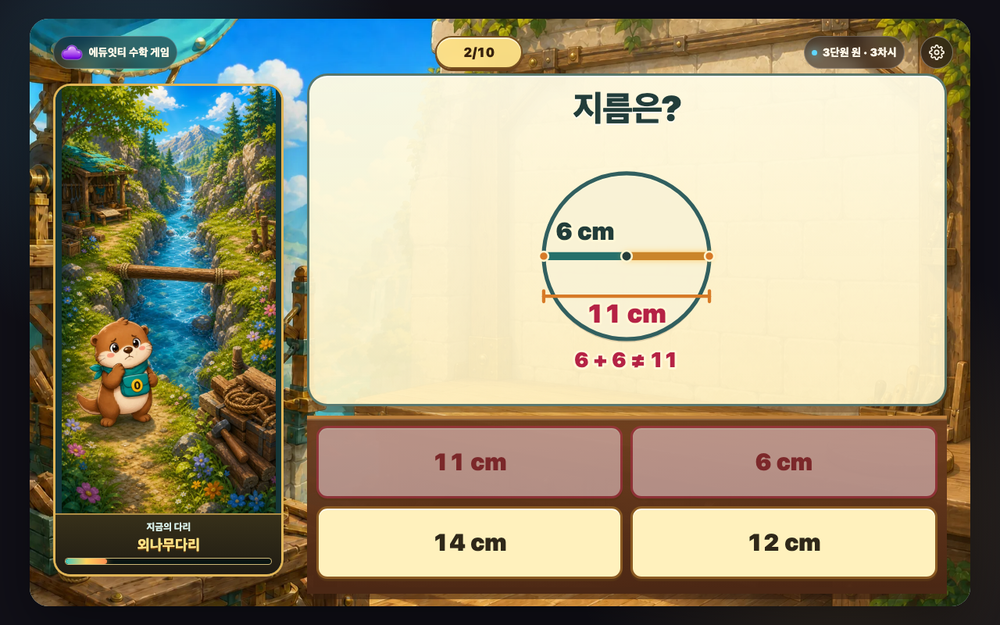

- 학생이 보는 것: 고른 길이와 목표 길이가 맞지 않는 원 그림과 오답 표시를 봅니다.
- 판단하거나 누르는 것: 길이가 짧은지, 긴지, 두 배나 반으로 계산하지 않았는지 확인합니다.
- 화면에서 확인되는 수학 관계: 반지름 두 개의 합 또는 지름의 반과 고른 길이가 같지 않음을 확인합니다.
- 다음 상태로 넘어가는 이유: 같은 문제에서 다른 길이를 다시 고릅니다.

#### 2번 문제 유형 · 지름보다 긴 오답 · `engine-flow-desktop-05m-p2-diameter-too-long.png`

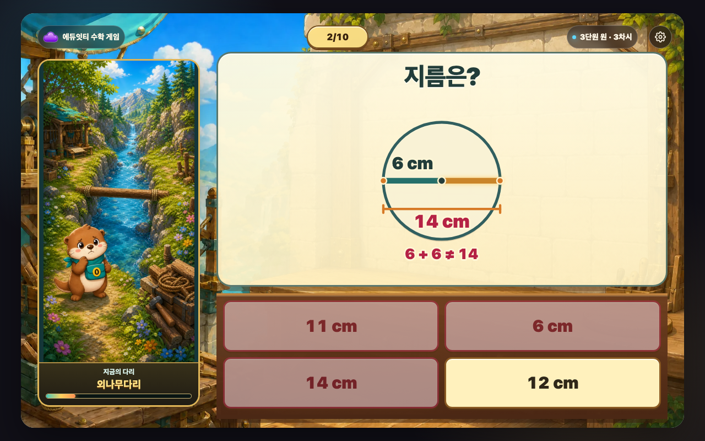

- 학생이 보는 것: 고른 길이와 목표 길이가 맞지 않는 원 그림과 오답 표시를 봅니다.
- 판단하거나 누르는 것: 길이가 짧은지, 긴지, 두 배나 반으로 계산하지 않았는지 확인합니다.
- 화면에서 확인되는 수학 관계: 반지름 두 개의 합 또는 지름의 반과 고른 길이가 같지 않음을 확인합니다.
- 다음 상태로 넘어가는 이유: 같은 문제에서 다른 길이를 다시 고릅니다.

#### 대표 오답 · `engine-flow-desktop-05b-play-wrong.png`

- 학생이 보는 것: 고른 길이와 정답 길이의 차이, 완성되지 않은 관계를 봅니다.
- 판단하거나 누르는 것: 오답 이유를 그림으로 확인하고 다른 선택지를 고릅니다.
- 화면에서 확인되는 수학 관계: 두 반지름의 합이나 지름의 반과 고른 길이가 같지 않음을 봅니다.
- 다음 상태로 넘어가는 이유: 관계가 맞을 때까지 같은 문제에서 다시 판단합니다.

#### 정답 확인 · `engine-flow-desktop-06-confirm.png`

- 학생이 보는 것: 원 안에 들어간 정답 길이와 완성식, 점수 보기 버튼을 봅니다.
- 판단하거나 누르는 것: 완성된 관계를 읽은 뒤 점수 보기를 누릅니다.
- 화면에서 확인되는 수학 관계: 반지름 + 반지름 = 지름 또는 지름 ÷ 2 = 반지름을 확인합니다.
- 다음 상태로 넘어가는 이유: 수학 관계를 확인한 뒤 닫힌 보상으로 이동합니다.

#### 닫힌 보상 · `engine-flow-desktop-07-reward-closed.png`

- 학생이 보는 것: 결과가 아직 드러나지 않은 보상 그림과 열기 버튼을 봅니다.
- 판단하거나 누르는 것: 이번 점수를 확인하기 위해 열기를 누릅니다.
- 화면에서 확인되는 수학 관계: 뒤 문제 화면에는 방금 완성한 반지름·지름 관계가 그대로 남습니다.
- 다음 상태로 넘어가는 이유: 학생이 직접 연 뒤에만 이번 보상 사건이 공개됩니다.

#### 열린 보상 · `engine-flow-desktop-07b-reward-open.png`

- 학생이 보는 것: 보상 사건 그림과 이번 점수 변화, 다음 버튼을 봅니다.
- 판단하거나 누르는 것: 이번 변화를 확인하고 다음을 누릅니다.
- 화면에서 확인되는 수학 관계: 정답 계산과 무작위 점수가 서로 분리되어 있음을 확인합니다.
- 다음 상태로 넘어가는 이유: 모달을 먼저 닫고 다리 세계의 실제 변화를 보여 줍니다.

#### 모달 종료 뒤 다리 변화 · `engine-flow-desktop-07c-reward-impact.png`

- 학생이 보는 것: 모달이 닫힌 뒤 왼쪽 다리가 바뀌고 Stage에 번지는 빛 효과를 봅니다.
- 판단하거나 누르는 것: 별도 입력 없이 이번 보상이 다리 단계를 바꾸는 모습을 확인합니다.
- 화면에서 확인되는 수학 관계: 한 문제의 보상이 현재 다리 단계에 정확히 한 번 반영됩니다.
- 다음 상태로 넘어가는 이유: 효과를 충분히 본 뒤 다음 문제 또는 결과로 이동합니다.

#### 실제 결과 · `engine-flow-desktop-08-result.png`

- 학생이 보는 것: 완성한 다리와 수달몬, 결과 이름, 정답 수, 다음 목표, 다시 버튼을 봅니다.
- 판단하거나 누르는 것: 현재 결과와 다음 목표를 비교하고 다시 도전할지 결정합니다.
- 화면에서 확인되는 수학 관계: 10문제의 정답 수와 누적 보상이 하나의 다리 단계로 정리됩니다.
- 다음 상태로 넘어가는 이유: 다시를 누르면 새 문제 순서와 새 보상 흐름으로 시작합니다.

#### 결과 결속 · 큰 다리 · `engine-flow-desktop-08c-result-cohesion-big.png`

- 학생이 보는 것: 큰 다리 완성 장면과 결과판 안의 결과 이름·정답 수·다시 버튼을 봅니다.
- 판단하거나 누르는 것: 결과 요소가 한 결과판 안에 모이고 다리가 주인공으로 보이는지 확인합니다.
- 화면에서 확인되는 수학 관계: 같은 정답·보상 기준이 해당 다리 단계 장면으로 연결됩니다.
- 다음 상태로 넘어가는 이유: 이 화면은 결과 단계별 레이아웃 회귀 증거로 남습니다.

#### 결과 결속 · 튼튼한 다리 · `engine-flow-desktop-08c-result-cohesion-bridge.png`

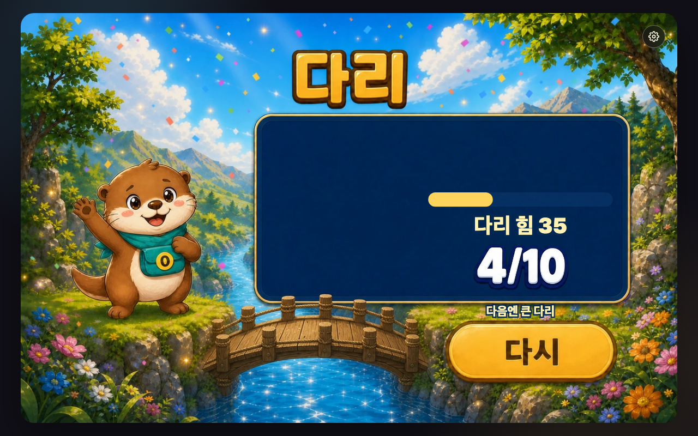

- 학생이 보는 것: 튼튼한 다리 완성 장면과 결과판 안의 결과 이름·정답 수·다시 버튼을 봅니다.
- 판단하거나 누르는 것: 결과 요소가 한 결과판 안에 모이고 다리가 주인공으로 보이는지 확인합니다.
- 화면에서 확인되는 수학 관계: 같은 정답·보상 기준이 해당 다리 단계 장면으로 연결됩니다.
- 다음 상태로 넘어가는 이유: 이 화면은 결과 단계별 레이아웃 회귀 증거로 남습니다.

#### 결과 결속 · 황금 다리 · `engine-flow-desktop-08c-result-cohesion-grand.png`

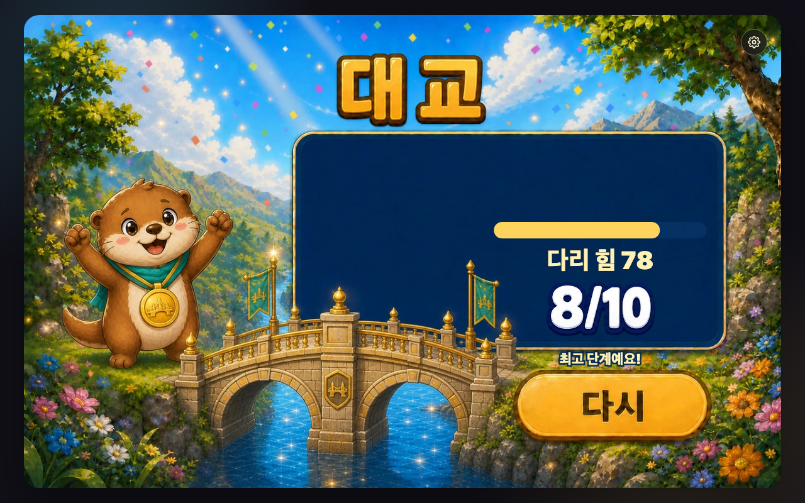

- 학생이 보는 것: 황금 다리 완성 장면과 결과판 안의 결과 이름·정답 수·다시 버튼을 봅니다.
- 판단하거나 누르는 것: 결과 요소가 한 결과판 안에 모이고 다리가 주인공으로 보이는지 확인합니다.
- 화면에서 확인되는 수학 관계: 같은 정답·보상 기준이 해당 다리 단계 장면으로 연결됩니다.
- 다음 상태로 넘어가는 이유: 이 화면은 결과 단계별 레이아웃 회귀 증거로 남습니다.

#### 결과 결속 · 외나무다리 · `engine-flow-desktop-08c-result-cohesion-log.png`

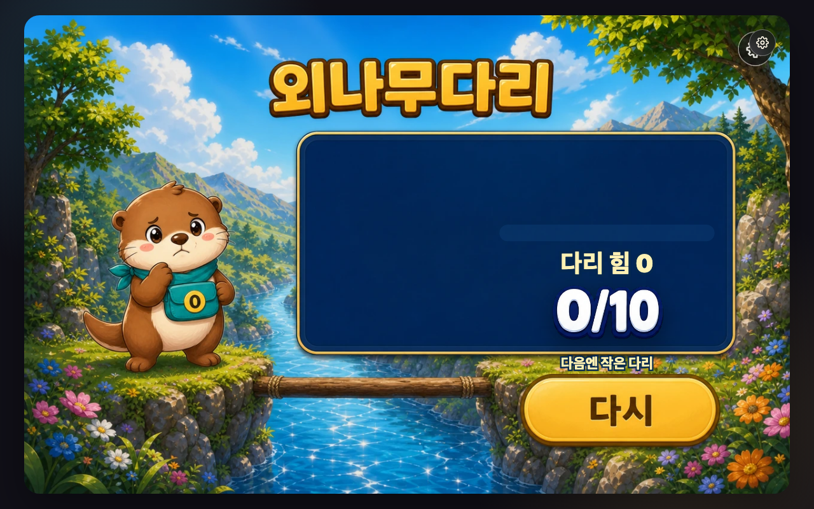

- 학생이 보는 것: 외나무다리 완성 장면과 결과판 안의 결과 이름·정답 수·다시 버튼을 봅니다.
- 판단하거나 누르는 것: 결과 요소가 한 결과판 안에 모이고 다리가 주인공으로 보이는지 확인합니다.
- 화면에서 확인되는 수학 관계: 같은 정답·보상 기준이 해당 다리 단계 장면으로 연결됩니다.
- 다음 상태로 넘어가는 이유: 이 화면은 결과 단계별 레이아웃 회귀 증거로 남습니다.

#### 결과 결속 · 무지개 다리 · `engine-flow-desktop-08c-result-cohesion-rainbow.png`

- 학생이 보는 것: 무지개 다리 완성 장면과 결과판 안의 결과 이름·정답 수·다시 버튼을 봅니다.
- 판단하거나 누르는 것: 결과 요소가 한 결과판 안에 모이고 다리가 주인공으로 보이는지 확인합니다.
- 화면에서 확인되는 수학 관계: 같은 정답·보상 기준이 해당 다리 단계 장면으로 연결됩니다.
- 다음 상태로 넘어가는 이유: 이 화면은 결과 단계별 레이아웃 회귀 증거로 남습니다.

#### 결과 결속 · 작은 다리 · `engine-flow-desktop-08c-result-cohesion-small.png`

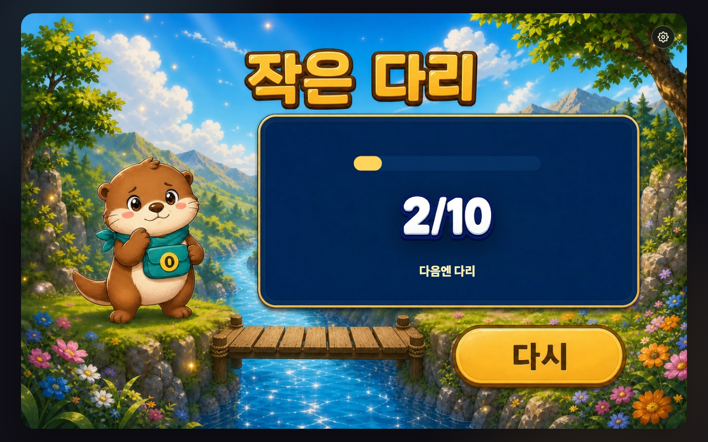

- 학생이 보는 것: 작은 다리 완성 장면과 결과판 안의 결과 이름·정답 수·다시 버튼을 봅니다.
- 판단하거나 누르는 것: 결과 요소가 한 결과판 안에 모이고 다리가 주인공으로 보이는지 확인합니다.
- 화면에서 확인되는 수학 관계: 같은 정답·보상 기준이 해당 다리 단계 장면으로 연결됩니다.
- 다음 상태로 넘어가는 이유: 이 화면은 결과 단계별 레이아웃 회귀 증거로 남습니다.

#### 결과판 포함 · 큰 다리 · `engine-flow-desktop-08d-result-panel-big.png`

- 학생이 보는 것: 큰 다리 완성 장면과 결과판 안의 결과 이름·정답 수·다시 버튼을 봅니다.
- 판단하거나 누르는 것: 결과 요소가 한 결과판 안에 모이고 다리가 주인공으로 보이는지 확인합니다.
- 화면에서 확인되는 수학 관계: 같은 정답·보상 기준이 해당 다리 단계 장면으로 연결됩니다.
- 다음 상태로 넘어가는 이유: 이 화면은 결과 단계별 레이아웃 회귀 증거로 남습니다.

#### 결과판 포함 · 튼튼한 다리 · `engine-flow-desktop-08d-result-panel-bridge.png`

- 학생이 보는 것: 튼튼한 다리 완성 장면과 결과판 안의 결과 이름·정답 수·다시 버튼을 봅니다.
- 판단하거나 누르는 것: 결과 요소가 한 결과판 안에 모이고 다리가 주인공으로 보이는지 확인합니다.
- 화면에서 확인되는 수학 관계: 같은 정답·보상 기준이 해당 다리 단계 장면으로 연결됩니다.
- 다음 상태로 넘어가는 이유: 이 화면은 결과 단계별 레이아웃 회귀 증거로 남습니다.

#### 결과판 포함 · 황금 다리 · `engine-flow-desktop-08d-result-panel-grand.png`

- 학생이 보는 것: 황금 다리 완성 장면과 결과판 안의 결과 이름·정답 수·다시 버튼을 봅니다.
- 판단하거나 누르는 것: 결과 요소가 한 결과판 안에 모이고 다리가 주인공으로 보이는지 확인합니다.
- 화면에서 확인되는 수학 관계: 같은 정답·보상 기준이 해당 다리 단계 장면으로 연결됩니다.
- 다음 상태로 넘어가는 이유: 이 화면은 결과 단계별 레이아웃 회귀 증거로 남습니다.

#### 결과판 포함 · 외나무다리 · `engine-flow-desktop-08d-result-panel-log.png`

- 학생이 보는 것: 외나무다리 완성 장면과 결과판 안의 결과 이름·정답 수·다시 버튼을 봅니다.
- 판단하거나 누르는 것: 결과 요소가 한 결과판 안에 모이고 다리가 주인공으로 보이는지 확인합니다.
- 화면에서 확인되는 수학 관계: 같은 정답·보상 기준이 해당 다리 단계 장면으로 연결됩니다.
- 다음 상태로 넘어가는 이유: 이 화면은 결과 단계별 레이아웃 회귀 증거로 남습니다.

#### 결과판 포함 · 무지개 다리 · `engine-flow-desktop-08d-result-panel-rainbow.png`

- 학생이 보는 것: 무지개 다리 완성 장면과 결과판 안의 결과 이름·정답 수·다시 버튼을 봅니다.
- 판단하거나 누르는 것: 결과 요소가 한 결과판 안에 모이고 다리가 주인공으로 보이는지 확인합니다.
- 화면에서 확인되는 수학 관계: 같은 정답·보상 기준이 해당 다리 단계 장면으로 연결됩니다.
- 다음 상태로 넘어가는 이유: 이 화면은 결과 단계별 레이아웃 회귀 증거로 남습니다.

#### 결과판 포함 · 작은 다리 · `engine-flow-desktop-08d-result-panel-small.png`

- 학생이 보는 것: 작은 다리 완성 장면과 결과판 안의 결과 이름·정답 수·다시 버튼을 봅니다.
- 판단하거나 누르는 것: 결과 요소가 한 결과판 안에 모이고 다리가 주인공으로 보이는지 확인합니다.
- 화면에서 확인되는 수학 관계: 같은 정답·보상 기준이 해당 다리 단계 장면으로 연결됩니다.
- 다음 상태로 넘어가는 이유: 이 화면은 결과 단계별 레이아웃 회귀 증거로 남습니다.

#### 다리 보상 우선 · 큰 다리 · `engine-flow-desktop-08e-result-reward-dominance-big.png`

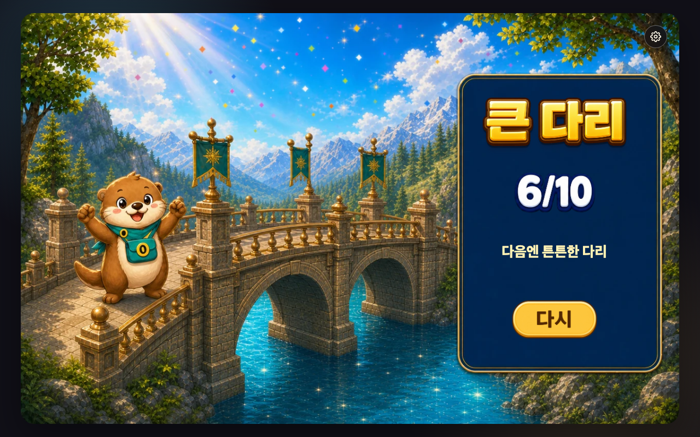

- 학생이 보는 것: 큰 다리 완성 장면과 결과판 안의 결과 이름·정답 수·다시 버튼을 봅니다.
- 판단하거나 누르는 것: 결과 요소가 한 결과판 안에 모이고 다리가 주인공으로 보이는지 확인합니다.
- 화면에서 확인되는 수학 관계: 같은 정답·보상 기준이 해당 다리 단계 장면으로 연결됩니다.
- 다음 상태로 넘어가는 이유: 이 화면은 결과 단계별 레이아웃 회귀 증거로 남습니다.

#### 다리 보상 우선 · 튼튼한 다리 · `engine-flow-desktop-08e-result-reward-dominance-bridge.png`

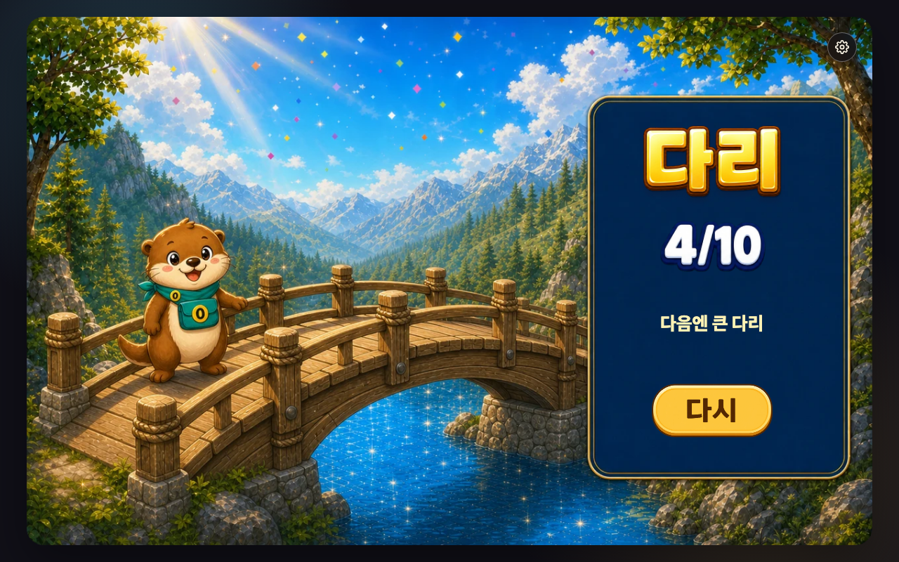

- 학생이 보는 것: 튼튼한 다리 완성 장면과 결과판 안의 결과 이름·정답 수·다시 버튼을 봅니다.
- 판단하거나 누르는 것: 결과 요소가 한 결과판 안에 모이고 다리가 주인공으로 보이는지 확인합니다.
- 화면에서 확인되는 수학 관계: 같은 정답·보상 기준이 해당 다리 단계 장면으로 연결됩니다.
- 다음 상태로 넘어가는 이유: 이 화면은 결과 단계별 레이아웃 회귀 증거로 남습니다.

#### 다리 보상 우선 · 황금 다리 · `engine-flow-desktop-08e-result-reward-dominance-grand.png`

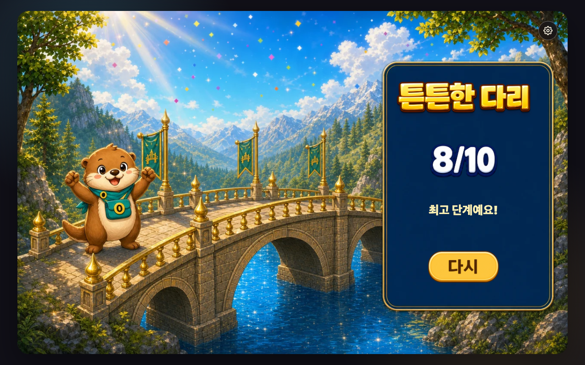

- 학생이 보는 것: 황금 다리 완성 장면과 결과판 안의 결과 이름·정답 수·다시 버튼을 봅니다.
- 판단하거나 누르는 것: 결과 요소가 한 결과판 안에 모이고 다리가 주인공으로 보이는지 확인합니다.
- 화면에서 확인되는 수학 관계: 같은 정답·보상 기준이 해당 다리 단계 장면으로 연결됩니다.
- 다음 상태로 넘어가는 이유: 이 화면은 결과 단계별 레이아웃 회귀 증거로 남습니다.

#### 다리 보상 우선 · 외나무다리 · `engine-flow-desktop-08e-result-reward-dominance-log.png`

- 학생이 보는 것: 외나무다리 완성 장면과 결과판 안의 결과 이름·정답 수·다시 버튼을 봅니다.
- 판단하거나 누르는 것: 결과 요소가 한 결과판 안에 모이고 다리가 주인공으로 보이는지 확인합니다.
- 화면에서 확인되는 수학 관계: 같은 정답·보상 기준이 해당 다리 단계 장면으로 연결됩니다.
- 다음 상태로 넘어가는 이유: 이 화면은 결과 단계별 레이아웃 회귀 증거로 남습니다.

#### 다리 보상 우선 · 무지개 다리 · `engine-flow-desktop-08e-result-reward-dominance-rainbow.png`

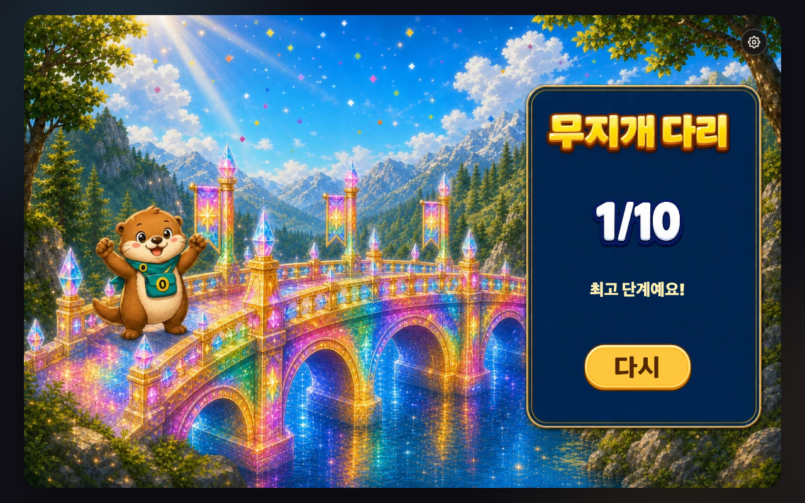

- 학생이 보는 것: 무지개 다리 완성 장면과 결과판 안의 결과 이름·정답 수·다시 버튼을 봅니다.
- 판단하거나 누르는 것: 결과 요소가 한 결과판 안에 모이고 다리가 주인공으로 보이는지 확인합니다.
- 화면에서 확인되는 수학 관계: 같은 정답·보상 기준이 해당 다리 단계 장면으로 연결됩니다.
- 다음 상태로 넘어가는 이유: 이 화면은 결과 단계별 레이아웃 회귀 증거로 남습니다.

#### 다리 보상 우선 · 작은 다리 · `engine-flow-desktop-08e-result-reward-dominance-small.png`

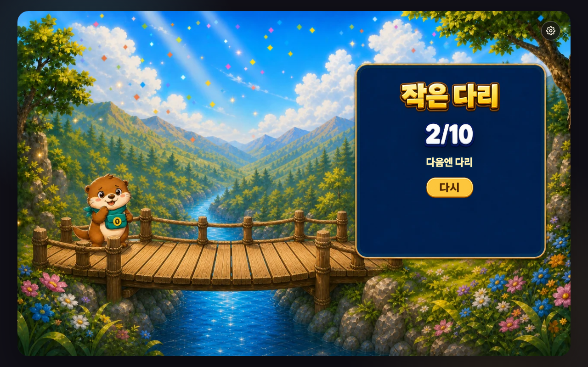

- 학생이 보는 것: 작은 다리 완성 장면과 결과판 안의 결과 이름·정답 수·다시 버튼을 봅니다.
- 판단하거나 누르는 것: 결과 요소가 한 결과판 안에 모이고 다리가 주인공으로 보이는지 확인합니다.
- 화면에서 확인되는 수학 관계: 같은 정답·보상 기준이 해당 다리 단계 장면으로 연결됩니다.
- 다음 상태로 넘어가는 이유: 이 화면은 결과 단계별 레이아웃 회귀 증거로 남습니다.

### tablet-landscape · 1024×768 · DPR 1 · 37장

- 같은 실행으로 보존한 회귀 이름: 없음
- 캡처 범위: `full-flow`

#### 시작 화면 · `engine-flow-tablet-landscape-01-cover.png`

- 학생이 보는 것: 수달몬과 계곡 다리, 게임 제목, 한 줄 목표, 시작 버튼을 봅니다.
- 판단하거나 누르는 것: 게임을 시작할 준비가 되면 시작을 누릅니다.
- 화면에서 확인되는 수학 관계: 반지름 두 개를 이으면 지름이 된다는 배움 방향을 먼저 확인합니다.
- 다음 상태로 넘어가는 이유: 다리를 잇는 방법을 확인하는 설명 화면으로 이동합니다.

#### 설정 화면 · `engine-flow-tablet-landscape-02-settings.png`

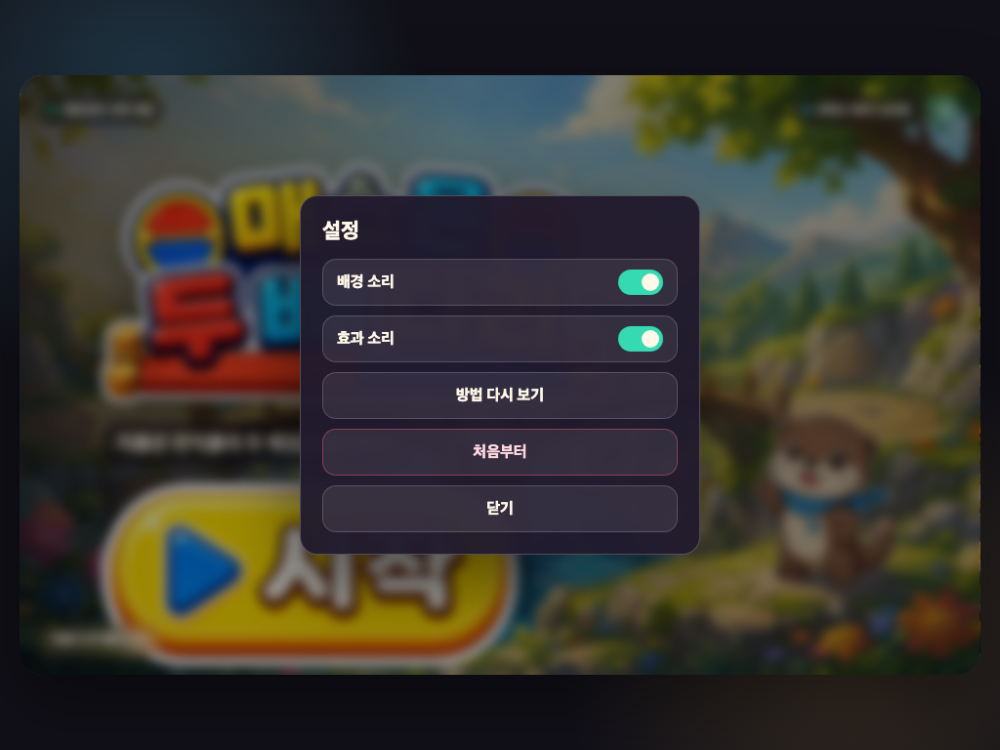

- 학생이 보는 것: 배경 소리·효과 소리와 방법 다시 보기, 처음부터, 닫기를 봅니다.
- 판단하거나 누르는 것: 필요한 소리나 이동 행동 하나를 고릅니다.
- 화면에서 확인되는 수학 관계: 수학 문제는 바꾸지 않고 게임 조작만 설정합니다.
- 다음 상태로 넘어가는 이유: 설정을 마치면 열기 전 화면으로 돌아갑니다.

#### 설명 1 · 풀이 방법 · `engine-flow-tablet-landscape-03-tutorial-1.png`

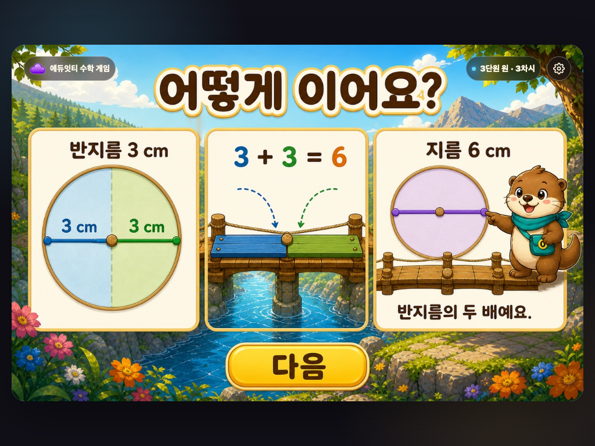

- 학생이 보는 것: 두 반지름을 이어 하나의 지름을 만드는 예를 봅니다.
- 판단하거나 누르는 것: 반지름 두 개가 지름 하나가 되는 모습을 확인하고 다음을 누릅니다.
- 화면에서 확인되는 수학 관계: 반지름 + 반지름 = 지름 관계를 확인합니다.
- 다음 상태로 넘어가는 이유: 문제 수와 다리 목표를 보는 설명 2로 이동합니다.

#### 설명 2 · 보상과 목표 · `engine-flow-tablet-landscape-04-tutorial-2.png`

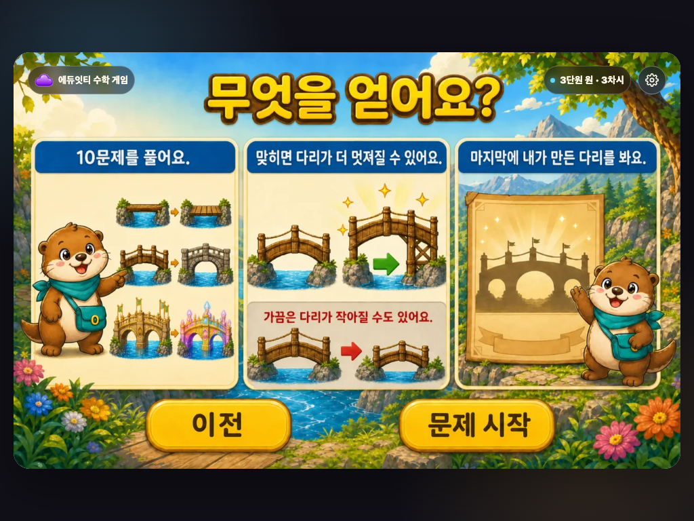

- 학생이 보는 것: 10문제와 여섯 다리 단계, 마지막 결과 흐름을 봅니다.
- 판단하거나 누르는 것: 게임 목표를 확인하고 문제 시작을 누릅니다.
- 화면에서 확인되는 수학 관계: 문제에서 고른 길이가 다리 단계 변화로 이어짐을 확인합니다.
- 다음 상태로 넘어가는 이유: 첫 번째 반지름·지름 문제로 이동합니다.

#### 문제 대기 · `engine-flow-tablet-landscape-05-play-step1.png`

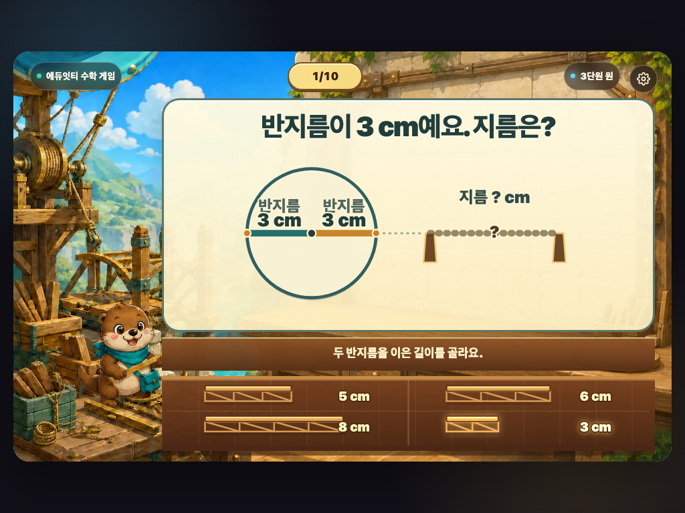

- 학생이 보는 것: 왼쪽 현재 다리와 오른쪽 원의 길이 관계, 네 선택지를 봅니다.
- 판단하거나 누르는 것: 주어진 지름 또는 반지름에 맞는 길이 하나를 고릅니다.
- 화면에서 확인되는 수학 관계: 지름은 반지름의 두 배이고 반지름은 지름의 반임을 판단합니다.
- 다음 상태로 넘어가는 이유: 고른 길이에 따라 오답 또는 정답 확인 상태로 이동합니다.

#### 정답 선택 효과 · `engine-flow-tablet-landscape-05c-correct-effect.png`

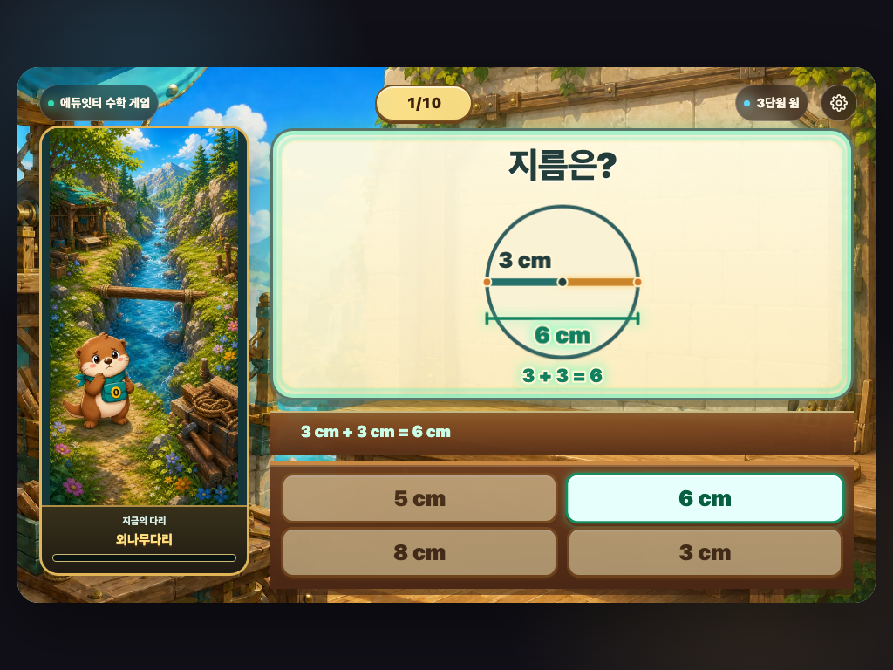

- 학생이 보는 것: 고른 정답이 원과 길이 그림에 들어가는 짧은 효과를 봅니다.
- 판단하거나 누르는 것: 별도 입력 없이 자신이 고른 길이가 적용되는 모습을 확인합니다.
- 화면에서 확인되는 수학 관계: 선택한 길이가 반지름·지름 관계를 정확히 완성합니다.
- 다음 상태로 넘어가는 이유: 완성식과 점수 보기 버튼이 있는 정답 확인으로 이어집니다.

#### 05n-next-problem-clean · `engine-flow-tablet-landscape-05n-next-problem-clean.png`

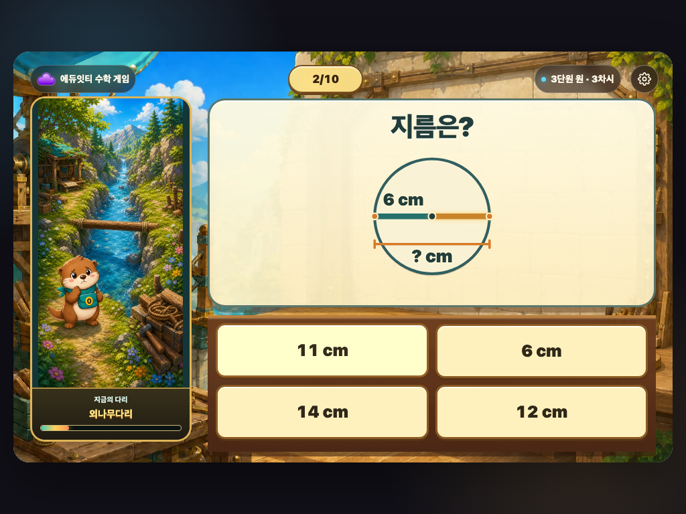

- 학생이 보는 것: 현재 게임 상태의 모든 보이는 요소를 확인합니다.
- 판단하거나 누르는 것: 이 상태에서 요구되는 한 가지 행동이나 자동 전환을 확인합니다.
- 화면에서 확인되는 수학 관계: 반지름과 지름의 관계가 화면 상태에 맞게 유지되는지 확인합니다.
- 다음 상태로 넘어가는 이유: 정해진 게임 흐름의 다음 상태로 이동합니다.

#### 1번 문제 유형 · 지름을 반으로 나누지 않은 오답 · `engine-flow-tablet-landscape-05m-p1-radius-not-halved.png`

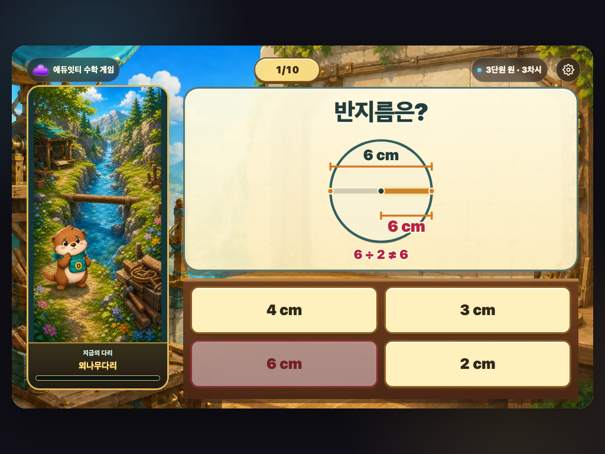

- 학생이 보는 것: 고른 길이와 목표 길이가 맞지 않는 원 그림과 오답 표시를 봅니다.
- 판단하거나 누르는 것: 길이가 짧은지, 긴지, 두 배나 반으로 계산하지 않았는지 확인합니다.
- 화면에서 확인되는 수학 관계: 반지름 두 개의 합 또는 지름의 반과 고른 길이가 같지 않음을 확인합니다.
- 다음 상태로 넘어가는 이유: 같은 문제에서 다른 길이를 다시 고릅니다.

#### 1번 문제 유형 · 반지름보다 긴 오답 · `engine-flow-tablet-landscape-05m-p1-radius-too-long.png`

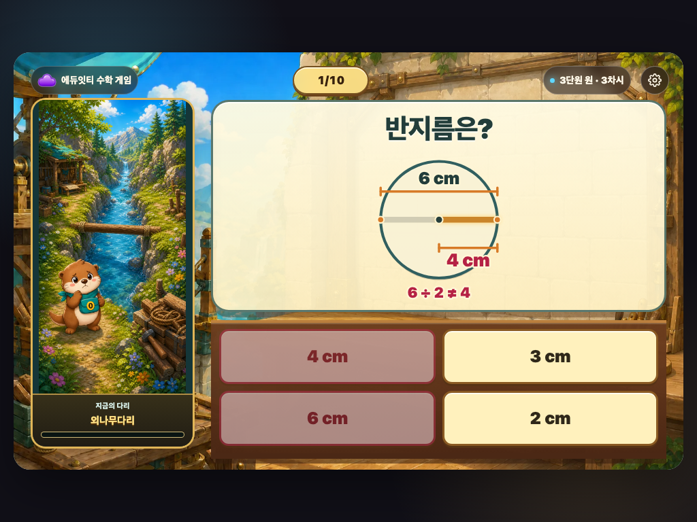

- 학생이 보는 것: 고른 길이와 목표 길이가 맞지 않는 원 그림과 오답 표시를 봅니다.
- 판단하거나 누르는 것: 길이가 짧은지, 긴지, 두 배나 반으로 계산하지 않았는지 확인합니다.
- 화면에서 확인되는 수학 관계: 반지름 두 개의 합 또는 지름의 반과 고른 길이가 같지 않음을 확인합니다.
- 다음 상태로 넘어가는 이유: 같은 문제에서 다른 길이를 다시 고릅니다.

#### 1번 문제 유형 · 반지름보다 짧은 오답 · `engine-flow-tablet-landscape-05m-p1-radius-too-short.png`

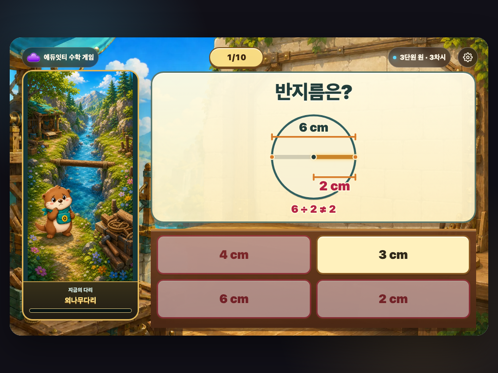

- 학생이 보는 것: 고른 길이와 목표 길이가 맞지 않는 원 그림과 오답 표시를 봅니다.
- 판단하거나 누르는 것: 길이가 짧은지, 긴지, 두 배나 반으로 계산하지 않았는지 확인합니다.
- 화면에서 확인되는 수학 관계: 반지름 두 개의 합 또는 지름의 반과 고른 길이가 같지 않음을 확인합니다.
- 다음 상태로 넘어가는 이유: 같은 문제에서 다른 길이를 다시 고릅니다.

#### 2번 문제 유형 · 반지름을 두 배 하지 않은 오답 · `engine-flow-tablet-landscape-05m-p2-diameter-not-doubled.png`

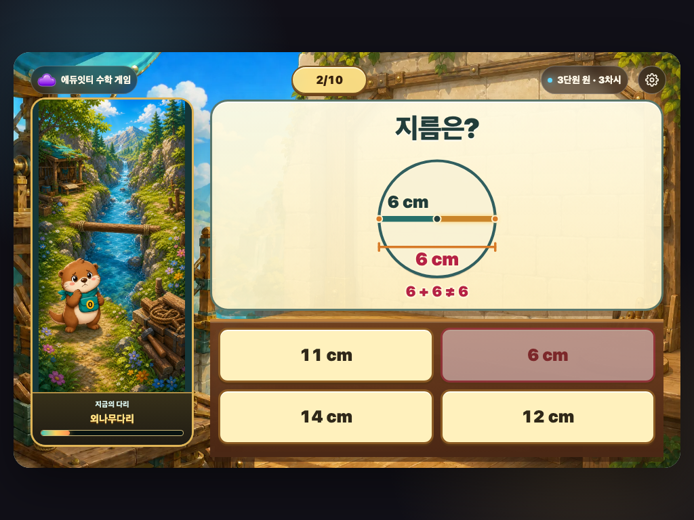

- 학생이 보는 것: 고른 길이와 목표 길이가 맞지 않는 원 그림과 오답 표시를 봅니다.
- 판단하거나 누르는 것: 길이가 짧은지, 긴지, 두 배나 반으로 계산하지 않았는지 확인합니다.
- 화면에서 확인되는 수학 관계: 반지름 두 개의 합 또는 지름의 반과 고른 길이가 같지 않음을 확인합니다.
- 다음 상태로 넘어가는 이유: 같은 문제에서 다른 길이를 다시 고릅니다.

#### 2번 문제 유형 · 지름보다 1 cm 짧은 오답 · `engine-flow-tablet-landscape-05m-p2-diameter-one-short.png`

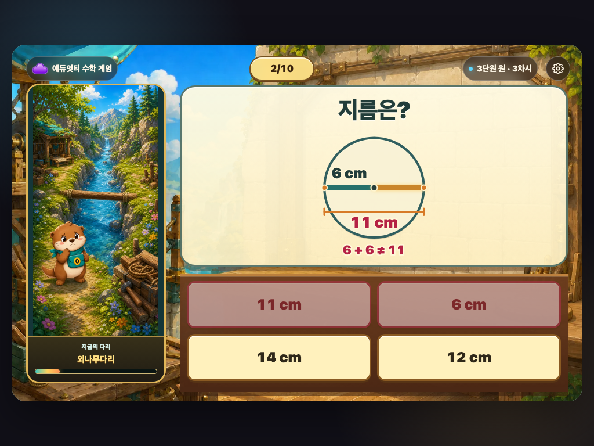

- 학생이 보는 것: 고른 길이와 목표 길이가 맞지 않는 원 그림과 오답 표시를 봅니다.
- 판단하거나 누르는 것: 길이가 짧은지, 긴지, 두 배나 반으로 계산하지 않았는지 확인합니다.
- 화면에서 확인되는 수학 관계: 반지름 두 개의 합 또는 지름의 반과 고른 길이가 같지 않음을 확인합니다.
- 다음 상태로 넘어가는 이유: 같은 문제에서 다른 길이를 다시 고릅니다.

#### 2번 문제 유형 · 지름보다 긴 오답 · `engine-flow-tablet-landscape-05m-p2-diameter-too-long.png`

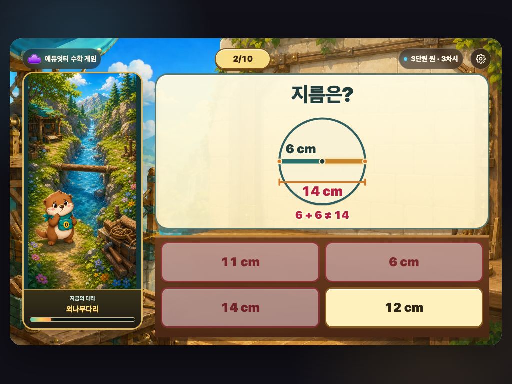

- 학생이 보는 것: 고른 길이와 목표 길이가 맞지 않는 원 그림과 오답 표시를 봅니다.
- 판단하거나 누르는 것: 길이가 짧은지, 긴지, 두 배나 반으로 계산하지 않았는지 확인합니다.
- 화면에서 확인되는 수학 관계: 반지름 두 개의 합 또는 지름의 반과 고른 길이가 같지 않음을 확인합니다.
- 다음 상태로 넘어가는 이유: 같은 문제에서 다른 길이를 다시 고릅니다.

#### 대표 오답 · `engine-flow-tablet-landscape-05b-play-wrong.png`

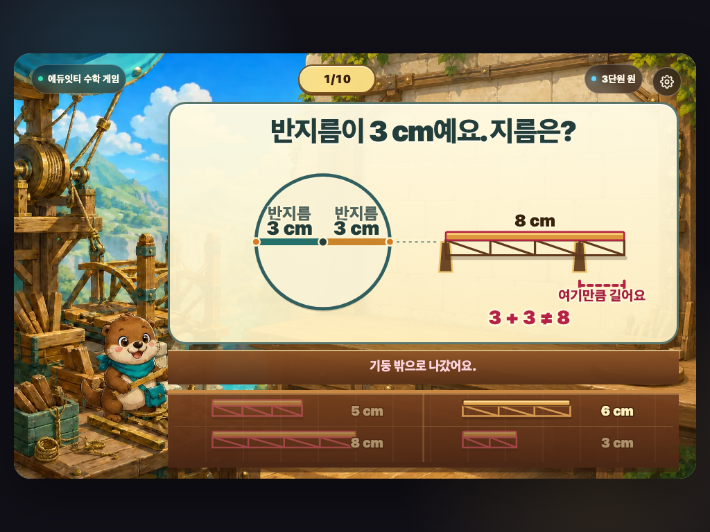

- 학생이 보는 것: 고른 길이와 정답 길이의 차이, 완성되지 않은 관계를 봅니다.
- 판단하거나 누르는 것: 오답 이유를 그림으로 확인하고 다른 선택지를 고릅니다.
- 화면에서 확인되는 수학 관계: 두 반지름의 합이나 지름의 반과 고른 길이가 같지 않음을 봅니다.
- 다음 상태로 넘어가는 이유: 관계가 맞을 때까지 같은 문제에서 다시 판단합니다.

#### 정답 확인 · `engine-flow-tablet-landscape-06-confirm.png`

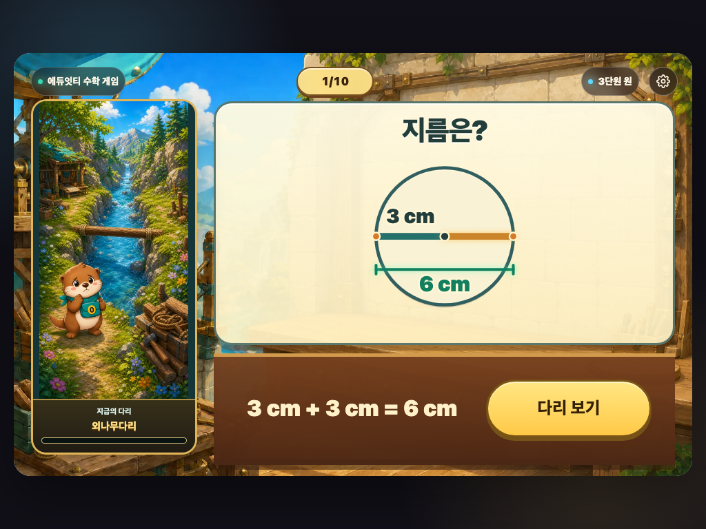

- 학생이 보는 것: 원 안에 들어간 정답 길이와 완성식, 점수 보기 버튼을 봅니다.
- 판단하거나 누르는 것: 완성된 관계를 읽은 뒤 점수 보기를 누릅니다.
- 화면에서 확인되는 수학 관계: 반지름 + 반지름 = 지름 또는 지름 ÷ 2 = 반지름을 확인합니다.
- 다음 상태로 넘어가는 이유: 수학 관계를 확인한 뒤 닫힌 보상으로 이동합니다.

#### 닫힌 보상 · `engine-flow-tablet-landscape-07-reward-closed.png`

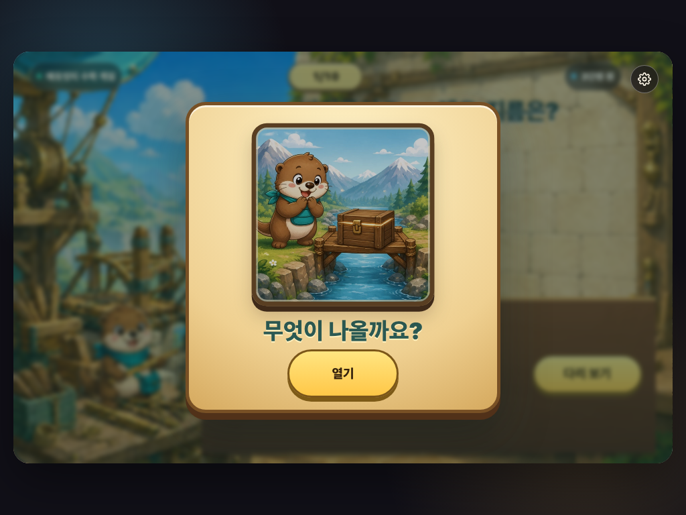

- 학생이 보는 것: 결과가 아직 드러나지 않은 보상 그림과 열기 버튼을 봅니다.
- 판단하거나 누르는 것: 이번 점수를 확인하기 위해 열기를 누릅니다.
- 화면에서 확인되는 수학 관계: 뒤 문제 화면에는 방금 완성한 반지름·지름 관계가 그대로 남습니다.
- 다음 상태로 넘어가는 이유: 학생이 직접 연 뒤에만 이번 보상 사건이 공개됩니다.

#### 열린 보상 · `engine-flow-tablet-landscape-07b-reward-open.png`

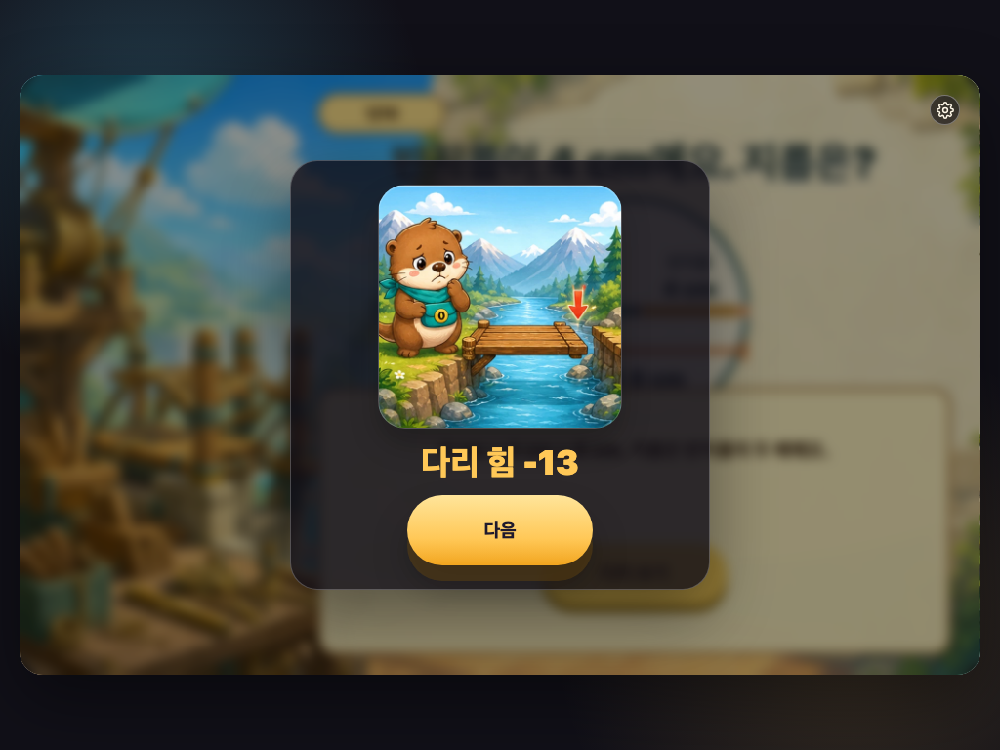

- 학생이 보는 것: 보상 사건 그림과 이번 점수 변화, 다음 버튼을 봅니다.
- 판단하거나 누르는 것: 이번 변화를 확인하고 다음을 누릅니다.
- 화면에서 확인되는 수학 관계: 정답 계산과 무작위 점수가 서로 분리되어 있음을 확인합니다.
- 다음 상태로 넘어가는 이유: 모달을 먼저 닫고 다리 세계의 실제 변화를 보여 줍니다.

#### 모달 종료 뒤 다리 변화 · `engine-flow-tablet-landscape-07c-reward-impact.png`

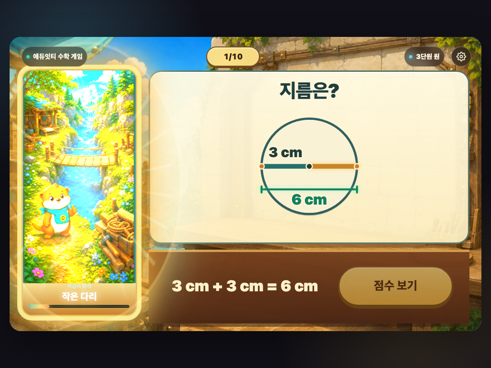

- 학생이 보는 것: 모달이 닫힌 뒤 왼쪽 다리가 바뀌고 Stage에 번지는 빛 효과를 봅니다.
- 판단하거나 누르는 것: 별도 입력 없이 이번 보상이 다리 단계를 바꾸는 모습을 확인합니다.
- 화면에서 확인되는 수학 관계: 한 문제의 보상이 현재 다리 단계에 정확히 한 번 반영됩니다.
- 다음 상태로 넘어가는 이유: 효과를 충분히 본 뒤 다음 문제 또는 결과로 이동합니다.

#### 실제 결과 · `engine-flow-tablet-landscape-08-result.png`

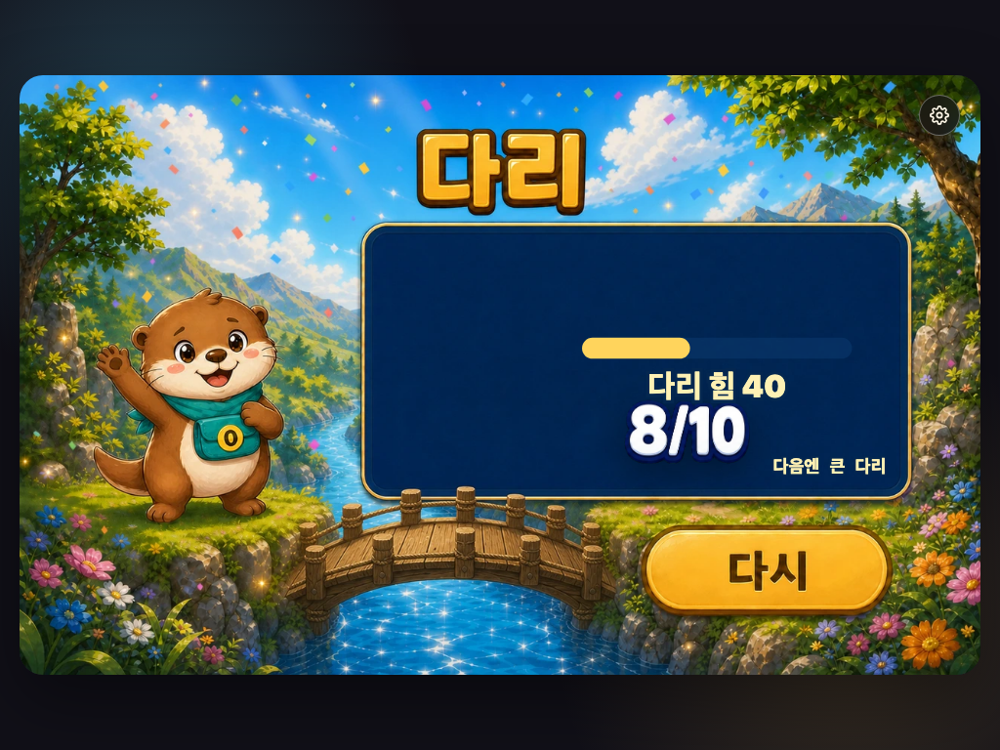

- 학생이 보는 것: 완성한 다리와 수달몬, 결과 이름, 정답 수, 다음 목표, 다시 버튼을 봅니다.
- 판단하거나 누르는 것: 현재 결과와 다음 목표를 비교하고 다시 도전할지 결정합니다.
- 화면에서 확인되는 수학 관계: 10문제의 정답 수와 누적 보상이 하나의 다리 단계로 정리됩니다.
- 다음 상태로 넘어가는 이유: 다시를 누르면 새 문제 순서와 새 보상 흐름으로 시작합니다.

#### 결과 결속 · 큰 다리 · `engine-flow-tablet-landscape-08c-result-cohesion-big.png`

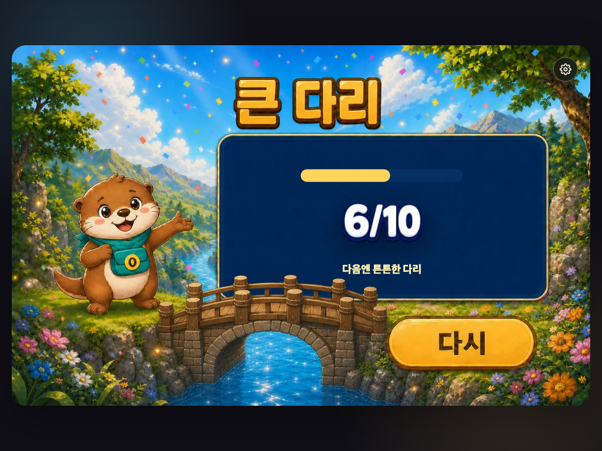

- 학생이 보는 것: 큰 다리 완성 장면과 결과판 안의 결과 이름·정답 수·다시 버튼을 봅니다.
- 판단하거나 누르는 것: 결과 요소가 한 결과판 안에 모이고 다리가 주인공으로 보이는지 확인합니다.
- 화면에서 확인되는 수학 관계: 같은 정답·보상 기준이 해당 다리 단계 장면으로 연결됩니다.
- 다음 상태로 넘어가는 이유: 이 화면은 결과 단계별 레이아웃 회귀 증거로 남습니다.

#### 결과 결속 · 튼튼한 다리 · `engine-flow-tablet-landscape-08c-result-cohesion-bridge.png`

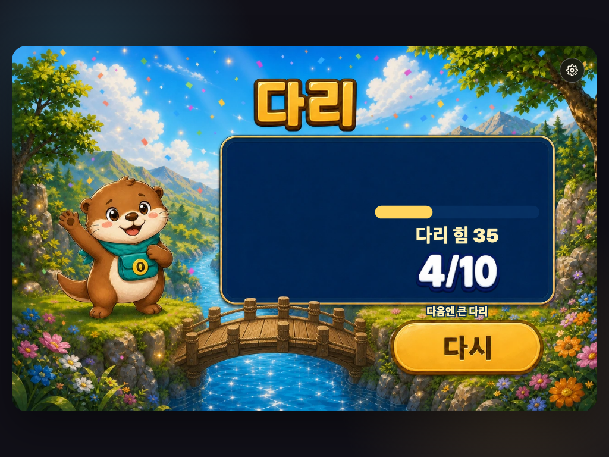

- 학생이 보는 것: 튼튼한 다리 완성 장면과 결과판 안의 결과 이름·정답 수·다시 버튼을 봅니다.
- 판단하거나 누르는 것: 결과 요소가 한 결과판 안에 모이고 다리가 주인공으로 보이는지 확인합니다.
- 화면에서 확인되는 수학 관계: 같은 정답·보상 기준이 해당 다리 단계 장면으로 연결됩니다.
- 다음 상태로 넘어가는 이유: 이 화면은 결과 단계별 레이아웃 회귀 증거로 남습니다.

#### 결과 결속 · 황금 다리 · `engine-flow-tablet-landscape-08c-result-cohesion-grand.png`

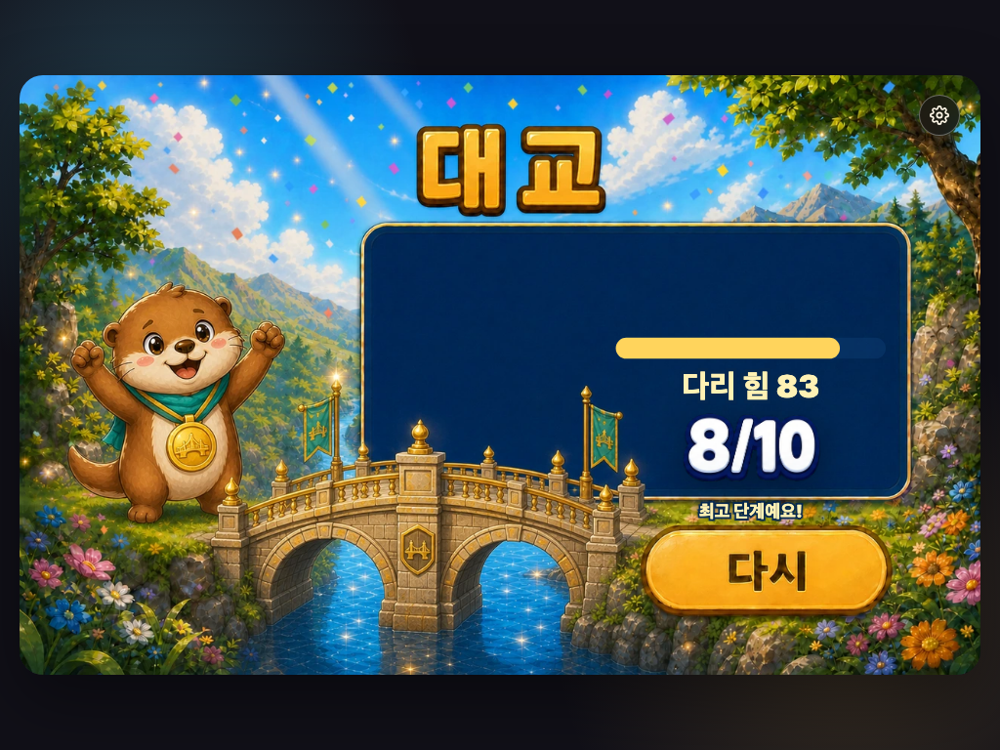

- 학생이 보는 것: 황금 다리 완성 장면과 결과판 안의 결과 이름·정답 수·다시 버튼을 봅니다.
- 판단하거나 누르는 것: 결과 요소가 한 결과판 안에 모이고 다리가 주인공으로 보이는지 확인합니다.
- 화면에서 확인되는 수학 관계: 같은 정답·보상 기준이 해당 다리 단계 장면으로 연결됩니다.
- 다음 상태로 넘어가는 이유: 이 화면은 결과 단계별 레이아웃 회귀 증거로 남습니다.

#### 결과 결속 · 외나무다리 · `engine-flow-tablet-landscape-08c-result-cohesion-log.png`

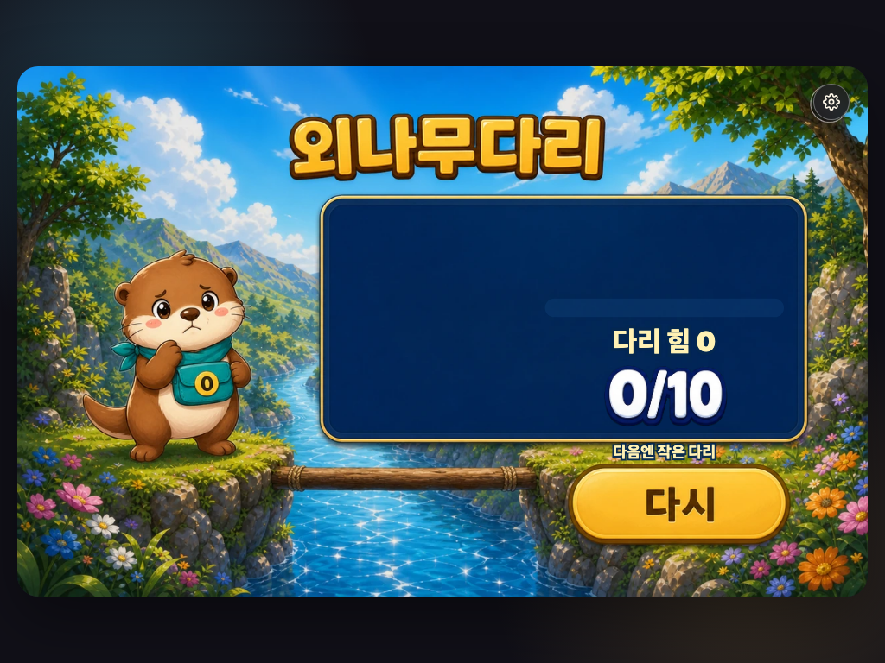

- 학생이 보는 것: 외나무다리 완성 장면과 결과판 안의 결과 이름·정답 수·다시 버튼을 봅니다.
- 판단하거나 누르는 것: 결과 요소가 한 결과판 안에 모이고 다리가 주인공으로 보이는지 확인합니다.
- 화면에서 확인되는 수학 관계: 같은 정답·보상 기준이 해당 다리 단계 장면으로 연결됩니다.
- 다음 상태로 넘어가는 이유: 이 화면은 결과 단계별 레이아웃 회귀 증거로 남습니다.

#### 결과 결속 · 무지개 다리 · `engine-flow-tablet-landscape-08c-result-cohesion-rainbow.png`

- 학생이 보는 것: 무지개 다리 완성 장면과 결과판 안의 결과 이름·정답 수·다시 버튼을 봅니다.
- 판단하거나 누르는 것: 결과 요소가 한 결과판 안에 모이고 다리가 주인공으로 보이는지 확인합니다.
- 화면에서 확인되는 수학 관계: 같은 정답·보상 기준이 해당 다리 단계 장면으로 연결됩니다.
- 다음 상태로 넘어가는 이유: 이 화면은 결과 단계별 레이아웃 회귀 증거로 남습니다.

#### 결과 결속 · 작은 다리 · `engine-flow-tablet-landscape-08c-result-cohesion-small.png`

- 학생이 보는 것: 작은 다리 완성 장면과 결과판 안의 결과 이름·정답 수·다시 버튼을 봅니다.
- 판단하거나 누르는 것: 결과 요소가 한 결과판 안에 모이고 다리가 주인공으로 보이는지 확인합니다.
- 화면에서 확인되는 수학 관계: 같은 정답·보상 기준이 해당 다리 단계 장면으로 연결됩니다.
- 다음 상태로 넘어가는 이유: 이 화면은 결과 단계별 레이아웃 회귀 증거로 남습니다.

#### 결과판 포함 · 큰 다리 · `engine-flow-tablet-landscape-08d-result-panel-big.png`

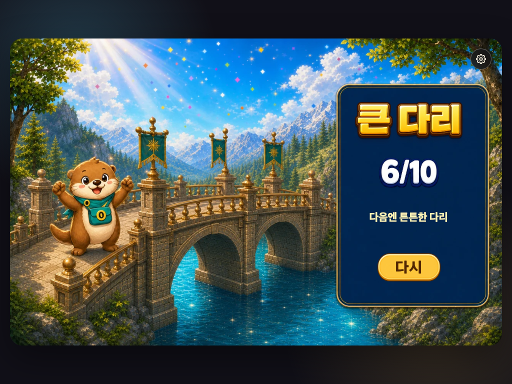

- 학생이 보는 것: 큰 다리 완성 장면과 결과판 안의 결과 이름·정답 수·다시 버튼을 봅니다.
- 판단하거나 누르는 것: 결과 요소가 한 결과판 안에 모이고 다리가 주인공으로 보이는지 확인합니다.
- 화면에서 확인되는 수학 관계: 같은 정답·보상 기준이 해당 다리 단계 장면으로 연결됩니다.
- 다음 상태로 넘어가는 이유: 이 화면은 결과 단계별 레이아웃 회귀 증거로 남습니다.

#### 결과판 포함 · 튼튼한 다리 · `engine-flow-tablet-landscape-08d-result-panel-bridge.png`

- 학생이 보는 것: 튼튼한 다리 완성 장면과 결과판 안의 결과 이름·정답 수·다시 버튼을 봅니다.
- 판단하거나 누르는 것: 결과 요소가 한 결과판 안에 모이고 다리가 주인공으로 보이는지 확인합니다.
- 화면에서 확인되는 수학 관계: 같은 정답·보상 기준이 해당 다리 단계 장면으로 연결됩니다.
- 다음 상태로 넘어가는 이유: 이 화면은 결과 단계별 레이아웃 회귀 증거로 남습니다.

#### 결과판 포함 · 황금 다리 · `engine-flow-tablet-landscape-08d-result-panel-grand.png`

- 학생이 보는 것: 황금 다리 완성 장면과 결과판 안의 결과 이름·정답 수·다시 버튼을 봅니다.
- 판단하거나 누르는 것: 결과 요소가 한 결과판 안에 모이고 다리가 주인공으로 보이는지 확인합니다.
- 화면에서 확인되는 수학 관계: 같은 정답·보상 기준이 해당 다리 단계 장면으로 연결됩니다.
- 다음 상태로 넘어가는 이유: 이 화면은 결과 단계별 레이아웃 회귀 증거로 남습니다.

#### 결과판 포함 · 외나무다리 · `engine-flow-tablet-landscape-08d-result-panel-log.png`

- 학생이 보는 것: 외나무다리 완성 장면과 결과판 안의 결과 이름·정답 수·다시 버튼을 봅니다.
- 판단하거나 누르는 것: 결과 요소가 한 결과판 안에 모이고 다리가 주인공으로 보이는지 확인합니다.
- 화면에서 확인되는 수학 관계: 같은 정답·보상 기준이 해당 다리 단계 장면으로 연결됩니다.
- 다음 상태로 넘어가는 이유: 이 화면은 결과 단계별 레이아웃 회귀 증거로 남습니다.

#### 결과판 포함 · 무지개 다리 · `engine-flow-tablet-landscape-08d-result-panel-rainbow.png`

- 학생이 보는 것: 무지개 다리 완성 장면과 결과판 안의 결과 이름·정답 수·다시 버튼을 봅니다.
- 판단하거나 누르는 것: 결과 요소가 한 결과판 안에 모이고 다리가 주인공으로 보이는지 확인합니다.
- 화면에서 확인되는 수학 관계: 같은 정답·보상 기준이 해당 다리 단계 장면으로 연결됩니다.
- 다음 상태로 넘어가는 이유: 이 화면은 결과 단계별 레이아웃 회귀 증거로 남습니다.

#### 결과판 포함 · 작은 다리 · `engine-flow-tablet-landscape-08d-result-panel-small.png`

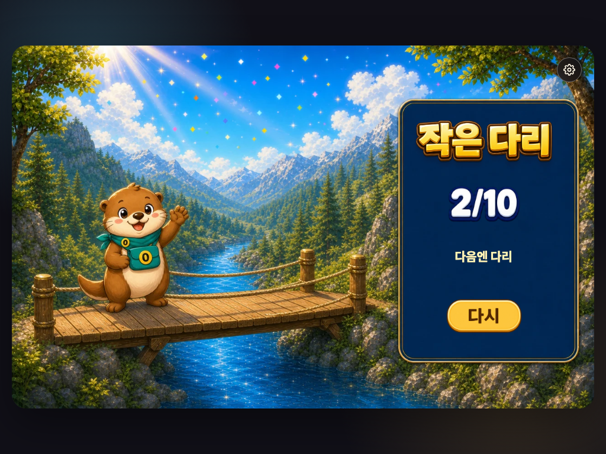

- 학생이 보는 것: 작은 다리 완성 장면과 결과판 안의 결과 이름·정답 수·다시 버튼을 봅니다.
- 판단하거나 누르는 것: 결과 요소가 한 결과판 안에 모이고 다리가 주인공으로 보이는지 확인합니다.
- 화면에서 확인되는 수학 관계: 같은 정답·보상 기준이 해당 다리 단계 장면으로 연결됩니다.
- 다음 상태로 넘어가는 이유: 이 화면은 결과 단계별 레이아웃 회귀 증거로 남습니다.

#### 다리 보상 우선 · 큰 다리 · `engine-flow-tablet-landscape-08e-result-reward-dominance-big.png`

- 학생이 보는 것: 큰 다리 완성 장면과 결과판 안의 결과 이름·정답 수·다시 버튼을 봅니다.
- 판단하거나 누르는 것: 결과 요소가 한 결과판 안에 모이고 다리가 주인공으로 보이는지 확인합니다.
- 화면에서 확인되는 수학 관계: 같은 정답·보상 기준이 해당 다리 단계 장면으로 연결됩니다.
- 다음 상태로 넘어가는 이유: 이 화면은 결과 단계별 레이아웃 회귀 증거로 남습니다.

#### 다리 보상 우선 · 튼튼한 다리 · `engine-flow-tablet-landscape-08e-result-reward-dominance-bridge.png`

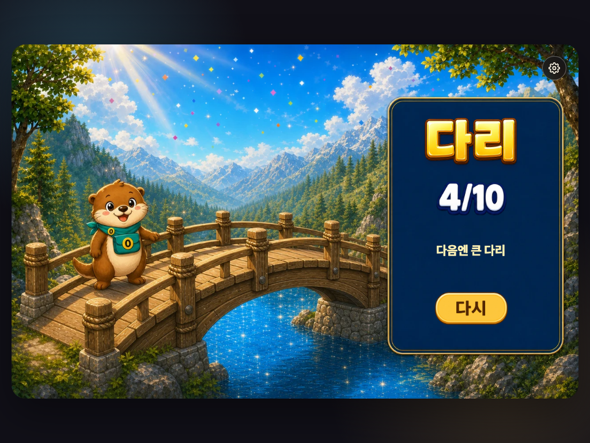

- 학생이 보는 것: 튼튼한 다리 완성 장면과 결과판 안의 결과 이름·정답 수·다시 버튼을 봅니다.
- 판단하거나 누르는 것: 결과 요소가 한 결과판 안에 모이고 다리가 주인공으로 보이는지 확인합니다.
- 화면에서 확인되는 수학 관계: 같은 정답·보상 기준이 해당 다리 단계 장면으로 연결됩니다.
- 다음 상태로 넘어가는 이유: 이 화면은 결과 단계별 레이아웃 회귀 증거로 남습니다.

#### 다리 보상 우선 · 황금 다리 · `engine-flow-tablet-landscape-08e-result-reward-dominance-grand.png`

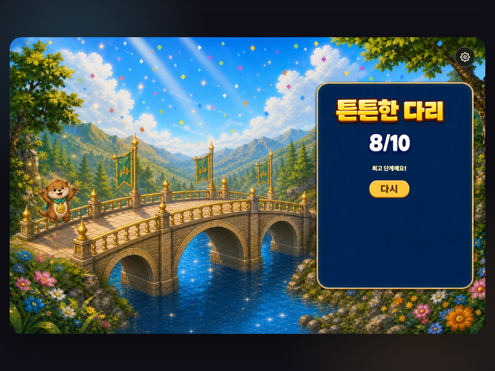

- 학생이 보는 것: 황금 다리 완성 장면과 결과판 안의 결과 이름·정답 수·다시 버튼을 봅니다.
- 판단하거나 누르는 것: 결과 요소가 한 결과판 안에 모이고 다리가 주인공으로 보이는지 확인합니다.
- 화면에서 확인되는 수학 관계: 같은 정답·보상 기준이 해당 다리 단계 장면으로 연결됩니다.
- 다음 상태로 넘어가는 이유: 이 화면은 결과 단계별 레이아웃 회귀 증거로 남습니다.

#### 다리 보상 우선 · 외나무다리 · `engine-flow-tablet-landscape-08e-result-reward-dominance-log.png`

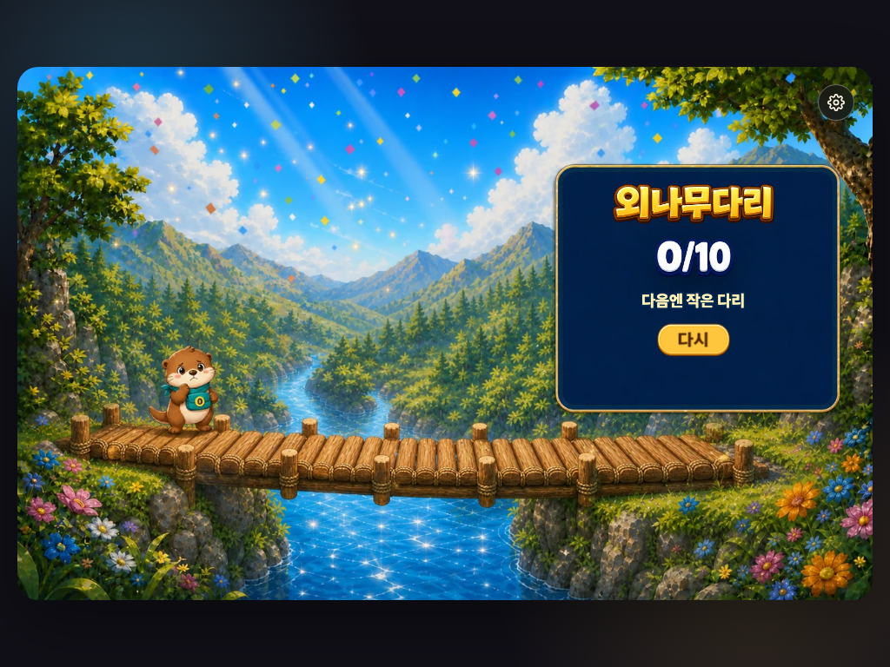

- 학생이 보는 것: 외나무다리 완성 장면과 결과판 안의 결과 이름·정답 수·다시 버튼을 봅니다.
- 판단하거나 누르는 것: 결과 요소가 한 결과판 안에 모이고 다리가 주인공으로 보이는지 확인합니다.
- 화면에서 확인되는 수학 관계: 같은 정답·보상 기준이 해당 다리 단계 장면으로 연결됩니다.
- 다음 상태로 넘어가는 이유: 이 화면은 결과 단계별 레이아웃 회귀 증거로 남습니다.

#### 다리 보상 우선 · 무지개 다리 · `engine-flow-tablet-landscape-08e-result-reward-dominance-rainbow.png`

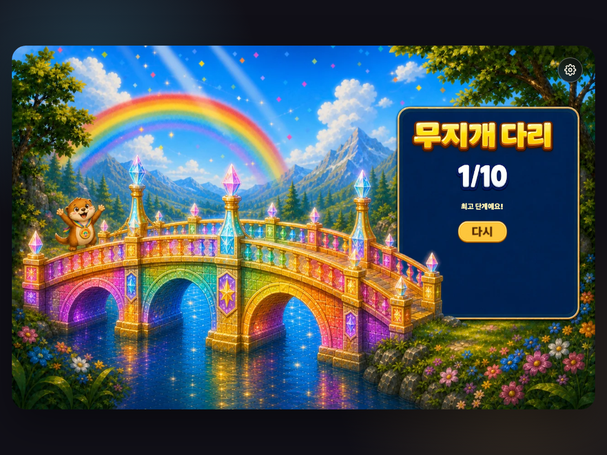

- 학생이 보는 것: 무지개 다리 완성 장면과 결과판 안의 결과 이름·정답 수·다시 버튼을 봅니다.
- 판단하거나 누르는 것: 결과 요소가 한 결과판 안에 모이고 다리가 주인공으로 보이는지 확인합니다.
- 화면에서 확인되는 수학 관계: 같은 정답·보상 기준이 해당 다리 단계 장면으로 연결됩니다.
- 다음 상태로 넘어가는 이유: 이 화면은 결과 단계별 레이아웃 회귀 증거로 남습니다.

#### 다리 보상 우선 · 작은 다리 · `engine-flow-tablet-landscape-08e-result-reward-dominance-small.png`

- 학생이 보는 것: 작은 다리 완성 장면과 결과판 안의 결과 이름·정답 수·다시 버튼을 봅니다.
- 판단하거나 누르는 것: 결과 요소가 한 결과판 안에 모이고 다리가 주인공으로 보이는지 확인합니다.
- 화면에서 확인되는 수학 관계: 같은 정답·보상 기준이 해당 다리 단계 장면으로 연결됩니다.
- 다음 상태로 넘어가는 이유: 이 화면은 결과 단계별 레이아웃 회귀 증거로 남습니다.

### user-feedback-reward-1079x929 · 1079×929 · DPR 1 · 37장

- 같은 실행으로 보존한 회귀 이름: 없음
- 캡처 범위: `full-flow`

#### 시작 화면 · `engine-flow-user-feedback-reward-1079x929-01-cover.png`

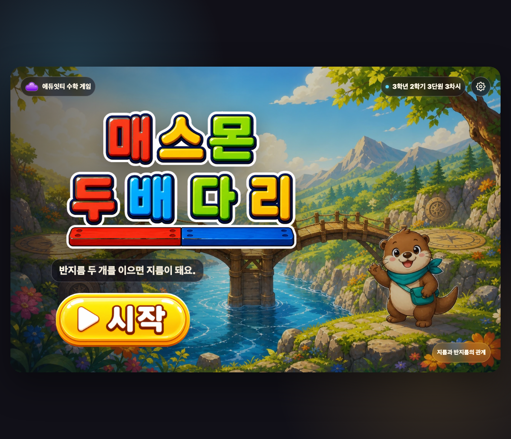

- 학생이 보는 것: 수달몬과 계곡 다리, 게임 제목, 한 줄 목표, 시작 버튼을 봅니다.
- 판단하거나 누르는 것: 게임을 시작할 준비가 되면 시작을 누릅니다.
- 화면에서 확인되는 수학 관계: 반지름 두 개를 이으면 지름이 된다는 배움 방향을 먼저 확인합니다.
- 다음 상태로 넘어가는 이유: 다리를 잇는 방법을 확인하는 설명 화면으로 이동합니다.

#### 설정 화면 · `engine-flow-user-feedback-reward-1079x929-02-settings.png`

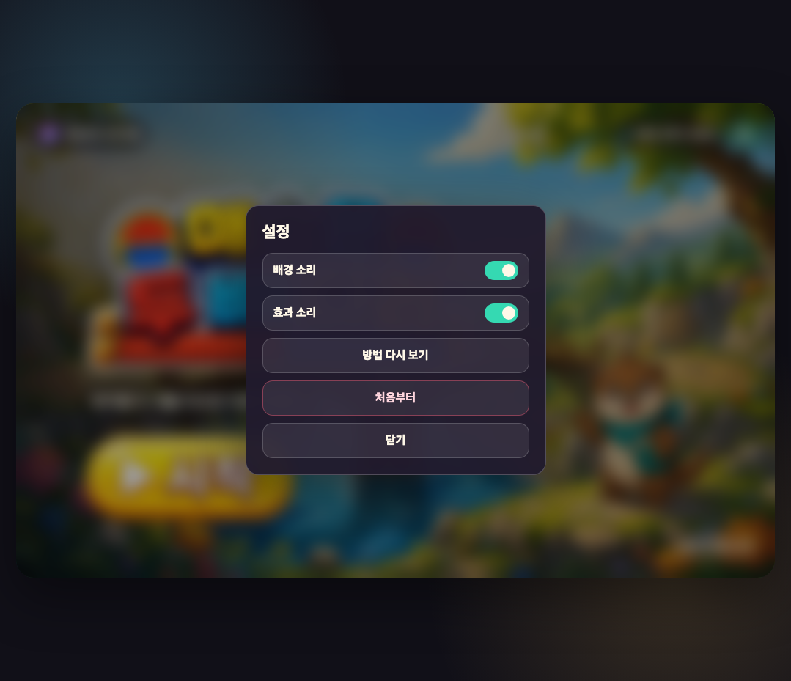

- 학생이 보는 것: 배경 소리·효과 소리와 방법 다시 보기, 처음부터, 닫기를 봅니다.
- 판단하거나 누르는 것: 필요한 소리나 이동 행동 하나를 고릅니다.
- 화면에서 확인되는 수학 관계: 수학 문제는 바꾸지 않고 게임 조작만 설정합니다.
- 다음 상태로 넘어가는 이유: 설정을 마치면 열기 전 화면으로 돌아갑니다.

#### 설명 1 · 풀이 방법 · `engine-flow-user-feedback-reward-1079x929-03-tutorial-1.png`

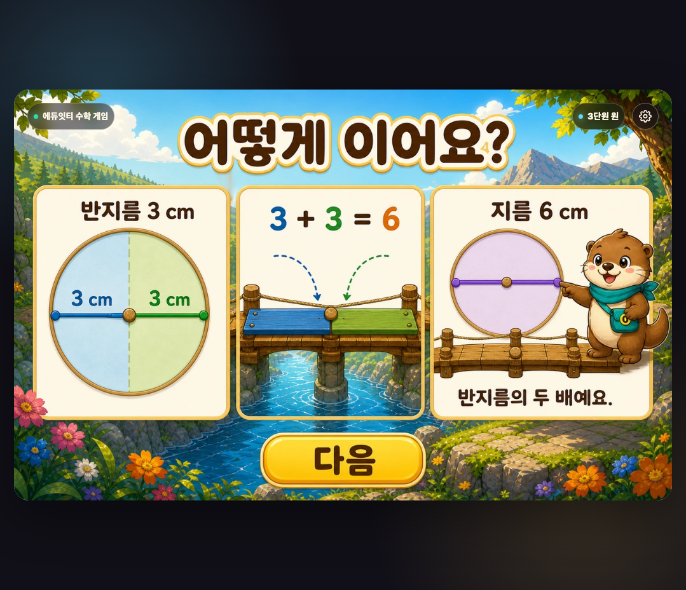

- 학생이 보는 것: 두 반지름을 이어 하나의 지름을 만드는 예를 봅니다.
- 판단하거나 누르는 것: 반지름 두 개가 지름 하나가 되는 모습을 확인하고 다음을 누릅니다.
- 화면에서 확인되는 수학 관계: 반지름 + 반지름 = 지름 관계를 확인합니다.
- 다음 상태로 넘어가는 이유: 문제 수와 다리 목표를 보는 설명 2로 이동합니다.

#### 설명 2 · 보상과 목표 · `engine-flow-user-feedback-reward-1079x929-04-tutorial-2.png`

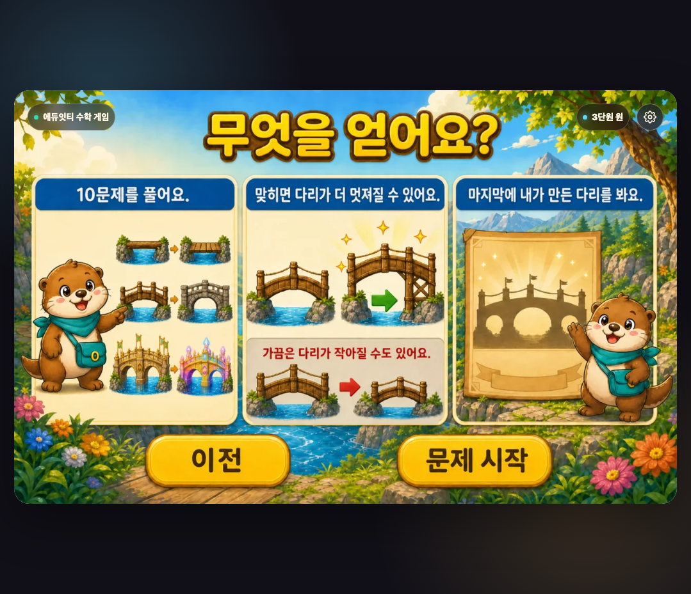

- 학생이 보는 것: 10문제와 여섯 다리 단계, 마지막 결과 흐름을 봅니다.
- 판단하거나 누르는 것: 게임 목표를 확인하고 문제 시작을 누릅니다.
- 화면에서 확인되는 수학 관계: 문제에서 고른 길이가 다리 단계 변화로 이어짐을 확인합니다.
- 다음 상태로 넘어가는 이유: 첫 번째 반지름·지름 문제로 이동합니다.

#### 문제 대기 · `engine-flow-user-feedback-reward-1079x929-05-play-step1.png`

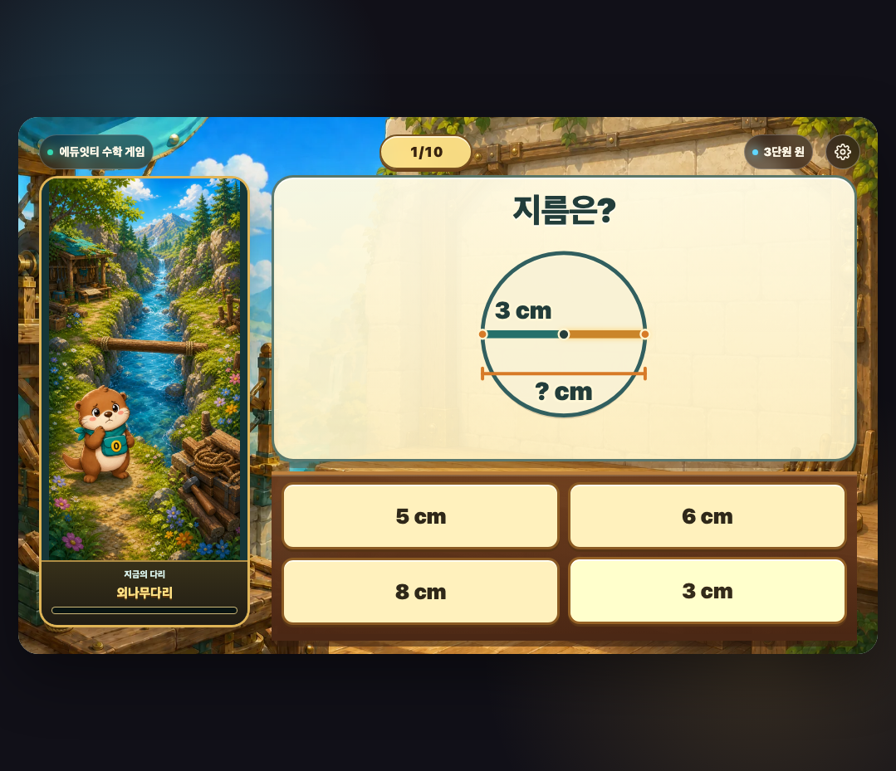

- 학생이 보는 것: 왼쪽 현재 다리와 오른쪽 원의 길이 관계, 네 선택지를 봅니다.
- 판단하거나 누르는 것: 주어진 지름 또는 반지름에 맞는 길이 하나를 고릅니다.
- 화면에서 확인되는 수학 관계: 지름은 반지름의 두 배이고 반지름은 지름의 반임을 판단합니다.
- 다음 상태로 넘어가는 이유: 고른 길이에 따라 오답 또는 정답 확인 상태로 이동합니다.

#### 정답 선택 효과 · `engine-flow-user-feedback-reward-1079x929-05c-correct-effect.png`

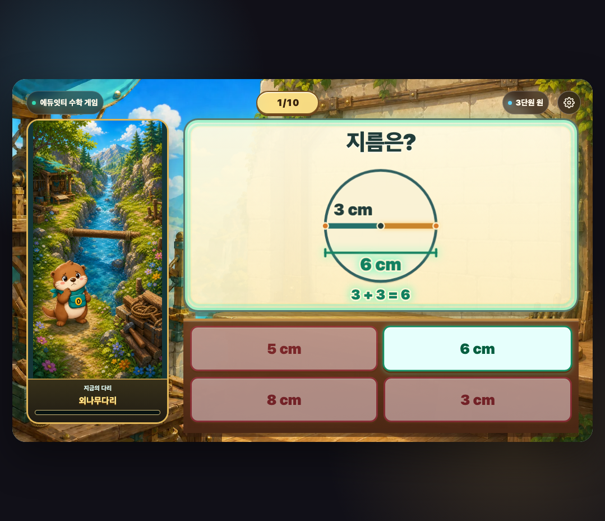

- 학생이 보는 것: 고른 정답이 원과 길이 그림에 들어가는 짧은 효과를 봅니다.
- 판단하거나 누르는 것: 별도 입력 없이 자신이 고른 길이가 적용되는 모습을 확인합니다.
- 화면에서 확인되는 수학 관계: 선택한 길이가 반지름·지름 관계를 정확히 완성합니다.
- 다음 상태로 넘어가는 이유: 완성식과 점수 보기 버튼이 있는 정답 확인으로 이어집니다.

#### 05n-next-problem-clean · `engine-flow-user-feedback-reward-1079x929-05n-next-problem-clean.png`

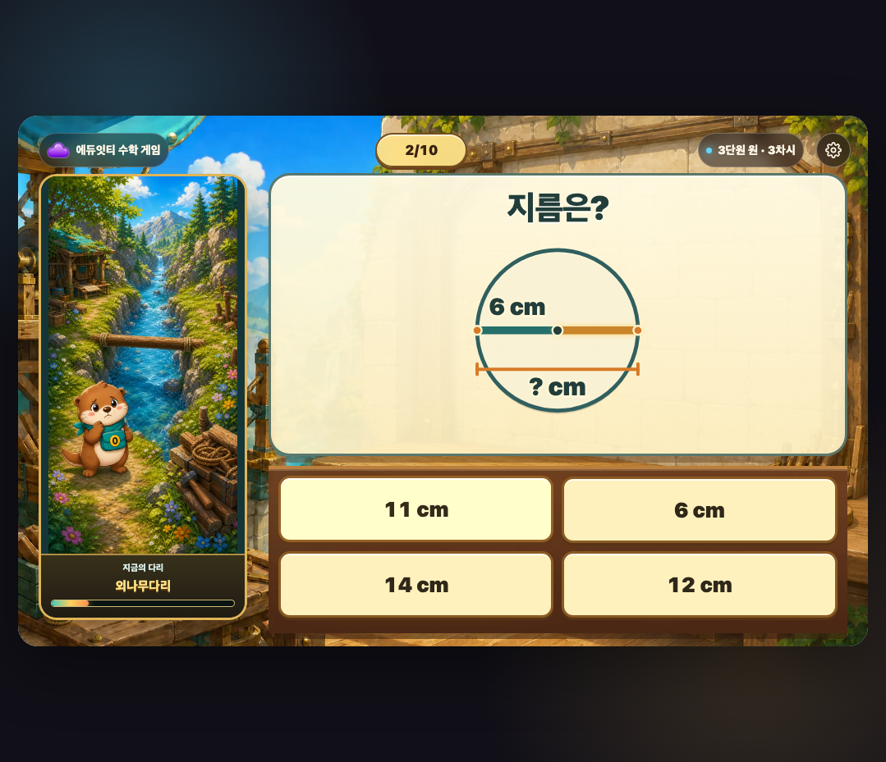

- 학생이 보는 것: 현재 게임 상태의 모든 보이는 요소를 확인합니다.
- 판단하거나 누르는 것: 이 상태에서 요구되는 한 가지 행동이나 자동 전환을 확인합니다.
- 화면에서 확인되는 수학 관계: 반지름과 지름의 관계가 화면 상태에 맞게 유지되는지 확인합니다.
- 다음 상태로 넘어가는 이유: 정해진 게임 흐름의 다음 상태로 이동합니다.

#### 1번 문제 유형 · 지름을 반으로 나누지 않은 오답 · `engine-flow-user-feedback-reward-1079x929-05m-p1-radius-not-halved.png`

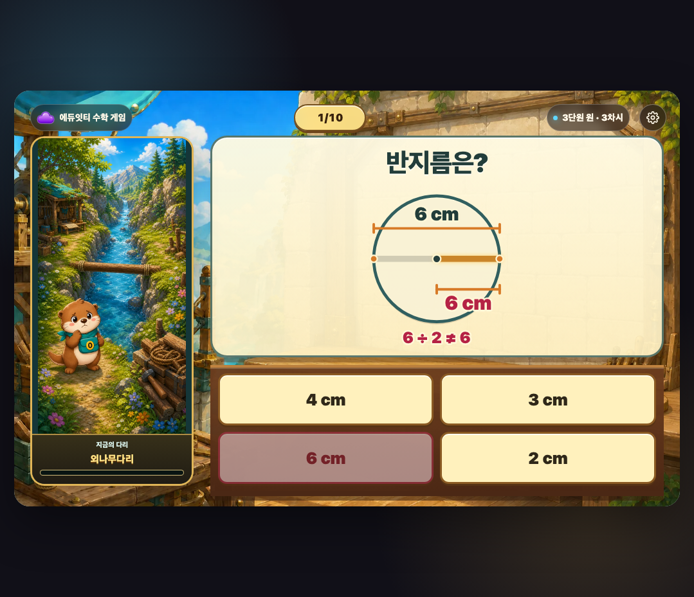

- 학생이 보는 것: 고른 길이와 목표 길이가 맞지 않는 원 그림과 오답 표시를 봅니다.
- 판단하거나 누르는 것: 길이가 짧은지, 긴지, 두 배나 반으로 계산하지 않았는지 확인합니다.
- 화면에서 확인되는 수학 관계: 반지름 두 개의 합 또는 지름의 반과 고른 길이가 같지 않음을 확인합니다.
- 다음 상태로 넘어가는 이유: 같은 문제에서 다른 길이를 다시 고릅니다.

#### 1번 문제 유형 · 반지름보다 긴 오답 · `engine-flow-user-feedback-reward-1079x929-05m-p1-radius-too-long.png`

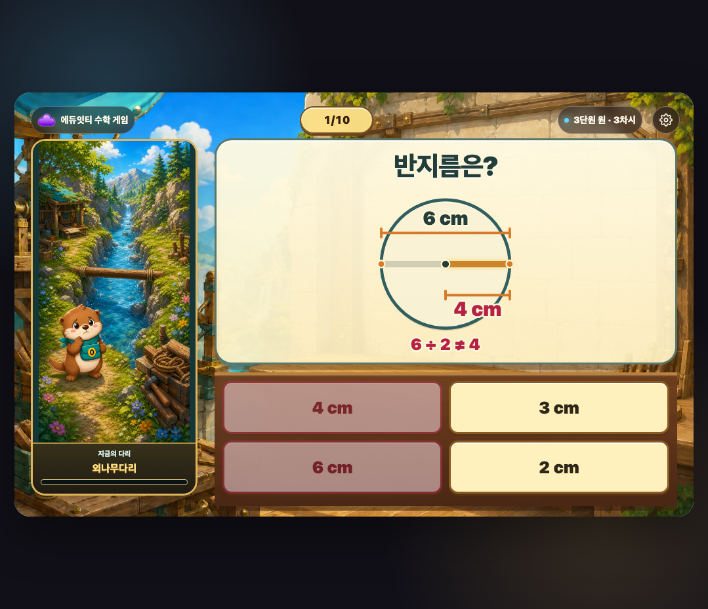

- 학생이 보는 것: 고른 길이와 목표 길이가 맞지 않는 원 그림과 오답 표시를 봅니다.
- 판단하거나 누르는 것: 길이가 짧은지, 긴지, 두 배나 반으로 계산하지 않았는지 확인합니다.
- 화면에서 확인되는 수학 관계: 반지름 두 개의 합 또는 지름의 반과 고른 길이가 같지 않음을 확인합니다.
- 다음 상태로 넘어가는 이유: 같은 문제에서 다른 길이를 다시 고릅니다.

#### 1번 문제 유형 · 반지름보다 짧은 오답 · `engine-flow-user-feedback-reward-1079x929-05m-p1-radius-too-short.png`

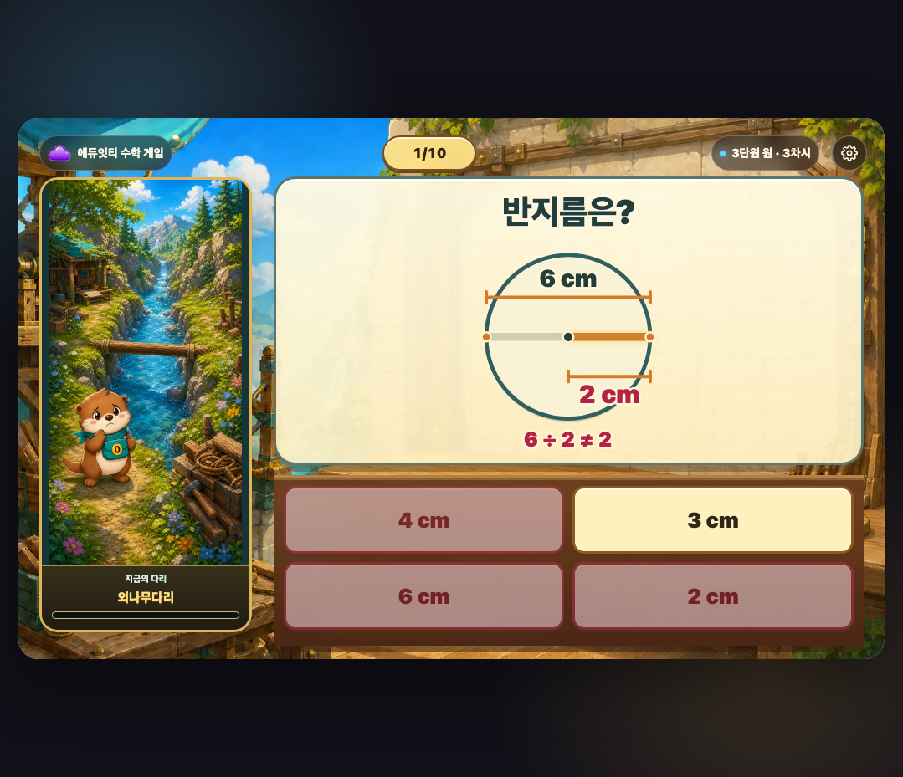

- 학생이 보는 것: 고른 길이와 목표 길이가 맞지 않는 원 그림과 오답 표시를 봅니다.
- 판단하거나 누르는 것: 길이가 짧은지, 긴지, 두 배나 반으로 계산하지 않았는지 확인합니다.
- 화면에서 확인되는 수학 관계: 반지름 두 개의 합 또는 지름의 반과 고른 길이가 같지 않음을 확인합니다.
- 다음 상태로 넘어가는 이유: 같은 문제에서 다른 길이를 다시 고릅니다.

#### 2번 문제 유형 · 반지름을 두 배 하지 않은 오답 · `engine-flow-user-feedback-reward-1079x929-05m-p2-diameter-not-doubled.png`

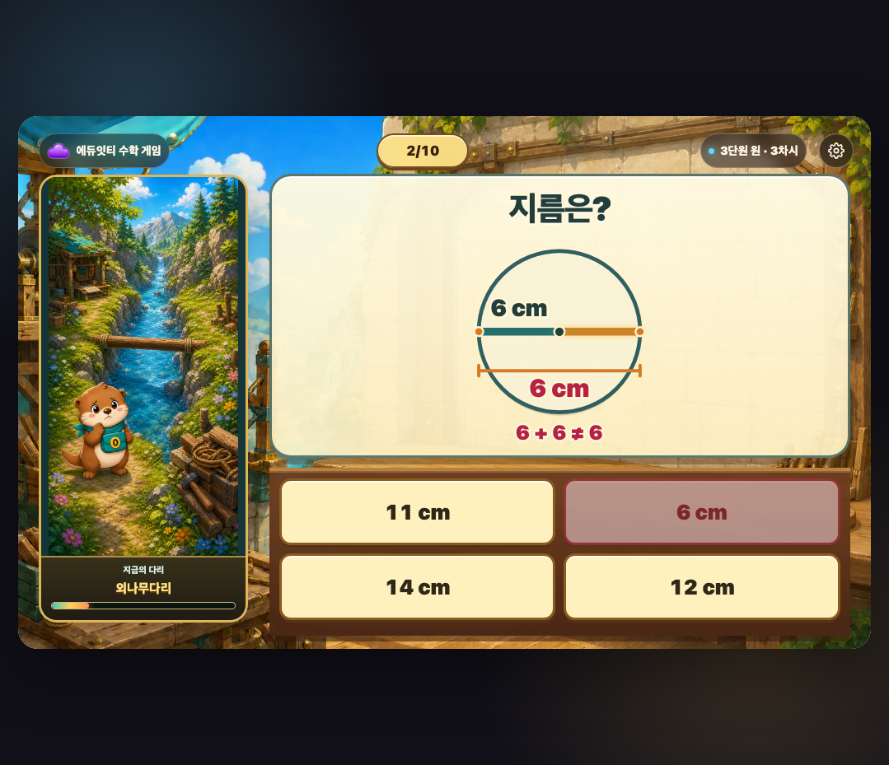

- 학생이 보는 것: 고른 길이와 목표 길이가 맞지 않는 원 그림과 오답 표시를 봅니다.
- 판단하거나 누르는 것: 길이가 짧은지, 긴지, 두 배나 반으로 계산하지 않았는지 확인합니다.
- 화면에서 확인되는 수학 관계: 반지름 두 개의 합 또는 지름의 반과 고른 길이가 같지 않음을 확인합니다.
- 다음 상태로 넘어가는 이유: 같은 문제에서 다른 길이를 다시 고릅니다.

#### 2번 문제 유형 · 지름보다 1 cm 짧은 오답 · `engine-flow-user-feedback-reward-1079x929-05m-p2-diameter-one-short.png`

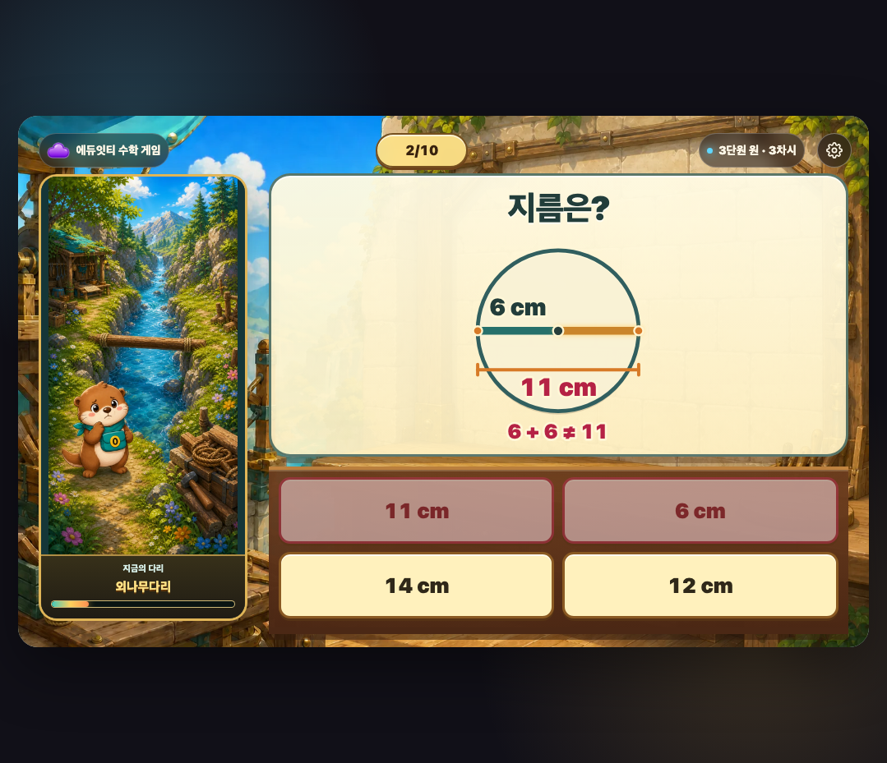

- 학생이 보는 것: 고른 길이와 목표 길이가 맞지 않는 원 그림과 오답 표시를 봅니다.
- 판단하거나 누르는 것: 길이가 짧은지, 긴지, 두 배나 반으로 계산하지 않았는지 확인합니다.
- 화면에서 확인되는 수학 관계: 반지름 두 개의 합 또는 지름의 반과 고른 길이가 같지 않음을 확인합니다.
- 다음 상태로 넘어가는 이유: 같은 문제에서 다른 길이를 다시 고릅니다.

#### 2번 문제 유형 · 지름보다 긴 오답 · `engine-flow-user-feedback-reward-1079x929-05m-p2-diameter-too-long.png`

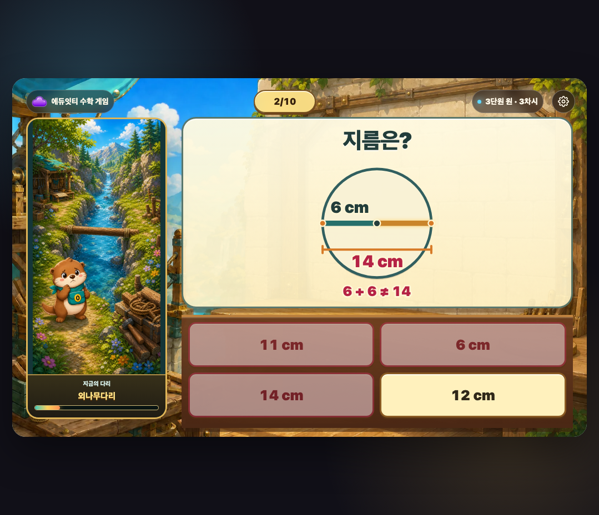

- 학생이 보는 것: 고른 길이와 목표 길이가 맞지 않는 원 그림과 오답 표시를 봅니다.
- 판단하거나 누르는 것: 길이가 짧은지, 긴지, 두 배나 반으로 계산하지 않았는지 확인합니다.
- 화면에서 확인되는 수학 관계: 반지름 두 개의 합 또는 지름의 반과 고른 길이가 같지 않음을 확인합니다.
- 다음 상태로 넘어가는 이유: 같은 문제에서 다른 길이를 다시 고릅니다.

#### 대표 오답 · `engine-flow-user-feedback-reward-1079x929-05b-play-wrong.png`

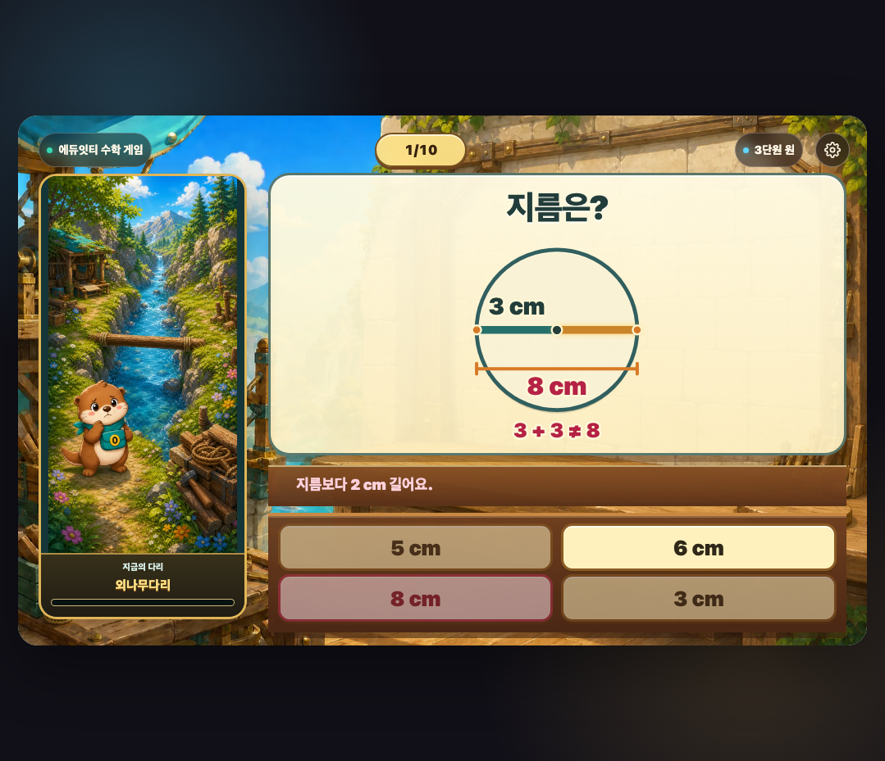

- 학생이 보는 것: 고른 길이와 정답 길이의 차이, 완성되지 않은 관계를 봅니다.
- 판단하거나 누르는 것: 오답 이유를 그림으로 확인하고 다른 선택지를 고릅니다.
- 화면에서 확인되는 수학 관계: 두 반지름의 합이나 지름의 반과 고른 길이가 같지 않음을 봅니다.
- 다음 상태로 넘어가는 이유: 관계가 맞을 때까지 같은 문제에서 다시 판단합니다.

#### 정답 확인 · `engine-flow-user-feedback-reward-1079x929-06-confirm.png`

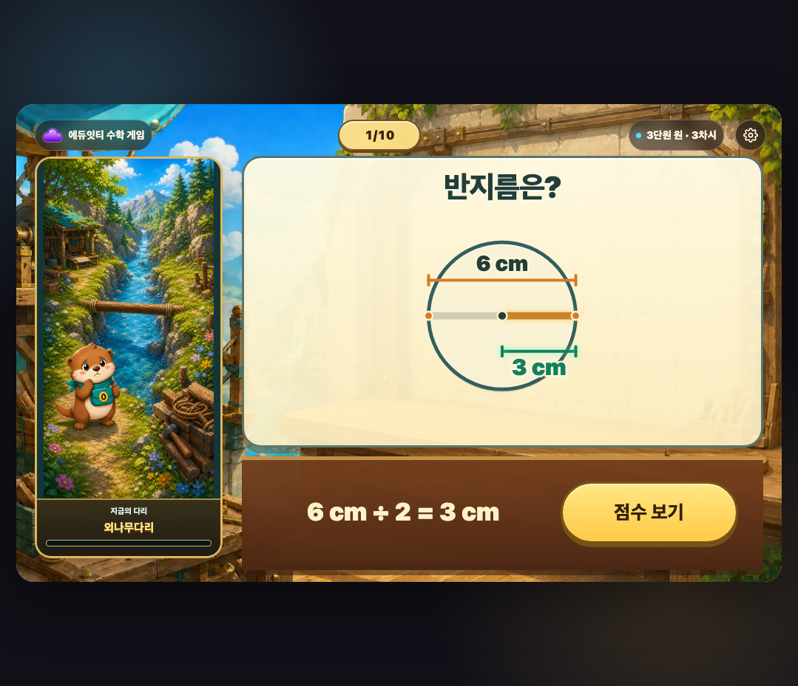

- 학생이 보는 것: 원 안에 들어간 정답 길이와 완성식, 점수 보기 버튼을 봅니다.
- 판단하거나 누르는 것: 완성된 관계를 읽은 뒤 점수 보기를 누릅니다.
- 화면에서 확인되는 수학 관계: 반지름 + 반지름 = 지름 또는 지름 ÷ 2 = 반지름을 확인합니다.
- 다음 상태로 넘어가는 이유: 수학 관계를 확인한 뒤 닫힌 보상으로 이동합니다.

#### 닫힌 보상 · `engine-flow-user-feedback-reward-1079x929-07-reward-closed.png`

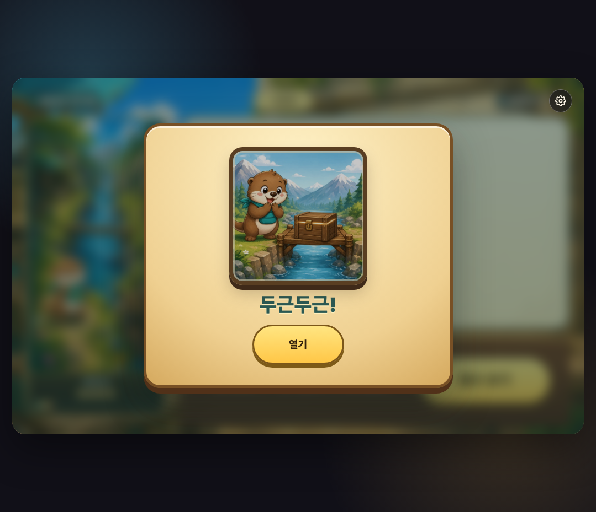

- 학생이 보는 것: 결과가 아직 드러나지 않은 보상 그림과 열기 버튼을 봅니다.
- 판단하거나 누르는 것: 이번 점수를 확인하기 위해 열기를 누릅니다.
- 화면에서 확인되는 수학 관계: 뒤 문제 화면에는 방금 완성한 반지름·지름 관계가 그대로 남습니다.
- 다음 상태로 넘어가는 이유: 학생이 직접 연 뒤에만 이번 보상 사건이 공개됩니다.

#### 열린 보상 · `engine-flow-user-feedback-reward-1079x929-07b-reward-open.png`

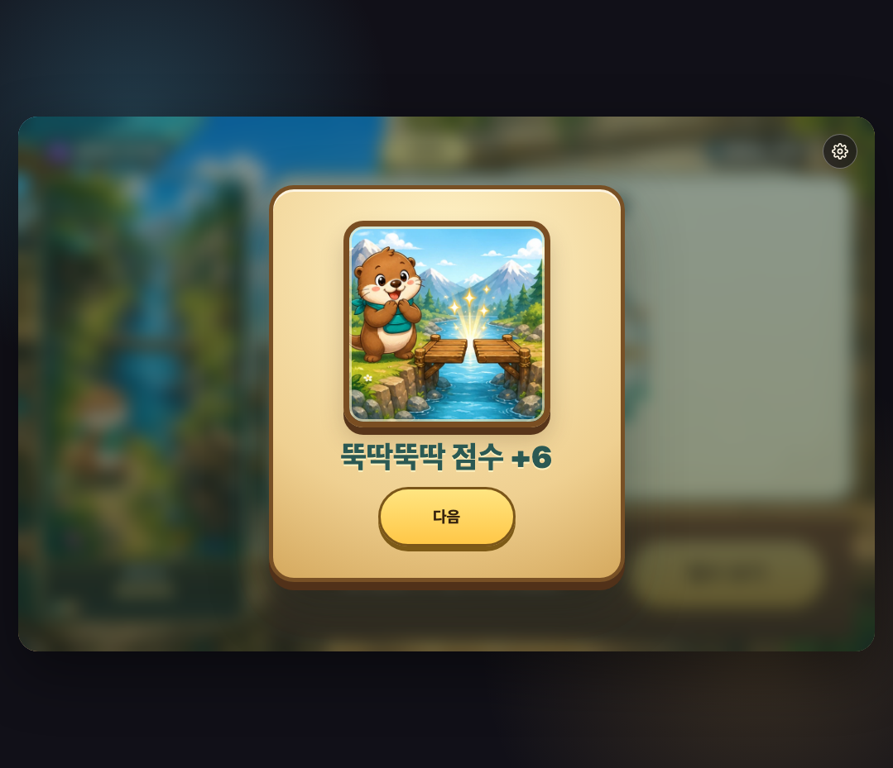

- 학생이 보는 것: 보상 사건 그림과 이번 점수 변화, 다음 버튼을 봅니다.
- 판단하거나 누르는 것: 이번 변화를 확인하고 다음을 누릅니다.
- 화면에서 확인되는 수학 관계: 정답 계산과 무작위 점수가 서로 분리되어 있음을 확인합니다.
- 다음 상태로 넘어가는 이유: 모달을 먼저 닫고 다리 세계의 실제 변화를 보여 줍니다.

#### 모달 종료 뒤 다리 변화 · `engine-flow-user-feedback-reward-1079x929-07c-reward-impact.png`

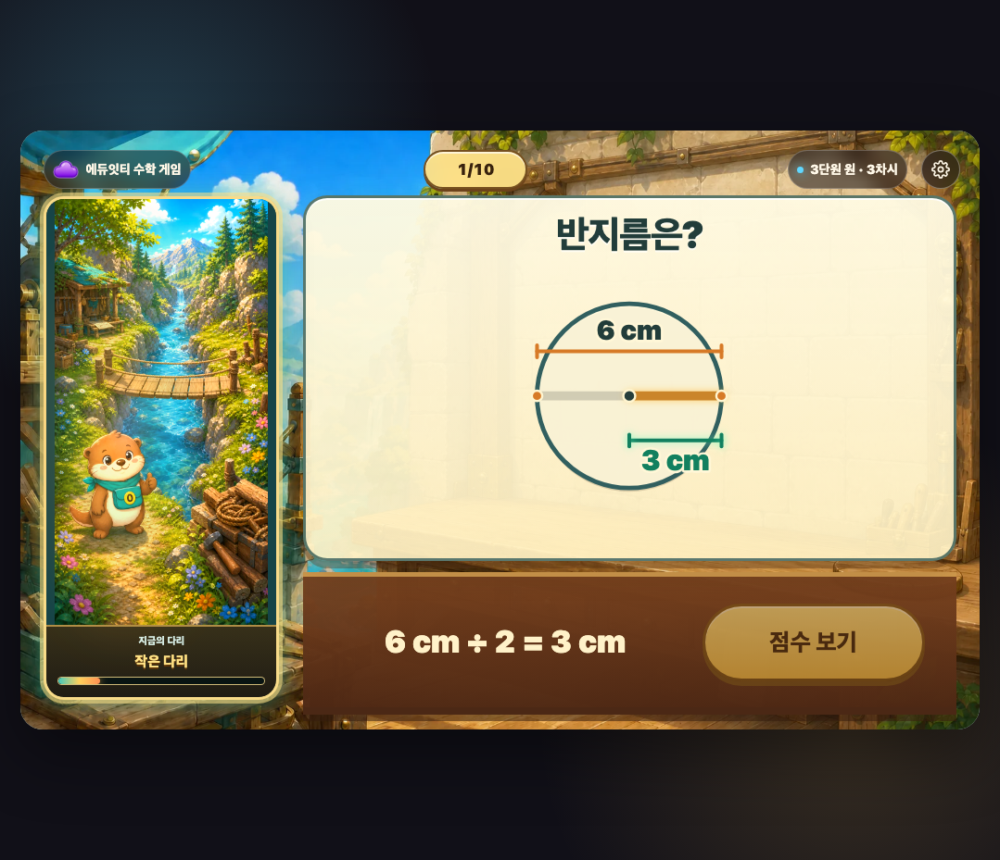

- 학생이 보는 것: 모달이 닫힌 뒤 왼쪽 다리가 바뀌고 Stage에 번지는 빛 효과를 봅니다.
- 판단하거나 누르는 것: 별도 입력 없이 이번 보상이 다리 단계를 바꾸는 모습을 확인합니다.
- 화면에서 확인되는 수학 관계: 한 문제의 보상이 현재 다리 단계에 정확히 한 번 반영됩니다.
- 다음 상태로 넘어가는 이유: 효과를 충분히 본 뒤 다음 문제 또는 결과로 이동합니다.

#### 실제 결과 · `engine-flow-user-feedback-reward-1079x929-08-result.png`

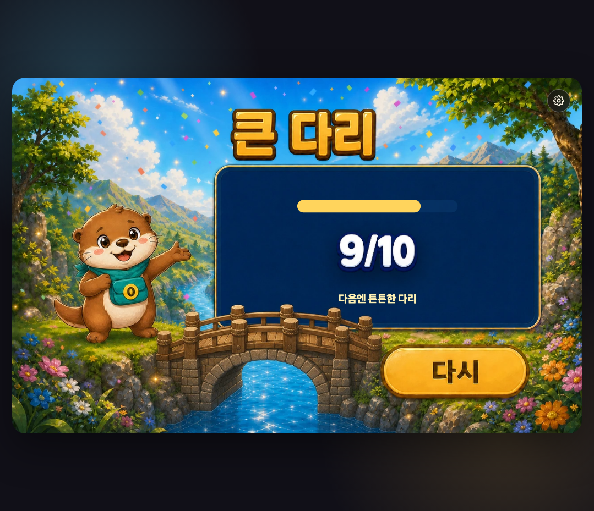

- 학생이 보는 것: 완성한 다리와 수달몬, 결과 이름, 정답 수, 다음 목표, 다시 버튼을 봅니다.
- 판단하거나 누르는 것: 현재 결과와 다음 목표를 비교하고 다시 도전할지 결정합니다.
- 화면에서 확인되는 수학 관계: 10문제의 정답 수와 누적 보상이 하나의 다리 단계로 정리됩니다.
- 다음 상태로 넘어가는 이유: 다시를 누르면 새 문제 순서와 새 보상 흐름으로 시작합니다.

#### 결과 결속 · 큰 다리 · `engine-flow-user-feedback-reward-1079x929-08c-result-cohesion-big.png`

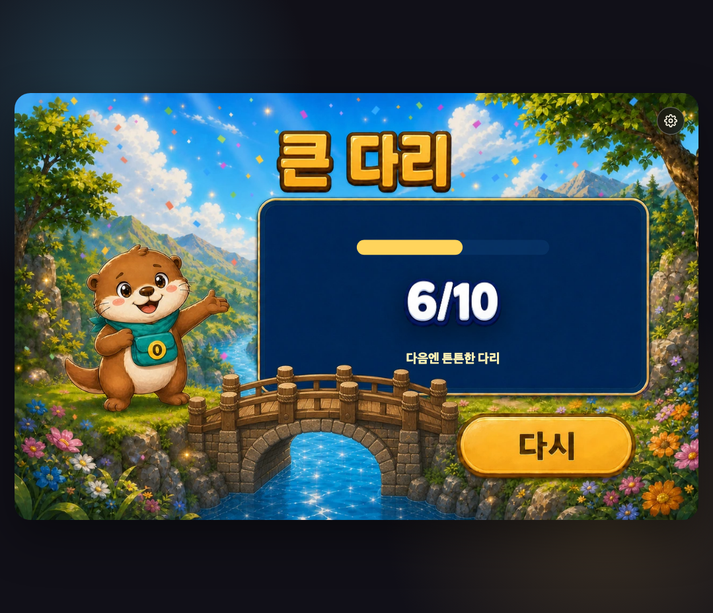

- 학생이 보는 것: 큰 다리 완성 장면과 결과판 안의 결과 이름·정답 수·다시 버튼을 봅니다.
- 판단하거나 누르는 것: 결과 요소가 한 결과판 안에 모이고 다리가 주인공으로 보이는지 확인합니다.
- 화면에서 확인되는 수학 관계: 같은 정답·보상 기준이 해당 다리 단계 장면으로 연결됩니다.
- 다음 상태로 넘어가는 이유: 이 화면은 결과 단계별 레이아웃 회귀 증거로 남습니다.

#### 결과 결속 · 튼튼한 다리 · `engine-flow-user-feedback-reward-1079x929-08c-result-cohesion-bridge.png`

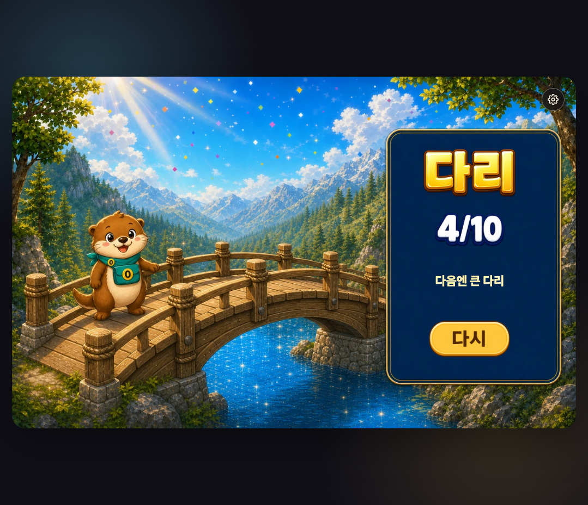

- 학생이 보는 것: 튼튼한 다리 완성 장면과 결과판 안의 결과 이름·정답 수·다시 버튼을 봅니다.
- 판단하거나 누르는 것: 결과 요소가 한 결과판 안에 모이고 다리가 주인공으로 보이는지 확인합니다.
- 화면에서 확인되는 수학 관계: 같은 정답·보상 기준이 해당 다리 단계 장면으로 연결됩니다.
- 다음 상태로 넘어가는 이유: 이 화면은 결과 단계별 레이아웃 회귀 증거로 남습니다.

#### 결과 결속 · 황금 다리 · `engine-flow-user-feedback-reward-1079x929-08c-result-cohesion-grand.png`

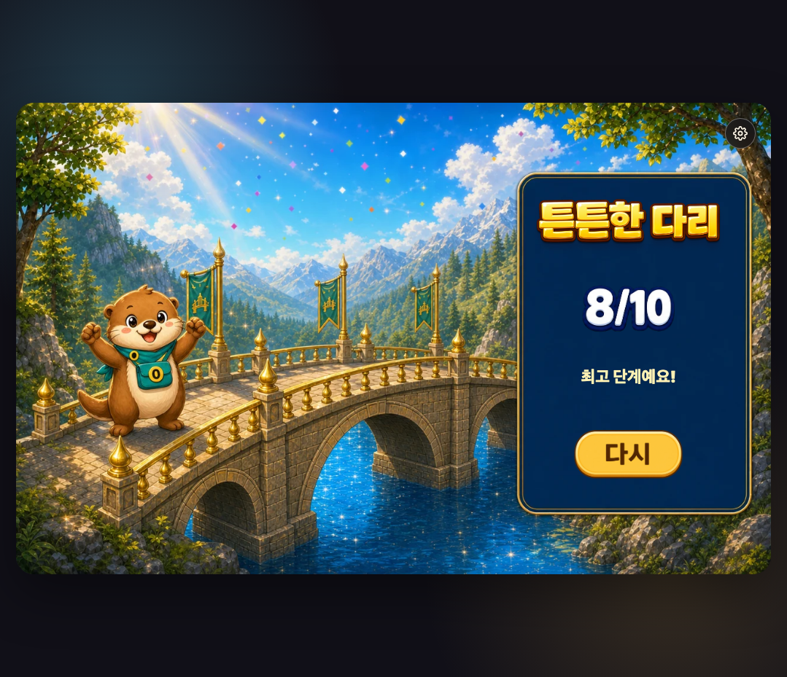

- 학생이 보는 것: 황금 다리 완성 장면과 결과판 안의 결과 이름·정답 수·다시 버튼을 봅니다.
- 판단하거나 누르는 것: 결과 요소가 한 결과판 안에 모이고 다리가 주인공으로 보이는지 확인합니다.
- 화면에서 확인되는 수학 관계: 같은 정답·보상 기준이 해당 다리 단계 장면으로 연결됩니다.
- 다음 상태로 넘어가는 이유: 이 화면은 결과 단계별 레이아웃 회귀 증거로 남습니다.

#### 결과 결속 · 외나무다리 · `engine-flow-user-feedback-reward-1079x929-08c-result-cohesion-log.png`

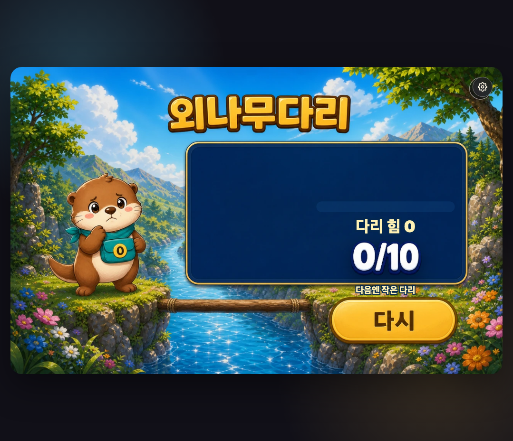

- 학생이 보는 것: 외나무다리 완성 장면과 결과판 안의 결과 이름·정답 수·다시 버튼을 봅니다.
- 판단하거나 누르는 것: 결과 요소가 한 결과판 안에 모이고 다리가 주인공으로 보이는지 확인합니다.
- 화면에서 확인되는 수학 관계: 같은 정답·보상 기준이 해당 다리 단계 장면으로 연결됩니다.
- 다음 상태로 넘어가는 이유: 이 화면은 결과 단계별 레이아웃 회귀 증거로 남습니다.

#### 결과 결속 · 무지개 다리 · `engine-flow-user-feedback-reward-1079x929-08c-result-cohesion-rainbow.png`

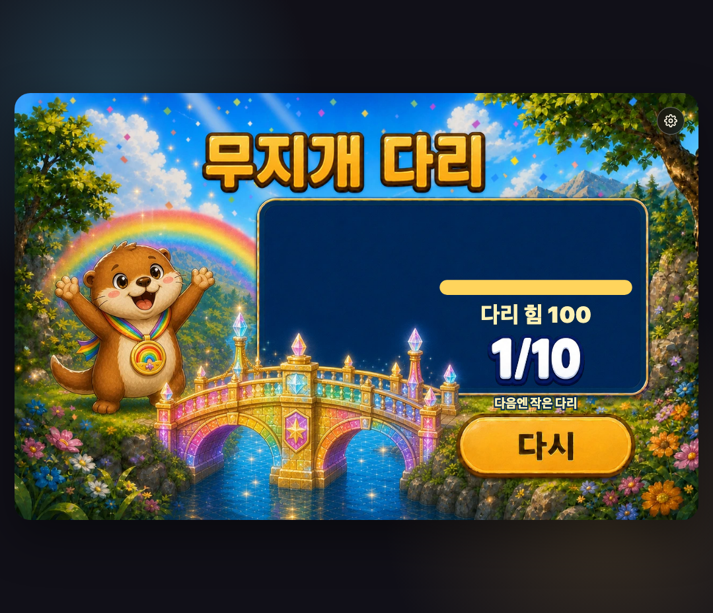

- 학생이 보는 것: 무지개 다리 완성 장면과 결과판 안의 결과 이름·정답 수·다시 버튼을 봅니다.
- 판단하거나 누르는 것: 결과 요소가 한 결과판 안에 모이고 다리가 주인공으로 보이는지 확인합니다.
- 화면에서 확인되는 수학 관계: 같은 정답·보상 기준이 해당 다리 단계 장면으로 연결됩니다.
- 다음 상태로 넘어가는 이유: 이 화면은 결과 단계별 레이아웃 회귀 증거로 남습니다.

#### 결과 결속 · 작은 다리 · `engine-flow-user-feedback-reward-1079x929-08c-result-cohesion-small.png`

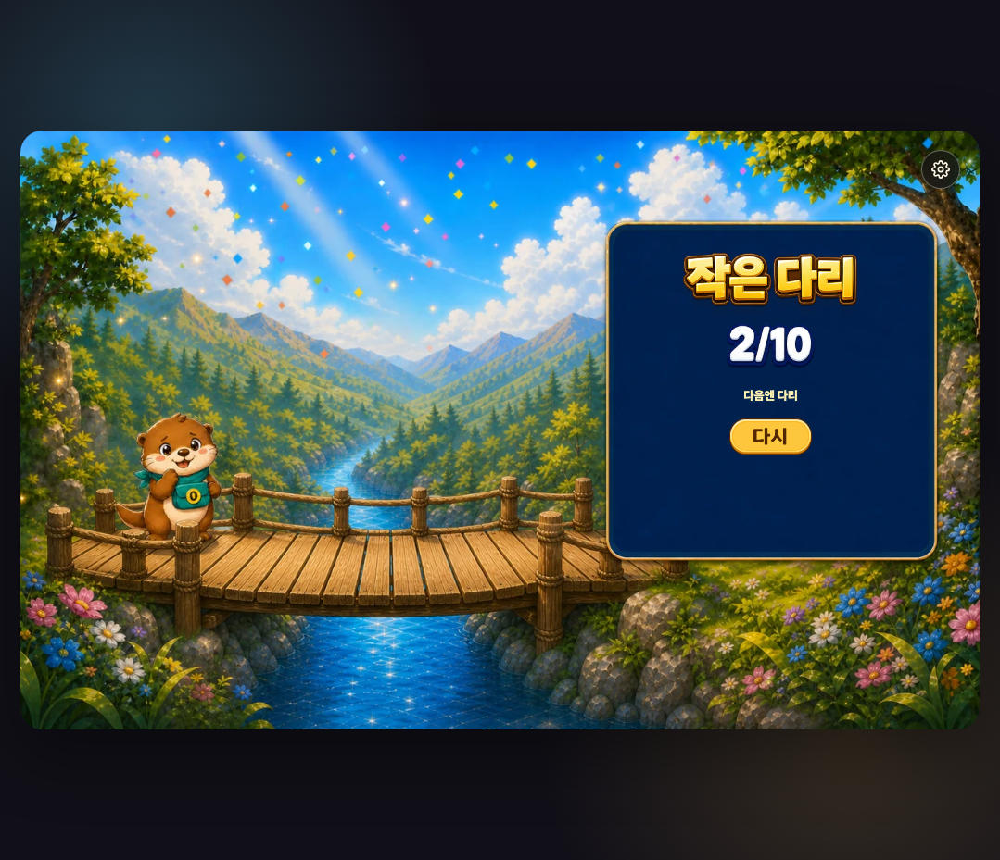

- 학생이 보는 것: 작은 다리 완성 장면과 결과판 안의 결과 이름·정답 수·다시 버튼을 봅니다.
- 판단하거나 누르는 것: 결과 요소가 한 결과판 안에 모이고 다리가 주인공으로 보이는지 확인합니다.
- 화면에서 확인되는 수학 관계: 같은 정답·보상 기준이 해당 다리 단계 장면으로 연결됩니다.
- 다음 상태로 넘어가는 이유: 이 화면은 결과 단계별 레이아웃 회귀 증거로 남습니다.

#### 결과판 포함 · 큰 다리 · `engine-flow-user-feedback-reward-1079x929-08d-result-panel-big.png`

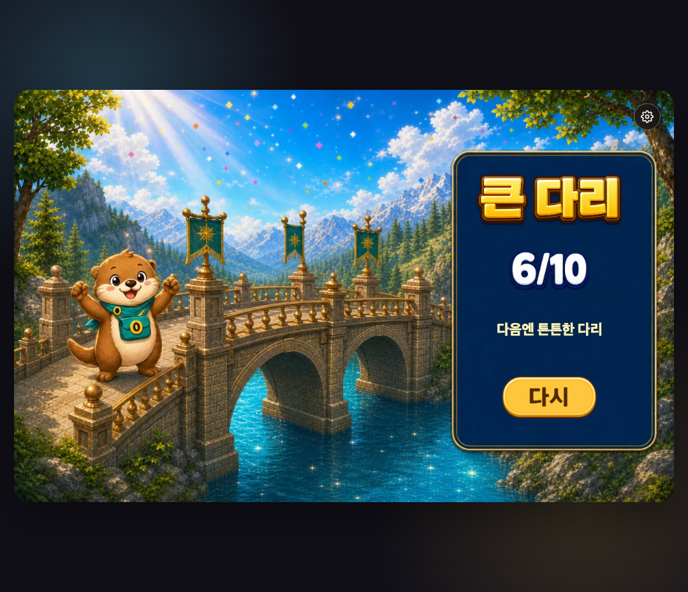

- 학생이 보는 것: 큰 다리 완성 장면과 결과판 안의 결과 이름·정답 수·다시 버튼을 봅니다.
- 판단하거나 누르는 것: 결과 요소가 한 결과판 안에 모이고 다리가 주인공으로 보이는지 확인합니다.
- 화면에서 확인되는 수학 관계: 같은 정답·보상 기준이 해당 다리 단계 장면으로 연결됩니다.
- 다음 상태로 넘어가는 이유: 이 화면은 결과 단계별 레이아웃 회귀 증거로 남습니다.

#### 결과판 포함 · 튼튼한 다리 · `engine-flow-user-feedback-reward-1079x929-08d-result-panel-bridge.png`

- 학생이 보는 것: 튼튼한 다리 완성 장면과 결과판 안의 결과 이름·정답 수·다시 버튼을 봅니다.
- 판단하거나 누르는 것: 결과 요소가 한 결과판 안에 모이고 다리가 주인공으로 보이는지 확인합니다.
- 화면에서 확인되는 수학 관계: 같은 정답·보상 기준이 해당 다리 단계 장면으로 연결됩니다.
- 다음 상태로 넘어가는 이유: 이 화면은 결과 단계별 레이아웃 회귀 증거로 남습니다.

#### 결과판 포함 · 황금 다리 · `engine-flow-user-feedback-reward-1079x929-08d-result-panel-grand.png`

- 학생이 보는 것: 황금 다리 완성 장면과 결과판 안의 결과 이름·정답 수·다시 버튼을 봅니다.
- 판단하거나 누르는 것: 결과 요소가 한 결과판 안에 모이고 다리가 주인공으로 보이는지 확인합니다.
- 화면에서 확인되는 수학 관계: 같은 정답·보상 기준이 해당 다리 단계 장면으로 연결됩니다.
- 다음 상태로 넘어가는 이유: 이 화면은 결과 단계별 레이아웃 회귀 증거로 남습니다.

#### 결과판 포함 · 외나무다리 · `engine-flow-user-feedback-reward-1079x929-08d-result-panel-log.png`

- 학생이 보는 것: 외나무다리 완성 장면과 결과판 안의 결과 이름·정답 수·다시 버튼을 봅니다.
- 판단하거나 누르는 것: 결과 요소가 한 결과판 안에 모이고 다리가 주인공으로 보이는지 확인합니다.
- 화면에서 확인되는 수학 관계: 같은 정답·보상 기준이 해당 다리 단계 장면으로 연결됩니다.
- 다음 상태로 넘어가는 이유: 이 화면은 결과 단계별 레이아웃 회귀 증거로 남습니다.

#### 결과판 포함 · 무지개 다리 · `engine-flow-user-feedback-reward-1079x929-08d-result-panel-rainbow.png`

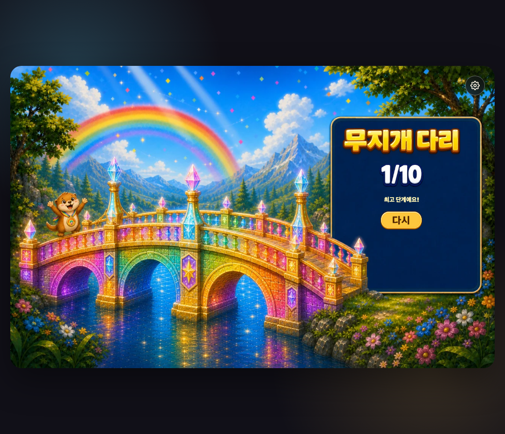

- 학생이 보는 것: 무지개 다리 완성 장면과 결과판 안의 결과 이름·정답 수·다시 버튼을 봅니다.
- 판단하거나 누르는 것: 결과 요소가 한 결과판 안에 모이고 다리가 주인공으로 보이는지 확인합니다.
- 화면에서 확인되는 수학 관계: 같은 정답·보상 기준이 해당 다리 단계 장면으로 연결됩니다.
- 다음 상태로 넘어가는 이유: 이 화면은 결과 단계별 레이아웃 회귀 증거로 남습니다.

#### 결과판 포함 · 작은 다리 · `engine-flow-user-feedback-reward-1079x929-08d-result-panel-small.png`

- 학생이 보는 것: 작은 다리 완성 장면과 결과판 안의 결과 이름·정답 수·다시 버튼을 봅니다.
- 판단하거나 누르는 것: 결과 요소가 한 결과판 안에 모이고 다리가 주인공으로 보이는지 확인합니다.
- 화면에서 확인되는 수학 관계: 같은 정답·보상 기준이 해당 다리 단계 장면으로 연결됩니다.
- 다음 상태로 넘어가는 이유: 이 화면은 결과 단계별 레이아웃 회귀 증거로 남습니다.

#### 다리 보상 우선 · 큰 다리 · `engine-flow-user-feedback-reward-1079x929-08e-result-reward-dominance-big.png`

- 학생이 보는 것: 큰 다리 완성 장면과 결과판 안의 결과 이름·정답 수·다시 버튼을 봅니다.
- 판단하거나 누르는 것: 결과 요소가 한 결과판 안에 모이고 다리가 주인공으로 보이는지 확인합니다.
- 화면에서 확인되는 수학 관계: 같은 정답·보상 기준이 해당 다리 단계 장면으로 연결됩니다.
- 다음 상태로 넘어가는 이유: 이 화면은 결과 단계별 레이아웃 회귀 증거로 남습니다.

#### 다리 보상 우선 · 튼튼한 다리 · `engine-flow-user-feedback-reward-1079x929-08e-result-reward-dominance-bridge.png`

- 학생이 보는 것: 튼튼한 다리 완성 장면과 결과판 안의 결과 이름·정답 수·다시 버튼을 봅니다.
- 판단하거나 누르는 것: 결과 요소가 한 결과판 안에 모이고 다리가 주인공으로 보이는지 확인합니다.
- 화면에서 확인되는 수학 관계: 같은 정답·보상 기준이 해당 다리 단계 장면으로 연결됩니다.
- 다음 상태로 넘어가는 이유: 이 화면은 결과 단계별 레이아웃 회귀 증거로 남습니다.

#### 다리 보상 우선 · 황금 다리 · `engine-flow-user-feedback-reward-1079x929-08e-result-reward-dominance-grand.png`

- 학생이 보는 것: 황금 다리 완성 장면과 결과판 안의 결과 이름·정답 수·다시 버튼을 봅니다.
- 판단하거나 누르는 것: 결과 요소가 한 결과판 안에 모이고 다리가 주인공으로 보이는지 확인합니다.
- 화면에서 확인되는 수학 관계: 같은 정답·보상 기준이 해당 다리 단계 장면으로 연결됩니다.
- 다음 상태로 넘어가는 이유: 이 화면은 결과 단계별 레이아웃 회귀 증거로 남습니다.

#### 다리 보상 우선 · 외나무다리 · `engine-flow-user-feedback-reward-1079x929-08e-result-reward-dominance-log.png`

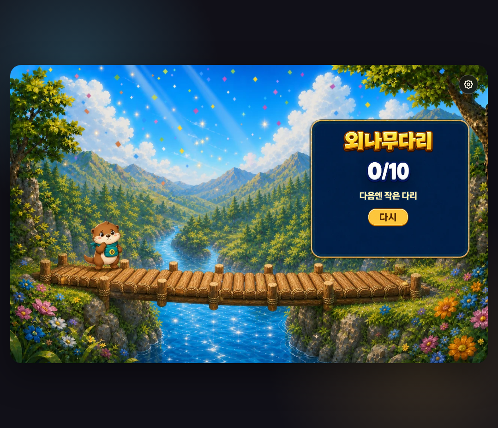

- 학생이 보는 것: 외나무다리 완성 장면과 결과판 안의 결과 이름·정답 수·다시 버튼을 봅니다.
- 판단하거나 누르는 것: 결과 요소가 한 결과판 안에 모이고 다리가 주인공으로 보이는지 확인합니다.
- 화면에서 확인되는 수학 관계: 같은 정답·보상 기준이 해당 다리 단계 장면으로 연결됩니다.
- 다음 상태로 넘어가는 이유: 이 화면은 결과 단계별 레이아웃 회귀 증거로 남습니다.

#### 다리 보상 우선 · 무지개 다리 · `engine-flow-user-feedback-reward-1079x929-08e-result-reward-dominance-rainbow.png`

- 학생이 보는 것: 무지개 다리 완성 장면과 결과판 안의 결과 이름·정답 수·다시 버튼을 봅니다.
- 판단하거나 누르는 것: 결과 요소가 한 결과판 안에 모이고 다리가 주인공으로 보이는지 확인합니다.
- 화면에서 확인되는 수학 관계: 같은 정답·보상 기준이 해당 다리 단계 장면으로 연결됩니다.
- 다음 상태로 넘어가는 이유: 이 화면은 결과 단계별 레이아웃 회귀 증거로 남습니다.

#### 다리 보상 우선 · 작은 다리 · `engine-flow-user-feedback-reward-1079x929-08e-result-reward-dominance-small.png`

- 학생이 보는 것: 작은 다리 완성 장면과 결과판 안의 결과 이름·정답 수·다시 버튼을 봅니다.
- 판단하거나 누르는 것: 결과 요소가 한 결과판 안에 모이고 다리가 주인공으로 보이는지 확인합니다.
- 화면에서 확인되는 수학 관계: 같은 정답·보상 기준이 해당 다리 단계 장면으로 연결됩니다.
- 다음 상태로 넘어가는 이유: 이 화면은 결과 단계별 레이아웃 회귀 증거로 남습니다.

### codex-in-app · 1280×720 · DPR 2 · 37장

- 같은 실행으로 보존한 회귀 이름: 없음
- 캡처 범위: `full-flow`

#### 시작 화면 · `engine-flow-codex-in-app-01-cover.png`

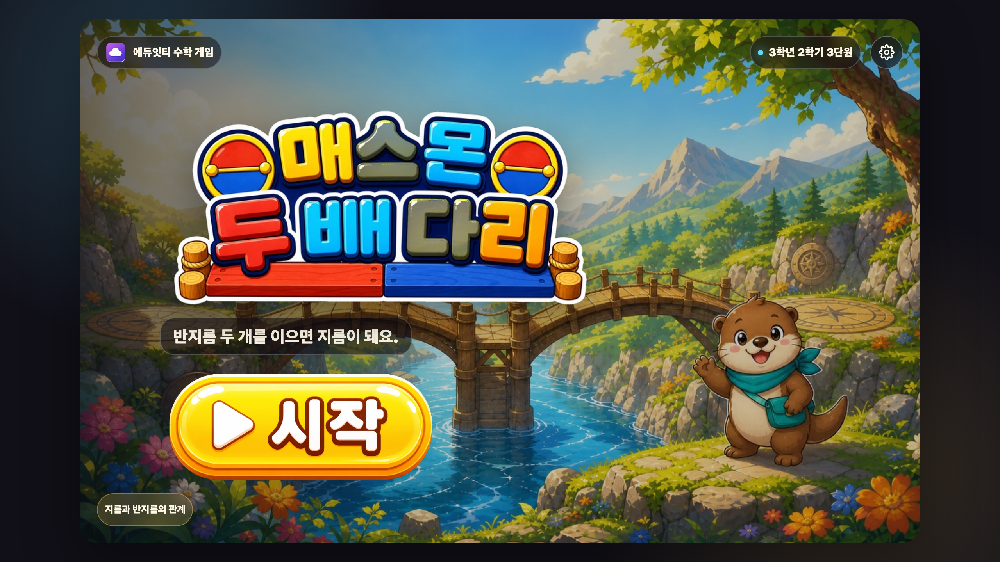

- 학생이 보는 것: 수달몬과 계곡 다리, 게임 제목, 한 줄 목표, 시작 버튼을 봅니다.
- 판단하거나 누르는 것: 게임을 시작할 준비가 되면 시작을 누릅니다.
- 화면에서 확인되는 수학 관계: 반지름 두 개를 이으면 지름이 된다는 배움 방향을 먼저 확인합니다.
- 다음 상태로 넘어가는 이유: 다리를 잇는 방법을 확인하는 설명 화면으로 이동합니다.

#### 설정 화면 · `engine-flow-codex-in-app-02-settings.png`

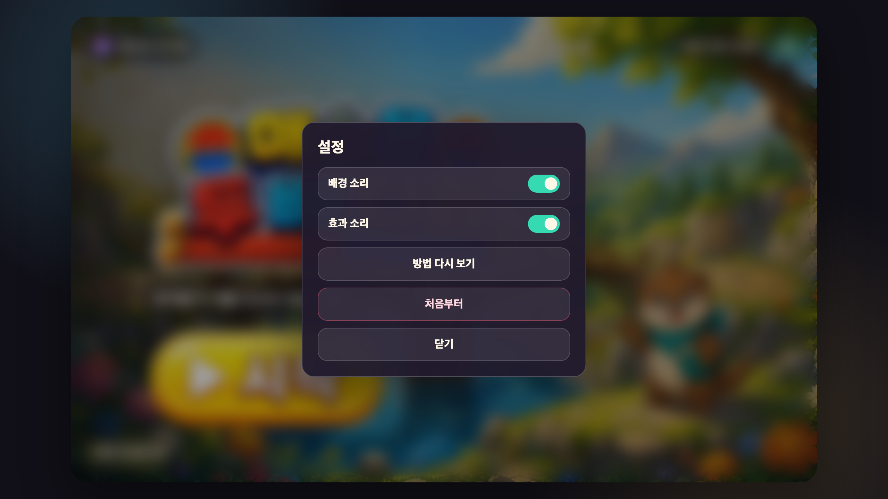

- 학생이 보는 것: 배경 소리·효과 소리와 방법 다시 보기, 처음부터, 닫기를 봅니다.
- 판단하거나 누르는 것: 필요한 소리나 이동 행동 하나를 고릅니다.
- 화면에서 확인되는 수학 관계: 수학 문제는 바꾸지 않고 게임 조작만 설정합니다.
- 다음 상태로 넘어가는 이유: 설정을 마치면 열기 전 화면으로 돌아갑니다.

#### 설명 1 · 풀이 방법 · `engine-flow-codex-in-app-03-tutorial-1.png`

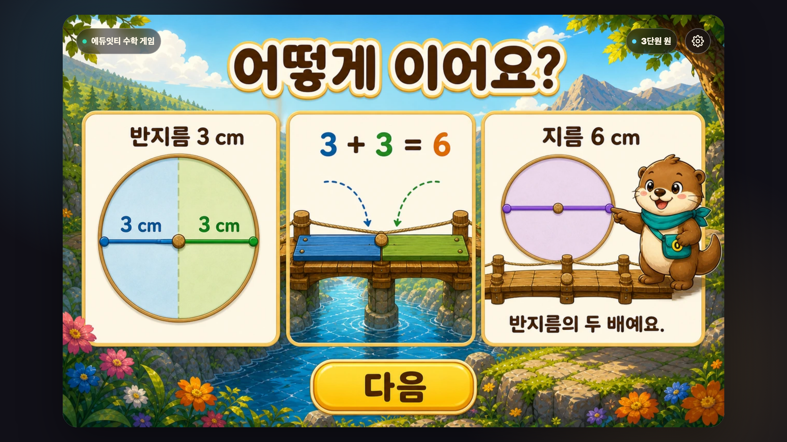

- 학생이 보는 것: 두 반지름을 이어 하나의 지름을 만드는 예를 봅니다.
- 판단하거나 누르는 것: 반지름 두 개가 지름 하나가 되는 모습을 확인하고 다음을 누릅니다.
- 화면에서 확인되는 수학 관계: 반지름 + 반지름 = 지름 관계를 확인합니다.
- 다음 상태로 넘어가는 이유: 문제 수와 다리 목표를 보는 설명 2로 이동합니다.

#### 설명 2 · 보상과 목표 · `engine-flow-codex-in-app-04-tutorial-2.png`

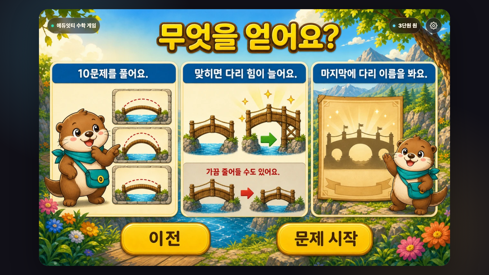

- 학생이 보는 것: 10문제와 여섯 다리 단계, 마지막 결과 흐름을 봅니다.
- 판단하거나 누르는 것: 게임 목표를 확인하고 문제 시작을 누릅니다.
- 화면에서 확인되는 수학 관계: 문제에서 고른 길이가 다리 단계 변화로 이어짐을 확인합니다.
- 다음 상태로 넘어가는 이유: 첫 번째 반지름·지름 문제로 이동합니다.

#### 문제 대기 · `engine-flow-codex-in-app-05-play-step1.png`

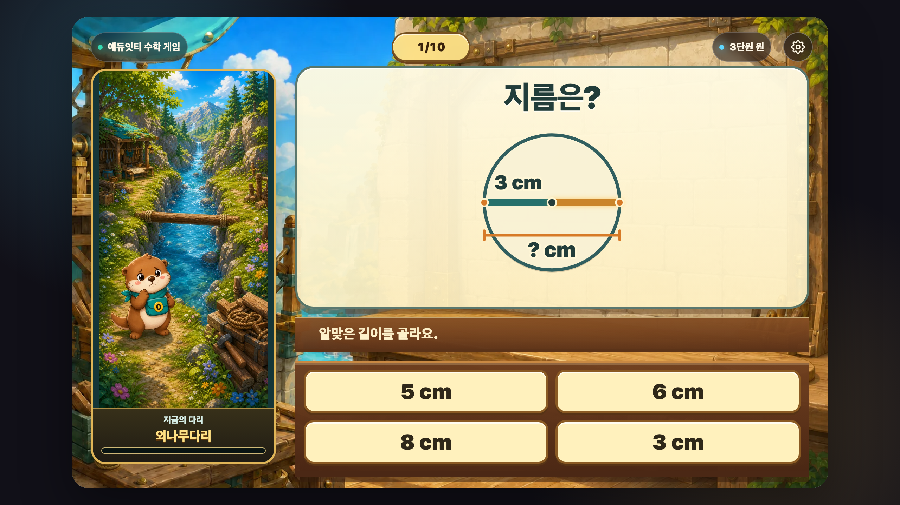

- 학생이 보는 것: 왼쪽 현재 다리와 오른쪽 원의 길이 관계, 네 선택지를 봅니다.
- 판단하거나 누르는 것: 주어진 지름 또는 반지름에 맞는 길이 하나를 고릅니다.
- 화면에서 확인되는 수학 관계: 지름은 반지름의 두 배이고 반지름은 지름의 반임을 판단합니다.
- 다음 상태로 넘어가는 이유: 고른 길이에 따라 오답 또는 정답 확인 상태로 이동합니다.

#### 정답 선택 효과 · `engine-flow-codex-in-app-05c-correct-effect.png`

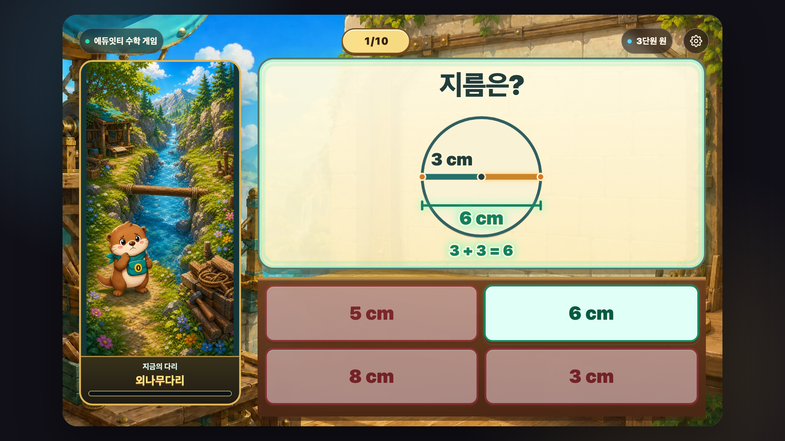

- 학생이 보는 것: 고른 정답이 원과 길이 그림에 들어가는 짧은 효과를 봅니다.
- 판단하거나 누르는 것: 별도 입력 없이 자신이 고른 길이가 적용되는 모습을 확인합니다.
- 화면에서 확인되는 수학 관계: 선택한 길이가 반지름·지름 관계를 정확히 완성합니다.
- 다음 상태로 넘어가는 이유: 완성식과 점수 보기 버튼이 있는 정답 확인으로 이어집니다.

#### 05n-next-problem-clean · `engine-flow-codex-in-app-05n-next-problem-clean.png`

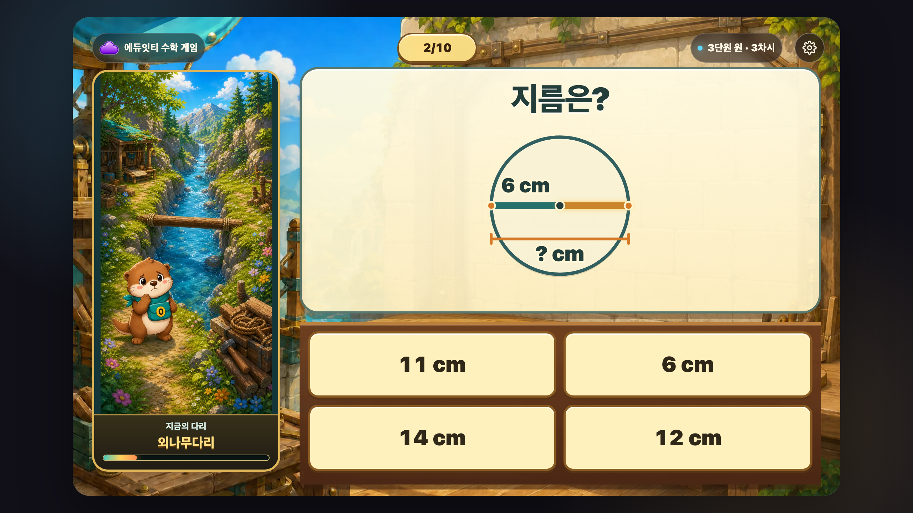

- 학생이 보는 것: 현재 게임 상태의 모든 보이는 요소를 확인합니다.
- 판단하거나 누르는 것: 이 상태에서 요구되는 한 가지 행동이나 자동 전환을 확인합니다.
- 화면에서 확인되는 수학 관계: 반지름과 지름의 관계가 화면 상태에 맞게 유지되는지 확인합니다.
- 다음 상태로 넘어가는 이유: 정해진 게임 흐름의 다음 상태로 이동합니다.

#### 1번 문제 유형 · 지름을 반으로 나누지 않은 오답 · `engine-flow-codex-in-app-05m-p1-radius-not-halved.png`

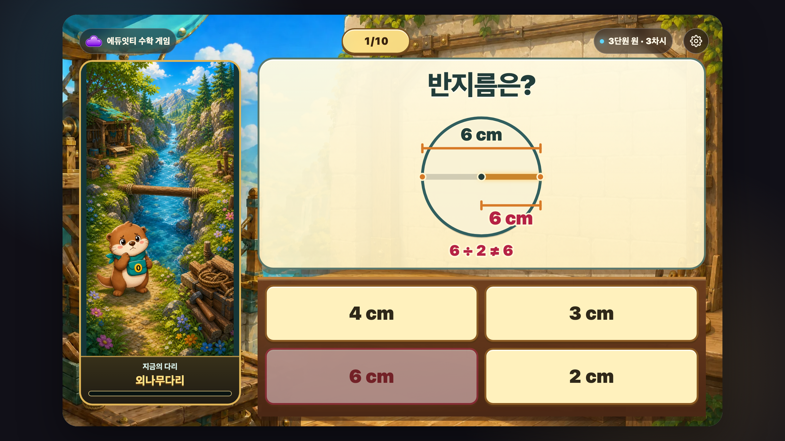

- 학생이 보는 것: 고른 길이와 목표 길이가 맞지 않는 원 그림과 오답 표시를 봅니다.
- 판단하거나 누르는 것: 길이가 짧은지, 긴지, 두 배나 반으로 계산하지 않았는지 확인합니다.
- 화면에서 확인되는 수학 관계: 반지름 두 개의 합 또는 지름의 반과 고른 길이가 같지 않음을 확인합니다.
- 다음 상태로 넘어가는 이유: 같은 문제에서 다른 길이를 다시 고릅니다.

#### 1번 문제 유형 · 반지름보다 긴 오답 · `engine-flow-codex-in-app-05m-p1-radius-too-long.png`

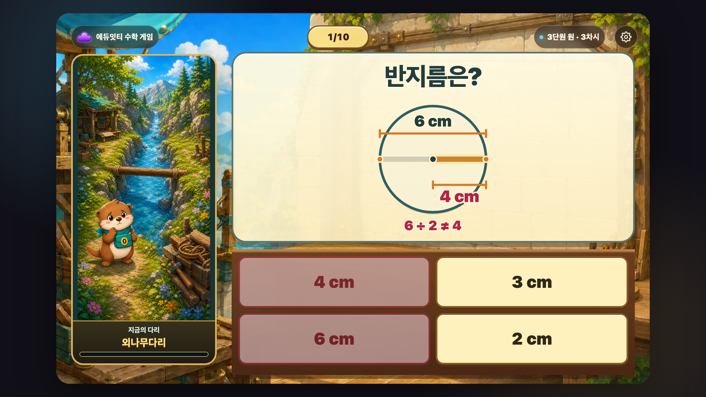

- 학생이 보는 것: 고른 길이와 목표 길이가 맞지 않는 원 그림과 오답 표시를 봅니다.
- 판단하거나 누르는 것: 길이가 짧은지, 긴지, 두 배나 반으로 계산하지 않았는지 확인합니다.
- 화면에서 확인되는 수학 관계: 반지름 두 개의 합 또는 지름의 반과 고른 길이가 같지 않음을 확인합니다.
- 다음 상태로 넘어가는 이유: 같은 문제에서 다른 길이를 다시 고릅니다.

#### 1번 문제 유형 · 반지름보다 짧은 오답 · `engine-flow-codex-in-app-05m-p1-radius-too-short.png`

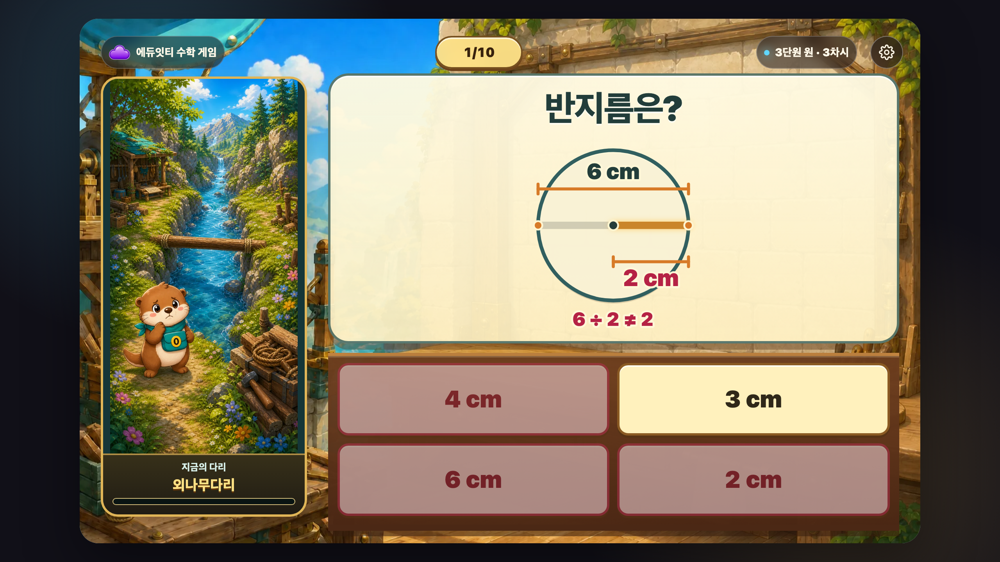

- 학생이 보는 것: 고른 길이와 목표 길이가 맞지 않는 원 그림과 오답 표시를 봅니다.
- 판단하거나 누르는 것: 길이가 짧은지, 긴지, 두 배나 반으로 계산하지 않았는지 확인합니다.
- 화면에서 확인되는 수학 관계: 반지름 두 개의 합 또는 지름의 반과 고른 길이가 같지 않음을 확인합니다.
- 다음 상태로 넘어가는 이유: 같은 문제에서 다른 길이를 다시 고릅니다.

#### 2번 문제 유형 · 반지름을 두 배 하지 않은 오답 · `engine-flow-codex-in-app-05m-p2-diameter-not-doubled.png`

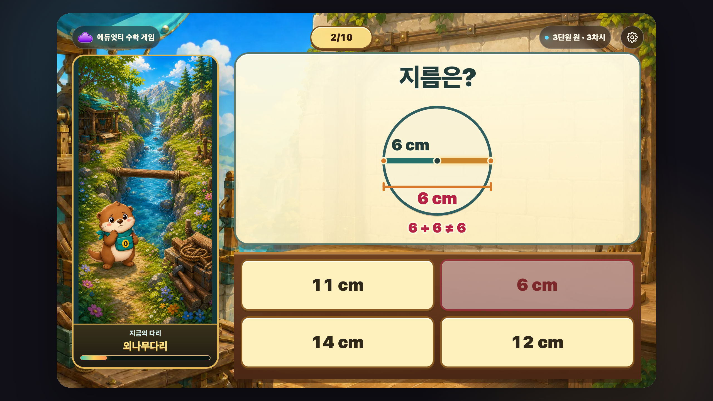

- 학생이 보는 것: 고른 길이와 목표 길이가 맞지 않는 원 그림과 오답 표시를 봅니다.
- 판단하거나 누르는 것: 길이가 짧은지, 긴지, 두 배나 반으로 계산하지 않았는지 확인합니다.
- 화면에서 확인되는 수학 관계: 반지름 두 개의 합 또는 지름의 반과 고른 길이가 같지 않음을 확인합니다.
- 다음 상태로 넘어가는 이유: 같은 문제에서 다른 길이를 다시 고릅니다.

#### 2번 문제 유형 · 지름보다 1 cm 짧은 오답 · `engine-flow-codex-in-app-05m-p2-diameter-one-short.png`

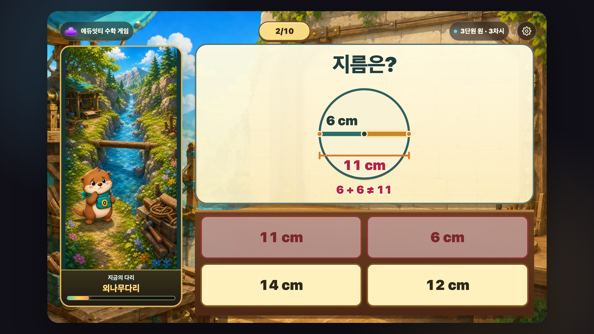

- 학생이 보는 것: 고른 길이와 목표 길이가 맞지 않는 원 그림과 오답 표시를 봅니다.
- 판단하거나 누르는 것: 길이가 짧은지, 긴지, 두 배나 반으로 계산하지 않았는지 확인합니다.
- 화면에서 확인되는 수학 관계: 반지름 두 개의 합 또는 지름의 반과 고른 길이가 같지 않음을 확인합니다.
- 다음 상태로 넘어가는 이유: 같은 문제에서 다른 길이를 다시 고릅니다.

#### 2번 문제 유형 · 지름보다 긴 오답 · `engine-flow-codex-in-app-05m-p2-diameter-too-long.png`

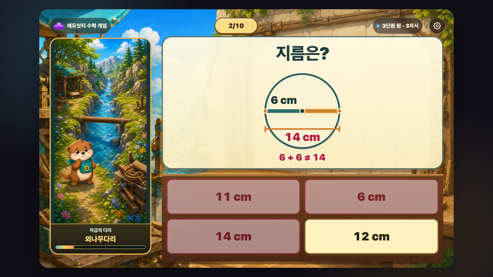

- 학생이 보는 것: 고른 길이와 목표 길이가 맞지 않는 원 그림과 오답 표시를 봅니다.
- 판단하거나 누르는 것: 길이가 짧은지, 긴지, 두 배나 반으로 계산하지 않았는지 확인합니다.
- 화면에서 확인되는 수학 관계: 반지름 두 개의 합 또는 지름의 반과 고른 길이가 같지 않음을 확인합니다.
- 다음 상태로 넘어가는 이유: 같은 문제에서 다른 길이를 다시 고릅니다.

#### 대표 오답 · `engine-flow-codex-in-app-05b-play-wrong.png`

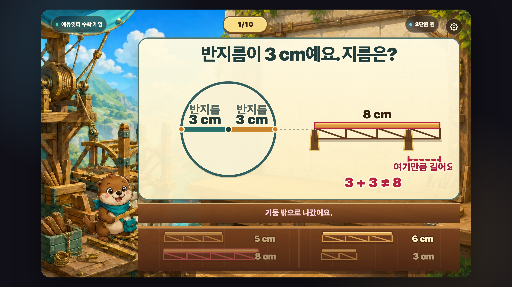

- 학생이 보는 것: 고른 길이와 정답 길이의 차이, 완성되지 않은 관계를 봅니다.
- 판단하거나 누르는 것: 오답 이유를 그림으로 확인하고 다른 선택지를 고릅니다.
- 화면에서 확인되는 수학 관계: 두 반지름의 합이나 지름의 반과 고른 길이가 같지 않음을 봅니다.
- 다음 상태로 넘어가는 이유: 관계가 맞을 때까지 같은 문제에서 다시 판단합니다.

#### 정답 확인 · `engine-flow-codex-in-app-06-confirm.png`

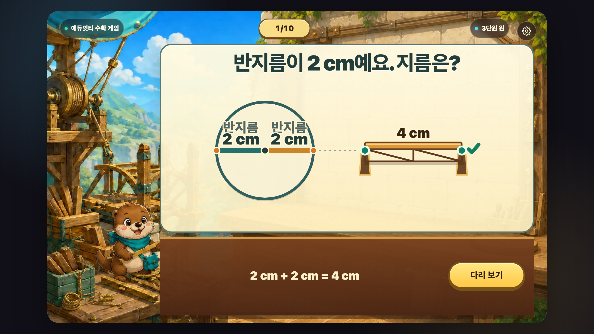

- 학생이 보는 것: 원 안에 들어간 정답 길이와 완성식, 점수 보기 버튼을 봅니다.
- 판단하거나 누르는 것: 완성된 관계를 읽은 뒤 점수 보기를 누릅니다.
- 화면에서 확인되는 수학 관계: 반지름 + 반지름 = 지름 또는 지름 ÷ 2 = 반지름을 확인합니다.
- 다음 상태로 넘어가는 이유: 수학 관계를 확인한 뒤 닫힌 보상으로 이동합니다.

#### 닫힌 보상 · `engine-flow-codex-in-app-07-reward-closed.png`

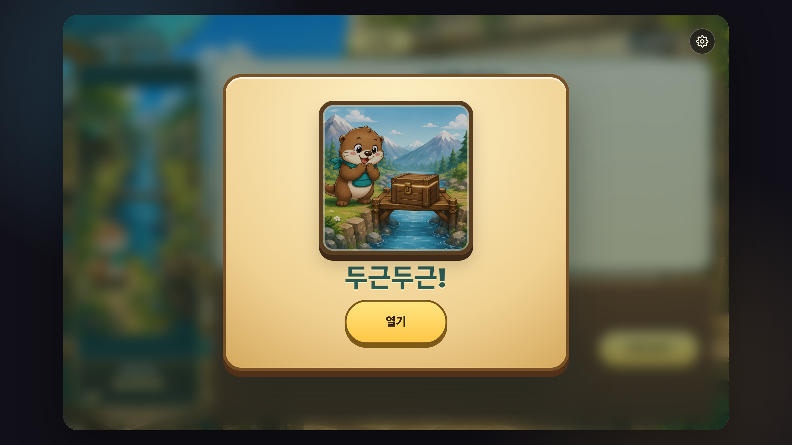

- 학생이 보는 것: 결과가 아직 드러나지 않은 보상 그림과 열기 버튼을 봅니다.
- 판단하거나 누르는 것: 이번 점수를 확인하기 위해 열기를 누릅니다.
- 화면에서 확인되는 수학 관계: 뒤 문제 화면에는 방금 완성한 반지름·지름 관계가 그대로 남습니다.
- 다음 상태로 넘어가는 이유: 학생이 직접 연 뒤에만 이번 보상 사건이 공개됩니다.

#### 열린 보상 · `engine-flow-codex-in-app-07b-reward-open.png`

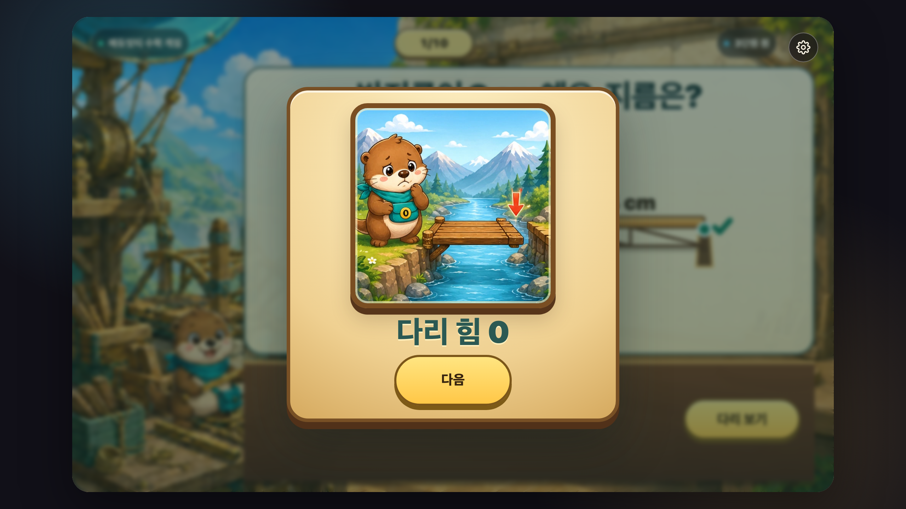

- 학생이 보는 것: 보상 사건 그림과 이번 점수 변화, 다음 버튼을 봅니다.
- 판단하거나 누르는 것: 이번 변화를 확인하고 다음을 누릅니다.
- 화면에서 확인되는 수학 관계: 정답 계산과 무작위 점수가 서로 분리되어 있음을 확인합니다.
- 다음 상태로 넘어가는 이유: 모달을 먼저 닫고 다리 세계의 실제 변화를 보여 줍니다.

#### 모달 종료 뒤 다리 변화 · `engine-flow-codex-in-app-07c-reward-impact.png`

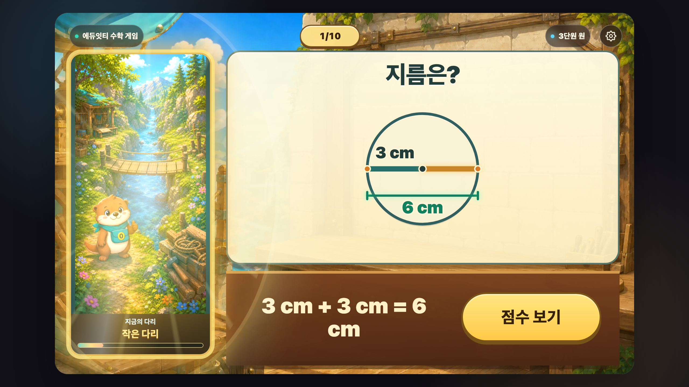

- 학생이 보는 것: 모달이 닫힌 뒤 왼쪽 다리가 바뀌고 Stage에 번지는 빛 효과를 봅니다.
- 판단하거나 누르는 것: 별도 입력 없이 이번 보상이 다리 단계를 바꾸는 모습을 확인합니다.
- 화면에서 확인되는 수학 관계: 한 문제의 보상이 현재 다리 단계에 정확히 한 번 반영됩니다.
- 다음 상태로 넘어가는 이유: 효과를 충분히 본 뒤 다음 문제 또는 결과로 이동합니다.

#### 실제 결과 · `engine-flow-codex-in-app-08-result.png`

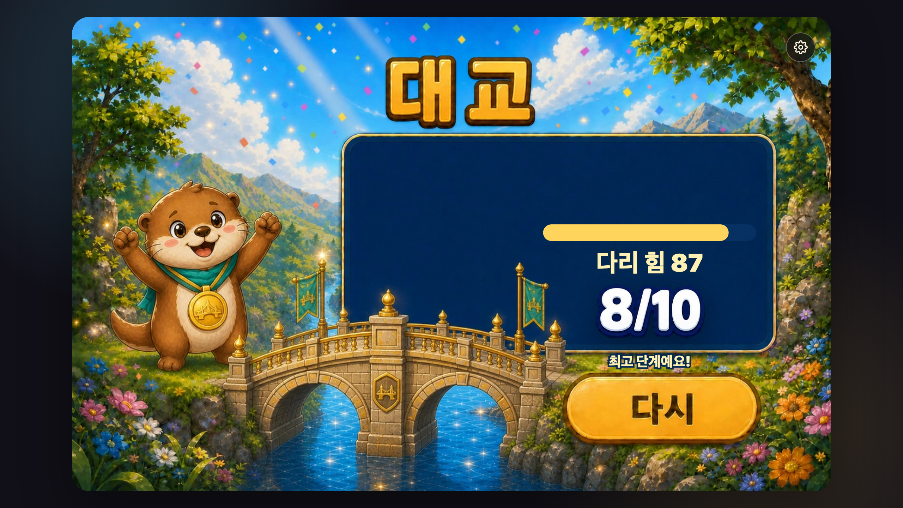

- 학생이 보는 것: 완성한 다리와 수달몬, 결과 이름, 정답 수, 다음 목표, 다시 버튼을 봅니다.
- 판단하거나 누르는 것: 현재 결과와 다음 목표를 비교하고 다시 도전할지 결정합니다.
- 화면에서 확인되는 수학 관계: 10문제의 정답 수와 누적 보상이 하나의 다리 단계로 정리됩니다.
- 다음 상태로 넘어가는 이유: 다시를 누르면 새 문제 순서와 새 보상 흐름으로 시작합니다.

#### 결과 결속 · 큰 다리 · `engine-flow-codex-in-app-08c-result-cohesion-big.png`

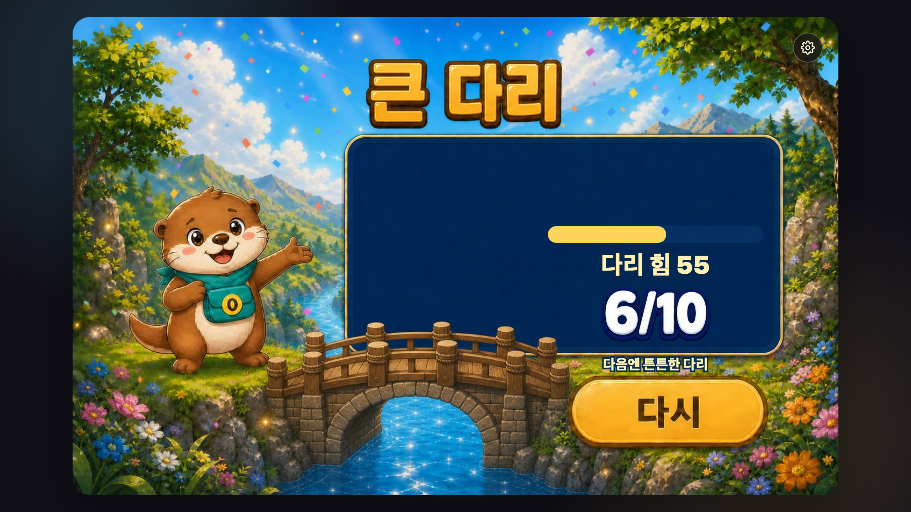

- 학생이 보는 것: 큰 다리 완성 장면과 결과판 안의 결과 이름·정답 수·다시 버튼을 봅니다.
- 판단하거나 누르는 것: 결과 요소가 한 결과판 안에 모이고 다리가 주인공으로 보이는지 확인합니다.
- 화면에서 확인되는 수학 관계: 같은 정답·보상 기준이 해당 다리 단계 장면으로 연결됩니다.
- 다음 상태로 넘어가는 이유: 이 화면은 결과 단계별 레이아웃 회귀 증거로 남습니다.

#### 결과 결속 · 튼튼한 다리 · `engine-flow-codex-in-app-08c-result-cohesion-bridge.png`

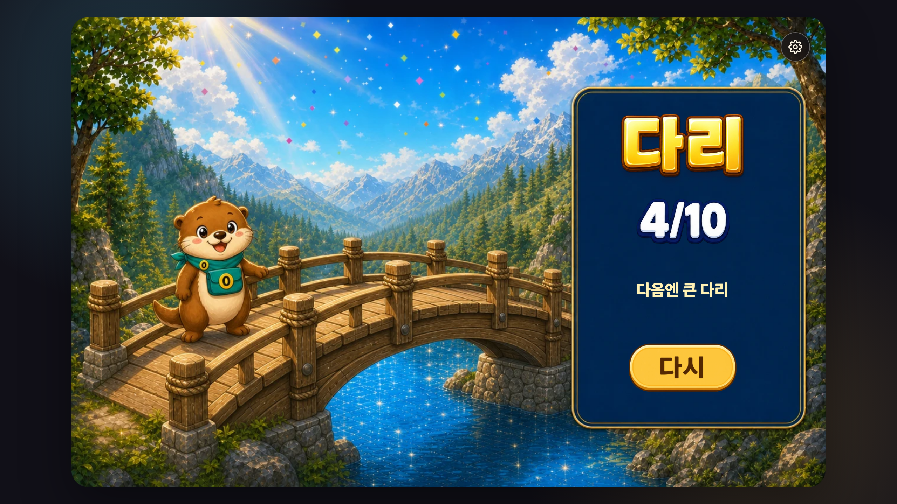

- 학생이 보는 것: 튼튼한 다리 완성 장면과 결과판 안의 결과 이름·정답 수·다시 버튼을 봅니다.
- 판단하거나 누르는 것: 결과 요소가 한 결과판 안에 모이고 다리가 주인공으로 보이는지 확인합니다.
- 화면에서 확인되는 수학 관계: 같은 정답·보상 기준이 해당 다리 단계 장면으로 연결됩니다.
- 다음 상태로 넘어가는 이유: 이 화면은 결과 단계별 레이아웃 회귀 증거로 남습니다.

#### 결과 결속 · 황금 다리 · `engine-flow-codex-in-app-08c-result-cohesion-grand.png`

- 학생이 보는 것: 황금 다리 완성 장면과 결과판 안의 결과 이름·정답 수·다시 버튼을 봅니다.
- 판단하거나 누르는 것: 결과 요소가 한 결과판 안에 모이고 다리가 주인공으로 보이는지 확인합니다.
- 화면에서 확인되는 수학 관계: 같은 정답·보상 기준이 해당 다리 단계 장면으로 연결됩니다.
- 다음 상태로 넘어가는 이유: 이 화면은 결과 단계별 레이아웃 회귀 증거로 남습니다.

#### 결과 결속 · 외나무다리 · `engine-flow-codex-in-app-08c-result-cohesion-log.png`

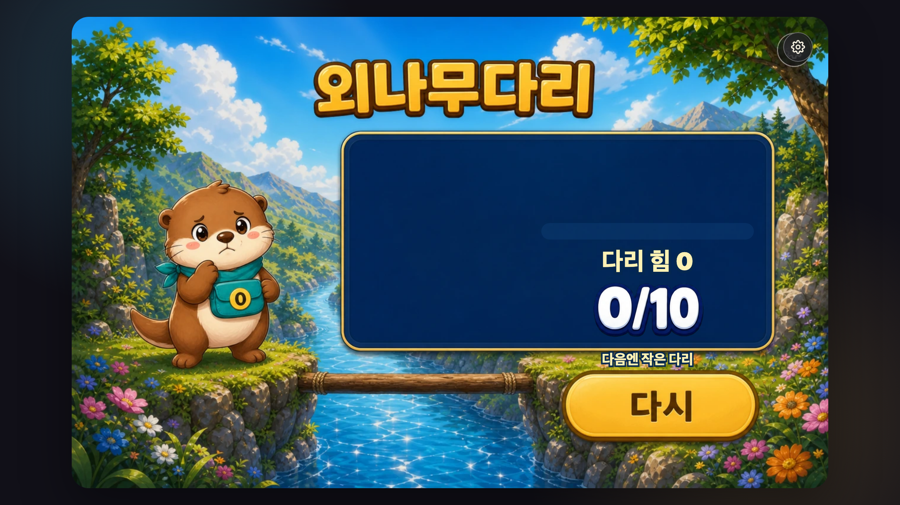

- 학생이 보는 것: 외나무다리 완성 장면과 결과판 안의 결과 이름·정답 수·다시 버튼을 봅니다.
- 판단하거나 누르는 것: 결과 요소가 한 결과판 안에 모이고 다리가 주인공으로 보이는지 확인합니다.
- 화면에서 확인되는 수학 관계: 같은 정답·보상 기준이 해당 다리 단계 장면으로 연결됩니다.
- 다음 상태로 넘어가는 이유: 이 화면은 결과 단계별 레이아웃 회귀 증거로 남습니다.

#### 결과 결속 · 무지개 다리 · `engine-flow-codex-in-app-08c-result-cohesion-rainbow.png`

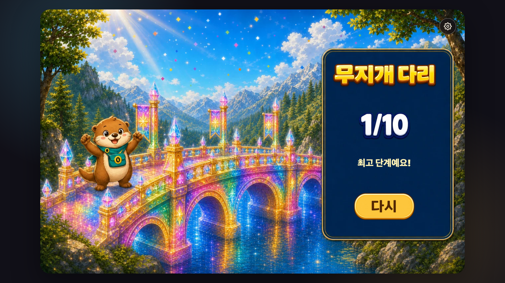

- 학생이 보는 것: 무지개 다리 완성 장면과 결과판 안의 결과 이름·정답 수·다시 버튼을 봅니다.
- 판단하거나 누르는 것: 결과 요소가 한 결과판 안에 모이고 다리가 주인공으로 보이는지 확인합니다.
- 화면에서 확인되는 수학 관계: 같은 정답·보상 기준이 해당 다리 단계 장면으로 연결됩니다.
- 다음 상태로 넘어가는 이유: 이 화면은 결과 단계별 레이아웃 회귀 증거로 남습니다.

#### 결과 결속 · 작은 다리 · `engine-flow-codex-in-app-08c-result-cohesion-small.png`

- 학생이 보는 것: 작은 다리 완성 장면과 결과판 안의 결과 이름·정답 수·다시 버튼을 봅니다.
- 판단하거나 누르는 것: 결과 요소가 한 결과판 안에 모이고 다리가 주인공으로 보이는지 확인합니다.
- 화면에서 확인되는 수학 관계: 같은 정답·보상 기준이 해당 다리 단계 장면으로 연결됩니다.
- 다음 상태로 넘어가는 이유: 이 화면은 결과 단계별 레이아웃 회귀 증거로 남습니다.

#### 결과판 포함 · 큰 다리 · `engine-flow-codex-in-app-08d-result-panel-big.png`

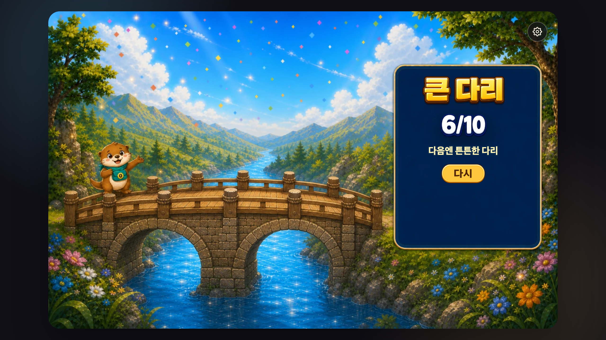

- 학생이 보는 것: 큰 다리 완성 장면과 결과판 안의 결과 이름·정답 수·다시 버튼을 봅니다.
- 판단하거나 누르는 것: 결과 요소가 한 결과판 안에 모이고 다리가 주인공으로 보이는지 확인합니다.
- 화면에서 확인되는 수학 관계: 같은 정답·보상 기준이 해당 다리 단계 장면으로 연결됩니다.
- 다음 상태로 넘어가는 이유: 이 화면은 결과 단계별 레이아웃 회귀 증거로 남습니다.

#### 결과판 포함 · 튼튼한 다리 · `engine-flow-codex-in-app-08d-result-panel-bridge.png`

- 학생이 보는 것: 튼튼한 다리 완성 장면과 결과판 안의 결과 이름·정답 수·다시 버튼을 봅니다.
- 판단하거나 누르는 것: 결과 요소가 한 결과판 안에 모이고 다리가 주인공으로 보이는지 확인합니다.
- 화면에서 확인되는 수학 관계: 같은 정답·보상 기준이 해당 다리 단계 장면으로 연결됩니다.
- 다음 상태로 넘어가는 이유: 이 화면은 결과 단계별 레이아웃 회귀 증거로 남습니다.

#### 결과판 포함 · 황금 다리 · `engine-flow-codex-in-app-08d-result-panel-grand.png`

- 학생이 보는 것: 황금 다리 완성 장면과 결과판 안의 결과 이름·정답 수·다시 버튼을 봅니다.
- 판단하거나 누르는 것: 결과 요소가 한 결과판 안에 모이고 다리가 주인공으로 보이는지 확인합니다.
- 화면에서 확인되는 수학 관계: 같은 정답·보상 기준이 해당 다리 단계 장면으로 연결됩니다.
- 다음 상태로 넘어가는 이유: 이 화면은 결과 단계별 레이아웃 회귀 증거로 남습니다.

#### 결과판 포함 · 외나무다리 · `engine-flow-codex-in-app-08d-result-panel-log.png`

- 학생이 보는 것: 외나무다리 완성 장면과 결과판 안의 결과 이름·정답 수·다시 버튼을 봅니다.
- 판단하거나 누르는 것: 결과 요소가 한 결과판 안에 모이고 다리가 주인공으로 보이는지 확인합니다.
- 화면에서 확인되는 수학 관계: 같은 정답·보상 기준이 해당 다리 단계 장면으로 연결됩니다.
- 다음 상태로 넘어가는 이유: 이 화면은 결과 단계별 레이아웃 회귀 증거로 남습니다.

#### 결과판 포함 · 무지개 다리 · `engine-flow-codex-in-app-08d-result-panel-rainbow.png`

- 학생이 보는 것: 무지개 다리 완성 장면과 결과판 안의 결과 이름·정답 수·다시 버튼을 봅니다.
- 판단하거나 누르는 것: 결과 요소가 한 결과판 안에 모이고 다리가 주인공으로 보이는지 확인합니다.
- 화면에서 확인되는 수학 관계: 같은 정답·보상 기준이 해당 다리 단계 장면으로 연결됩니다.
- 다음 상태로 넘어가는 이유: 이 화면은 결과 단계별 레이아웃 회귀 증거로 남습니다.

#### 결과판 포함 · 작은 다리 · `engine-flow-codex-in-app-08d-result-panel-small.png`

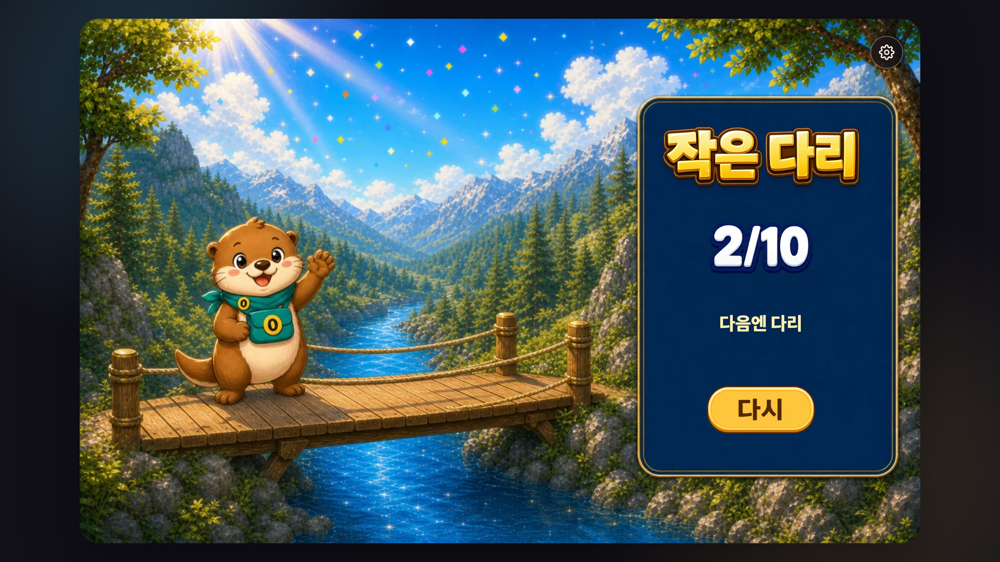

- 학생이 보는 것: 작은 다리 완성 장면과 결과판 안의 결과 이름·정답 수·다시 버튼을 봅니다.
- 판단하거나 누르는 것: 결과 요소가 한 결과판 안에 모이고 다리가 주인공으로 보이는지 확인합니다.
- 화면에서 확인되는 수학 관계: 같은 정답·보상 기준이 해당 다리 단계 장면으로 연결됩니다.
- 다음 상태로 넘어가는 이유: 이 화면은 결과 단계별 레이아웃 회귀 증거로 남습니다.

#### 다리 보상 우선 · 큰 다리 · `engine-flow-codex-in-app-08e-result-reward-dominance-big.png`

- 학생이 보는 것: 큰 다리 완성 장면과 결과판 안의 결과 이름·정답 수·다시 버튼을 봅니다.
- 판단하거나 누르는 것: 결과 요소가 한 결과판 안에 모이고 다리가 주인공으로 보이는지 확인합니다.
- 화면에서 확인되는 수학 관계: 같은 정답·보상 기준이 해당 다리 단계 장면으로 연결됩니다.
- 다음 상태로 넘어가는 이유: 이 화면은 결과 단계별 레이아웃 회귀 증거로 남습니다.

#### 다리 보상 우선 · 튼튼한 다리 · `engine-flow-codex-in-app-08e-result-reward-dominance-bridge.png`

- 학생이 보는 것: 튼튼한 다리 완성 장면과 결과판 안의 결과 이름·정답 수·다시 버튼을 봅니다.
- 판단하거나 누르는 것: 결과 요소가 한 결과판 안에 모이고 다리가 주인공으로 보이는지 확인합니다.
- 화면에서 확인되는 수학 관계: 같은 정답·보상 기준이 해당 다리 단계 장면으로 연결됩니다.
- 다음 상태로 넘어가는 이유: 이 화면은 결과 단계별 레이아웃 회귀 증거로 남습니다.

#### 다리 보상 우선 · 황금 다리 · `engine-flow-codex-in-app-08e-result-reward-dominance-grand.png`

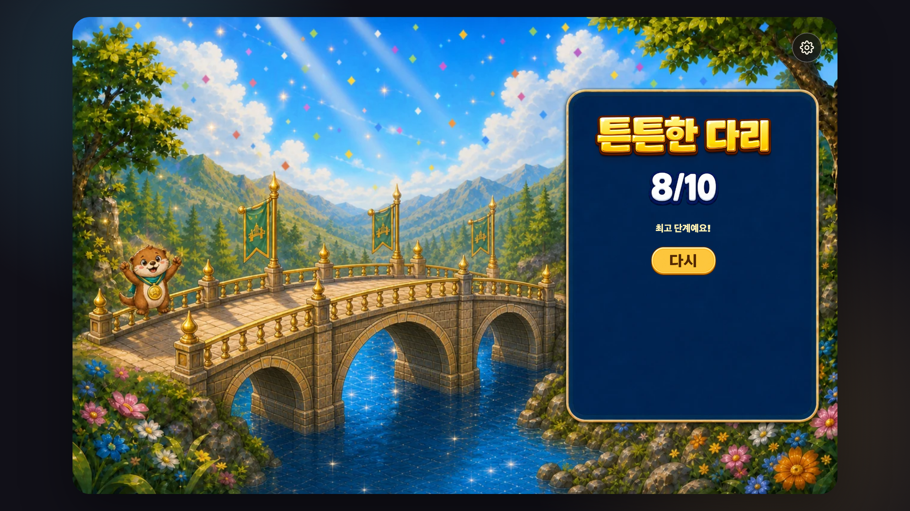

- 학생이 보는 것: 황금 다리 완성 장면과 결과판 안의 결과 이름·정답 수·다시 버튼을 봅니다.
- 판단하거나 누르는 것: 결과 요소가 한 결과판 안에 모이고 다리가 주인공으로 보이는지 확인합니다.
- 화면에서 확인되는 수학 관계: 같은 정답·보상 기준이 해당 다리 단계 장면으로 연결됩니다.
- 다음 상태로 넘어가는 이유: 이 화면은 결과 단계별 레이아웃 회귀 증거로 남습니다.

#### 다리 보상 우선 · 외나무다리 · `engine-flow-codex-in-app-08e-result-reward-dominance-log.png`

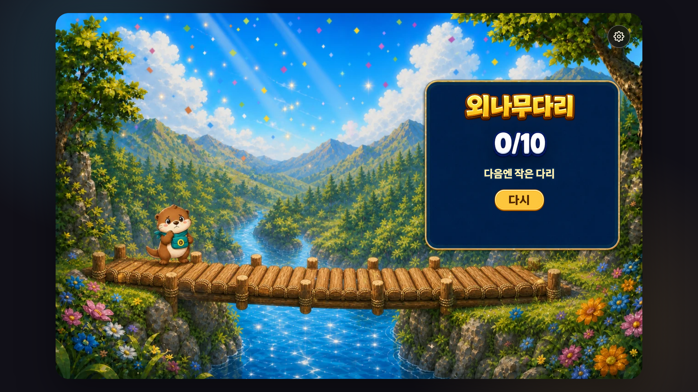

- 학생이 보는 것: 외나무다리 완성 장면과 결과판 안의 결과 이름·정답 수·다시 버튼을 봅니다.
- 판단하거나 누르는 것: 결과 요소가 한 결과판 안에 모이고 다리가 주인공으로 보이는지 확인합니다.
- 화면에서 확인되는 수학 관계: 같은 정답·보상 기준이 해당 다리 단계 장면으로 연결됩니다.
- 다음 상태로 넘어가는 이유: 이 화면은 결과 단계별 레이아웃 회귀 증거로 남습니다.

#### 다리 보상 우선 · 무지개 다리 · `engine-flow-codex-in-app-08e-result-reward-dominance-rainbow.png`

- 학생이 보는 것: 무지개 다리 완성 장면과 결과판 안의 결과 이름·정답 수·다시 버튼을 봅니다.
- 판단하거나 누르는 것: 결과 요소가 한 결과판 안에 모이고 다리가 주인공으로 보이는지 확인합니다.
- 화면에서 확인되는 수학 관계: 같은 정답·보상 기준이 해당 다리 단계 장면으로 연결됩니다.
- 다음 상태로 넘어가는 이유: 이 화면은 결과 단계별 레이아웃 회귀 증거로 남습니다.

#### 다리 보상 우선 · 작은 다리 · `engine-flow-codex-in-app-08e-result-reward-dominance-small.png`

- 학생이 보는 것: 작은 다리 완성 장면과 결과판 안의 결과 이름·정답 수·다시 버튼을 봅니다.
- 판단하거나 누르는 것: 결과 요소가 한 결과판 안에 모이고 다리가 주인공으로 보이는지 확인합니다.
- 화면에서 확인되는 수학 관계: 같은 정답·보상 기준이 해당 다리 단계 장면으로 연결됩니다.
- 다음 상태로 넘어가는 이유: 이 화면은 결과 단계별 레이아웃 회귀 증거로 남습니다.

### user-visibility-994x632 · 994×632 · DPR 1 · 37장

- 같은 실행으로 보존한 회귀 이름: 없음
- 캡처 범위: `full-flow`

#### 시작 화면 · `engine-flow-user-visibility-994x632-01-cover.png`

- 학생이 보는 것: 수달몬과 계곡 다리, 게임 제목, 한 줄 목표, 시작 버튼을 봅니다.
- 판단하거나 누르는 것: 게임을 시작할 준비가 되면 시작을 누릅니다.
- 화면에서 확인되는 수학 관계: 반지름 두 개를 이으면 지름이 된다는 배움 방향을 먼저 확인합니다.
- 다음 상태로 넘어가는 이유: 다리를 잇는 방법을 확인하는 설명 화면으로 이동합니다.

#### 설정 화면 · `engine-flow-user-visibility-994x632-02-settings.png`

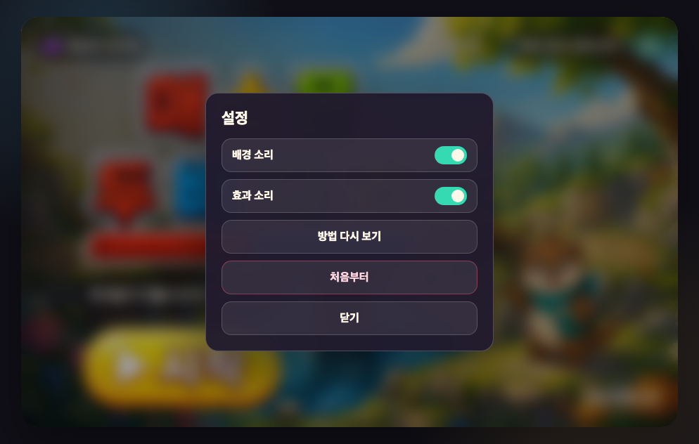

- 학생이 보는 것: 배경 소리·효과 소리와 방법 다시 보기, 처음부터, 닫기를 봅니다.
- 판단하거나 누르는 것: 필요한 소리나 이동 행동 하나를 고릅니다.
- 화면에서 확인되는 수학 관계: 수학 문제는 바꾸지 않고 게임 조작만 설정합니다.
- 다음 상태로 넘어가는 이유: 설정을 마치면 열기 전 화면으로 돌아갑니다.

#### 설명 1 · 풀이 방법 · `engine-flow-user-visibility-994x632-03-tutorial-1.png`

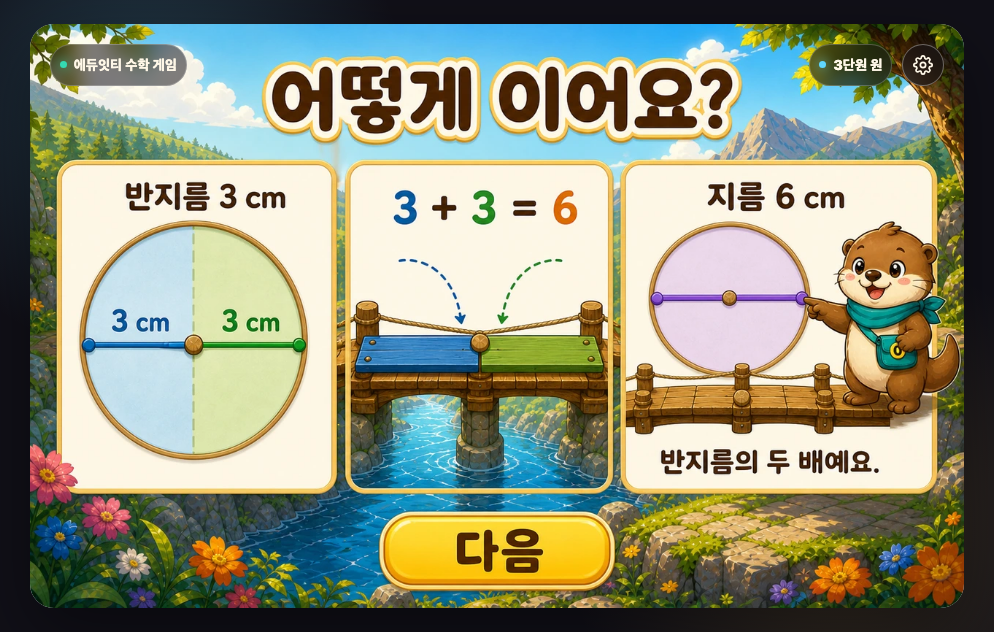

- 학생이 보는 것: 두 반지름을 이어 하나의 지름을 만드는 예를 봅니다.
- 판단하거나 누르는 것: 반지름 두 개가 지름 하나가 되는 모습을 확인하고 다음을 누릅니다.
- 화면에서 확인되는 수학 관계: 반지름 + 반지름 = 지름 관계를 확인합니다.
- 다음 상태로 넘어가는 이유: 문제 수와 다리 목표를 보는 설명 2로 이동합니다.

#### 설명 2 · 보상과 목표 · `engine-flow-user-visibility-994x632-04-tutorial-2.png`

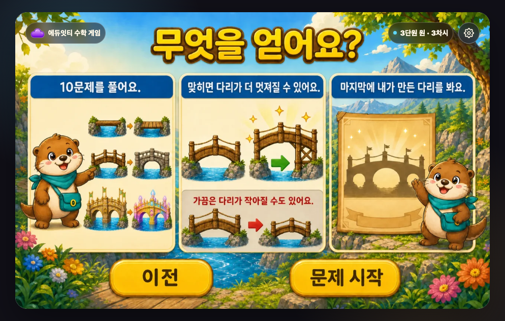

- 학생이 보는 것: 10문제와 여섯 다리 단계, 마지막 결과 흐름을 봅니다.
- 판단하거나 누르는 것: 게임 목표를 확인하고 문제 시작을 누릅니다.
- 화면에서 확인되는 수학 관계: 문제에서 고른 길이가 다리 단계 변화로 이어짐을 확인합니다.
- 다음 상태로 넘어가는 이유: 첫 번째 반지름·지름 문제로 이동합니다.

#### 문제 대기 · `engine-flow-user-visibility-994x632-05-play-step1.png`

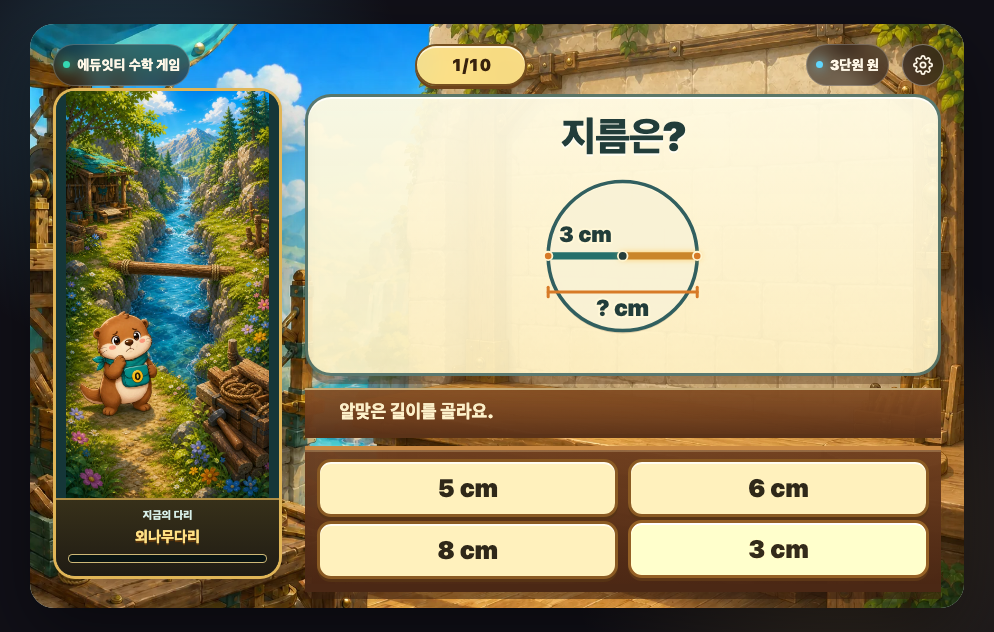

- 학생이 보는 것: 왼쪽 현재 다리와 오른쪽 원의 길이 관계, 네 선택지를 봅니다.
- 판단하거나 누르는 것: 주어진 지름 또는 반지름에 맞는 길이 하나를 고릅니다.
- 화면에서 확인되는 수학 관계: 지름은 반지름의 두 배이고 반지름은 지름의 반임을 판단합니다.
- 다음 상태로 넘어가는 이유: 고른 길이에 따라 오답 또는 정답 확인 상태로 이동합니다.

#### 정답 선택 효과 · `engine-flow-user-visibility-994x632-05c-correct-effect.png`

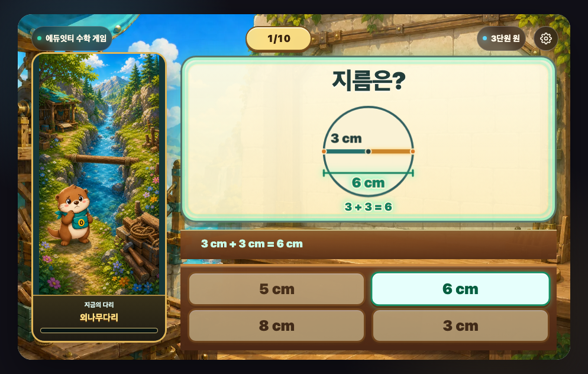

- 학생이 보는 것: 고른 정답이 원과 길이 그림에 들어가는 짧은 효과를 봅니다.
- 판단하거나 누르는 것: 별도 입력 없이 자신이 고른 길이가 적용되는 모습을 확인합니다.
- 화면에서 확인되는 수학 관계: 선택한 길이가 반지름·지름 관계를 정확히 완성합니다.
- 다음 상태로 넘어가는 이유: 완성식과 점수 보기 버튼이 있는 정답 확인으로 이어집니다.

#### 05n-next-problem-clean · `engine-flow-user-visibility-994x632-05n-next-problem-clean.png`

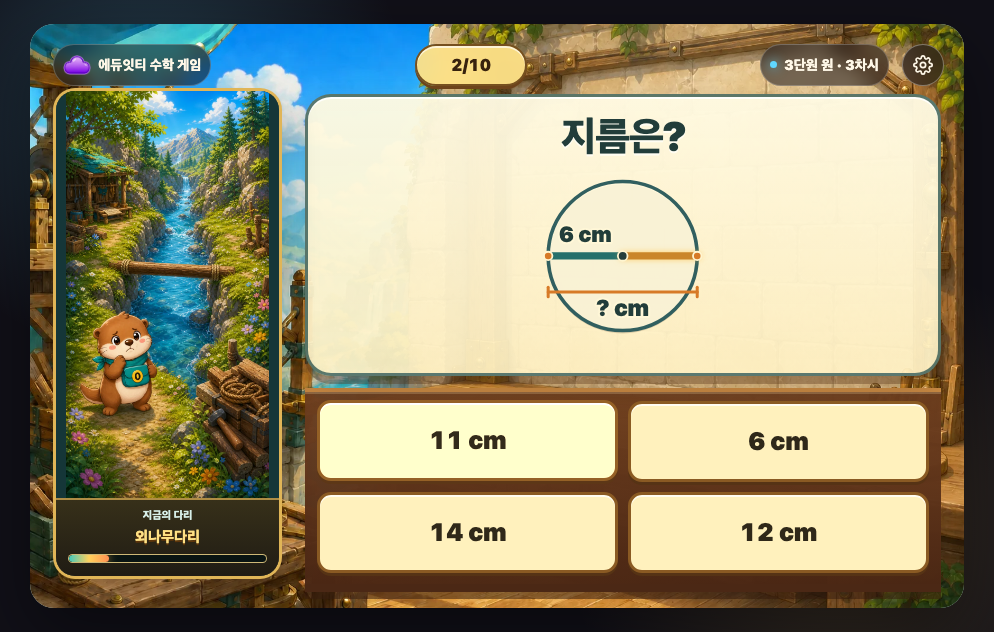

- 학생이 보는 것: 현재 게임 상태의 모든 보이는 요소를 확인합니다.
- 판단하거나 누르는 것: 이 상태에서 요구되는 한 가지 행동이나 자동 전환을 확인합니다.
- 화면에서 확인되는 수학 관계: 반지름과 지름의 관계가 화면 상태에 맞게 유지되는지 확인합니다.
- 다음 상태로 넘어가는 이유: 정해진 게임 흐름의 다음 상태로 이동합니다.

#### 1번 문제 유형 · 지름을 반으로 나누지 않은 오답 · `engine-flow-user-visibility-994x632-05m-p1-radius-not-halved.png`

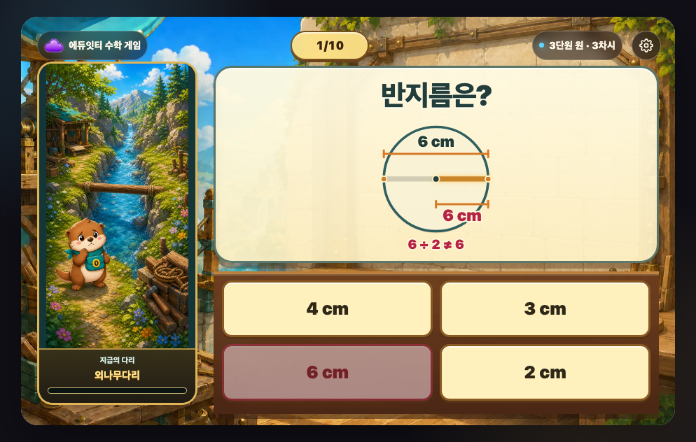

- 학생이 보는 것: 고른 길이와 목표 길이가 맞지 않는 원 그림과 오답 표시를 봅니다.
- 판단하거나 누르는 것: 길이가 짧은지, 긴지, 두 배나 반으로 계산하지 않았는지 확인합니다.
- 화면에서 확인되는 수학 관계: 반지름 두 개의 합 또는 지름의 반과 고른 길이가 같지 않음을 확인합니다.
- 다음 상태로 넘어가는 이유: 같은 문제에서 다른 길이를 다시 고릅니다.

#### 1번 문제 유형 · 반지름보다 긴 오답 · `engine-flow-user-visibility-994x632-05m-p1-radius-too-long.png`

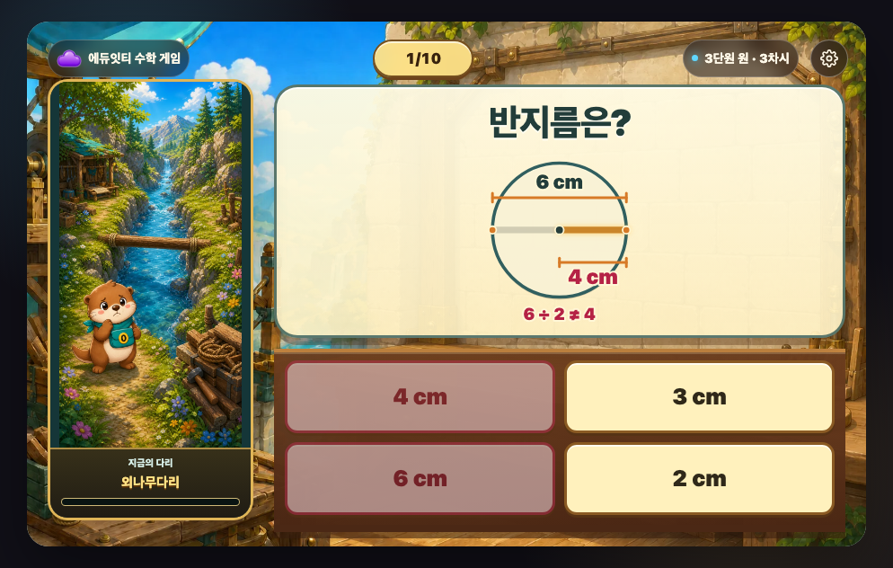

- 학생이 보는 것: 고른 길이와 목표 길이가 맞지 않는 원 그림과 오답 표시를 봅니다.
- 판단하거나 누르는 것: 길이가 짧은지, 긴지, 두 배나 반으로 계산하지 않았는지 확인합니다.
- 화면에서 확인되는 수학 관계: 반지름 두 개의 합 또는 지름의 반과 고른 길이가 같지 않음을 확인합니다.
- 다음 상태로 넘어가는 이유: 같은 문제에서 다른 길이를 다시 고릅니다.

#### 1번 문제 유형 · 반지름보다 짧은 오답 · `engine-flow-user-visibility-994x632-05m-p1-radius-too-short.png`

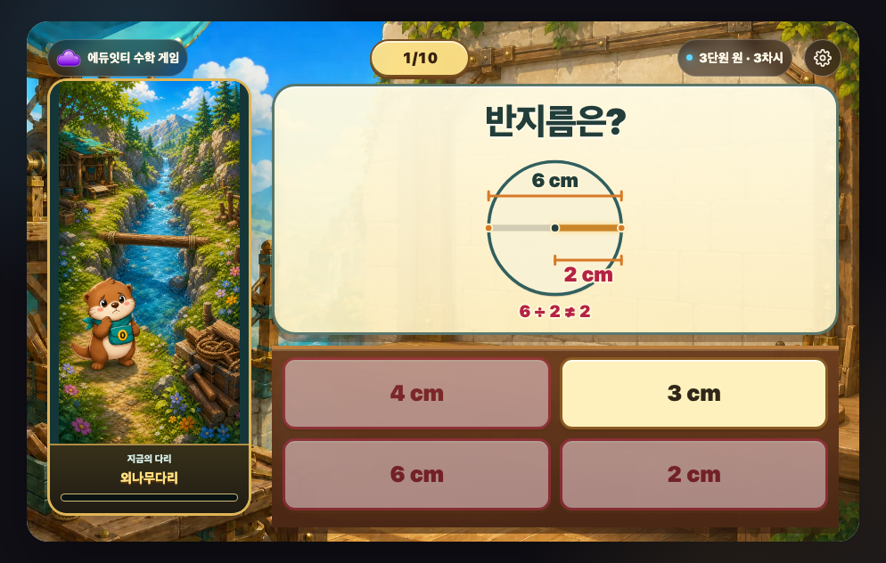

- 학생이 보는 것: 고른 길이와 목표 길이가 맞지 않는 원 그림과 오답 표시를 봅니다.
- 판단하거나 누르는 것: 길이가 짧은지, 긴지, 두 배나 반으로 계산하지 않았는지 확인합니다.
- 화면에서 확인되는 수학 관계: 반지름 두 개의 합 또는 지름의 반과 고른 길이가 같지 않음을 확인합니다.
- 다음 상태로 넘어가는 이유: 같은 문제에서 다른 길이를 다시 고릅니다.

#### 2번 문제 유형 · 반지름을 두 배 하지 않은 오답 · `engine-flow-user-visibility-994x632-05m-p2-diameter-not-doubled.png`

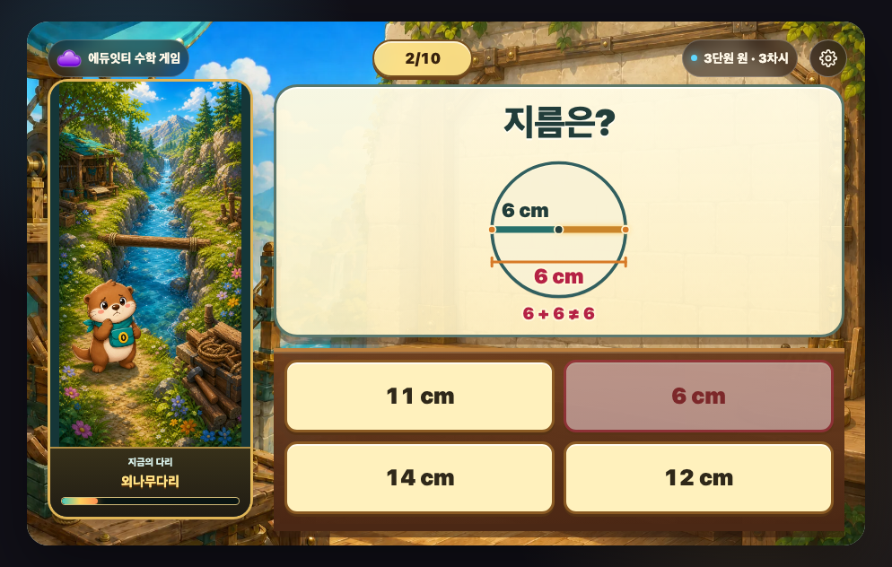

- 학생이 보는 것: 고른 길이와 목표 길이가 맞지 않는 원 그림과 오답 표시를 봅니다.
- 판단하거나 누르는 것: 길이가 짧은지, 긴지, 두 배나 반으로 계산하지 않았는지 확인합니다.
- 화면에서 확인되는 수학 관계: 반지름 두 개의 합 또는 지름의 반과 고른 길이가 같지 않음을 확인합니다.
- 다음 상태로 넘어가는 이유: 같은 문제에서 다른 길이를 다시 고릅니다.

#### 2번 문제 유형 · 지름보다 1 cm 짧은 오답 · `engine-flow-user-visibility-994x632-05m-p2-diameter-one-short.png`

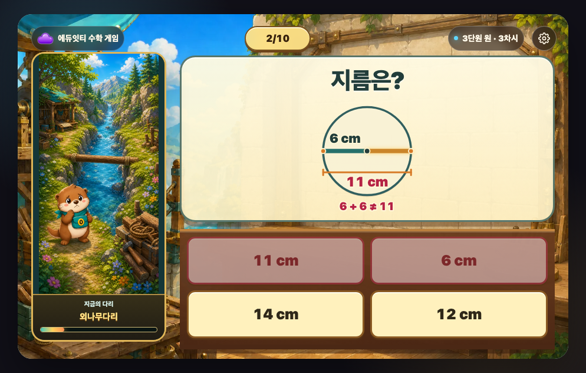

- 학생이 보는 것: 고른 길이와 목표 길이가 맞지 않는 원 그림과 오답 표시를 봅니다.
- 판단하거나 누르는 것: 길이가 짧은지, 긴지, 두 배나 반으로 계산하지 않았는지 확인합니다.
- 화면에서 확인되는 수학 관계: 반지름 두 개의 합 또는 지름의 반과 고른 길이가 같지 않음을 확인합니다.
- 다음 상태로 넘어가는 이유: 같은 문제에서 다른 길이를 다시 고릅니다.

#### 2번 문제 유형 · 지름보다 긴 오답 · `engine-flow-user-visibility-994x632-05m-p2-diameter-too-long.png`

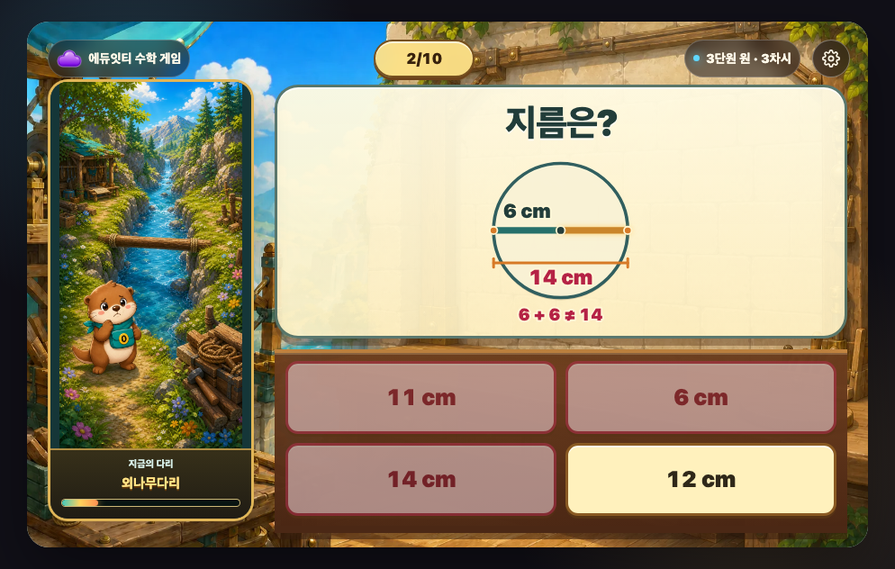

- 학생이 보는 것: 고른 길이와 목표 길이가 맞지 않는 원 그림과 오답 표시를 봅니다.
- 판단하거나 누르는 것: 길이가 짧은지, 긴지, 두 배나 반으로 계산하지 않았는지 확인합니다.
- 화면에서 확인되는 수학 관계: 반지름 두 개의 합 또는 지름의 반과 고른 길이가 같지 않음을 확인합니다.
- 다음 상태로 넘어가는 이유: 같은 문제에서 다른 길이를 다시 고릅니다.

#### 대표 오답 · `engine-flow-user-visibility-994x632-05b-play-wrong.png`

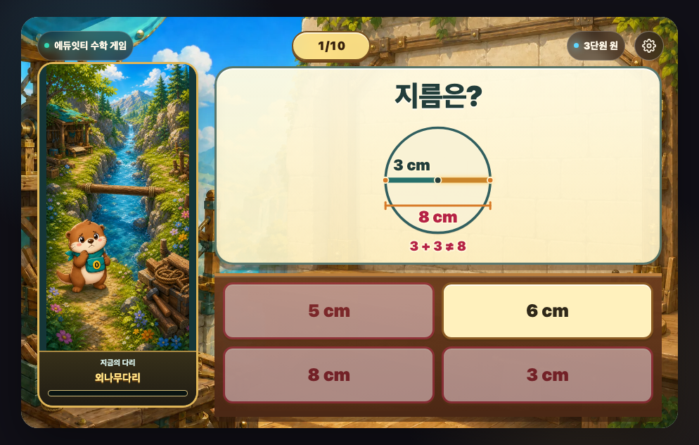

- 학생이 보는 것: 고른 길이와 정답 길이의 차이, 완성되지 않은 관계를 봅니다.
- 판단하거나 누르는 것: 오답 이유를 그림으로 확인하고 다른 선택지를 고릅니다.
- 화면에서 확인되는 수학 관계: 두 반지름의 합이나 지름의 반과 고른 길이가 같지 않음을 봅니다.
- 다음 상태로 넘어가는 이유: 관계가 맞을 때까지 같은 문제에서 다시 판단합니다.

#### 정답 확인 · `engine-flow-user-visibility-994x632-06-confirm.png`

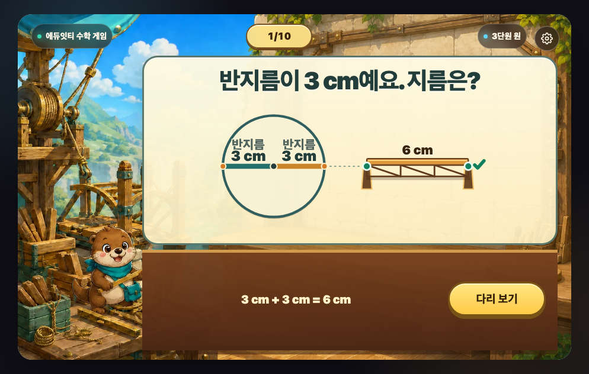

- 학생이 보는 것: 원 안에 들어간 정답 길이와 완성식, 점수 보기 버튼을 봅니다.
- 판단하거나 누르는 것: 완성된 관계를 읽은 뒤 점수 보기를 누릅니다.
- 화면에서 확인되는 수학 관계: 반지름 + 반지름 = 지름 또는 지름 ÷ 2 = 반지름을 확인합니다.
- 다음 상태로 넘어가는 이유: 수학 관계를 확인한 뒤 닫힌 보상으로 이동합니다.

#### 닫힌 보상 · `engine-flow-user-visibility-994x632-07-reward-closed.png`

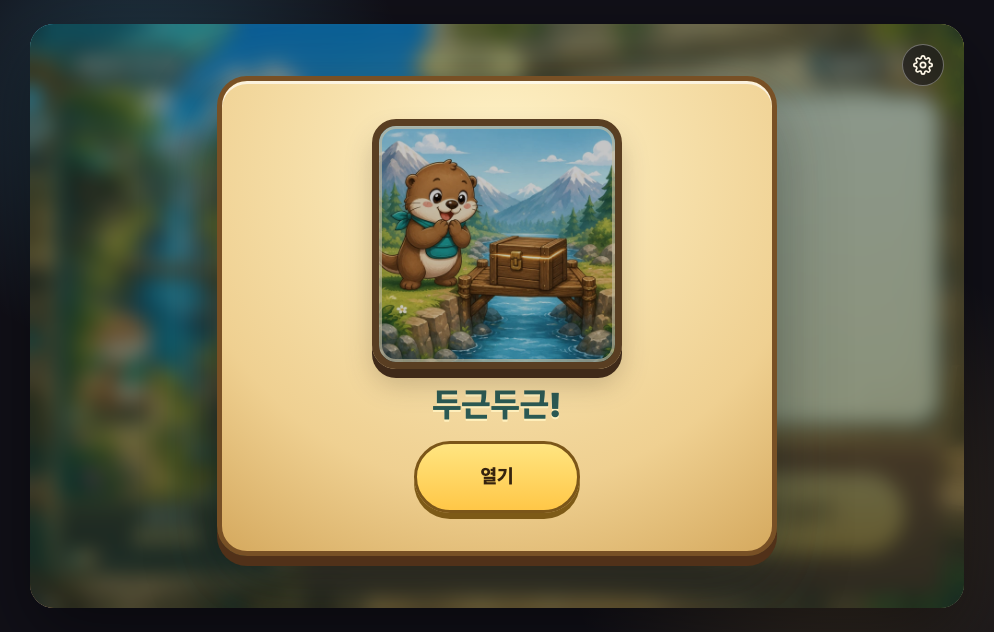

- 학생이 보는 것: 결과가 아직 드러나지 않은 보상 그림과 열기 버튼을 봅니다.
- 판단하거나 누르는 것: 이번 점수를 확인하기 위해 열기를 누릅니다.
- 화면에서 확인되는 수학 관계: 뒤 문제 화면에는 방금 완성한 반지름·지름 관계가 그대로 남습니다.
- 다음 상태로 넘어가는 이유: 학생이 직접 연 뒤에만 이번 보상 사건이 공개됩니다.

#### 열린 보상 · `engine-flow-user-visibility-994x632-07b-reward-open.png`

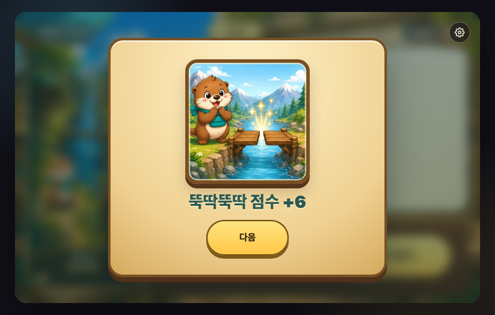

- 학생이 보는 것: 보상 사건 그림과 이번 점수 변화, 다음 버튼을 봅니다.
- 판단하거나 누르는 것: 이번 변화를 확인하고 다음을 누릅니다.
- 화면에서 확인되는 수학 관계: 정답 계산과 무작위 점수가 서로 분리되어 있음을 확인합니다.
- 다음 상태로 넘어가는 이유: 모달을 먼저 닫고 다리 세계의 실제 변화를 보여 줍니다.

#### 모달 종료 뒤 다리 변화 · `engine-flow-user-visibility-994x632-07c-reward-impact.png`

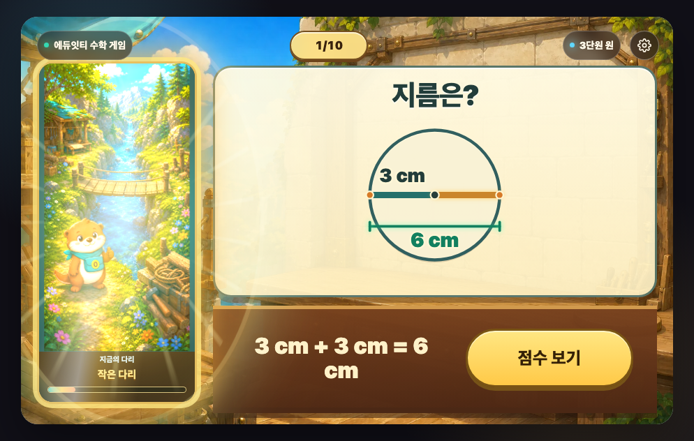

- 학생이 보는 것: 모달이 닫힌 뒤 왼쪽 다리가 바뀌고 Stage에 번지는 빛 효과를 봅니다.
- 판단하거나 누르는 것: 별도 입력 없이 이번 보상이 다리 단계를 바꾸는 모습을 확인합니다.
- 화면에서 확인되는 수학 관계: 한 문제의 보상이 현재 다리 단계에 정확히 한 번 반영됩니다.
- 다음 상태로 넘어가는 이유: 효과를 충분히 본 뒤 다음 문제 또는 결과로 이동합니다.

#### 실제 결과 · `engine-flow-user-visibility-994x632-08-result.png`

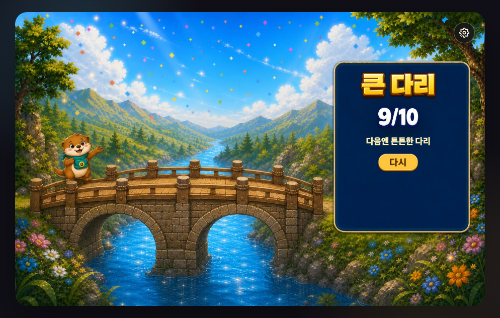

- 학생이 보는 것: 완성한 다리와 수달몬, 결과 이름, 정답 수, 다음 목표, 다시 버튼을 봅니다.
- 판단하거나 누르는 것: 현재 결과와 다음 목표를 비교하고 다시 도전할지 결정합니다.
- 화면에서 확인되는 수학 관계: 10문제의 정답 수와 누적 보상이 하나의 다리 단계로 정리됩니다.
- 다음 상태로 넘어가는 이유: 다시를 누르면 새 문제 순서와 새 보상 흐름으로 시작합니다.

#### 결과 결속 · 큰 다리 · `engine-flow-user-visibility-994x632-08c-result-cohesion-big.png`

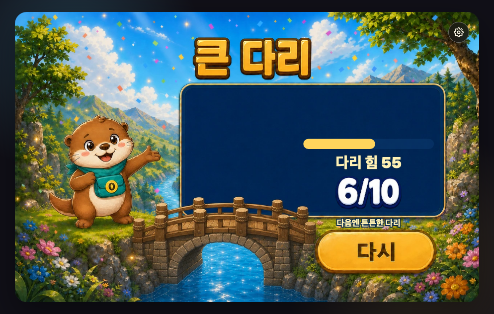

- 학생이 보는 것: 큰 다리 완성 장면과 결과판 안의 결과 이름·정답 수·다시 버튼을 봅니다.
- 판단하거나 누르는 것: 결과 요소가 한 결과판 안에 모이고 다리가 주인공으로 보이는지 확인합니다.
- 화면에서 확인되는 수학 관계: 같은 정답·보상 기준이 해당 다리 단계 장면으로 연결됩니다.
- 다음 상태로 넘어가는 이유: 이 화면은 결과 단계별 레이아웃 회귀 증거로 남습니다.

#### 결과 결속 · 튼튼한 다리 · `engine-flow-user-visibility-994x632-08c-result-cohesion-bridge.png`

- 학생이 보는 것: 튼튼한 다리 완성 장면과 결과판 안의 결과 이름·정답 수·다시 버튼을 봅니다.
- 판단하거나 누르는 것: 결과 요소가 한 결과판 안에 모이고 다리가 주인공으로 보이는지 확인합니다.
- 화면에서 확인되는 수학 관계: 같은 정답·보상 기준이 해당 다리 단계 장면으로 연결됩니다.
- 다음 상태로 넘어가는 이유: 이 화면은 결과 단계별 레이아웃 회귀 증거로 남습니다.

#### 결과 결속 · 황금 다리 · `engine-flow-user-visibility-994x632-08c-result-cohesion-grand.png`

- 학생이 보는 것: 황금 다리 완성 장면과 결과판 안의 결과 이름·정답 수·다시 버튼을 봅니다.
- 판단하거나 누르는 것: 결과 요소가 한 결과판 안에 모이고 다리가 주인공으로 보이는지 확인합니다.
- 화면에서 확인되는 수학 관계: 같은 정답·보상 기준이 해당 다리 단계 장면으로 연결됩니다.
- 다음 상태로 넘어가는 이유: 이 화면은 결과 단계별 레이아웃 회귀 증거로 남습니다.

#### 결과 결속 · 외나무다리 · `engine-flow-user-visibility-994x632-08c-result-cohesion-log.png`

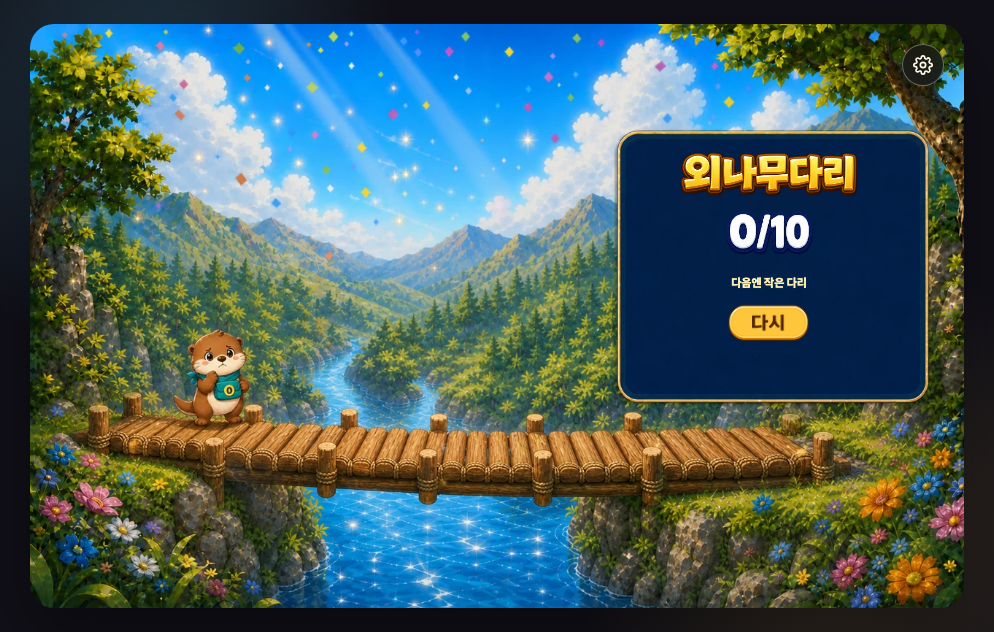

- 학생이 보는 것: 외나무다리 완성 장면과 결과판 안의 결과 이름·정답 수·다시 버튼을 봅니다.
- 판단하거나 누르는 것: 결과 요소가 한 결과판 안에 모이고 다리가 주인공으로 보이는지 확인합니다.
- 화면에서 확인되는 수학 관계: 같은 정답·보상 기준이 해당 다리 단계 장면으로 연결됩니다.
- 다음 상태로 넘어가는 이유: 이 화면은 결과 단계별 레이아웃 회귀 증거로 남습니다.

#### 결과 결속 · 무지개 다리 · `engine-flow-user-visibility-994x632-08c-result-cohesion-rainbow.png`

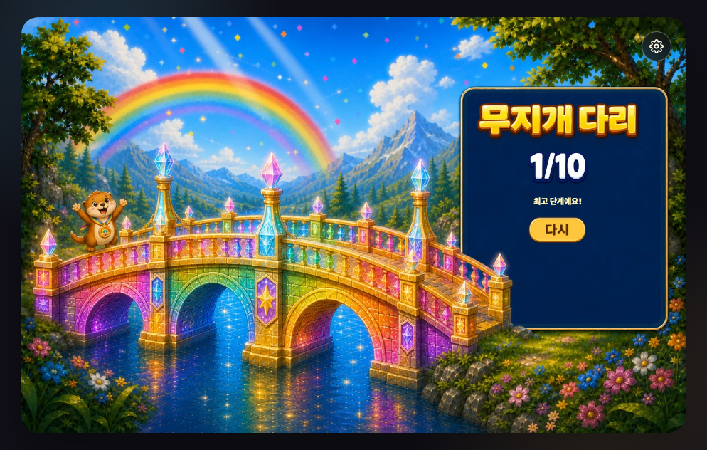

- 학생이 보는 것: 무지개 다리 완성 장면과 결과판 안의 결과 이름·정답 수·다시 버튼을 봅니다.
- 판단하거나 누르는 것: 결과 요소가 한 결과판 안에 모이고 다리가 주인공으로 보이는지 확인합니다.
- 화면에서 확인되는 수학 관계: 같은 정답·보상 기준이 해당 다리 단계 장면으로 연결됩니다.
- 다음 상태로 넘어가는 이유: 이 화면은 결과 단계별 레이아웃 회귀 증거로 남습니다.

#### 결과 결속 · 작은 다리 · `engine-flow-user-visibility-994x632-08c-result-cohesion-small.png`

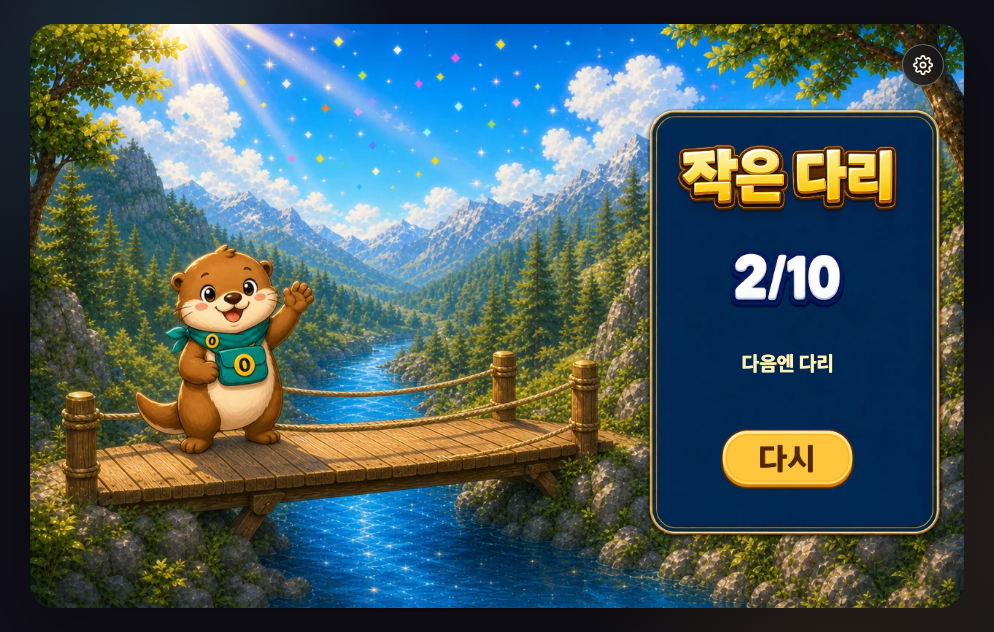

- 학생이 보는 것: 작은 다리 완성 장면과 결과판 안의 결과 이름·정답 수·다시 버튼을 봅니다.
- 판단하거나 누르는 것: 결과 요소가 한 결과판 안에 모이고 다리가 주인공으로 보이는지 확인합니다.
- 화면에서 확인되는 수학 관계: 같은 정답·보상 기준이 해당 다리 단계 장면으로 연결됩니다.
- 다음 상태로 넘어가는 이유: 이 화면은 결과 단계별 레이아웃 회귀 증거로 남습니다.

#### 결과판 포함 · 큰 다리 · `engine-flow-user-visibility-994x632-08d-result-panel-big.png`

- 학생이 보는 것: 큰 다리 완성 장면과 결과판 안의 결과 이름·정답 수·다시 버튼을 봅니다.
- 판단하거나 누르는 것: 결과 요소가 한 결과판 안에 모이고 다리가 주인공으로 보이는지 확인합니다.
- 화면에서 확인되는 수학 관계: 같은 정답·보상 기준이 해당 다리 단계 장면으로 연결됩니다.
- 다음 상태로 넘어가는 이유: 이 화면은 결과 단계별 레이아웃 회귀 증거로 남습니다.

#### 결과판 포함 · 튼튼한 다리 · `engine-flow-user-visibility-994x632-08d-result-panel-bridge.png`

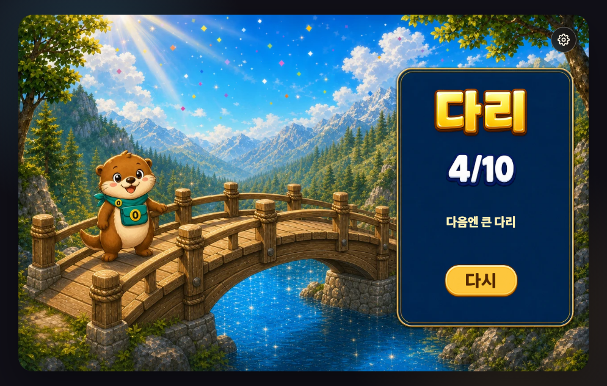

- 학생이 보는 것: 튼튼한 다리 완성 장면과 결과판 안의 결과 이름·정답 수·다시 버튼을 봅니다.
- 판단하거나 누르는 것: 결과 요소가 한 결과판 안에 모이고 다리가 주인공으로 보이는지 확인합니다.
- 화면에서 확인되는 수학 관계: 같은 정답·보상 기준이 해당 다리 단계 장면으로 연결됩니다.
- 다음 상태로 넘어가는 이유: 이 화면은 결과 단계별 레이아웃 회귀 증거로 남습니다.

#### 결과판 포함 · 황금 다리 · `engine-flow-user-visibility-994x632-08d-result-panel-grand.png`

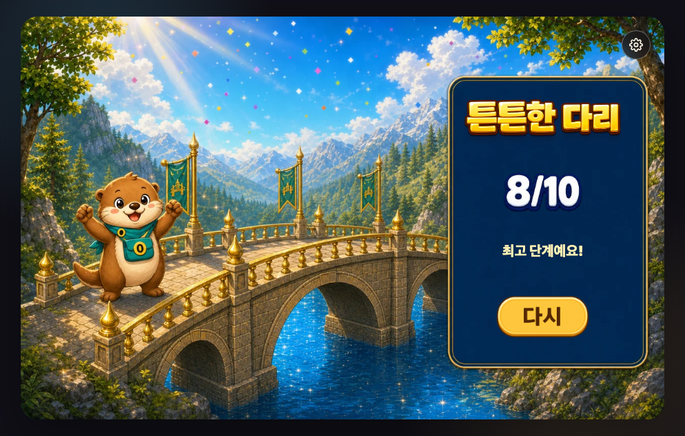

- 학생이 보는 것: 황금 다리 완성 장면과 결과판 안의 결과 이름·정답 수·다시 버튼을 봅니다.
- 판단하거나 누르는 것: 결과 요소가 한 결과판 안에 모이고 다리가 주인공으로 보이는지 확인합니다.
- 화면에서 확인되는 수학 관계: 같은 정답·보상 기준이 해당 다리 단계 장면으로 연결됩니다.
- 다음 상태로 넘어가는 이유: 이 화면은 결과 단계별 레이아웃 회귀 증거로 남습니다.

#### 결과판 포함 · 외나무다리 · `engine-flow-user-visibility-994x632-08d-result-panel-log.png`

- 학생이 보는 것: 외나무다리 완성 장면과 결과판 안의 결과 이름·정답 수·다시 버튼을 봅니다.
- 판단하거나 누르는 것: 결과 요소가 한 결과판 안에 모이고 다리가 주인공으로 보이는지 확인합니다.
- 화면에서 확인되는 수학 관계: 같은 정답·보상 기준이 해당 다리 단계 장면으로 연결됩니다.
- 다음 상태로 넘어가는 이유: 이 화면은 결과 단계별 레이아웃 회귀 증거로 남습니다.

#### 결과판 포함 · 무지개 다리 · `engine-flow-user-visibility-994x632-08d-result-panel-rainbow.png`

- 학생이 보는 것: 무지개 다리 완성 장면과 결과판 안의 결과 이름·정답 수·다시 버튼을 봅니다.
- 판단하거나 누르는 것: 결과 요소가 한 결과판 안에 모이고 다리가 주인공으로 보이는지 확인합니다.
- 화면에서 확인되는 수학 관계: 같은 정답·보상 기준이 해당 다리 단계 장면으로 연결됩니다.
- 다음 상태로 넘어가는 이유: 이 화면은 결과 단계별 레이아웃 회귀 증거로 남습니다.

#### 결과판 포함 · 작은 다리 · `engine-flow-user-visibility-994x632-08d-result-panel-small.png`

- 학생이 보는 것: 작은 다리 완성 장면과 결과판 안의 결과 이름·정답 수·다시 버튼을 봅니다.
- 판단하거나 누르는 것: 결과 요소가 한 결과판 안에 모이고 다리가 주인공으로 보이는지 확인합니다.
- 화면에서 확인되는 수학 관계: 같은 정답·보상 기준이 해당 다리 단계 장면으로 연결됩니다.
- 다음 상태로 넘어가는 이유: 이 화면은 결과 단계별 레이아웃 회귀 증거로 남습니다.

#### 다리 보상 우선 · 큰 다리 · `engine-flow-user-visibility-994x632-08e-result-reward-dominance-big.png`

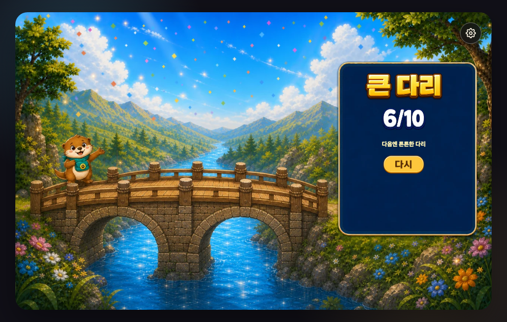

- 학생이 보는 것: 큰 다리 완성 장면과 결과판 안의 결과 이름·정답 수·다시 버튼을 봅니다.
- 판단하거나 누르는 것: 결과 요소가 한 결과판 안에 모이고 다리가 주인공으로 보이는지 확인합니다.
- 화면에서 확인되는 수학 관계: 같은 정답·보상 기준이 해당 다리 단계 장면으로 연결됩니다.
- 다음 상태로 넘어가는 이유: 이 화면은 결과 단계별 레이아웃 회귀 증거로 남습니다.

#### 다리 보상 우선 · 튼튼한 다리 · `engine-flow-user-visibility-994x632-08e-result-reward-dominance-bridge.png`

- 학생이 보는 것: 튼튼한 다리 완성 장면과 결과판 안의 결과 이름·정답 수·다시 버튼을 봅니다.
- 판단하거나 누르는 것: 결과 요소가 한 결과판 안에 모이고 다리가 주인공으로 보이는지 확인합니다.
- 화면에서 확인되는 수학 관계: 같은 정답·보상 기준이 해당 다리 단계 장면으로 연결됩니다.
- 다음 상태로 넘어가는 이유: 이 화면은 결과 단계별 레이아웃 회귀 증거로 남습니다.

#### 다리 보상 우선 · 황금 다리 · `engine-flow-user-visibility-994x632-08e-result-reward-dominance-grand.png`

- 학생이 보는 것: 황금 다리 완성 장면과 결과판 안의 결과 이름·정답 수·다시 버튼을 봅니다.
- 판단하거나 누르는 것: 결과 요소가 한 결과판 안에 모이고 다리가 주인공으로 보이는지 확인합니다.
- 화면에서 확인되는 수학 관계: 같은 정답·보상 기준이 해당 다리 단계 장면으로 연결됩니다.
- 다음 상태로 넘어가는 이유: 이 화면은 결과 단계별 레이아웃 회귀 증거로 남습니다.

#### 다리 보상 우선 · 외나무다리 · `engine-flow-user-visibility-994x632-08e-result-reward-dominance-log.png`

- 학생이 보는 것: 외나무다리 완성 장면과 결과판 안의 결과 이름·정답 수·다시 버튼을 봅니다.
- 판단하거나 누르는 것: 결과 요소가 한 결과판 안에 모이고 다리가 주인공으로 보이는지 확인합니다.
- 화면에서 확인되는 수학 관계: 같은 정답·보상 기준이 해당 다리 단계 장면으로 연결됩니다.
- 다음 상태로 넘어가는 이유: 이 화면은 결과 단계별 레이아웃 회귀 증거로 남습니다.

#### 다리 보상 우선 · 무지개 다리 · `engine-flow-user-visibility-994x632-08e-result-reward-dominance-rainbow.png`

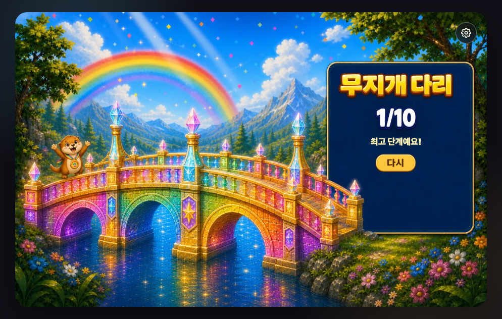

- 학생이 보는 것: 무지개 다리 완성 장면과 결과판 안의 결과 이름·정답 수·다시 버튼을 봅니다.
- 판단하거나 누르는 것: 결과 요소가 한 결과판 안에 모이고 다리가 주인공으로 보이는지 확인합니다.
- 화면에서 확인되는 수학 관계: 같은 정답·보상 기준이 해당 다리 단계 장면으로 연결됩니다.
- 다음 상태로 넘어가는 이유: 이 화면은 결과 단계별 레이아웃 회귀 증거로 남습니다.

#### 다리 보상 우선 · 작은 다리 · `engine-flow-user-visibility-994x632-08e-result-reward-dominance-small.png`

- 학생이 보는 것: 작은 다리 완성 장면과 결과판 안의 결과 이름·정답 수·다시 버튼을 봅니다.
- 판단하거나 누르는 것: 결과 요소가 한 결과판 안에 모이고 다리가 주인공으로 보이는지 확인합니다.
- 화면에서 확인되는 수학 관계: 같은 정답·보상 기준이 해당 다리 단계 장면으로 연결됩니다.
- 다음 상태로 넘어가는 이유: 이 화면은 결과 단계별 레이아웃 회귀 증거로 남습니다.

### user-reported-missing-left-progress-1082x987-dpr2 · 1082×987 · DPR 2 · 3장

- 같은 실행으로 보존한 회귀 이름: 없음
- 캡처 범위: `targeted`

#### 정답 확인 · `engine-flow-user-reported-missing-left-progress-1082x987-dpr2-06-confirm.png`

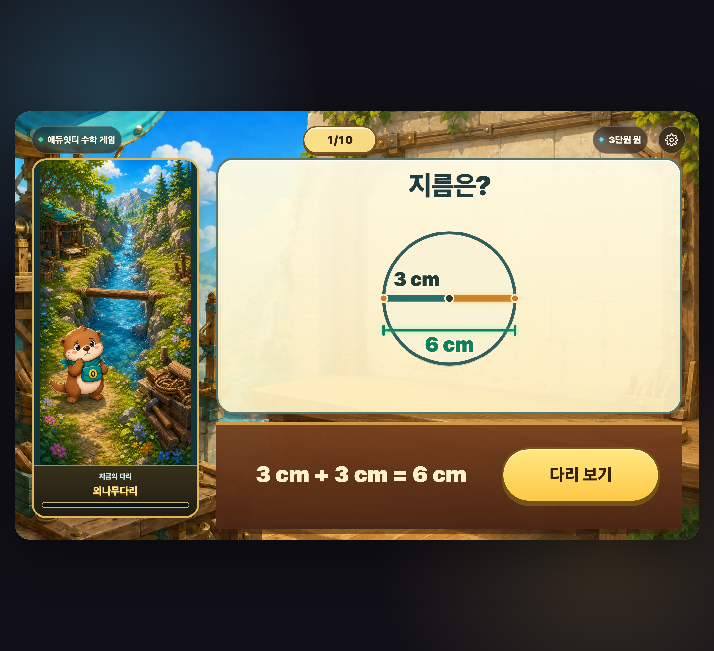

- 학생이 보는 것: 원 안에 들어간 정답 길이와 완성식, 점수 보기 버튼을 봅니다.
- 판단하거나 누르는 것: 완성된 관계를 읽은 뒤 점수 보기를 누릅니다.
- 화면에서 확인되는 수학 관계: 반지름 + 반지름 = 지름 또는 지름 ÷ 2 = 반지름을 확인합니다.
- 다음 상태로 넘어가는 이유: 수학 관계를 확인한 뒤 닫힌 보상으로 이동합니다.

#### 닫힌 보상 · `engine-flow-user-reported-missing-left-progress-1082x987-dpr2-07-reward-closed.png`

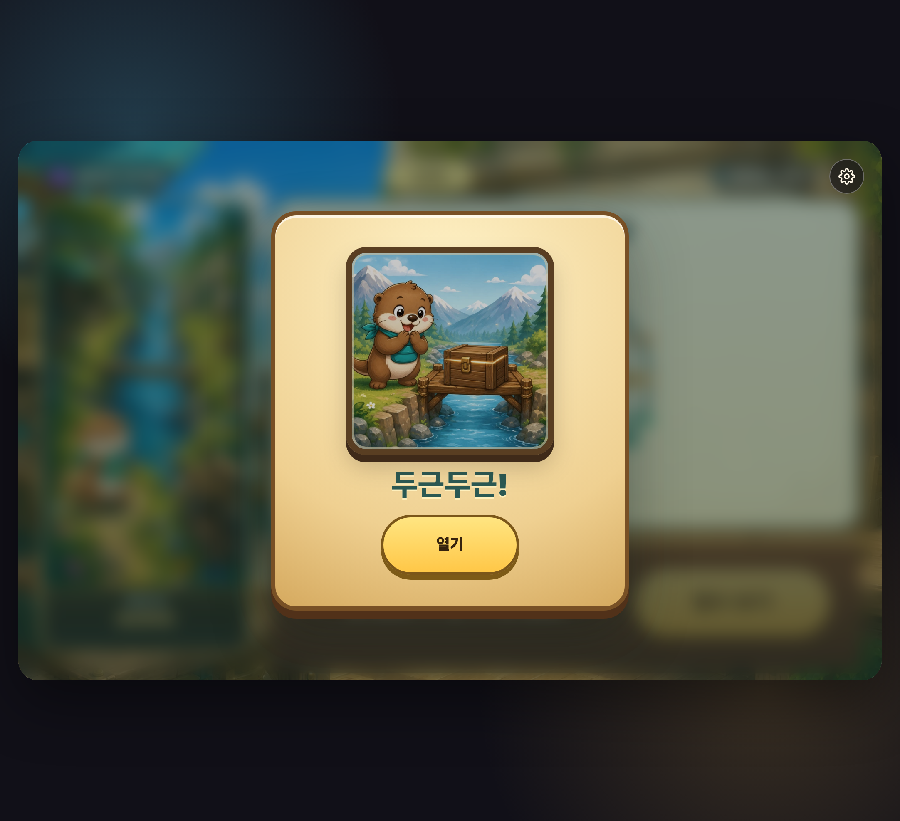

- 학생이 보는 것: 결과가 아직 드러나지 않은 보상 그림과 열기 버튼을 봅니다.
- 판단하거나 누르는 것: 이번 점수를 확인하기 위해 열기를 누릅니다.
- 화면에서 확인되는 수학 관계: 뒤 문제 화면에는 방금 완성한 반지름·지름 관계가 그대로 남습니다.
- 다음 상태로 넘어가는 이유: 학생이 직접 연 뒤에만 이번 보상 사건이 공개됩니다.

#### 열린 보상 · `engine-flow-user-reported-missing-left-progress-1082x987-dpr2-07b-reward-open.png`

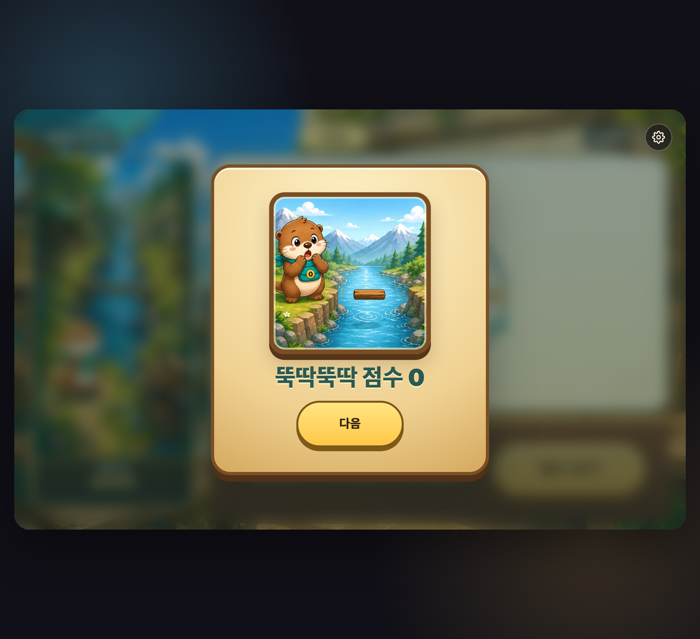

- 학생이 보는 것: 보상 사건 그림과 이번 점수 변화, 다음 버튼을 봅니다.
- 판단하거나 누르는 것: 이번 변화를 확인하고 다음을 누릅니다.
- 화면에서 확인되는 수학 관계: 정답 계산과 무작위 점수가 서로 분리되어 있음을 확인합니다.
- 다음 상태로 넘어가는 이유: 모달을 먼저 닫고 다리 세계의 실제 변화를 보여 줍니다.

<!-- REPORT-EVIDENCE-ALL:END -->
