# 매스몬 원 무늬 디자이너 제작 보고 (3-2-3-4) ★ 단원 정점

> 2026-08-04 현재 구현은 아래의 **컴퍼스로 원 그리기** 버전입니다. 뒤의 원 무늬 선택 기록은 이전 버전의 제작 이력으로만 남깁니다.

## 2026-08-04 컴퍼스로 원 그리기 전환

- 네 보기에서 원 무늬를 고르던 문제를 없앴습니다.
- 문제에 반지름 또는 지름이 주어지면, 학생이 자 위의 컴퍼스 연필 다리를 직접 끌어 반지름을 맞춥니다.
- `원 그리기`를 누르면 컴퍼스가 자동으로 한 바퀴 돌며 선택한 크기의 원을 그립니다.
- 오답일 때는 그린 원과 `짧아요` 또는 `길어요` 피드백을 함께 보여 주고, 같은 화면에서 다시 조절할 수 있습니다.
- 정답일 때는 완성된 원과 `반지름 N cm인 원을 그렸어요.`를 충분히 보여 준 뒤 기존 보상 흐름으로 넘어갑니다.
- 보상 확률·증감값·결과 기준·보상 이미지·결과 화면은 바꾸지 않았습니다.

## 수학 설계와 성취기준

- `[4수03-06]` 원의 중심, 반지름, 지름을 알고 그 관계를 이해하는 활동을 직접 조작으로 다룹니다.
- `[4수03-07]` 컴퍼스를 이용하여 여러 크기의 원을 그리는 활동을 게임의 핵심 입력으로 다룹니다.
- 10문제는 반지름 조건 5문제와 지름 조건 5문제로 구성합니다.
- 반지름 문제의 정답은 `2~4 cm`, 지름 문제는 `4 cm`, `6 cm`, `8 cm`이며 지름의 반을 반지름으로 맞추게 합니다.
- 오개념은 `RADIUS_TOO_SHORT`, `RADIUS_TOO_LONG`, `DIAMETER_AS_RADIUS` 세 가지를 따로 확인합니다.

## 1 cm 간격 확대

- 자의 논리 단위는 `1 cm = 50px`로 넓혔습니다.
- 조절 범위는 `1~4 cm`로 제한해 컴퍼스 다리가 충분히 벌어지면서도 가장 큰 원이 작업판 안에 온전히 들어오게 했습니다.
- 실제 브라우저 드래그에서 인접한 두 눈금 사이 간격은 `50px`로 측정됐습니다.
- 반지름 `2 cm` 정답 원은 작업판에서 `200×200px`로 그려져 컴퍼스와 원의 크기를 쉽게 구별할 수 있습니다.
- 눈금에 맞춰 놓으면 정수 단위로 붙고, 키보드 방향키로도 `1 cm`씩 옮길 수 있습니다.

## 설명 화면과 학생 문구

- 설명 1은 `tutorial-page-1-generated.png` 한 장에 자·컴퍼스·원을 모두 담았습니다. 런타임 SVG나 CSS 그림은 얹지 않습니다.
- Humanizer 기준으로 첫 화면 목표, 설명 단계, 문제 지시, 오답, 정답 확인, 보상 진입 문구를 다시 읽었습니다.
- 학생 문구는 `연필 다리를 옮겨요.`, `눈금에 맞췄어요.`, `반지름이 조건보다 짧아요.`처럼 한 문장에 행동이나 이유 하나만 담았습니다.
- `측정`, `적용`, `오브젝트`처럼 초등 3학년에게 먼 제작자 말은 화면 문구에 쓰지 않았습니다.

## 직접 조작·정렬·겹침 QA

- 실제 포인터 드래그로 `1 cm → 2 cm`를 조절하고 버튼 활성화, 정답 원 자동 그리기를 확인했습니다.
- 오답 뒤 슬라이더가 잠기지 않고 다시 조절되는지 확인했습니다.
- 드래그 손잡이는 `role="slider"`, 현재값·최솟값·최댓값을 제공하며 터치 영역은 `50×50px`입니다.
- `1280×800`, `1024×768`, `1079×929`, `1280×720 DPR 2`, `994×632`, `1082×987 DPR 2`에서 표지·설명·문제 대기·짧음 오답·김 오답·지름 오개념·정답 확인·닫힌/열린 보상·결과를 검사했습니다.
- 모든 화면 크기에서 이미지 누락 `0건`, 텍스트 넘침 `0건`, 학습 영역과 왼쪽 진행 보상 교차 `0px`, 버튼과 작업판 교차 `0px`입니다.
- 정답 원의 크기 라벨과 원·컴퍼스의 교차는 각각 `0px`이며, 한 개뿐인 `원 그리기` 버튼은 작업 영역 중심축과 `1px` 이내로 맞습니다.

## 현재 검증 결과

- `node scripts/qa-engine-unit3-circle-pattern-source.mjs` → PASS
- `node scripts/build-lesson.mjs 3-2-3-4-mathmon-circle-pattern` → PASS
- `node scripts/check-lesson-contract.mjs 3-2-3-4-mathmon-circle-pattern` → PASS
- `node scripts/check-lesson-visual-contract.mjs 3-2-3-4-mathmon-circle-pattern` → PASS
- `node scripts/check-stage-ratio.mjs --lesson=3-2-3-4-mathmon-circle-pattern` → PASS
- `node scripts/qa-lesson-flow.mjs 3-2-3-4-mathmon-circle-pattern` → PASS

## 2026-08-05 디자인 피드백 반영

- 설명 1은 `imagegen`으로 다시 만든 단일 `1280×800` PNG입니다. 바늘 `0`, 연필 다리 `2→4 cm`, 원 그리기 순서가 이미지 안에 들어 있으며 별도 SVG·CSS 합성은 `0건`입니다.
- 정답 확인에서는 자·눈금·도움말·아래 설명 상자를 접고, 완성된 원과 `반지름 N cm`, `무늬 보기` 버튼만 남겼습니다.
- 보상 변화량 이름은 `원의 점수`로 바꿨습니다.
- 보상 모달은 `3-2-3-3`과 같은 `unit3-modal-art-compact-v2`를 적용해 카드 `430×480px`, 이미지 `250×250px`, 최대 폭 Stage `82%`로 고정했습니다.
- 사용자 피드백 화면 `1079×929`를 `user-feedback-completion-1079x929` 회귀 viewport로 등록했습니다.

## 이번 고도화

- 기존 검은 패널과 왼쪽 점수 장치를 생성 이미지 기반의 밝은 판타지 무늬 공방으로 교체했습니다.
- 한 보드에 가·나·다·라 후보 원을 겹치던 방식을 완성된 미니 무늬 4개 선택으로 바꿨습니다.
- 문제 화면을 `큰 질문 → 원 3개와 다음 자리 → 한 줄 지시 → 미니 무늬 선택지`로 줄였습니다.
- 오답을 고르면 선택한 잘못된 무늬를 크게 보여 주고 한 가지 이유만 안내합니다.
- 소스 엔진을 `_lessons/3-2-3-4-mathmon-circle-pattern/`로 분리하고 `index.html`을 빌드 산출물로 전환했습니다.

## 2026-07-12 1단원 기준 시각 흐름 보강

- 커버를 승인된 `diversity-reward-pack` 무지개유니몬 장면으로 다시 만들고 설명·보상·결과까지 같은 주인공을 유지했습니다.
- 설명 1은 `원 크기`, `사이 간격`, `같은 크기와 간격으로 잇기`를 세 그림으로 분리해 보여 줍니다.
- 설명 2에서는 풀이법을 반복하지 않고 `10문제 → 무늬 빛 변화 → 무늬 이름`만 보여 줍니다.
- 랜덤 보상 6종은 무늬 연장·감소·큰 무늬·완벽한 무늬·점무늬·무지개 무늬를 별도 이미지로 구분했습니다.
- 결과 6장은 모두 1280×800이며, 무지개유니몬·원 무늬·오른쪽 동적 정보판·고정 제목·`다시` 버튼 슬롯을 통일했습니다.
- 결과 컨택시트: `result-tiers-v3-contact-sheet.png`
- 표지 왼쪽 위는 실제 `eduitit-logo-mark.png`를 쓰며, 공용 상단 슬롯 좌표를 따릅니다.

## 수학 설계

- 가로 무늬 4개, 위로 이어지는 무늬 3개, 아래로 이어지는 무늬 3개가 한 판에 나옵니다.
- 각 문제는 정답 1개와 간격·줄·크기 오개념 3개를 갖습니다.
- 모든 오답에는 `misconceptionId`와 한 줄 피드백이 있습니다.
- 기준선은 원 중심을 이어 같은 줄을 볼 수 있게 돕고, 원의 위치와 크기가 실제 정답을 결정합니다.
- 색은 선택 결과를 돕는 보조 신호이며, 규칙은 위치·간격·크기로 구별합니다.

## 이미지·동적 UI 역할

- 생성 이미지: 무늬 공방, 빛, 리본, 수정 조각, 장식용 제작 기계
- SVG: 기준선, 같은 크기의 원 3개, 다음 자리, 완성 후보
- HTML: 질문과 한 줄 문구, 접근성 버튼 hitbox
- 문제 배경: `problem-stage-generated.webp` 1280×800

## 보상 구조

- 중심 보상은 `무늬 빛` 하나입니다.
- 일반 증감, 큰 증가, 완벽한 무늬, 0, 무지개 이벤트를 유지했습니다.
- 문제 화면에서는 현재 빛과 결과 미리보기를 숨겼습니다.
- 정답 확인 뒤 학생이 `무늬 보기`를 눌러 보상을 엽니다.

## Humanizer 학생 문구 QA

- `규칙에 맞는 후보 자리`를 `같은 크기와 간격으로 이어진 그림`으로 바꿨습니다.
- 오답 피드백은 `간격이 넓어졌어요`, `줄에서 벗어났어요`, `원 크기가 달라졌어요`처럼 한 차이만 말합니다.
- 문제 지시와 피드백은 한 문장에 행동이나 이유 하나만 담았습니다.

## 텍스트 넘침·요소 겹침 QA

- 1280×800: 첫 화면, 설정, 방법 2장, 문제, 오답, 정답 확인, 보상, 결과 확인
- 1024×768 태블릿 가로: 같은 전체 흐름 확인
- 자동 측정 결과: overflow 0, missingImages 0
- 눈으로 확인한 결과: 질문·무늬·지시문·선택지 겹침 0, 원과 카드 경계 잘림 0

## 2026-07-23 하네스 보완

- 선택지 접근성 이름을 `같은 크기와 간격`, `간격이 넓음`, `줄에서 벗어남`, `원 크기가 다름`으로 바꾸고 학생 문구 전체를 Humanizer 기준으로 다시 읽었습니다.
- 공용 시작 버튼과 hitbox의 중심·너비·높이 차이는 두 화면 모두 1px 이하입니다.
- 문제 HUD의 브랜드·문제 수·단원·설정 버튼은 서로 겹치지 않습니다.
- 2026-08-01 현재 실행본의 1280×800 브라우저에서 실제 Stage는 1203.19×751.98px, 작업 영역은 782.08×659.98px입니다. Stage 폭의 65.00%, 면적의 57.05%입니다.
- 2026-08-01 현재 실행본의 1024×768 브라우저에서 실제 Stage는 983.06×614.41px, 작업 영역은 639.00×522.41px입니다. Stage 폭의 65.00%, 면적의 55.27%입니다.
- 핵심 문제판 면적은 데스크톱 27.82%, 태블릿 25.43%이며 하네스 최소 작업영역 계약도 65%로 올렸습니다.
- 최소 선택지 크기는 데스크톱 386.53×129.59px, 태블릿 315.00×101.50px입니다.
- 설정 버튼은 42×42px, 브랜드·단원 배지는 14px, 문제 수는 16.8px, 태블릿 지시문은 18.43px 이상입니다.
- 문제판·지시판·선택지 사이 실제 간격은 8px 이상이며, 문제 SVG와 선택지 원은 각 패널 경계 안에 들어옵니다.
- 그림 선택지는 보이는 글자 대신 실제 무늬를 크게 유지하고, 네 접근성 이름으로 차이를 설명합니다.
- 대기 문제판과 완료 패널의 좌우 경계·중심 차이는 1px 이하입니다.
- 간격·줄·크기 오개념 3종을 두 화면에서 각각 캡처했습니다.
- 이전 전체 흐름 캡처는 `_archive/20260723-pre-harness-remediation/screenshots/`에 보관했습니다.

## 검증 결과

- 2026-07-31: 결과 장면으로 잘못 대체되던 닫힌 보상을 무지개유니몬 전용 512×512 생성 장면으로 교체했습니다.
- 닫힘·일반·감소·큰 증가·완벽·0·무지개 7종 컨택시트: `reward-events-v3-contact-sheet.png`
- 보상 모달 실측: 카드 430×480px, 이미지 250×250px, 카드↔Stage 중심 오차 1px 이하, 닫힘·열림 각각 행동 버튼 1개, 글자 넘침·요소 교차 0건

- `node scripts/qa-engine-unit3-circle-pattern-source.mjs` → PASS
- `node scripts/build-lesson.mjs 3-2-3-4-mathmon-circle-pattern` → PASS
- `node scripts/check-lesson-contract.mjs 3-2-3-1-mathmon-target-hit 3-2-3-2-mathmon-compass-ring 3-2-3-3-mathmon-double-bridge 3-2-3-4-mathmon-circle-pattern` → PASS
- `node scripts/check-lesson-visual-contract.mjs 3-2-3-4-mathmon-circle-pattern` → PASS
- `node scripts/check-stage-ratio.mjs --lesson=3-2-3-1-mathmon-target-hit --lesson=3-2-3-2-mathmon-compass-ring --lesson=3-2-3-3-mathmon-double-bridge --lesson=3-2-3-4-mathmon-circle-pattern` → PASS (대상 4개)
- `node scripts/check-rule-consistency.mjs` → PASS
- `node scripts/check-ranking-disabled.mjs` → PASS
- `node scripts/check-run-randomness.mjs` → PASS
- `node scripts/qa-lesson-flow.mjs 3-2-3-4-mathmon-circle-pattern` → PASS
- 브라우저 QA: 1280×800, 1024×768 전체 흐름에서 이미지 누락·텍스트 넘침·요소 겹침 0

## 검증 자산

- 데스크톱: `screenshots/engine-flow-desktop-01-cover.png`부터 `08-result.png`
- 태블릿 가로: `screenshots/engine-flow-tablet-landscape-01-cover.png`부터 `08-result.png`
- 오답 상태: 각 화면군의 `05b-play-wrong.png`
- 정답 확인: 각 화면군의 `06-confirm.png`
- 닫힌 보상·열린 보상: 각 화면군의 `07-reward-closed.png`, `07b-reward-open.png`
- 오개념별 화면: 각 화면군의 `05m-p1-pattern-*.png`
- 기준 비교와 입력 통계: `BENCHMARK_AUDIT.md`

## 2026-07-31 최종 회귀

- 현재 소스로 다시 빌드한 뒤 `1280×800`, `1024×768`에서 표지·설정·방법 2장·문제 대기·오답 유형별 상태·정답 확인·닫힌/열린 보상·결과를 다시 캡처했습니다.
- 결과 막대·값·정답 수·다음 목표·다시하기 hitbox의 공통 축 편차는 Stage 폭 `1.5%` 이하이며, 텍스트 넘침·요소 교차·이미지 누락은 모두 `0건`입니다.
- 문제 선택지 배경은 완전 불투명한 `#fffdf8`로 고정해 뒤 장면이 원 무늬와 글자 사이로 비치는 현상을 없앴습니다.

## 2026-08-01 빈 보상 누적 유지 회귀

- `empty` 사건은 무늬 힘을 비우지 않고 `원의 점수 0`으로 처리합니다.
- 브라우저 하네스가 누적값 `47`에서 `원의 점수 0`과 누적값 유지가 동시에 성립하는지 검사합니다.

## 2026-08-01 최종 결과 대비·왼쪽 진행 보상 루프

- 최종 결과를 먼저 전수 비교하고, 구분이 약했던 `점무늬 → 작은 무늬` 사이를 다시 생성했습니다.
- `작은 무늬`는 점무늬보다 연결 원·매스몬 반응·공간 빛이 커지고, 다음 `무늬`보다 효과 밀도가 낮게 보이도록 조정했습니다.
- 승인된 결과 6단계를 기준으로 문제 화면 전용 세로 장면 6장을 새로 만들었습니다. 최종 결과 이미지를 자르거나 재사용하지 않았습니다.
- 실행 파일: `play-pattern-v1-*-generated.webp`, 각 768×1536, `object-fit: contain`
- 공유 원본: `_shared/mathmon/diversity-reward-pack/lesson-scenes/3-2-3-4/play-progress-v1/source`
- 진행 보상 컨택시트: `_shared/mathmon/diversity-reward-pack/lesson-scenes/3-2-3-4/play-progress-v1/contact-sheets/play-pattern-progress-v1-contact-sheet.png`
- 실제 픽셀 앵커 검수: `_shared/mathmon/diversity-reward-pack/lesson-scenes/3-2-3-4/play-progress-v1/contact-sheets/play-pattern-progress-v1-anchor-audit.png`
- 고정 패널 계약: Stage 기준 `left 1.65%`, `top 11%`, `width 19.2%`, `height 84%`
- 보상 모달이 완전히 닫힌 뒤 320ms를 두고 장면을 바꾸며, 큰 변화 효과는 1560ms 동안 Stage 폭 35%로 보입니다.
- 현재 빌드에서 `1280×800`, `1024×768`, `1280×720 DPR 2`, `994×632`, `1082×987 DPR 2`를 전수 재실행했습니다. 패널 네 변의 선언 좌표 오차 최댓값은 `0.02px` 미만, 학습 영역 교차는 `0px`, 이미지 누락·글자 넘침·요소 겹침은 모두 `0건`입니다.
- `994×632`에서는 선택지 영역이 계산판보다 약간 커지던 기존 행 높이도 함께 고쳐, 계산판이 가장 큰 학습 영역이라는 계약을 다시 통과했습니다.

## 2026-08-02 현재 화면 증거

- 시작·설명·문제·보상·결과 상태와 화면 크기별 현재 캡처: `screenshots/report-flow-desktop-contact-sheet.png`, `screenshots/report-flow-tablet-landscape-contact-sheet.png`, `screenshots/report-flow-codex-in-app-contact-sheet.png`, `screenshots/report-flow-user-visibility-994x632-contact-sheet.png`, `screenshots/report-flow-user-reported-missing-left-progress-1082x987-dpr2-contact-sheet.png`
- 현재 실행본 해시와 캡처 목록: `screenshots/report-evidence-manifest.json`

## 결과판 내부 결속 v2 (2026-08-03)

- `qa.resultPanelContainmentAudit.standard`를 `result-panel-containment-v2`로 선언했습니다. 결과 배경, 결과 패널, 단계명·정답 수·다시 버튼은 각각 선택 가능한 raster/WebP 레이어이며, 진행값·진행 막대·다음 목표만 동적 UI입니다.
- 안전 여백 `24px` 안에서 패널 네 변, 실제 보이는 rect, hitbox, 요소 간 교차, 공통 중심축 `1px`, 다시 버튼 아트↔hitbox 네 변 `1px`을 검사합니다. 숨긴 다음 목표는 `display:none`과 `0×0` rect를 확인합니다.
- `1280×800`, `1024×768`, `1280×720 DPR2`, `994×632`, `1082×987 DPR2`에서 결과 6단계를 전수 재실행했고, 넘침·요소 겹침·Stage 잘림은 `0건`입니다. 런타임 commit SHA와 lesson JSON SHA도 일치했습니다.

<!-- REPORT-EVIDENCE-ALL:START -->

## 2026-08-04 최신 원본 스크린샷 전수

- 실행본 SHA-256: `d5b55ff83ea4178ad9f4791c26cac1ea720a55c02e6b14456519c4450a38105d`
- 생성 시각: `2026-08-04T23:53:12.785Z`
- 등록 화면 크기: `6개`
- 아래에 직접 삽입한 원본 캡처: `158장`
- 컨택시트만으로 대신하지 않고 manifest에 기록된 원본 캡처를 한 장씩 모두 연결했습니다.

### desktop · 1280×800 · DPR 1 · 26장

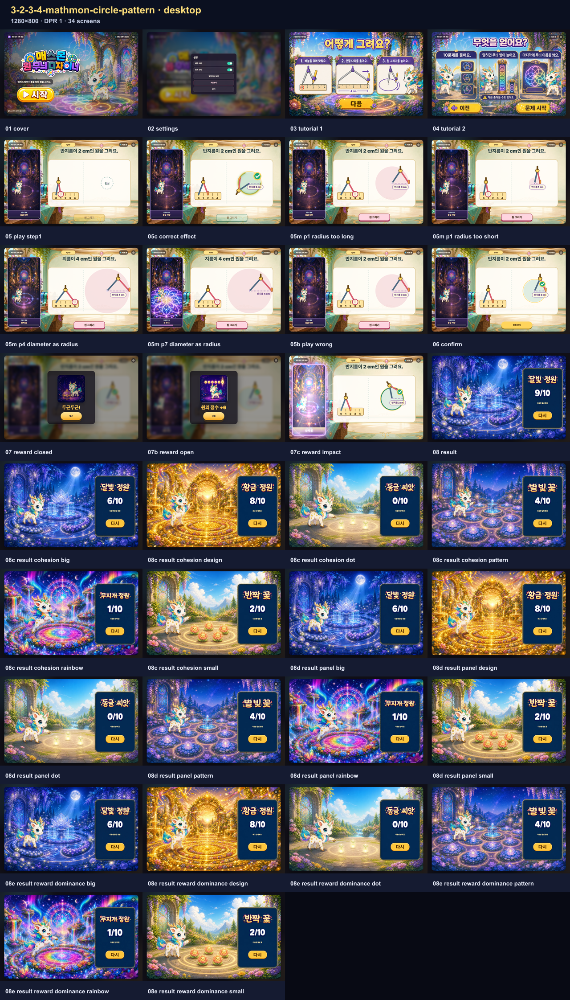

#### 시작 화면 · `engine-flow-desktop-01-cover.png`

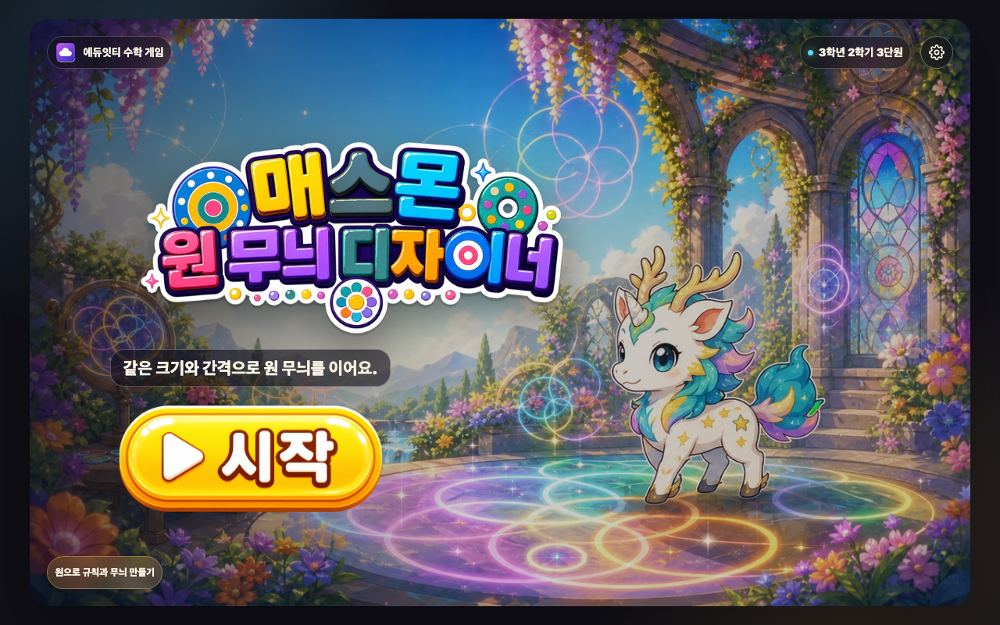

- 학생이 보는 것: 매스몬 원 무늬 디자이너 제목과 한 줄 목표, 시작 버튼을 봅니다.
- 판단하거나 누르는 것: 게임을 시작할 준비가 되면 시작을 누릅니다.
- 화면에서 확인되는 수학 관계: 컴퍼스로 여러 크기의 원 그리기을 배우는 차시임을 확인합니다.
- 다음 상태로 넘어가는 이유: 문제를 푸는 방법을 보는 설명 화면으로 이동합니다.

#### 설정 화면 · `engine-flow-desktop-02-settings.png`

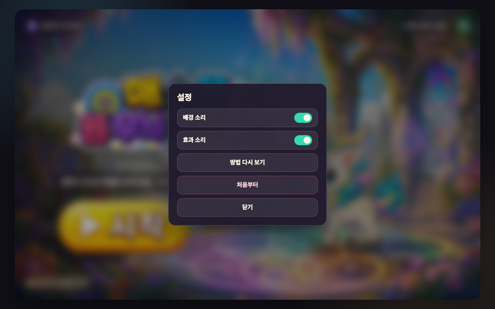

- 학생이 보는 것: 배경 소리·효과 소리와 방법 다시 보기, 처음부터, 닫기를 봅니다.
- 판단하거나 누르는 것: 필요한 소리나 이동 행동 하나를 고릅니다.
- 화면에서 확인되는 수학 관계: 수학 문제는 바꾸지 않고 게임 조작만 설정합니다.
- 다음 상태로 넘어가는 이유: 설정을 마치면 열기 전 화면으로 돌아갑니다.

#### 설명 1 · 풀이 방법 · `engine-flow-desktop-03-tutorial-1.png`

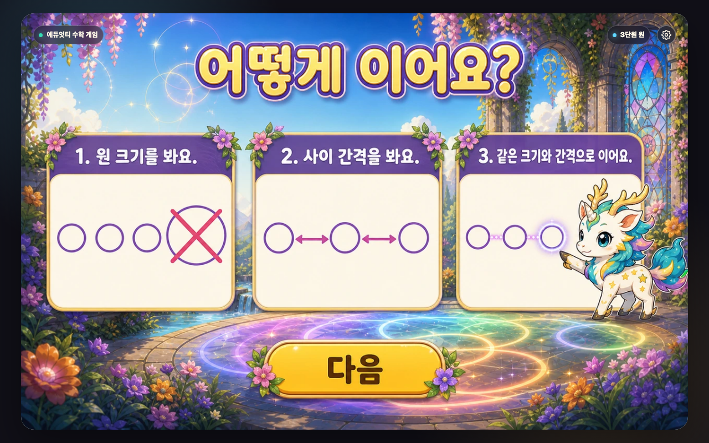

- 학생이 보는 것: 컴퍼스로 여러 크기의 원 그리기 문제를 푸는 방법과 게임 흐름을 그림으로 봅니다.
- 판단하거나 누르는 것: 그림 속 순서와 누를 곳을 확인한 뒤 다음 행동 버튼을 누릅니다.
- 화면에서 확인되는 수학 관계: 컴퍼스로 여러 크기의 원 그리기에서 무엇을 비교하거나 계산하는지 확인합니다.
- 다음 상태로 넘어가는 이유: 다음 설명으로 이동합니다.

#### 설명 2 · 보상과 목표 · `engine-flow-desktop-04-tutorial-2.png`

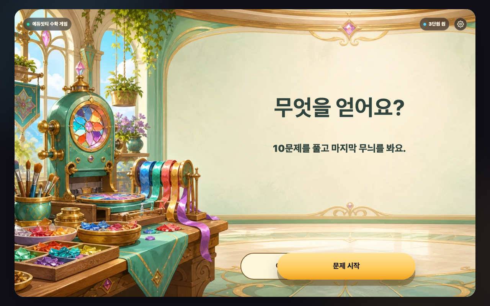

- 학생이 보는 것: 컴퍼스로 여러 크기의 원 그리기 문제를 푸는 방법과 게임 흐름을 그림으로 봅니다.
- 판단하거나 누르는 것: 그림 속 순서와 누를 곳을 확인한 뒤 다음 행동 버튼을 누릅니다.
- 화면에서 확인되는 수학 관계: 컴퍼스로 여러 크기의 원 그리기에서 무엇을 비교하거나 계산하는지 확인합니다.
- 다음 상태로 넘어가는 이유: 첫 문제로 이동합니다.

#### 문제 상태 · 05-play-step1 · `engine-flow-desktop-05-play-step1.png`

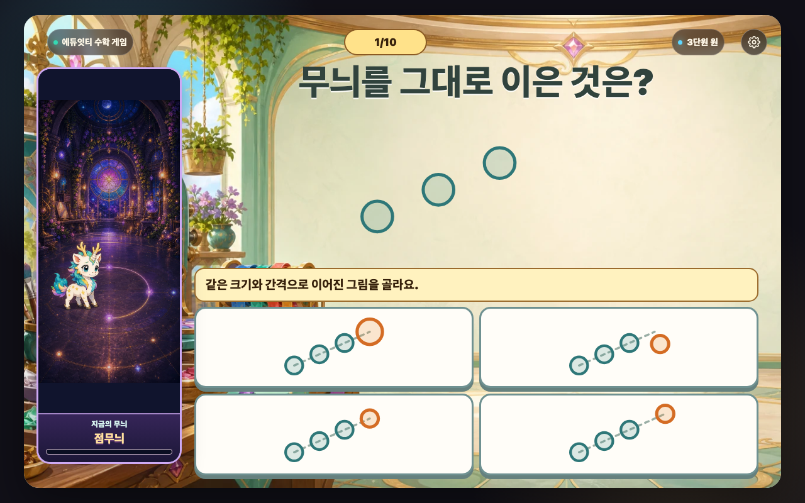

- 학생이 보는 것: 현재 문제, 핵심 계산판이나 물건, 고를 수 있는 답을 봅니다.
- 판단하거나 누르는 것: 문제에서 묻는 값이나 관계에 맞는 답 하나를 고릅니다.
- 화면에서 확인되는 수학 관계: 컴퍼스로 여러 크기의 원 그리기을 이용해 선택지를 판단합니다.
- 다음 상태로 넘어가는 이유: 고른 답에 따라 오답 또는 정답 확인 상태로 이동합니다.

#### 오개념 확인 · p1-radius-too-long · `engine-flow-desktop-05m-p1-radius-too-long.png`

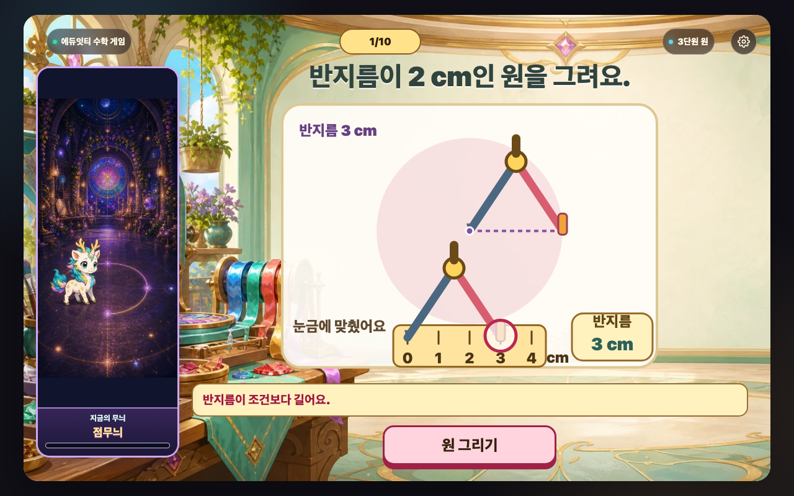

- 학생이 보는 것: 고른 답이 계산판이나 물건에 들어간 모습과 짧은 오답 피드백을 봅니다.
- 판단하거나 누르는 것: 어디가 맞지 않는지 확인하고 같은 문제에서 다른 답을 고릅니다.
- 화면에서 확인되는 수학 관계: 컴퍼스로 여러 크기의 원 그리기의 관계와 고른 답이 왜 맞지 않는지 확인합니다.
- 다음 상태로 넘어가는 이유: 같은 문제에서 다시 판단할 수 있는 상태로 돌아갑니다.

#### 오개념 확인 · p1-radius-too-short · `engine-flow-desktop-05m-p1-radius-too-short.png`

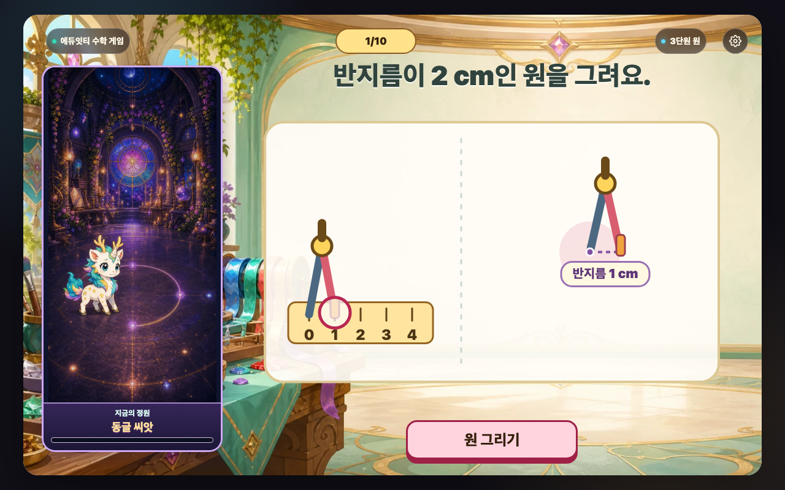

- 학생이 보는 것: 고른 답이 계산판이나 물건에 들어간 모습과 짧은 오답 피드백을 봅니다.
- 판단하거나 누르는 것: 어디가 맞지 않는지 확인하고 같은 문제에서 다른 답을 고릅니다.
- 화면에서 확인되는 수학 관계: 컴퍼스로 여러 크기의 원 그리기의 관계와 고른 답이 왜 맞지 않는지 확인합니다.
- 다음 상태로 넘어가는 이유: 같은 문제에서 다시 판단할 수 있는 상태로 돌아갑니다.

#### 오개념 확인 · p7-diameter-as-radius · `engine-flow-desktop-05m-p7-diameter-as-radius.png`

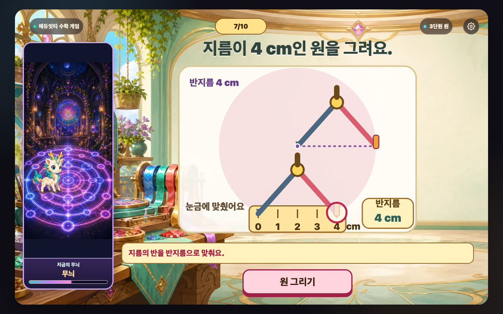

- 학생이 보는 것: 고른 답이 계산판이나 물건에 들어간 모습과 짧은 오답 피드백을 봅니다.
- 판단하거나 누르는 것: 어디가 맞지 않는지 확인하고 같은 문제에서 다른 답을 고릅니다.
- 화면에서 확인되는 수학 관계: 컴퍼스로 여러 크기의 원 그리기의 관계와 고른 답이 왜 맞지 않는지 확인합니다.
- 다음 상태로 넘어가는 이유: 같은 문제에서 다시 판단할 수 있는 상태로 돌아갑니다.

#### 오답 확인 · 05b-play-wrong · `engine-flow-desktop-05b-play-wrong.png`

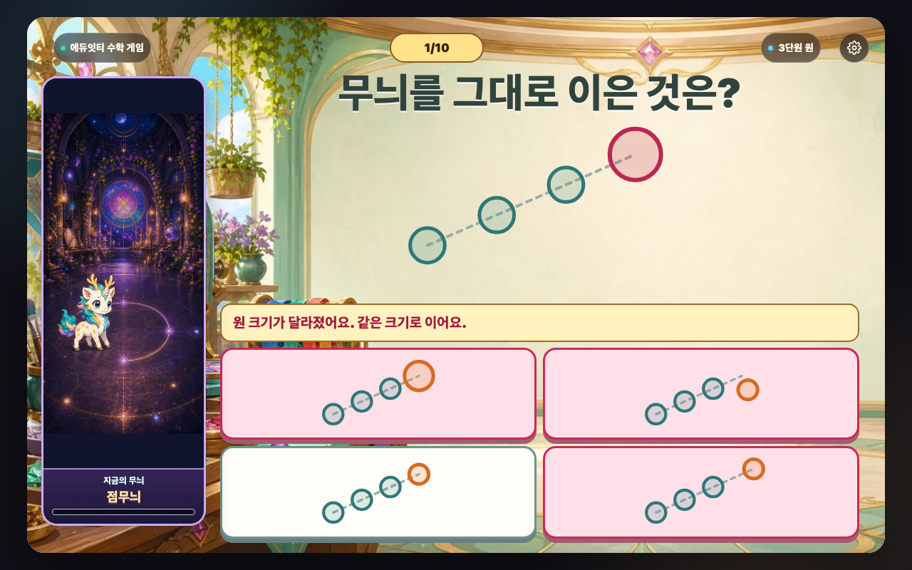

- 학생이 보는 것: 고른 답이 계산판이나 물건에 들어간 모습과 짧은 오답 피드백을 봅니다.
- 판단하거나 누르는 것: 어디가 맞지 않는지 확인하고 같은 문제에서 다른 답을 고릅니다.
- 화면에서 확인되는 수학 관계: 컴퍼스로 여러 크기의 원 그리기의 관계와 고른 답이 왜 맞지 않는지 확인합니다.
- 다음 상태로 넘어가는 이유: 같은 문제에서 다시 판단할 수 있는 상태로 돌아갑니다.

#### 마지막 확인 · 06-confirm · `engine-flow-desktop-06-confirm.png`

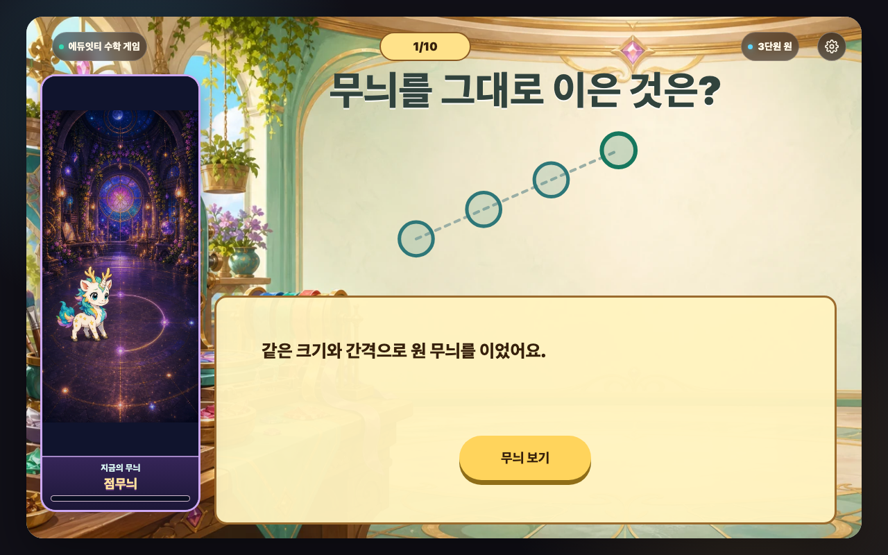

- 학생이 보는 것: 마지막으로 완성된 계산이나 값과 보상으로 가는 행동 버튼을 봅니다.
- 판단하거나 누르는 것: 완성된 관계를 읽은 뒤 보상 확인 버튼을 누릅니다.
- 화면에서 확인되는 수학 관계: 컴퍼스로 여러 크기의 원 그리기의 완성값을 보상 화면 전에 다시 확인합니다.
- 다음 상태로 넘어가는 이유: 수학 관계를 확인한 뒤 보상 상태로 이동합니다.

#### 닫힌 보상 · `engine-flow-desktop-07-reward-closed.png`

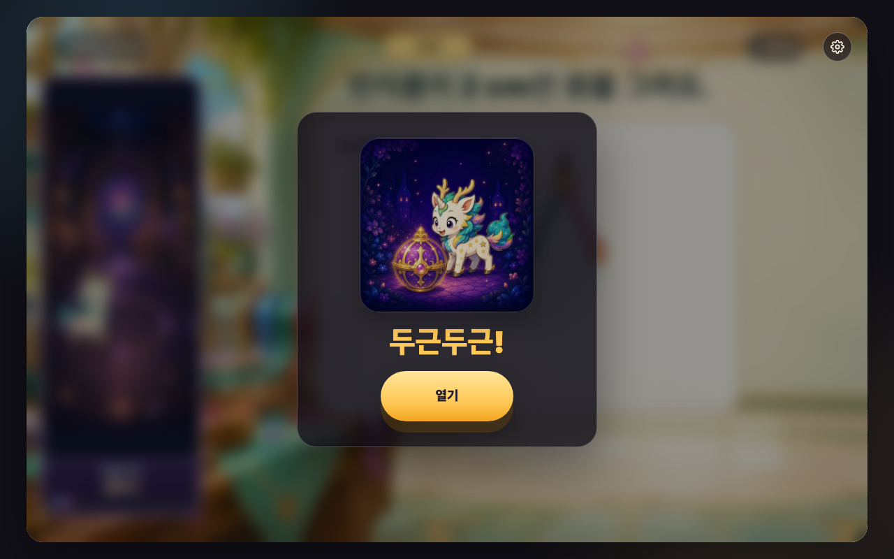

- 학생이 보는 것: 결과가 아직 드러나지 않은 보상 그림과 열기 버튼을 봅니다.
- 판단하거나 누르는 것: 이번 무늬 빛 변화를 확인하기 위해 열기를 누릅니다.
- 화면에서 확인되는 수학 관계: 뒤 문제 화면에는 방금 완성한 계산이나 관계가 그대로 남습니다.
- 다음 상태로 넘어가는 이유: 학생이 직접 연 뒤에만 이번 보상 사건이 공개됩니다.

#### 열린 보상 · `engine-flow-desktop-07b-reward-open.png`

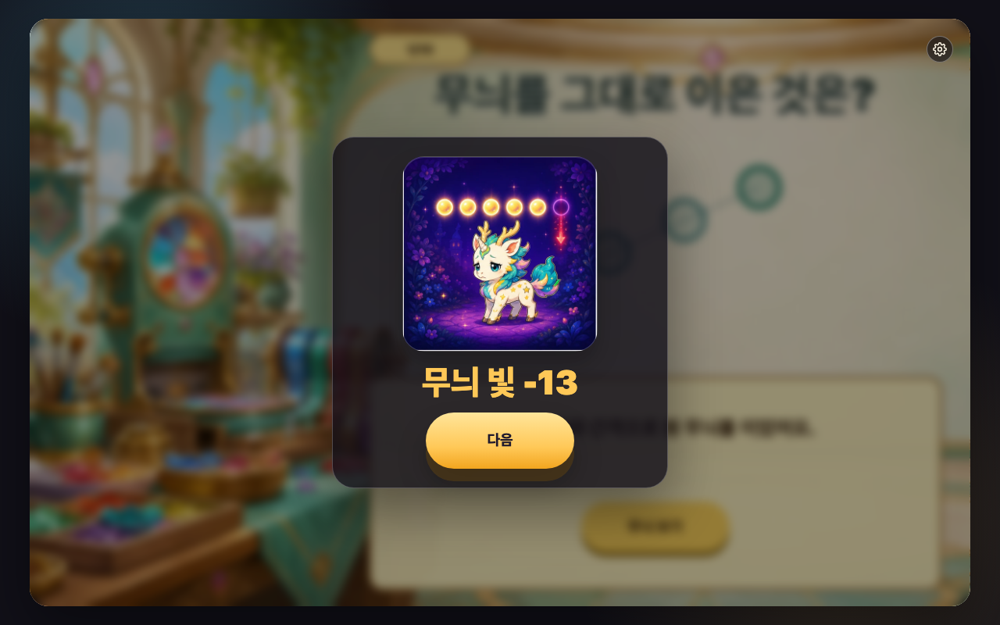

- 학생이 보는 것: 보상 사건 그림과 이번 무늬 빛 변화, 다음 행동 버튼을 봅니다.
- 판단하거나 누르는 것: 이번 변화를 확인하고 다음을 누릅니다.
- 화면에서 확인되는 수학 관계: 수학 정답과 무작위 보상 변화가 서로 분리되어 있음을 확인합니다.
- 다음 상태로 넘어가는 이유: 현재 진행 장면의 변화를 본 뒤 다음 문제나 결과로 이동합니다.

#### 보상 뒤 변화 · 07c-reward-impact · `engine-flow-desktop-07c-reward-impact.png`

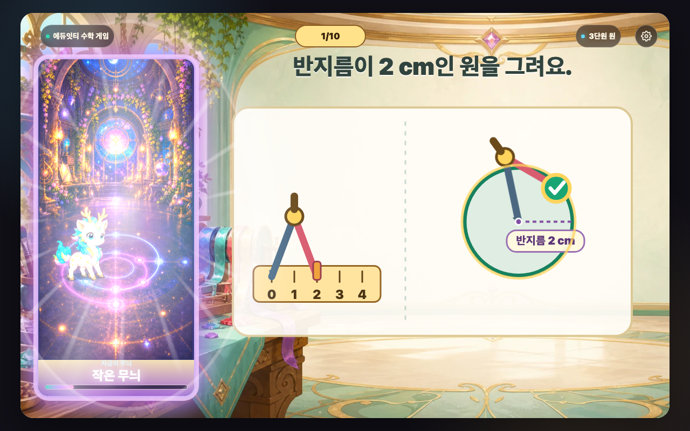

- 학생이 보는 것: 보상 모달이 닫힌 뒤 현재 진행 장면과 무늬 빛 변화가 반영되는 모습을 봅니다.
- 판단하거나 누르는 것: 별도 입력 없이 이번 보상이 진행 단계에 반영되는 모습을 확인합니다.
- 화면에서 확인되는 수학 관계: 한 문제의 보상이 현재 진행값에 정확히 한 번 반영됩니다.
- 다음 상태로 넘어가는 이유: 효과를 충분히 본 뒤 다음 문제 또는 결과로 이동합니다.

#### 실제 결과 · `engine-flow-desktop-08-result.png`

- 학생이 보는 것: 완성 장면과 결과 이름, 정답 수, 다음 목표, 다시 버튼을 봅니다.
- 판단하거나 누르는 것: 현재 결과와 다음 목표를 비교하고 다시 도전할지 결정합니다.
- 화면에서 확인되는 수학 관계: 한 판의 정답과 무늬 빛 변화가 하나의 결과 단계로 정리됩니다.
- 다음 상태로 넘어가는 이유: 다시를 누르면 새 문제 순서와 새 보상 흐름으로 시작합니다.

#### 결과 결속 · big · `engine-flow-desktop-08c-result-cohesion-big.png`

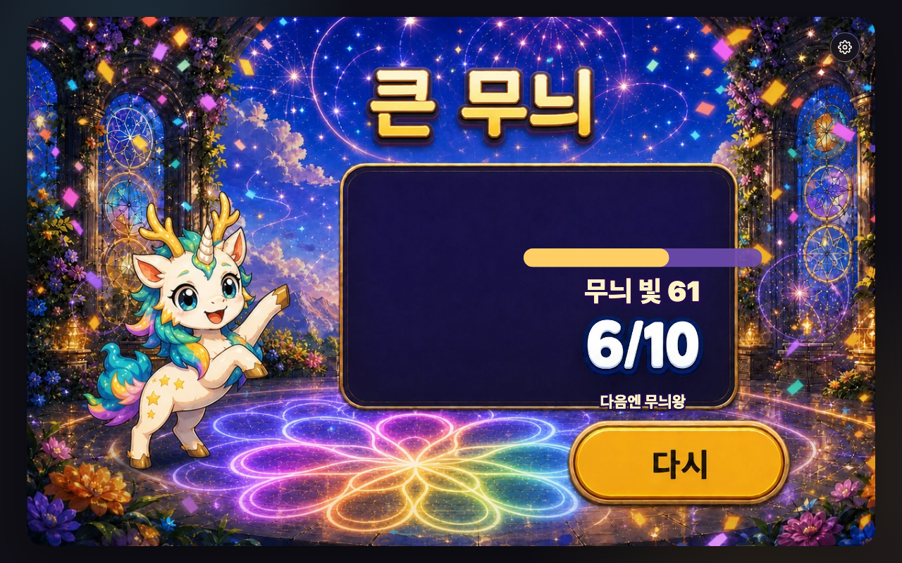

- 학생이 보는 것: 완성 장면과 결과 이름, 정답 수, 다음 목표, 다시 버튼을 봅니다.
- 판단하거나 누르는 것: 현재 결과와 다음 목표를 비교하고 다시 도전할지 결정합니다.
- 화면에서 확인되는 수학 관계: 한 판의 정답과 무늬 빛 변화가 하나의 결과 단계로 정리됩니다.
- 다음 상태로 넘어가는 이유: 다시를 누르면 새 문제 순서와 새 보상 흐름으로 시작합니다.

#### 결과 결속 · design · `engine-flow-desktop-08c-result-cohesion-design.png`

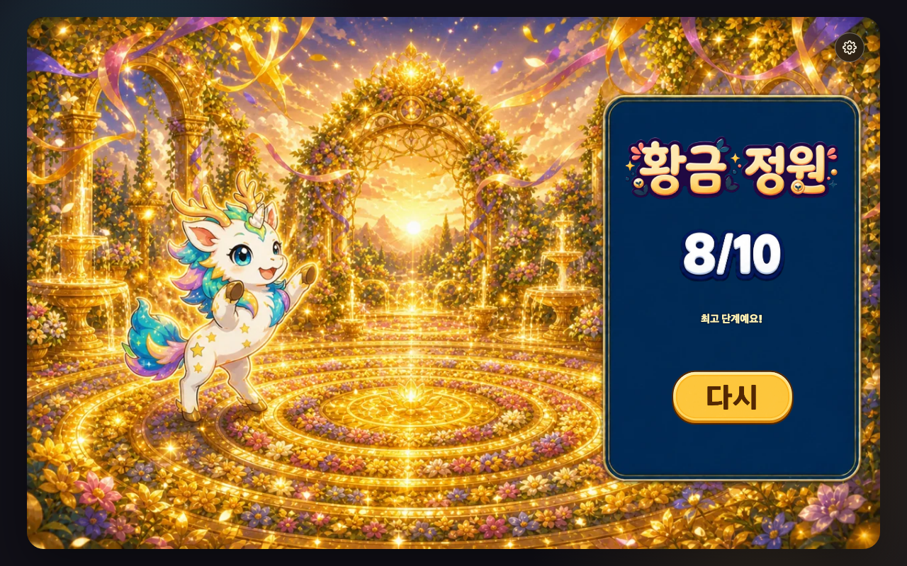

- 학생이 보는 것: 완성 장면과 결과 이름, 정답 수, 다음 목표, 다시 버튼을 봅니다.
- 판단하거나 누르는 것: 현재 결과와 다음 목표를 비교하고 다시 도전할지 결정합니다.
- 화면에서 확인되는 수학 관계: 한 판의 정답과 무늬 빛 변화가 하나의 결과 단계로 정리됩니다.
- 다음 상태로 넘어가는 이유: 다시를 누르면 새 문제 순서와 새 보상 흐름으로 시작합니다.

#### 결과 결속 · dot · `engine-flow-desktop-08c-result-cohesion-dot.png`

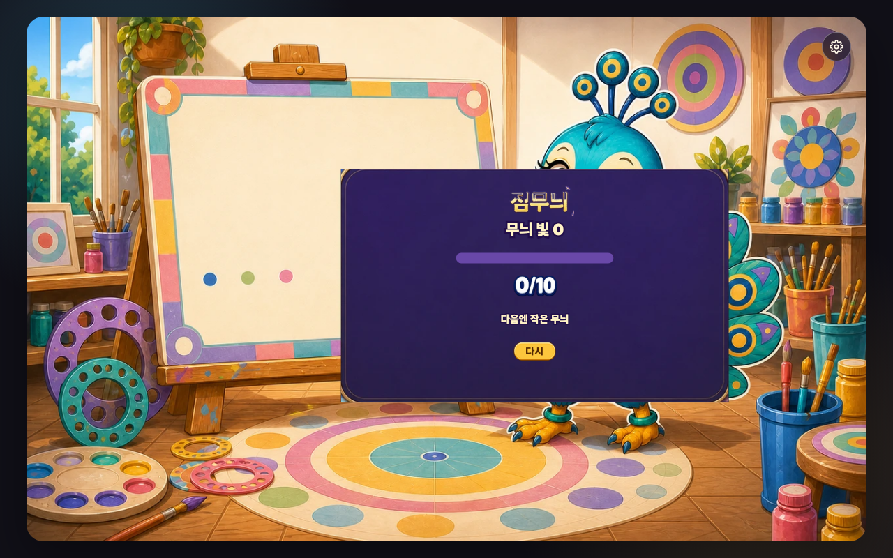

- 학생이 보는 것: 완성 장면과 결과 이름, 정답 수, 다음 목표, 다시 버튼을 봅니다.
- 판단하거나 누르는 것: 현재 결과와 다음 목표를 비교하고 다시 도전할지 결정합니다.
- 화면에서 확인되는 수학 관계: 한 판의 정답과 무늬 빛 변화가 하나의 결과 단계로 정리됩니다.
- 다음 상태로 넘어가는 이유: 다시를 누르면 새 문제 순서와 새 보상 흐름으로 시작합니다.

#### 결과 결속 · pattern · `engine-flow-desktop-08c-result-cohesion-pattern.png`

- 학생이 보는 것: 완성 장면과 결과 이름, 정답 수, 다음 목표, 다시 버튼을 봅니다.
- 판단하거나 누르는 것: 현재 결과와 다음 목표를 비교하고 다시 도전할지 결정합니다.
- 화면에서 확인되는 수학 관계: 한 판의 정답과 무늬 빛 변화가 하나의 결과 단계로 정리됩니다.
- 다음 상태로 넘어가는 이유: 다시를 누르면 새 문제 순서와 새 보상 흐름으로 시작합니다.

#### 결과 결속 · rainbow · `engine-flow-desktop-08c-result-cohesion-rainbow.png`

- 학생이 보는 것: 완성 장면과 결과 이름, 정답 수, 다음 목표, 다시 버튼을 봅니다.
- 판단하거나 누르는 것: 현재 결과와 다음 목표를 비교하고 다시 도전할지 결정합니다.
- 화면에서 확인되는 수학 관계: 한 판의 정답과 무늬 빛 변화가 하나의 결과 단계로 정리됩니다.
- 다음 상태로 넘어가는 이유: 다시를 누르면 새 문제 순서와 새 보상 흐름으로 시작합니다.

#### 결과 결속 · small · `engine-flow-desktop-08c-result-cohesion-small.png`

- 학생이 보는 것: 완성 장면과 결과 이름, 정답 수, 다음 목표, 다시 버튼을 봅니다.
- 판단하거나 누르는 것: 현재 결과와 다음 목표를 비교하고 다시 도전할지 결정합니다.
- 화면에서 확인되는 수학 관계: 한 판의 정답과 무늬 빛 변화가 하나의 결과 단계로 정리됩니다.
- 다음 상태로 넘어가는 이유: 다시를 누르면 새 문제 순서와 새 보상 흐름으로 시작합니다.

#### 결과판 포함 · big · `engine-flow-desktop-08d-result-panel-big.png`

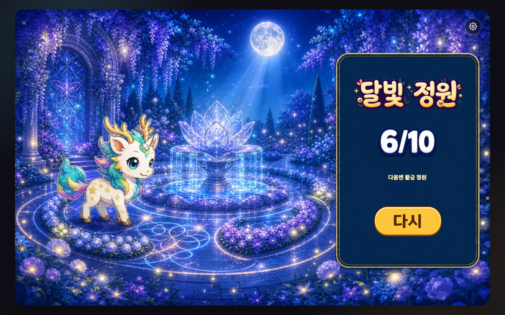

- 학생이 보는 것: 완성 장면과 결과 이름, 정답 수, 다음 목표, 다시 버튼을 봅니다.
- 판단하거나 누르는 것: 현재 결과와 다음 목표를 비교하고 다시 도전할지 결정합니다.
- 화면에서 확인되는 수학 관계: 한 판의 정답과 무늬 빛 변화가 하나의 결과 단계로 정리됩니다.
- 다음 상태로 넘어가는 이유: 다시를 누르면 새 문제 순서와 새 보상 흐름으로 시작합니다.

#### 결과판 포함 · design · `engine-flow-desktop-08d-result-panel-design.png`

- 학생이 보는 것: 완성 장면과 결과 이름, 정답 수, 다음 목표, 다시 버튼을 봅니다.
- 판단하거나 누르는 것: 현재 결과와 다음 목표를 비교하고 다시 도전할지 결정합니다.
- 화면에서 확인되는 수학 관계: 한 판의 정답과 무늬 빛 변화가 하나의 결과 단계로 정리됩니다.
- 다음 상태로 넘어가는 이유: 다시를 누르면 새 문제 순서와 새 보상 흐름으로 시작합니다.

#### 결과판 포함 · dot · `engine-flow-desktop-08d-result-panel-dot.png`

- 학생이 보는 것: 완성 장면과 결과 이름, 정답 수, 다음 목표, 다시 버튼을 봅니다.
- 판단하거나 누르는 것: 현재 결과와 다음 목표를 비교하고 다시 도전할지 결정합니다.
- 화면에서 확인되는 수학 관계: 한 판의 정답과 무늬 빛 변화가 하나의 결과 단계로 정리됩니다.
- 다음 상태로 넘어가는 이유: 다시를 누르면 새 문제 순서와 새 보상 흐름으로 시작합니다.

#### 결과판 포함 · pattern · `engine-flow-desktop-08d-result-panel-pattern.png`

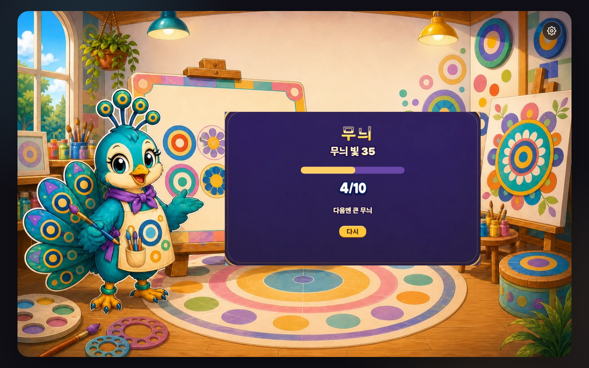

- 학생이 보는 것: 완성 장면과 결과 이름, 정답 수, 다음 목표, 다시 버튼을 봅니다.
- 판단하거나 누르는 것: 현재 결과와 다음 목표를 비교하고 다시 도전할지 결정합니다.
- 화면에서 확인되는 수학 관계: 한 판의 정답과 무늬 빛 변화가 하나의 결과 단계로 정리됩니다.
- 다음 상태로 넘어가는 이유: 다시를 누르면 새 문제 순서와 새 보상 흐름으로 시작합니다.

#### 결과판 포함 · rainbow · `engine-flow-desktop-08d-result-panel-rainbow.png`

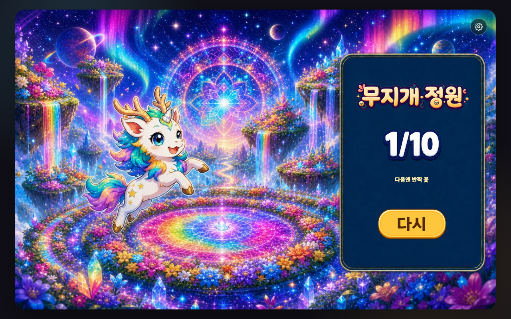

- 학생이 보는 것: 완성 장면과 결과 이름, 정답 수, 다음 목표, 다시 버튼을 봅니다.
- 판단하거나 누르는 것: 현재 결과와 다음 목표를 비교하고 다시 도전할지 결정합니다.
- 화면에서 확인되는 수학 관계: 한 판의 정답과 무늬 빛 변화가 하나의 결과 단계로 정리됩니다.
- 다음 상태로 넘어가는 이유: 다시를 누르면 새 문제 순서와 새 보상 흐름으로 시작합니다.

#### 결과판 포함 · small · `engine-flow-desktop-08d-result-panel-small.png`

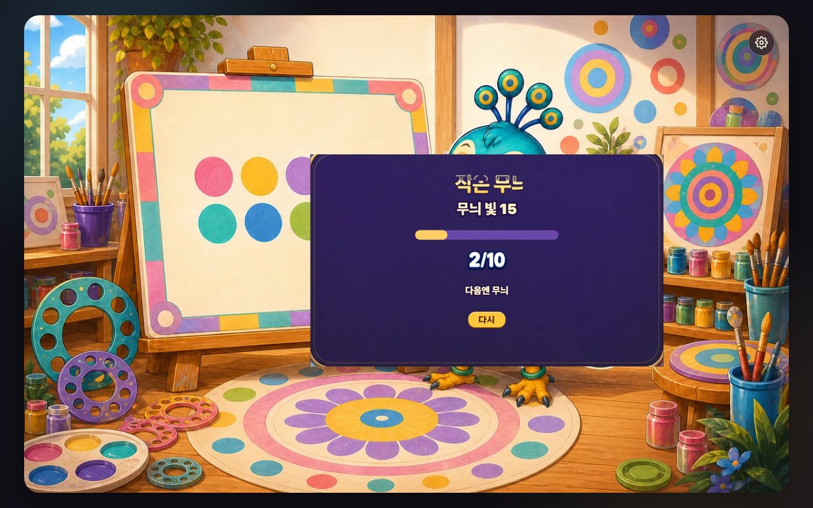

- 학생이 보는 것: 완성 장면과 결과 이름, 정답 수, 다음 목표, 다시 버튼을 봅니다.
- 판단하거나 누르는 것: 현재 결과와 다음 목표를 비교하고 다시 도전할지 결정합니다.
- 화면에서 확인되는 수학 관계: 한 판의 정답과 무늬 빛 변화가 하나의 결과 단계로 정리됩니다.
- 다음 상태로 넘어가는 이유: 다시를 누르면 새 문제 순서와 새 보상 흐름으로 시작합니다.

### tablet-landscape · 1024×768 · DPR 1 · 26장

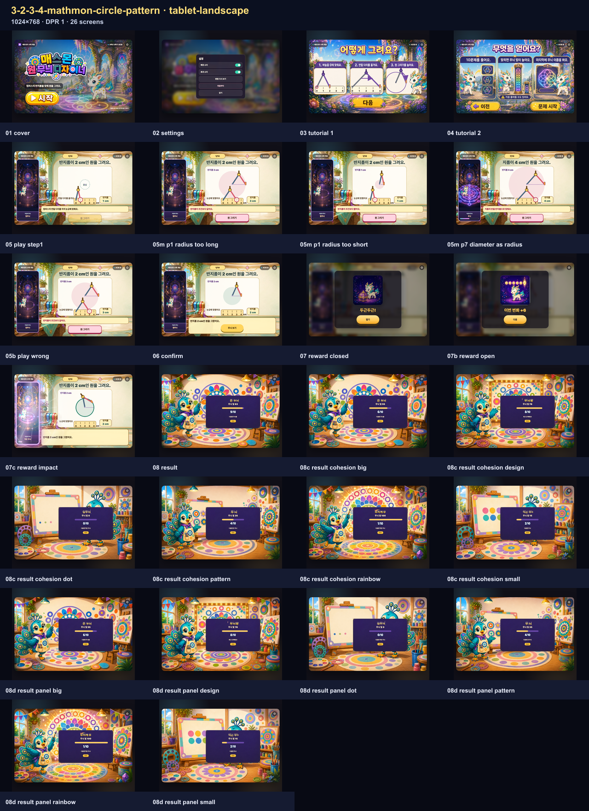

#### 시작 화면 · `engine-flow-tablet-landscape-01-cover.png`

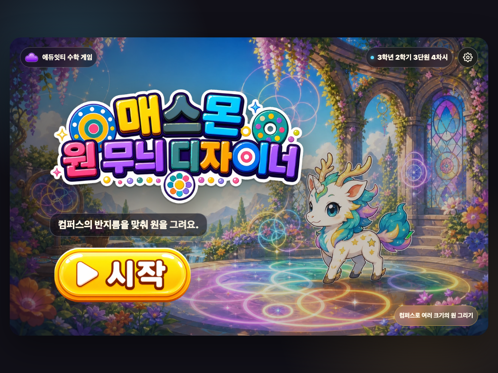

- 학생이 보는 것: 매스몬 원 무늬 디자이너 제목과 한 줄 목표, 시작 버튼을 봅니다.
- 판단하거나 누르는 것: 게임을 시작할 준비가 되면 시작을 누릅니다.
- 화면에서 확인되는 수학 관계: 컴퍼스로 여러 크기의 원 그리기을 배우는 차시임을 확인합니다.
- 다음 상태로 넘어가는 이유: 문제를 푸는 방법을 보는 설명 화면으로 이동합니다.

#### 설정 화면 · `engine-flow-tablet-landscape-02-settings.png`

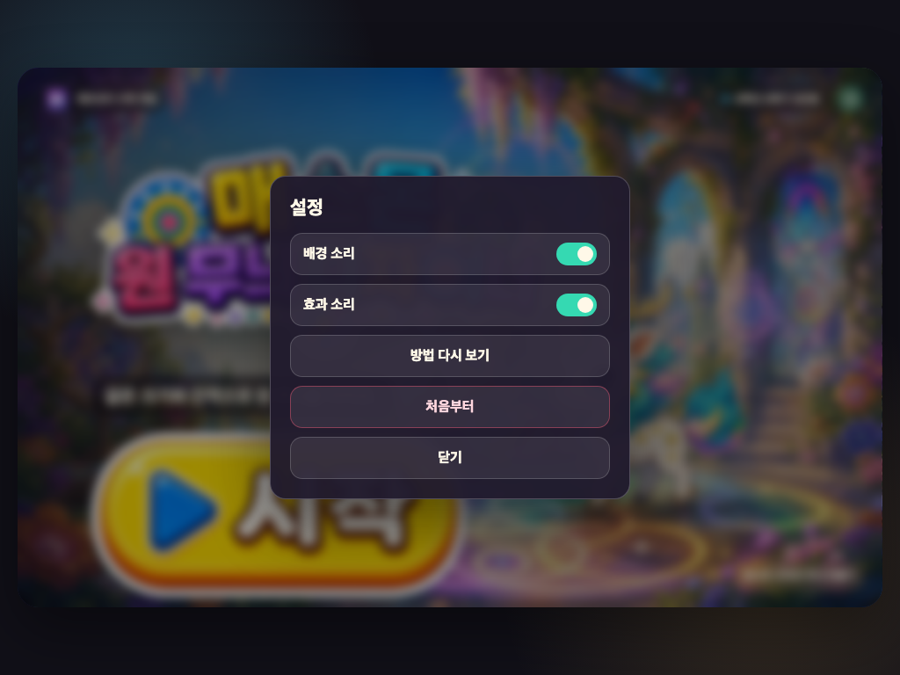

- 학생이 보는 것: 배경 소리·효과 소리와 방법 다시 보기, 처음부터, 닫기를 봅니다.
- 판단하거나 누르는 것: 필요한 소리나 이동 행동 하나를 고릅니다.
- 화면에서 확인되는 수학 관계: 수학 문제는 바꾸지 않고 게임 조작만 설정합니다.
- 다음 상태로 넘어가는 이유: 설정을 마치면 열기 전 화면으로 돌아갑니다.

#### 설명 1 · 풀이 방법 · `engine-flow-tablet-landscape-03-tutorial-1.png`

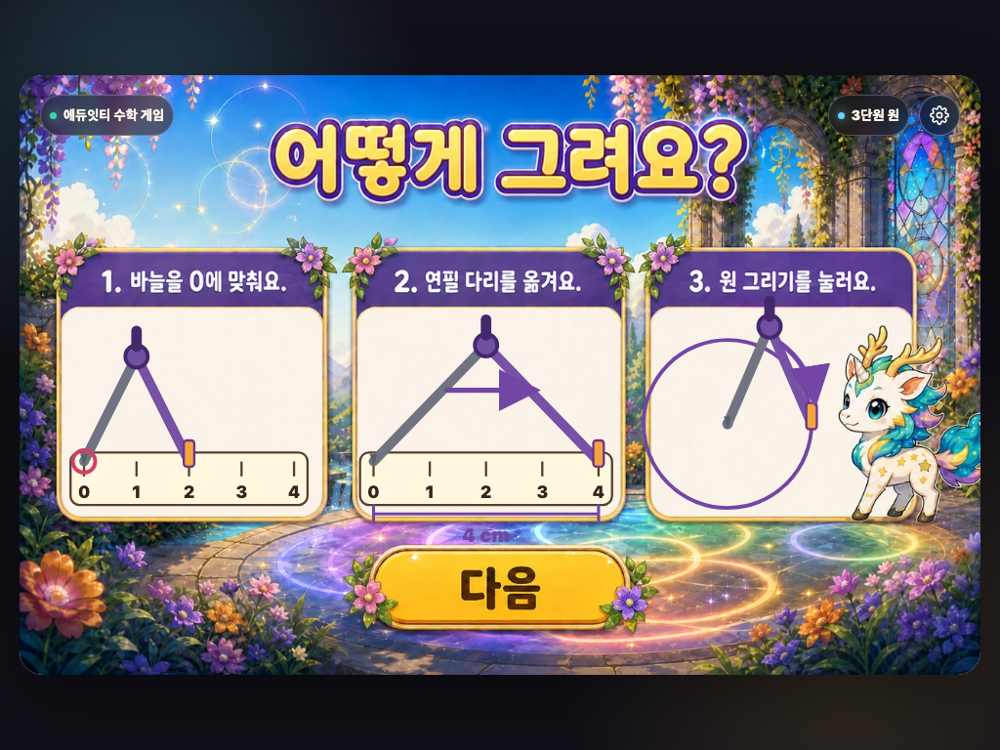

- 학생이 보는 것: 컴퍼스로 여러 크기의 원 그리기 문제를 푸는 방법과 게임 흐름을 그림으로 봅니다.
- 판단하거나 누르는 것: 그림 속 순서와 누를 곳을 확인한 뒤 다음 행동 버튼을 누릅니다.
- 화면에서 확인되는 수학 관계: 컴퍼스로 여러 크기의 원 그리기에서 무엇을 비교하거나 계산하는지 확인합니다.
- 다음 상태로 넘어가는 이유: 다음 설명으로 이동합니다.

#### 설명 2 · 보상과 목표 · `engine-flow-tablet-landscape-04-tutorial-2.png`

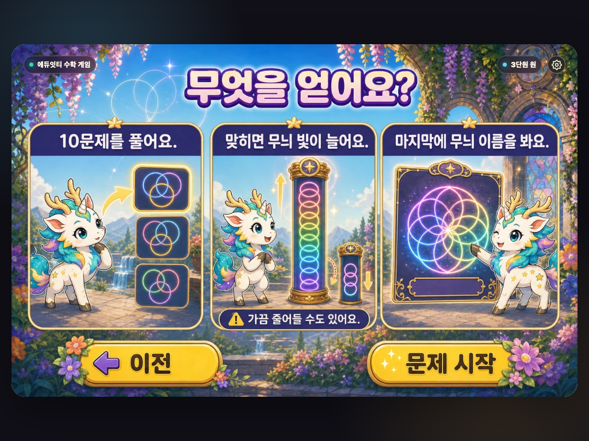

- 학생이 보는 것: 컴퍼스로 여러 크기의 원 그리기 문제를 푸는 방법과 게임 흐름을 그림으로 봅니다.
- 판단하거나 누르는 것: 그림 속 순서와 누를 곳을 확인한 뒤 다음 행동 버튼을 누릅니다.
- 화면에서 확인되는 수학 관계: 컴퍼스로 여러 크기의 원 그리기에서 무엇을 비교하거나 계산하는지 확인합니다.
- 다음 상태로 넘어가는 이유: 첫 문제로 이동합니다.

#### 문제 상태 · 05-play-step1 · `engine-flow-tablet-landscape-05-play-step1.png`

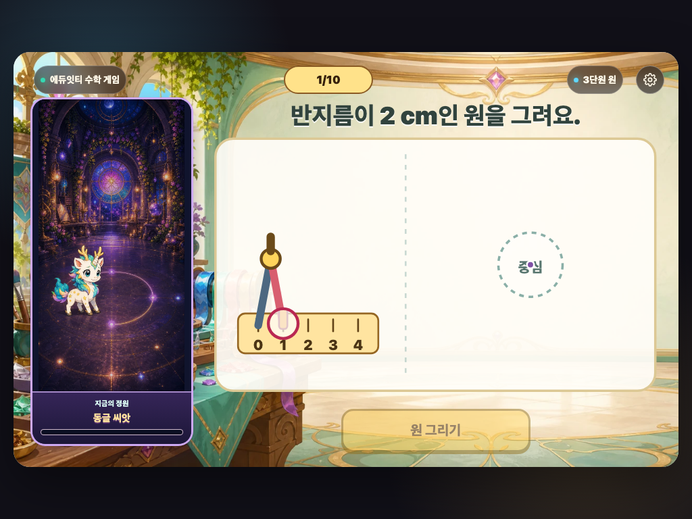

- 학생이 보는 것: 현재 문제, 핵심 계산판이나 물건, 고를 수 있는 답을 봅니다.
- 판단하거나 누르는 것: 문제에서 묻는 값이나 관계에 맞는 답 하나를 고릅니다.
- 화면에서 확인되는 수학 관계: 컴퍼스로 여러 크기의 원 그리기을 이용해 선택지를 판단합니다.
- 다음 상태로 넘어가는 이유: 고른 답에 따라 오답 또는 정답 확인 상태로 이동합니다.

#### 오개념 확인 · p1-radius-too-long · `engine-flow-tablet-landscape-05m-p1-radius-too-long.png`

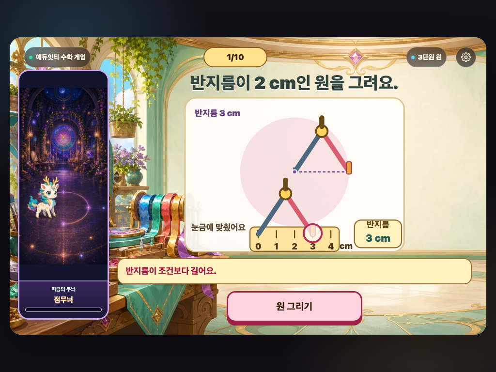

- 학생이 보는 것: 고른 답이 계산판이나 물건에 들어간 모습과 짧은 오답 피드백을 봅니다.
- 판단하거나 누르는 것: 어디가 맞지 않는지 확인하고 같은 문제에서 다른 답을 고릅니다.
- 화면에서 확인되는 수학 관계: 컴퍼스로 여러 크기의 원 그리기의 관계와 고른 답이 왜 맞지 않는지 확인합니다.
- 다음 상태로 넘어가는 이유: 같은 문제에서 다시 판단할 수 있는 상태로 돌아갑니다.

#### 오개념 확인 · p1-radius-too-short · `engine-flow-tablet-landscape-05m-p1-radius-too-short.png`

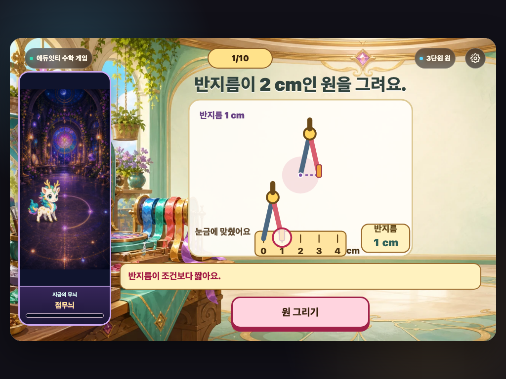

- 학생이 보는 것: 고른 답이 계산판이나 물건에 들어간 모습과 짧은 오답 피드백을 봅니다.
- 판단하거나 누르는 것: 어디가 맞지 않는지 확인하고 같은 문제에서 다른 답을 고릅니다.
- 화면에서 확인되는 수학 관계: 컴퍼스로 여러 크기의 원 그리기의 관계와 고른 답이 왜 맞지 않는지 확인합니다.
- 다음 상태로 넘어가는 이유: 같은 문제에서 다시 판단할 수 있는 상태로 돌아갑니다.

#### 오개념 확인 · p7-diameter-as-radius · `engine-flow-tablet-landscape-05m-p7-diameter-as-radius.png`

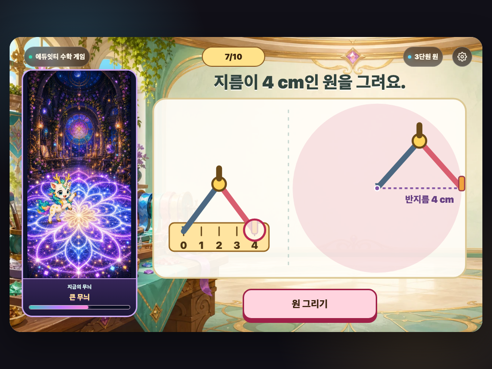

- 학생이 보는 것: 고른 답이 계산판이나 물건에 들어간 모습과 짧은 오답 피드백을 봅니다.
- 판단하거나 누르는 것: 어디가 맞지 않는지 확인하고 같은 문제에서 다른 답을 고릅니다.
- 화면에서 확인되는 수학 관계: 컴퍼스로 여러 크기의 원 그리기의 관계와 고른 답이 왜 맞지 않는지 확인합니다.
- 다음 상태로 넘어가는 이유: 같은 문제에서 다시 판단할 수 있는 상태로 돌아갑니다.

#### 오답 확인 · 05b-play-wrong · `engine-flow-tablet-landscape-05b-play-wrong.png`

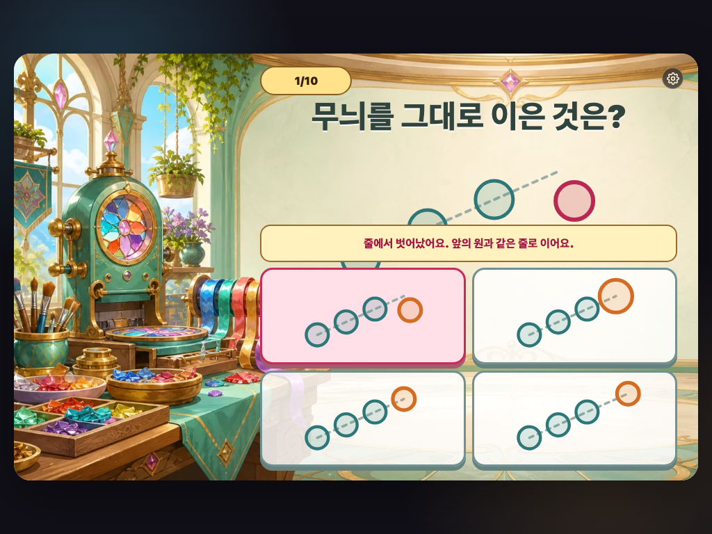

- 학생이 보는 것: 고른 답이 계산판이나 물건에 들어간 모습과 짧은 오답 피드백을 봅니다.
- 판단하거나 누르는 것: 어디가 맞지 않는지 확인하고 같은 문제에서 다른 답을 고릅니다.
- 화면에서 확인되는 수학 관계: 컴퍼스로 여러 크기의 원 그리기의 관계와 고른 답이 왜 맞지 않는지 확인합니다.
- 다음 상태로 넘어가는 이유: 같은 문제에서 다시 판단할 수 있는 상태로 돌아갑니다.

#### 마지막 확인 · 06-confirm · `engine-flow-tablet-landscape-06-confirm.png`

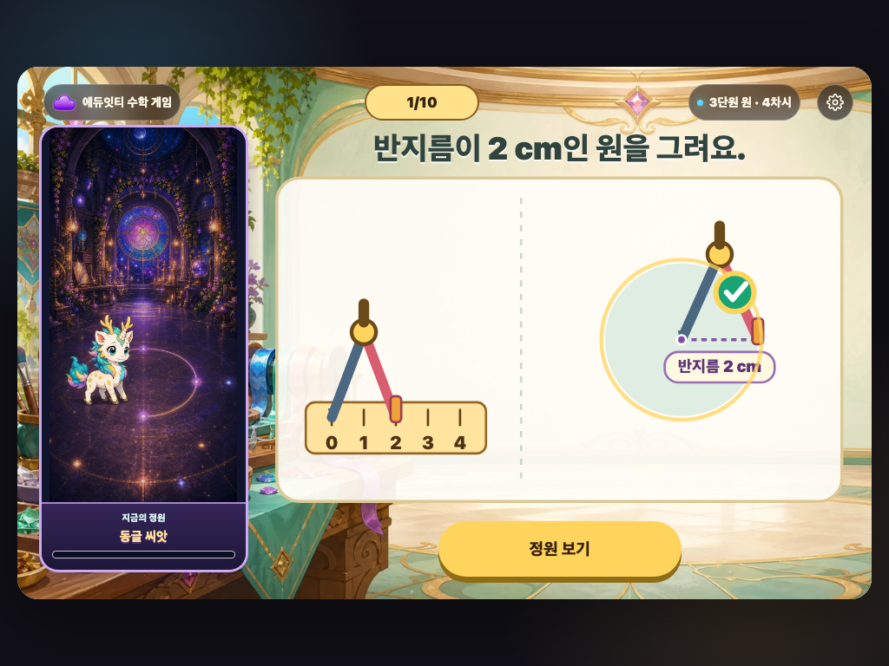

- 학생이 보는 것: 마지막으로 완성된 계산이나 값과 보상으로 가는 행동 버튼을 봅니다.
- 판단하거나 누르는 것: 완성된 관계를 읽은 뒤 보상 확인 버튼을 누릅니다.
- 화면에서 확인되는 수학 관계: 컴퍼스로 여러 크기의 원 그리기의 완성값을 보상 화면 전에 다시 확인합니다.
- 다음 상태로 넘어가는 이유: 수학 관계를 확인한 뒤 보상 상태로 이동합니다.

#### 닫힌 보상 · `engine-flow-tablet-landscape-07-reward-closed.png`

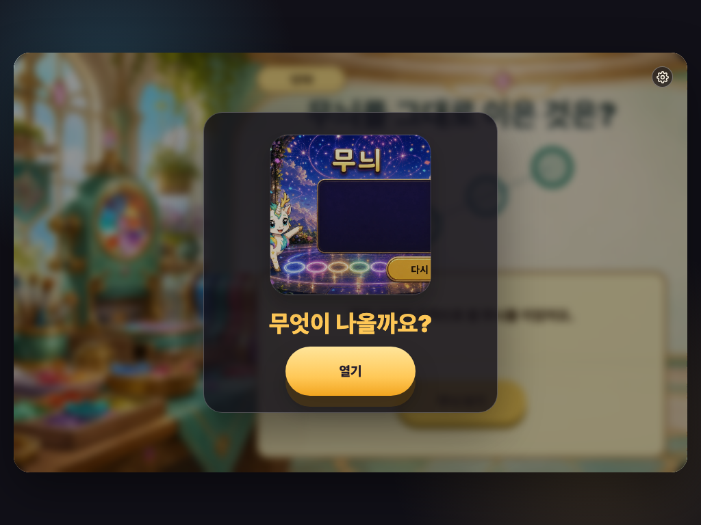

- 학생이 보는 것: 결과가 아직 드러나지 않은 보상 그림과 열기 버튼을 봅니다.
- 판단하거나 누르는 것: 이번 무늬 빛 변화를 확인하기 위해 열기를 누릅니다.
- 화면에서 확인되는 수학 관계: 뒤 문제 화면에는 방금 완성한 계산이나 관계가 그대로 남습니다.
- 다음 상태로 넘어가는 이유: 학생이 직접 연 뒤에만 이번 보상 사건이 공개됩니다.

#### 열린 보상 · `engine-flow-tablet-landscape-07b-reward-open.png`

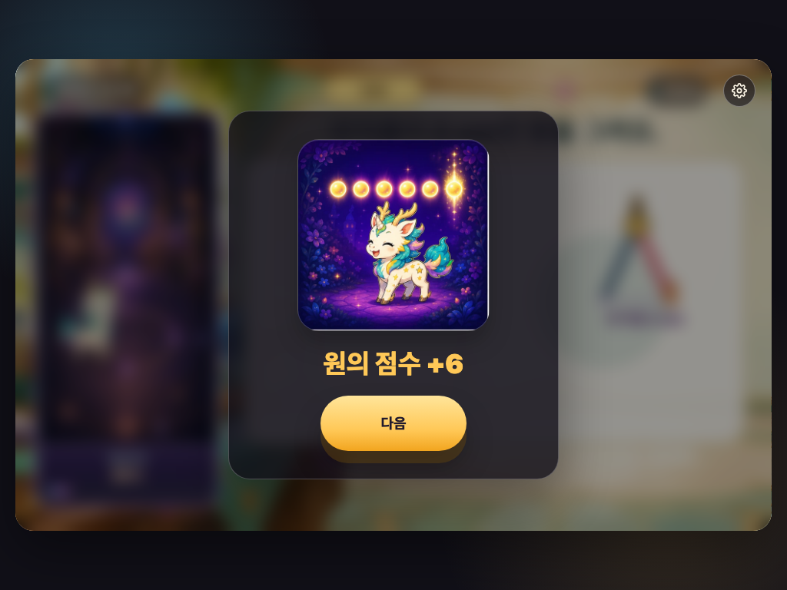

- 학생이 보는 것: 보상 사건 그림과 이번 무늬 빛 변화, 다음 행동 버튼을 봅니다.
- 판단하거나 누르는 것: 이번 변화를 확인하고 다음을 누릅니다.
- 화면에서 확인되는 수학 관계: 수학 정답과 무작위 보상 변화가 서로 분리되어 있음을 확인합니다.
- 다음 상태로 넘어가는 이유: 현재 진행 장면의 변화를 본 뒤 다음 문제나 결과로 이동합니다.

#### 보상 뒤 변화 · 07c-reward-impact · `engine-flow-tablet-landscape-07c-reward-impact.png`

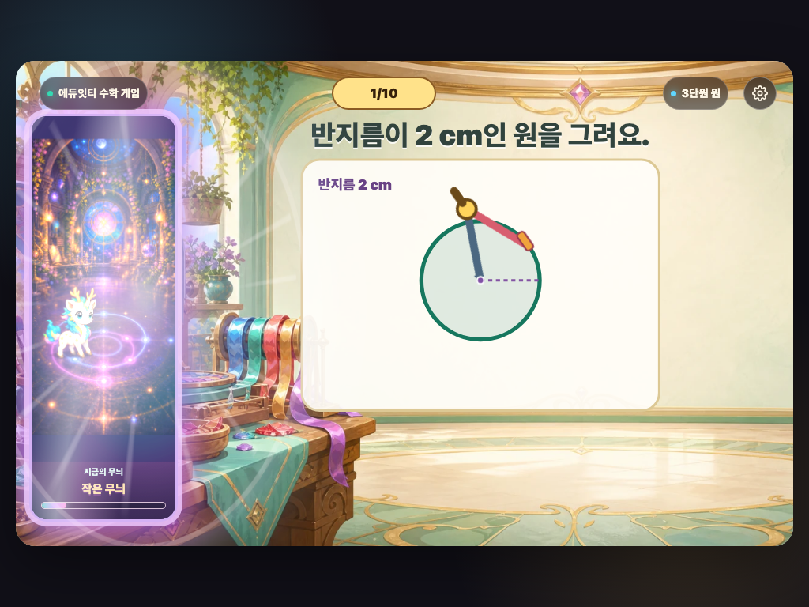

- 학생이 보는 것: 보상 모달이 닫힌 뒤 현재 진행 장면과 무늬 빛 변화가 반영되는 모습을 봅니다.
- 판단하거나 누르는 것: 별도 입력 없이 이번 보상이 진행 단계에 반영되는 모습을 확인합니다.
- 화면에서 확인되는 수학 관계: 한 문제의 보상이 현재 진행값에 정확히 한 번 반영됩니다.
- 다음 상태로 넘어가는 이유: 효과를 충분히 본 뒤 다음 문제 또는 결과로 이동합니다.

#### 실제 결과 · `engine-flow-tablet-landscape-08-result.png`

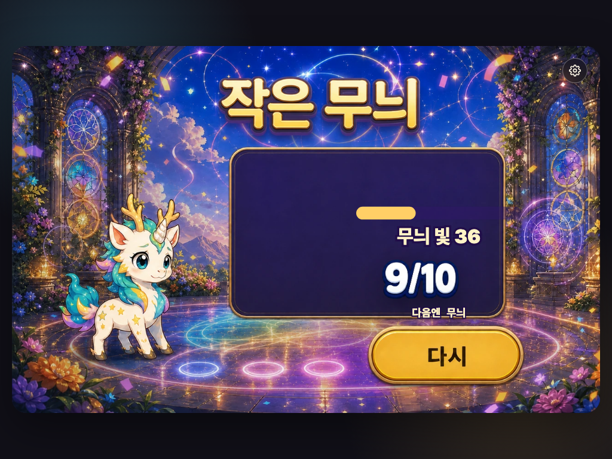

- 학생이 보는 것: 완성 장면과 결과 이름, 정답 수, 다음 목표, 다시 버튼을 봅니다.
- 판단하거나 누르는 것: 현재 결과와 다음 목표를 비교하고 다시 도전할지 결정합니다.
- 화면에서 확인되는 수학 관계: 한 판의 정답과 무늬 빛 변화가 하나의 결과 단계로 정리됩니다.
- 다음 상태로 넘어가는 이유: 다시를 누르면 새 문제 순서와 새 보상 흐름으로 시작합니다.

#### 결과 결속 · big · `engine-flow-tablet-landscape-08c-result-cohesion-big.png`

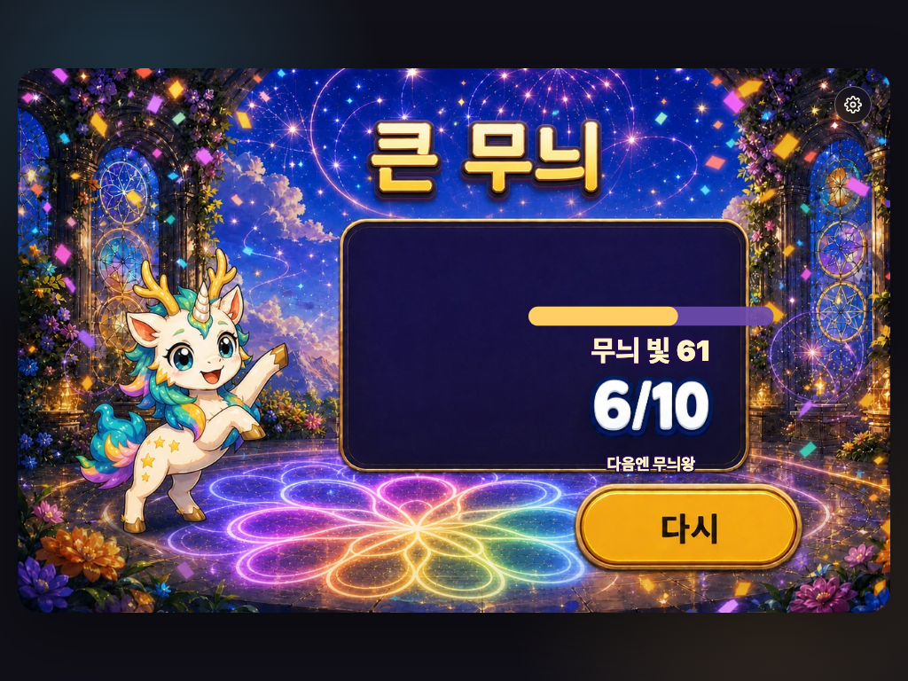

- 학생이 보는 것: 완성 장면과 결과 이름, 정답 수, 다음 목표, 다시 버튼을 봅니다.
- 판단하거나 누르는 것: 현재 결과와 다음 목표를 비교하고 다시 도전할지 결정합니다.
- 화면에서 확인되는 수학 관계: 한 판의 정답과 무늬 빛 변화가 하나의 결과 단계로 정리됩니다.
- 다음 상태로 넘어가는 이유: 다시를 누르면 새 문제 순서와 새 보상 흐름으로 시작합니다.

#### 결과 결속 · design · `engine-flow-tablet-landscape-08c-result-cohesion-design.png`

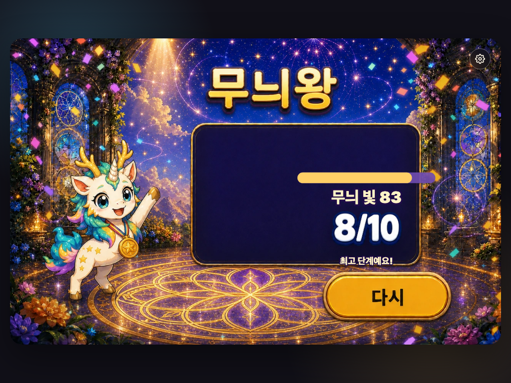

- 학생이 보는 것: 완성 장면과 결과 이름, 정답 수, 다음 목표, 다시 버튼을 봅니다.
- 판단하거나 누르는 것: 현재 결과와 다음 목표를 비교하고 다시 도전할지 결정합니다.
- 화면에서 확인되는 수학 관계: 한 판의 정답과 무늬 빛 변화가 하나의 결과 단계로 정리됩니다.
- 다음 상태로 넘어가는 이유: 다시를 누르면 새 문제 순서와 새 보상 흐름으로 시작합니다.

#### 결과 결속 · dot · `engine-flow-tablet-landscape-08c-result-cohesion-dot.png`

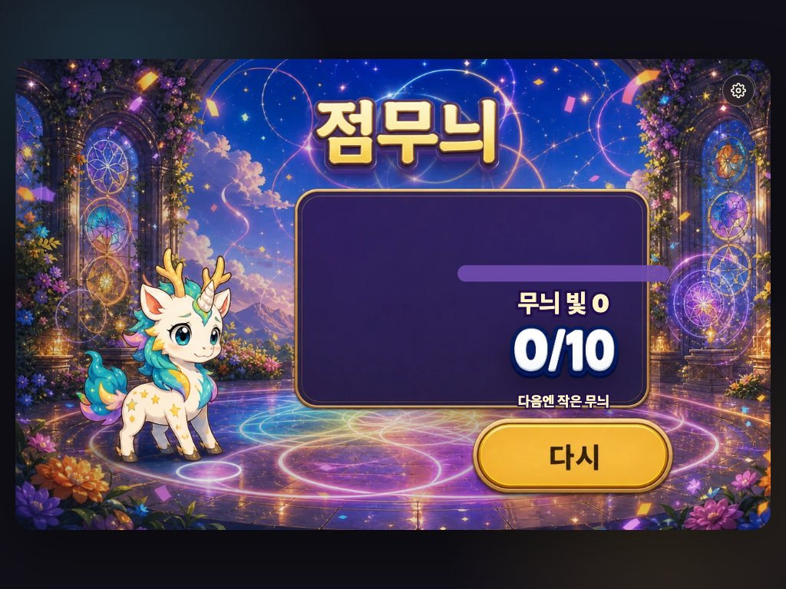

- 학생이 보는 것: 완성 장면과 결과 이름, 정답 수, 다음 목표, 다시 버튼을 봅니다.
- 판단하거나 누르는 것: 현재 결과와 다음 목표를 비교하고 다시 도전할지 결정합니다.
- 화면에서 확인되는 수학 관계: 한 판의 정답과 무늬 빛 변화가 하나의 결과 단계로 정리됩니다.
- 다음 상태로 넘어가는 이유: 다시를 누르면 새 문제 순서와 새 보상 흐름으로 시작합니다.

#### 결과 결속 · pattern · `engine-flow-tablet-landscape-08c-result-cohesion-pattern.png`

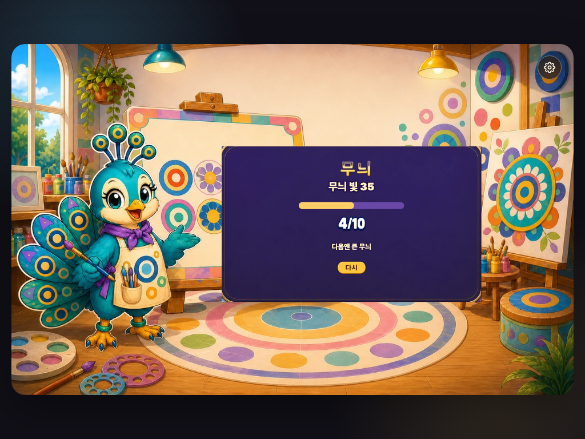

- 학생이 보는 것: 완성 장면과 결과 이름, 정답 수, 다음 목표, 다시 버튼을 봅니다.
- 판단하거나 누르는 것: 현재 결과와 다음 목표를 비교하고 다시 도전할지 결정합니다.
- 화면에서 확인되는 수학 관계: 한 판의 정답과 무늬 빛 변화가 하나의 결과 단계로 정리됩니다.
- 다음 상태로 넘어가는 이유: 다시를 누르면 새 문제 순서와 새 보상 흐름으로 시작합니다.

#### 결과 결속 · rainbow · `engine-flow-tablet-landscape-08c-result-cohesion-rainbow.png`

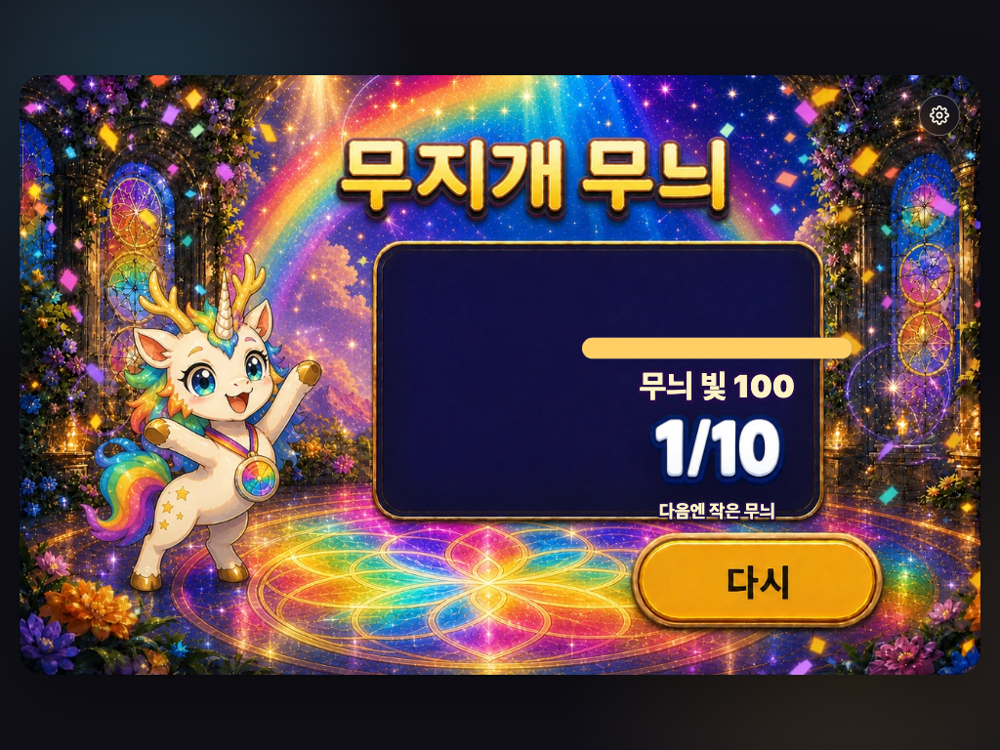

- 학생이 보는 것: 완성 장면과 결과 이름, 정답 수, 다음 목표, 다시 버튼을 봅니다.
- 판단하거나 누르는 것: 현재 결과와 다음 목표를 비교하고 다시 도전할지 결정합니다.
- 화면에서 확인되는 수학 관계: 한 판의 정답과 무늬 빛 변화가 하나의 결과 단계로 정리됩니다.
- 다음 상태로 넘어가는 이유: 다시를 누르면 새 문제 순서와 새 보상 흐름으로 시작합니다.

#### 결과 결속 · small · `engine-flow-tablet-landscape-08c-result-cohesion-small.png`

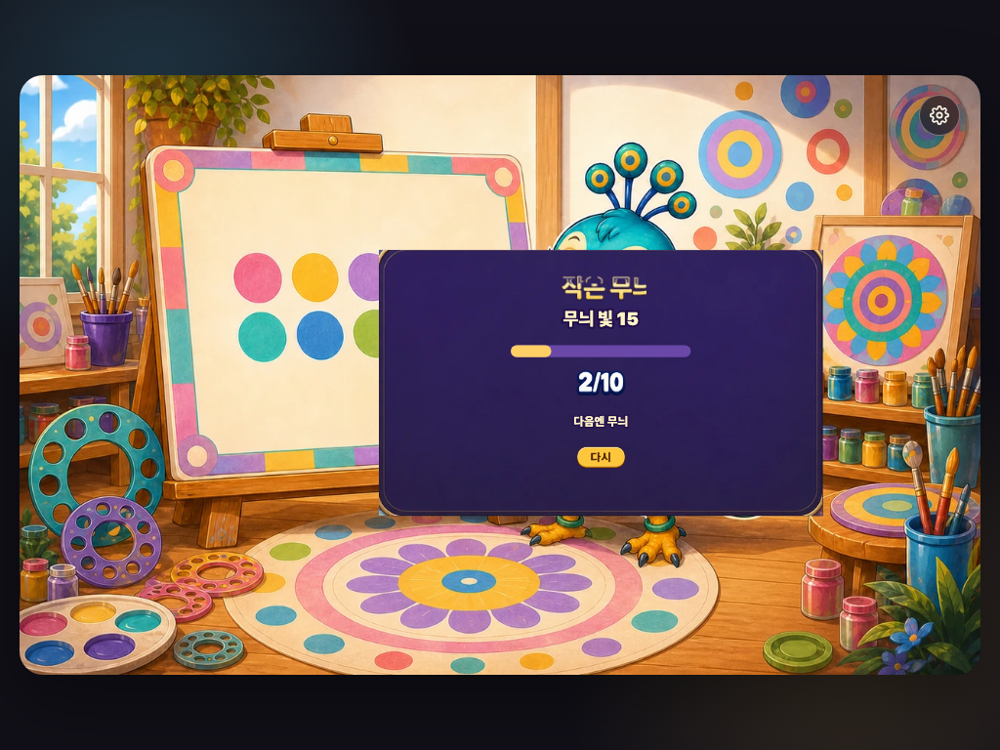

- 학생이 보는 것: 완성 장면과 결과 이름, 정답 수, 다음 목표, 다시 버튼을 봅니다.
- 판단하거나 누르는 것: 현재 결과와 다음 목표를 비교하고 다시 도전할지 결정합니다.
- 화면에서 확인되는 수학 관계: 한 판의 정답과 무늬 빛 변화가 하나의 결과 단계로 정리됩니다.
- 다음 상태로 넘어가는 이유: 다시를 누르면 새 문제 순서와 새 보상 흐름으로 시작합니다.

#### 결과판 포함 · big · `engine-flow-tablet-landscape-08d-result-panel-big.png`

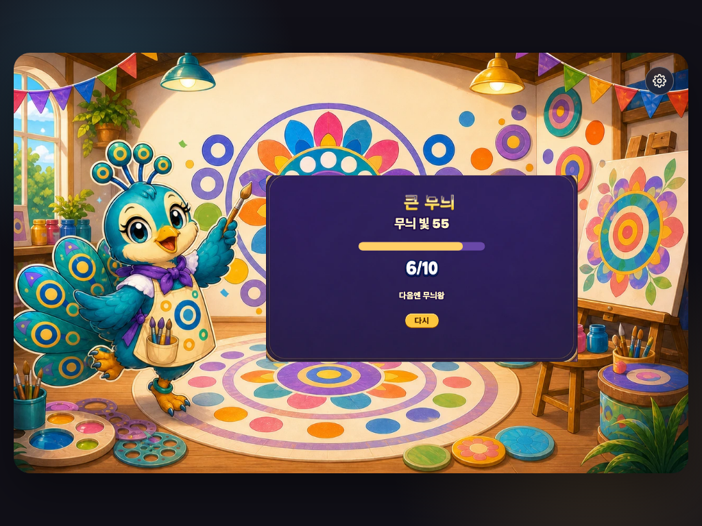

- 학생이 보는 것: 완성 장면과 결과 이름, 정답 수, 다음 목표, 다시 버튼을 봅니다.
- 판단하거나 누르는 것: 현재 결과와 다음 목표를 비교하고 다시 도전할지 결정합니다.
- 화면에서 확인되는 수학 관계: 한 판의 정답과 무늬 빛 변화가 하나의 결과 단계로 정리됩니다.
- 다음 상태로 넘어가는 이유: 다시를 누르면 새 문제 순서와 새 보상 흐름으로 시작합니다.

#### 결과판 포함 · design · `engine-flow-tablet-landscape-08d-result-panel-design.png`

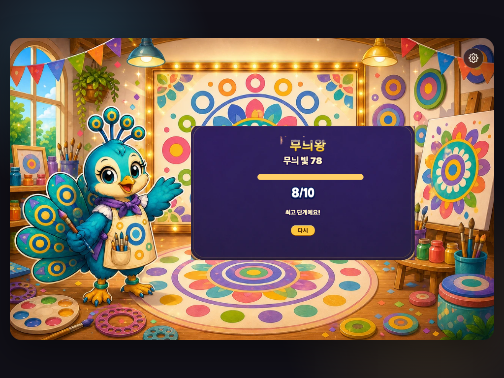

- 학생이 보는 것: 완성 장면과 결과 이름, 정답 수, 다음 목표, 다시 버튼을 봅니다.
- 판단하거나 누르는 것: 현재 결과와 다음 목표를 비교하고 다시 도전할지 결정합니다.
- 화면에서 확인되는 수학 관계: 한 판의 정답과 무늬 빛 변화가 하나의 결과 단계로 정리됩니다.
- 다음 상태로 넘어가는 이유: 다시를 누르면 새 문제 순서와 새 보상 흐름으로 시작합니다.

#### 결과판 포함 · dot · `engine-flow-tablet-landscape-08d-result-panel-dot.png`

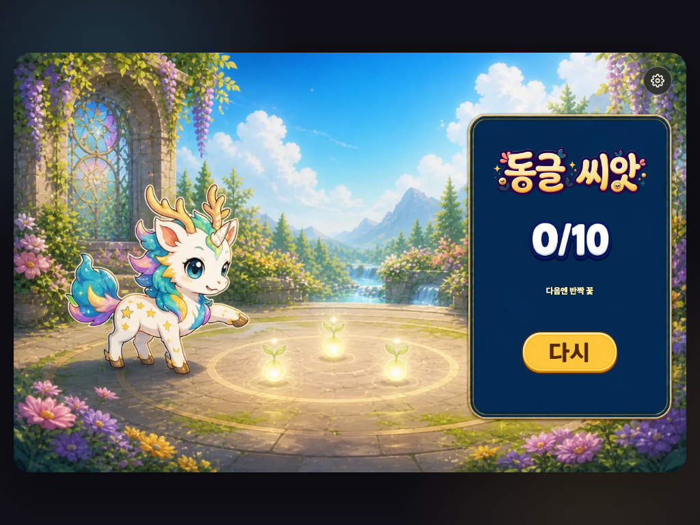

- 학생이 보는 것: 완성 장면과 결과 이름, 정답 수, 다음 목표, 다시 버튼을 봅니다.
- 판단하거나 누르는 것: 현재 결과와 다음 목표를 비교하고 다시 도전할지 결정합니다.
- 화면에서 확인되는 수학 관계: 한 판의 정답과 무늬 빛 변화가 하나의 결과 단계로 정리됩니다.
- 다음 상태로 넘어가는 이유: 다시를 누르면 새 문제 순서와 새 보상 흐름으로 시작합니다.

#### 결과판 포함 · pattern · `engine-flow-tablet-landscape-08d-result-panel-pattern.png`

- 학생이 보는 것: 완성 장면과 결과 이름, 정답 수, 다음 목표, 다시 버튼을 봅니다.
- 판단하거나 누르는 것: 현재 결과와 다음 목표를 비교하고 다시 도전할지 결정합니다.
- 화면에서 확인되는 수학 관계: 한 판의 정답과 무늬 빛 변화가 하나의 결과 단계로 정리됩니다.
- 다음 상태로 넘어가는 이유: 다시를 누르면 새 문제 순서와 새 보상 흐름으로 시작합니다.

#### 결과판 포함 · rainbow · `engine-flow-tablet-landscape-08d-result-panel-rainbow.png`

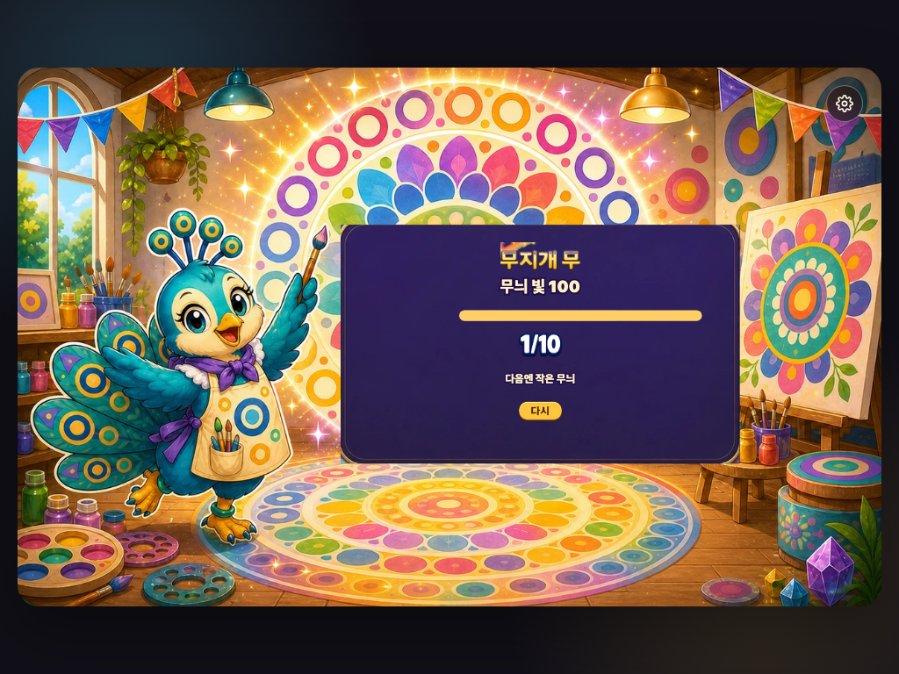

- 학생이 보는 것: 완성 장면과 결과 이름, 정답 수, 다음 목표, 다시 버튼을 봅니다.
- 판단하거나 누르는 것: 현재 결과와 다음 목표를 비교하고 다시 도전할지 결정합니다.
- 화면에서 확인되는 수학 관계: 한 판의 정답과 무늬 빛 변화가 하나의 결과 단계로 정리됩니다.
- 다음 상태로 넘어가는 이유: 다시를 누르면 새 문제 순서와 새 보상 흐름으로 시작합니다.

#### 결과판 포함 · small · `engine-flow-tablet-landscape-08d-result-panel-small.png`

- 학생이 보는 것: 완성 장면과 결과 이름, 정답 수, 다음 목표, 다시 버튼을 봅니다.
- 판단하거나 누르는 것: 현재 결과와 다음 목표를 비교하고 다시 도전할지 결정합니다.
- 화면에서 확인되는 수학 관계: 한 판의 정답과 무늬 빛 변화가 하나의 결과 단계로 정리됩니다.
- 다음 상태로 넘어가는 이유: 다시를 누르면 새 문제 순서와 새 보상 흐름으로 시작합니다.

### user-feedback-completion-1079x929 · 1079×929 · DPR 1 · 20장

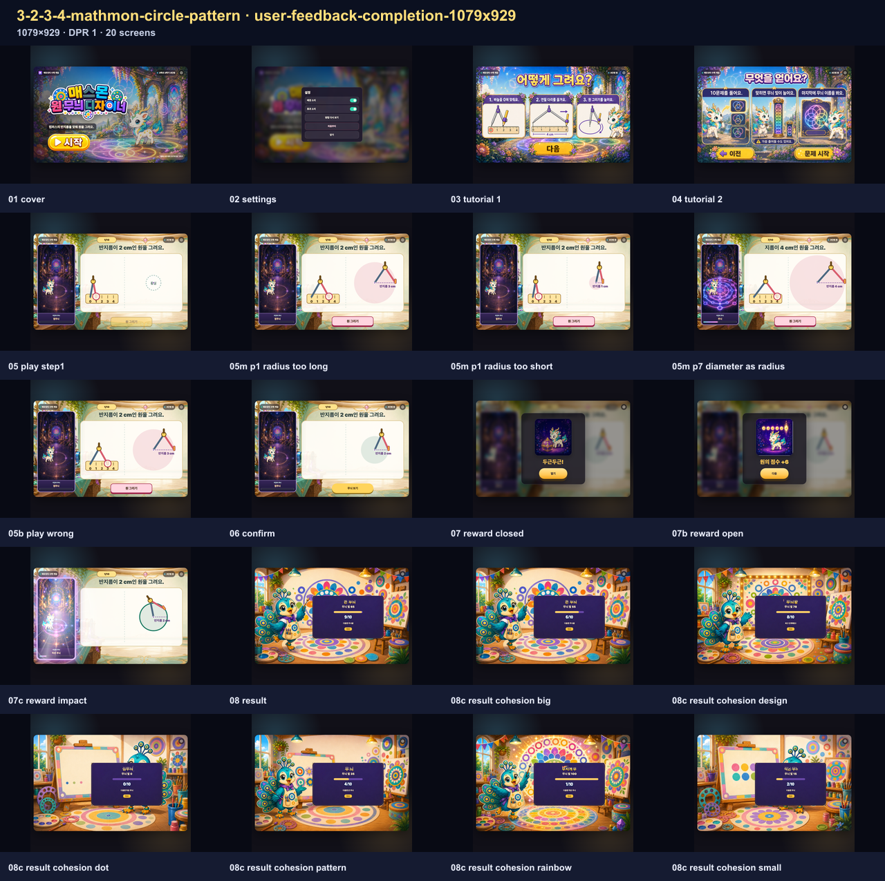

#### 시작 화면 · `engine-flow-user-feedback-completion-1079x929-01-cover.png`

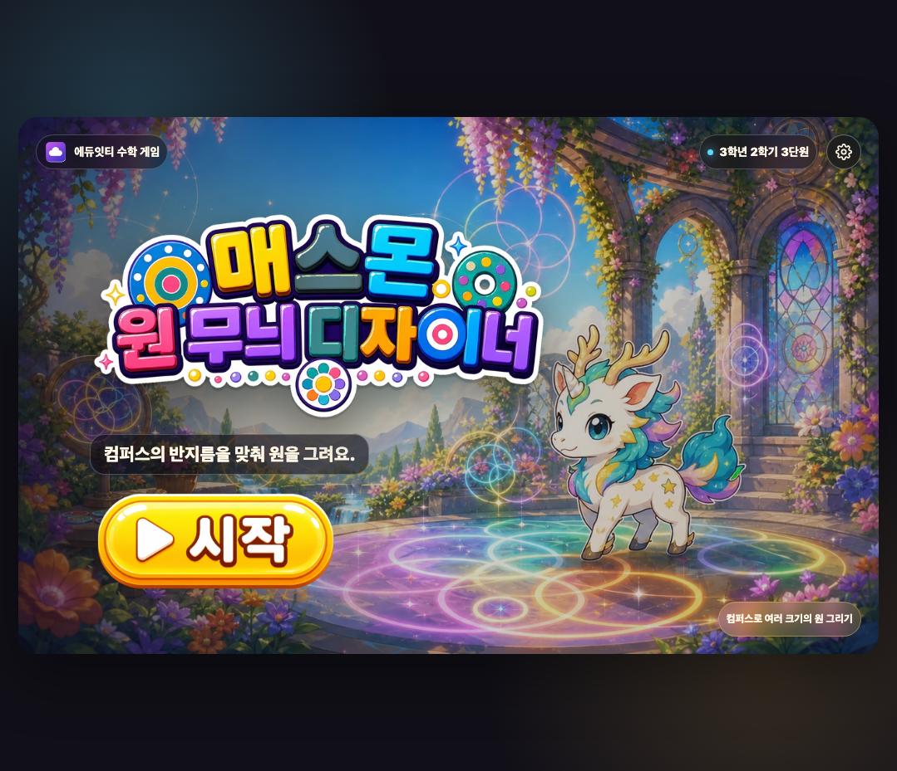

- 학생이 보는 것: 매스몬 원 무늬 디자이너 제목과 한 줄 목표, 시작 버튼을 봅니다.
- 판단하거나 누르는 것: 게임을 시작할 준비가 되면 시작을 누릅니다.
- 화면에서 확인되는 수학 관계: 컴퍼스로 여러 크기의 원 그리기을 배우는 차시임을 확인합니다.
- 다음 상태로 넘어가는 이유: 문제를 푸는 방법을 보는 설명 화면으로 이동합니다.

#### 설정 화면 · `engine-flow-user-feedback-completion-1079x929-02-settings.png`

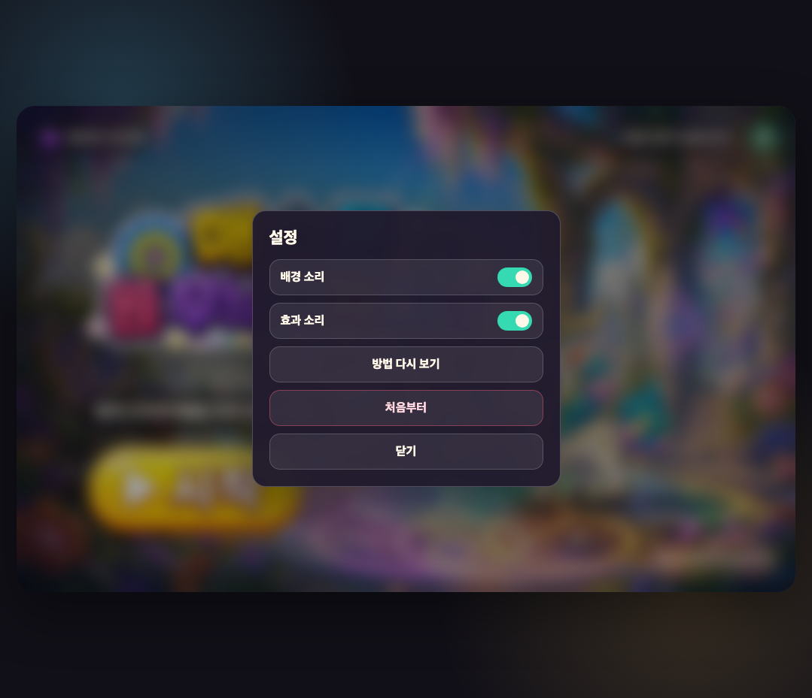

- 학생이 보는 것: 배경 소리·효과 소리와 방법 다시 보기, 처음부터, 닫기를 봅니다.
- 판단하거나 누르는 것: 필요한 소리나 이동 행동 하나를 고릅니다.
- 화면에서 확인되는 수학 관계: 수학 문제는 바꾸지 않고 게임 조작만 설정합니다.
- 다음 상태로 넘어가는 이유: 설정을 마치면 열기 전 화면으로 돌아갑니다.

#### 설명 1 · 풀이 방법 · `engine-flow-user-feedback-completion-1079x929-03-tutorial-1.png`

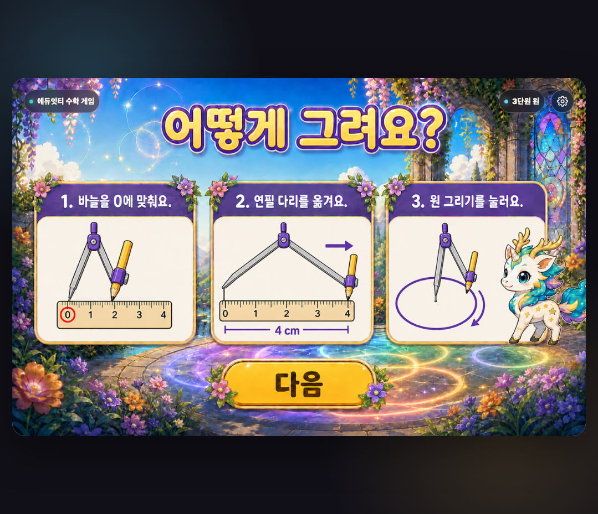

- 학생이 보는 것: 컴퍼스로 여러 크기의 원 그리기 문제를 푸는 방법과 게임 흐름을 그림으로 봅니다.
- 판단하거나 누르는 것: 그림 속 순서와 누를 곳을 확인한 뒤 다음 행동 버튼을 누릅니다.
- 화면에서 확인되는 수학 관계: 컴퍼스로 여러 크기의 원 그리기에서 무엇을 비교하거나 계산하는지 확인합니다.
- 다음 상태로 넘어가는 이유: 다음 설명으로 이동합니다.

#### 설명 2 · 보상과 목표 · `engine-flow-user-feedback-completion-1079x929-04-tutorial-2.png`

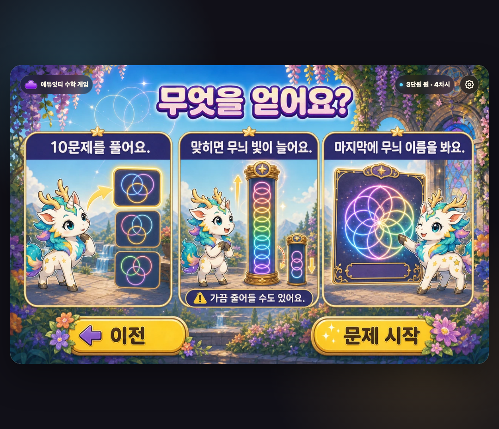

- 학생이 보는 것: 컴퍼스로 여러 크기의 원 그리기 문제를 푸는 방법과 게임 흐름을 그림으로 봅니다.
- 판단하거나 누르는 것: 그림 속 순서와 누를 곳을 확인한 뒤 다음 행동 버튼을 누릅니다.
- 화면에서 확인되는 수학 관계: 컴퍼스로 여러 크기의 원 그리기에서 무엇을 비교하거나 계산하는지 확인합니다.
- 다음 상태로 넘어가는 이유: 첫 문제로 이동합니다.

#### 문제 상태 · 05-play-step1 · `engine-flow-user-feedback-completion-1079x929-05-play-step1.png`

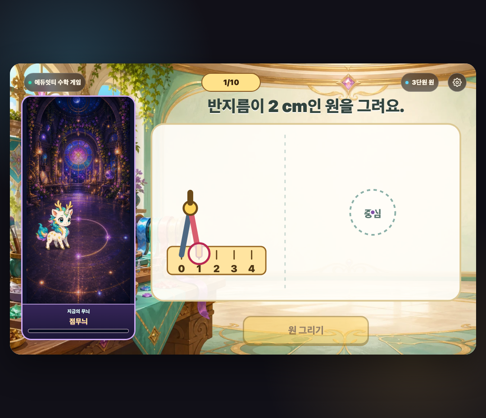

- 학생이 보는 것: 현재 문제, 핵심 계산판이나 물건, 고를 수 있는 답을 봅니다.
- 판단하거나 누르는 것: 문제에서 묻는 값이나 관계에 맞는 답 하나를 고릅니다.
- 화면에서 확인되는 수학 관계: 컴퍼스로 여러 크기의 원 그리기을 이용해 선택지를 판단합니다.
- 다음 상태로 넘어가는 이유: 고른 답에 따라 오답 또는 정답 확인 상태로 이동합니다.

#### 오개념 확인 · p1-radius-too-long · `engine-flow-user-feedback-completion-1079x929-05m-p1-radius-too-long.png`

- 학생이 보는 것: 고른 답이 계산판이나 물건에 들어간 모습과 짧은 오답 피드백을 봅니다.
- 판단하거나 누르는 것: 어디가 맞지 않는지 확인하고 같은 문제에서 다른 답을 고릅니다.
- 화면에서 확인되는 수학 관계: 컴퍼스로 여러 크기의 원 그리기의 관계와 고른 답이 왜 맞지 않는지 확인합니다.
- 다음 상태로 넘어가는 이유: 같은 문제에서 다시 판단할 수 있는 상태로 돌아갑니다.

#### 오개념 확인 · p1-radius-too-short · `engine-flow-user-feedback-completion-1079x929-05m-p1-radius-too-short.png`

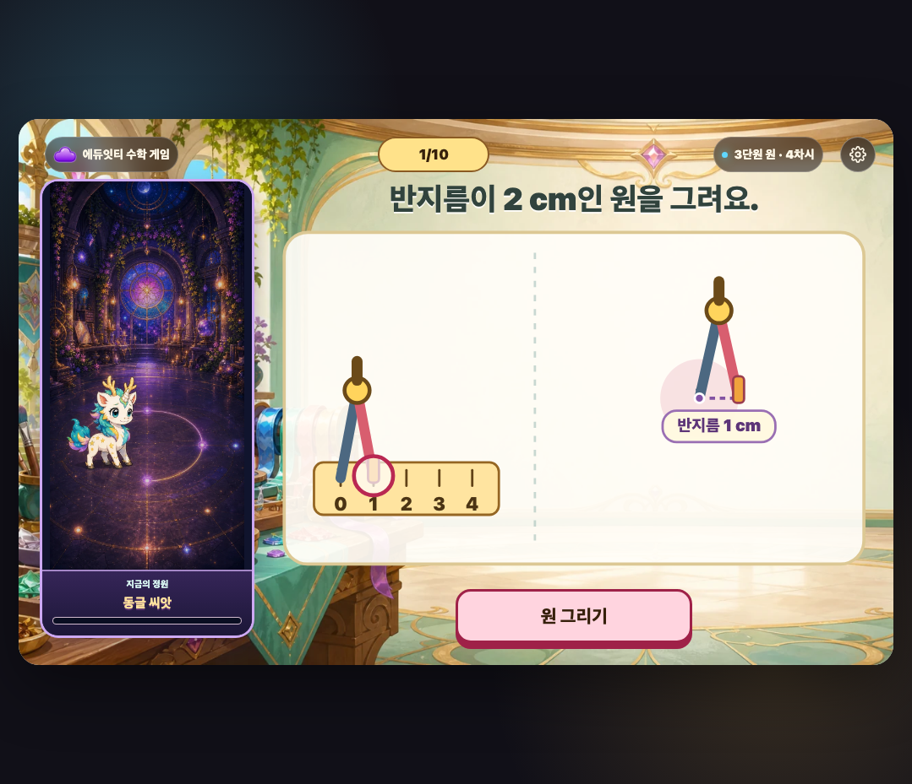

- 학생이 보는 것: 고른 답이 계산판이나 물건에 들어간 모습과 짧은 오답 피드백을 봅니다.
- 판단하거나 누르는 것: 어디가 맞지 않는지 확인하고 같은 문제에서 다른 답을 고릅니다.
- 화면에서 확인되는 수학 관계: 컴퍼스로 여러 크기의 원 그리기의 관계와 고른 답이 왜 맞지 않는지 확인합니다.
- 다음 상태로 넘어가는 이유: 같은 문제에서 다시 판단할 수 있는 상태로 돌아갑니다.

#### 오개념 확인 · p7-diameter-as-radius · `engine-flow-user-feedback-completion-1079x929-05m-p7-diameter-as-radius.png`

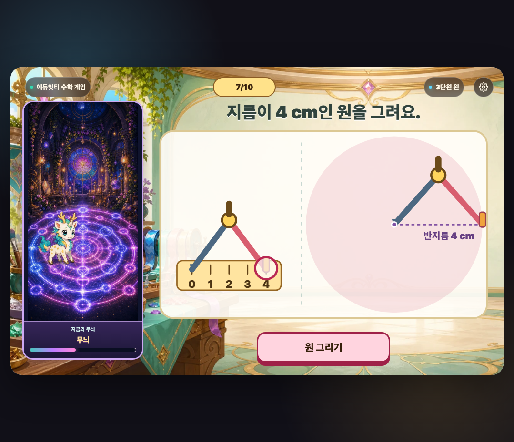

- 학생이 보는 것: 고른 답이 계산판이나 물건에 들어간 모습과 짧은 오답 피드백을 봅니다.
- 판단하거나 누르는 것: 어디가 맞지 않는지 확인하고 같은 문제에서 다른 답을 고릅니다.
- 화면에서 확인되는 수학 관계: 컴퍼스로 여러 크기의 원 그리기의 관계와 고른 답이 왜 맞지 않는지 확인합니다.
- 다음 상태로 넘어가는 이유: 같은 문제에서 다시 판단할 수 있는 상태로 돌아갑니다.

#### 오답 확인 · 05b-play-wrong · `engine-flow-user-feedback-completion-1079x929-05b-play-wrong.png`

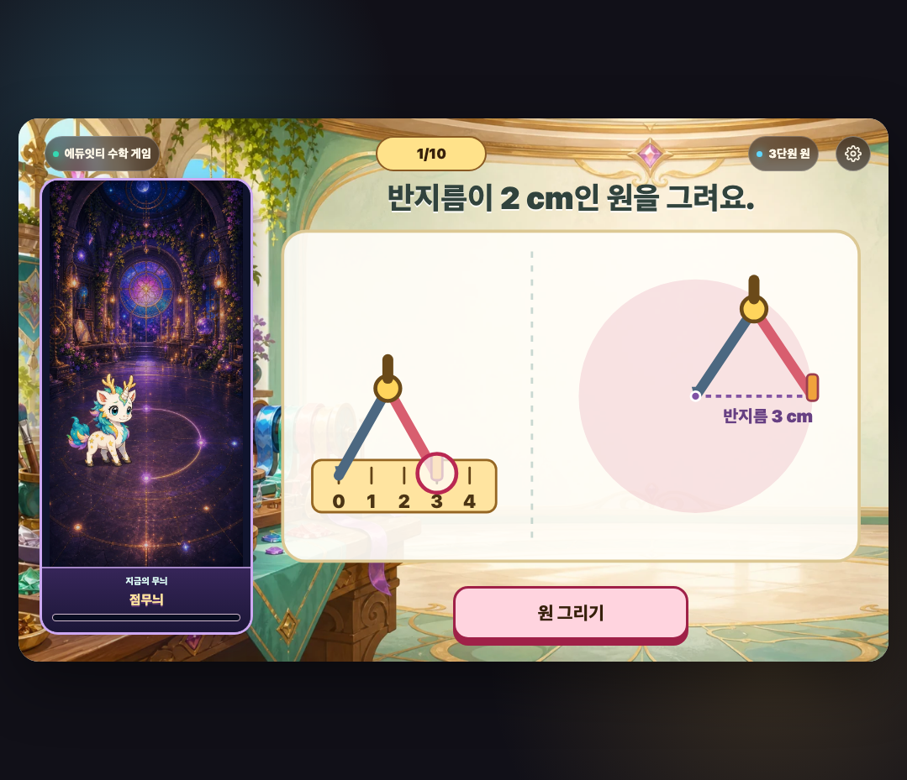

- 학생이 보는 것: 고른 답이 계산판이나 물건에 들어간 모습과 짧은 오답 피드백을 봅니다.
- 판단하거나 누르는 것: 어디가 맞지 않는지 확인하고 같은 문제에서 다른 답을 고릅니다.
- 화면에서 확인되는 수학 관계: 컴퍼스로 여러 크기의 원 그리기의 관계와 고른 답이 왜 맞지 않는지 확인합니다.
- 다음 상태로 넘어가는 이유: 같은 문제에서 다시 판단할 수 있는 상태로 돌아갑니다.

#### 마지막 확인 · 06-confirm · `engine-flow-user-feedback-completion-1079x929-06-confirm.png`

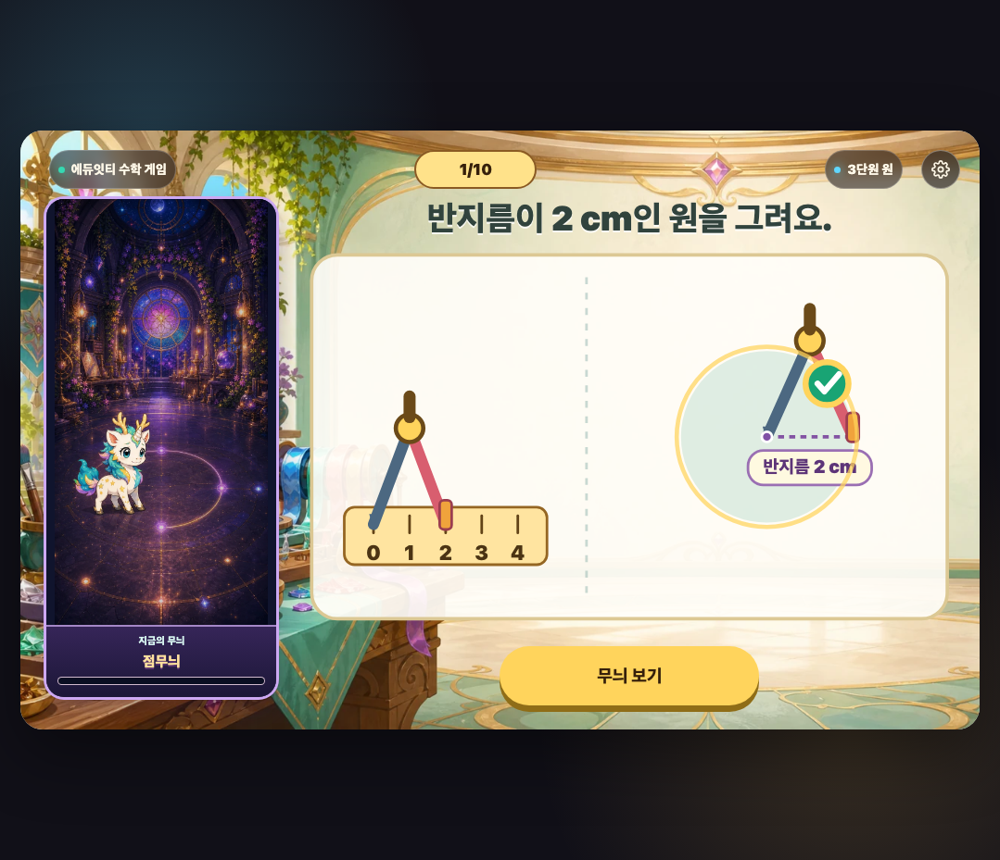

- 학생이 보는 것: 마지막으로 완성된 계산이나 값과 보상으로 가는 행동 버튼을 봅니다.
- 판단하거나 누르는 것: 완성된 관계를 읽은 뒤 보상 확인 버튼을 누릅니다.
- 화면에서 확인되는 수학 관계: 컴퍼스로 여러 크기의 원 그리기의 완성값을 보상 화면 전에 다시 확인합니다.
- 다음 상태로 넘어가는 이유: 수학 관계를 확인한 뒤 보상 상태로 이동합니다.

#### 닫힌 보상 · `engine-flow-user-feedback-completion-1079x929-07-reward-closed.png`

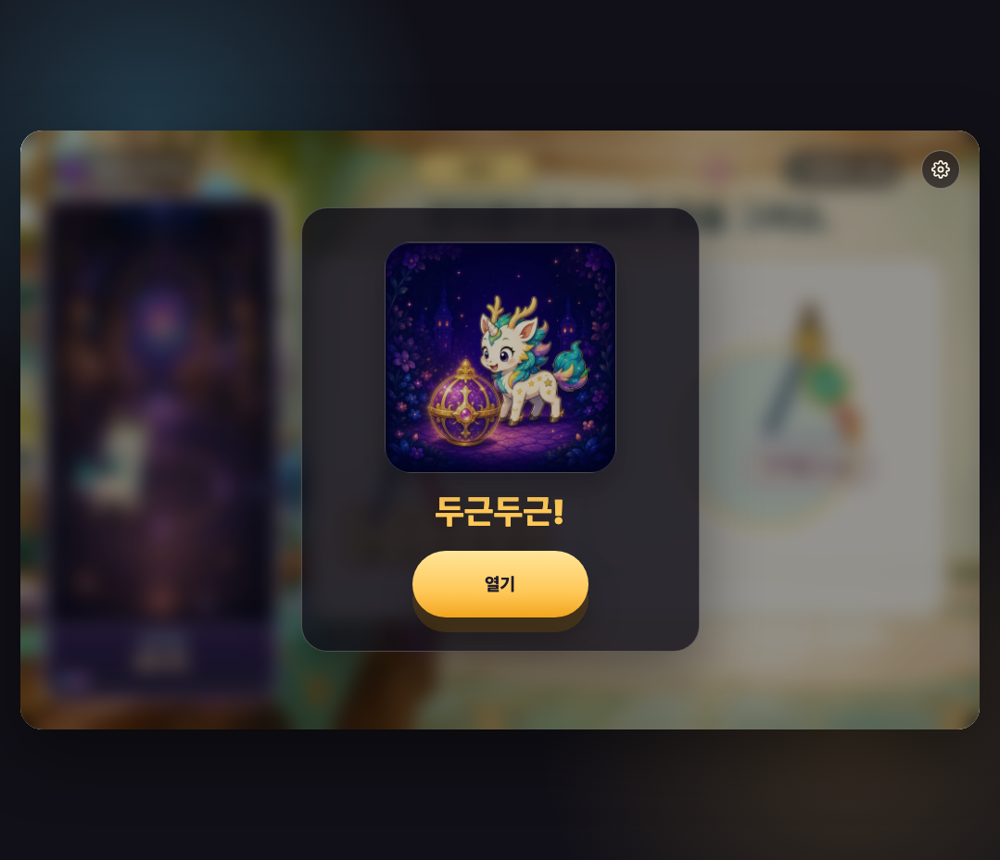

- 학생이 보는 것: 결과가 아직 드러나지 않은 보상 그림과 열기 버튼을 봅니다.
- 판단하거나 누르는 것: 이번 무늬 빛 변화를 확인하기 위해 열기를 누릅니다.
- 화면에서 확인되는 수학 관계: 뒤 문제 화면에는 방금 완성한 계산이나 관계가 그대로 남습니다.
- 다음 상태로 넘어가는 이유: 학생이 직접 연 뒤에만 이번 보상 사건이 공개됩니다.

#### 열린 보상 · `engine-flow-user-feedback-completion-1079x929-07b-reward-open.png`

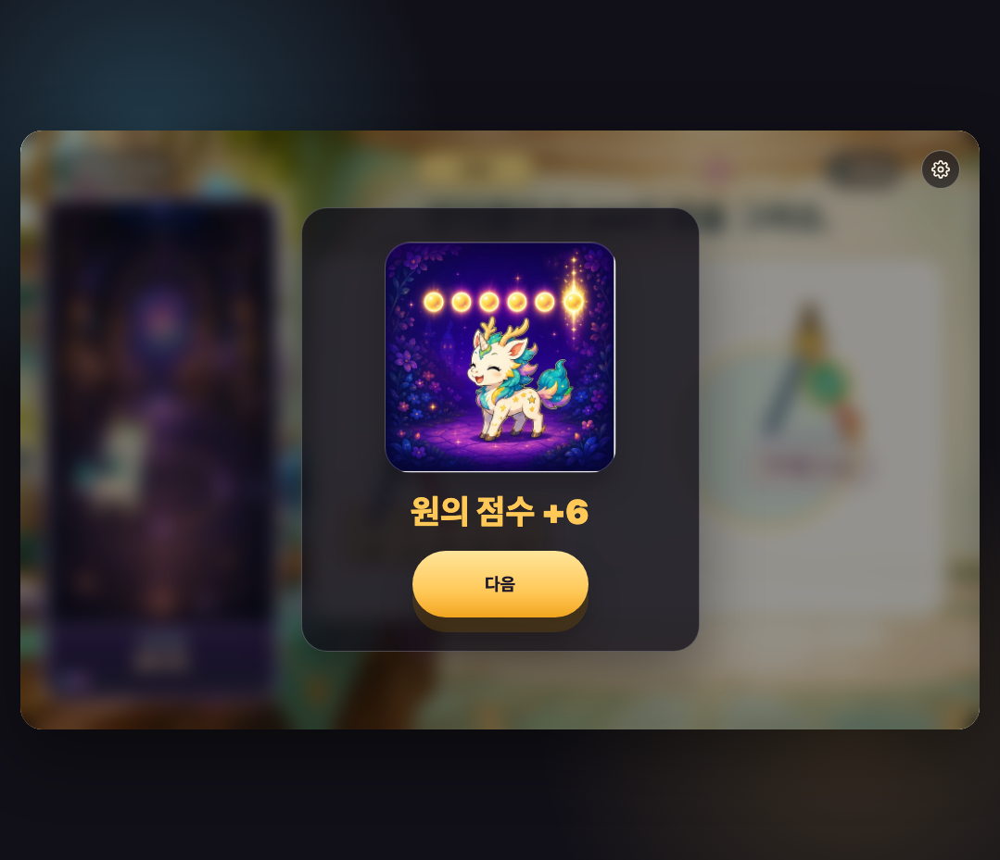

- 학생이 보는 것: 보상 사건 그림과 이번 무늬 빛 변화, 다음 행동 버튼을 봅니다.
- 판단하거나 누르는 것: 이번 변화를 확인하고 다음을 누릅니다.
- 화면에서 확인되는 수학 관계: 수학 정답과 무작위 보상 변화가 서로 분리되어 있음을 확인합니다.
- 다음 상태로 넘어가는 이유: 현재 진행 장면의 변화를 본 뒤 다음 문제나 결과로 이동합니다.

#### 보상 뒤 변화 · 07c-reward-impact · `engine-flow-user-feedback-completion-1079x929-07c-reward-impact.png`

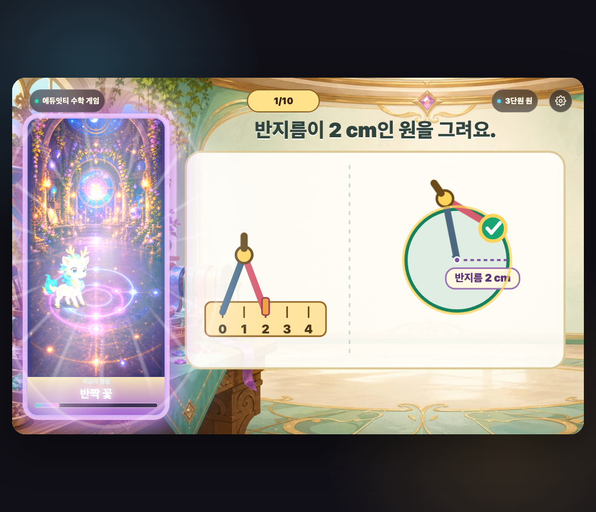

- 학생이 보는 것: 보상 모달이 닫힌 뒤 현재 진행 장면과 무늬 빛 변화가 반영되는 모습을 봅니다.
- 판단하거나 누르는 것: 별도 입력 없이 이번 보상이 진행 단계에 반영되는 모습을 확인합니다.
- 화면에서 확인되는 수학 관계: 한 문제의 보상이 현재 진행값에 정확히 한 번 반영됩니다.
- 다음 상태로 넘어가는 이유: 효과를 충분히 본 뒤 다음 문제 또는 결과로 이동합니다.

#### 실제 결과 · `engine-flow-user-feedback-completion-1079x929-08-result.png`

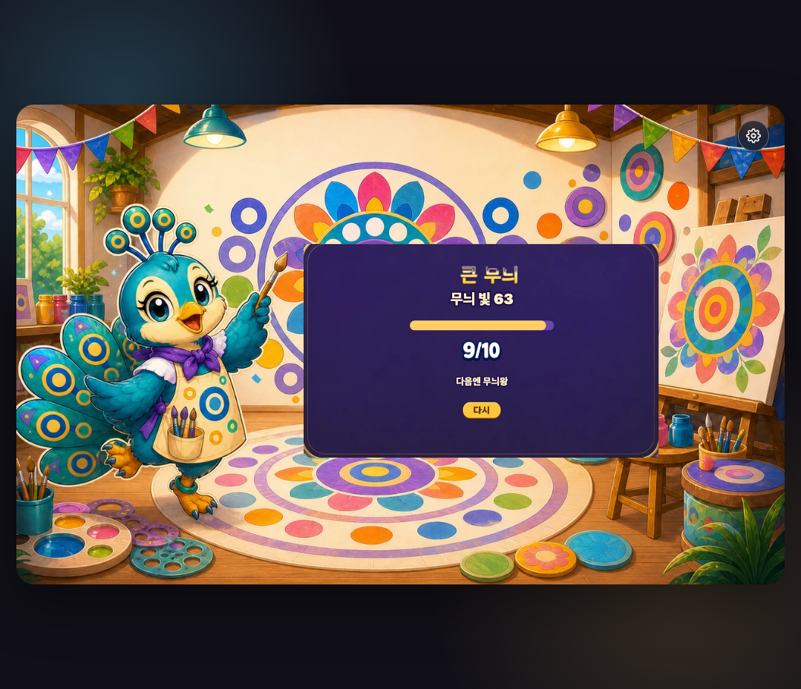

- 학생이 보는 것: 완성 장면과 결과 이름, 정답 수, 다음 목표, 다시 버튼을 봅니다.
- 판단하거나 누르는 것: 현재 결과와 다음 목표를 비교하고 다시 도전할지 결정합니다.
- 화면에서 확인되는 수학 관계: 한 판의 정답과 무늬 빛 변화가 하나의 결과 단계로 정리됩니다.
- 다음 상태로 넘어가는 이유: 다시를 누르면 새 문제 순서와 새 보상 흐름으로 시작합니다.

#### 결과 결속 · big · `engine-flow-user-feedback-completion-1079x929-08c-result-cohesion-big.png`

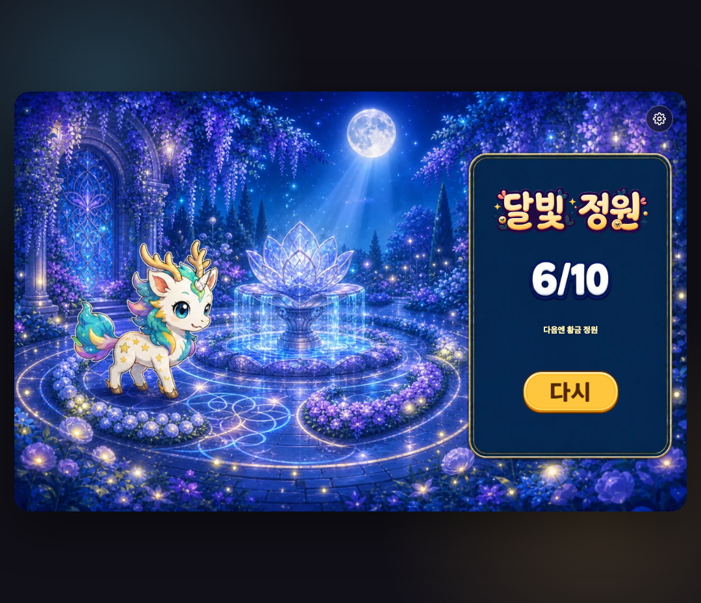

- 학생이 보는 것: 완성 장면과 결과 이름, 정답 수, 다음 목표, 다시 버튼을 봅니다.
- 판단하거나 누르는 것: 현재 결과와 다음 목표를 비교하고 다시 도전할지 결정합니다.
- 화면에서 확인되는 수학 관계: 한 판의 정답과 무늬 빛 변화가 하나의 결과 단계로 정리됩니다.
- 다음 상태로 넘어가는 이유: 다시를 누르면 새 문제 순서와 새 보상 흐름으로 시작합니다.

#### 결과 결속 · design · `engine-flow-user-feedback-completion-1079x929-08c-result-cohesion-design.png`

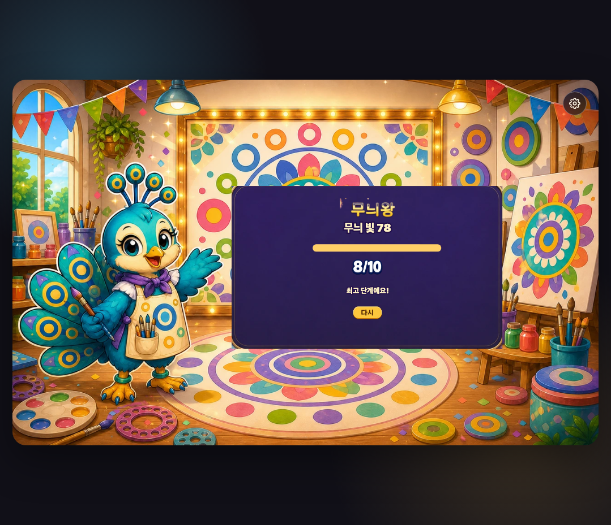

- 학생이 보는 것: 완성 장면과 결과 이름, 정답 수, 다음 목표, 다시 버튼을 봅니다.
- 판단하거나 누르는 것: 현재 결과와 다음 목표를 비교하고 다시 도전할지 결정합니다.
- 화면에서 확인되는 수학 관계: 한 판의 정답과 무늬 빛 변화가 하나의 결과 단계로 정리됩니다.
- 다음 상태로 넘어가는 이유: 다시를 누르면 새 문제 순서와 새 보상 흐름으로 시작합니다.

#### 결과 결속 · dot · `engine-flow-user-feedback-completion-1079x929-08c-result-cohesion-dot.png`

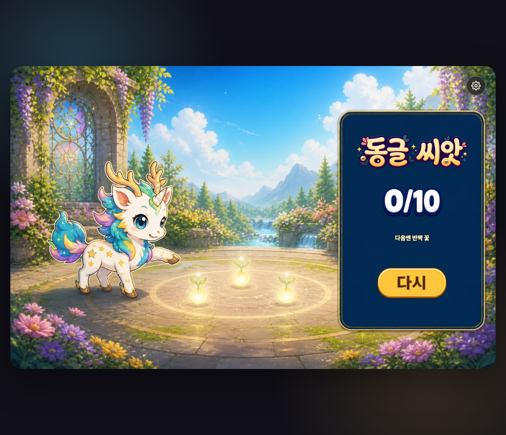

- 학생이 보는 것: 완성 장면과 결과 이름, 정답 수, 다음 목표, 다시 버튼을 봅니다.
- 판단하거나 누르는 것: 현재 결과와 다음 목표를 비교하고 다시 도전할지 결정합니다.
- 화면에서 확인되는 수학 관계: 한 판의 정답과 무늬 빛 변화가 하나의 결과 단계로 정리됩니다.
- 다음 상태로 넘어가는 이유: 다시를 누르면 새 문제 순서와 새 보상 흐름으로 시작합니다.

#### 결과 결속 · pattern · `engine-flow-user-feedback-completion-1079x929-08c-result-cohesion-pattern.png`

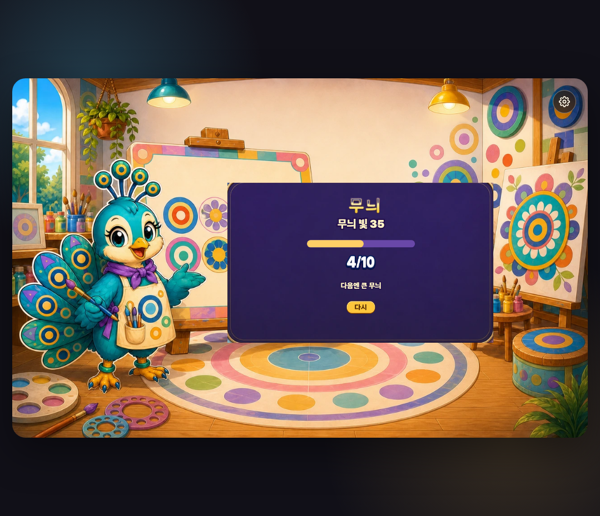

- 학생이 보는 것: 완성 장면과 결과 이름, 정답 수, 다음 목표, 다시 버튼을 봅니다.
- 판단하거나 누르는 것: 현재 결과와 다음 목표를 비교하고 다시 도전할지 결정합니다.
- 화면에서 확인되는 수학 관계: 한 판의 정답과 무늬 빛 변화가 하나의 결과 단계로 정리됩니다.
- 다음 상태로 넘어가는 이유: 다시를 누르면 새 문제 순서와 새 보상 흐름으로 시작합니다.

#### 결과 결속 · rainbow · `engine-flow-user-feedback-completion-1079x929-08c-result-cohesion-rainbow.png`

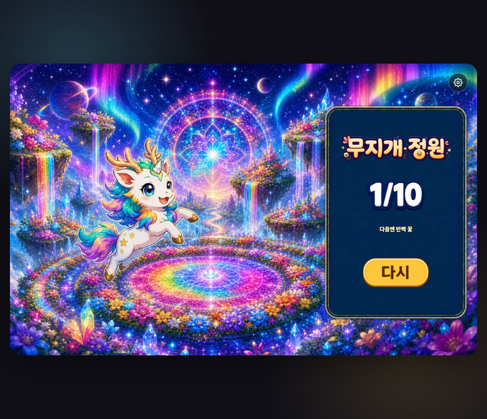

- 학생이 보는 것: 완성 장면과 결과 이름, 정답 수, 다음 목표, 다시 버튼을 봅니다.
- 판단하거나 누르는 것: 현재 결과와 다음 목표를 비교하고 다시 도전할지 결정합니다.
- 화면에서 확인되는 수학 관계: 한 판의 정답과 무늬 빛 변화가 하나의 결과 단계로 정리됩니다.
- 다음 상태로 넘어가는 이유: 다시를 누르면 새 문제 순서와 새 보상 흐름으로 시작합니다.

#### 결과 결속 · small · `engine-flow-user-feedback-completion-1079x929-08c-result-cohesion-small.png`

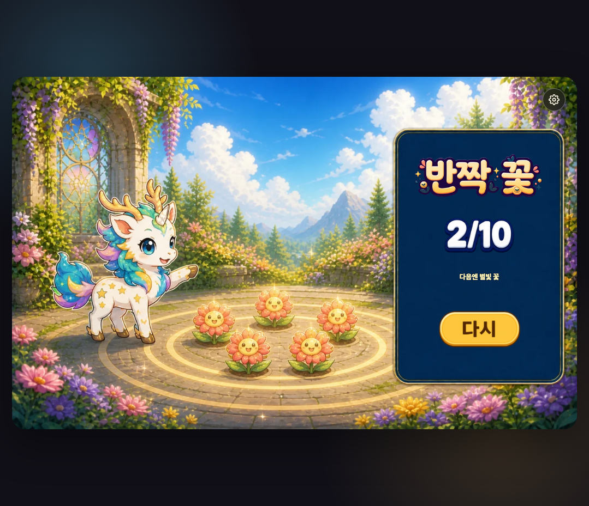

- 학생이 보는 것: 완성 장면과 결과 이름, 정답 수, 다음 목표, 다시 버튼을 봅니다.
- 판단하거나 누르는 것: 현재 결과와 다음 목표를 비교하고 다시 도전할지 결정합니다.
- 화면에서 확인되는 수학 관계: 한 판의 정답과 무늬 빛 변화가 하나의 결과 단계로 정리됩니다.
- 다음 상태로 넘어가는 이유: 다시를 누르면 새 문제 순서와 새 보상 흐름으로 시작합니다.

### codex-in-app · 1280×720 · DPR 2 · 29장

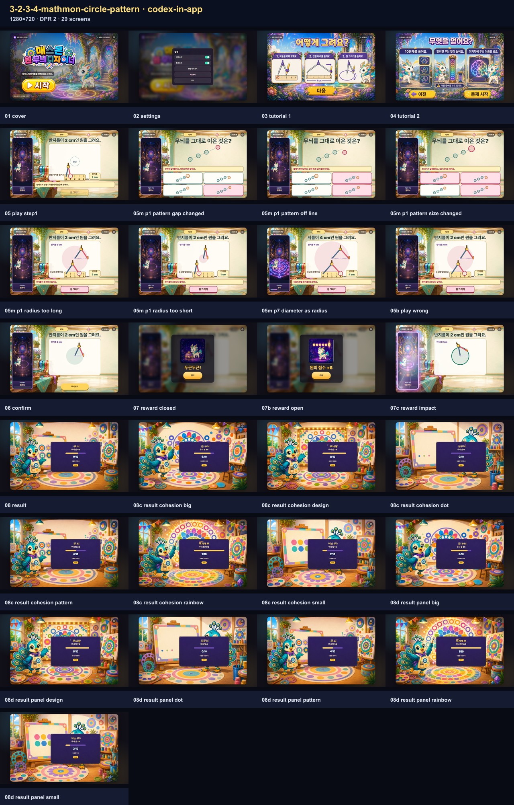

#### 시작 화면 · `engine-flow-codex-in-app-01-cover.png`

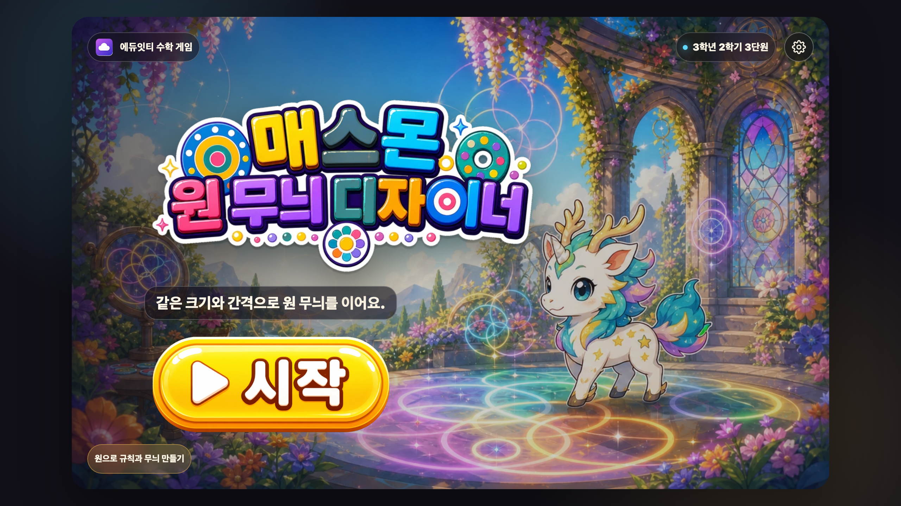

- 학생이 보는 것: 매스몬 원 무늬 디자이너 제목과 한 줄 목표, 시작 버튼을 봅니다.
- 판단하거나 누르는 것: 게임을 시작할 준비가 되면 시작을 누릅니다.
- 화면에서 확인되는 수학 관계: 컴퍼스로 여러 크기의 원 그리기을 배우는 차시임을 확인합니다.
- 다음 상태로 넘어가는 이유: 문제를 푸는 방법을 보는 설명 화면으로 이동합니다.

#### 설정 화면 · `engine-flow-codex-in-app-02-settings.png`

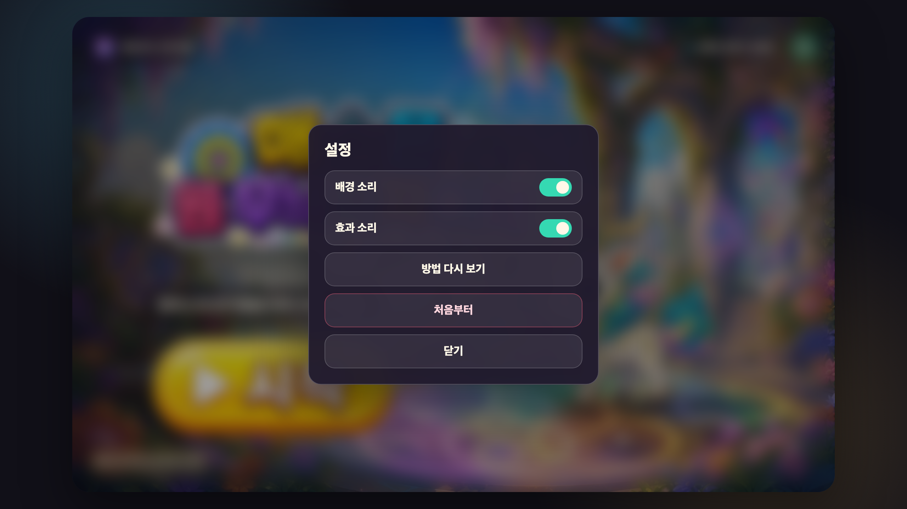

- 학생이 보는 것: 배경 소리·효과 소리와 방법 다시 보기, 처음부터, 닫기를 봅니다.
- 판단하거나 누르는 것: 필요한 소리나 이동 행동 하나를 고릅니다.
- 화면에서 확인되는 수학 관계: 수학 문제는 바꾸지 않고 게임 조작만 설정합니다.
- 다음 상태로 넘어가는 이유: 설정을 마치면 열기 전 화면으로 돌아갑니다.

#### 설명 1 · 풀이 방법 · `engine-flow-codex-in-app-03-tutorial-1.png`

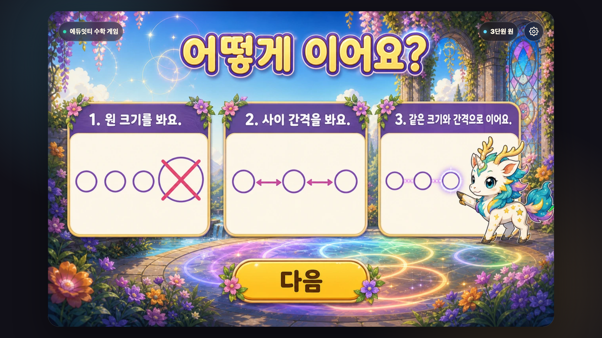

- 학생이 보는 것: 컴퍼스로 여러 크기의 원 그리기 문제를 푸는 방법과 게임 흐름을 그림으로 봅니다.
- 판단하거나 누르는 것: 그림 속 순서와 누를 곳을 확인한 뒤 다음 행동 버튼을 누릅니다.
- 화면에서 확인되는 수학 관계: 컴퍼스로 여러 크기의 원 그리기에서 무엇을 비교하거나 계산하는지 확인합니다.
- 다음 상태로 넘어가는 이유: 다음 설명으로 이동합니다.

#### 설명 2 · 보상과 목표 · `engine-flow-codex-in-app-04-tutorial-2.png`

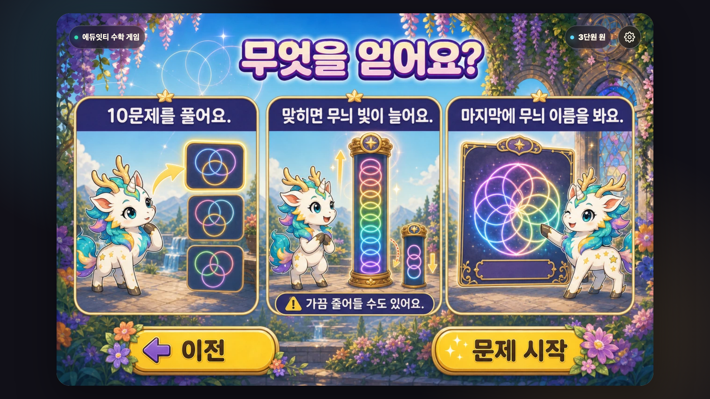

- 학생이 보는 것: 컴퍼스로 여러 크기의 원 그리기 문제를 푸는 방법과 게임 흐름을 그림으로 봅니다.
- 판단하거나 누르는 것: 그림 속 순서와 누를 곳을 확인한 뒤 다음 행동 버튼을 누릅니다.
- 화면에서 확인되는 수학 관계: 컴퍼스로 여러 크기의 원 그리기에서 무엇을 비교하거나 계산하는지 확인합니다.
- 다음 상태로 넘어가는 이유: 첫 문제로 이동합니다.

#### 문제 상태 · 05-play-step1 · `engine-flow-codex-in-app-05-play-step1.png`

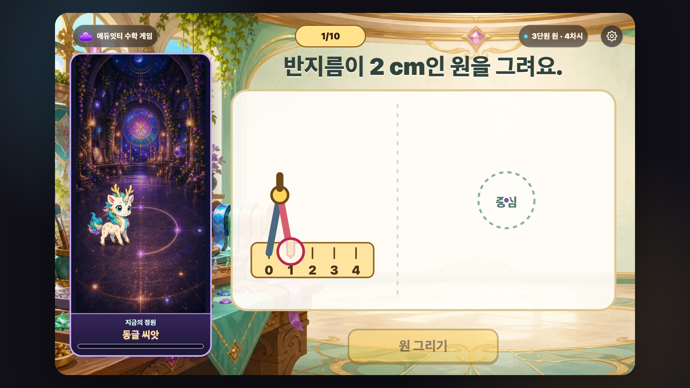

- 학생이 보는 것: 현재 문제, 핵심 계산판이나 물건, 고를 수 있는 답을 봅니다.
- 판단하거나 누르는 것: 문제에서 묻는 값이나 관계에 맞는 답 하나를 고릅니다.
- 화면에서 확인되는 수학 관계: 컴퍼스로 여러 크기의 원 그리기을 이용해 선택지를 판단합니다.
- 다음 상태로 넘어가는 이유: 고른 답에 따라 오답 또는 정답 확인 상태로 이동합니다.

#### 오개념 확인 · p1-pattern-gap-changed · `engine-flow-codex-in-app-05m-p1-pattern-gap-changed.png`

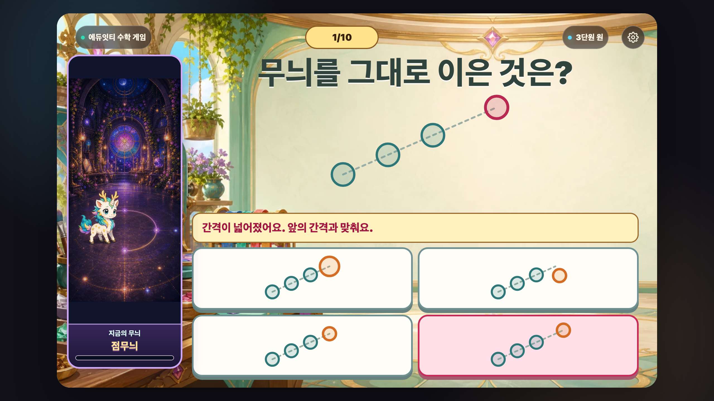

- 학생이 보는 것: 고른 답이 계산판이나 물건에 들어간 모습과 짧은 오답 피드백을 봅니다.
- 판단하거나 누르는 것: 어디가 맞지 않는지 확인하고 같은 문제에서 다른 답을 고릅니다.
- 화면에서 확인되는 수학 관계: 컴퍼스로 여러 크기의 원 그리기의 관계와 고른 답이 왜 맞지 않는지 확인합니다.
- 다음 상태로 넘어가는 이유: 같은 문제에서 다시 판단할 수 있는 상태로 돌아갑니다.

#### 오개념 확인 · p1-pattern-off-line · `engine-flow-codex-in-app-05m-p1-pattern-off-line.png`

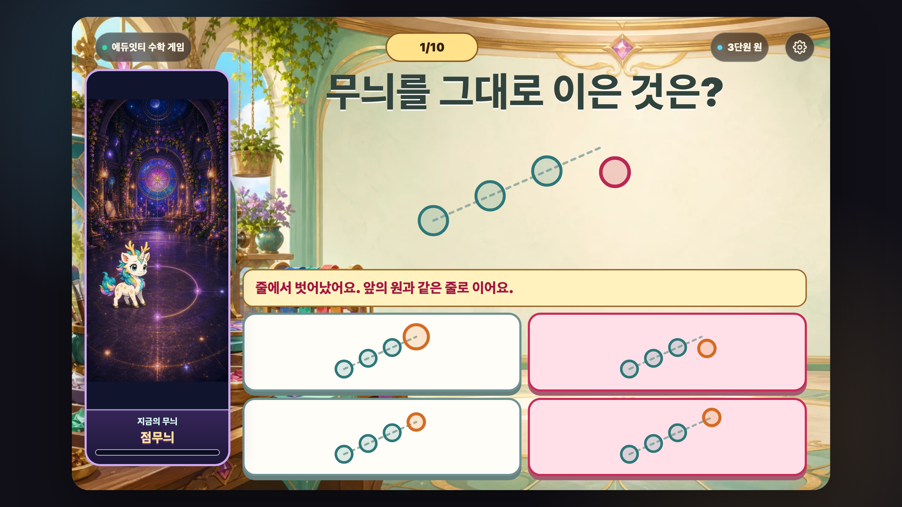

- 학생이 보는 것: 고른 답이 계산판이나 물건에 들어간 모습과 짧은 오답 피드백을 봅니다.
- 판단하거나 누르는 것: 어디가 맞지 않는지 확인하고 같은 문제에서 다른 답을 고릅니다.
- 화면에서 확인되는 수학 관계: 컴퍼스로 여러 크기의 원 그리기의 관계와 고른 답이 왜 맞지 않는지 확인합니다.
- 다음 상태로 넘어가는 이유: 같은 문제에서 다시 판단할 수 있는 상태로 돌아갑니다.

#### 오개념 확인 · p1-pattern-size-changed · `engine-flow-codex-in-app-05m-p1-pattern-size-changed.png`

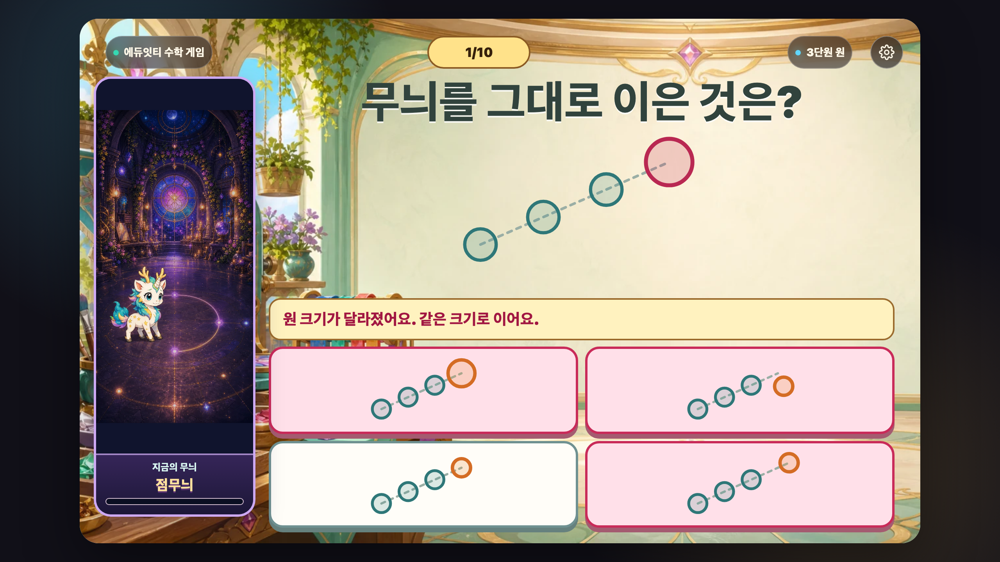

- 학생이 보는 것: 고른 답이 계산판이나 물건에 들어간 모습과 짧은 오답 피드백을 봅니다.
- 판단하거나 누르는 것: 어디가 맞지 않는지 확인하고 같은 문제에서 다른 답을 고릅니다.
- 화면에서 확인되는 수학 관계: 컴퍼스로 여러 크기의 원 그리기의 관계와 고른 답이 왜 맞지 않는지 확인합니다.
- 다음 상태로 넘어가는 이유: 같은 문제에서 다시 판단할 수 있는 상태로 돌아갑니다.

#### 오개념 확인 · p1-radius-too-long · `engine-flow-codex-in-app-05m-p1-radius-too-long.png`

- 학생이 보는 것: 고른 답이 계산판이나 물건에 들어간 모습과 짧은 오답 피드백을 봅니다.
- 판단하거나 누르는 것: 어디가 맞지 않는지 확인하고 같은 문제에서 다른 답을 고릅니다.
- 화면에서 확인되는 수학 관계: 컴퍼스로 여러 크기의 원 그리기의 관계와 고른 답이 왜 맞지 않는지 확인합니다.
- 다음 상태로 넘어가는 이유: 같은 문제에서 다시 판단할 수 있는 상태로 돌아갑니다.

#### 오개념 확인 · p1-radius-too-short · `engine-flow-codex-in-app-05m-p1-radius-too-short.png`

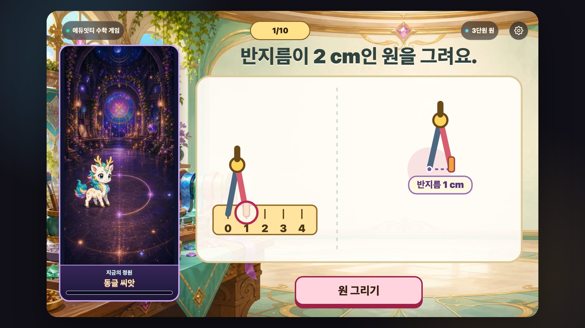

- 학생이 보는 것: 고른 답이 계산판이나 물건에 들어간 모습과 짧은 오답 피드백을 봅니다.
- 판단하거나 누르는 것: 어디가 맞지 않는지 확인하고 같은 문제에서 다른 답을 고릅니다.
- 화면에서 확인되는 수학 관계: 컴퍼스로 여러 크기의 원 그리기의 관계와 고른 답이 왜 맞지 않는지 확인합니다.
- 다음 상태로 넘어가는 이유: 같은 문제에서 다시 판단할 수 있는 상태로 돌아갑니다.

#### 오개념 확인 · p7-diameter-as-radius · `engine-flow-codex-in-app-05m-p7-diameter-as-radius.png`

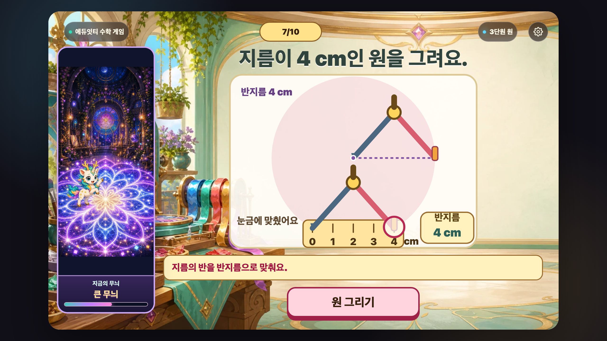

- 학생이 보는 것: 고른 답이 계산판이나 물건에 들어간 모습과 짧은 오답 피드백을 봅니다.
- 판단하거나 누르는 것: 어디가 맞지 않는지 확인하고 같은 문제에서 다른 답을 고릅니다.
- 화면에서 확인되는 수학 관계: 컴퍼스로 여러 크기의 원 그리기의 관계와 고른 답이 왜 맞지 않는지 확인합니다.
- 다음 상태로 넘어가는 이유: 같은 문제에서 다시 판단할 수 있는 상태로 돌아갑니다.

#### 오답 확인 · 05b-play-wrong · `engine-flow-codex-in-app-05b-play-wrong.png`

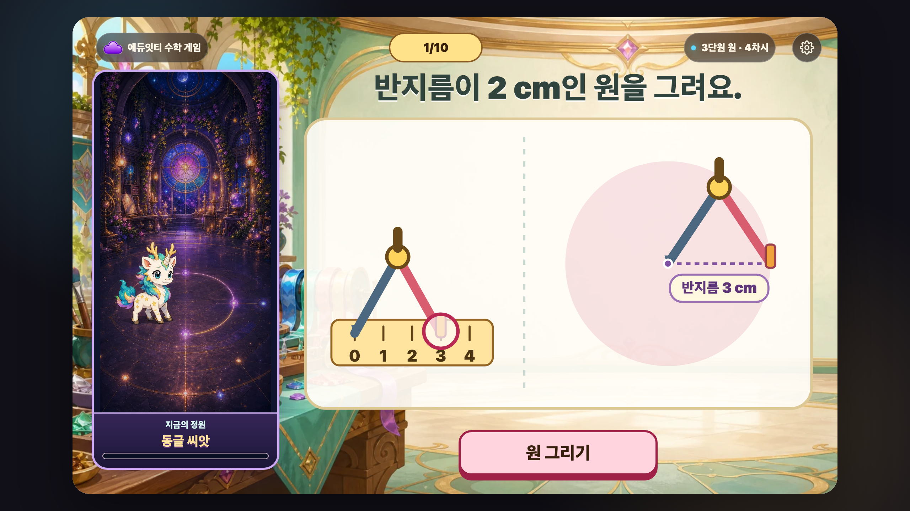

- 학생이 보는 것: 고른 답이 계산판이나 물건에 들어간 모습과 짧은 오답 피드백을 봅니다.
- 판단하거나 누르는 것: 어디가 맞지 않는지 확인하고 같은 문제에서 다른 답을 고릅니다.
- 화면에서 확인되는 수학 관계: 컴퍼스로 여러 크기의 원 그리기의 관계와 고른 답이 왜 맞지 않는지 확인합니다.
- 다음 상태로 넘어가는 이유: 같은 문제에서 다시 판단할 수 있는 상태로 돌아갑니다.

#### 마지막 확인 · 06-confirm · `engine-flow-codex-in-app-06-confirm.png`

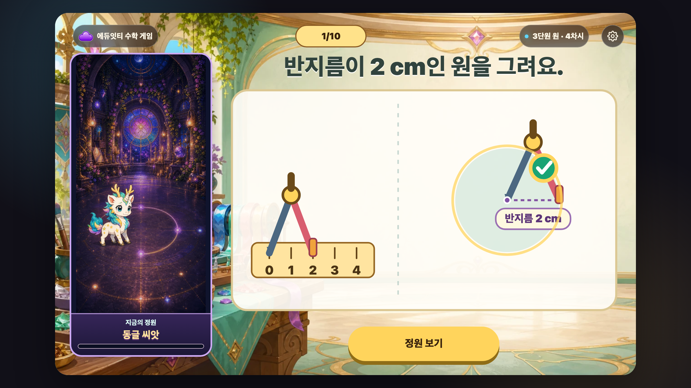

- 학생이 보는 것: 마지막으로 완성된 계산이나 값과 보상으로 가는 행동 버튼을 봅니다.
- 판단하거나 누르는 것: 완성된 관계를 읽은 뒤 보상 확인 버튼을 누릅니다.
- 화면에서 확인되는 수학 관계: 컴퍼스로 여러 크기의 원 그리기의 완성값을 보상 화면 전에 다시 확인합니다.
- 다음 상태로 넘어가는 이유: 수학 관계를 확인한 뒤 보상 상태로 이동합니다.

#### 닫힌 보상 · `engine-flow-codex-in-app-07-reward-closed.png`

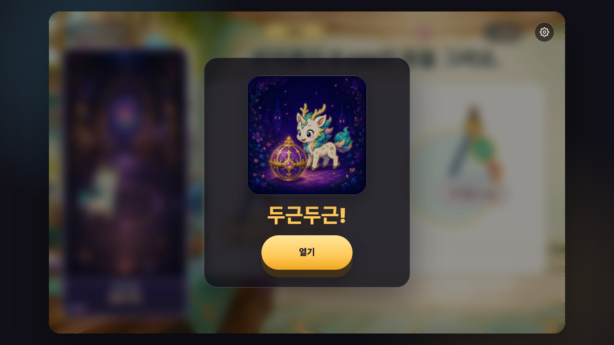

- 학생이 보는 것: 결과가 아직 드러나지 않은 보상 그림과 열기 버튼을 봅니다.
- 판단하거나 누르는 것: 이번 무늬 빛 변화를 확인하기 위해 열기를 누릅니다.
- 화면에서 확인되는 수학 관계: 뒤 문제 화면에는 방금 완성한 계산이나 관계가 그대로 남습니다.
- 다음 상태로 넘어가는 이유: 학생이 직접 연 뒤에만 이번 보상 사건이 공개됩니다.

#### 열린 보상 · `engine-flow-codex-in-app-07b-reward-open.png`

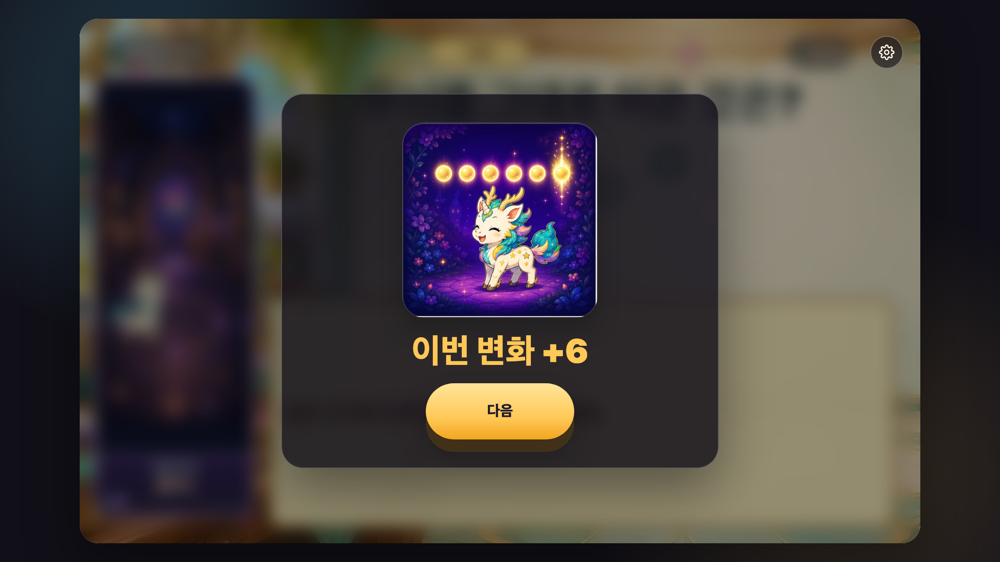

- 학생이 보는 것: 보상 사건 그림과 이번 무늬 빛 변화, 다음 행동 버튼을 봅니다.
- 판단하거나 누르는 것: 이번 변화를 확인하고 다음을 누릅니다.
- 화면에서 확인되는 수학 관계: 수학 정답과 무작위 보상 변화가 서로 분리되어 있음을 확인합니다.
- 다음 상태로 넘어가는 이유: 현재 진행 장면의 변화를 본 뒤 다음 문제나 결과로 이동합니다.

#### 보상 뒤 변화 · 07c-reward-impact · `engine-flow-codex-in-app-07c-reward-impact.png`

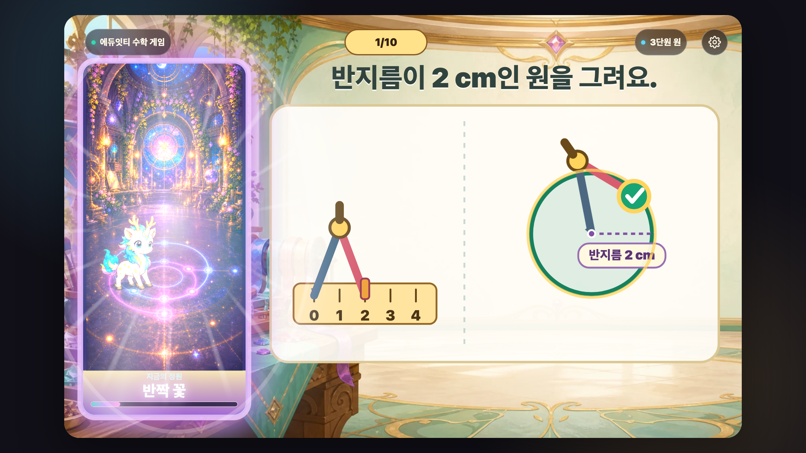

- 학생이 보는 것: 보상 모달이 닫힌 뒤 현재 진행 장면과 무늬 빛 변화가 반영되는 모습을 봅니다.
- 판단하거나 누르는 것: 별도 입력 없이 이번 보상이 진행 단계에 반영되는 모습을 확인합니다.
- 화면에서 확인되는 수학 관계: 한 문제의 보상이 현재 진행값에 정확히 한 번 반영됩니다.
- 다음 상태로 넘어가는 이유: 효과를 충분히 본 뒤 다음 문제 또는 결과로 이동합니다.

#### 실제 결과 · `engine-flow-codex-in-app-08-result.png`

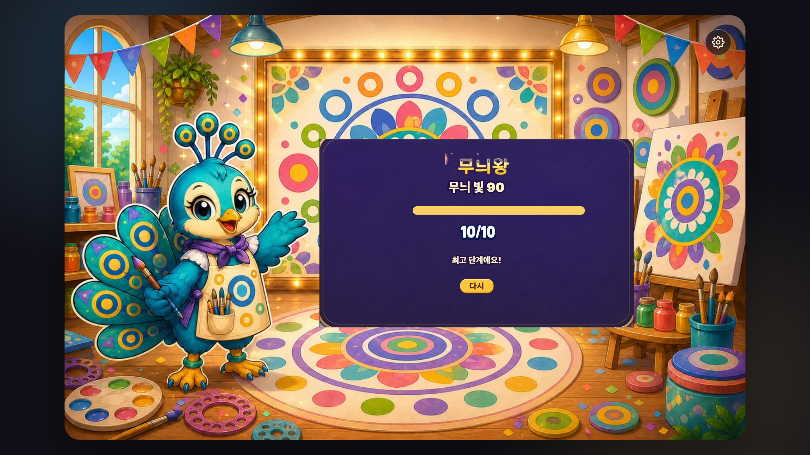

- 학생이 보는 것: 완성 장면과 결과 이름, 정답 수, 다음 목표, 다시 버튼을 봅니다.
- 판단하거나 누르는 것: 현재 결과와 다음 목표를 비교하고 다시 도전할지 결정합니다.
- 화면에서 확인되는 수학 관계: 한 판의 정답과 무늬 빛 변화가 하나의 결과 단계로 정리됩니다.
- 다음 상태로 넘어가는 이유: 다시를 누르면 새 문제 순서와 새 보상 흐름으로 시작합니다.

#### 결과 결속 · big · `engine-flow-codex-in-app-08c-result-cohesion-big.png`

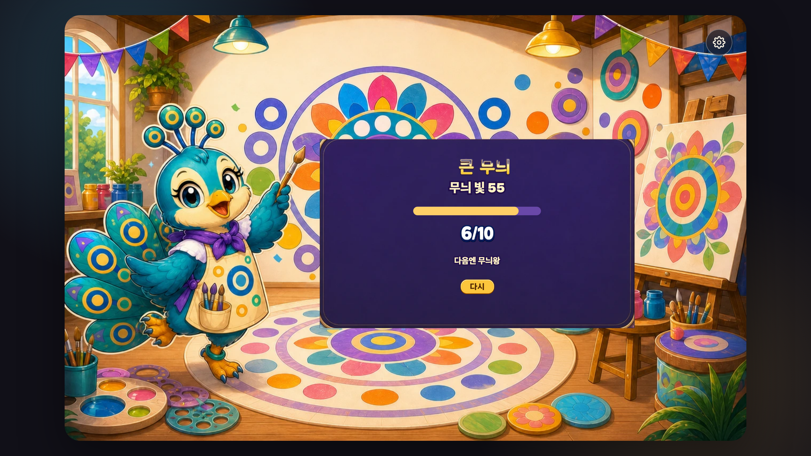

- 학생이 보는 것: 완성 장면과 결과 이름, 정답 수, 다음 목표, 다시 버튼을 봅니다.
- 판단하거나 누르는 것: 현재 결과와 다음 목표를 비교하고 다시 도전할지 결정합니다.
- 화면에서 확인되는 수학 관계: 한 판의 정답과 무늬 빛 변화가 하나의 결과 단계로 정리됩니다.
- 다음 상태로 넘어가는 이유: 다시를 누르면 새 문제 순서와 새 보상 흐름으로 시작합니다.

#### 결과 결속 · design · `engine-flow-codex-in-app-08c-result-cohesion-design.png`

- 학생이 보는 것: 완성 장면과 결과 이름, 정답 수, 다음 목표, 다시 버튼을 봅니다.
- 판단하거나 누르는 것: 현재 결과와 다음 목표를 비교하고 다시 도전할지 결정합니다.
- 화면에서 확인되는 수학 관계: 한 판의 정답과 무늬 빛 변화가 하나의 결과 단계로 정리됩니다.
- 다음 상태로 넘어가는 이유: 다시를 누르면 새 문제 순서와 새 보상 흐름으로 시작합니다.

#### 결과 결속 · dot · `engine-flow-codex-in-app-08c-result-cohesion-dot.png`

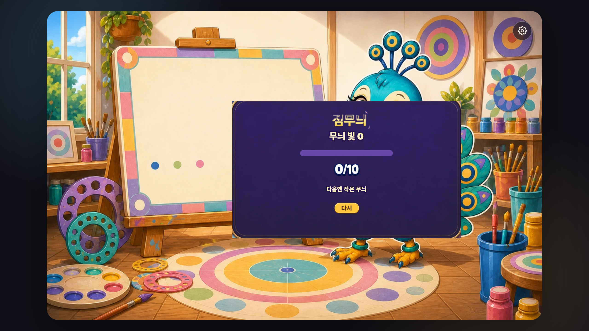

- 학생이 보는 것: 완성 장면과 결과 이름, 정답 수, 다음 목표, 다시 버튼을 봅니다.
- 판단하거나 누르는 것: 현재 결과와 다음 목표를 비교하고 다시 도전할지 결정합니다.
- 화면에서 확인되는 수학 관계: 한 판의 정답과 무늬 빛 변화가 하나의 결과 단계로 정리됩니다.
- 다음 상태로 넘어가는 이유: 다시를 누르면 새 문제 순서와 새 보상 흐름으로 시작합니다.

#### 결과 결속 · pattern · `engine-flow-codex-in-app-08c-result-cohesion-pattern.png`

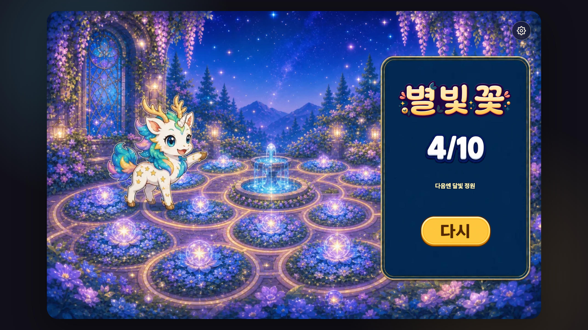

- 학생이 보는 것: 완성 장면과 결과 이름, 정답 수, 다음 목표, 다시 버튼을 봅니다.
- 판단하거나 누르는 것: 현재 결과와 다음 목표를 비교하고 다시 도전할지 결정합니다.
- 화면에서 확인되는 수학 관계: 한 판의 정답과 무늬 빛 변화가 하나의 결과 단계로 정리됩니다.
- 다음 상태로 넘어가는 이유: 다시를 누르면 새 문제 순서와 새 보상 흐름으로 시작합니다.

#### 결과 결속 · rainbow · `engine-flow-codex-in-app-08c-result-cohesion-rainbow.png`

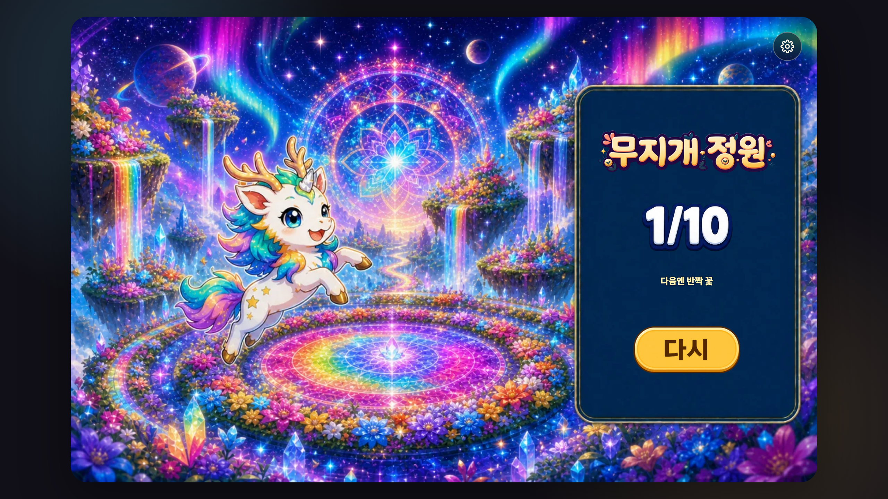

- 학생이 보는 것: 완성 장면과 결과 이름, 정답 수, 다음 목표, 다시 버튼을 봅니다.
- 판단하거나 누르는 것: 현재 결과와 다음 목표를 비교하고 다시 도전할지 결정합니다.
- 화면에서 확인되는 수학 관계: 한 판의 정답과 무늬 빛 변화가 하나의 결과 단계로 정리됩니다.
- 다음 상태로 넘어가는 이유: 다시를 누르면 새 문제 순서와 새 보상 흐름으로 시작합니다.

#### 결과 결속 · small · `engine-flow-codex-in-app-08c-result-cohesion-small.png`

- 학생이 보는 것: 완성 장면과 결과 이름, 정답 수, 다음 목표, 다시 버튼을 봅니다.
- 판단하거나 누르는 것: 현재 결과와 다음 목표를 비교하고 다시 도전할지 결정합니다.
- 화면에서 확인되는 수학 관계: 한 판의 정답과 무늬 빛 변화가 하나의 결과 단계로 정리됩니다.
- 다음 상태로 넘어가는 이유: 다시를 누르면 새 문제 순서와 새 보상 흐름으로 시작합니다.

#### 결과판 포함 · big · `engine-flow-codex-in-app-08d-result-panel-big.png`

- 학생이 보는 것: 완성 장면과 결과 이름, 정답 수, 다음 목표, 다시 버튼을 봅니다.
- 판단하거나 누르는 것: 현재 결과와 다음 목표를 비교하고 다시 도전할지 결정합니다.
- 화면에서 확인되는 수학 관계: 한 판의 정답과 무늬 빛 변화가 하나의 결과 단계로 정리됩니다.
- 다음 상태로 넘어가는 이유: 다시를 누르면 새 문제 순서와 새 보상 흐름으로 시작합니다.

#### 결과판 포함 · design · `engine-flow-codex-in-app-08d-result-panel-design.png`

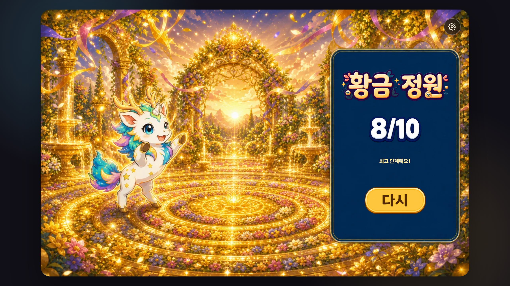

- 학생이 보는 것: 완성 장면과 결과 이름, 정답 수, 다음 목표, 다시 버튼을 봅니다.
- 판단하거나 누르는 것: 현재 결과와 다음 목표를 비교하고 다시 도전할지 결정합니다.
- 화면에서 확인되는 수학 관계: 한 판의 정답과 무늬 빛 변화가 하나의 결과 단계로 정리됩니다.
- 다음 상태로 넘어가는 이유: 다시를 누르면 새 문제 순서와 새 보상 흐름으로 시작합니다.

#### 결과판 포함 · dot · `engine-flow-codex-in-app-08d-result-panel-dot.png`

- 학생이 보는 것: 완성 장면과 결과 이름, 정답 수, 다음 목표, 다시 버튼을 봅니다.
- 판단하거나 누르는 것: 현재 결과와 다음 목표를 비교하고 다시 도전할지 결정합니다.
- 화면에서 확인되는 수학 관계: 한 판의 정답과 무늬 빛 변화가 하나의 결과 단계로 정리됩니다.
- 다음 상태로 넘어가는 이유: 다시를 누르면 새 문제 순서와 새 보상 흐름으로 시작합니다.

#### 결과판 포함 · pattern · `engine-flow-codex-in-app-08d-result-panel-pattern.png`

- 학생이 보는 것: 완성 장면과 결과 이름, 정답 수, 다음 목표, 다시 버튼을 봅니다.
- 판단하거나 누르는 것: 현재 결과와 다음 목표를 비교하고 다시 도전할지 결정합니다.
- 화면에서 확인되는 수학 관계: 한 판의 정답과 무늬 빛 변화가 하나의 결과 단계로 정리됩니다.
- 다음 상태로 넘어가는 이유: 다시를 누르면 새 문제 순서와 새 보상 흐름으로 시작합니다.

#### 결과판 포함 · rainbow · `engine-flow-codex-in-app-08d-result-panel-rainbow.png`

- 학생이 보는 것: 완성 장면과 결과 이름, 정답 수, 다음 목표, 다시 버튼을 봅니다.
- 판단하거나 누르는 것: 현재 결과와 다음 목표를 비교하고 다시 도전할지 결정합니다.
- 화면에서 확인되는 수학 관계: 한 판의 정답과 무늬 빛 변화가 하나의 결과 단계로 정리됩니다.
- 다음 상태로 넘어가는 이유: 다시를 누르면 새 문제 순서와 새 보상 흐름으로 시작합니다.

#### 결과판 포함 · small · `engine-flow-codex-in-app-08d-result-panel-small.png`

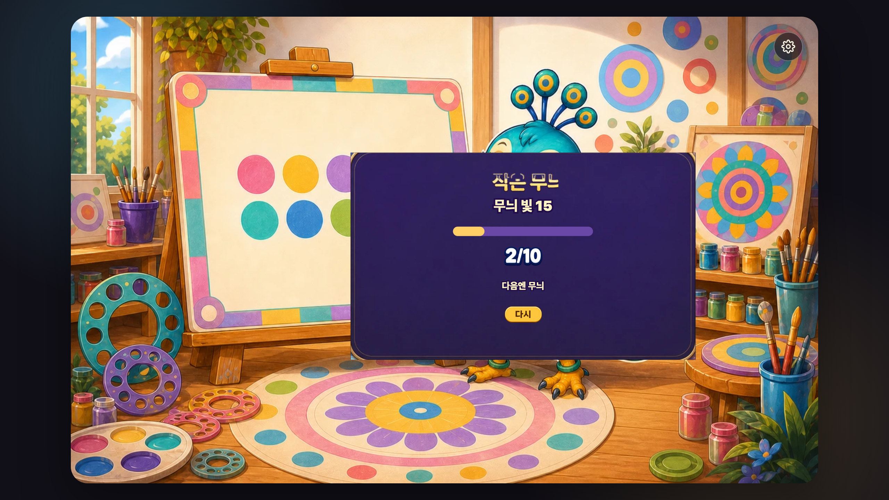

- 학생이 보는 것: 완성 장면과 결과 이름, 정답 수, 다음 목표, 다시 버튼을 봅니다.
- 판단하거나 누르는 것: 현재 결과와 다음 목표를 비교하고 다시 도전할지 결정합니다.
- 화면에서 확인되는 수학 관계: 한 판의 정답과 무늬 빛 변화가 하나의 결과 단계로 정리됩니다.
- 다음 상태로 넘어가는 이유: 다시를 누르면 새 문제 순서와 새 보상 흐름으로 시작합니다.

### user-visibility-994x632 · 994×632 · DPR 1 · 29장

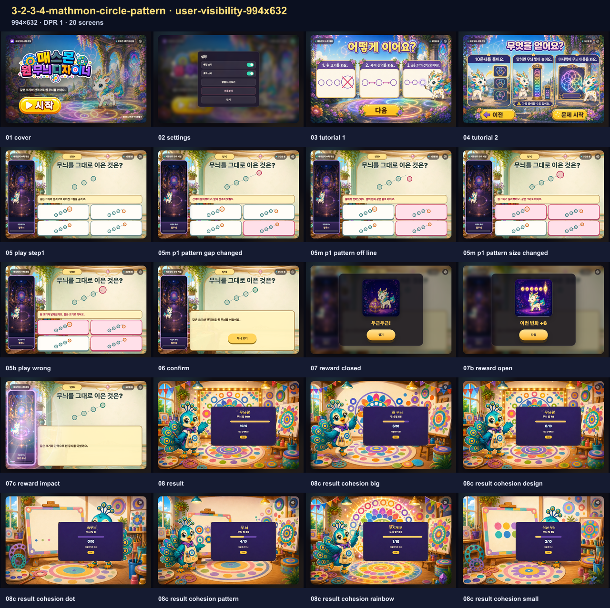

#### 시작 화면 · `engine-flow-user-visibility-994x632-01-cover.png`

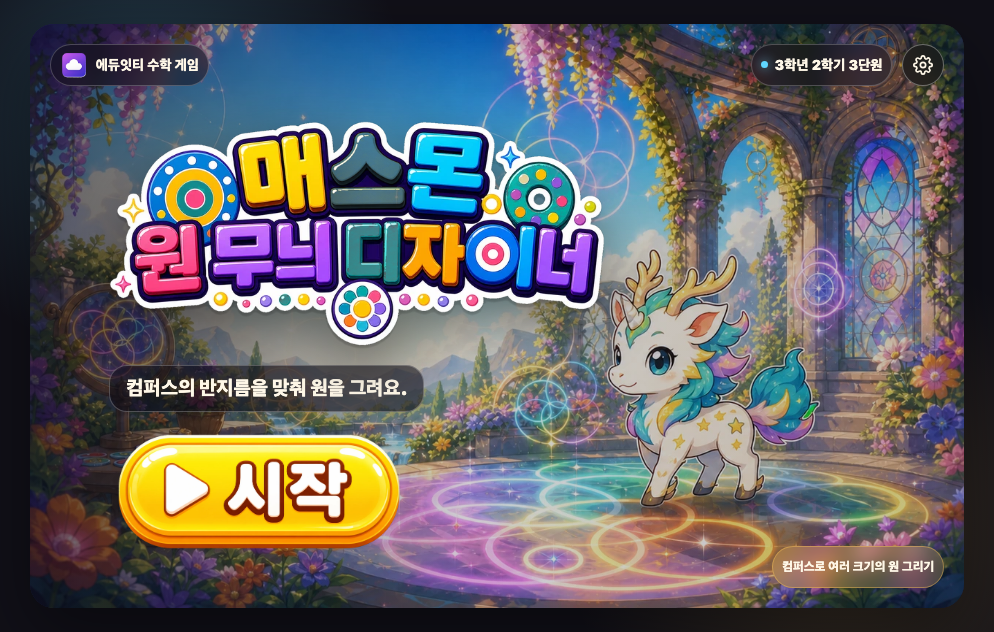

- 학생이 보는 것: 매스몬 원 무늬 디자이너 제목과 한 줄 목표, 시작 버튼을 봅니다.
- 판단하거나 누르는 것: 게임을 시작할 준비가 되면 시작을 누릅니다.
- 화면에서 확인되는 수학 관계: 컴퍼스로 여러 크기의 원 그리기을 배우는 차시임을 확인합니다.
- 다음 상태로 넘어가는 이유: 문제를 푸는 방법을 보는 설명 화면으로 이동합니다.

#### 설정 화면 · `engine-flow-user-visibility-994x632-02-settings.png`

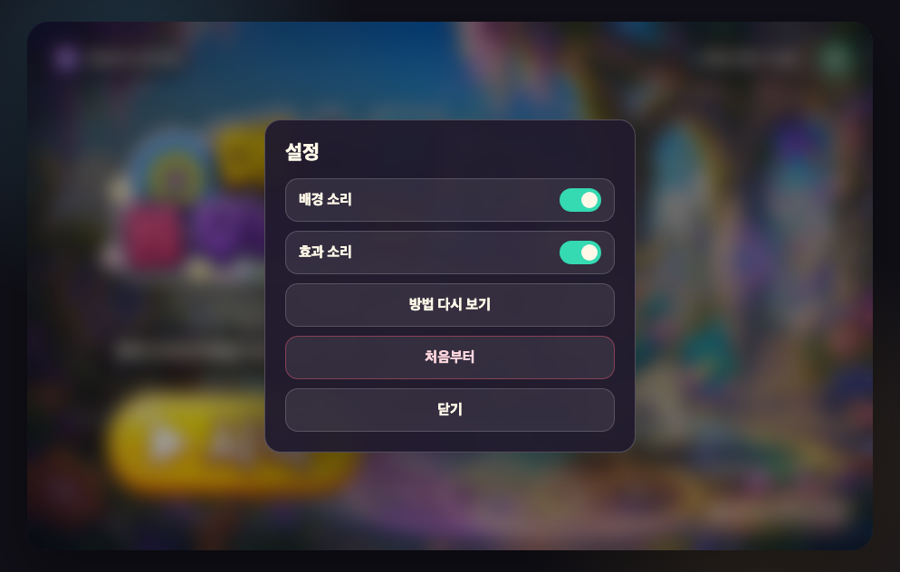

- 학생이 보는 것: 배경 소리·효과 소리와 방법 다시 보기, 처음부터, 닫기를 봅니다.
- 판단하거나 누르는 것: 필요한 소리나 이동 행동 하나를 고릅니다.
- 화면에서 확인되는 수학 관계: 수학 문제는 바꾸지 않고 게임 조작만 설정합니다.
- 다음 상태로 넘어가는 이유: 설정을 마치면 열기 전 화면으로 돌아갑니다.

#### 설명 1 · 풀이 방법 · `engine-flow-user-visibility-994x632-03-tutorial-1.png`

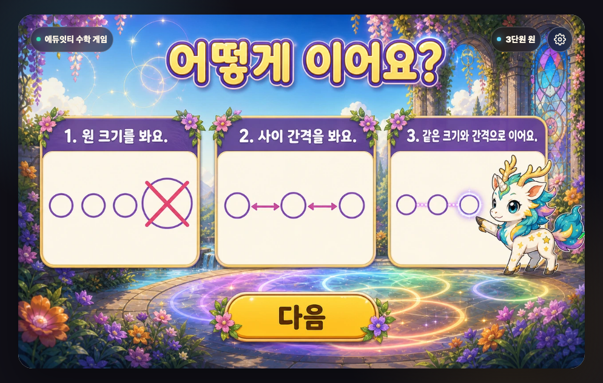

- 학생이 보는 것: 컴퍼스로 여러 크기의 원 그리기 문제를 푸는 방법과 게임 흐름을 그림으로 봅니다.
- 판단하거나 누르는 것: 그림 속 순서와 누를 곳을 확인한 뒤 다음 행동 버튼을 누릅니다.
- 화면에서 확인되는 수학 관계: 컴퍼스로 여러 크기의 원 그리기에서 무엇을 비교하거나 계산하는지 확인합니다.
- 다음 상태로 넘어가는 이유: 다음 설명으로 이동합니다.

#### 설명 2 · 보상과 목표 · `engine-flow-user-visibility-994x632-04-tutorial-2.png`

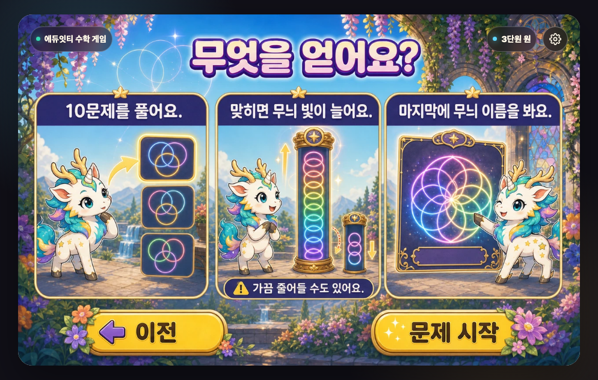

- 학생이 보는 것: 컴퍼스로 여러 크기의 원 그리기 문제를 푸는 방법과 게임 흐름을 그림으로 봅니다.
- 판단하거나 누르는 것: 그림 속 순서와 누를 곳을 확인한 뒤 다음 행동 버튼을 누릅니다.
- 화면에서 확인되는 수학 관계: 컴퍼스로 여러 크기의 원 그리기에서 무엇을 비교하거나 계산하는지 확인합니다.
- 다음 상태로 넘어가는 이유: 첫 문제로 이동합니다.

#### 문제 상태 · 05-play-step1 · `engine-flow-user-visibility-994x632-05-play-step1.png`

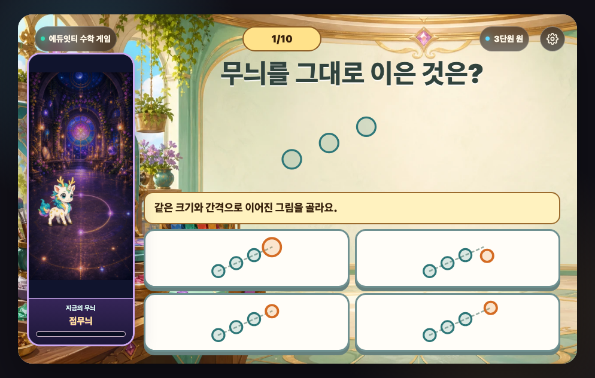

- 학생이 보는 것: 현재 문제, 핵심 계산판이나 물건, 고를 수 있는 답을 봅니다.
- 판단하거나 누르는 것: 문제에서 묻는 값이나 관계에 맞는 답 하나를 고릅니다.
- 화면에서 확인되는 수학 관계: 컴퍼스로 여러 크기의 원 그리기을 이용해 선택지를 판단합니다.
- 다음 상태로 넘어가는 이유: 고른 답에 따라 오답 또는 정답 확인 상태로 이동합니다.

#### 오개념 확인 · p1-pattern-gap-changed · `engine-flow-user-visibility-994x632-05m-p1-pattern-gap-changed.png`

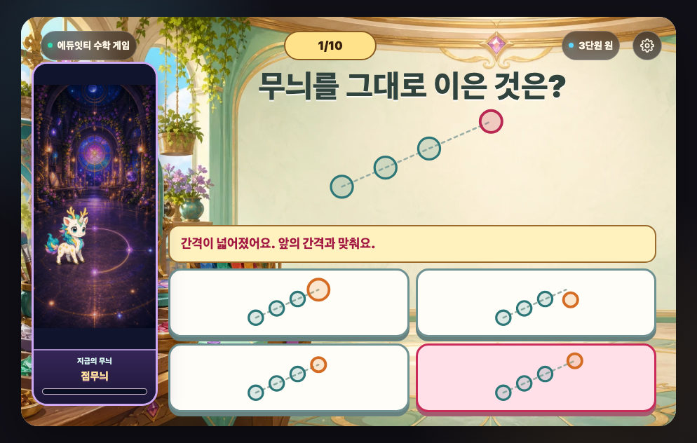

- 학생이 보는 것: 고른 답이 계산판이나 물건에 들어간 모습과 짧은 오답 피드백을 봅니다.
- 판단하거나 누르는 것: 어디가 맞지 않는지 확인하고 같은 문제에서 다른 답을 고릅니다.
- 화면에서 확인되는 수학 관계: 컴퍼스로 여러 크기의 원 그리기의 관계와 고른 답이 왜 맞지 않는지 확인합니다.
- 다음 상태로 넘어가는 이유: 같은 문제에서 다시 판단할 수 있는 상태로 돌아갑니다.

#### 오개념 확인 · p1-pattern-off-line · `engine-flow-user-visibility-994x632-05m-p1-pattern-off-line.png`

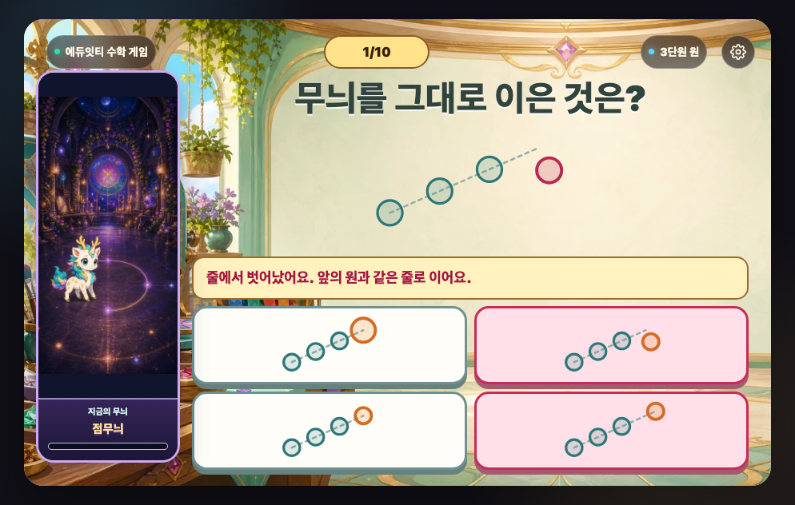

- 학생이 보는 것: 고른 답이 계산판이나 물건에 들어간 모습과 짧은 오답 피드백을 봅니다.
- 판단하거나 누르는 것: 어디가 맞지 않는지 확인하고 같은 문제에서 다른 답을 고릅니다.
- 화면에서 확인되는 수학 관계: 컴퍼스로 여러 크기의 원 그리기의 관계와 고른 답이 왜 맞지 않는지 확인합니다.
- 다음 상태로 넘어가는 이유: 같은 문제에서 다시 판단할 수 있는 상태로 돌아갑니다.

#### 오개념 확인 · p1-pattern-size-changed · `engine-flow-user-visibility-994x632-05m-p1-pattern-size-changed.png`

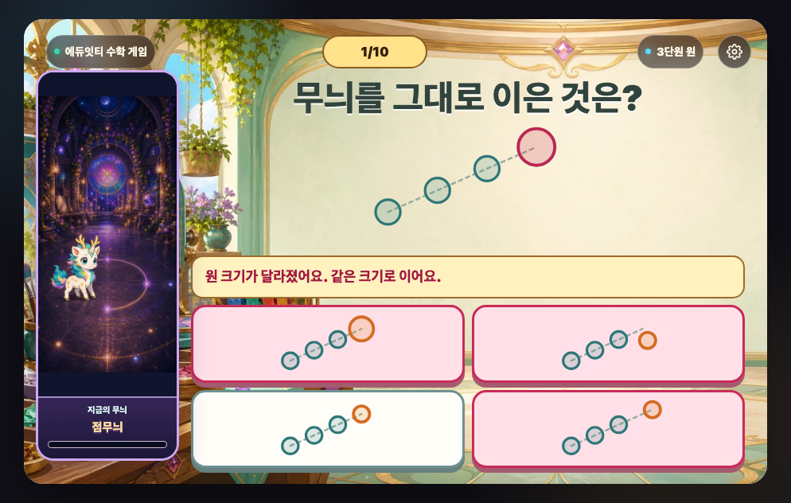

- 학생이 보는 것: 고른 답이 계산판이나 물건에 들어간 모습과 짧은 오답 피드백을 봅니다.
- 판단하거나 누르는 것: 어디가 맞지 않는지 확인하고 같은 문제에서 다른 답을 고릅니다.
- 화면에서 확인되는 수학 관계: 컴퍼스로 여러 크기의 원 그리기의 관계와 고른 답이 왜 맞지 않는지 확인합니다.
- 다음 상태로 넘어가는 이유: 같은 문제에서 다시 판단할 수 있는 상태로 돌아갑니다.

#### 오개념 확인 · p1-radius-too-long · `engine-flow-user-visibility-994x632-05m-p1-radius-too-long.png`

- 학생이 보는 것: 고른 답이 계산판이나 물건에 들어간 모습과 짧은 오답 피드백을 봅니다.
- 판단하거나 누르는 것: 어디가 맞지 않는지 확인하고 같은 문제에서 다른 답을 고릅니다.
- 화면에서 확인되는 수학 관계: 컴퍼스로 여러 크기의 원 그리기의 관계와 고른 답이 왜 맞지 않는지 확인합니다.
- 다음 상태로 넘어가는 이유: 같은 문제에서 다시 판단할 수 있는 상태로 돌아갑니다.

#### 오개념 확인 · p1-radius-too-short · `engine-flow-user-visibility-994x632-05m-p1-radius-too-short.png`

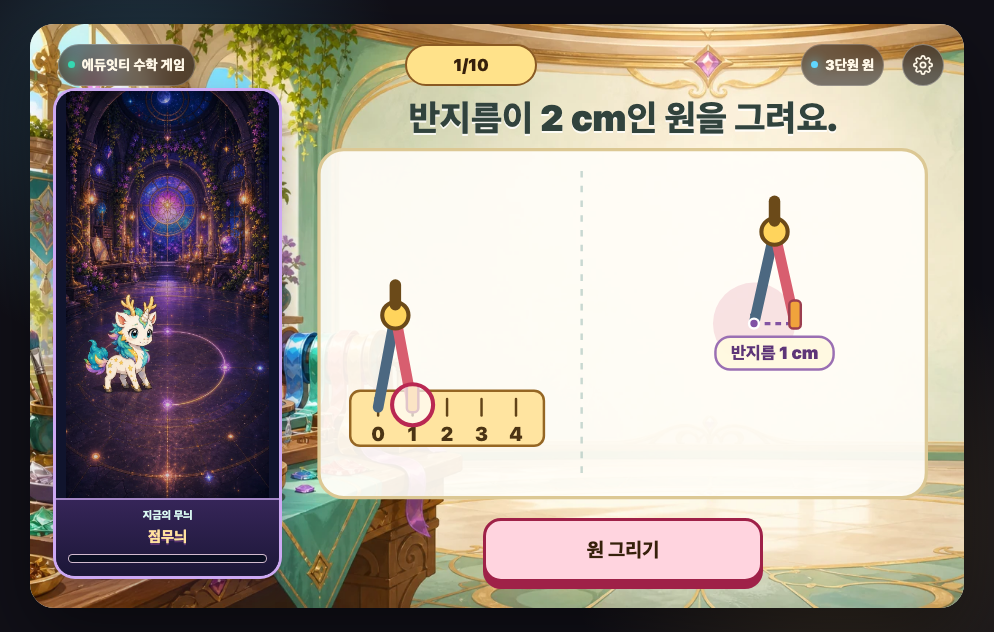

- 학생이 보는 것: 고른 답이 계산판이나 물건에 들어간 모습과 짧은 오답 피드백을 봅니다.
- 판단하거나 누르는 것: 어디가 맞지 않는지 확인하고 같은 문제에서 다른 답을 고릅니다.
- 화면에서 확인되는 수학 관계: 컴퍼스로 여러 크기의 원 그리기의 관계와 고른 답이 왜 맞지 않는지 확인합니다.
- 다음 상태로 넘어가는 이유: 같은 문제에서 다시 판단할 수 있는 상태로 돌아갑니다.

#### 오개념 확인 · p7-diameter-as-radius · `engine-flow-user-visibility-994x632-05m-p7-diameter-as-radius.png`

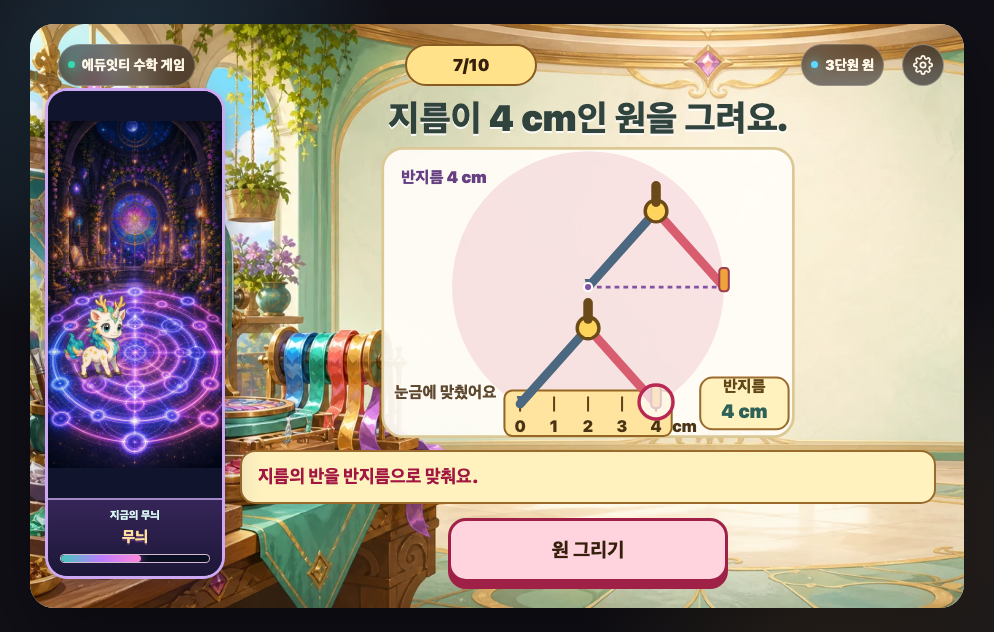

- 학생이 보는 것: 고른 답이 계산판이나 물건에 들어간 모습과 짧은 오답 피드백을 봅니다.
- 판단하거나 누르는 것: 어디가 맞지 않는지 확인하고 같은 문제에서 다른 답을 고릅니다.
- 화면에서 확인되는 수학 관계: 컴퍼스로 여러 크기의 원 그리기의 관계와 고른 답이 왜 맞지 않는지 확인합니다.
- 다음 상태로 넘어가는 이유: 같은 문제에서 다시 판단할 수 있는 상태로 돌아갑니다.

#### 오답 확인 · 05b-play-wrong · `engine-flow-user-visibility-994x632-05b-play-wrong.png`

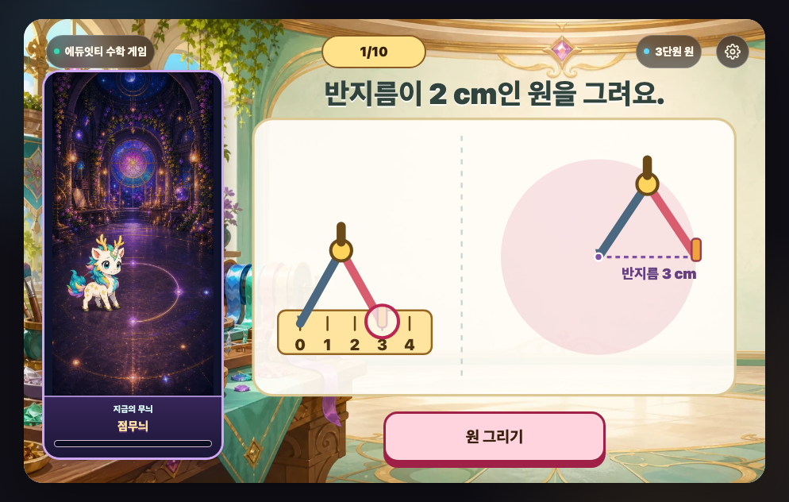

- 학생이 보는 것: 고른 답이 계산판이나 물건에 들어간 모습과 짧은 오답 피드백을 봅니다.
- 판단하거나 누르는 것: 어디가 맞지 않는지 확인하고 같은 문제에서 다른 답을 고릅니다.
- 화면에서 확인되는 수학 관계: 컴퍼스로 여러 크기의 원 그리기의 관계와 고른 답이 왜 맞지 않는지 확인합니다.
- 다음 상태로 넘어가는 이유: 같은 문제에서 다시 판단할 수 있는 상태로 돌아갑니다.

#### 마지막 확인 · 06-confirm · `engine-flow-user-visibility-994x632-06-confirm.png`

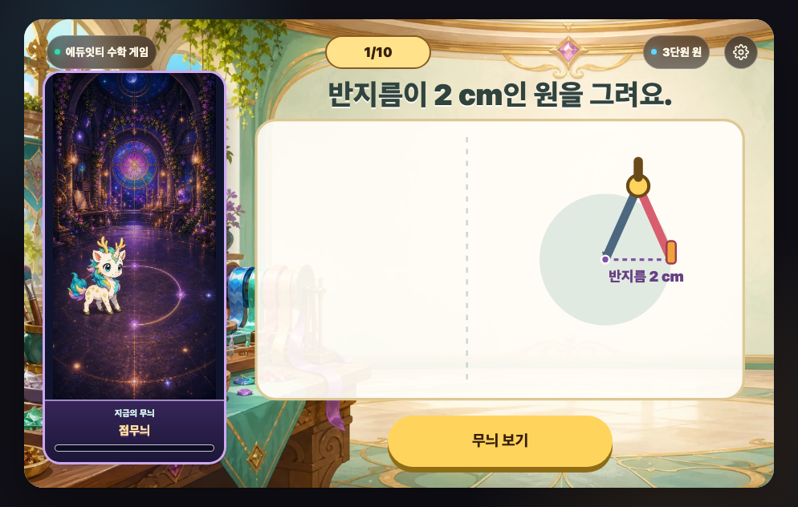

- 학생이 보는 것: 마지막으로 완성된 계산이나 값과 보상으로 가는 행동 버튼을 봅니다.
- 판단하거나 누르는 것: 완성된 관계를 읽은 뒤 보상 확인 버튼을 누릅니다.
- 화면에서 확인되는 수학 관계: 컴퍼스로 여러 크기의 원 그리기의 완성값을 보상 화면 전에 다시 확인합니다.
- 다음 상태로 넘어가는 이유: 수학 관계를 확인한 뒤 보상 상태로 이동합니다.

#### 닫힌 보상 · `engine-flow-user-visibility-994x632-07-reward-closed.png`

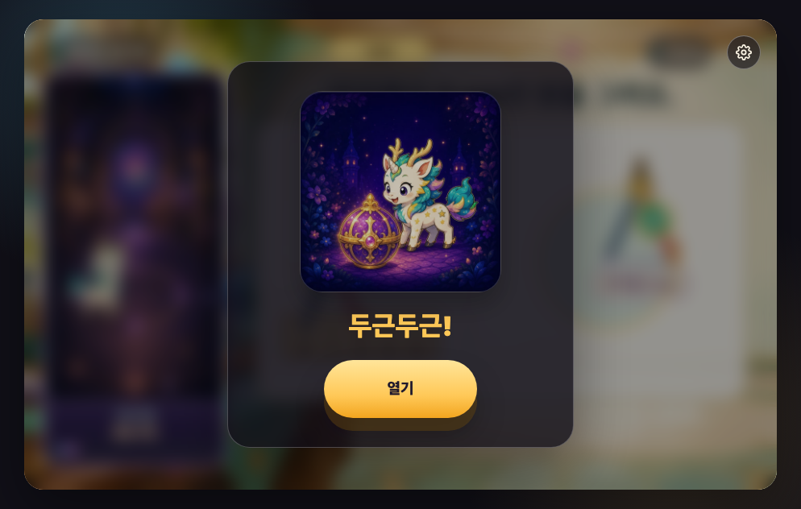

- 학생이 보는 것: 결과가 아직 드러나지 않은 보상 그림과 열기 버튼을 봅니다.
- 판단하거나 누르는 것: 이번 무늬 빛 변화를 확인하기 위해 열기를 누릅니다.
- 화면에서 확인되는 수학 관계: 뒤 문제 화면에는 방금 완성한 계산이나 관계가 그대로 남습니다.
- 다음 상태로 넘어가는 이유: 학생이 직접 연 뒤에만 이번 보상 사건이 공개됩니다.

#### 열린 보상 · `engine-flow-user-visibility-994x632-07b-reward-open.png`

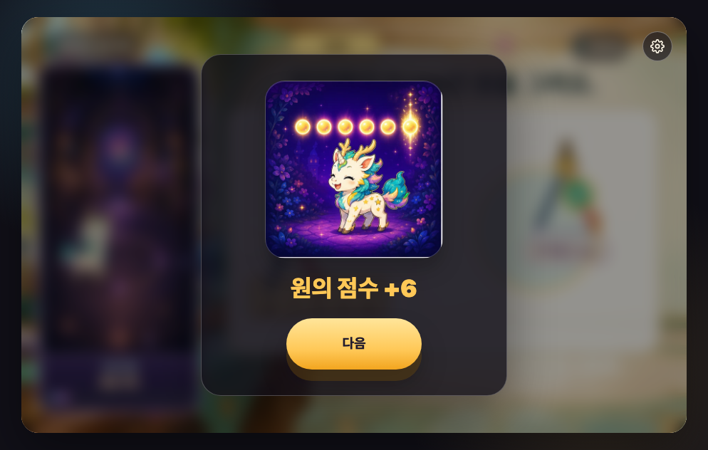

- 학생이 보는 것: 보상 사건 그림과 이번 무늬 빛 변화, 다음 행동 버튼을 봅니다.
- 판단하거나 누르는 것: 이번 변화를 확인하고 다음을 누릅니다.
- 화면에서 확인되는 수학 관계: 수학 정답과 무작위 보상 변화가 서로 분리되어 있음을 확인합니다.
- 다음 상태로 넘어가는 이유: 현재 진행 장면의 변화를 본 뒤 다음 문제나 결과로 이동합니다.

#### 보상 뒤 변화 · 07c-reward-impact · `engine-flow-user-visibility-994x632-07c-reward-impact.png`

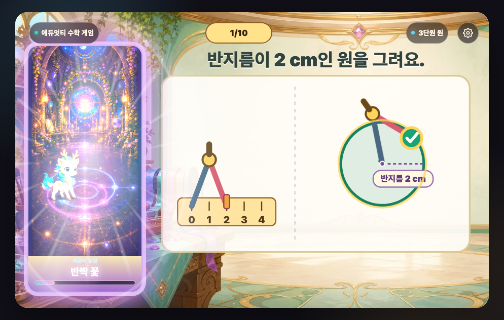

- 학생이 보는 것: 보상 모달이 닫힌 뒤 현재 진행 장면과 무늬 빛 변화가 반영되는 모습을 봅니다.
- 판단하거나 누르는 것: 별도 입력 없이 이번 보상이 진행 단계에 반영되는 모습을 확인합니다.
- 화면에서 확인되는 수학 관계: 한 문제의 보상이 현재 진행값에 정확히 한 번 반영됩니다.
- 다음 상태로 넘어가는 이유: 효과를 충분히 본 뒤 다음 문제 또는 결과로 이동합니다.

#### 실제 결과 · `engine-flow-user-visibility-994x632-08-result.png`

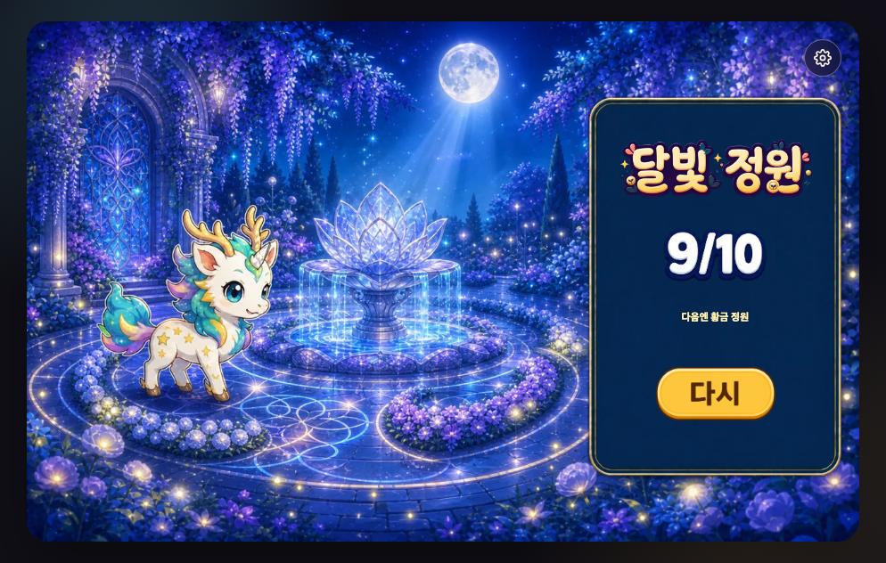

- 학생이 보는 것: 완성 장면과 결과 이름, 정답 수, 다음 목표, 다시 버튼을 봅니다.
- 판단하거나 누르는 것: 현재 결과와 다음 목표를 비교하고 다시 도전할지 결정합니다.
- 화면에서 확인되는 수학 관계: 한 판의 정답과 무늬 빛 변화가 하나의 결과 단계로 정리됩니다.
- 다음 상태로 넘어가는 이유: 다시를 누르면 새 문제 순서와 새 보상 흐름으로 시작합니다.

#### 결과 결속 · big · `engine-flow-user-visibility-994x632-08c-result-cohesion-big.png`

- 학생이 보는 것: 완성 장면과 결과 이름, 정답 수, 다음 목표, 다시 버튼을 봅니다.
- 판단하거나 누르는 것: 현재 결과와 다음 목표를 비교하고 다시 도전할지 결정합니다.
- 화면에서 확인되는 수학 관계: 한 판의 정답과 무늬 빛 변화가 하나의 결과 단계로 정리됩니다.
- 다음 상태로 넘어가는 이유: 다시를 누르면 새 문제 순서와 새 보상 흐름으로 시작합니다.

#### 결과 결속 · design · `engine-flow-user-visibility-994x632-08c-result-cohesion-design.png`

- 학생이 보는 것: 완성 장면과 결과 이름, 정답 수, 다음 목표, 다시 버튼을 봅니다.
- 판단하거나 누르는 것: 현재 결과와 다음 목표를 비교하고 다시 도전할지 결정합니다.
- 화면에서 확인되는 수학 관계: 한 판의 정답과 무늬 빛 변화가 하나의 결과 단계로 정리됩니다.
- 다음 상태로 넘어가는 이유: 다시를 누르면 새 문제 순서와 새 보상 흐름으로 시작합니다.

#### 결과 결속 · dot · `engine-flow-user-visibility-994x632-08c-result-cohesion-dot.png`

- 학생이 보는 것: 완성 장면과 결과 이름, 정답 수, 다음 목표, 다시 버튼을 봅니다.
- 판단하거나 누르는 것: 현재 결과와 다음 목표를 비교하고 다시 도전할지 결정합니다.
- 화면에서 확인되는 수학 관계: 한 판의 정답과 무늬 빛 변화가 하나의 결과 단계로 정리됩니다.
- 다음 상태로 넘어가는 이유: 다시를 누르면 새 문제 순서와 새 보상 흐름으로 시작합니다.

#### 결과 결속 · pattern · `engine-flow-user-visibility-994x632-08c-result-cohesion-pattern.png`

- 학생이 보는 것: 완성 장면과 결과 이름, 정답 수, 다음 목표, 다시 버튼을 봅니다.
- 판단하거나 누르는 것: 현재 결과와 다음 목표를 비교하고 다시 도전할지 결정합니다.
- 화면에서 확인되는 수학 관계: 한 판의 정답과 무늬 빛 변화가 하나의 결과 단계로 정리됩니다.
- 다음 상태로 넘어가는 이유: 다시를 누르면 새 문제 순서와 새 보상 흐름으로 시작합니다.

#### 결과 결속 · rainbow · `engine-flow-user-visibility-994x632-08c-result-cohesion-rainbow.png`

- 학생이 보는 것: 완성 장면과 결과 이름, 정답 수, 다음 목표, 다시 버튼을 봅니다.
- 판단하거나 누르는 것: 현재 결과와 다음 목표를 비교하고 다시 도전할지 결정합니다.
- 화면에서 확인되는 수학 관계: 한 판의 정답과 무늬 빛 변화가 하나의 결과 단계로 정리됩니다.
- 다음 상태로 넘어가는 이유: 다시를 누르면 새 문제 순서와 새 보상 흐름으로 시작합니다.

#### 결과 결속 · small · `engine-flow-user-visibility-994x632-08c-result-cohesion-small.png`

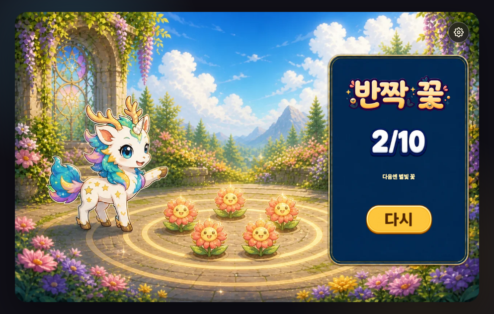

- 학생이 보는 것: 완성 장면과 결과 이름, 정답 수, 다음 목표, 다시 버튼을 봅니다.
- 판단하거나 누르는 것: 현재 결과와 다음 목표를 비교하고 다시 도전할지 결정합니다.
- 화면에서 확인되는 수학 관계: 한 판의 정답과 무늬 빛 변화가 하나의 결과 단계로 정리됩니다.
- 다음 상태로 넘어가는 이유: 다시를 누르면 새 문제 순서와 새 보상 흐름으로 시작합니다.

#### 결과판 포함 · big · `engine-flow-user-visibility-994x632-08d-result-panel-big.png`

- 학생이 보는 것: 완성 장면과 결과 이름, 정답 수, 다음 목표, 다시 버튼을 봅니다.
- 판단하거나 누르는 것: 현재 결과와 다음 목표를 비교하고 다시 도전할지 결정합니다.
- 화면에서 확인되는 수학 관계: 한 판의 정답과 무늬 빛 변화가 하나의 결과 단계로 정리됩니다.
- 다음 상태로 넘어가는 이유: 다시를 누르면 새 문제 순서와 새 보상 흐름으로 시작합니다.

#### 결과판 포함 · design · `engine-flow-user-visibility-994x632-08d-result-panel-design.png`

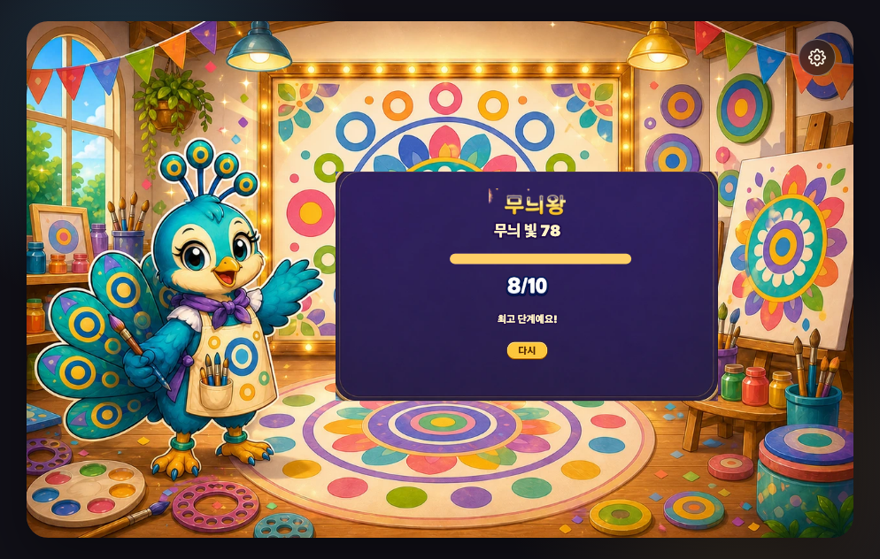

- 학생이 보는 것: 완성 장면과 결과 이름, 정답 수, 다음 목표, 다시 버튼을 봅니다.
- 판단하거나 누르는 것: 현재 결과와 다음 목표를 비교하고 다시 도전할지 결정합니다.
- 화면에서 확인되는 수학 관계: 한 판의 정답과 무늬 빛 변화가 하나의 결과 단계로 정리됩니다.
- 다음 상태로 넘어가는 이유: 다시를 누르면 새 문제 순서와 새 보상 흐름으로 시작합니다.

#### 결과판 포함 · dot · `engine-flow-user-visibility-994x632-08d-result-panel-dot.png`

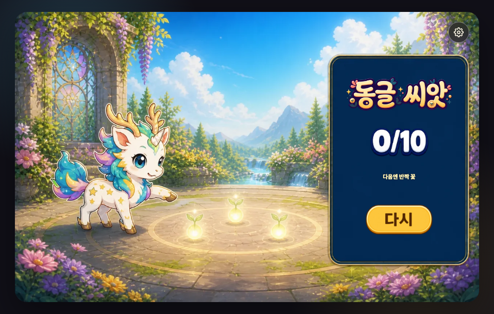

- 학생이 보는 것: 완성 장면과 결과 이름, 정답 수, 다음 목표, 다시 버튼을 봅니다.
- 판단하거나 누르는 것: 현재 결과와 다음 목표를 비교하고 다시 도전할지 결정합니다.
- 화면에서 확인되는 수학 관계: 한 판의 정답과 무늬 빛 변화가 하나의 결과 단계로 정리됩니다.
- 다음 상태로 넘어가는 이유: 다시를 누르면 새 문제 순서와 새 보상 흐름으로 시작합니다.

#### 결과판 포함 · pattern · `engine-flow-user-visibility-994x632-08d-result-panel-pattern.png`

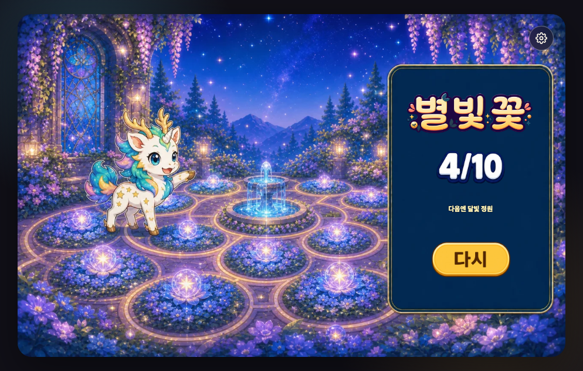

- 학생이 보는 것: 완성 장면과 결과 이름, 정답 수, 다음 목표, 다시 버튼을 봅니다.
- 판단하거나 누르는 것: 현재 결과와 다음 목표를 비교하고 다시 도전할지 결정합니다.
- 화면에서 확인되는 수학 관계: 한 판의 정답과 무늬 빛 변화가 하나의 결과 단계로 정리됩니다.
- 다음 상태로 넘어가는 이유: 다시를 누르면 새 문제 순서와 새 보상 흐름으로 시작합니다.

#### 결과판 포함 · rainbow · `engine-flow-user-visibility-994x632-08d-result-panel-rainbow.png`

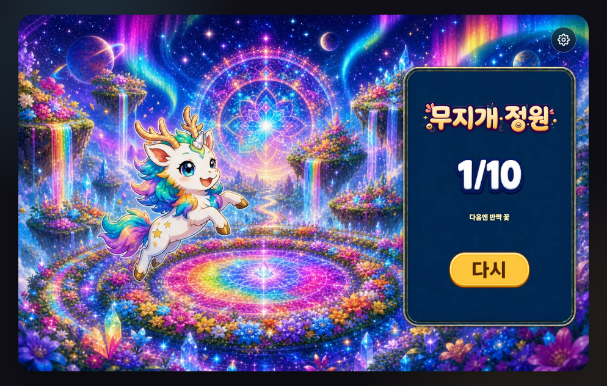

- 학생이 보는 것: 완성 장면과 결과 이름, 정답 수, 다음 목표, 다시 버튼을 봅니다.
- 판단하거나 누르는 것: 현재 결과와 다음 목표를 비교하고 다시 도전할지 결정합니다.
- 화면에서 확인되는 수학 관계: 한 판의 정답과 무늬 빛 변화가 하나의 결과 단계로 정리됩니다.
- 다음 상태로 넘어가는 이유: 다시를 누르면 새 문제 순서와 새 보상 흐름으로 시작합니다.

#### 결과판 포함 · small · `engine-flow-user-visibility-994x632-08d-result-panel-small.png`

- 학생이 보는 것: 완성 장면과 결과 이름, 정답 수, 다음 목표, 다시 버튼을 봅니다.
- 판단하거나 누르는 것: 현재 결과와 다음 목표를 비교하고 다시 도전할지 결정합니다.
- 화면에서 확인되는 수학 관계: 한 판의 정답과 무늬 빛 변화가 하나의 결과 단계로 정리됩니다.
- 다음 상태로 넘어가는 이유: 다시를 누르면 새 문제 순서와 새 보상 흐름으로 시작합니다.

### user-reported-missing-left-progress-1082x987-dpr2 · 1082×987 · DPR 2 · 28장

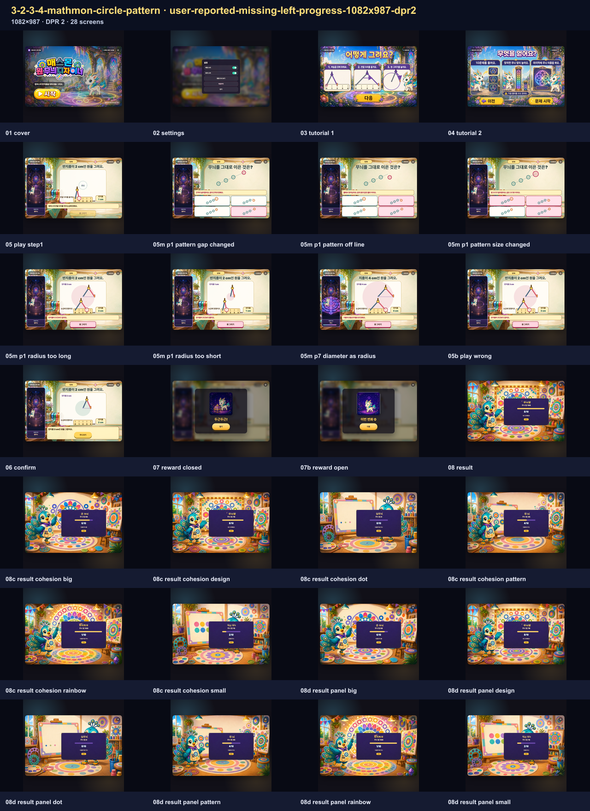

#### 시작 화면 · `engine-flow-user-reported-missing-left-progress-1082x987-dpr2-01-cover.png`

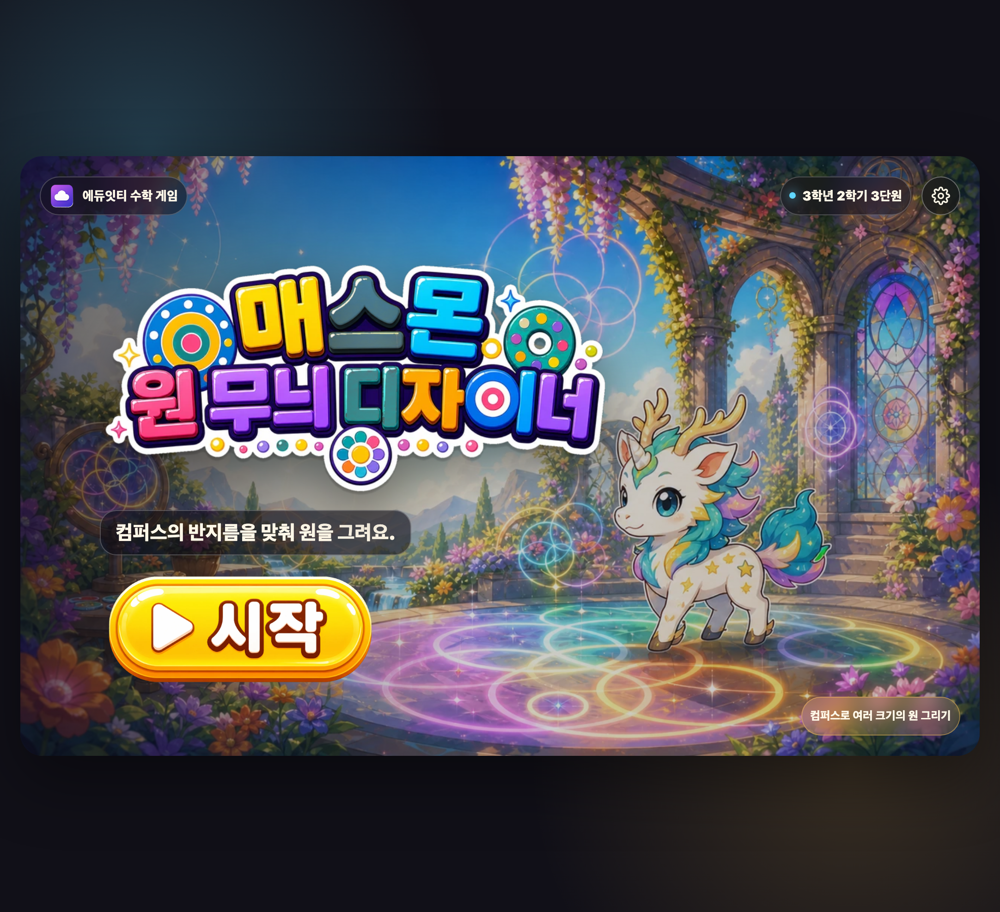

- 학생이 보는 것: 매스몬 원 무늬 디자이너 제목과 한 줄 목표, 시작 버튼을 봅니다.
- 판단하거나 누르는 것: 게임을 시작할 준비가 되면 시작을 누릅니다.
- 화면에서 확인되는 수학 관계: 컴퍼스로 여러 크기의 원 그리기을 배우는 차시임을 확인합니다.
- 다음 상태로 넘어가는 이유: 문제를 푸는 방법을 보는 설명 화면으로 이동합니다.

#### 설정 화면 · `engine-flow-user-reported-missing-left-progress-1082x987-dpr2-02-settings.png`

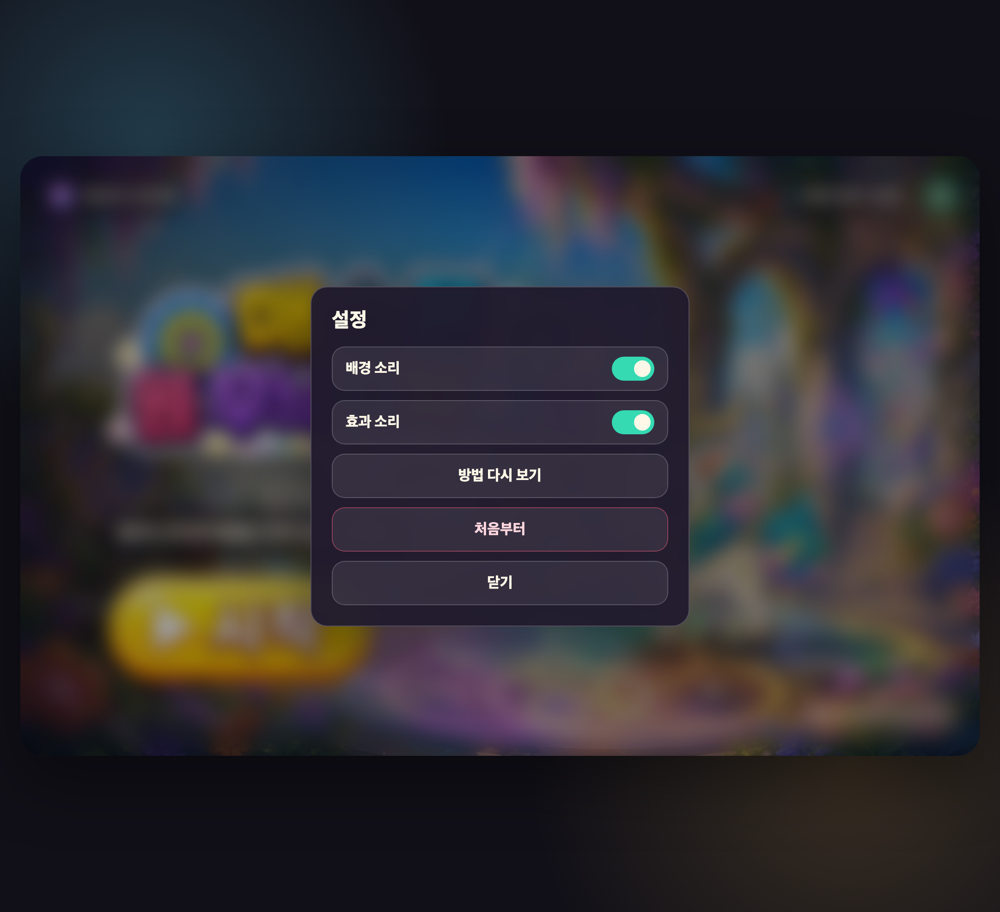

- 학생이 보는 것: 배경 소리·효과 소리와 방법 다시 보기, 처음부터, 닫기를 봅니다.
- 판단하거나 누르는 것: 필요한 소리나 이동 행동 하나를 고릅니다.
- 화면에서 확인되는 수학 관계: 수학 문제는 바꾸지 않고 게임 조작만 설정합니다.
- 다음 상태로 넘어가는 이유: 설정을 마치면 열기 전 화면으로 돌아갑니다.

#### 설명 1 · 풀이 방법 · `engine-flow-user-reported-missing-left-progress-1082x987-dpr2-03-tutorial-1.png`

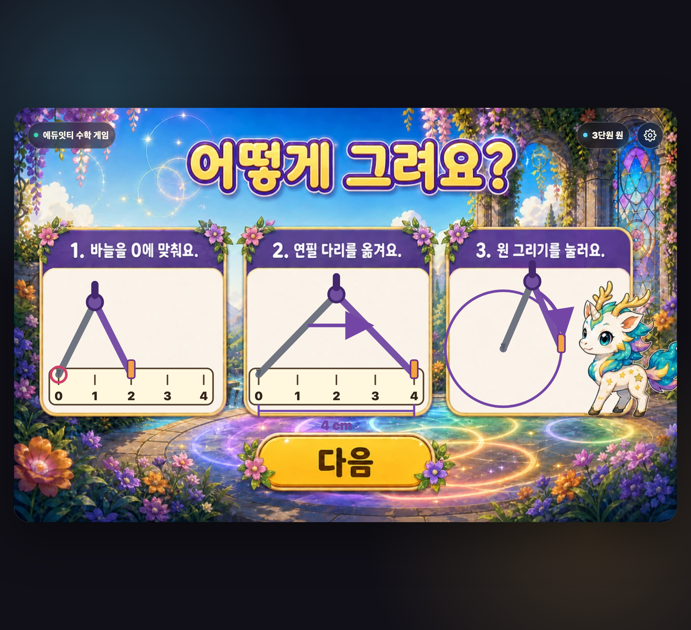

- 학생이 보는 것: 컴퍼스로 여러 크기의 원 그리기 문제를 푸는 방법과 게임 흐름을 그림으로 봅니다.
- 판단하거나 누르는 것: 그림 속 순서와 누를 곳을 확인한 뒤 다음 행동 버튼을 누릅니다.
- 화면에서 확인되는 수학 관계: 컴퍼스로 여러 크기의 원 그리기에서 무엇을 비교하거나 계산하는지 확인합니다.
- 다음 상태로 넘어가는 이유: 다음 설명으로 이동합니다.

#### 설명 2 · 보상과 목표 · `engine-flow-user-reported-missing-left-progress-1082x987-dpr2-04-tutorial-2.png`

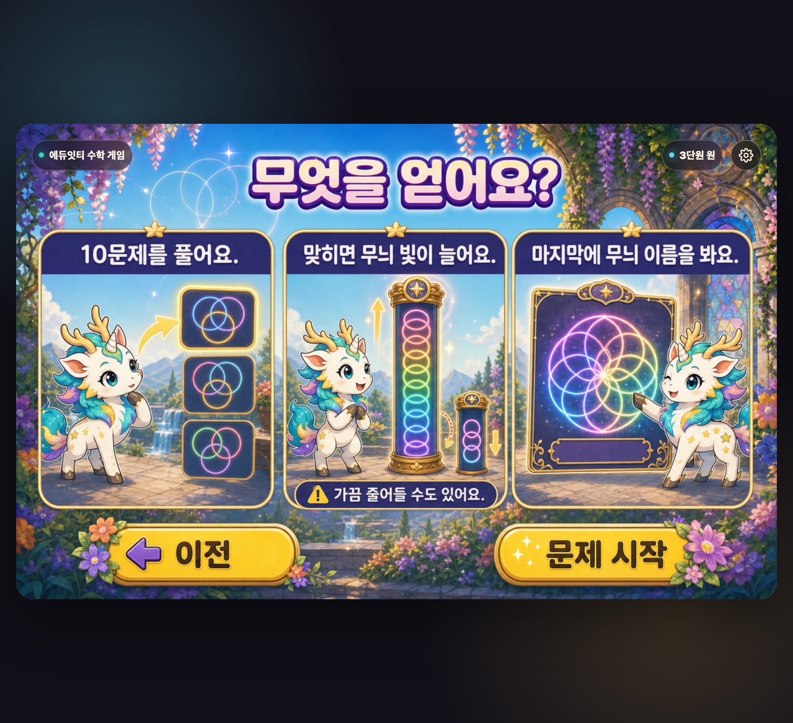

- 학생이 보는 것: 컴퍼스로 여러 크기의 원 그리기 문제를 푸는 방법과 게임 흐름을 그림으로 봅니다.
- 판단하거나 누르는 것: 그림 속 순서와 누를 곳을 확인한 뒤 다음 행동 버튼을 누릅니다.
- 화면에서 확인되는 수학 관계: 컴퍼스로 여러 크기의 원 그리기에서 무엇을 비교하거나 계산하는지 확인합니다.
- 다음 상태로 넘어가는 이유: 첫 문제로 이동합니다.

#### 문제 상태 · 05-play-step1 · `engine-flow-user-reported-missing-left-progress-1082x987-dpr2-05-play-step1.png`

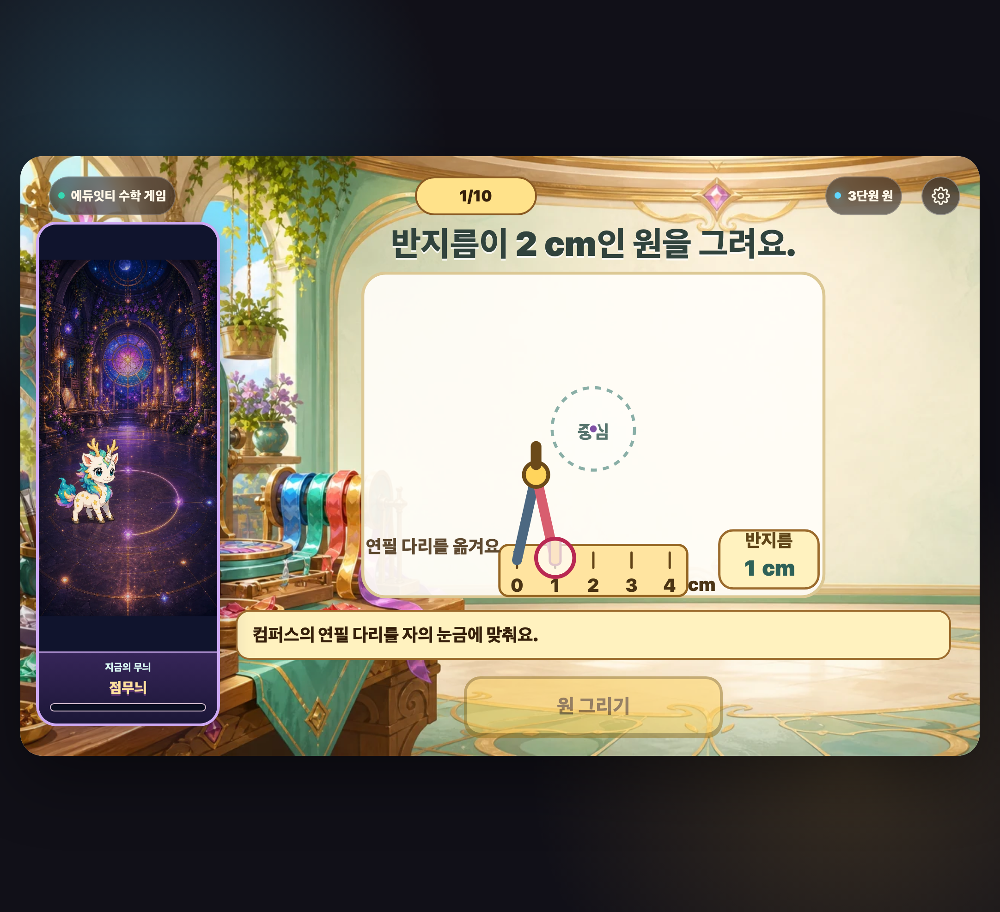

- 학생이 보는 것: 현재 문제, 핵심 계산판이나 물건, 고를 수 있는 답을 봅니다.
- 판단하거나 누르는 것: 문제에서 묻는 값이나 관계에 맞는 답 하나를 고릅니다.
- 화면에서 확인되는 수학 관계: 컴퍼스로 여러 크기의 원 그리기을 이용해 선택지를 판단합니다.
- 다음 상태로 넘어가는 이유: 고른 답에 따라 오답 또는 정답 확인 상태로 이동합니다.

#### 오개념 확인 · p1-pattern-gap-changed · `engine-flow-user-reported-missing-left-progress-1082x987-dpr2-05m-p1-pattern-gap-changed.png`

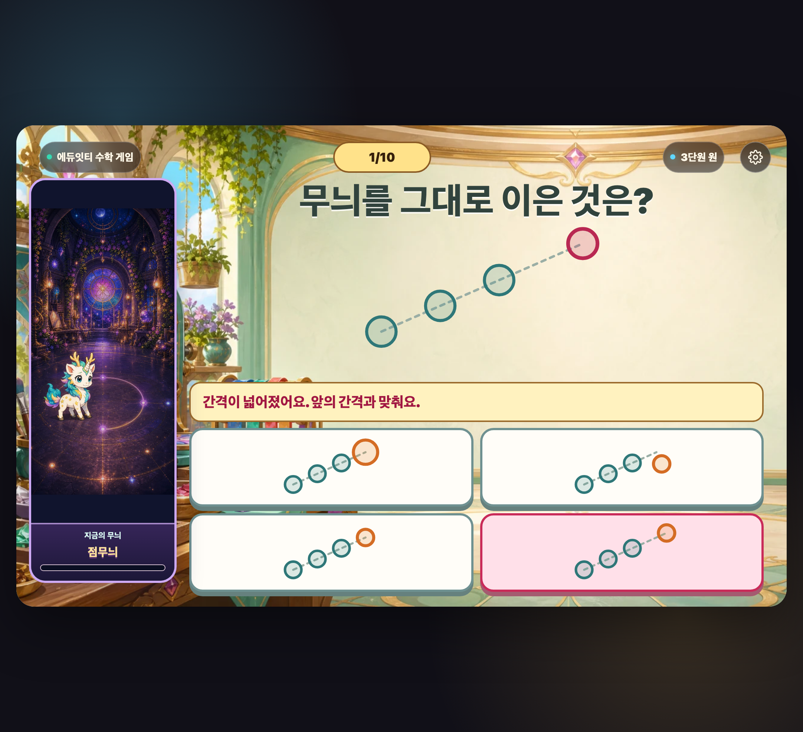

- 학생이 보는 것: 고른 답이 계산판이나 물건에 들어간 모습과 짧은 오답 피드백을 봅니다.
- 판단하거나 누르는 것: 어디가 맞지 않는지 확인하고 같은 문제에서 다른 답을 고릅니다.
- 화면에서 확인되는 수학 관계: 컴퍼스로 여러 크기의 원 그리기의 관계와 고른 답이 왜 맞지 않는지 확인합니다.
- 다음 상태로 넘어가는 이유: 같은 문제에서 다시 판단할 수 있는 상태로 돌아갑니다.

#### 오개념 확인 · p1-pattern-off-line · `engine-flow-user-reported-missing-left-progress-1082x987-dpr2-05m-p1-pattern-off-line.png`

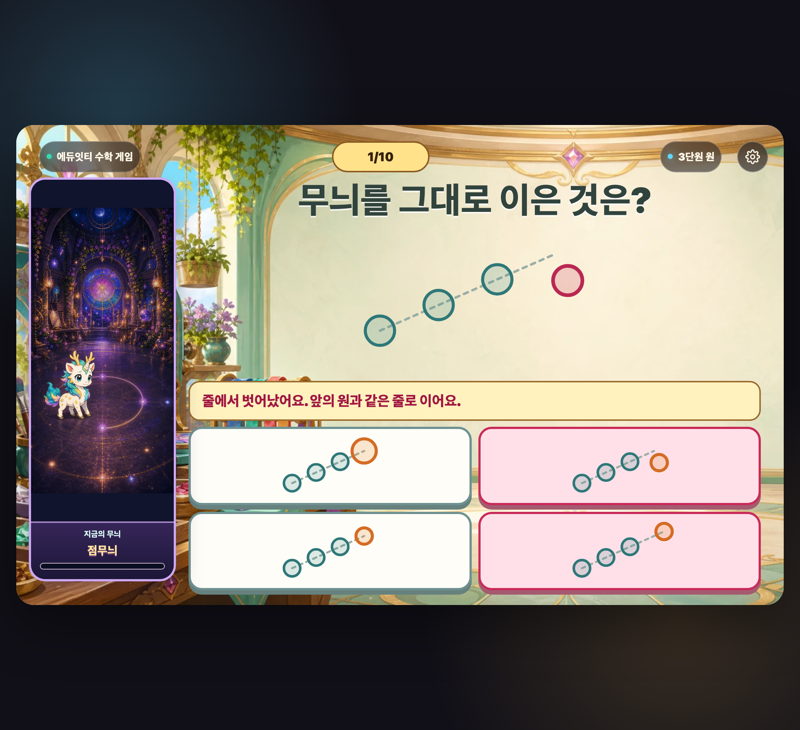

- 학생이 보는 것: 고른 답이 계산판이나 물건에 들어간 모습과 짧은 오답 피드백을 봅니다.
- 판단하거나 누르는 것: 어디가 맞지 않는지 확인하고 같은 문제에서 다른 답을 고릅니다.
- 화면에서 확인되는 수학 관계: 컴퍼스로 여러 크기의 원 그리기의 관계와 고른 답이 왜 맞지 않는지 확인합니다.
- 다음 상태로 넘어가는 이유: 같은 문제에서 다시 판단할 수 있는 상태로 돌아갑니다.

#### 오개념 확인 · p1-pattern-size-changed · `engine-flow-user-reported-missing-left-progress-1082x987-dpr2-05m-p1-pattern-size-changed.png`

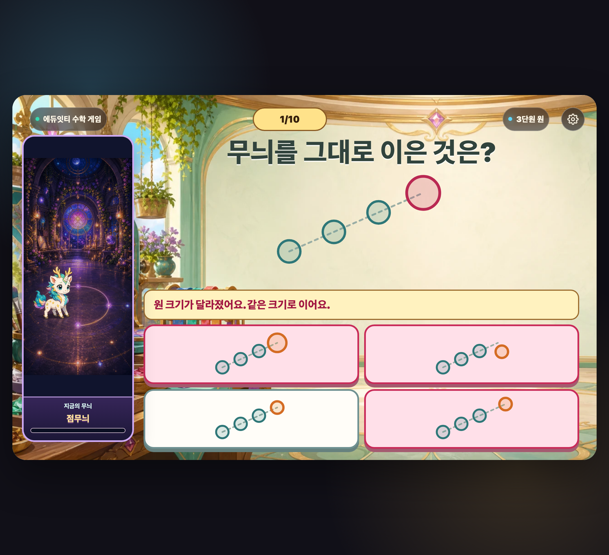

- 학생이 보는 것: 고른 답이 계산판이나 물건에 들어간 모습과 짧은 오답 피드백을 봅니다.
- 판단하거나 누르는 것: 어디가 맞지 않는지 확인하고 같은 문제에서 다른 답을 고릅니다.
- 화면에서 확인되는 수학 관계: 컴퍼스로 여러 크기의 원 그리기의 관계와 고른 답이 왜 맞지 않는지 확인합니다.
- 다음 상태로 넘어가는 이유: 같은 문제에서 다시 판단할 수 있는 상태로 돌아갑니다.

#### 오개념 확인 · p1-radius-too-long · `engine-flow-user-reported-missing-left-progress-1082x987-dpr2-05m-p1-radius-too-long.png`

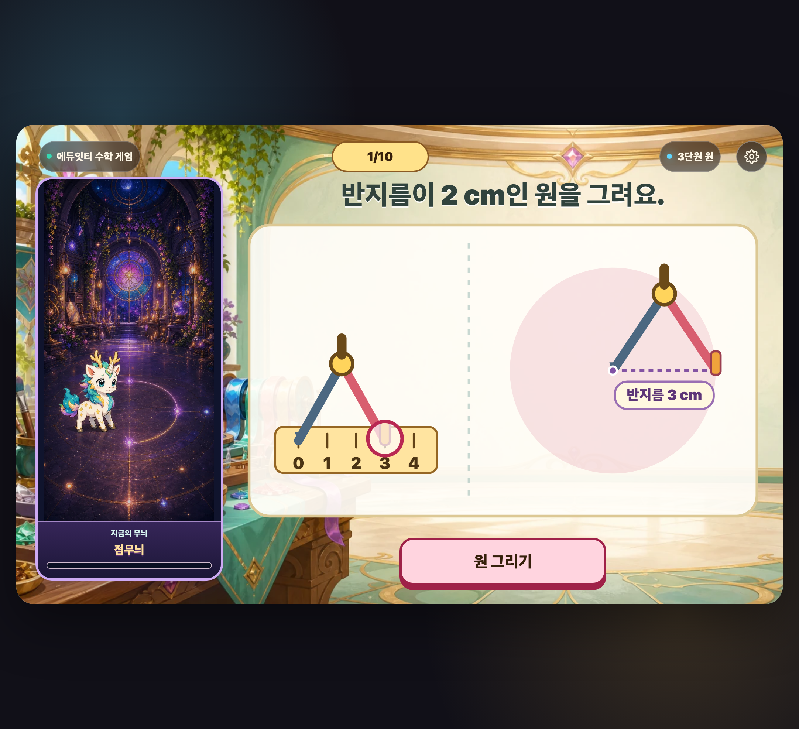

- 학생이 보는 것: 고른 답이 계산판이나 물건에 들어간 모습과 짧은 오답 피드백을 봅니다.
- 판단하거나 누르는 것: 어디가 맞지 않는지 확인하고 같은 문제에서 다른 답을 고릅니다.
- 화면에서 확인되는 수학 관계: 컴퍼스로 여러 크기의 원 그리기의 관계와 고른 답이 왜 맞지 않는지 확인합니다.
- 다음 상태로 넘어가는 이유: 같은 문제에서 다시 판단할 수 있는 상태로 돌아갑니다.

#### 오개념 확인 · p1-radius-too-short · `engine-flow-user-reported-missing-left-progress-1082x987-dpr2-05m-p1-radius-too-short.png`

- 학생이 보는 것: 고른 답이 계산판이나 물건에 들어간 모습과 짧은 오답 피드백을 봅니다.
- 판단하거나 누르는 것: 어디가 맞지 않는지 확인하고 같은 문제에서 다른 답을 고릅니다.
- 화면에서 확인되는 수학 관계: 컴퍼스로 여러 크기의 원 그리기의 관계와 고른 답이 왜 맞지 않는지 확인합니다.
- 다음 상태로 넘어가는 이유: 같은 문제에서 다시 판단할 수 있는 상태로 돌아갑니다.

#### 오개념 확인 · p7-diameter-as-radius · `engine-flow-user-reported-missing-left-progress-1082x987-dpr2-05m-p7-diameter-as-radius.png`

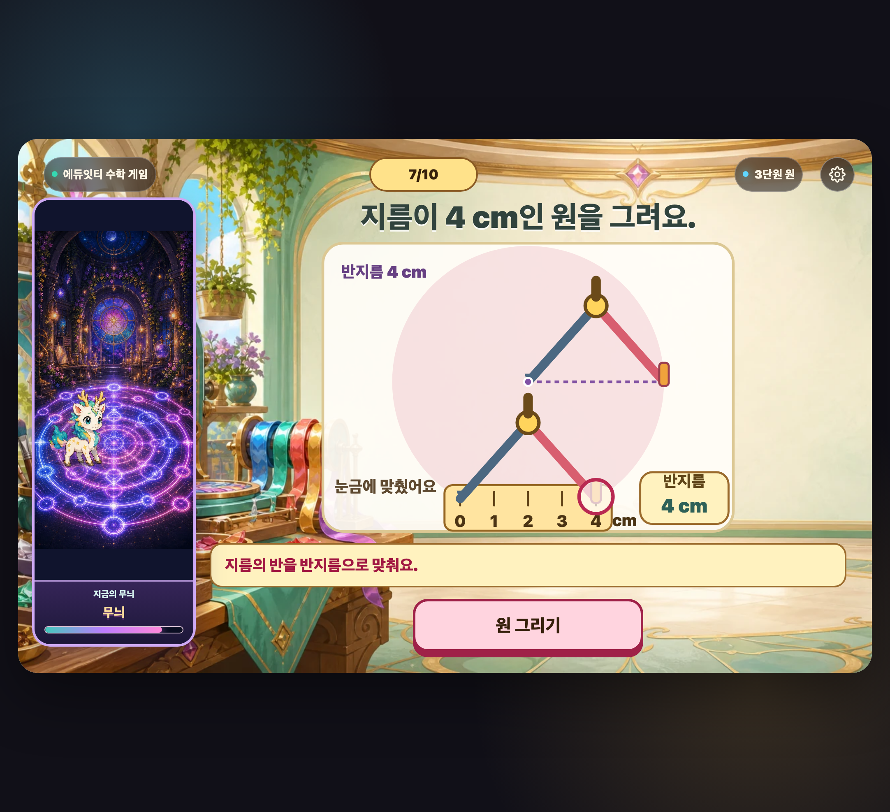

- 학생이 보는 것: 고른 답이 계산판이나 물건에 들어간 모습과 짧은 오답 피드백을 봅니다.
- 판단하거나 누르는 것: 어디가 맞지 않는지 확인하고 같은 문제에서 다른 답을 고릅니다.
- 화면에서 확인되는 수학 관계: 컴퍼스로 여러 크기의 원 그리기의 관계와 고른 답이 왜 맞지 않는지 확인합니다.
- 다음 상태로 넘어가는 이유: 같은 문제에서 다시 판단할 수 있는 상태로 돌아갑니다.

#### 오답 확인 · 05b-play-wrong · `engine-flow-user-reported-missing-left-progress-1082x987-dpr2-05b-play-wrong.png`

- 학생이 보는 것: 고른 답이 계산판이나 물건에 들어간 모습과 짧은 오답 피드백을 봅니다.
- 판단하거나 누르는 것: 어디가 맞지 않는지 확인하고 같은 문제에서 다른 답을 고릅니다.
- 화면에서 확인되는 수학 관계: 컴퍼스로 여러 크기의 원 그리기의 관계와 고른 답이 왜 맞지 않는지 확인합니다.
- 다음 상태로 넘어가는 이유: 같은 문제에서 다시 판단할 수 있는 상태로 돌아갑니다.

#### 마지막 확인 · 06-confirm · `engine-flow-user-reported-missing-left-progress-1082x987-dpr2-06-confirm.png`

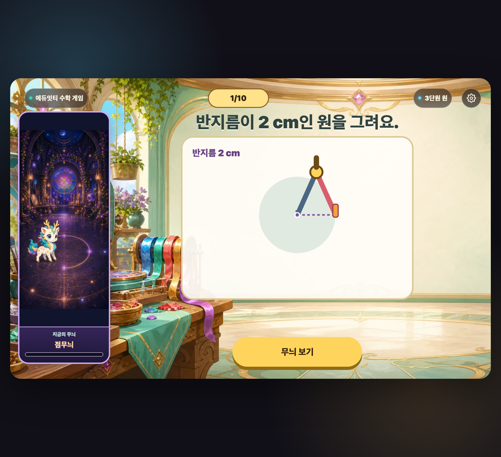

- 학생이 보는 것: 마지막으로 완성된 계산이나 값과 보상으로 가는 행동 버튼을 봅니다.
- 판단하거나 누르는 것: 완성된 관계를 읽은 뒤 보상 확인 버튼을 누릅니다.
- 화면에서 확인되는 수학 관계: 컴퍼스로 여러 크기의 원 그리기의 완성값을 보상 화면 전에 다시 확인합니다.
- 다음 상태로 넘어가는 이유: 수학 관계를 확인한 뒤 보상 상태로 이동합니다.

#### 닫힌 보상 · `engine-flow-user-reported-missing-left-progress-1082x987-dpr2-07-reward-closed.png`

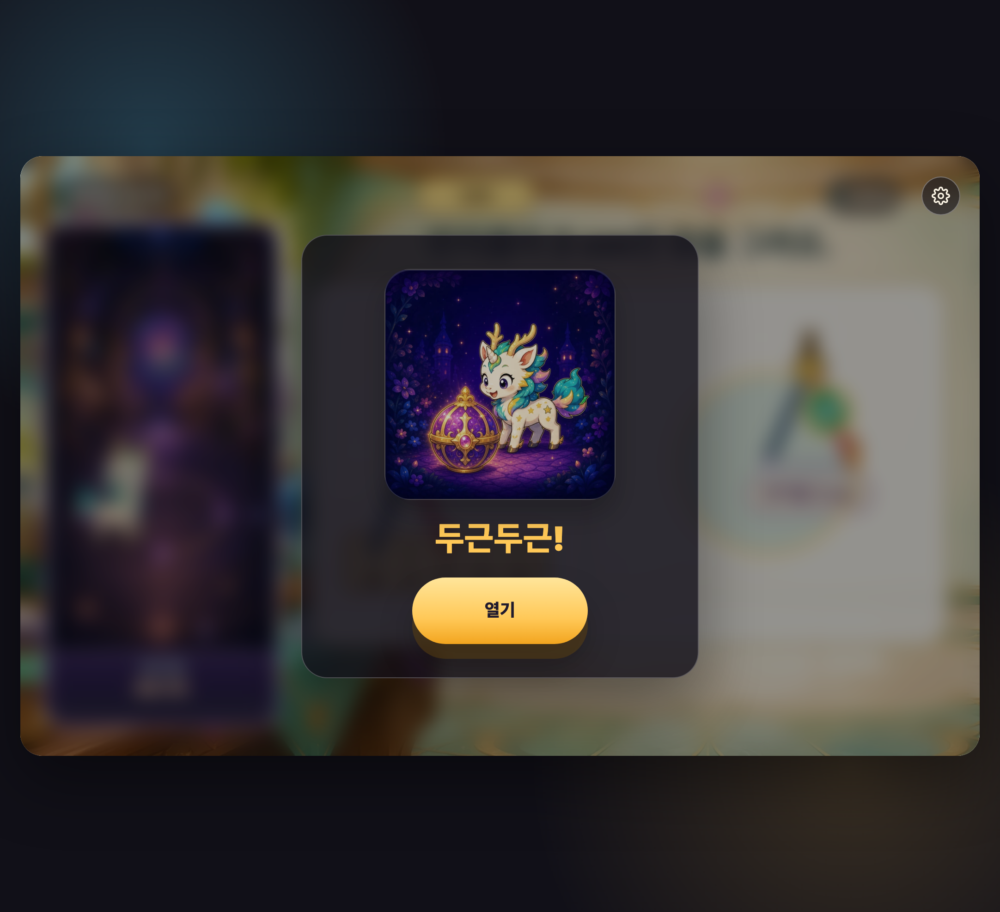

- 학생이 보는 것: 결과가 아직 드러나지 않은 보상 그림과 열기 버튼을 봅니다.
- 판단하거나 누르는 것: 이번 무늬 빛 변화를 확인하기 위해 열기를 누릅니다.
- 화면에서 확인되는 수학 관계: 뒤 문제 화면에는 방금 완성한 계산이나 관계가 그대로 남습니다.
- 다음 상태로 넘어가는 이유: 학생이 직접 연 뒤에만 이번 보상 사건이 공개됩니다.

#### 열린 보상 · `engine-flow-user-reported-missing-left-progress-1082x987-dpr2-07b-reward-open.png`

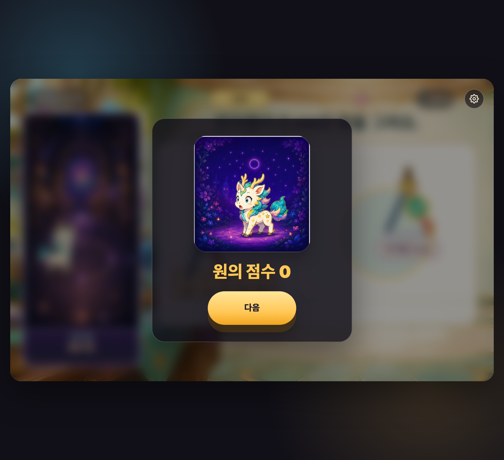

- 학생이 보는 것: 보상 사건 그림과 이번 무늬 빛 변화, 다음 행동 버튼을 봅니다.
- 판단하거나 누르는 것: 이번 변화를 확인하고 다음을 누릅니다.
- 화면에서 확인되는 수학 관계: 수학 정답과 무작위 보상 변화가 서로 분리되어 있음을 확인합니다.
- 다음 상태로 넘어가는 이유: 현재 진행 장면의 변화를 본 뒤 다음 문제나 결과로 이동합니다.

#### 실제 결과 · `engine-flow-user-reported-missing-left-progress-1082x987-dpr2-08-result.png`

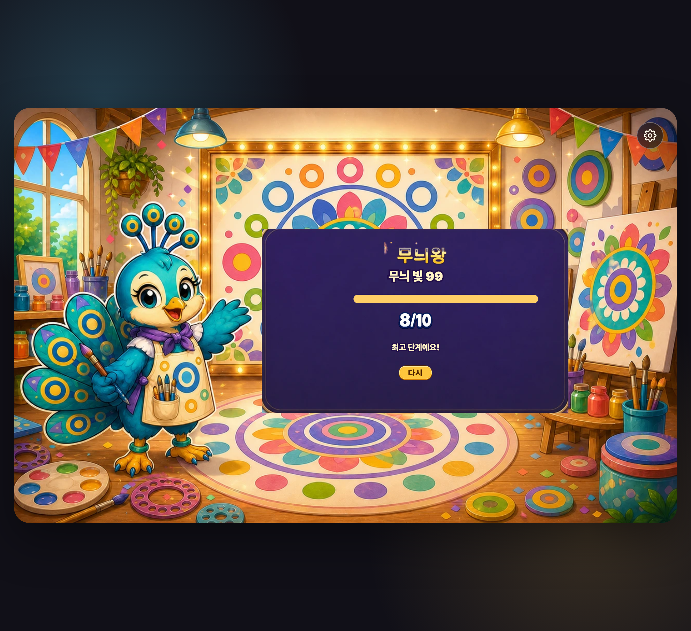

- 학생이 보는 것: 완성 장면과 결과 이름, 정답 수, 다음 목표, 다시 버튼을 봅니다.
- 판단하거나 누르는 것: 현재 결과와 다음 목표를 비교하고 다시 도전할지 결정합니다.
- 화면에서 확인되는 수학 관계: 한 판의 정답과 무늬 빛 변화가 하나의 결과 단계로 정리됩니다.
- 다음 상태로 넘어가는 이유: 다시를 누르면 새 문제 순서와 새 보상 흐름으로 시작합니다.

#### 결과 결속 · big · `engine-flow-user-reported-missing-left-progress-1082x987-dpr2-08c-result-cohesion-big.png`

- 학생이 보는 것: 완성 장면과 결과 이름, 정답 수, 다음 목표, 다시 버튼을 봅니다.
- 판단하거나 누르는 것: 현재 결과와 다음 목표를 비교하고 다시 도전할지 결정합니다.
- 화면에서 확인되는 수학 관계: 한 판의 정답과 무늬 빛 변화가 하나의 결과 단계로 정리됩니다.
- 다음 상태로 넘어가는 이유: 다시를 누르면 새 문제 순서와 새 보상 흐름으로 시작합니다.

#### 결과 결속 · design · `engine-flow-user-reported-missing-left-progress-1082x987-dpr2-08c-result-cohesion-design.png`

- 학생이 보는 것: 완성 장면과 결과 이름, 정답 수, 다음 목표, 다시 버튼을 봅니다.
- 판단하거나 누르는 것: 현재 결과와 다음 목표를 비교하고 다시 도전할지 결정합니다.
- 화면에서 확인되는 수학 관계: 한 판의 정답과 무늬 빛 변화가 하나의 결과 단계로 정리됩니다.
- 다음 상태로 넘어가는 이유: 다시를 누르면 새 문제 순서와 새 보상 흐름으로 시작합니다.

#### 결과 결속 · dot · `engine-flow-user-reported-missing-left-progress-1082x987-dpr2-08c-result-cohesion-dot.png`

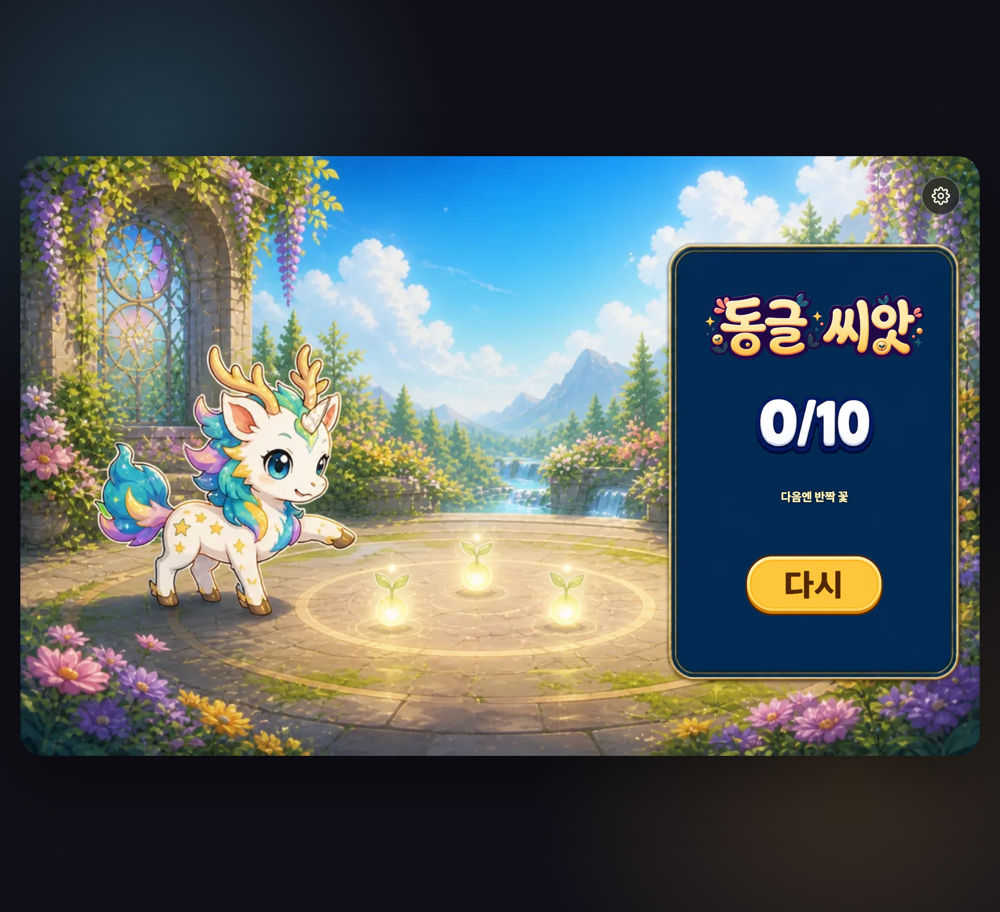

- 학생이 보는 것: 완성 장면과 결과 이름, 정답 수, 다음 목표, 다시 버튼을 봅니다.
- 판단하거나 누르는 것: 현재 결과와 다음 목표를 비교하고 다시 도전할지 결정합니다.
- 화면에서 확인되는 수학 관계: 한 판의 정답과 무늬 빛 변화가 하나의 결과 단계로 정리됩니다.
- 다음 상태로 넘어가는 이유: 다시를 누르면 새 문제 순서와 새 보상 흐름으로 시작합니다.

#### 결과 결속 · pattern · `engine-flow-user-reported-missing-left-progress-1082x987-dpr2-08c-result-cohesion-pattern.png`

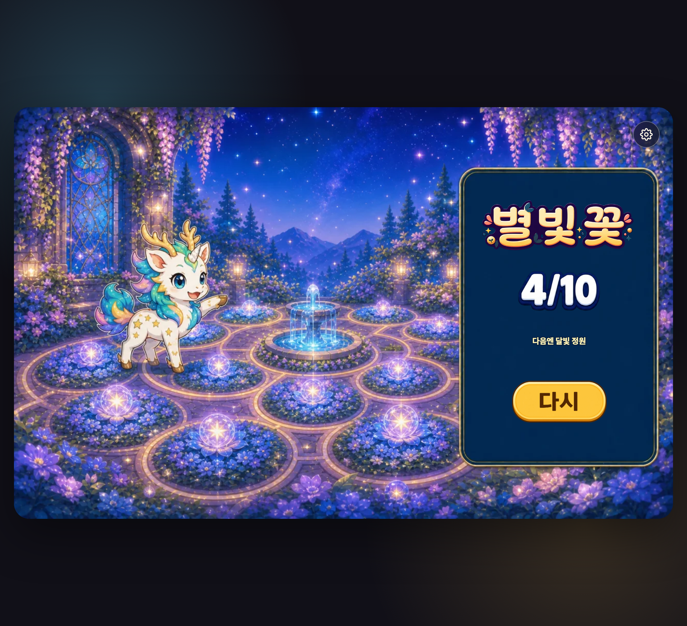

- 학생이 보는 것: 완성 장면과 결과 이름, 정답 수, 다음 목표, 다시 버튼을 봅니다.
- 판단하거나 누르는 것: 현재 결과와 다음 목표를 비교하고 다시 도전할지 결정합니다.
- 화면에서 확인되는 수학 관계: 한 판의 정답과 무늬 빛 변화가 하나의 결과 단계로 정리됩니다.
- 다음 상태로 넘어가는 이유: 다시를 누르면 새 문제 순서와 새 보상 흐름으로 시작합니다.

#### 결과 결속 · rainbow · `engine-flow-user-reported-missing-left-progress-1082x987-dpr2-08c-result-cohesion-rainbow.png`

- 학생이 보는 것: 완성 장면과 결과 이름, 정답 수, 다음 목표, 다시 버튼을 봅니다.
- 판단하거나 누르는 것: 현재 결과와 다음 목표를 비교하고 다시 도전할지 결정합니다.
- 화면에서 확인되는 수학 관계: 한 판의 정답과 무늬 빛 변화가 하나의 결과 단계로 정리됩니다.
- 다음 상태로 넘어가는 이유: 다시를 누르면 새 문제 순서와 새 보상 흐름으로 시작합니다.

#### 결과 결속 · small · `engine-flow-user-reported-missing-left-progress-1082x987-dpr2-08c-result-cohesion-small.png`

- 학생이 보는 것: 완성 장면과 결과 이름, 정답 수, 다음 목표, 다시 버튼을 봅니다.
- 판단하거나 누르는 것: 현재 결과와 다음 목표를 비교하고 다시 도전할지 결정합니다.
- 화면에서 확인되는 수학 관계: 한 판의 정답과 무늬 빛 변화가 하나의 결과 단계로 정리됩니다.
- 다음 상태로 넘어가는 이유: 다시를 누르면 새 문제 순서와 새 보상 흐름으로 시작합니다.

#### 결과판 포함 · big · `engine-flow-user-reported-missing-left-progress-1082x987-dpr2-08d-result-panel-big.png`

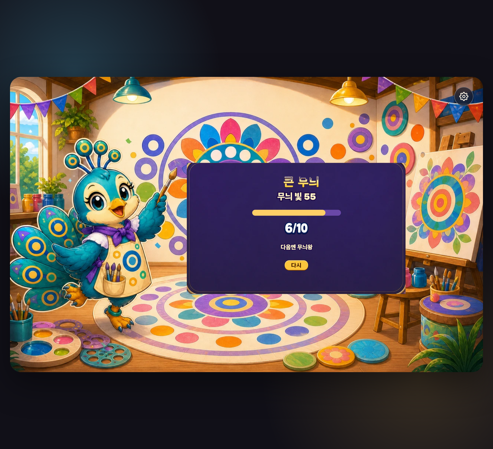

- 학생이 보는 것: 완성 장면과 결과 이름, 정답 수, 다음 목표, 다시 버튼을 봅니다.
- 판단하거나 누르는 것: 현재 결과와 다음 목표를 비교하고 다시 도전할지 결정합니다.
- 화면에서 확인되는 수학 관계: 한 판의 정답과 무늬 빛 변화가 하나의 결과 단계로 정리됩니다.
- 다음 상태로 넘어가는 이유: 다시를 누르면 새 문제 순서와 새 보상 흐름으로 시작합니다.

#### 결과판 포함 · design · `engine-flow-user-reported-missing-left-progress-1082x987-dpr2-08d-result-panel-design.png`

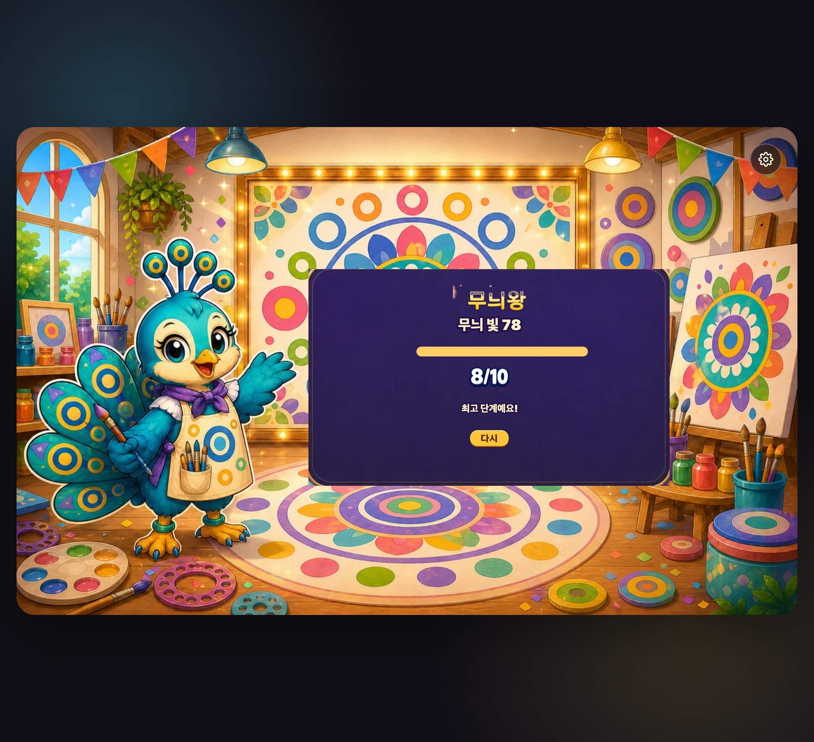

- 학생이 보는 것: 완성 장면과 결과 이름, 정답 수, 다음 목표, 다시 버튼을 봅니다.
- 판단하거나 누르는 것: 현재 결과와 다음 목표를 비교하고 다시 도전할지 결정합니다.
- 화면에서 확인되는 수학 관계: 한 판의 정답과 무늬 빛 변화가 하나의 결과 단계로 정리됩니다.
- 다음 상태로 넘어가는 이유: 다시를 누르면 새 문제 순서와 새 보상 흐름으로 시작합니다.

#### 결과판 포함 · dot · `engine-flow-user-reported-missing-left-progress-1082x987-dpr2-08d-result-panel-dot.png`

- 학생이 보는 것: 완성 장면과 결과 이름, 정답 수, 다음 목표, 다시 버튼을 봅니다.
- 판단하거나 누르는 것: 현재 결과와 다음 목표를 비교하고 다시 도전할지 결정합니다.
- 화면에서 확인되는 수학 관계: 한 판의 정답과 무늬 빛 변화가 하나의 결과 단계로 정리됩니다.
- 다음 상태로 넘어가는 이유: 다시를 누르면 새 문제 순서와 새 보상 흐름으로 시작합니다.

#### 결과판 포함 · pattern · `engine-flow-user-reported-missing-left-progress-1082x987-dpr2-08d-result-panel-pattern.png`

- 학생이 보는 것: 완성 장면과 결과 이름, 정답 수, 다음 목표, 다시 버튼을 봅니다.
- 판단하거나 누르는 것: 현재 결과와 다음 목표를 비교하고 다시 도전할지 결정합니다.
- 화면에서 확인되는 수학 관계: 한 판의 정답과 무늬 빛 변화가 하나의 결과 단계로 정리됩니다.
- 다음 상태로 넘어가는 이유: 다시를 누르면 새 문제 순서와 새 보상 흐름으로 시작합니다.

#### 결과판 포함 · rainbow · `engine-flow-user-reported-missing-left-progress-1082x987-dpr2-08d-result-panel-rainbow.png`

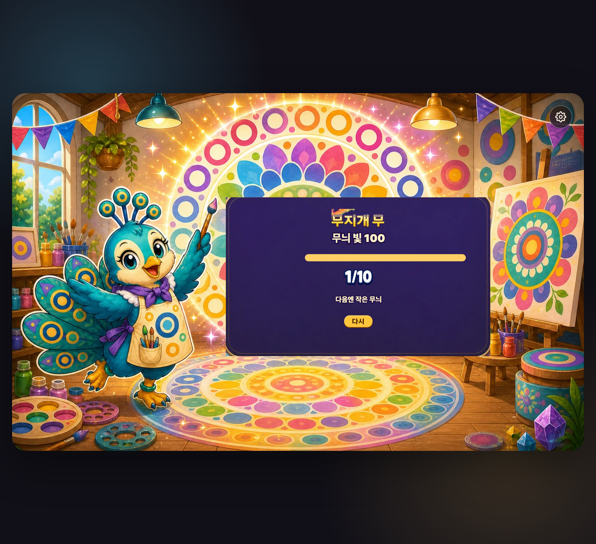

- 학생이 보는 것: 완성 장면과 결과 이름, 정답 수, 다음 목표, 다시 버튼을 봅니다.
- 판단하거나 누르는 것: 현재 결과와 다음 목표를 비교하고 다시 도전할지 결정합니다.
- 화면에서 확인되는 수학 관계: 한 판의 정답과 무늬 빛 변화가 하나의 결과 단계로 정리됩니다.
- 다음 상태로 넘어가는 이유: 다시를 누르면 새 문제 순서와 새 보상 흐름으로 시작합니다.

#### 결과판 포함 · small · `engine-flow-user-reported-missing-left-progress-1082x987-dpr2-08d-result-panel-small.png`

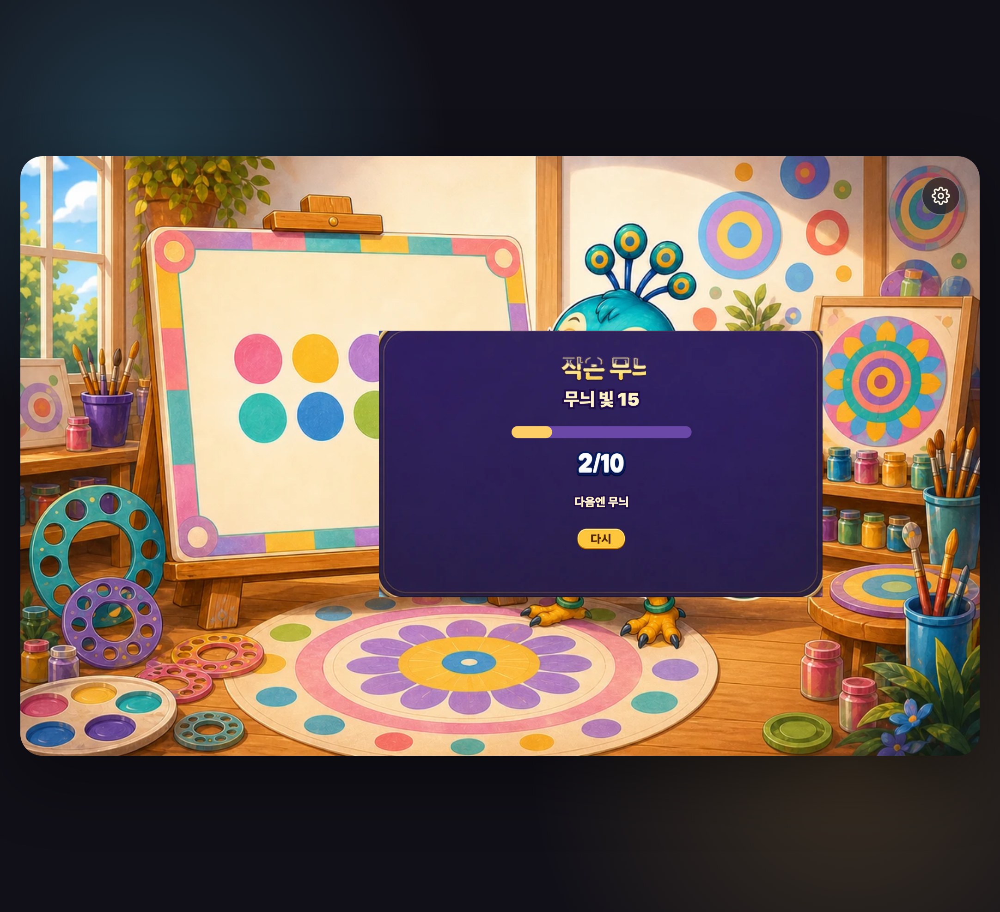

- 학생이 보는 것: 완성 장면과 결과 이름, 정답 수, 다음 목표, 다시 버튼을 봅니다.
- 판단하거나 누르는 것: 현재 결과와 다음 목표를 비교하고 다시 도전할지 결정합니다.
- 화면에서 확인되는 수학 관계: 한 판의 정답과 무늬 빛 변화가 하나의 결과 단계로 정리됩니다.
- 다음 상태로 넘어가는 이유: 다시를 누르면 새 문제 순서와 새 보상 흐름으로 시작합니다.

<!-- REPORT-EVIDENCE-ALL:END -->
