# 매스몬 피자 분수 가게 제작 보고

## 2026-08-02 최종 보상 우선 재제작

- 문제 왼쪽 진행 장면을 만들기 전에 최종 보상 6등급부터 다시 제작했습니다.
- `한 조각 → 반 판 → 한 판 → 특대 피자 → 가게 대박 → 전설 피자`는 비 오는 낡은 손수레·꽃이 핀 작은 가게·벽돌 화덕 식당·네온 축제 무대·황금 피자 궁전·무지개 피자 세계로 이어집니다. 배경, 피자 크기, 조명, 여우몬의 옷과 반응이 단계마다 함께 달라집니다.
- 각 등급은 서로 다른 1280×800 생성 완성 장면입니다. 등급 제목과 `다시` 버튼 표면은 장면 안에 고정하고, 피자 빛·진행 막대·정답 수·다음 목표만 빈 결과판 위에 표시합니다. 별도 효과 오버레이, 혼합 모드, 단계별 CSS 필터는 쓰지 않습니다.
- 생성 원본은 `_shared/mathmon/base-pack/lesson-scenes/3-2-4-1/result-fullscene-v1/source`, 런타임 PNG는 같은 경로의 `runtime-png`, 전수표는 `_shared/mathmon/base-pack/lesson-scenes/3-2-4-1/result-fullscene-v1/contact-sheets/result-tiers-v4-contact-sheet.png`입니다.
- 현재 실행본을 `1280×800`, `1024×768`, `1280×720 DPR 2`, `994×632`, `1082×987 DPR 2`에서 검사했습니다. 결과판 픽셀 중심과 선언 축 차이는 3px 이내, 동적 요소 중심 오차는 1px 이내, 장면 잘림·CSS 효과 오버레이·혼합 모드·단계 필터·요소 교차는 모두 0건입니다.
- 실제 브라우저 전수표는 `screenshots/result-all-tiers-desktop-contact-sheet.png`, `screenshots/result-all-tiers-tablet-landscape-contact-sheet.png`입니다.
- 최종 6단계와 1:1로 대응하는 문제 왼쪽 전용 진행 장면 6장을 별도로 만들었습니다. 최종 결과 이미지를 자르지 않았고, 모두 768×1536에서 `object-fit: contain`으로 표시합니다.
- 진행 원본은 `_shared/mathmon/base-pack/lesson-scenes/3-2-4-1/play-progress-v1/source`, 전수표는 `_shared/mathmon/base-pack/lesson-scenes/3-2-4-1/play-progress-v1/contact-sheets/play-pizza-progress-v1-contact-sheet.png`, 여우몬 중심·발 기준선 검수표는 `_shared/mathmon/base-pack/lesson-scenes/3-2-4-1/play-progress-v1/contact-sheets/play-pizza-progress-v1-anchor-audit.png`입니다.
- 여섯 장의 여우몬은 가로 중심 `0.50`, 세로 중심 `0.59~0.60`, 발 기준선 `0.74~0.75`, 전신 높이 `0.30~0.32` 범위에 있습니다. 귀·꼬리·두 발 잘림은 0건입니다.
- 문제 왼쪽 패널은 Stage 기준 `left 1.65% / top 11% / width 19.2% / height 84%`로 고정했습니다. 다섯 화면 크기에서 네 변 오차는 각각 1px 이하이고, 학습판과의 교차·상태 이름 넘침·이미지 잘림은 모두 0건입니다.
- 보상 카드를 닫은 뒤 `320ms` 동안 시선을 옮길 시간을 두고, 단계 이미지 교체와 Stage 폭 `32%` 이상으로 번지는 효과를 `1560ms` 동안 보여 준 다음에만 다음 문제로 갑니다. 효과가 끝날 때까지 문제 번호가 바뀌지 않는 것도 브라우저 fixture로 확인했습니다.
- 최신 전체 흐름은 `1280×800`, `1024×768`, `1280×720 DPR 2`, `994×632`, `1082×987 DPR 2`에서 문제 대기·오답·정답 확인·닫힌 보상·열린 보상·변화 효과·6단계 진행·6등급 결과를 모두 다시 검사했습니다. 별도의 `1280×800` 빈 보상 fixture에서는 누적값 `47`이 유지되고 이번 변화만 `0`이 되는지 확인했습니다.

## 2026-07-28 전체 점검 수정 결과

- 이 절은 2026-07-28 당시의 V3 기록입니다. 현재 런타임은 위 2026-08-02 완성 장면 V4 계약을 따릅니다.
- 당시 결과 6단계는 글자·버튼 없는 생성 배경, 투명 생성 제목, 동적 피자 빛·정답 수·다음 목표, 투명 생성 `다시` 버튼으로 분리했습니다.
- 결과 제목·피자 빛·정답 수·다음 목표·버튼을 게시판의 한 세로축에 맞췄습니다.
- `resultNextSvg`의 SVG `hidden` 속성을 실제로 제거·복원하도록 고쳐 다음 목표가 보이지 않던 문제를 해결했습니다.
- `특대 판`은 학생이 바로 뜻을 아는 `특대 피자`로 고쳤고, 정답 확인은 `전체 6조각 중 4조각`처럼 자연스럽게 읽히도록 다듬었습니다.
- `1280×800`, `1024×768`에서 결과 6단계를 모두 검사했습니다. 축 오차는 Stage 폭의 1.5% 이하, 요소 교차·Stage 이탈·누락 이미지는 0건, 버튼 아트와 hitbox 경계 차이는 1px 이하입니다.
- 최신 배경 컨택시트는 `result-tiers-v3-contact-sheet.png`, 제목 컨택시트는 `result-titles-v3-contact-sheet.png`입니다.

## 2026-07-23 V2 보완 결과

- 공용 시작 버튼 `../_shared/mathmon/cover-start-button/start-button-generated.webp`만 사용합니다.
- 커버는 `shared-canonical-v1`, 표시 크기 `360×152px`, 작은 화면 최소 `300×127px`, 비율 `1611:680` 계약을 따릅니다.
- 문제 화면 상단은 왼쪽 `에듀잇티 수학 게임`, 가운데 `N/10`, 오른쪽 `4단원 분수`, 설정 버튼 순서로 고정했습니다.
- 닫힌 피자 상자와 보상 6종을 `closed + 6 events` 7장 상태 세트로 연결했습니다.
- 결과 등급 6장과 문제 은행, 보상 확률, 랭킹 비활성화 정책은 유지했습니다.
- 사용 매스몬 팩은 승인된 `base-pack`이며 주인공은 여우몬입니다.

## 생성 이미지와 상태 세트

- 닫힌 보상 런타임: `reward-event-closed-generated.webp`, `512×512`
- 보상 상태: `closed`, `normal`, `loss`, `mega`, `perfect`, `empty`, `rainbow`
- 보상 컨택시트: `reward-events-v3-contact-sheet.png`
- 결과 배경 6장 컨택시트: `result-tiers-v3-contact-sheet.png`
- 결과 제목 6장 컨택시트: `result-titles-v3-contact-sheet.png`
- 닫힌 보상에는 글자·숫자·결과 등급·버튼이 없습니다.
- 차시별 시작 버튼 원본·PNG·WebP는 제거했으며 공용 자산을 복제하거나 변형하지 않았습니다.

## 학습 조작과 입력 통계

- 한 문제의 수학적 판단은 `피자를 보고 알맞은 분수 하나 고르기` 1회입니다.
- 정답 경로의 물리 입력은 선택 1회, 확인과 이동을 포함해 4탭입니다.
- 문제 은행 전체 통계는 수학적 판단 `최소 1 / 중앙값 1 / 평균 1 / 최대 1`, 물리 입력 `최소 4 / 중앙값 4 / 평균 4 / 최대 4`입니다.
- 대표 오답은 `분자·분모 뒤바꿈`과 `색칠하지 않은 조각 세기`를 각각 현재 피자와 식에서 확인합니다.

## 브라우저 실측

`scripts/qa-lesson-flow.mjs`로 10문제를 완주했습니다. 아래 표는 기본 데스크톱·태블릿 실측이고, 2026-08-02 최종 회귀는 위의 다섯 화면 크기에서 같은 계약을 모두 통과했습니다.

| 화면 | Stage | 작업 영역 | Stage 폭 비율 | Stage 면적 비율 | 1순위 문제판 | 2순위 선택지 |
| --- | --- | --- | ---: | ---: | --- | --- |
| 1280×800 | 1203.19×751.98 | 1082.88×661.98 | 90.00% | 79.23% | 1082.88×379.98, 45.48% | 1082.88×212, 25.37% |
| 1024×768 | 983.06×614.41 | 884.78×525.94 | 90.00% | 77.04% | 884.78×243.94, 35.73% | 884.78×212, 31.06% |

- 선택지 최소 크기: 데스크톱 `536.94×101.5px`, 태블릿 `437.89×101.5px`
- 설정 버튼: 두 화면 모두 `42×42px`, 톱니 아이콘 `20×20px`
- 실제 글자 크기: 상단 라벨 `14.4px`, 문제 제목 최소 `41.98px`, 지시문 최소 `16.38px`, 선택지 최소 `20.48px`
- 상단 행과 문제판 최소 간격 `6px`, 문제판·지시문·선택지 사이 간격 `8px`
- 터치 영역: 모든 조작 `42×42px` 이상
- 정답 대기 → 확인 상태 중심축 차이: `0px`이며 허용값 `1px` 이하
- 브랜드·진행 수·단원·설정 버튼 교차: `0px`
- 텍스트 넘침, 요소 교차, Stage 이탈, 이미지 로드 실패: 모두 `0건`
- 시작 버튼 아트와 hitbox의 너비·높이·중심 차이: 모두 `1px` 이하

## 상태별 최신 증거

- 화면 크기: 배포 화면 5종 `1280×800`, `1024×768`, `1280×720 DPR 2`, `994×632`, `1082×987 DPR 2` + 빈 보상 전용 `1280×800` fixture
- 상태: 커버, 설정 모달, 설명 1·2, 문제 대기, 오답 2종, 정답 확인, 마지막 확인, 닫힌 보상, 열린 보상, 결과 6등급
- 현재 증거: `screenshots/engine-flow-desktop-*`, `screenshots/engine-flow-tablet-landscape-*`
- 결과 6등급: `screenshots/engine-flow-*-08a-result-*.png`
- 현재 코드와 해시로 묶은 화면별 전수표: `screenshots/report-flow-desktop-contact-sheet.png`, `screenshots/report-flow-tablet-landscape-contact-sheet.png`, `screenshots/report-flow-codex-in-app-contact-sheet.png`, `screenshots/report-flow-user-visibility-contact-sheet.png`, `screenshots/report-flow-user-reported-missing-left-progress-contact-sheet.png`, `screenshots/report-flow-empty-reward-fixture-contact-sheet.png`
- 이전 증거: `screenshots/_archive/2026-07-12-pre-v2/`
- 랭킹 UI·API 요청, 콘솔 오류, 실패 응답: 모두 `0건`

## 검사 결과

- `node scripts/qa-engine-unit4-pizza-source.mjs` 통과
- 대상 lesson build, lesson contract, visual contract V2, Stage ratio 검사 통과
- `node scripts/check-run-randomness.mjs` 통과
- `node scripts/check-ranking-disabled.mjs` 통과
- `node scripts/qa-lesson-flow.mjs 3-2-4-1-mathmon-pizza-fraction` 배포 화면 5종과 빈 보상 전용 fixture에서 10문제 완주 통과

## Humanizer 학생 문구 QA

학생 문구는 `색칠된 조각`, `전체 조각`, `피자 보기`, `지금 피자`처럼 화면에서 바로 찾을 수 있는 짧은 말로 유지했습니다. 제작자 용어, 번역투, 같은 뜻의 반복 문구는 학생 화면에 남기지 않았습니다.

## 2026-07-31 최종 회귀

- 현재 소스 재빌드 뒤 `1280×800`, `1024×768` 전체 흐름과 결과 6단계를 다시 캡처했습니다. 글자 넘침·요소 겹침·Stage 이탈·이미지 누락은 `0건`입니다.

## 2026-08-01 Kiro 5차 차단 항목 회귀

- 문제 대기에서는 피자 그림만 보이고 조각 수·완성 분수·중복 `?`는 보이지 않습니다. 정답 확인에서만 조각 수와 `3분의 2` 같은 완성값이 나타납니다.
- 학생 문구의 숫자 슬래시 분수를 모두 읽는 말로 바꾸고, 밝은 불투명 학습판에서 문제와 피자를 표시합니다.

## 2026-08-01 Kiro 6차 차단 항목 회귀

- 선택지는 불투명한 `#fffaf0` 표면으로 고정해 뒤 생성 배경이 글자 사이로 비치지 않습니다.
- `empty` 사건은 누적 피자 힘을 유지합니다. 누적값 `47` 브라우저 fixture가 `이번 변화 0`과 누적값 `47`을 함께 확인합니다.

## 2026-08-01 Kiro 8차 심층 회귀

- 문제판 `#fff8db`, 완료판 `#fff2bf`, 선택지 표면을 모두 완전 불투명 색으로 고정했습니다. 소스 QA가 선택지뿐 아니라 문제판·완료판의 실색도 검사합니다.
- 현재 빌드의 desktop·tablet 전체 10문제 흐름에서 넘침·교차·Stage 이탈은 `0건`입니다.

## 결과판 내부 결속 v2 (2026-08-03)

- `qa.resultPanelContainmentAudit.standard`를 `result-panel-containment-v2`로 선언했습니다. 결과 배경, 결과 패널, 단계명·정답 수·다시 버튼은 각각 선택 가능한 raster/WebP 레이어이며, 진행값·진행 막대·다음 목표만 동적 UI입니다.
- 안전 여백 `24px` 안에서 패널 네 변, 실제 보이는 rect, hitbox, 요소 간 교차, 공통 중심축 `1px`, 다시 버튼 아트↔hitbox 네 변 `1px`을 검사합니다. 숨긴 다음 목표는 `display:none`과 `0×0` rect를 확인합니다.
- `1280×800`, `1024×768`, `1280×720 DPR2`, `994×632`, `1082×987 DPR2`에서 결과 6단계를 전수 재실행했고, 넘침·요소 겹침·Stage 잘림은 `0건`입니다. 런타임 commit SHA와 lesson JSON SHA도 일치했습니다.

<!-- REPORT-EVIDENCE-ALL:START -->

## 2026-08-04 최신 원본 스크린샷 전수

- 실행본 SHA-256: `b555e5e396f5d3bdb0bcc8468a3c8ac1b9d10d376c2110fb6526900449724c05`
- 생성 시각: `2026-08-04T15:45:59.566Z`
- 등록 화면 크기: `6개`
- 아래에 직접 삽입한 원본 캡처: `149장`
- 컨택시트만으로 대신하지 않고 manifest에 기록된 원본 캡처를 한 장씩 모두 연결했습니다.

### desktop · 1280×800 · DPR 1 · 25장

#### 시작 화면 · `engine-flow-desktop-01-cover.png`

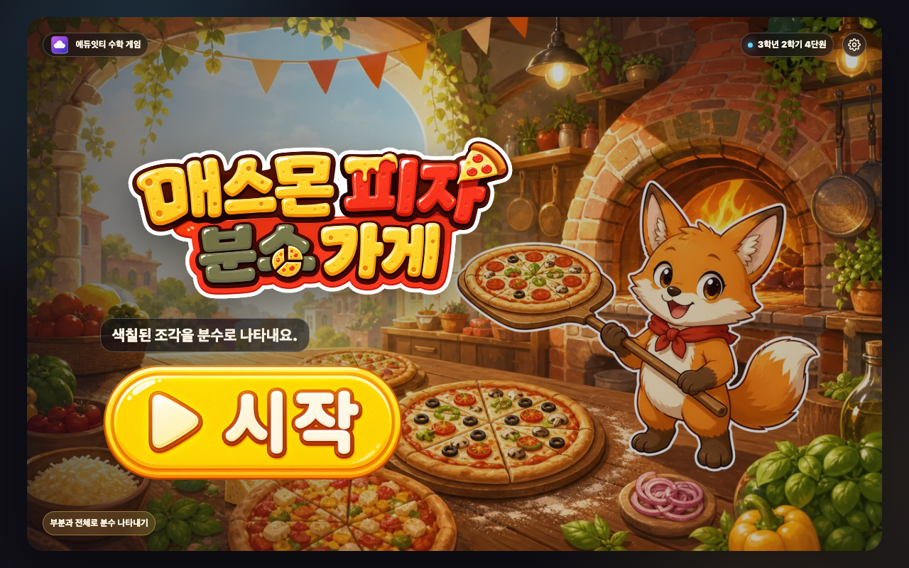

- 학생이 보는 것: 매스몬 피자 분수 가게 제목과 한 줄 목표, 시작 버튼을 봅니다.
- 판단하거나 누르는 것: 게임을 시작할 준비가 되면 시작을 누릅니다.
- 화면에서 확인되는 수학 관계: 부분과 전체로 분수 나타내기을 배우는 차시임을 확인합니다.
- 다음 상태로 넘어가는 이유: 문제를 푸는 방법을 보는 설명 화면으로 이동합니다.

#### 설정 화면 · `engine-flow-desktop-02-settings.png`

- 학생이 보는 것: 배경 소리·효과 소리와 방법 다시 보기, 처음부터, 닫기를 봅니다.
- 판단하거나 누르는 것: 필요한 소리나 이동 행동 하나를 고릅니다.
- 화면에서 확인되는 수학 관계: 수학 문제는 바꾸지 않고 게임 조작만 설정합니다.
- 다음 상태로 넘어가는 이유: 설정을 마치면 열기 전 화면으로 돌아갑니다.

#### 설명 1 · 풀이 방법 · `engine-flow-desktop-03-tutorial-1.png`

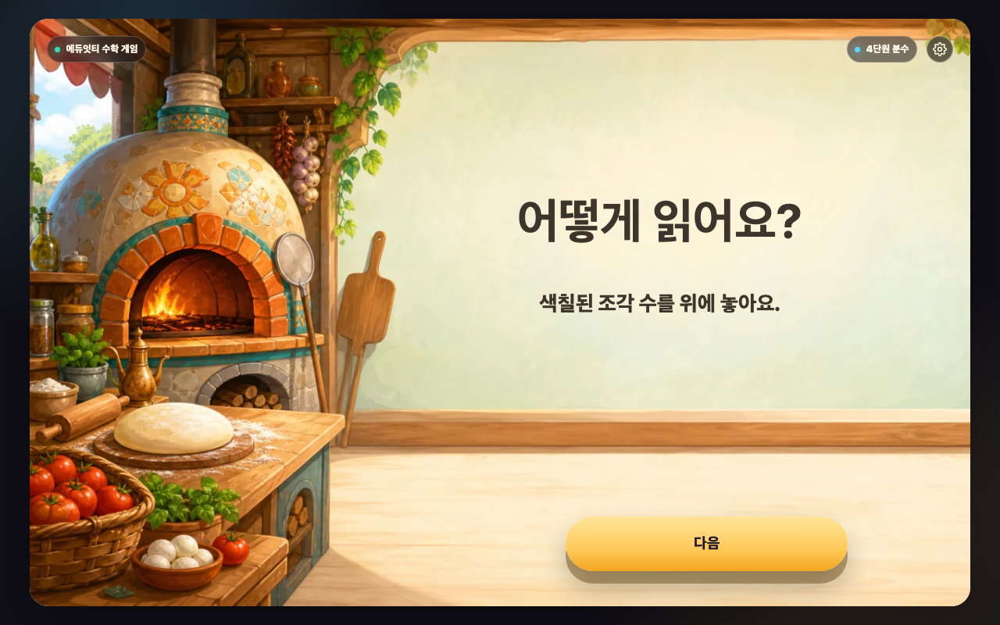

- 학생이 보는 것: 부분과 전체로 분수 나타내기 문제를 푸는 방법과 게임 흐름을 그림으로 봅니다.
- 판단하거나 누르는 것: 그림 속 순서와 누를 곳을 확인한 뒤 다음 행동 버튼을 누릅니다.
- 화면에서 확인되는 수학 관계: 부분과 전체로 분수 나타내기에서 무엇을 비교하거나 계산하는지 확인합니다.
- 다음 상태로 넘어가는 이유: 다음 설명으로 이동합니다.

#### 설명 2 · 보상과 목표 · `engine-flow-desktop-04-tutorial-2.png`

- 학생이 보는 것: 부분과 전체로 분수 나타내기 문제를 푸는 방법과 게임 흐름을 그림으로 봅니다.
- 판단하거나 누르는 것: 그림 속 순서와 누를 곳을 확인한 뒤 다음 행동 버튼을 누릅니다.
- 화면에서 확인되는 수학 관계: 부분과 전체로 분수 나타내기에서 무엇을 비교하거나 계산하는지 확인합니다.
- 다음 상태로 넘어가는 이유: 첫 문제로 이동합니다.

#### 문제 상태 · 05-play-step1 · `engine-flow-desktop-05-play-step1.png`

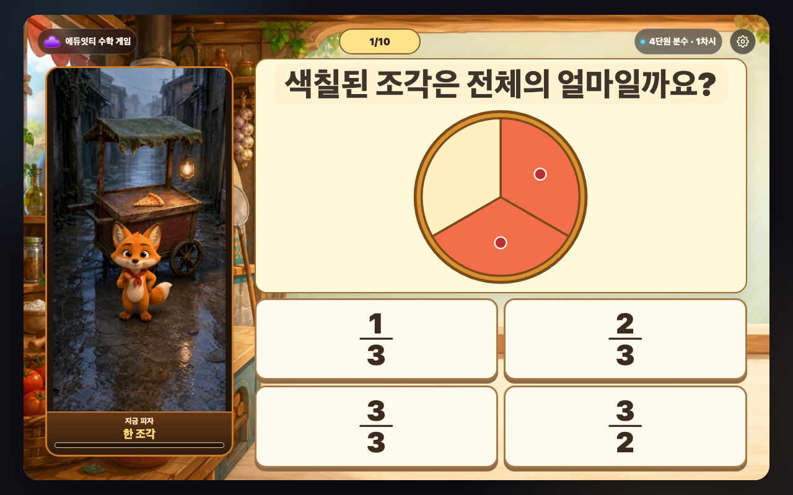

- 학생이 보는 것: 현재 문제, 핵심 계산판이나 물건, 고를 수 있는 답을 봅니다.
- 판단하거나 누르는 것: 문제에서 묻는 값이나 관계에 맞는 답 하나를 고릅니다.
- 화면에서 확인되는 수학 관계: 부분과 전체로 분수 나타내기을 이용해 선택지를 판단합니다.
- 다음 상태로 넘어가는 이유: 고른 답에 따라 오답 또는 정답 확인 상태로 이동합니다.

#### 오개념 확인 · p1-fraction-counts-unshaded · `engine-flow-desktop-05m-p1-fraction-counts-unshaded.png`

- 학생이 보는 것: 고른 답이 계산판이나 물건에 들어간 모습과 짧은 오답 피드백을 봅니다.
- 판단하거나 누르는 것: 어디가 맞지 않는지 확인하고 같은 문제에서 다른 답을 고릅니다.
- 화면에서 확인되는 수학 관계: 부분과 전체로 분수 나타내기의 관계와 고른 답이 왜 맞지 않는지 확인합니다.
- 다음 상태로 넘어가는 이유: 같은 문제에서 다시 판단할 수 있는 상태로 돌아갑니다.

#### 오개념 확인 · p1-fraction-swapped · `engine-flow-desktop-05m-p1-fraction-swapped.png`

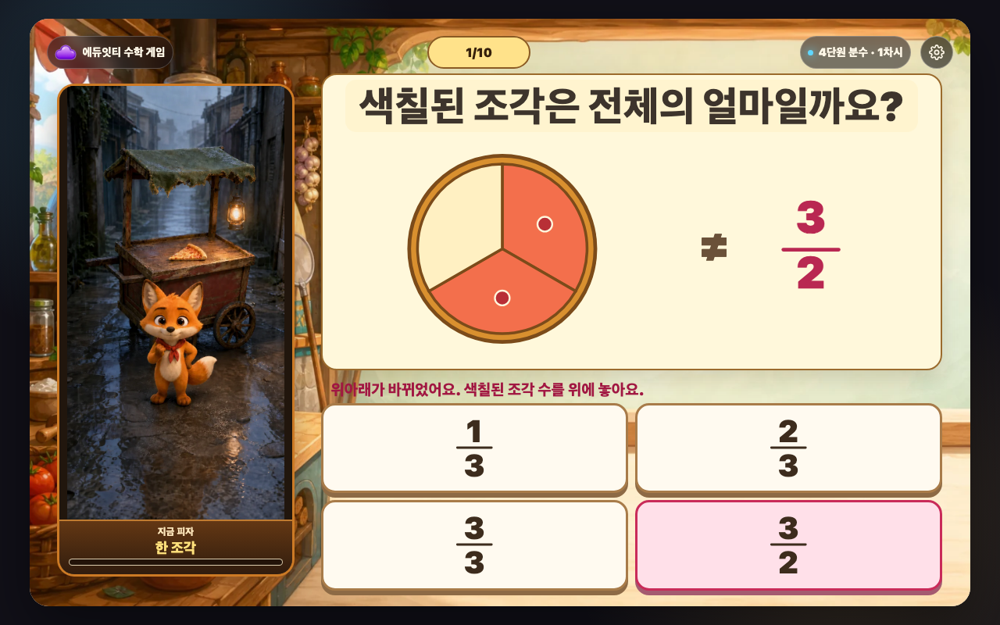

- 학생이 보는 것: 고른 답이 계산판이나 물건에 들어간 모습과 짧은 오답 피드백을 봅니다.
- 판단하거나 누르는 것: 어디가 맞지 않는지 확인하고 같은 문제에서 다른 답을 고릅니다.
- 화면에서 확인되는 수학 관계: 부분과 전체로 분수 나타내기의 관계와 고른 답이 왜 맞지 않는지 확인합니다.
- 다음 상태로 넘어가는 이유: 같은 문제에서 다시 판단할 수 있는 상태로 돌아갑니다.

#### 오답 확인 · 05b-play-wrong · `engine-flow-desktop-05b-play-wrong.png`

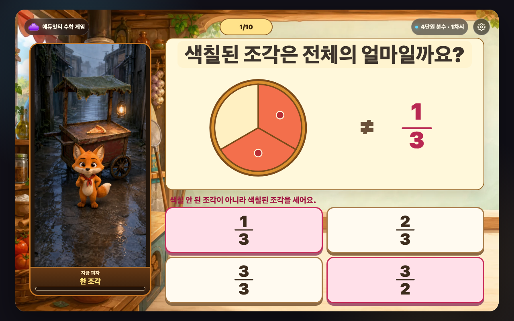

- 학생이 보는 것: 고른 답이 계산판이나 물건에 들어간 모습과 짧은 오답 피드백을 봅니다.
- 판단하거나 누르는 것: 어디가 맞지 않는지 확인하고 같은 문제에서 다른 답을 고릅니다.
- 화면에서 확인되는 수학 관계: 부분과 전체로 분수 나타내기의 관계와 고른 답이 왜 맞지 않는지 확인합니다.
- 다음 상태로 넘어가는 이유: 같은 문제에서 다시 판단할 수 있는 상태로 돌아갑니다.

#### 마지막 확인 · 06-confirm · `engine-flow-desktop-06-confirm.png`

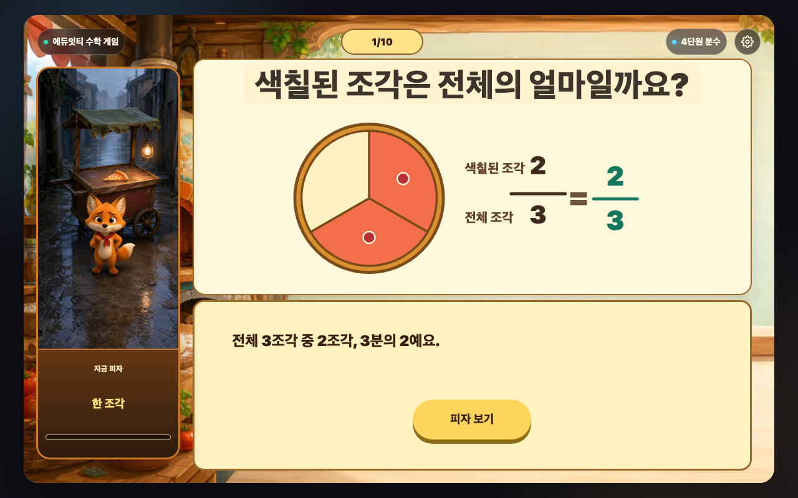

- 학생이 보는 것: 마지막으로 완성된 계산이나 값과 보상으로 가는 행동 버튼을 봅니다.
- 판단하거나 누르는 것: 완성된 관계를 읽은 뒤 보상 확인 버튼을 누릅니다.
- 화면에서 확인되는 수학 관계: 부분과 전체로 분수 나타내기의 완성값을 보상 화면 전에 다시 확인합니다.
- 다음 상태로 넘어가는 이유: 수학 관계를 확인한 뒤 보상 상태로 이동합니다.

#### 닫힌 보상 · `engine-flow-desktop-07-reward-closed.png`

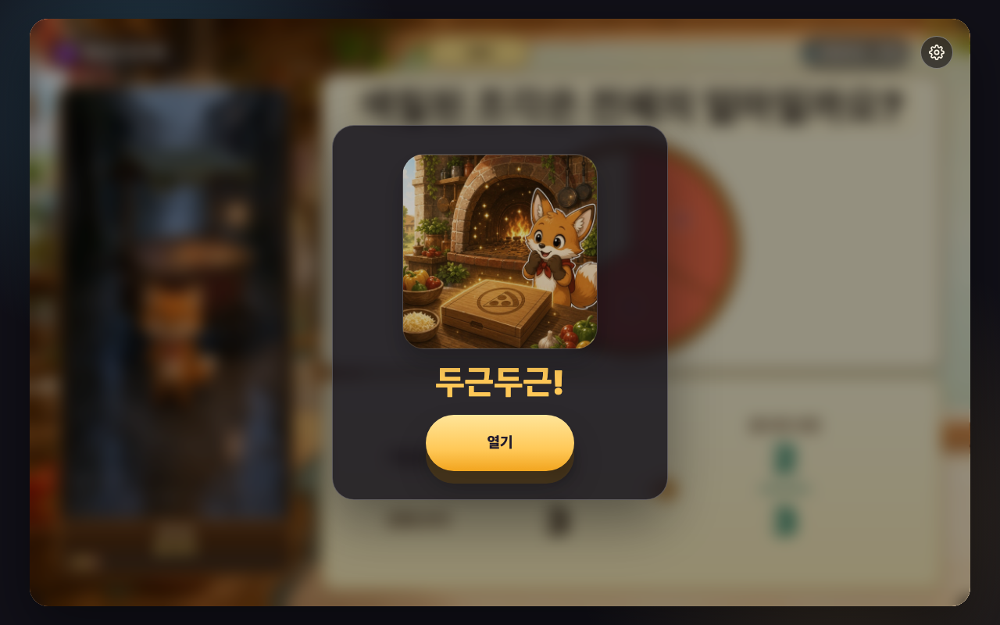

- 학생이 보는 것: 결과가 아직 드러나지 않은 보상 그림과 열기 버튼을 봅니다.
- 판단하거나 누르는 것: 이번 피자 빛 변화를 확인하기 위해 열기를 누릅니다.
- 화면에서 확인되는 수학 관계: 뒤 문제 화면에는 방금 완성한 계산이나 관계가 그대로 남습니다.
- 다음 상태로 넘어가는 이유: 학생이 직접 연 뒤에만 이번 보상 사건이 공개됩니다.

#### 열린 보상 · `engine-flow-desktop-07b-reward-open.png`

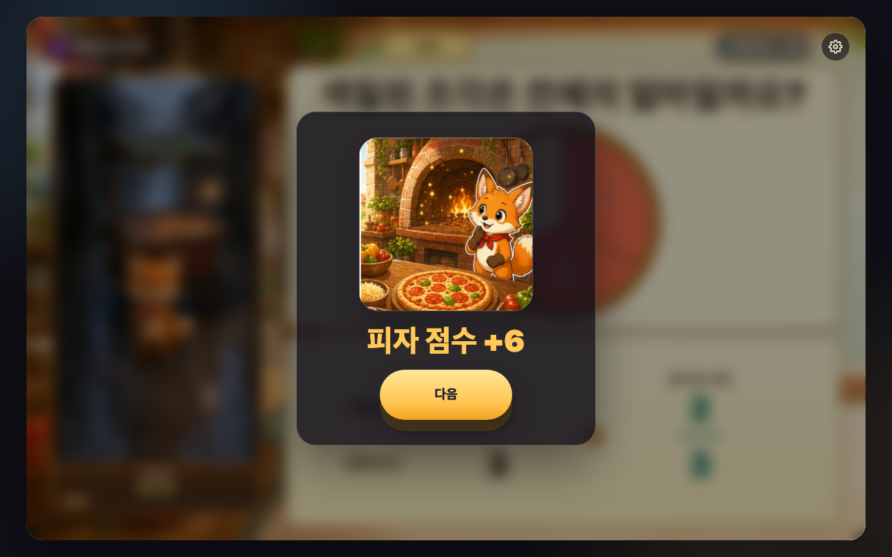

- 학생이 보는 것: 보상 사건 그림과 이번 피자 빛 변화, 다음 행동 버튼을 봅니다.
- 판단하거나 누르는 것: 이번 변화를 확인하고 다음을 누릅니다.
- 화면에서 확인되는 수학 관계: 수학 정답과 무작위 보상 변화가 서로 분리되어 있음을 확인합니다.
- 다음 상태로 넘어가는 이유: 현재 진행 장면의 변화를 본 뒤 다음 문제나 결과로 이동합니다.

#### 보상 뒤 변화 · 07c-reward-impact · `engine-flow-desktop-07c-reward-impact.png`

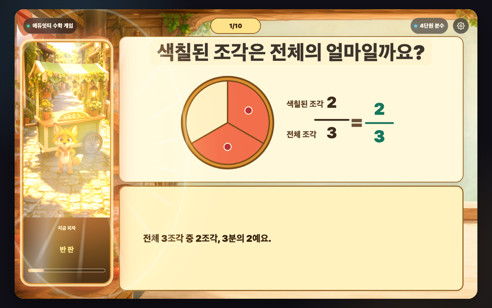

- 학생이 보는 것: 보상 모달이 닫힌 뒤 현재 진행 장면과 피자 빛 변화가 반영되는 모습을 봅니다.
- 판단하거나 누르는 것: 별도 입력 없이 이번 보상이 진행 단계에 반영되는 모습을 확인합니다.
- 화면에서 확인되는 수학 관계: 한 문제의 보상이 현재 진행값에 정확히 한 번 반영됩니다.
- 다음 상태로 넘어가는 이유: 효과를 충분히 본 뒤 다음 문제 또는 결과로 이동합니다.

#### 실제 결과 · `engine-flow-desktop-08-result.png`

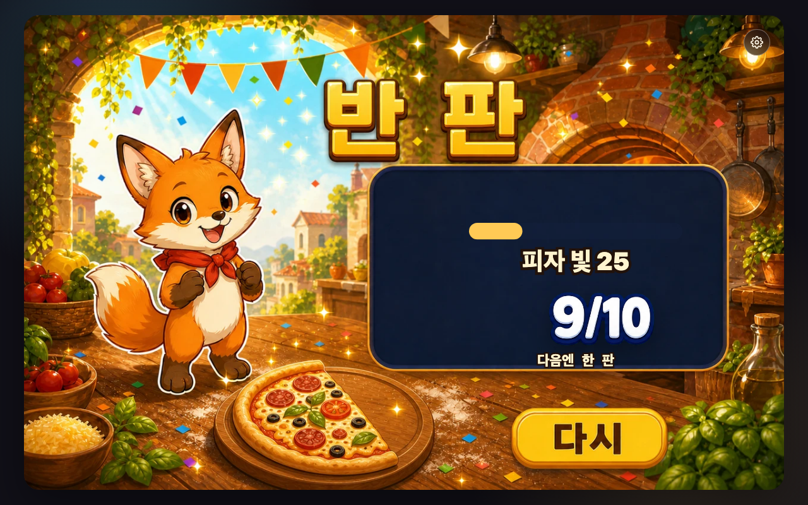

- 학생이 보는 것: 완성 장면과 결과 이름, 정답 수, 다음 목표, 다시 버튼을 봅니다.
- 판단하거나 누르는 것: 현재 결과와 다음 목표를 비교하고 다시 도전할지 결정합니다.
- 화면에서 확인되는 수학 관계: 한 판의 정답과 피자 빛 변화가 하나의 결과 단계로 정리됩니다.
- 다음 상태로 넘어가는 이유: 다시를 누르면 새 문제 순서와 새 보상 흐름으로 시작합니다.

#### 결과 단계 · slice · `engine-flow-desktop-08a-result-slice.png`

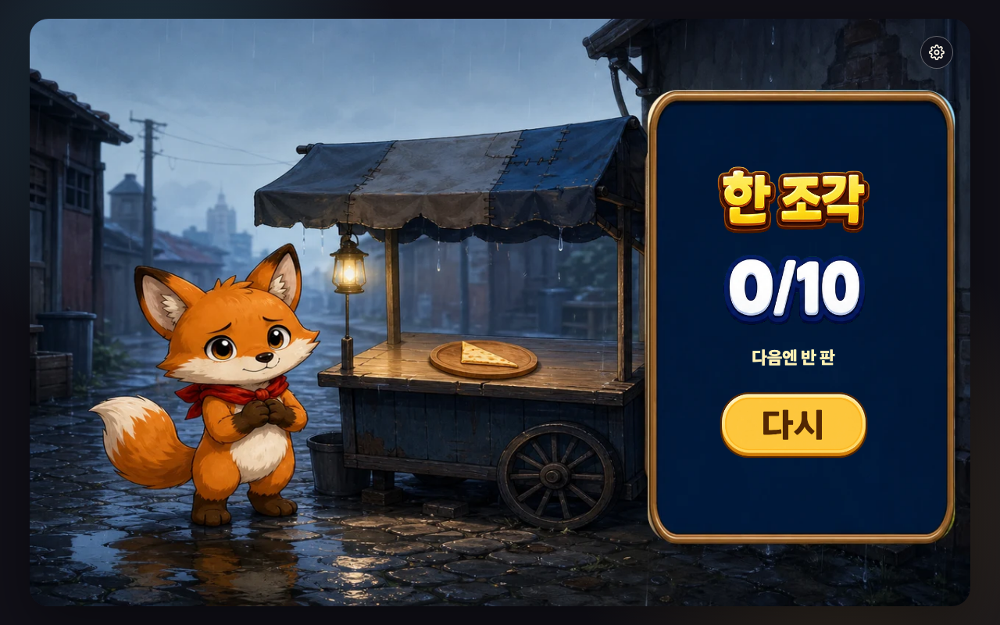

- 학생이 보는 것: 완성 장면과 결과 이름, 정답 수, 다음 목표, 다시 버튼을 봅니다.
- 판단하거나 누르는 것: 현재 결과와 다음 목표를 비교하고 다시 도전할지 결정합니다.
- 화면에서 확인되는 수학 관계: 한 판의 정답과 피자 빛 변화가 하나의 결과 단계로 정리됩니다.
- 다음 상태로 넘어가는 이유: 다시를 누르면 새 문제 순서와 새 보상 흐름으로 시작합니다.

#### 결과 결속 · half · `engine-flow-desktop-08c-result-cohesion-half.png`

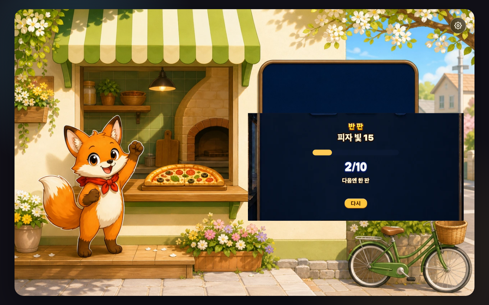

- 학생이 보는 것: 완성 장면과 결과 이름, 정답 수, 다음 목표, 다시 버튼을 봅니다.
- 판단하거나 누르는 것: 현재 결과와 다음 목표를 비교하고 다시 도전할지 결정합니다.
- 화면에서 확인되는 수학 관계: 한 판의 정답과 피자 빛 변화가 하나의 결과 단계로 정리됩니다.
- 다음 상태로 넘어가는 이유: 다시를 누르면 새 문제 순서와 새 보상 흐름으로 시작합니다.

#### 결과 결속 · jumbo · `engine-flow-desktop-08c-result-cohesion-jumbo.png`

- 학생이 보는 것: 완성 장면과 결과 이름, 정답 수, 다음 목표, 다시 버튼을 봅니다.
- 판단하거나 누르는 것: 현재 결과와 다음 목표를 비교하고 다시 도전할지 결정합니다.
- 화면에서 확인되는 수학 관계: 한 판의 정답과 피자 빛 변화가 하나의 결과 단계로 정리됩니다.
- 다음 상태로 넘어가는 이유: 다시를 누르면 새 문제 순서와 새 보상 흐름으로 시작합니다.

#### 결과 결속 · legend · `engine-flow-desktop-08c-result-cohesion-legend.png`

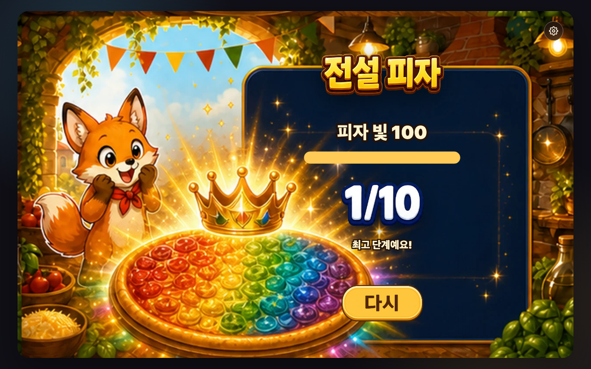

- 학생이 보는 것: 완성 장면과 결과 이름, 정답 수, 다음 목표, 다시 버튼을 봅니다.
- 판단하거나 누르는 것: 현재 결과와 다음 목표를 비교하고 다시 도전할지 결정합니다.
- 화면에서 확인되는 수학 관계: 한 판의 정답과 피자 빛 변화가 하나의 결과 단계로 정리됩니다.
- 다음 상태로 넘어가는 이유: 다시를 누르면 새 문제 순서와 새 보상 흐름으로 시작합니다.

#### 결과 결속 · shopstar · `engine-flow-desktop-08c-result-cohesion-shopstar.png`

- 학생이 보는 것: 완성 장면과 결과 이름, 정답 수, 다음 목표, 다시 버튼을 봅니다.
- 판단하거나 누르는 것: 현재 결과와 다음 목표를 비교하고 다시 도전할지 결정합니다.
- 화면에서 확인되는 수학 관계: 한 판의 정답과 피자 빛 변화가 하나의 결과 단계로 정리됩니다.
- 다음 상태로 넘어가는 이유: 다시를 누르면 새 문제 순서와 새 보상 흐름으로 시작합니다.

#### 결과 결속 · slice · `engine-flow-desktop-08c-result-cohesion-slice.png`

- 학생이 보는 것: 완성 장면과 결과 이름, 정답 수, 다음 목표, 다시 버튼을 봅니다.
- 판단하거나 누르는 것: 현재 결과와 다음 목표를 비교하고 다시 도전할지 결정합니다.
- 화면에서 확인되는 수학 관계: 한 판의 정답과 피자 빛 변화가 하나의 결과 단계로 정리됩니다.
- 다음 상태로 넘어가는 이유: 다시를 누르면 새 문제 순서와 새 보상 흐름으로 시작합니다.

#### 결과 결속 · whole · `engine-flow-desktop-08c-result-cohesion-whole.png`

- 학생이 보는 것: 완성 장면과 결과 이름, 정답 수, 다음 목표, 다시 버튼을 봅니다.
- 판단하거나 누르는 것: 현재 결과와 다음 목표를 비교하고 다시 도전할지 결정합니다.
- 화면에서 확인되는 수학 관계: 한 판의 정답과 피자 빛 변화가 하나의 결과 단계로 정리됩니다.
- 다음 상태로 넘어가는 이유: 다시를 누르면 새 문제 순서와 새 보상 흐름으로 시작합니다.

#### 결과 단계 · half · `engine-flow-desktop-08a-result-half.png`

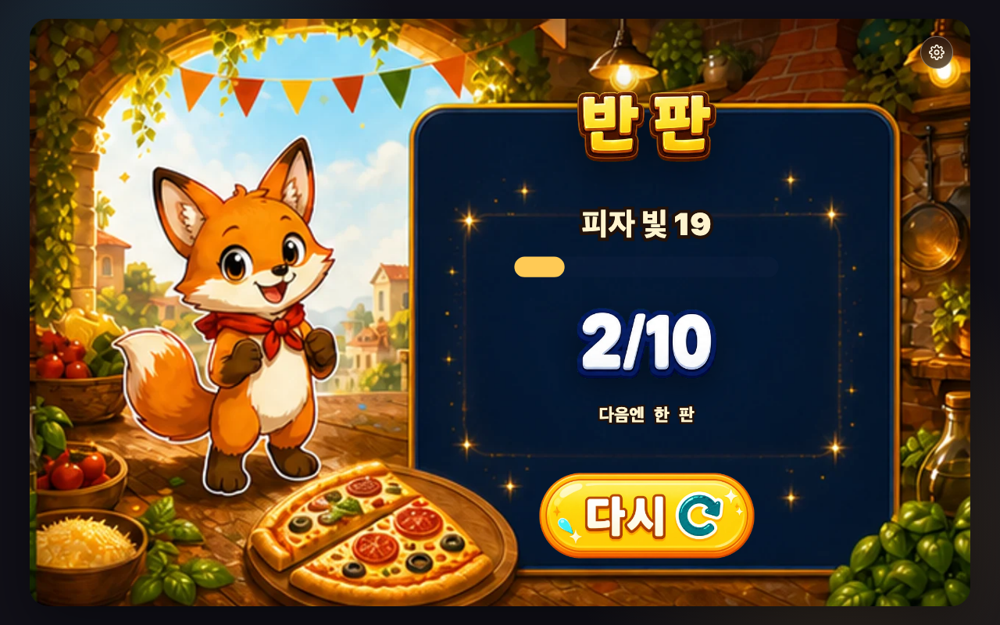

- 학생이 보는 것: 완성 장면과 결과 이름, 정답 수, 다음 목표, 다시 버튼을 봅니다.
- 판단하거나 누르는 것: 현재 결과와 다음 목표를 비교하고 다시 도전할지 결정합니다.
- 화면에서 확인되는 수학 관계: 한 판의 정답과 피자 빛 변화가 하나의 결과 단계로 정리됩니다.
- 다음 상태로 넘어가는 이유: 다시를 누르면 새 문제 순서와 새 보상 흐름으로 시작합니다.

#### 결과 단계 · whole · `engine-flow-desktop-08a-result-whole.png`

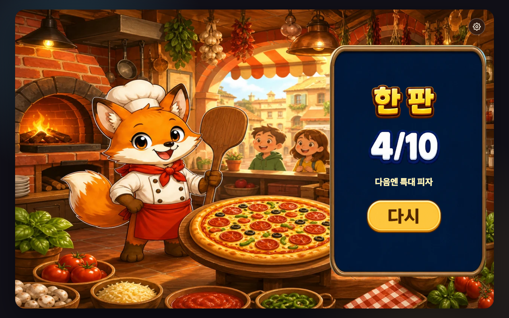

- 학생이 보는 것: 완성 장면과 결과 이름, 정답 수, 다음 목표, 다시 버튼을 봅니다.
- 판단하거나 누르는 것: 현재 결과와 다음 목표를 비교하고 다시 도전할지 결정합니다.
- 화면에서 확인되는 수학 관계: 한 판의 정답과 피자 빛 변화가 하나의 결과 단계로 정리됩니다.
- 다음 상태로 넘어가는 이유: 다시를 누르면 새 문제 순서와 새 보상 흐름으로 시작합니다.

#### 결과 단계 · jumbo · `engine-flow-desktop-08a-result-jumbo.png`

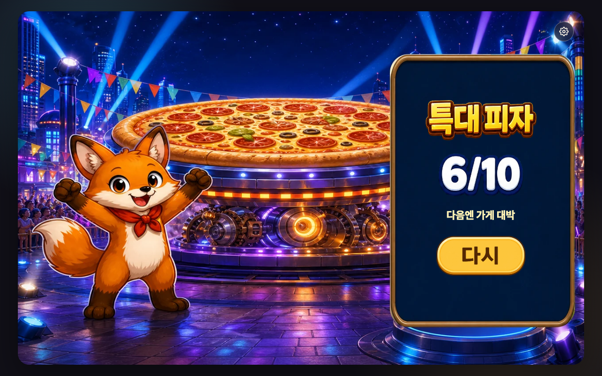

- 학생이 보는 것: 완성 장면과 결과 이름, 정답 수, 다음 목표, 다시 버튼을 봅니다.
- 판단하거나 누르는 것: 현재 결과와 다음 목표를 비교하고 다시 도전할지 결정합니다.
- 화면에서 확인되는 수학 관계: 한 판의 정답과 피자 빛 변화가 하나의 결과 단계로 정리됩니다.
- 다음 상태로 넘어가는 이유: 다시를 누르면 새 문제 순서와 새 보상 흐름으로 시작합니다.

#### 결과 단계 · shopstar · `engine-flow-desktop-08a-result-shopstar.png`

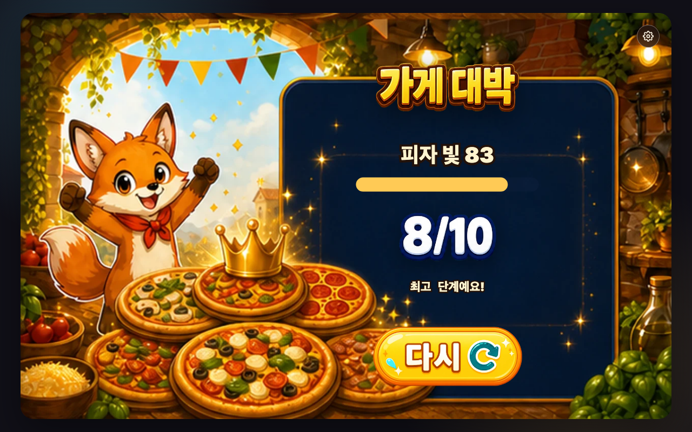

- 학생이 보는 것: 완성 장면과 결과 이름, 정답 수, 다음 목표, 다시 버튼을 봅니다.
- 판단하거나 누르는 것: 현재 결과와 다음 목표를 비교하고 다시 도전할지 결정합니다.
- 화면에서 확인되는 수학 관계: 한 판의 정답과 피자 빛 변화가 하나의 결과 단계로 정리됩니다.
- 다음 상태로 넘어가는 이유: 다시를 누르면 새 문제 순서와 새 보상 흐름으로 시작합니다.

#### 결과 단계 · legend · `engine-flow-desktop-08a-result-legend.png`

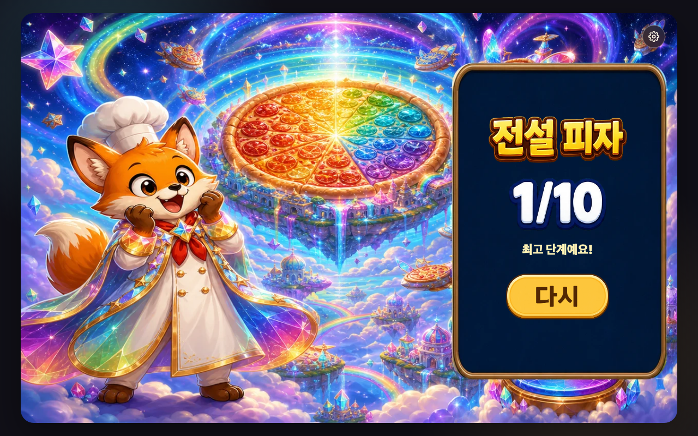

- 학생이 보는 것: 완성 장면과 결과 이름, 정답 수, 다음 목표, 다시 버튼을 봅니다.
- 판단하거나 누르는 것: 현재 결과와 다음 목표를 비교하고 다시 도전할지 결정합니다.
- 화면에서 확인되는 수학 관계: 한 판의 정답과 피자 빛 변화가 하나의 결과 단계로 정리됩니다.
- 다음 상태로 넘어가는 이유: 다시를 누르면 새 문제 순서와 새 보상 흐름으로 시작합니다.

### tablet-landscape · 1024×768 · DPR 1 · 25장

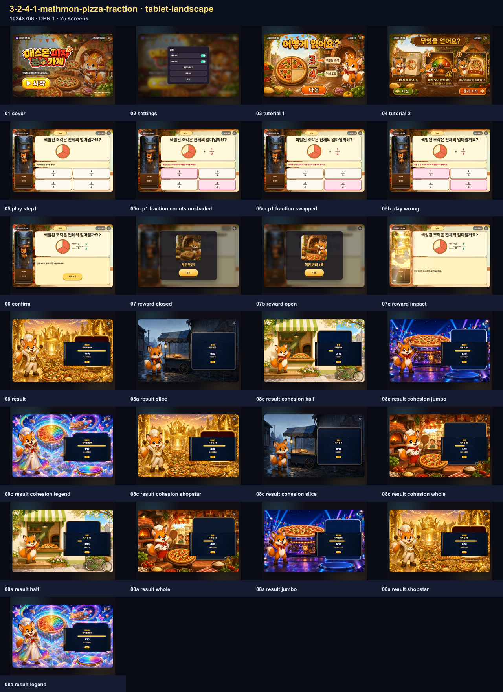

#### 시작 화면 · `engine-flow-tablet-landscape-01-cover.png`

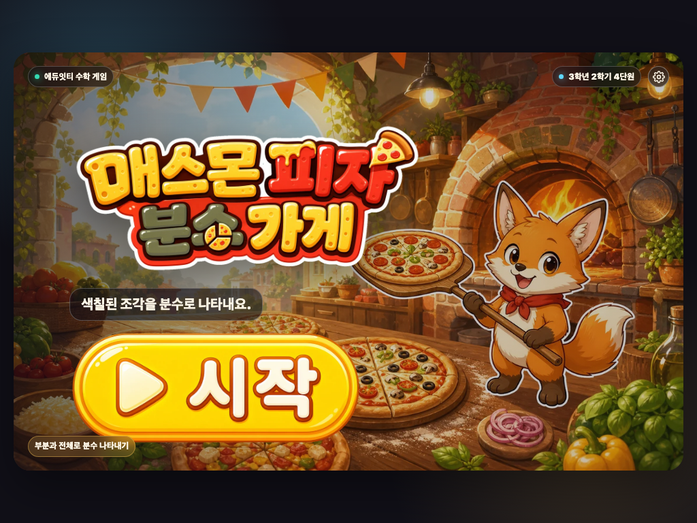

- 학생이 보는 것: 매스몬 피자 분수 가게 제목과 한 줄 목표, 시작 버튼을 봅니다.
- 판단하거나 누르는 것: 게임을 시작할 준비가 되면 시작을 누릅니다.
- 화면에서 확인되는 수학 관계: 부분과 전체로 분수 나타내기을 배우는 차시임을 확인합니다.
- 다음 상태로 넘어가는 이유: 문제를 푸는 방법을 보는 설명 화면으로 이동합니다.

#### 설정 화면 · `engine-flow-tablet-landscape-02-settings.png`

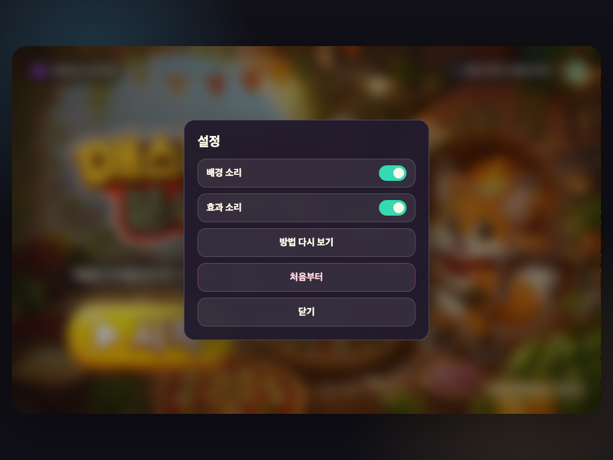

- 학생이 보는 것: 배경 소리·효과 소리와 방법 다시 보기, 처음부터, 닫기를 봅니다.
- 판단하거나 누르는 것: 필요한 소리나 이동 행동 하나를 고릅니다.
- 화면에서 확인되는 수학 관계: 수학 문제는 바꾸지 않고 게임 조작만 설정합니다.
- 다음 상태로 넘어가는 이유: 설정을 마치면 열기 전 화면으로 돌아갑니다.

#### 설명 1 · 풀이 방법 · `engine-flow-tablet-landscape-03-tutorial-1.png`

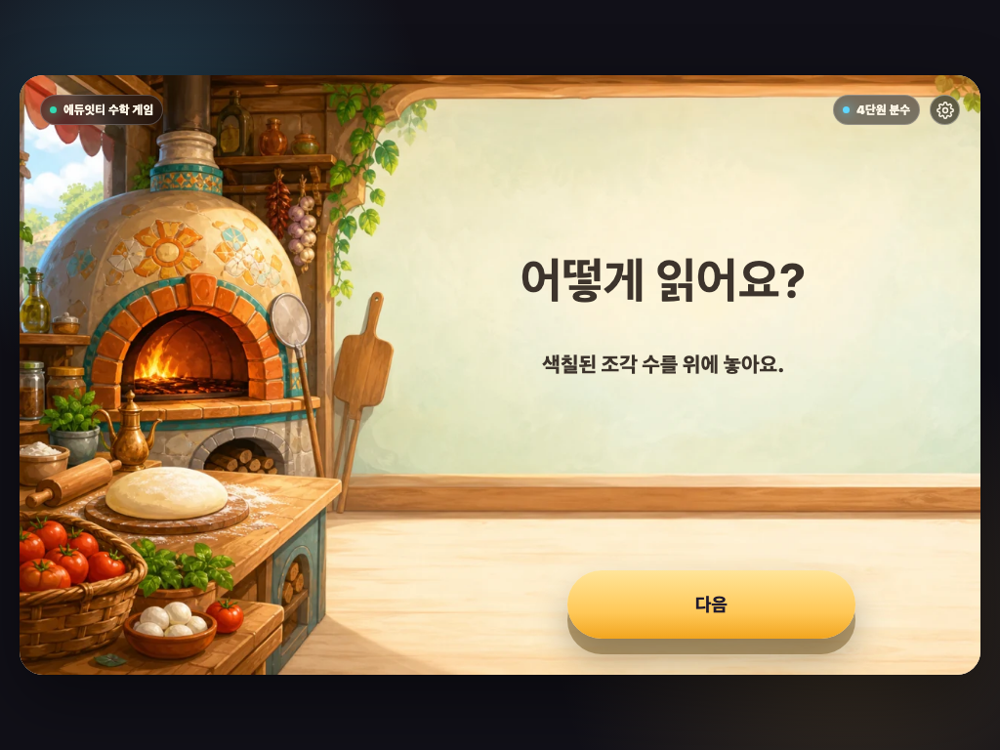

- 학생이 보는 것: 부분과 전체로 분수 나타내기 문제를 푸는 방법과 게임 흐름을 그림으로 봅니다.
- 판단하거나 누르는 것: 그림 속 순서와 누를 곳을 확인한 뒤 다음 행동 버튼을 누릅니다.
- 화면에서 확인되는 수학 관계: 부분과 전체로 분수 나타내기에서 무엇을 비교하거나 계산하는지 확인합니다.
- 다음 상태로 넘어가는 이유: 다음 설명으로 이동합니다.

#### 설명 2 · 보상과 목표 · `engine-flow-tablet-landscape-04-tutorial-2.png`

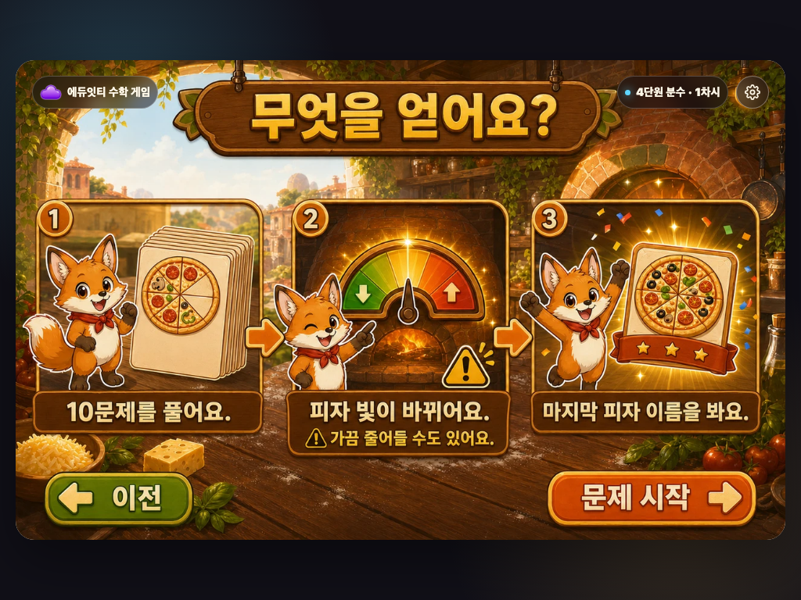

- 학생이 보는 것: 부분과 전체로 분수 나타내기 문제를 푸는 방법과 게임 흐름을 그림으로 봅니다.
- 판단하거나 누르는 것: 그림 속 순서와 누를 곳을 확인한 뒤 다음 행동 버튼을 누릅니다.
- 화면에서 확인되는 수학 관계: 부분과 전체로 분수 나타내기에서 무엇을 비교하거나 계산하는지 확인합니다.
- 다음 상태로 넘어가는 이유: 첫 문제로 이동합니다.

#### 문제 상태 · 05-play-step1 · `engine-flow-tablet-landscape-05-play-step1.png`

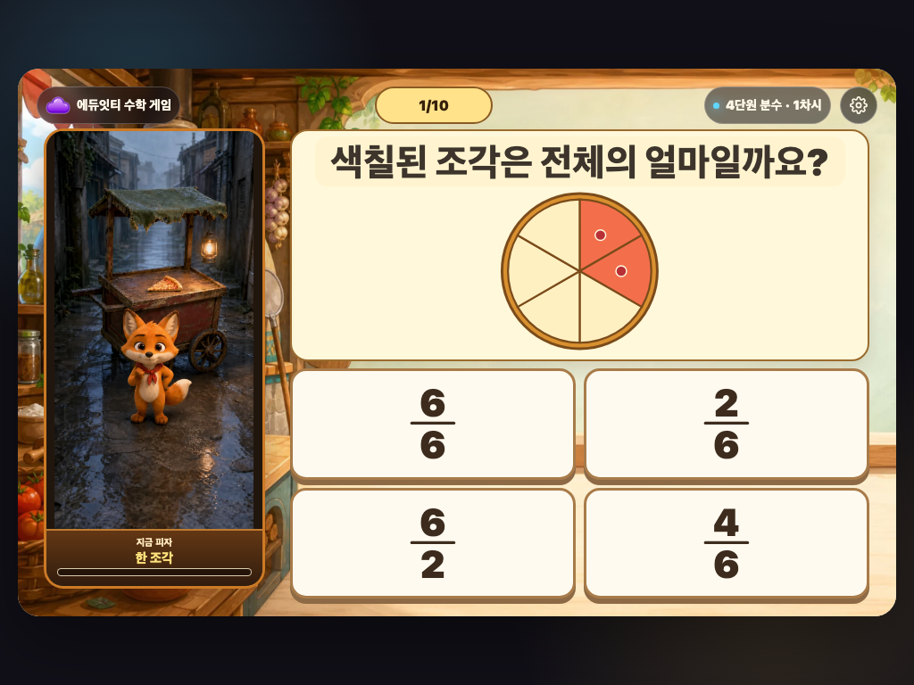

- 학생이 보는 것: 현재 문제, 핵심 계산판이나 물건, 고를 수 있는 답을 봅니다.
- 판단하거나 누르는 것: 문제에서 묻는 값이나 관계에 맞는 답 하나를 고릅니다.
- 화면에서 확인되는 수학 관계: 부분과 전체로 분수 나타내기을 이용해 선택지를 판단합니다.
- 다음 상태로 넘어가는 이유: 고른 답에 따라 오답 또는 정답 확인 상태로 이동합니다.

#### 오개념 확인 · p1-fraction-counts-unshaded · `engine-flow-tablet-landscape-05m-p1-fraction-counts-unshaded.png`

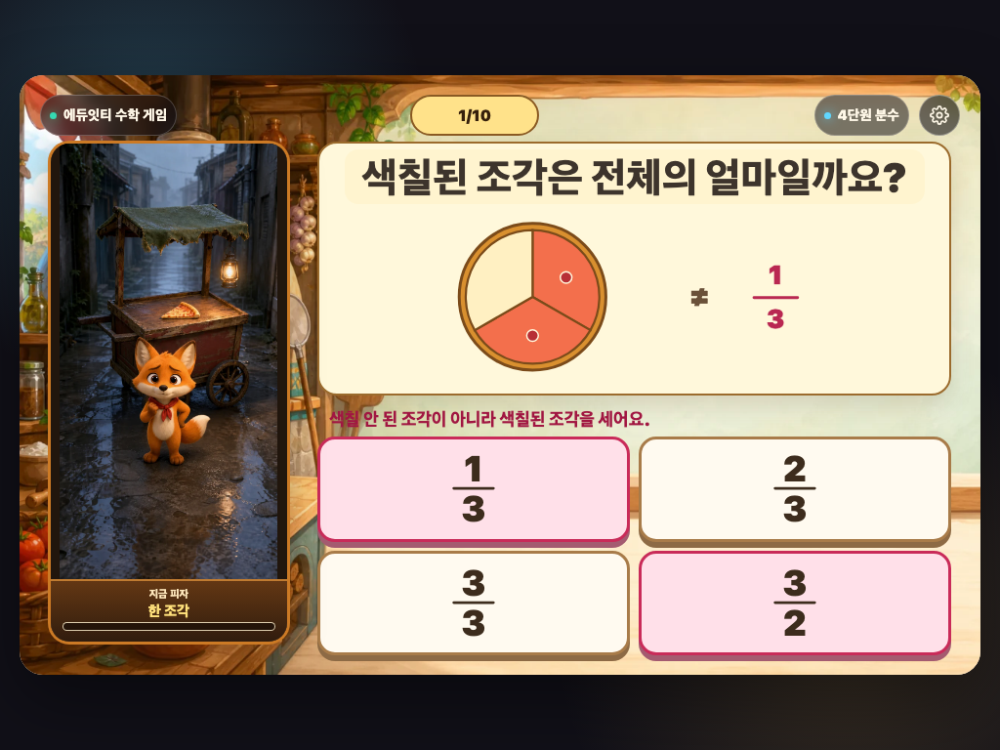

- 학생이 보는 것: 고른 답이 계산판이나 물건에 들어간 모습과 짧은 오답 피드백을 봅니다.
- 판단하거나 누르는 것: 어디가 맞지 않는지 확인하고 같은 문제에서 다른 답을 고릅니다.
- 화면에서 확인되는 수학 관계: 부분과 전체로 분수 나타내기의 관계와 고른 답이 왜 맞지 않는지 확인합니다.
- 다음 상태로 넘어가는 이유: 같은 문제에서 다시 판단할 수 있는 상태로 돌아갑니다.

#### 오개념 확인 · p1-fraction-swapped · `engine-flow-tablet-landscape-05m-p1-fraction-swapped.png`

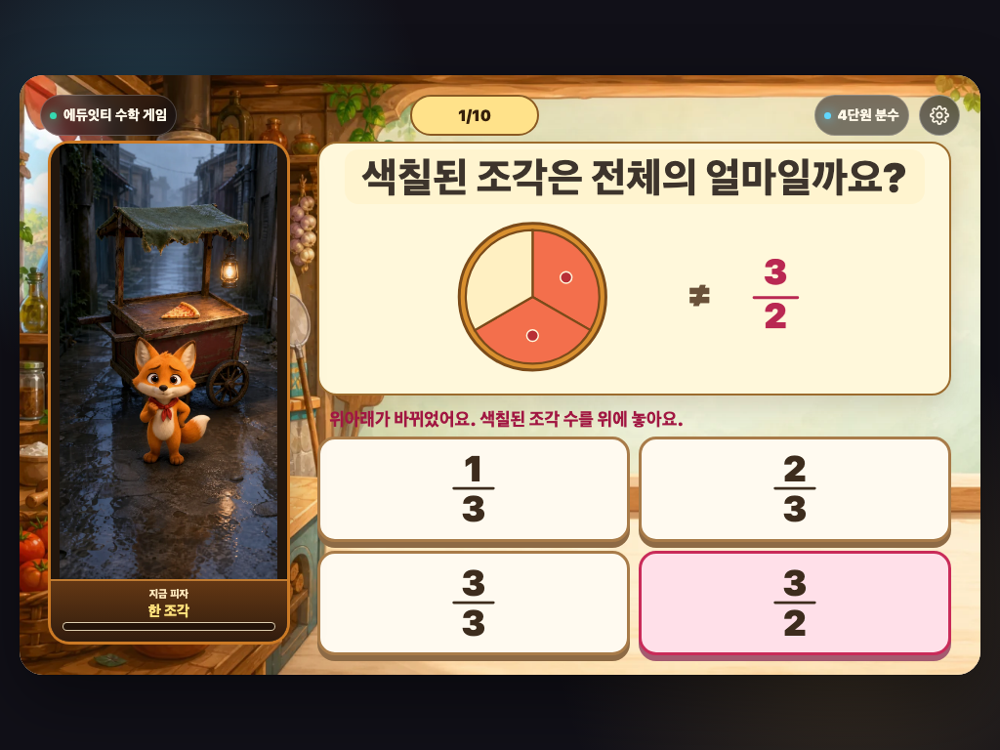

- 학생이 보는 것: 고른 답이 계산판이나 물건에 들어간 모습과 짧은 오답 피드백을 봅니다.
- 판단하거나 누르는 것: 어디가 맞지 않는지 확인하고 같은 문제에서 다른 답을 고릅니다.
- 화면에서 확인되는 수학 관계: 부분과 전체로 분수 나타내기의 관계와 고른 답이 왜 맞지 않는지 확인합니다.
- 다음 상태로 넘어가는 이유: 같은 문제에서 다시 판단할 수 있는 상태로 돌아갑니다.

#### 오답 확인 · 05b-play-wrong · `engine-flow-tablet-landscape-05b-play-wrong.png`

- 학생이 보는 것: 고른 답이 계산판이나 물건에 들어간 모습과 짧은 오답 피드백을 봅니다.
- 판단하거나 누르는 것: 어디가 맞지 않는지 확인하고 같은 문제에서 다른 답을 고릅니다.
- 화면에서 확인되는 수학 관계: 부분과 전체로 분수 나타내기의 관계와 고른 답이 왜 맞지 않는지 확인합니다.
- 다음 상태로 넘어가는 이유: 같은 문제에서 다시 판단할 수 있는 상태로 돌아갑니다.

#### 마지막 확인 · 06-confirm · `engine-flow-tablet-landscape-06-confirm.png`

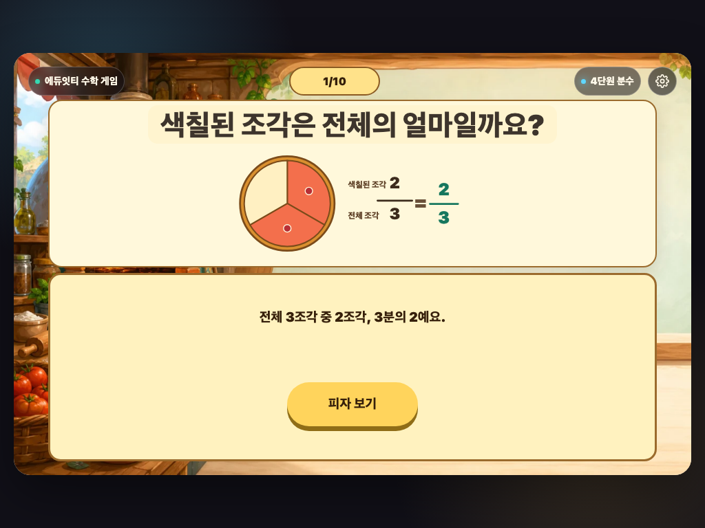

- 학생이 보는 것: 마지막으로 완성된 계산이나 값과 보상으로 가는 행동 버튼을 봅니다.
- 판단하거나 누르는 것: 완성된 관계를 읽은 뒤 보상 확인 버튼을 누릅니다.
- 화면에서 확인되는 수학 관계: 부분과 전체로 분수 나타내기의 완성값을 보상 화면 전에 다시 확인합니다.
- 다음 상태로 넘어가는 이유: 수학 관계를 확인한 뒤 보상 상태로 이동합니다.

#### 닫힌 보상 · `engine-flow-tablet-landscape-07-reward-closed.png`

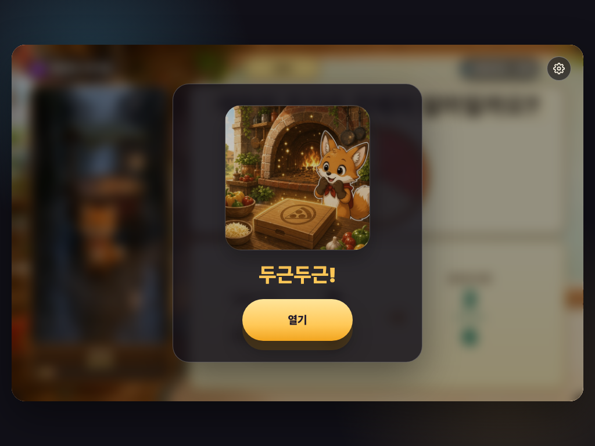

- 학생이 보는 것: 결과가 아직 드러나지 않은 보상 그림과 열기 버튼을 봅니다.
- 판단하거나 누르는 것: 이번 피자 빛 변화를 확인하기 위해 열기를 누릅니다.
- 화면에서 확인되는 수학 관계: 뒤 문제 화면에는 방금 완성한 계산이나 관계가 그대로 남습니다.
- 다음 상태로 넘어가는 이유: 학생이 직접 연 뒤에만 이번 보상 사건이 공개됩니다.

#### 열린 보상 · `engine-flow-tablet-landscape-07b-reward-open.png`

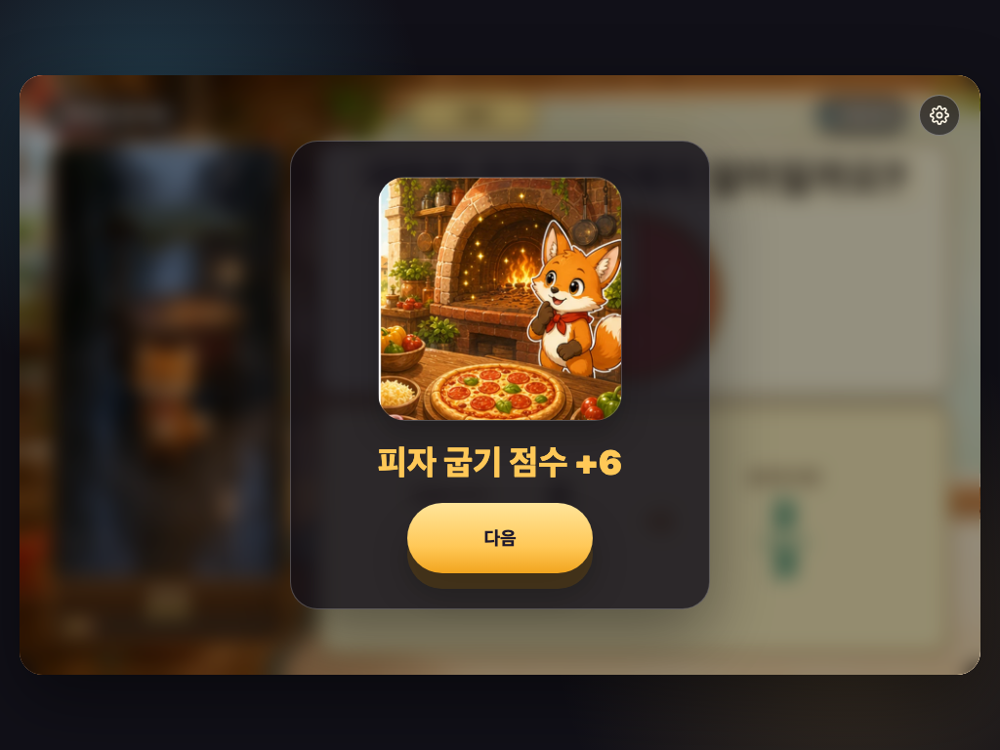

- 학생이 보는 것: 보상 사건 그림과 이번 피자 빛 변화, 다음 행동 버튼을 봅니다.
- 판단하거나 누르는 것: 이번 변화를 확인하고 다음을 누릅니다.
- 화면에서 확인되는 수학 관계: 수학 정답과 무작위 보상 변화가 서로 분리되어 있음을 확인합니다.
- 다음 상태로 넘어가는 이유: 현재 진행 장면의 변화를 본 뒤 다음 문제나 결과로 이동합니다.

#### 보상 뒤 변화 · 07c-reward-impact · `engine-flow-tablet-landscape-07c-reward-impact.png`

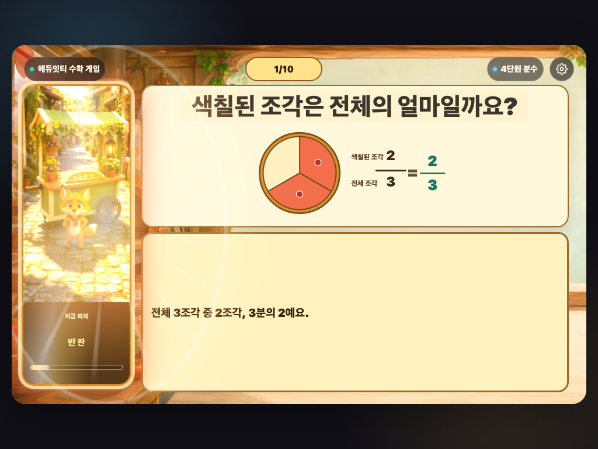

- 학생이 보는 것: 보상 모달이 닫힌 뒤 현재 진행 장면과 피자 빛 변화가 반영되는 모습을 봅니다.
- 판단하거나 누르는 것: 별도 입력 없이 이번 보상이 진행 단계에 반영되는 모습을 확인합니다.
- 화면에서 확인되는 수학 관계: 한 문제의 보상이 현재 진행값에 정확히 한 번 반영됩니다.
- 다음 상태로 넘어가는 이유: 효과를 충분히 본 뒤 다음 문제 또는 결과로 이동합니다.

#### 실제 결과 · `engine-flow-tablet-landscape-08-result.png`

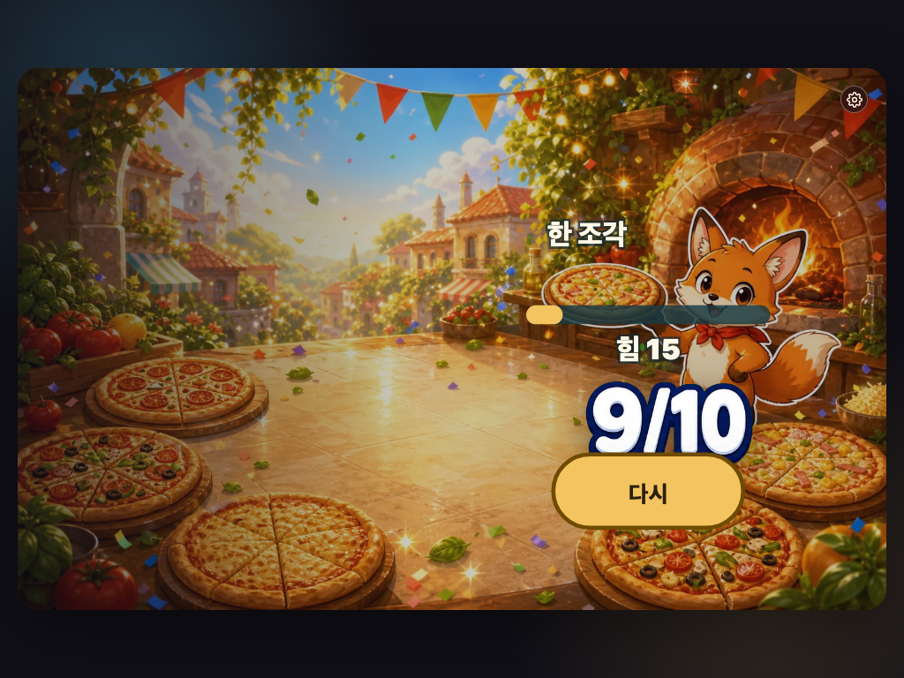

- 학생이 보는 것: 완성 장면과 결과 이름, 정답 수, 다음 목표, 다시 버튼을 봅니다.
- 판단하거나 누르는 것: 현재 결과와 다음 목표를 비교하고 다시 도전할지 결정합니다.
- 화면에서 확인되는 수학 관계: 한 판의 정답과 피자 빛 변화가 하나의 결과 단계로 정리됩니다.
- 다음 상태로 넘어가는 이유: 다시를 누르면 새 문제 순서와 새 보상 흐름으로 시작합니다.

#### 결과 단계 · slice · `engine-flow-tablet-landscape-08a-result-slice.png`

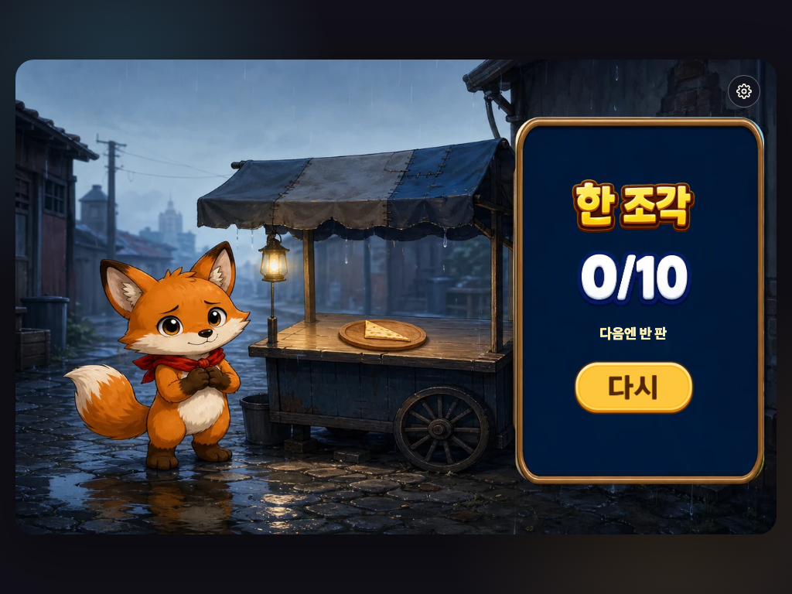

- 학생이 보는 것: 완성 장면과 결과 이름, 정답 수, 다음 목표, 다시 버튼을 봅니다.
- 판단하거나 누르는 것: 현재 결과와 다음 목표를 비교하고 다시 도전할지 결정합니다.
- 화면에서 확인되는 수학 관계: 한 판의 정답과 피자 빛 변화가 하나의 결과 단계로 정리됩니다.
- 다음 상태로 넘어가는 이유: 다시를 누르면 새 문제 순서와 새 보상 흐름으로 시작합니다.

#### 결과 결속 · half · `engine-flow-tablet-landscape-08c-result-cohesion-half.png`

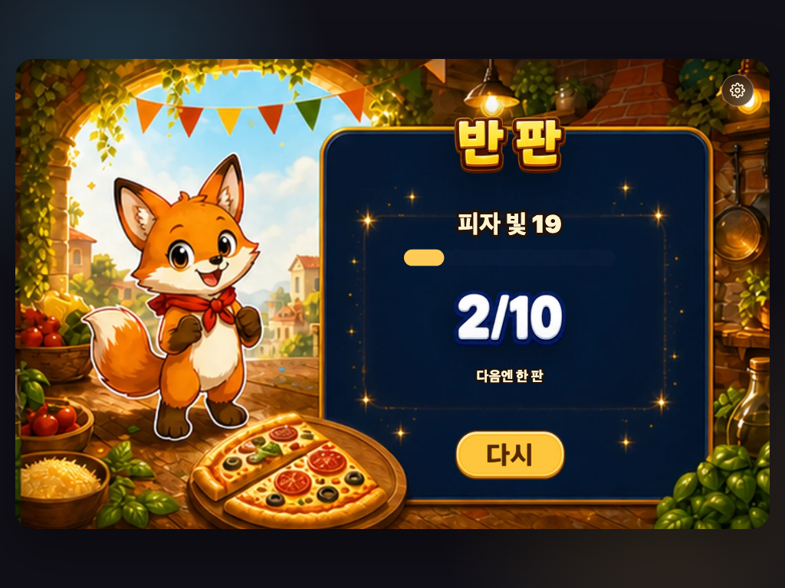

- 학생이 보는 것: 완성 장면과 결과 이름, 정답 수, 다음 목표, 다시 버튼을 봅니다.
- 판단하거나 누르는 것: 현재 결과와 다음 목표를 비교하고 다시 도전할지 결정합니다.
- 화면에서 확인되는 수학 관계: 한 판의 정답과 피자 빛 변화가 하나의 결과 단계로 정리됩니다.
- 다음 상태로 넘어가는 이유: 다시를 누르면 새 문제 순서와 새 보상 흐름으로 시작합니다.

#### 결과 결속 · jumbo · `engine-flow-tablet-landscape-08c-result-cohesion-jumbo.png`

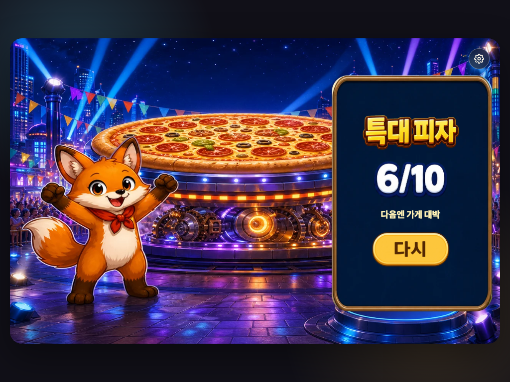

- 학생이 보는 것: 완성 장면과 결과 이름, 정답 수, 다음 목표, 다시 버튼을 봅니다.
- 판단하거나 누르는 것: 현재 결과와 다음 목표를 비교하고 다시 도전할지 결정합니다.
- 화면에서 확인되는 수학 관계: 한 판의 정답과 피자 빛 변화가 하나의 결과 단계로 정리됩니다.
- 다음 상태로 넘어가는 이유: 다시를 누르면 새 문제 순서와 새 보상 흐름으로 시작합니다.

#### 결과 결속 · legend · `engine-flow-tablet-landscape-08c-result-cohesion-legend.png`

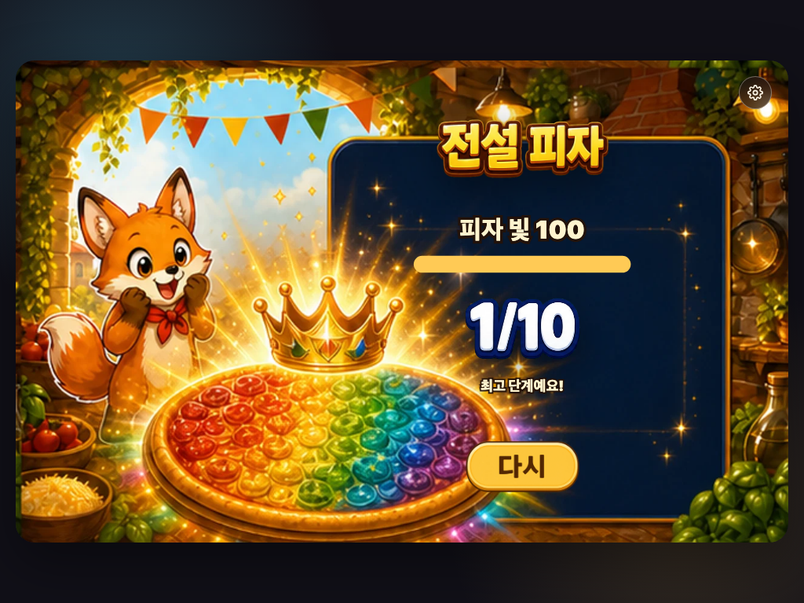

- 학생이 보는 것: 완성 장면과 결과 이름, 정답 수, 다음 목표, 다시 버튼을 봅니다.
- 판단하거나 누르는 것: 현재 결과와 다음 목표를 비교하고 다시 도전할지 결정합니다.
- 화면에서 확인되는 수학 관계: 한 판의 정답과 피자 빛 변화가 하나의 결과 단계로 정리됩니다.
- 다음 상태로 넘어가는 이유: 다시를 누르면 새 문제 순서와 새 보상 흐름으로 시작합니다.

#### 결과 결속 · shopstar · `engine-flow-tablet-landscape-08c-result-cohesion-shopstar.png`

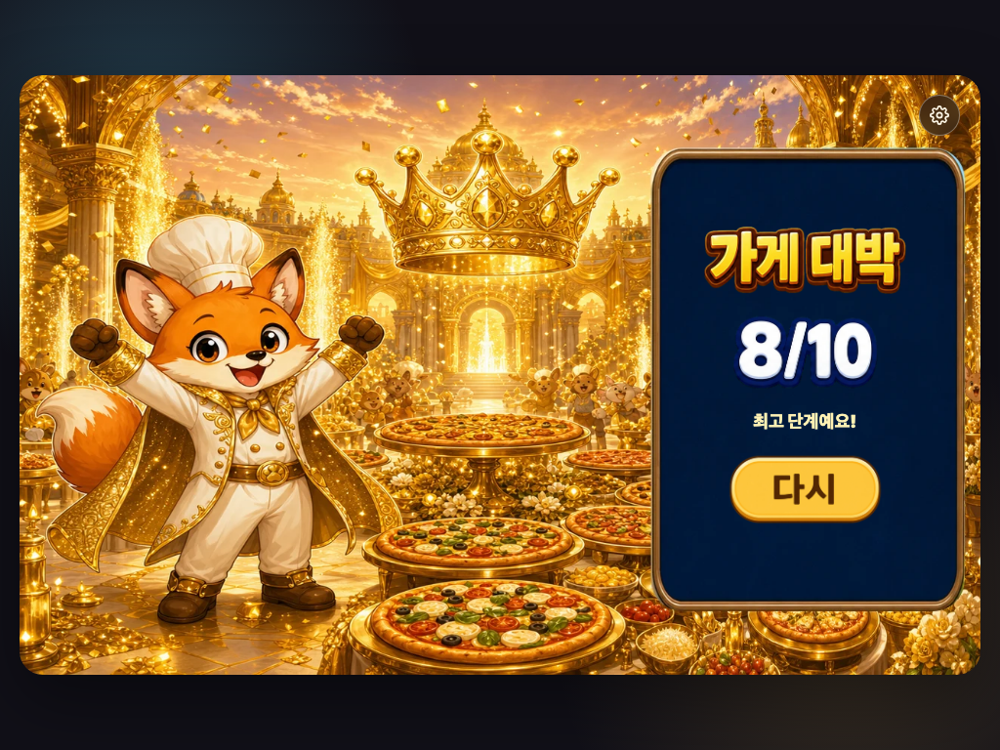

- 학생이 보는 것: 완성 장면과 결과 이름, 정답 수, 다음 목표, 다시 버튼을 봅니다.
- 판단하거나 누르는 것: 현재 결과와 다음 목표를 비교하고 다시 도전할지 결정합니다.
- 화면에서 확인되는 수학 관계: 한 판의 정답과 피자 빛 변화가 하나의 결과 단계로 정리됩니다.
- 다음 상태로 넘어가는 이유: 다시를 누르면 새 문제 순서와 새 보상 흐름으로 시작합니다.

#### 결과 결속 · slice · `engine-flow-tablet-landscape-08c-result-cohesion-slice.png`

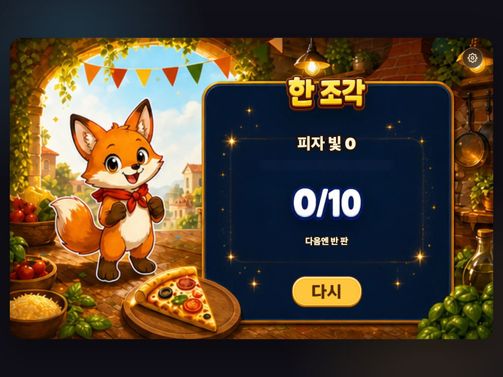

- 학생이 보는 것: 완성 장면과 결과 이름, 정답 수, 다음 목표, 다시 버튼을 봅니다.
- 판단하거나 누르는 것: 현재 결과와 다음 목표를 비교하고 다시 도전할지 결정합니다.
- 화면에서 확인되는 수학 관계: 한 판의 정답과 피자 빛 변화가 하나의 결과 단계로 정리됩니다.
- 다음 상태로 넘어가는 이유: 다시를 누르면 새 문제 순서와 새 보상 흐름으로 시작합니다.

#### 결과 결속 · whole · `engine-flow-tablet-landscape-08c-result-cohesion-whole.png`

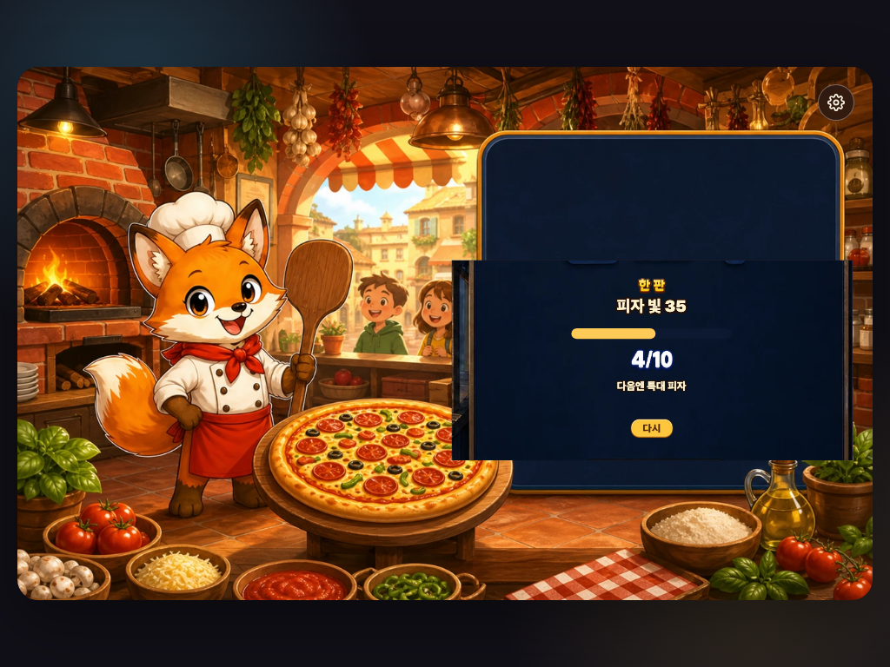

- 학생이 보는 것: 완성 장면과 결과 이름, 정답 수, 다음 목표, 다시 버튼을 봅니다.
- 판단하거나 누르는 것: 현재 결과와 다음 목표를 비교하고 다시 도전할지 결정합니다.
- 화면에서 확인되는 수학 관계: 한 판의 정답과 피자 빛 변화가 하나의 결과 단계로 정리됩니다.
- 다음 상태로 넘어가는 이유: 다시를 누르면 새 문제 순서와 새 보상 흐름으로 시작합니다.

#### 결과 단계 · half · `engine-flow-tablet-landscape-08a-result-half.png`

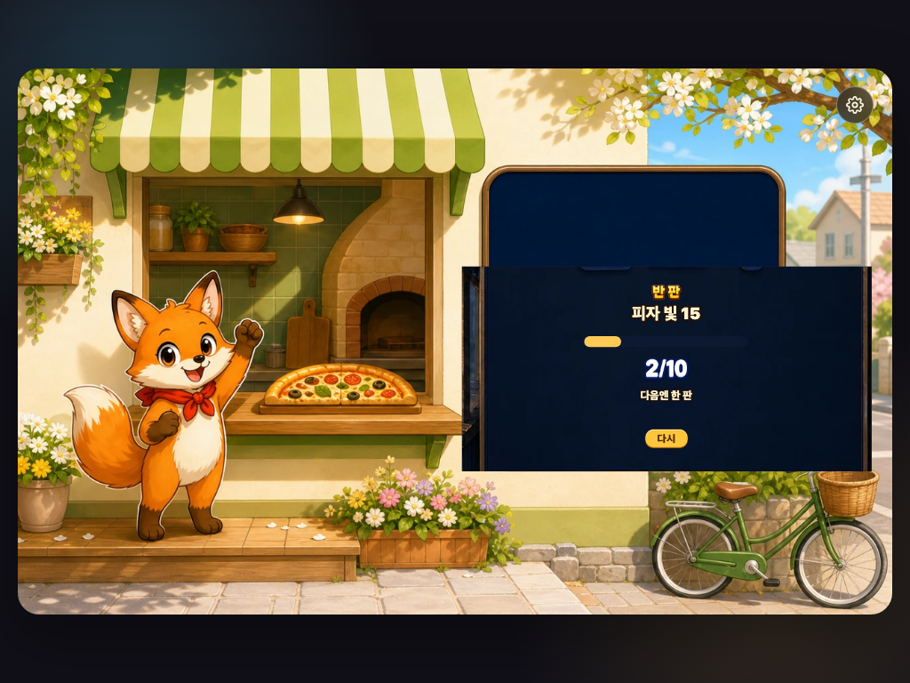

- 학생이 보는 것: 완성 장면과 결과 이름, 정답 수, 다음 목표, 다시 버튼을 봅니다.
- 판단하거나 누르는 것: 현재 결과와 다음 목표를 비교하고 다시 도전할지 결정합니다.
- 화면에서 확인되는 수학 관계: 한 판의 정답과 피자 빛 변화가 하나의 결과 단계로 정리됩니다.
- 다음 상태로 넘어가는 이유: 다시를 누르면 새 문제 순서와 새 보상 흐름으로 시작합니다.

#### 결과 단계 · whole · `engine-flow-tablet-landscape-08a-result-whole.png`

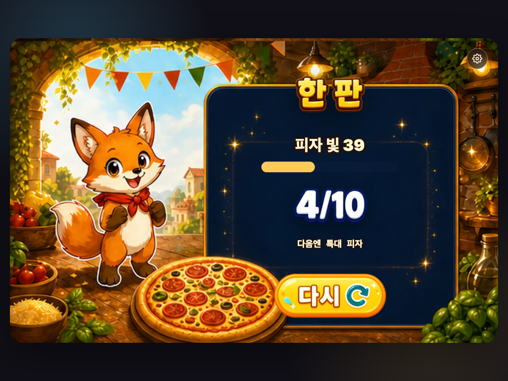

- 학생이 보는 것: 완성 장면과 결과 이름, 정답 수, 다음 목표, 다시 버튼을 봅니다.
- 판단하거나 누르는 것: 현재 결과와 다음 목표를 비교하고 다시 도전할지 결정합니다.
- 화면에서 확인되는 수학 관계: 한 판의 정답과 피자 빛 변화가 하나의 결과 단계로 정리됩니다.
- 다음 상태로 넘어가는 이유: 다시를 누르면 새 문제 순서와 새 보상 흐름으로 시작합니다.

#### 결과 단계 · jumbo · `engine-flow-tablet-landscape-08a-result-jumbo.png`

- 학생이 보는 것: 완성 장면과 결과 이름, 정답 수, 다음 목표, 다시 버튼을 봅니다.
- 판단하거나 누르는 것: 현재 결과와 다음 목표를 비교하고 다시 도전할지 결정합니다.
- 화면에서 확인되는 수학 관계: 한 판의 정답과 피자 빛 변화가 하나의 결과 단계로 정리됩니다.
- 다음 상태로 넘어가는 이유: 다시를 누르면 새 문제 순서와 새 보상 흐름으로 시작합니다.

#### 결과 단계 · shopstar · `engine-flow-tablet-landscape-08a-result-shopstar.png`

- 학생이 보는 것: 완성 장면과 결과 이름, 정답 수, 다음 목표, 다시 버튼을 봅니다.
- 판단하거나 누르는 것: 현재 결과와 다음 목표를 비교하고 다시 도전할지 결정합니다.
- 화면에서 확인되는 수학 관계: 한 판의 정답과 피자 빛 변화가 하나의 결과 단계로 정리됩니다.
- 다음 상태로 넘어가는 이유: 다시를 누르면 새 문제 순서와 새 보상 흐름으로 시작합니다.

#### 결과 단계 · legend · `engine-flow-tablet-landscape-08a-result-legend.png`

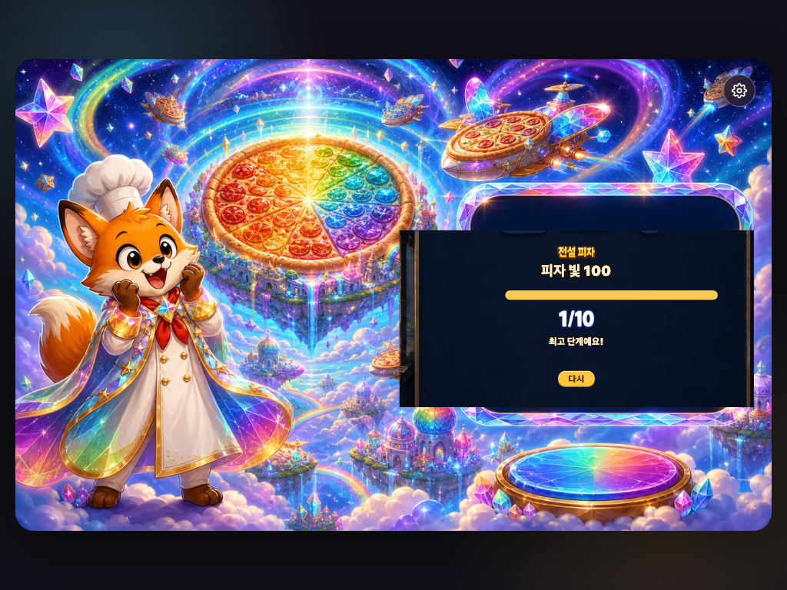

- 학생이 보는 것: 완성 장면과 결과 이름, 정답 수, 다음 목표, 다시 버튼을 봅니다.
- 판단하거나 누르는 것: 현재 결과와 다음 목표를 비교하고 다시 도전할지 결정합니다.
- 화면에서 확인되는 수학 관계: 한 판의 정답과 피자 빛 변화가 하나의 결과 단계로 정리됩니다.
- 다음 상태로 넘어가는 이유: 다시를 누르면 새 문제 순서와 새 보상 흐름으로 시작합니다.

### codex-in-app · 1280×720 · DPR 2 · 25장

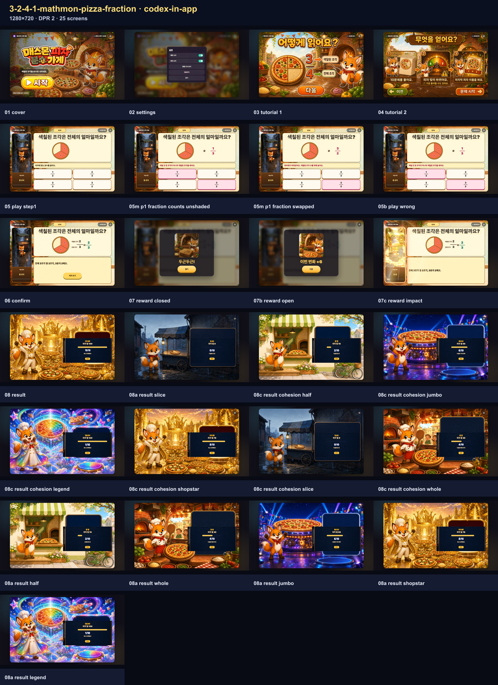

#### 시작 화면 · `engine-flow-codex-in-app-01-cover.png`

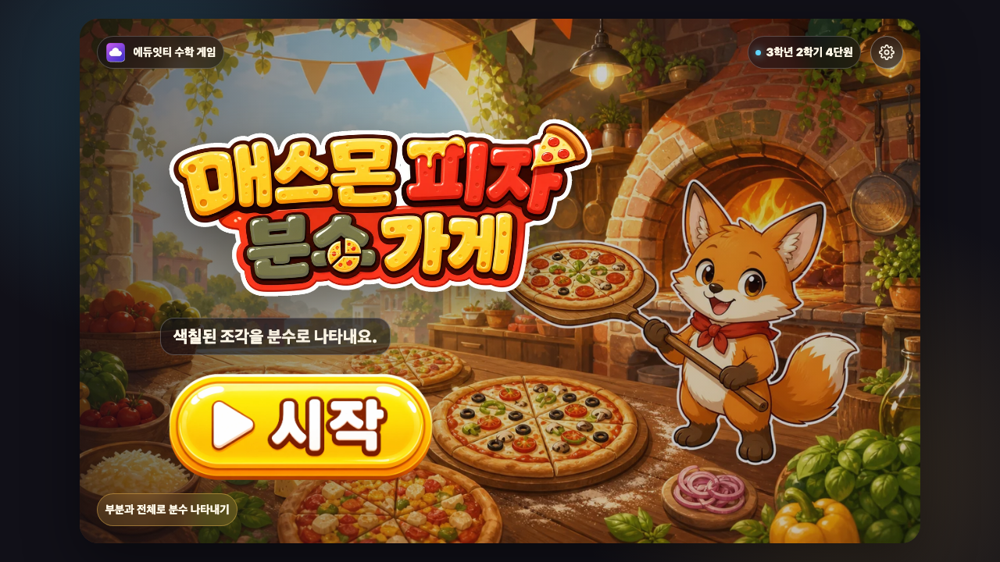

- 학생이 보는 것: 매스몬 피자 분수 가게 제목과 한 줄 목표, 시작 버튼을 봅니다.
- 판단하거나 누르는 것: 게임을 시작할 준비가 되면 시작을 누릅니다.
- 화면에서 확인되는 수학 관계: 부분과 전체로 분수 나타내기을 배우는 차시임을 확인합니다.
- 다음 상태로 넘어가는 이유: 문제를 푸는 방법을 보는 설명 화면으로 이동합니다.

#### 설정 화면 · `engine-flow-codex-in-app-02-settings.png`

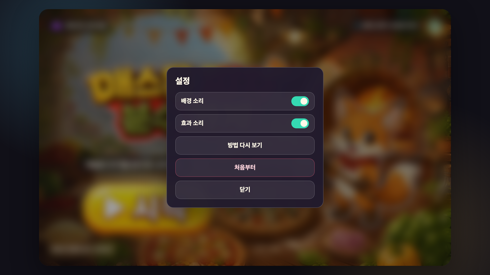

- 학생이 보는 것: 배경 소리·효과 소리와 방법 다시 보기, 처음부터, 닫기를 봅니다.
- 판단하거나 누르는 것: 필요한 소리나 이동 행동 하나를 고릅니다.
- 화면에서 확인되는 수학 관계: 수학 문제는 바꾸지 않고 게임 조작만 설정합니다.
- 다음 상태로 넘어가는 이유: 설정을 마치면 열기 전 화면으로 돌아갑니다.

#### 설명 1 · 풀이 방법 · `engine-flow-codex-in-app-03-tutorial-1.png`

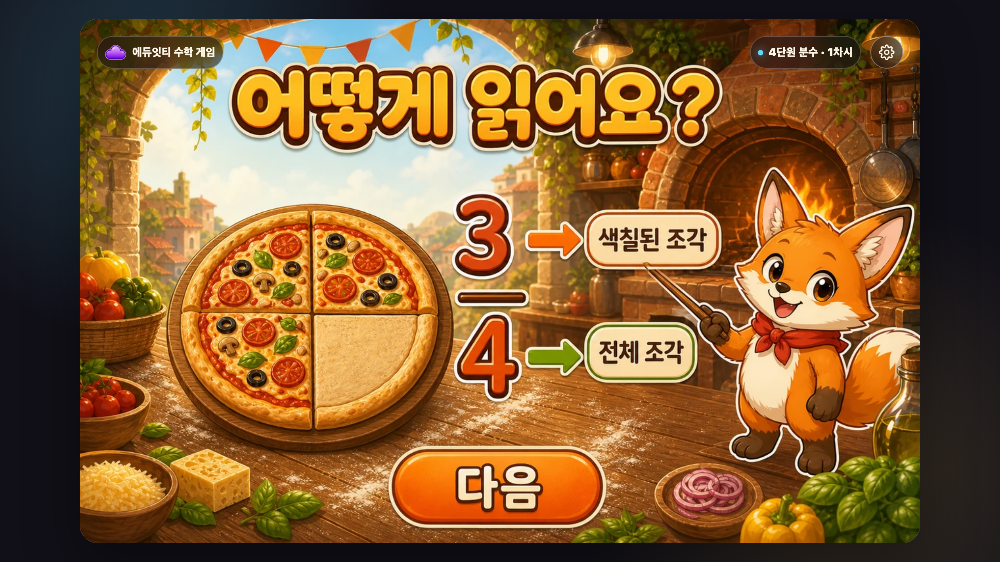

- 학생이 보는 것: 부분과 전체로 분수 나타내기 문제를 푸는 방법과 게임 흐름을 그림으로 봅니다.
- 판단하거나 누르는 것: 그림 속 순서와 누를 곳을 확인한 뒤 다음 행동 버튼을 누릅니다.
- 화면에서 확인되는 수학 관계: 부분과 전체로 분수 나타내기에서 무엇을 비교하거나 계산하는지 확인합니다.
- 다음 상태로 넘어가는 이유: 다음 설명으로 이동합니다.

#### 설명 2 · 보상과 목표 · `engine-flow-codex-in-app-04-tutorial-2.png`

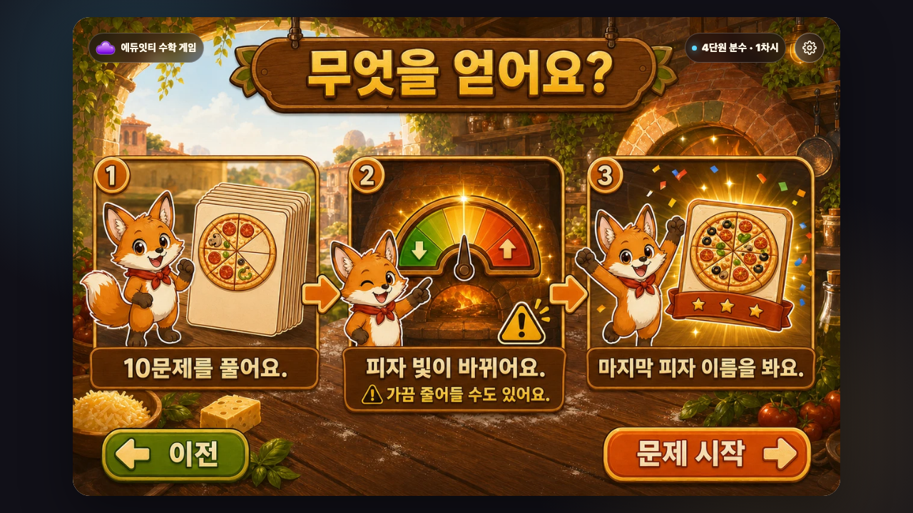

- 학생이 보는 것: 부분과 전체로 분수 나타내기 문제를 푸는 방법과 게임 흐름을 그림으로 봅니다.
- 판단하거나 누르는 것: 그림 속 순서와 누를 곳을 확인한 뒤 다음 행동 버튼을 누릅니다.
- 화면에서 확인되는 수학 관계: 부분과 전체로 분수 나타내기에서 무엇을 비교하거나 계산하는지 확인합니다.
- 다음 상태로 넘어가는 이유: 첫 문제로 이동합니다.

#### 문제 상태 · 05-play-step1 · `engine-flow-codex-in-app-05-play-step1.png`

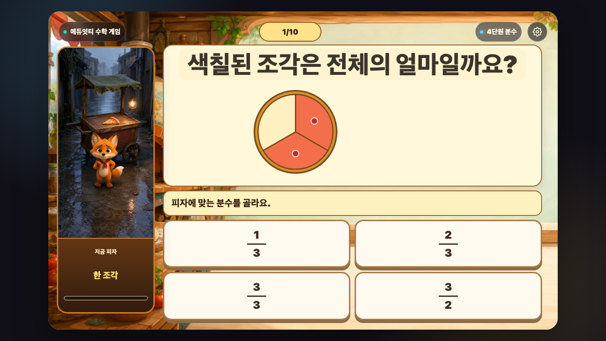

- 학생이 보는 것: 현재 문제, 핵심 계산판이나 물건, 고를 수 있는 답을 봅니다.
- 판단하거나 누르는 것: 문제에서 묻는 값이나 관계에 맞는 답 하나를 고릅니다.
- 화면에서 확인되는 수학 관계: 부분과 전체로 분수 나타내기을 이용해 선택지를 판단합니다.
- 다음 상태로 넘어가는 이유: 고른 답에 따라 오답 또는 정답 확인 상태로 이동합니다.

#### 오개념 확인 · p1-fraction-counts-unshaded · `engine-flow-codex-in-app-05m-p1-fraction-counts-unshaded.png`

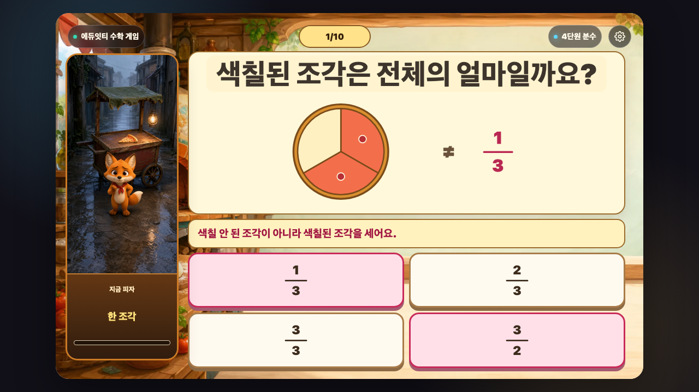

- 학생이 보는 것: 고른 답이 계산판이나 물건에 들어간 모습과 짧은 오답 피드백을 봅니다.
- 판단하거나 누르는 것: 어디가 맞지 않는지 확인하고 같은 문제에서 다른 답을 고릅니다.
- 화면에서 확인되는 수학 관계: 부분과 전체로 분수 나타내기의 관계와 고른 답이 왜 맞지 않는지 확인합니다.
- 다음 상태로 넘어가는 이유: 같은 문제에서 다시 판단할 수 있는 상태로 돌아갑니다.

#### 오개념 확인 · p1-fraction-swapped · `engine-flow-codex-in-app-05m-p1-fraction-swapped.png`

- 학생이 보는 것: 고른 답이 계산판이나 물건에 들어간 모습과 짧은 오답 피드백을 봅니다.
- 판단하거나 누르는 것: 어디가 맞지 않는지 확인하고 같은 문제에서 다른 답을 고릅니다.
- 화면에서 확인되는 수학 관계: 부분과 전체로 분수 나타내기의 관계와 고른 답이 왜 맞지 않는지 확인합니다.
- 다음 상태로 넘어가는 이유: 같은 문제에서 다시 판단할 수 있는 상태로 돌아갑니다.

#### 오답 확인 · 05b-play-wrong · `engine-flow-codex-in-app-05b-play-wrong.png`

- 학생이 보는 것: 고른 답이 계산판이나 물건에 들어간 모습과 짧은 오답 피드백을 봅니다.
- 판단하거나 누르는 것: 어디가 맞지 않는지 확인하고 같은 문제에서 다른 답을 고릅니다.
- 화면에서 확인되는 수학 관계: 부분과 전체로 분수 나타내기의 관계와 고른 답이 왜 맞지 않는지 확인합니다.
- 다음 상태로 넘어가는 이유: 같은 문제에서 다시 판단할 수 있는 상태로 돌아갑니다.

#### 마지막 확인 · 06-confirm · `engine-flow-codex-in-app-06-confirm.png`

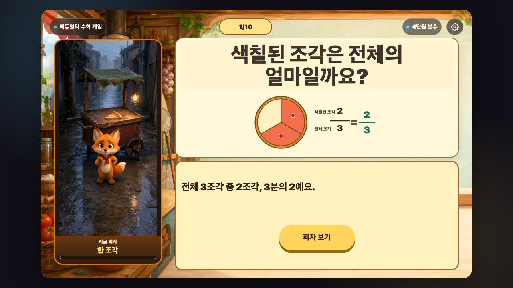

- 학생이 보는 것: 마지막으로 완성된 계산이나 값과 보상으로 가는 행동 버튼을 봅니다.
- 판단하거나 누르는 것: 완성된 관계를 읽은 뒤 보상 확인 버튼을 누릅니다.
- 화면에서 확인되는 수학 관계: 부분과 전체로 분수 나타내기의 완성값을 보상 화면 전에 다시 확인합니다.
- 다음 상태로 넘어가는 이유: 수학 관계를 확인한 뒤 보상 상태로 이동합니다.

#### 닫힌 보상 · `engine-flow-codex-in-app-07-reward-closed.png`

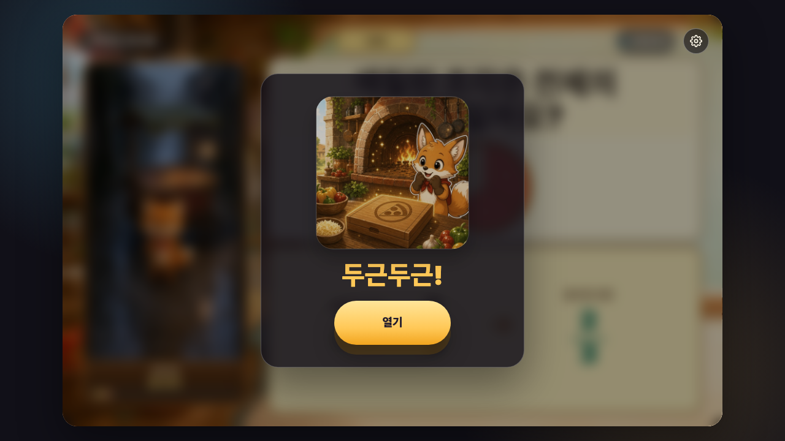

- 학생이 보는 것: 결과가 아직 드러나지 않은 보상 그림과 열기 버튼을 봅니다.
- 판단하거나 누르는 것: 이번 피자 빛 변화를 확인하기 위해 열기를 누릅니다.
- 화면에서 확인되는 수학 관계: 뒤 문제 화면에는 방금 완성한 계산이나 관계가 그대로 남습니다.
- 다음 상태로 넘어가는 이유: 학생이 직접 연 뒤에만 이번 보상 사건이 공개됩니다.

#### 열린 보상 · `engine-flow-codex-in-app-07b-reward-open.png`

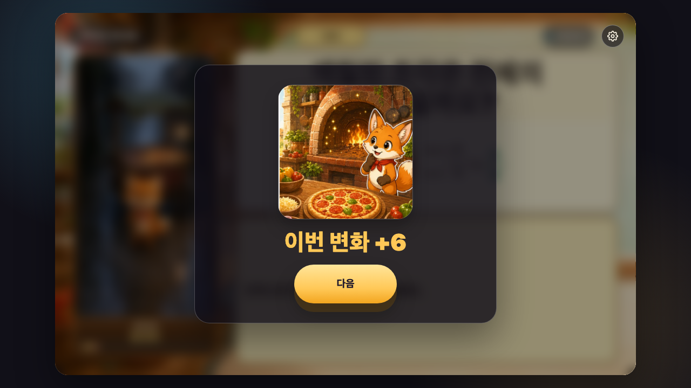

- 학생이 보는 것: 보상 사건 그림과 이번 피자 빛 변화, 다음 행동 버튼을 봅니다.
- 판단하거나 누르는 것: 이번 변화를 확인하고 다음을 누릅니다.
- 화면에서 확인되는 수학 관계: 수학 정답과 무작위 보상 변화가 서로 분리되어 있음을 확인합니다.
- 다음 상태로 넘어가는 이유: 현재 진행 장면의 변화를 본 뒤 다음 문제나 결과로 이동합니다.

#### 보상 뒤 변화 · 07c-reward-impact · `engine-flow-codex-in-app-07c-reward-impact.png`

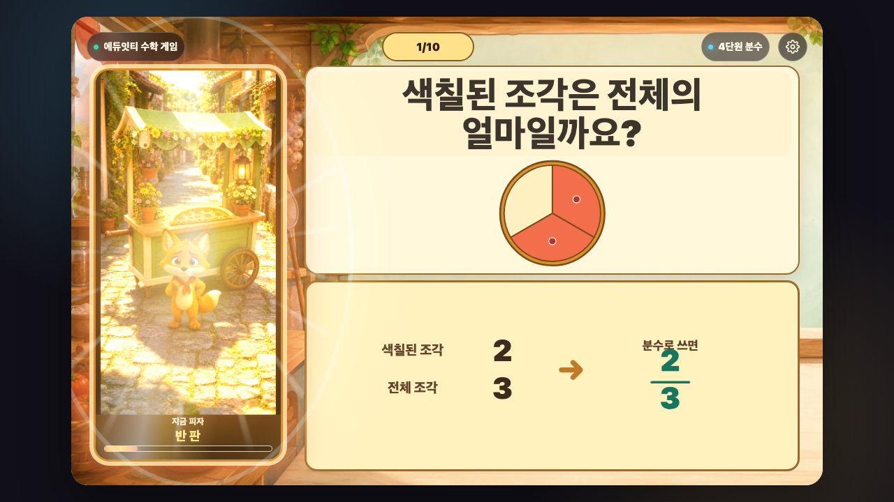

- 학생이 보는 것: 보상 모달이 닫힌 뒤 현재 진행 장면과 피자 빛 변화가 반영되는 모습을 봅니다.
- 판단하거나 누르는 것: 별도 입력 없이 이번 보상이 진행 단계에 반영되는 모습을 확인합니다.
- 화면에서 확인되는 수학 관계: 한 문제의 보상이 현재 진행값에 정확히 한 번 반영됩니다.
- 다음 상태로 넘어가는 이유: 효과를 충분히 본 뒤 다음 문제 또는 결과로 이동합니다.

#### 실제 결과 · `engine-flow-codex-in-app-08-result.png`

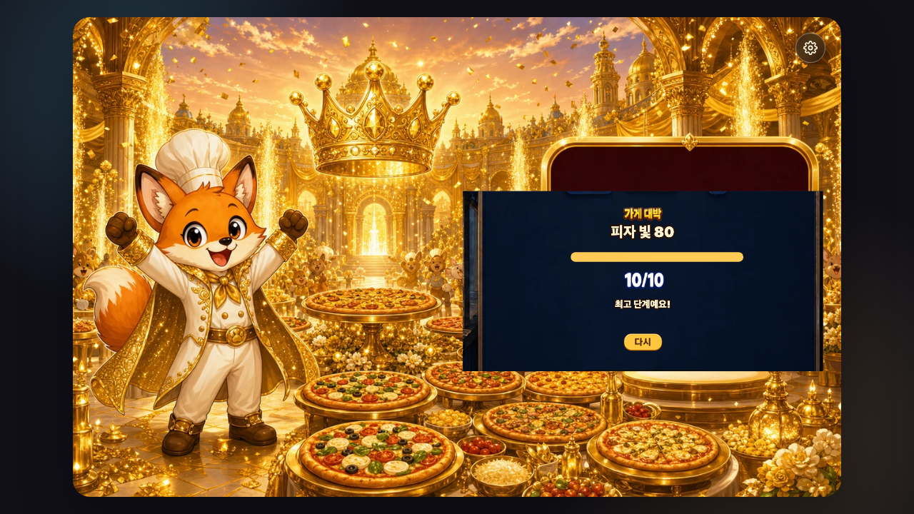

- 학생이 보는 것: 완성 장면과 결과 이름, 정답 수, 다음 목표, 다시 버튼을 봅니다.
- 판단하거나 누르는 것: 현재 결과와 다음 목표를 비교하고 다시 도전할지 결정합니다.
- 화면에서 확인되는 수학 관계: 한 판의 정답과 피자 빛 변화가 하나의 결과 단계로 정리됩니다.
- 다음 상태로 넘어가는 이유: 다시를 누르면 새 문제 순서와 새 보상 흐름으로 시작합니다.

#### 결과 단계 · slice · `engine-flow-codex-in-app-08a-result-slice.png`

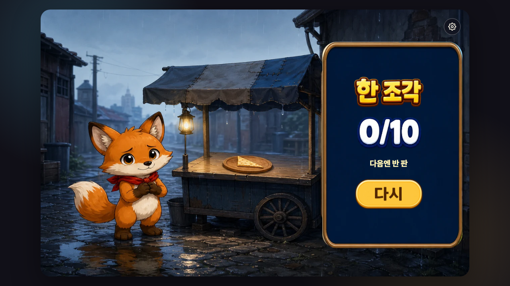

- 학생이 보는 것: 완성 장면과 결과 이름, 정답 수, 다음 목표, 다시 버튼을 봅니다.
- 판단하거나 누르는 것: 현재 결과와 다음 목표를 비교하고 다시 도전할지 결정합니다.
- 화면에서 확인되는 수학 관계: 한 판의 정답과 피자 빛 변화가 하나의 결과 단계로 정리됩니다.
- 다음 상태로 넘어가는 이유: 다시를 누르면 새 문제 순서와 새 보상 흐름으로 시작합니다.

#### 결과 결속 · half · `engine-flow-codex-in-app-08c-result-cohesion-half.png`

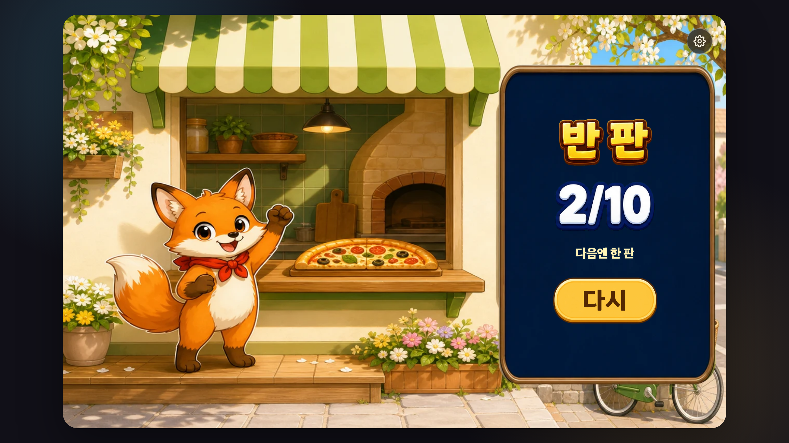

- 학생이 보는 것: 완성 장면과 결과 이름, 정답 수, 다음 목표, 다시 버튼을 봅니다.
- 판단하거나 누르는 것: 현재 결과와 다음 목표를 비교하고 다시 도전할지 결정합니다.
- 화면에서 확인되는 수학 관계: 한 판의 정답과 피자 빛 변화가 하나의 결과 단계로 정리됩니다.
- 다음 상태로 넘어가는 이유: 다시를 누르면 새 문제 순서와 새 보상 흐름으로 시작합니다.

#### 결과 결속 · jumbo · `engine-flow-codex-in-app-08c-result-cohesion-jumbo.png`

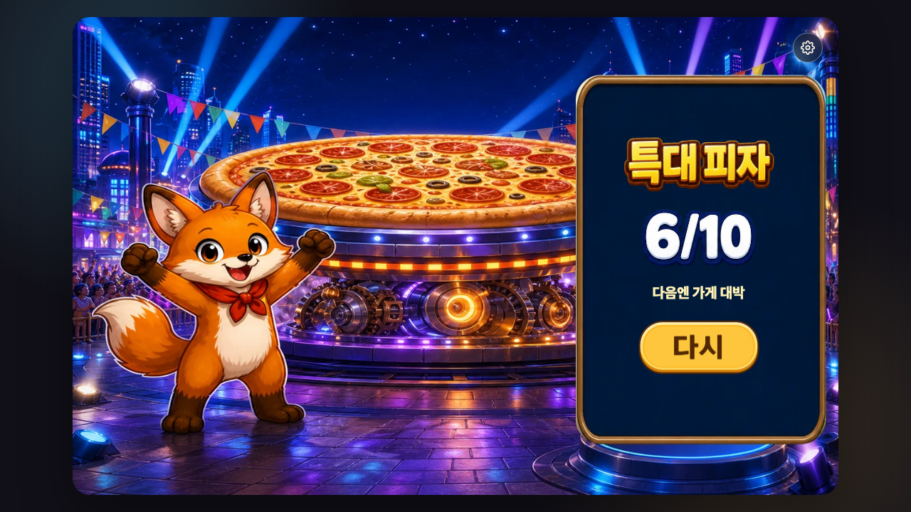

- 학생이 보는 것: 완성 장면과 결과 이름, 정답 수, 다음 목표, 다시 버튼을 봅니다.
- 판단하거나 누르는 것: 현재 결과와 다음 목표를 비교하고 다시 도전할지 결정합니다.
- 화면에서 확인되는 수학 관계: 한 판의 정답과 피자 빛 변화가 하나의 결과 단계로 정리됩니다.
- 다음 상태로 넘어가는 이유: 다시를 누르면 새 문제 순서와 새 보상 흐름으로 시작합니다.

#### 결과 결속 · legend · `engine-flow-codex-in-app-08c-result-cohesion-legend.png`

- 학생이 보는 것: 완성 장면과 결과 이름, 정답 수, 다음 목표, 다시 버튼을 봅니다.
- 판단하거나 누르는 것: 현재 결과와 다음 목표를 비교하고 다시 도전할지 결정합니다.
- 화면에서 확인되는 수학 관계: 한 판의 정답과 피자 빛 변화가 하나의 결과 단계로 정리됩니다.
- 다음 상태로 넘어가는 이유: 다시를 누르면 새 문제 순서와 새 보상 흐름으로 시작합니다.

#### 결과 결속 · shopstar · `engine-flow-codex-in-app-08c-result-cohesion-shopstar.png`

- 학생이 보는 것: 완성 장면과 결과 이름, 정답 수, 다음 목표, 다시 버튼을 봅니다.
- 판단하거나 누르는 것: 현재 결과와 다음 목표를 비교하고 다시 도전할지 결정합니다.
- 화면에서 확인되는 수학 관계: 한 판의 정답과 피자 빛 변화가 하나의 결과 단계로 정리됩니다.
- 다음 상태로 넘어가는 이유: 다시를 누르면 새 문제 순서와 새 보상 흐름으로 시작합니다.

#### 결과 결속 · slice · `engine-flow-codex-in-app-08c-result-cohesion-slice.png`

- 학생이 보는 것: 완성 장면과 결과 이름, 정답 수, 다음 목표, 다시 버튼을 봅니다.
- 판단하거나 누르는 것: 현재 결과와 다음 목표를 비교하고 다시 도전할지 결정합니다.
- 화면에서 확인되는 수학 관계: 한 판의 정답과 피자 빛 변화가 하나의 결과 단계로 정리됩니다.
- 다음 상태로 넘어가는 이유: 다시를 누르면 새 문제 순서와 새 보상 흐름으로 시작합니다.

#### 결과 결속 · whole · `engine-flow-codex-in-app-08c-result-cohesion-whole.png`

- 학생이 보는 것: 완성 장면과 결과 이름, 정답 수, 다음 목표, 다시 버튼을 봅니다.
- 판단하거나 누르는 것: 현재 결과와 다음 목표를 비교하고 다시 도전할지 결정합니다.
- 화면에서 확인되는 수학 관계: 한 판의 정답과 피자 빛 변화가 하나의 결과 단계로 정리됩니다.
- 다음 상태로 넘어가는 이유: 다시를 누르면 새 문제 순서와 새 보상 흐름으로 시작합니다.

#### 결과 단계 · half · `engine-flow-codex-in-app-08a-result-half.png`

- 학생이 보는 것: 완성 장면과 결과 이름, 정답 수, 다음 목표, 다시 버튼을 봅니다.
- 판단하거나 누르는 것: 현재 결과와 다음 목표를 비교하고 다시 도전할지 결정합니다.
- 화면에서 확인되는 수학 관계: 한 판의 정답과 피자 빛 변화가 하나의 결과 단계로 정리됩니다.
- 다음 상태로 넘어가는 이유: 다시를 누르면 새 문제 순서와 새 보상 흐름으로 시작합니다.

#### 결과 단계 · whole · `engine-flow-codex-in-app-08a-result-whole.png`

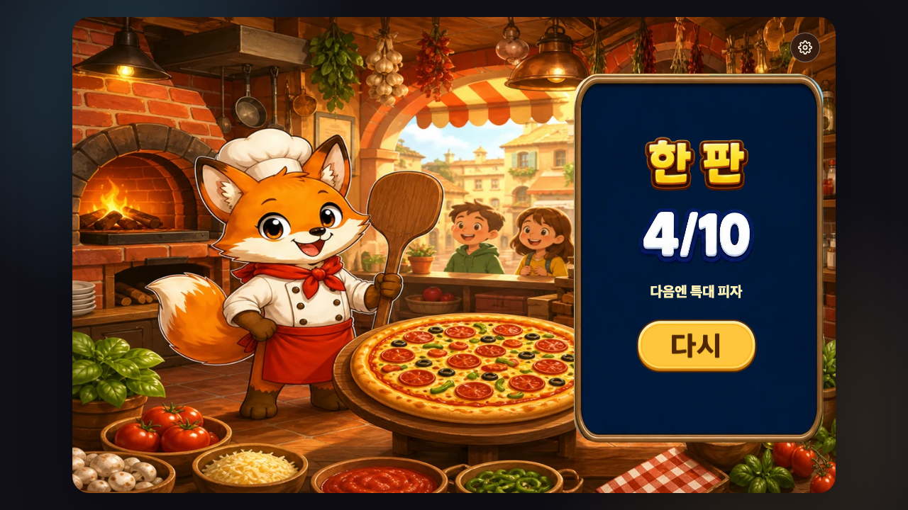

- 학생이 보는 것: 완성 장면과 결과 이름, 정답 수, 다음 목표, 다시 버튼을 봅니다.
- 판단하거나 누르는 것: 현재 결과와 다음 목표를 비교하고 다시 도전할지 결정합니다.
- 화면에서 확인되는 수학 관계: 한 판의 정답과 피자 빛 변화가 하나의 결과 단계로 정리됩니다.
- 다음 상태로 넘어가는 이유: 다시를 누르면 새 문제 순서와 새 보상 흐름으로 시작합니다.

#### 결과 단계 · jumbo · `engine-flow-codex-in-app-08a-result-jumbo.png`

- 학생이 보는 것: 완성 장면과 결과 이름, 정답 수, 다음 목표, 다시 버튼을 봅니다.
- 판단하거나 누르는 것: 현재 결과와 다음 목표를 비교하고 다시 도전할지 결정합니다.
- 화면에서 확인되는 수학 관계: 한 판의 정답과 피자 빛 변화가 하나의 결과 단계로 정리됩니다.
- 다음 상태로 넘어가는 이유: 다시를 누르면 새 문제 순서와 새 보상 흐름으로 시작합니다.

#### 결과 단계 · shopstar · `engine-flow-codex-in-app-08a-result-shopstar.png`

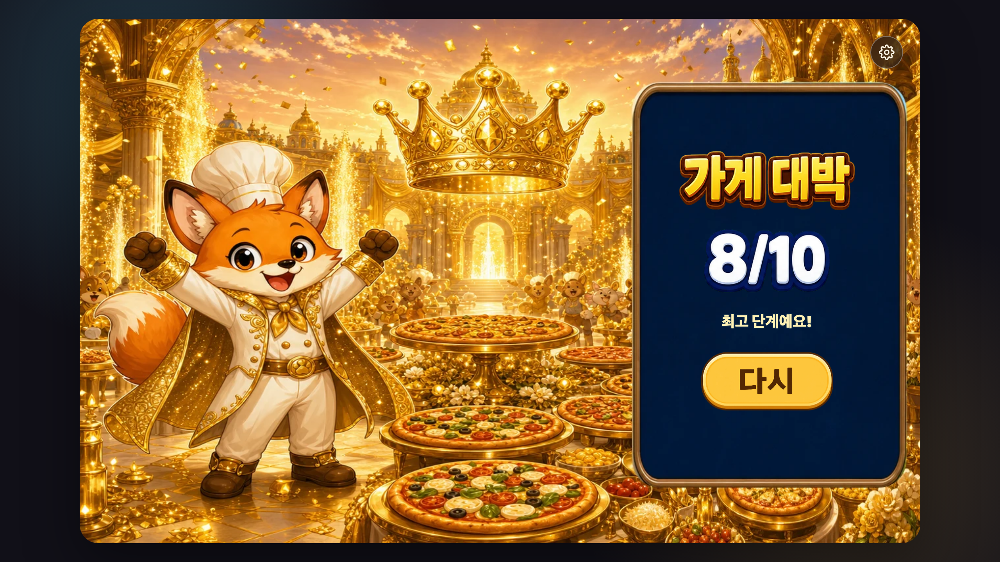

- 학생이 보는 것: 완성 장면과 결과 이름, 정답 수, 다음 목표, 다시 버튼을 봅니다.
- 판단하거나 누르는 것: 현재 결과와 다음 목표를 비교하고 다시 도전할지 결정합니다.
- 화면에서 확인되는 수학 관계: 한 판의 정답과 피자 빛 변화가 하나의 결과 단계로 정리됩니다.
- 다음 상태로 넘어가는 이유: 다시를 누르면 새 문제 순서와 새 보상 흐름으로 시작합니다.

#### 결과 단계 · legend · `engine-flow-codex-in-app-08a-result-legend.png`

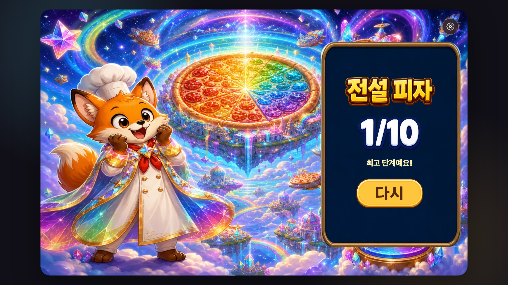

- 학생이 보는 것: 완성 장면과 결과 이름, 정답 수, 다음 목표, 다시 버튼을 봅니다.
- 판단하거나 누르는 것: 현재 결과와 다음 목표를 비교하고 다시 도전할지 결정합니다.
- 화면에서 확인되는 수학 관계: 한 판의 정답과 피자 빛 변화가 하나의 결과 단계로 정리됩니다.
- 다음 상태로 넘어가는 이유: 다시를 누르면 새 문제 순서와 새 보상 흐름으로 시작합니다.

### user-visibility · 994×632 · DPR 1 · 25장

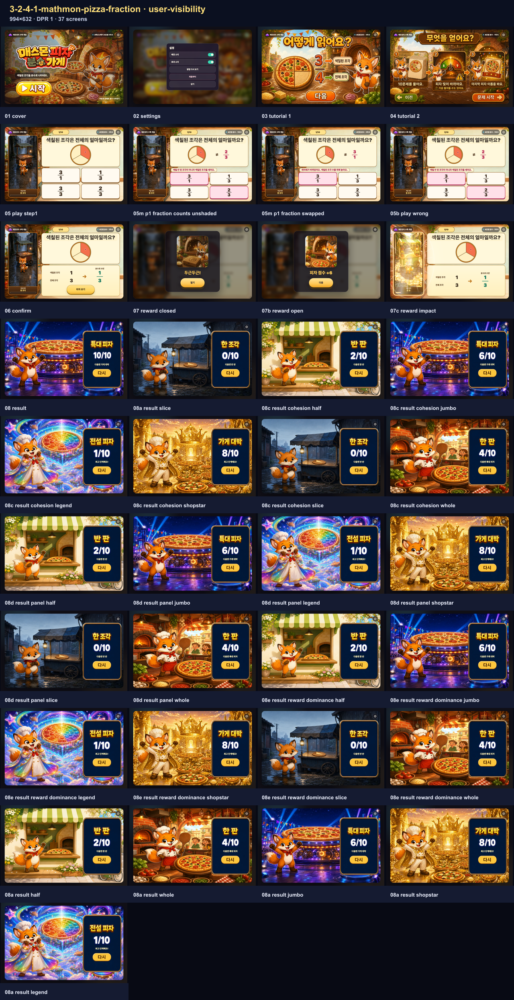

#### 시작 화면 · `engine-flow-user-visibility-01-cover.png`

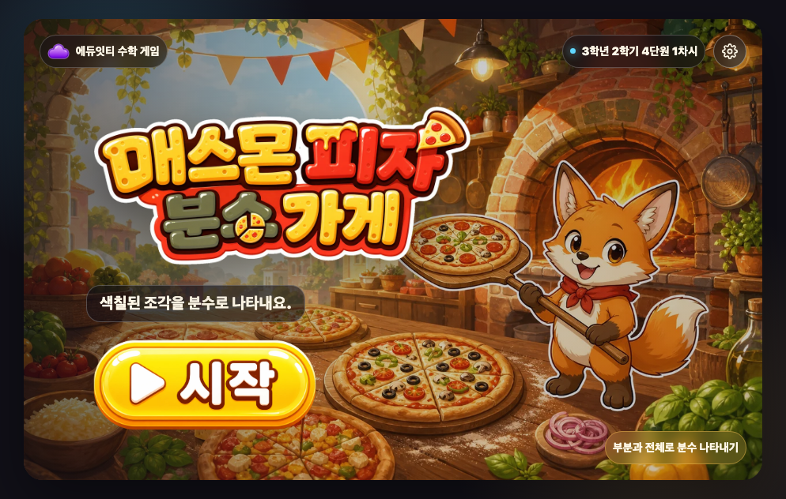

- 학생이 보는 것: 매스몬 피자 분수 가게 제목과 한 줄 목표, 시작 버튼을 봅니다.
- 판단하거나 누르는 것: 게임을 시작할 준비가 되면 시작을 누릅니다.
- 화면에서 확인되는 수학 관계: 부분과 전체로 분수 나타내기을 배우는 차시임을 확인합니다.
- 다음 상태로 넘어가는 이유: 문제를 푸는 방법을 보는 설명 화면으로 이동합니다.

#### 설정 화면 · `engine-flow-user-visibility-02-settings.png`

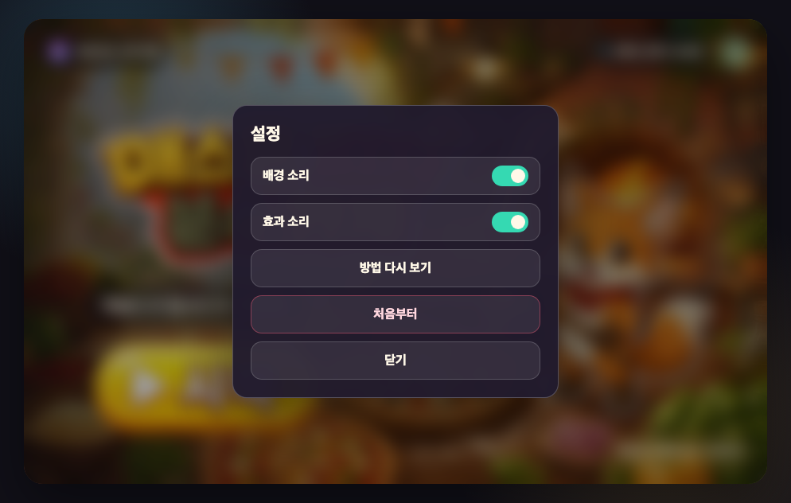

- 학생이 보는 것: 배경 소리·효과 소리와 방법 다시 보기, 처음부터, 닫기를 봅니다.
- 판단하거나 누르는 것: 필요한 소리나 이동 행동 하나를 고릅니다.
- 화면에서 확인되는 수학 관계: 수학 문제는 바꾸지 않고 게임 조작만 설정합니다.
- 다음 상태로 넘어가는 이유: 설정을 마치면 열기 전 화면으로 돌아갑니다.

#### 설명 1 · 풀이 방법 · `engine-flow-user-visibility-03-tutorial-1.png`

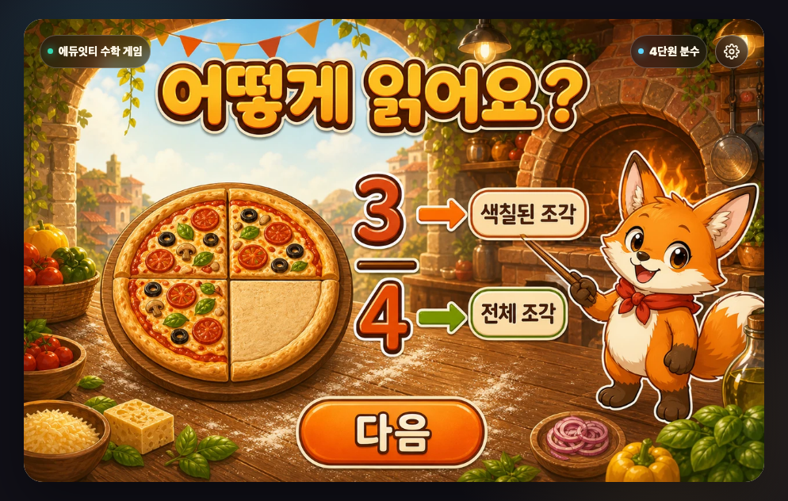

- 학생이 보는 것: 부분과 전체로 분수 나타내기 문제를 푸는 방법과 게임 흐름을 그림으로 봅니다.
- 판단하거나 누르는 것: 그림 속 순서와 누를 곳을 확인한 뒤 다음 행동 버튼을 누릅니다.
- 화면에서 확인되는 수학 관계: 부분과 전체로 분수 나타내기에서 무엇을 비교하거나 계산하는지 확인합니다.
- 다음 상태로 넘어가는 이유: 다음 설명으로 이동합니다.

#### 설명 2 · 보상과 목표 · `engine-flow-user-visibility-04-tutorial-2.png`

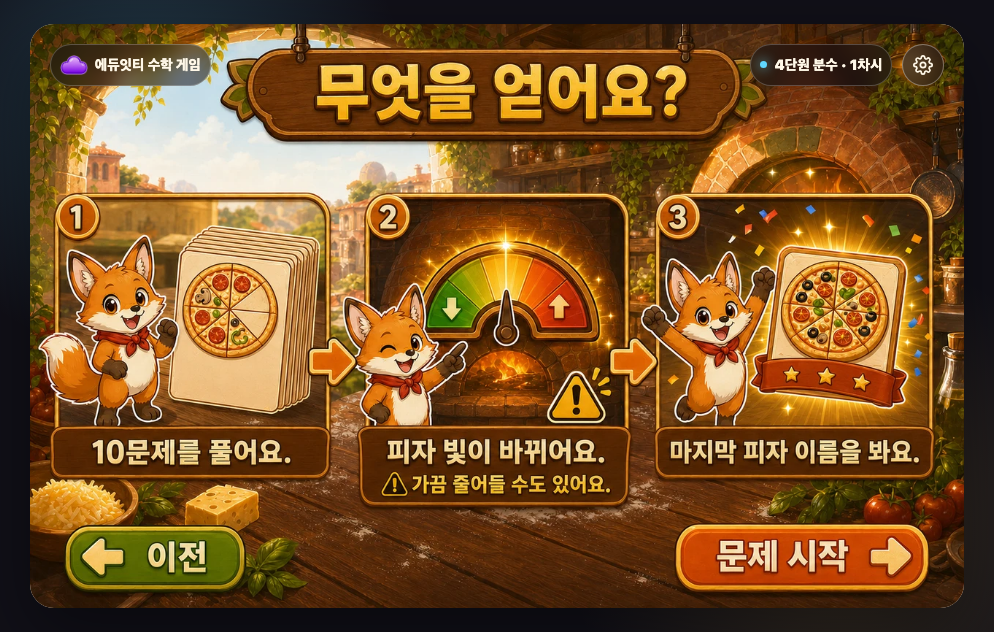

- 학생이 보는 것: 부분과 전체로 분수 나타내기 문제를 푸는 방법과 게임 흐름을 그림으로 봅니다.
- 판단하거나 누르는 것: 그림 속 순서와 누를 곳을 확인한 뒤 다음 행동 버튼을 누릅니다.
- 화면에서 확인되는 수학 관계: 부분과 전체로 분수 나타내기에서 무엇을 비교하거나 계산하는지 확인합니다.
- 다음 상태로 넘어가는 이유: 첫 문제로 이동합니다.

#### 문제 상태 · 05-play-step1 · `engine-flow-user-visibility-05-play-step1.png`

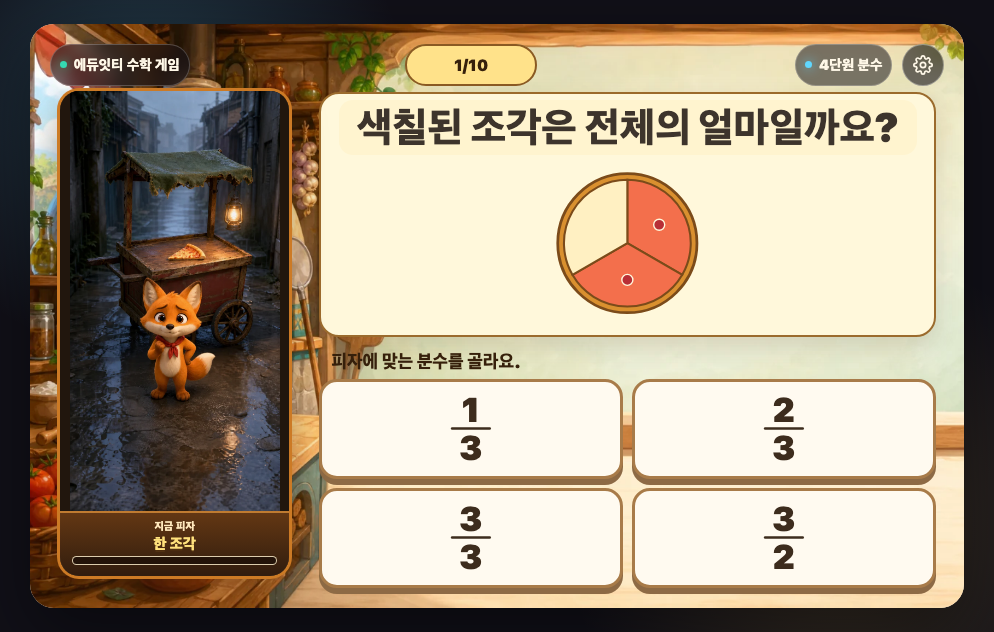

- 학생이 보는 것: 현재 문제, 핵심 계산판이나 물건, 고를 수 있는 답을 봅니다.
- 판단하거나 누르는 것: 문제에서 묻는 값이나 관계에 맞는 답 하나를 고릅니다.
- 화면에서 확인되는 수학 관계: 부분과 전체로 분수 나타내기을 이용해 선택지를 판단합니다.
- 다음 상태로 넘어가는 이유: 고른 답에 따라 오답 또는 정답 확인 상태로 이동합니다.

#### 오개념 확인 · p1-fraction-counts-unshaded · `engine-flow-user-visibility-05m-p1-fraction-counts-unshaded.png`

- 학생이 보는 것: 고른 답이 계산판이나 물건에 들어간 모습과 짧은 오답 피드백을 봅니다.
- 판단하거나 누르는 것: 어디가 맞지 않는지 확인하고 같은 문제에서 다른 답을 고릅니다.
- 화면에서 확인되는 수학 관계: 부분과 전체로 분수 나타내기의 관계와 고른 답이 왜 맞지 않는지 확인합니다.
- 다음 상태로 넘어가는 이유: 같은 문제에서 다시 판단할 수 있는 상태로 돌아갑니다.

#### 오개념 확인 · p1-fraction-swapped · `engine-flow-user-visibility-05m-p1-fraction-swapped.png`

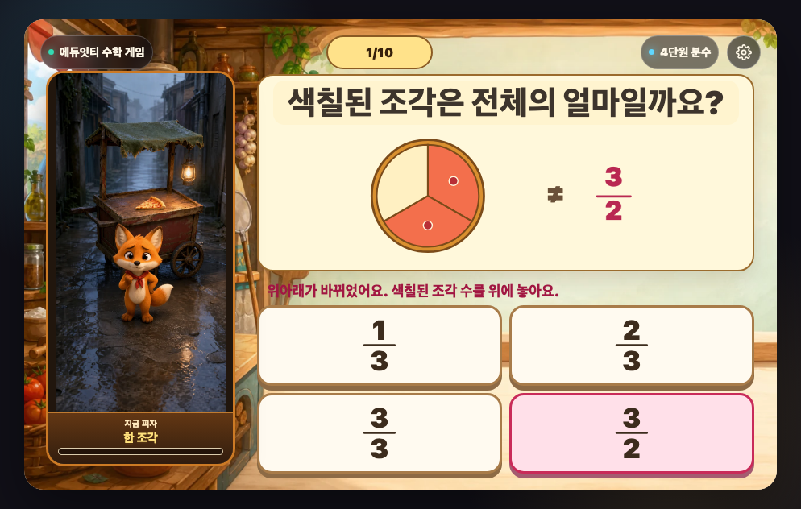

- 학생이 보는 것: 고른 답이 계산판이나 물건에 들어간 모습과 짧은 오답 피드백을 봅니다.
- 판단하거나 누르는 것: 어디가 맞지 않는지 확인하고 같은 문제에서 다른 답을 고릅니다.
- 화면에서 확인되는 수학 관계: 부분과 전체로 분수 나타내기의 관계와 고른 답이 왜 맞지 않는지 확인합니다.
- 다음 상태로 넘어가는 이유: 같은 문제에서 다시 판단할 수 있는 상태로 돌아갑니다.

#### 오답 확인 · 05b-play-wrong · `engine-flow-user-visibility-05b-play-wrong.png`

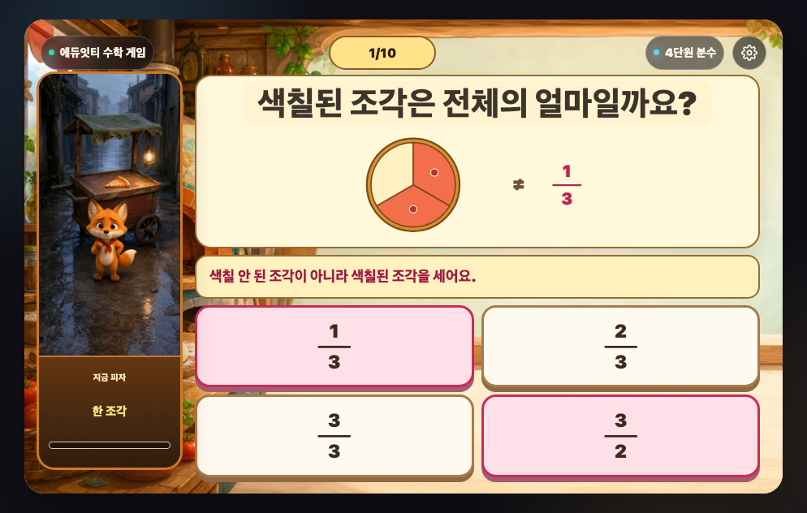

- 학생이 보는 것: 고른 답이 계산판이나 물건에 들어간 모습과 짧은 오답 피드백을 봅니다.
- 판단하거나 누르는 것: 어디가 맞지 않는지 확인하고 같은 문제에서 다른 답을 고릅니다.
- 화면에서 확인되는 수학 관계: 부분과 전체로 분수 나타내기의 관계와 고른 답이 왜 맞지 않는지 확인합니다.
- 다음 상태로 넘어가는 이유: 같은 문제에서 다시 판단할 수 있는 상태로 돌아갑니다.

#### 마지막 확인 · 06-confirm · `engine-flow-user-visibility-06-confirm.png`

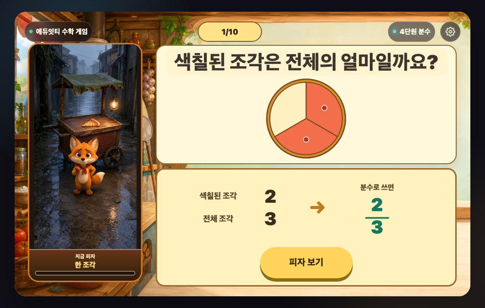

- 학생이 보는 것: 마지막으로 완성된 계산이나 값과 보상으로 가는 행동 버튼을 봅니다.
- 판단하거나 누르는 것: 완성된 관계를 읽은 뒤 보상 확인 버튼을 누릅니다.
- 화면에서 확인되는 수학 관계: 부분과 전체로 분수 나타내기의 완성값을 보상 화면 전에 다시 확인합니다.
- 다음 상태로 넘어가는 이유: 수학 관계를 확인한 뒤 보상 상태로 이동합니다.

#### 닫힌 보상 · `engine-flow-user-visibility-07-reward-closed.png`

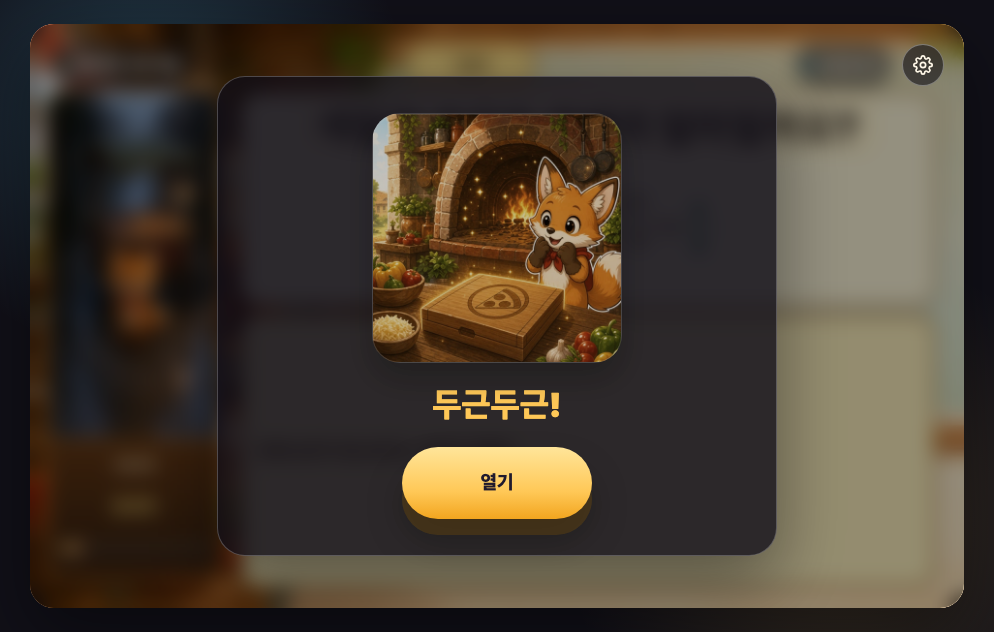

- 학생이 보는 것: 결과가 아직 드러나지 않은 보상 그림과 열기 버튼을 봅니다.
- 판단하거나 누르는 것: 이번 피자 빛 변화를 확인하기 위해 열기를 누릅니다.
- 화면에서 확인되는 수학 관계: 뒤 문제 화면에는 방금 완성한 계산이나 관계가 그대로 남습니다.
- 다음 상태로 넘어가는 이유: 학생이 직접 연 뒤에만 이번 보상 사건이 공개됩니다.

#### 열린 보상 · `engine-flow-user-visibility-07b-reward-open.png`

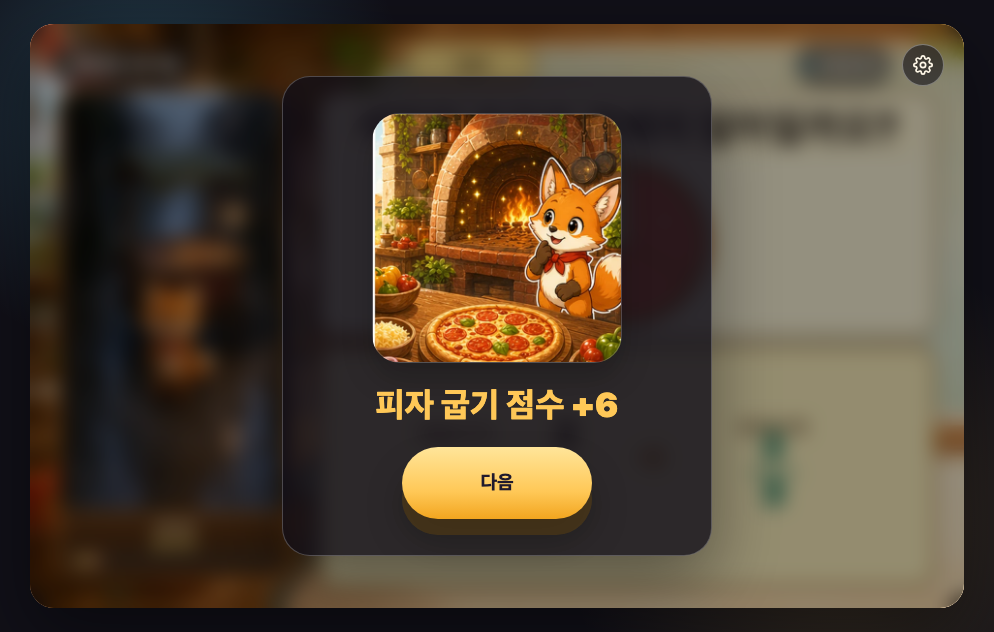

- 학생이 보는 것: 보상 사건 그림과 이번 피자 빛 변화, 다음 행동 버튼을 봅니다.
- 판단하거나 누르는 것: 이번 변화를 확인하고 다음을 누릅니다.
- 화면에서 확인되는 수학 관계: 수학 정답과 무작위 보상 변화가 서로 분리되어 있음을 확인합니다.
- 다음 상태로 넘어가는 이유: 현재 진행 장면의 변화를 본 뒤 다음 문제나 결과로 이동합니다.

#### 보상 뒤 변화 · 07c-reward-impact · `engine-flow-user-visibility-07c-reward-impact.png`

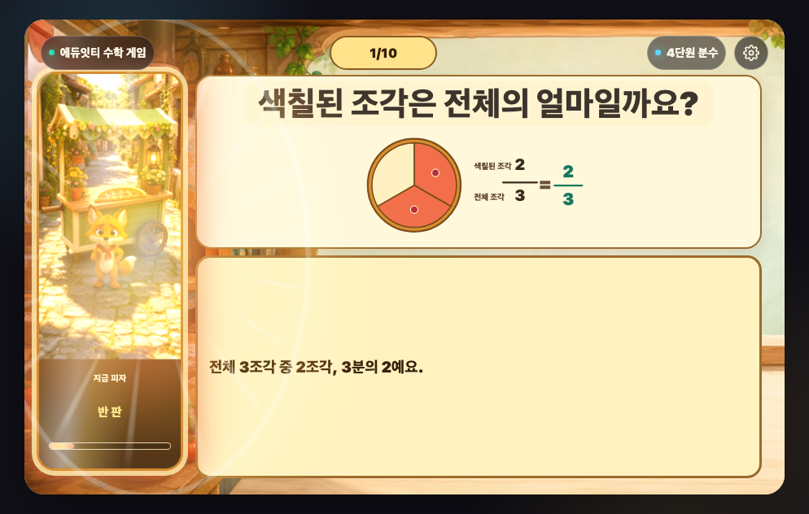

- 학생이 보는 것: 보상 모달이 닫힌 뒤 현재 진행 장면과 피자 빛 변화가 반영되는 모습을 봅니다.
- 판단하거나 누르는 것: 별도 입력 없이 이번 보상이 진행 단계에 반영되는 모습을 확인합니다.
- 화면에서 확인되는 수학 관계: 한 문제의 보상이 현재 진행값에 정확히 한 번 반영됩니다.
- 다음 상태로 넘어가는 이유: 효과를 충분히 본 뒤 다음 문제 또는 결과로 이동합니다.

#### 실제 결과 · `engine-flow-user-visibility-08-result.png`

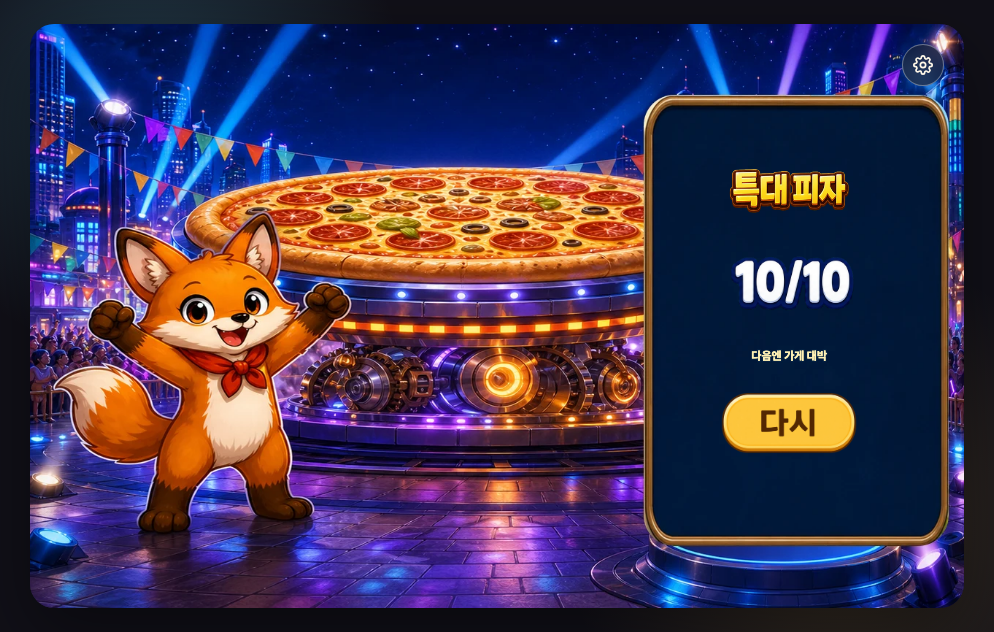

- 학생이 보는 것: 완성 장면과 결과 이름, 정답 수, 다음 목표, 다시 버튼을 봅니다.
- 판단하거나 누르는 것: 현재 결과와 다음 목표를 비교하고 다시 도전할지 결정합니다.
- 화면에서 확인되는 수학 관계: 한 판의 정답과 피자 빛 변화가 하나의 결과 단계로 정리됩니다.
- 다음 상태로 넘어가는 이유: 다시를 누르면 새 문제 순서와 새 보상 흐름으로 시작합니다.

#### 결과 단계 · slice · `engine-flow-user-visibility-08a-result-slice.png`

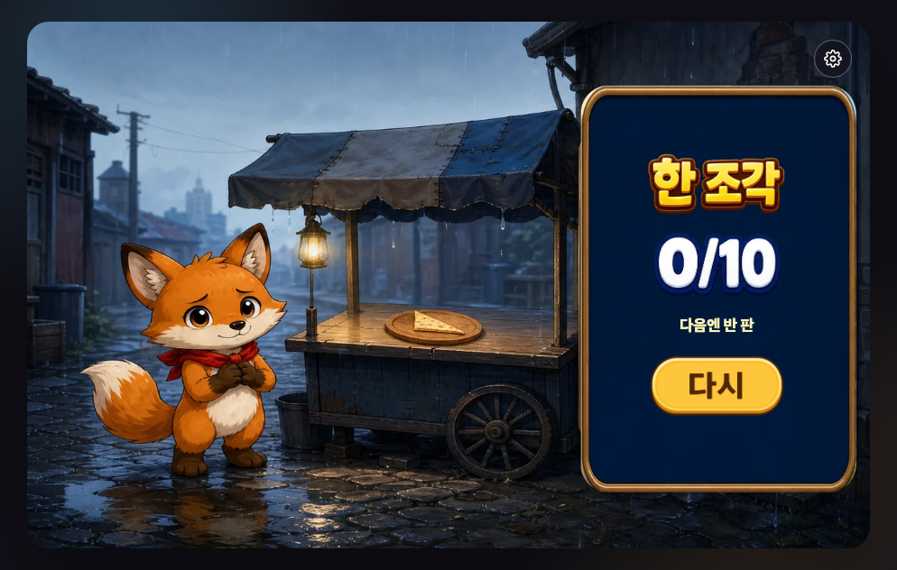

- 학생이 보는 것: 완성 장면과 결과 이름, 정답 수, 다음 목표, 다시 버튼을 봅니다.
- 판단하거나 누르는 것: 현재 결과와 다음 목표를 비교하고 다시 도전할지 결정합니다.
- 화면에서 확인되는 수학 관계: 한 판의 정답과 피자 빛 변화가 하나의 결과 단계로 정리됩니다.
- 다음 상태로 넘어가는 이유: 다시를 누르면 새 문제 순서와 새 보상 흐름으로 시작합니다.

#### 결과 결속 · half · `engine-flow-user-visibility-08c-result-cohesion-half.png`

- 학생이 보는 것: 완성 장면과 결과 이름, 정답 수, 다음 목표, 다시 버튼을 봅니다.
- 판단하거나 누르는 것: 현재 결과와 다음 목표를 비교하고 다시 도전할지 결정합니다.
- 화면에서 확인되는 수학 관계: 한 판의 정답과 피자 빛 변화가 하나의 결과 단계로 정리됩니다.
- 다음 상태로 넘어가는 이유: 다시를 누르면 새 문제 순서와 새 보상 흐름으로 시작합니다.

#### 결과 결속 · jumbo · `engine-flow-user-visibility-08c-result-cohesion-jumbo.png`

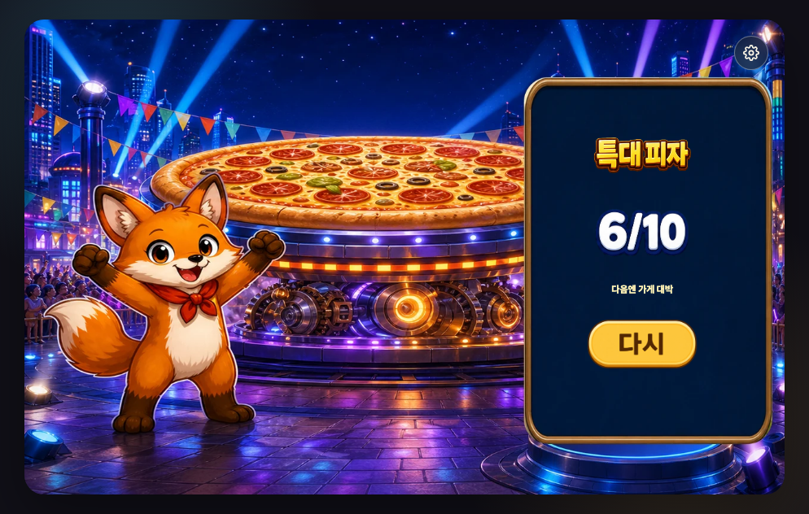

- 학생이 보는 것: 완성 장면과 결과 이름, 정답 수, 다음 목표, 다시 버튼을 봅니다.
- 판단하거나 누르는 것: 현재 결과와 다음 목표를 비교하고 다시 도전할지 결정합니다.
- 화면에서 확인되는 수학 관계: 한 판의 정답과 피자 빛 변화가 하나의 결과 단계로 정리됩니다.
- 다음 상태로 넘어가는 이유: 다시를 누르면 새 문제 순서와 새 보상 흐름으로 시작합니다.

#### 결과 결속 · legend · `engine-flow-user-visibility-08c-result-cohesion-legend.png`

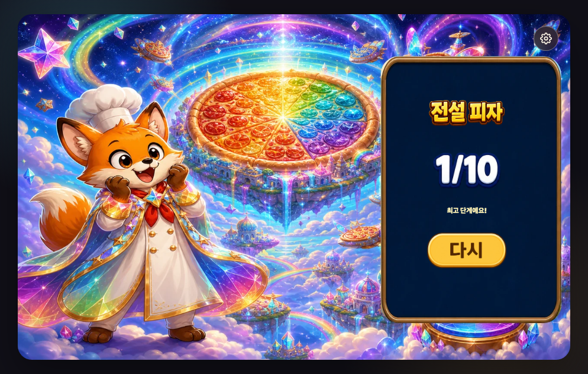

- 학생이 보는 것: 완성 장면과 결과 이름, 정답 수, 다음 목표, 다시 버튼을 봅니다.
- 판단하거나 누르는 것: 현재 결과와 다음 목표를 비교하고 다시 도전할지 결정합니다.
- 화면에서 확인되는 수학 관계: 한 판의 정답과 피자 빛 변화가 하나의 결과 단계로 정리됩니다.
- 다음 상태로 넘어가는 이유: 다시를 누르면 새 문제 순서와 새 보상 흐름으로 시작합니다.

#### 결과 결속 · shopstar · `engine-flow-user-visibility-08c-result-cohesion-shopstar.png`

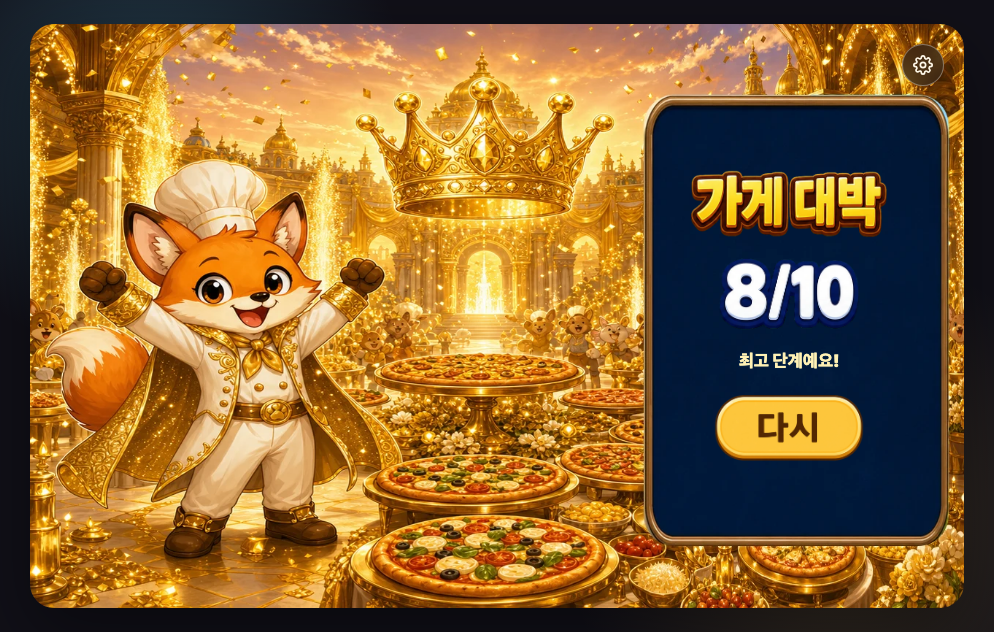

- 학생이 보는 것: 완성 장면과 결과 이름, 정답 수, 다음 목표, 다시 버튼을 봅니다.
- 판단하거나 누르는 것: 현재 결과와 다음 목표를 비교하고 다시 도전할지 결정합니다.
- 화면에서 확인되는 수학 관계: 한 판의 정답과 피자 빛 변화가 하나의 결과 단계로 정리됩니다.
- 다음 상태로 넘어가는 이유: 다시를 누르면 새 문제 순서와 새 보상 흐름으로 시작합니다.

#### 결과 결속 · slice · `engine-flow-user-visibility-08c-result-cohesion-slice.png`

- 학생이 보는 것: 완성 장면과 결과 이름, 정답 수, 다음 목표, 다시 버튼을 봅니다.
- 판단하거나 누르는 것: 현재 결과와 다음 목표를 비교하고 다시 도전할지 결정합니다.
- 화면에서 확인되는 수학 관계: 한 판의 정답과 피자 빛 변화가 하나의 결과 단계로 정리됩니다.
- 다음 상태로 넘어가는 이유: 다시를 누르면 새 문제 순서와 새 보상 흐름으로 시작합니다.

#### 결과 결속 · whole · `engine-flow-user-visibility-08c-result-cohesion-whole.png`

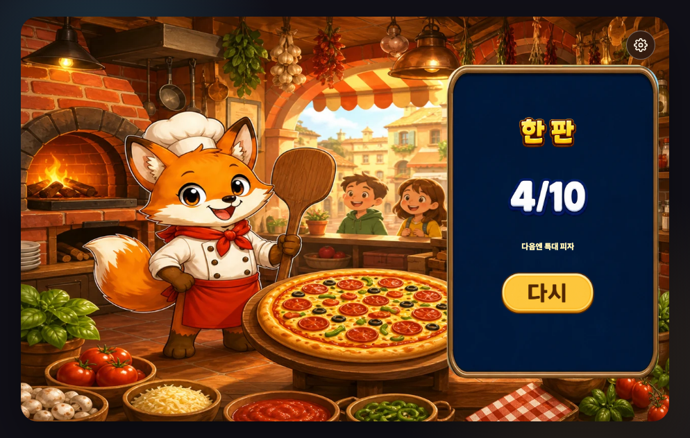

- 학생이 보는 것: 완성 장면과 결과 이름, 정답 수, 다음 목표, 다시 버튼을 봅니다.
- 판단하거나 누르는 것: 현재 결과와 다음 목표를 비교하고 다시 도전할지 결정합니다.
- 화면에서 확인되는 수학 관계: 한 판의 정답과 피자 빛 변화가 하나의 결과 단계로 정리됩니다.
- 다음 상태로 넘어가는 이유: 다시를 누르면 새 문제 순서와 새 보상 흐름으로 시작합니다.

#### 결과 단계 · half · `engine-flow-user-visibility-08a-result-half.png`

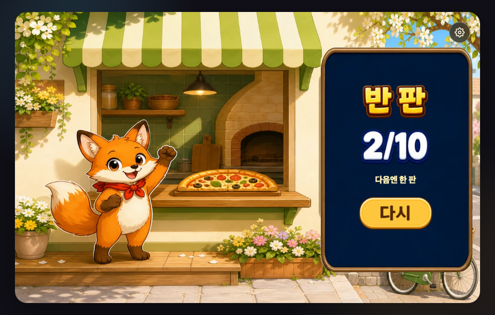

- 학생이 보는 것: 완성 장면과 결과 이름, 정답 수, 다음 목표, 다시 버튼을 봅니다.
- 판단하거나 누르는 것: 현재 결과와 다음 목표를 비교하고 다시 도전할지 결정합니다.
- 화면에서 확인되는 수학 관계: 한 판의 정답과 피자 빛 변화가 하나의 결과 단계로 정리됩니다.
- 다음 상태로 넘어가는 이유: 다시를 누르면 새 문제 순서와 새 보상 흐름으로 시작합니다.

#### 결과 단계 · whole · `engine-flow-user-visibility-08a-result-whole.png`

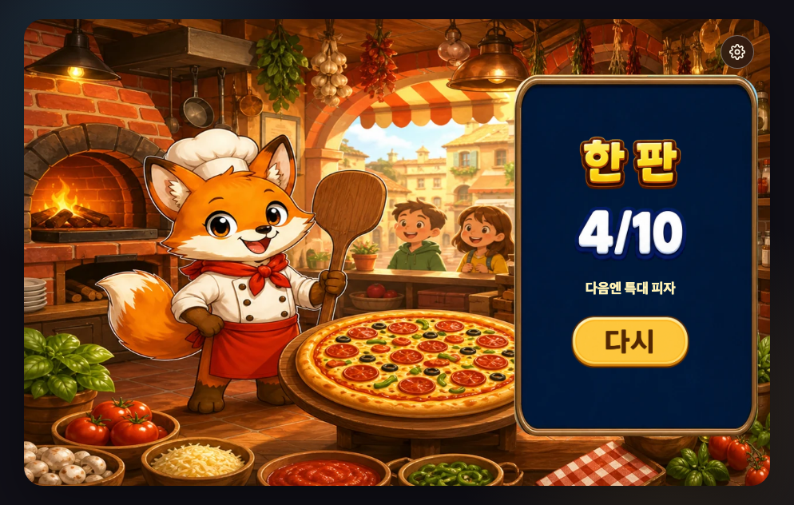

- 학생이 보는 것: 완성 장면과 결과 이름, 정답 수, 다음 목표, 다시 버튼을 봅니다.
- 판단하거나 누르는 것: 현재 결과와 다음 목표를 비교하고 다시 도전할지 결정합니다.
- 화면에서 확인되는 수학 관계: 한 판의 정답과 피자 빛 변화가 하나의 결과 단계로 정리됩니다.
- 다음 상태로 넘어가는 이유: 다시를 누르면 새 문제 순서와 새 보상 흐름으로 시작합니다.

#### 결과 단계 · jumbo · `engine-flow-user-visibility-08a-result-jumbo.png`

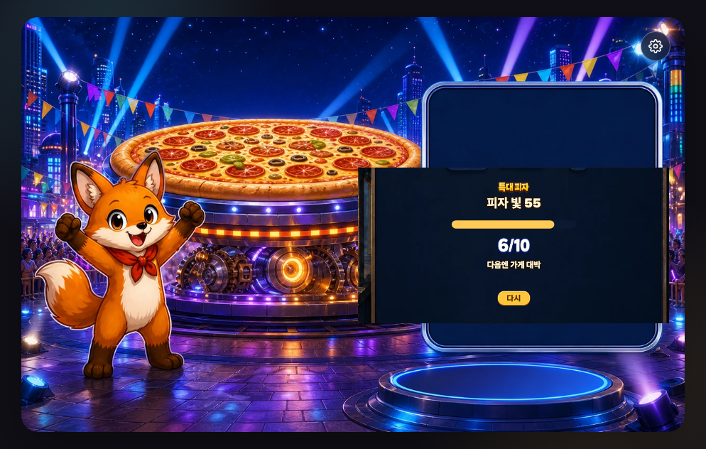

- 학생이 보는 것: 완성 장면과 결과 이름, 정답 수, 다음 목표, 다시 버튼을 봅니다.
- 판단하거나 누르는 것: 현재 결과와 다음 목표를 비교하고 다시 도전할지 결정합니다.
- 화면에서 확인되는 수학 관계: 한 판의 정답과 피자 빛 변화가 하나의 결과 단계로 정리됩니다.
- 다음 상태로 넘어가는 이유: 다시를 누르면 새 문제 순서와 새 보상 흐름으로 시작합니다.

#### 결과 단계 · shopstar · `engine-flow-user-visibility-08a-result-shopstar.png`

- 학생이 보는 것: 완성 장면과 결과 이름, 정답 수, 다음 목표, 다시 버튼을 봅니다.
- 판단하거나 누르는 것: 현재 결과와 다음 목표를 비교하고 다시 도전할지 결정합니다.
- 화면에서 확인되는 수학 관계: 한 판의 정답과 피자 빛 변화가 하나의 결과 단계로 정리됩니다.
- 다음 상태로 넘어가는 이유: 다시를 누르면 새 문제 순서와 새 보상 흐름으로 시작합니다.

#### 결과 단계 · legend · `engine-flow-user-visibility-08a-result-legend.png`

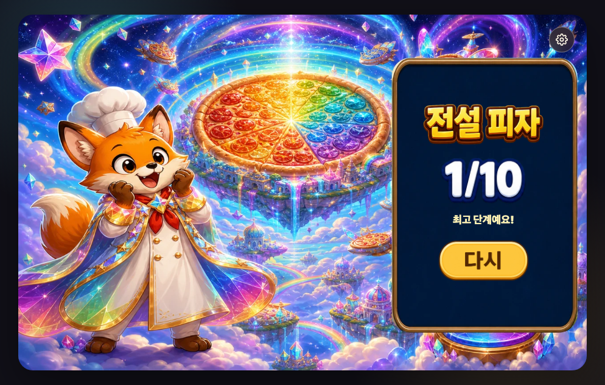

- 학생이 보는 것: 완성 장면과 결과 이름, 정답 수, 다음 목표, 다시 버튼을 봅니다.
- 판단하거나 누르는 것: 현재 결과와 다음 목표를 비교하고 다시 도전할지 결정합니다.
- 화면에서 확인되는 수학 관계: 한 판의 정답과 피자 빛 변화가 하나의 결과 단계로 정리됩니다.
- 다음 상태로 넘어가는 이유: 다시를 누르면 새 문제 순서와 새 보상 흐름으로 시작합니다.

### user-reported-missing-left-progress · 1082×987 · DPR 2 · 25장

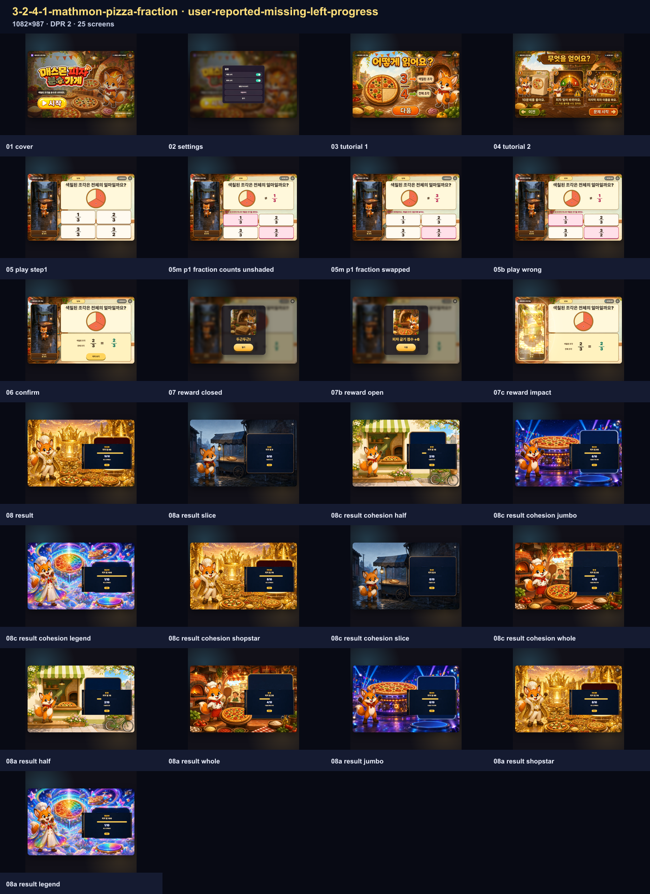

#### 시작 화면 · `engine-flow-user-reported-missing-left-progress-01-cover.png`

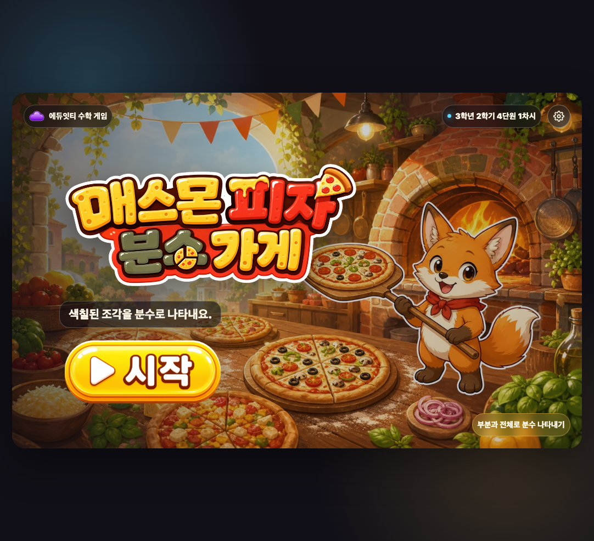

- 학생이 보는 것: 매스몬 피자 분수 가게 제목과 한 줄 목표, 시작 버튼을 봅니다.
- 판단하거나 누르는 것: 게임을 시작할 준비가 되면 시작을 누릅니다.
- 화면에서 확인되는 수학 관계: 부분과 전체로 분수 나타내기을 배우는 차시임을 확인합니다.
- 다음 상태로 넘어가는 이유: 문제를 푸는 방법을 보는 설명 화면으로 이동합니다.

#### 설정 화면 · `engine-flow-user-reported-missing-left-progress-02-settings.png`

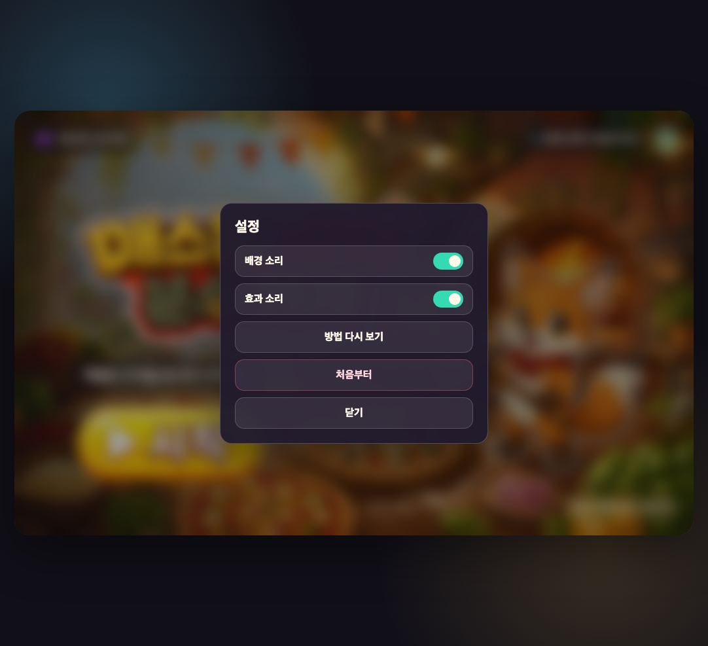

- 학생이 보는 것: 배경 소리·효과 소리와 방법 다시 보기, 처음부터, 닫기를 봅니다.
- 판단하거나 누르는 것: 필요한 소리나 이동 행동 하나를 고릅니다.
- 화면에서 확인되는 수학 관계: 수학 문제는 바꾸지 않고 게임 조작만 설정합니다.
- 다음 상태로 넘어가는 이유: 설정을 마치면 열기 전 화면으로 돌아갑니다.

#### 설명 1 · 풀이 방법 · `engine-flow-user-reported-missing-left-progress-03-tutorial-1.png`

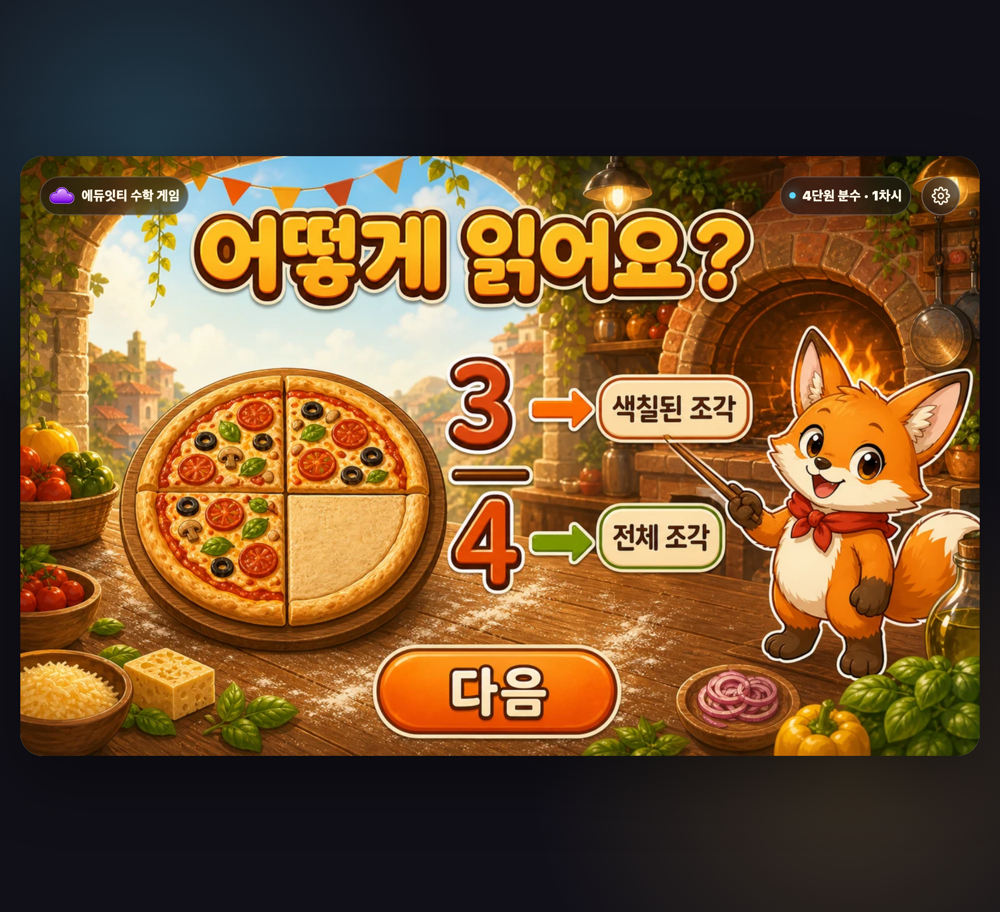

- 학생이 보는 것: 부분과 전체로 분수 나타내기 문제를 푸는 방법과 게임 흐름을 그림으로 봅니다.
- 판단하거나 누르는 것: 그림 속 순서와 누를 곳을 확인한 뒤 다음 행동 버튼을 누릅니다.
- 화면에서 확인되는 수학 관계: 부분과 전체로 분수 나타내기에서 무엇을 비교하거나 계산하는지 확인합니다.
- 다음 상태로 넘어가는 이유: 다음 설명으로 이동합니다.

#### 설명 2 · 보상과 목표 · `engine-flow-user-reported-missing-left-progress-04-tutorial-2.png`

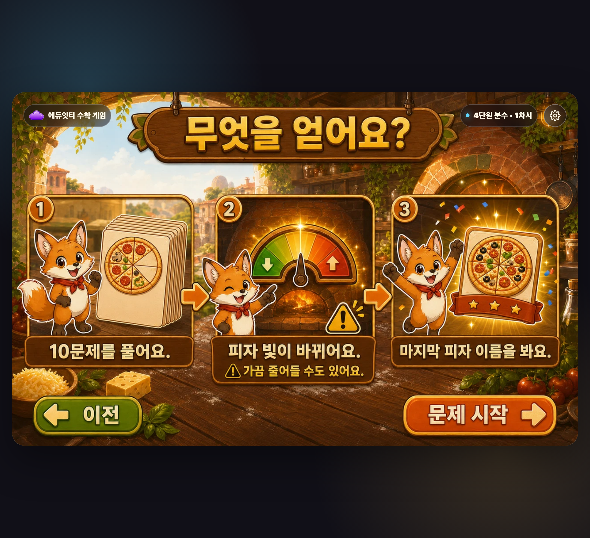

- 학생이 보는 것: 부분과 전체로 분수 나타내기 문제를 푸는 방법과 게임 흐름을 그림으로 봅니다.
- 판단하거나 누르는 것: 그림 속 순서와 누를 곳을 확인한 뒤 다음 행동 버튼을 누릅니다.
- 화면에서 확인되는 수학 관계: 부분과 전체로 분수 나타내기에서 무엇을 비교하거나 계산하는지 확인합니다.
- 다음 상태로 넘어가는 이유: 첫 문제로 이동합니다.

#### 문제 상태 · 05-play-step1 · `engine-flow-user-reported-missing-left-progress-05-play-step1.png`

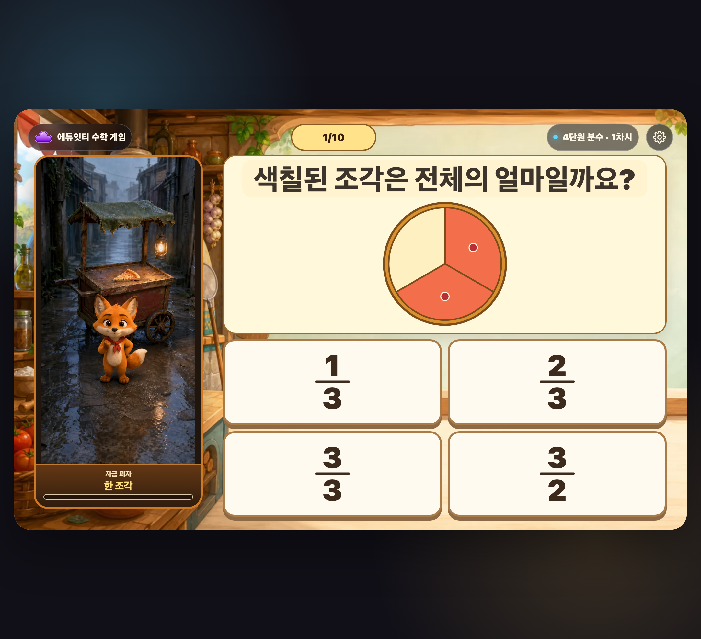

- 학생이 보는 것: 현재 문제, 핵심 계산판이나 물건, 고를 수 있는 답을 봅니다.
- 판단하거나 누르는 것: 문제에서 묻는 값이나 관계에 맞는 답 하나를 고릅니다.
- 화면에서 확인되는 수학 관계: 부분과 전체로 분수 나타내기을 이용해 선택지를 판단합니다.
- 다음 상태로 넘어가는 이유: 고른 답에 따라 오답 또는 정답 확인 상태로 이동합니다.

#### 오개념 확인 · p1-fraction-counts-unshaded · `engine-flow-user-reported-missing-left-progress-05m-p1-fraction-counts-unshaded.png`

- 학생이 보는 것: 고른 답이 계산판이나 물건에 들어간 모습과 짧은 오답 피드백을 봅니다.
- 판단하거나 누르는 것: 어디가 맞지 않는지 확인하고 같은 문제에서 다른 답을 고릅니다.
- 화면에서 확인되는 수학 관계: 부분과 전체로 분수 나타내기의 관계와 고른 답이 왜 맞지 않는지 확인합니다.
- 다음 상태로 넘어가는 이유: 같은 문제에서 다시 판단할 수 있는 상태로 돌아갑니다.

#### 오개념 확인 · p1-fraction-swapped · `engine-flow-user-reported-missing-left-progress-05m-p1-fraction-swapped.png`

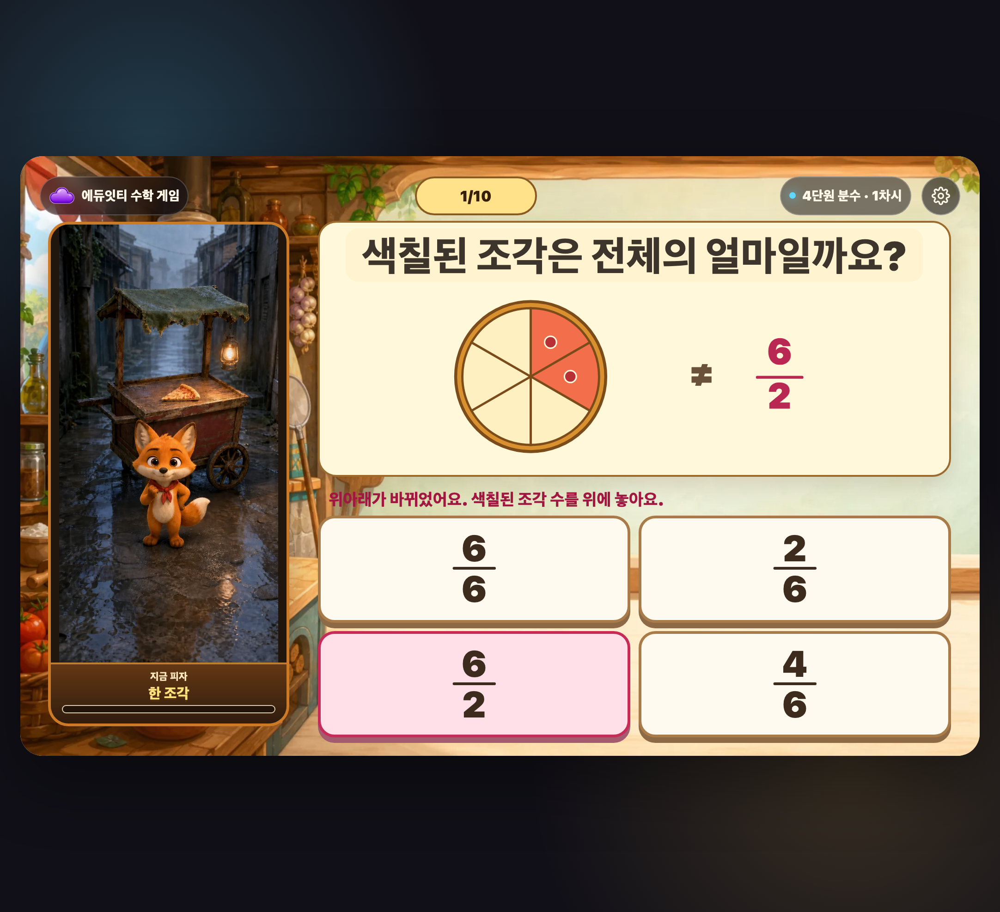

- 학생이 보는 것: 고른 답이 계산판이나 물건에 들어간 모습과 짧은 오답 피드백을 봅니다.
- 판단하거나 누르는 것: 어디가 맞지 않는지 확인하고 같은 문제에서 다른 답을 고릅니다.
- 화면에서 확인되는 수학 관계: 부분과 전체로 분수 나타내기의 관계와 고른 답이 왜 맞지 않는지 확인합니다.
- 다음 상태로 넘어가는 이유: 같은 문제에서 다시 판단할 수 있는 상태로 돌아갑니다.

#### 오답 확인 · 05b-play-wrong · `engine-flow-user-reported-missing-left-progress-05b-play-wrong.png`

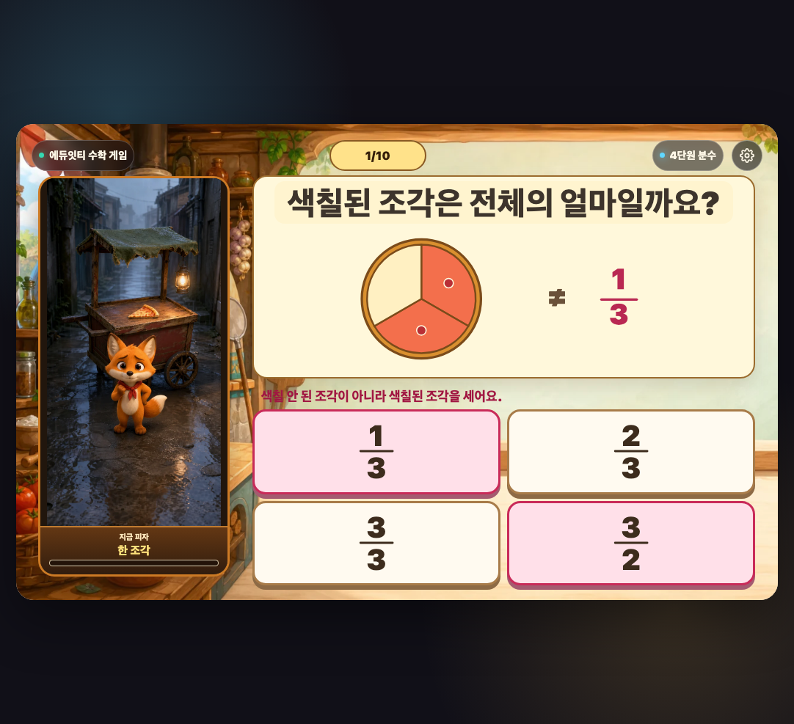

- 학생이 보는 것: 고른 답이 계산판이나 물건에 들어간 모습과 짧은 오답 피드백을 봅니다.
- 판단하거나 누르는 것: 어디가 맞지 않는지 확인하고 같은 문제에서 다른 답을 고릅니다.
- 화면에서 확인되는 수학 관계: 부분과 전체로 분수 나타내기의 관계와 고른 답이 왜 맞지 않는지 확인합니다.
- 다음 상태로 넘어가는 이유: 같은 문제에서 다시 판단할 수 있는 상태로 돌아갑니다.

#### 마지막 확인 · 06-confirm · `engine-flow-user-reported-missing-left-progress-06-confirm.png`

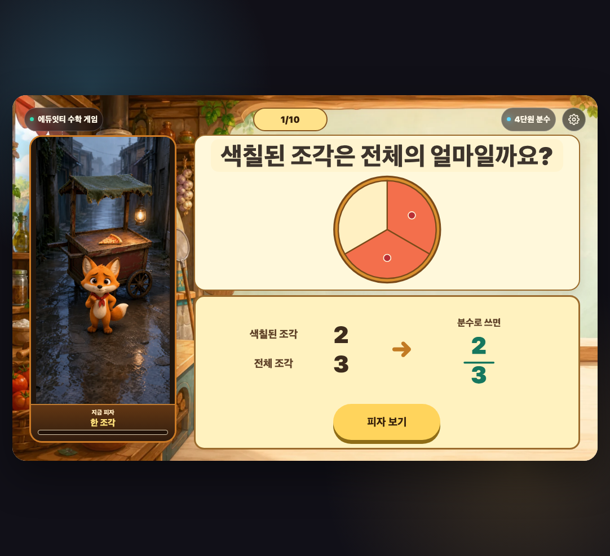

- 학생이 보는 것: 마지막으로 완성된 계산이나 값과 보상으로 가는 행동 버튼을 봅니다.
- 판단하거나 누르는 것: 완성된 관계를 읽은 뒤 보상 확인 버튼을 누릅니다.
- 화면에서 확인되는 수학 관계: 부분과 전체로 분수 나타내기의 완성값을 보상 화면 전에 다시 확인합니다.
- 다음 상태로 넘어가는 이유: 수학 관계를 확인한 뒤 보상 상태로 이동합니다.

#### 닫힌 보상 · `engine-flow-user-reported-missing-left-progress-07-reward-closed.png`

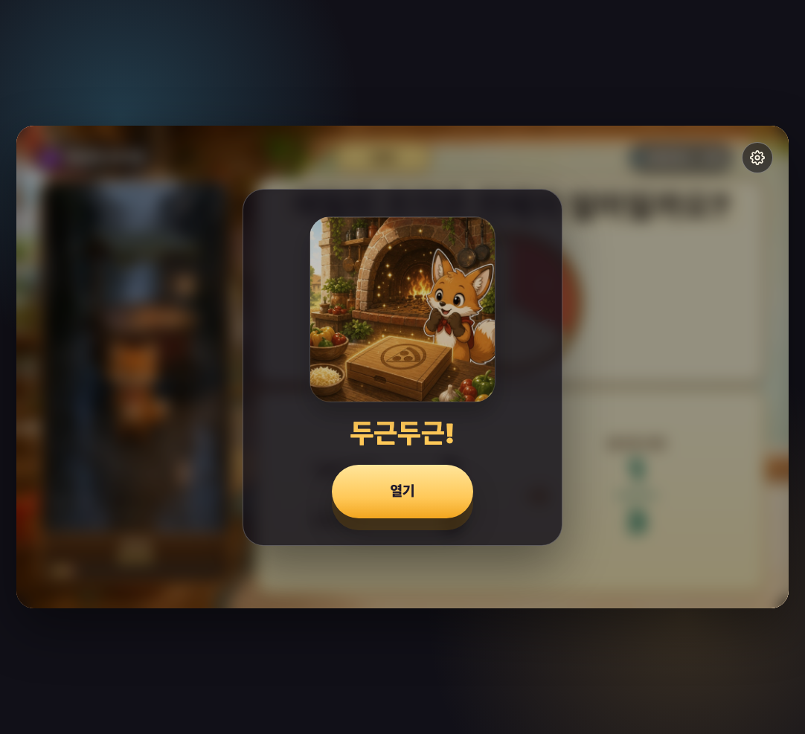

- 학생이 보는 것: 결과가 아직 드러나지 않은 보상 그림과 열기 버튼을 봅니다.
- 판단하거나 누르는 것: 이번 피자 빛 변화를 확인하기 위해 열기를 누릅니다.
- 화면에서 확인되는 수학 관계: 뒤 문제 화면에는 방금 완성한 계산이나 관계가 그대로 남습니다.
- 다음 상태로 넘어가는 이유: 학생이 직접 연 뒤에만 이번 보상 사건이 공개됩니다.

#### 열린 보상 · `engine-flow-user-reported-missing-left-progress-07b-reward-open.png`

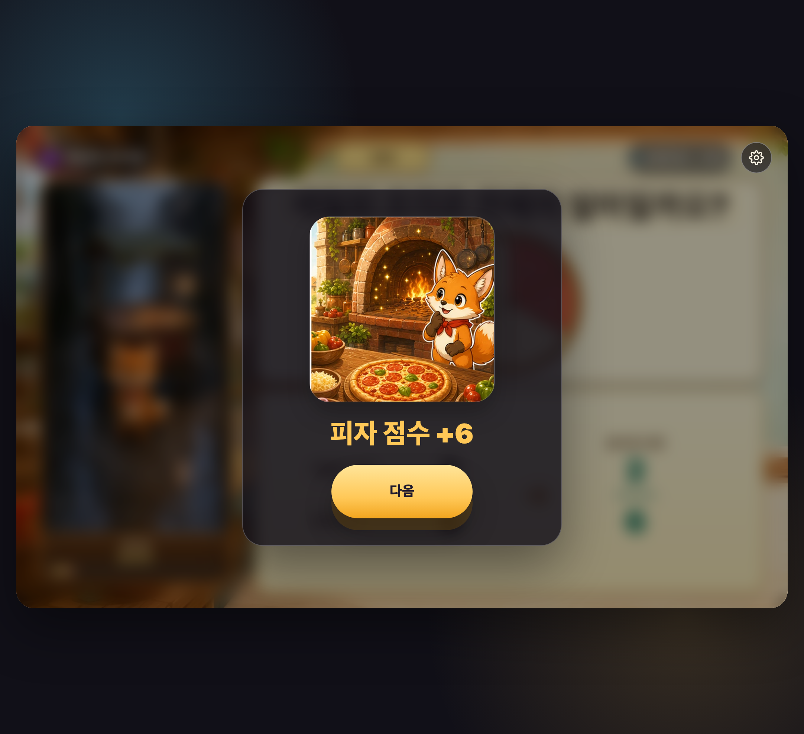

- 학생이 보는 것: 보상 사건 그림과 이번 피자 빛 변화, 다음 행동 버튼을 봅니다.
- 판단하거나 누르는 것: 이번 변화를 확인하고 다음을 누릅니다.
- 화면에서 확인되는 수학 관계: 수학 정답과 무작위 보상 변화가 서로 분리되어 있음을 확인합니다.
- 다음 상태로 넘어가는 이유: 현재 진행 장면의 변화를 본 뒤 다음 문제나 결과로 이동합니다.

#### 보상 뒤 변화 · 07c-reward-impact · `engine-flow-user-reported-missing-left-progress-07c-reward-impact.png`

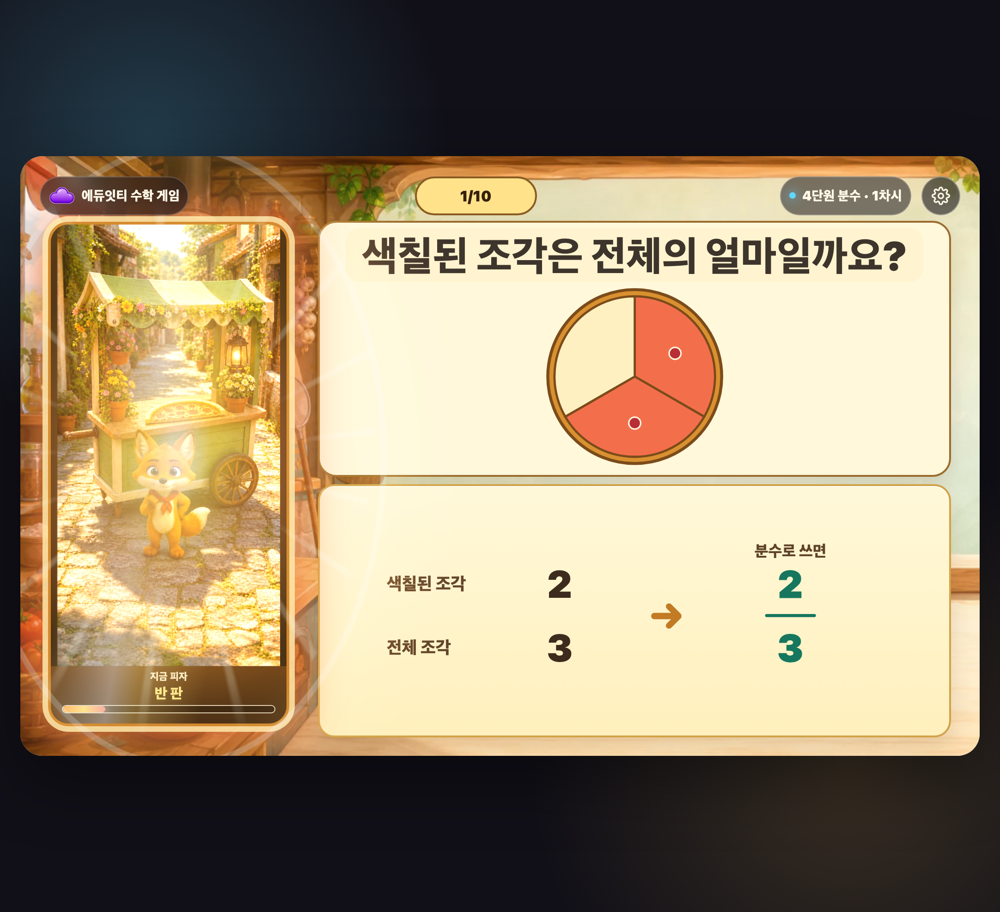

- 학생이 보는 것: 보상 모달이 닫힌 뒤 현재 진행 장면과 피자 빛 변화가 반영되는 모습을 봅니다.
- 판단하거나 누르는 것: 별도 입력 없이 이번 보상이 진행 단계에 반영되는 모습을 확인합니다.
- 화면에서 확인되는 수학 관계: 한 문제의 보상이 현재 진행값에 정확히 한 번 반영됩니다.
- 다음 상태로 넘어가는 이유: 효과를 충분히 본 뒤 다음 문제 또는 결과로 이동합니다.

#### 실제 결과 · `engine-flow-user-reported-missing-left-progress-08-result.png`

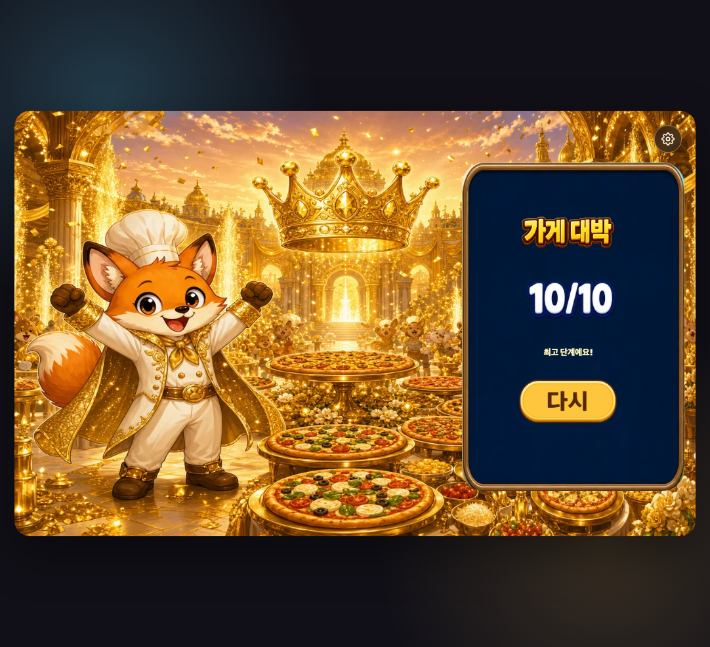

- 학생이 보는 것: 완성 장면과 결과 이름, 정답 수, 다음 목표, 다시 버튼을 봅니다.
- 판단하거나 누르는 것: 현재 결과와 다음 목표를 비교하고 다시 도전할지 결정합니다.
- 화면에서 확인되는 수학 관계: 한 판의 정답과 피자 빛 변화가 하나의 결과 단계로 정리됩니다.
- 다음 상태로 넘어가는 이유: 다시를 누르면 새 문제 순서와 새 보상 흐름으로 시작합니다.

#### 결과 단계 · slice · `engine-flow-user-reported-missing-left-progress-08a-result-slice.png`

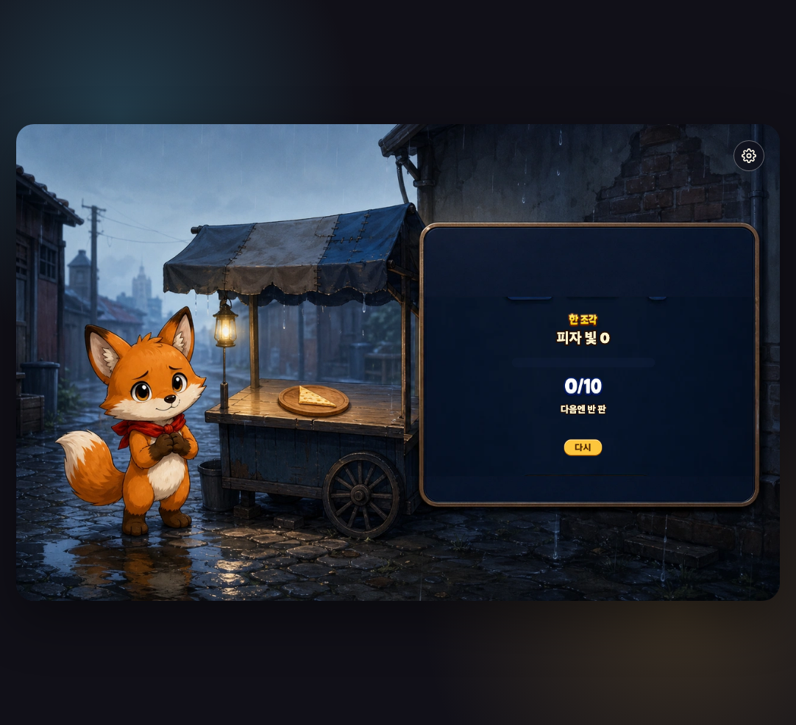

- 학생이 보는 것: 완성 장면과 결과 이름, 정답 수, 다음 목표, 다시 버튼을 봅니다.
- 판단하거나 누르는 것: 현재 결과와 다음 목표를 비교하고 다시 도전할지 결정합니다.
- 화면에서 확인되는 수학 관계: 한 판의 정답과 피자 빛 변화가 하나의 결과 단계로 정리됩니다.
- 다음 상태로 넘어가는 이유: 다시를 누르면 새 문제 순서와 새 보상 흐름으로 시작합니다.

#### 결과 결속 · half · `engine-flow-user-reported-missing-left-progress-08c-result-cohesion-half.png`

- 학생이 보는 것: 완성 장면과 결과 이름, 정답 수, 다음 목표, 다시 버튼을 봅니다.
- 판단하거나 누르는 것: 현재 결과와 다음 목표를 비교하고 다시 도전할지 결정합니다.
- 화면에서 확인되는 수학 관계: 한 판의 정답과 피자 빛 변화가 하나의 결과 단계로 정리됩니다.
- 다음 상태로 넘어가는 이유: 다시를 누르면 새 문제 순서와 새 보상 흐름으로 시작합니다.

#### 결과 결속 · jumbo · `engine-flow-user-reported-missing-left-progress-08c-result-cohesion-jumbo.png`

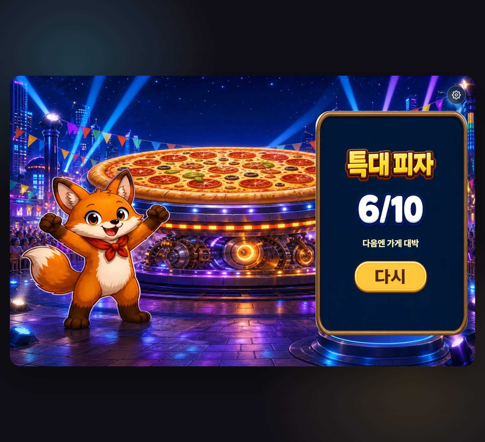

- 학생이 보는 것: 완성 장면과 결과 이름, 정답 수, 다음 목표, 다시 버튼을 봅니다.
- 판단하거나 누르는 것: 현재 결과와 다음 목표를 비교하고 다시 도전할지 결정합니다.
- 화면에서 확인되는 수학 관계: 한 판의 정답과 피자 빛 변화가 하나의 결과 단계로 정리됩니다.
- 다음 상태로 넘어가는 이유: 다시를 누르면 새 문제 순서와 새 보상 흐름으로 시작합니다.

#### 결과 결속 · legend · `engine-flow-user-reported-missing-left-progress-08c-result-cohesion-legend.png`

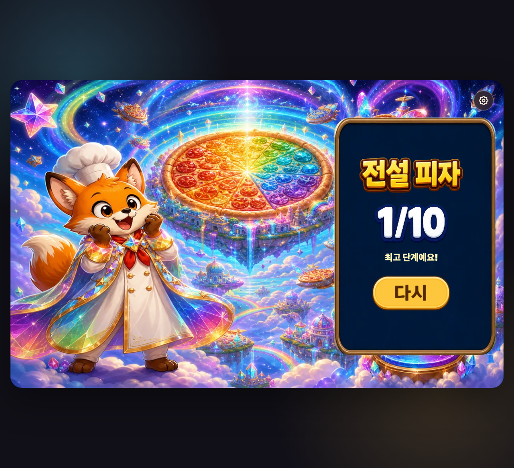

- 학생이 보는 것: 완성 장면과 결과 이름, 정답 수, 다음 목표, 다시 버튼을 봅니다.
- 판단하거나 누르는 것: 현재 결과와 다음 목표를 비교하고 다시 도전할지 결정합니다.
- 화면에서 확인되는 수학 관계: 한 판의 정답과 피자 빛 변화가 하나의 결과 단계로 정리됩니다.
- 다음 상태로 넘어가는 이유: 다시를 누르면 새 문제 순서와 새 보상 흐름으로 시작합니다.

#### 결과 결속 · shopstar · `engine-flow-user-reported-missing-left-progress-08c-result-cohesion-shopstar.png`

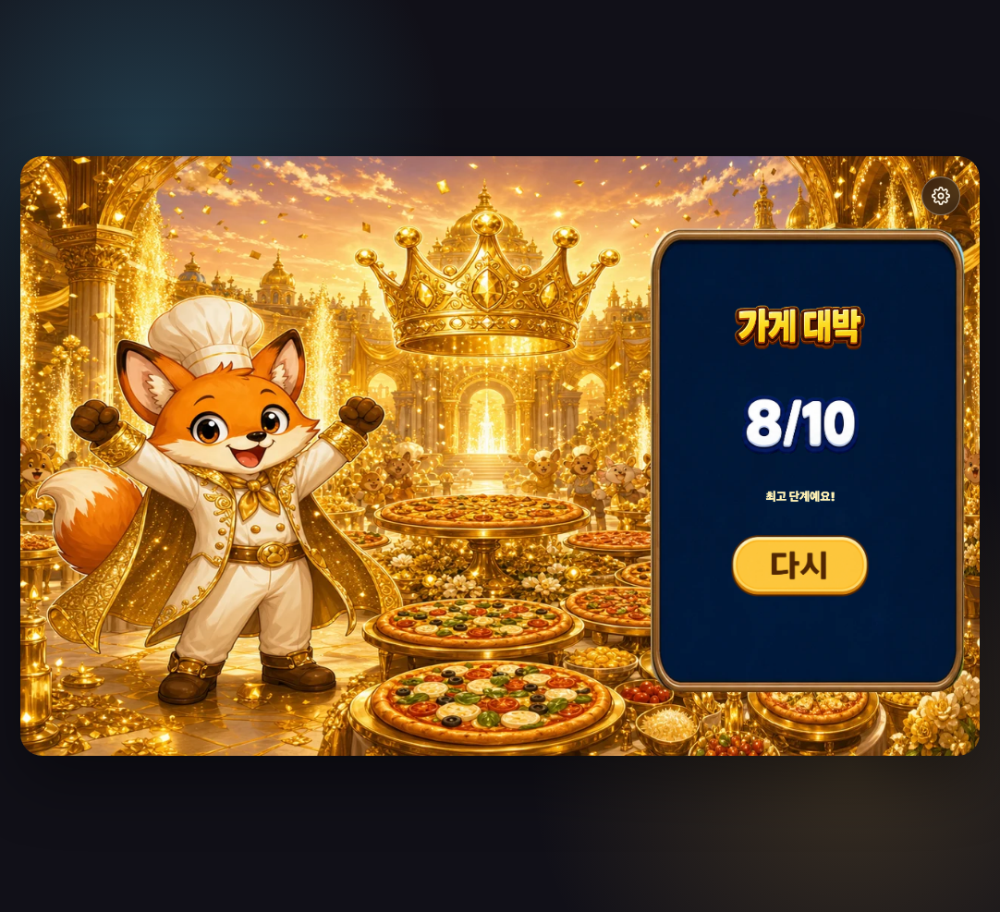

- 학생이 보는 것: 완성 장면과 결과 이름, 정답 수, 다음 목표, 다시 버튼을 봅니다.
- 판단하거나 누르는 것: 현재 결과와 다음 목표를 비교하고 다시 도전할지 결정합니다.
- 화면에서 확인되는 수학 관계: 한 판의 정답과 피자 빛 변화가 하나의 결과 단계로 정리됩니다.
- 다음 상태로 넘어가는 이유: 다시를 누르면 새 문제 순서와 새 보상 흐름으로 시작합니다.

#### 결과 결속 · slice · `engine-flow-user-reported-missing-left-progress-08c-result-cohesion-slice.png`

- 학생이 보는 것: 완성 장면과 결과 이름, 정답 수, 다음 목표, 다시 버튼을 봅니다.
- 판단하거나 누르는 것: 현재 결과와 다음 목표를 비교하고 다시 도전할지 결정합니다.
- 화면에서 확인되는 수학 관계: 한 판의 정답과 피자 빛 변화가 하나의 결과 단계로 정리됩니다.
- 다음 상태로 넘어가는 이유: 다시를 누르면 새 문제 순서와 새 보상 흐름으로 시작합니다.

#### 결과 결속 · whole · `engine-flow-user-reported-missing-left-progress-08c-result-cohesion-whole.png`

- 학생이 보는 것: 완성 장면과 결과 이름, 정답 수, 다음 목표, 다시 버튼을 봅니다.
- 판단하거나 누르는 것: 현재 결과와 다음 목표를 비교하고 다시 도전할지 결정합니다.
- 화면에서 확인되는 수학 관계: 한 판의 정답과 피자 빛 변화가 하나의 결과 단계로 정리됩니다.
- 다음 상태로 넘어가는 이유: 다시를 누르면 새 문제 순서와 새 보상 흐름으로 시작합니다.

#### 결과 단계 · half · `engine-flow-user-reported-missing-left-progress-08a-result-half.png`

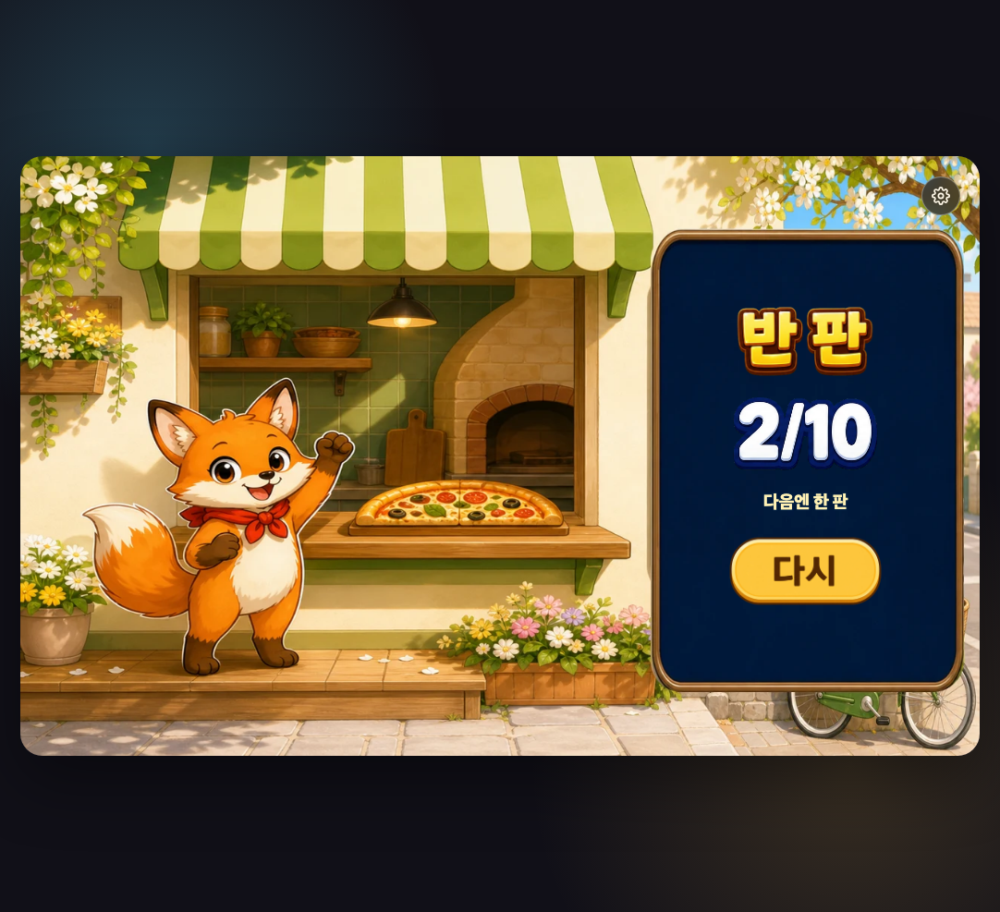

- 학생이 보는 것: 완성 장면과 결과 이름, 정답 수, 다음 목표, 다시 버튼을 봅니다.
- 판단하거나 누르는 것: 현재 결과와 다음 목표를 비교하고 다시 도전할지 결정합니다.
- 화면에서 확인되는 수학 관계: 한 판의 정답과 피자 빛 변화가 하나의 결과 단계로 정리됩니다.
- 다음 상태로 넘어가는 이유: 다시를 누르면 새 문제 순서와 새 보상 흐름으로 시작합니다.

#### 결과 단계 · whole · `engine-flow-user-reported-missing-left-progress-08a-result-whole.png`

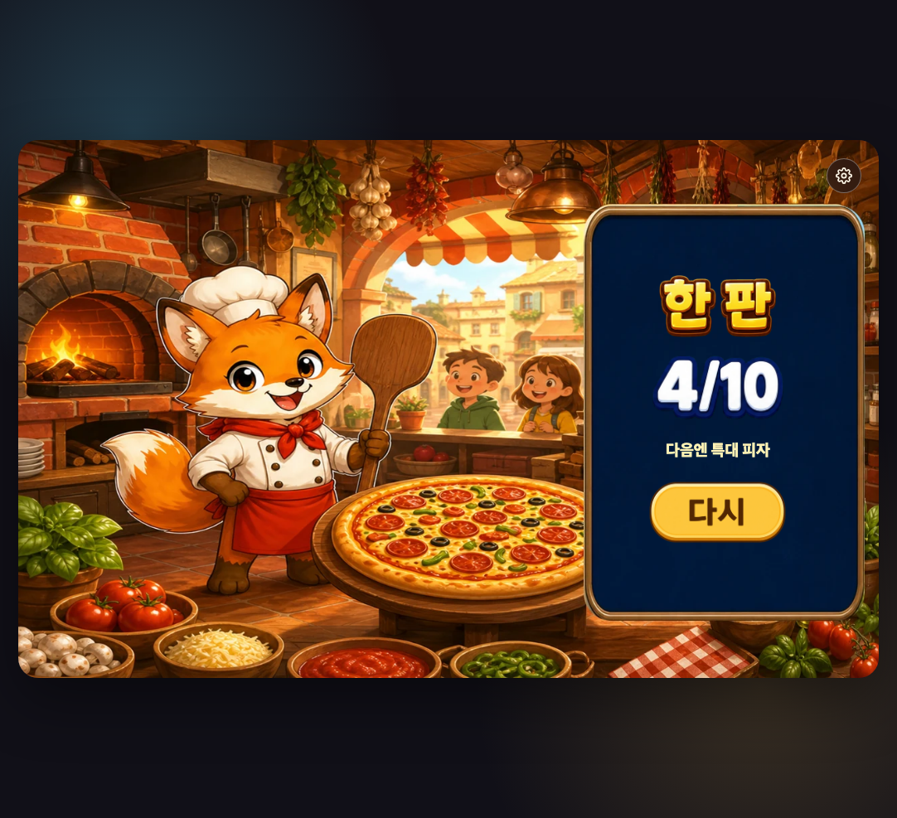

- 학생이 보는 것: 완성 장면과 결과 이름, 정답 수, 다음 목표, 다시 버튼을 봅니다.
- 판단하거나 누르는 것: 현재 결과와 다음 목표를 비교하고 다시 도전할지 결정합니다.
- 화면에서 확인되는 수학 관계: 한 판의 정답과 피자 빛 변화가 하나의 결과 단계로 정리됩니다.
- 다음 상태로 넘어가는 이유: 다시를 누르면 새 문제 순서와 새 보상 흐름으로 시작합니다.

#### 결과 단계 · jumbo · `engine-flow-user-reported-missing-left-progress-08a-result-jumbo.png`

- 학생이 보는 것: 완성 장면과 결과 이름, 정답 수, 다음 목표, 다시 버튼을 봅니다.
- 판단하거나 누르는 것: 현재 결과와 다음 목표를 비교하고 다시 도전할지 결정합니다.
- 화면에서 확인되는 수학 관계: 한 판의 정답과 피자 빛 변화가 하나의 결과 단계로 정리됩니다.
- 다음 상태로 넘어가는 이유: 다시를 누르면 새 문제 순서와 새 보상 흐름으로 시작합니다.

#### 결과 단계 · shopstar · `engine-flow-user-reported-missing-left-progress-08a-result-shopstar.png`

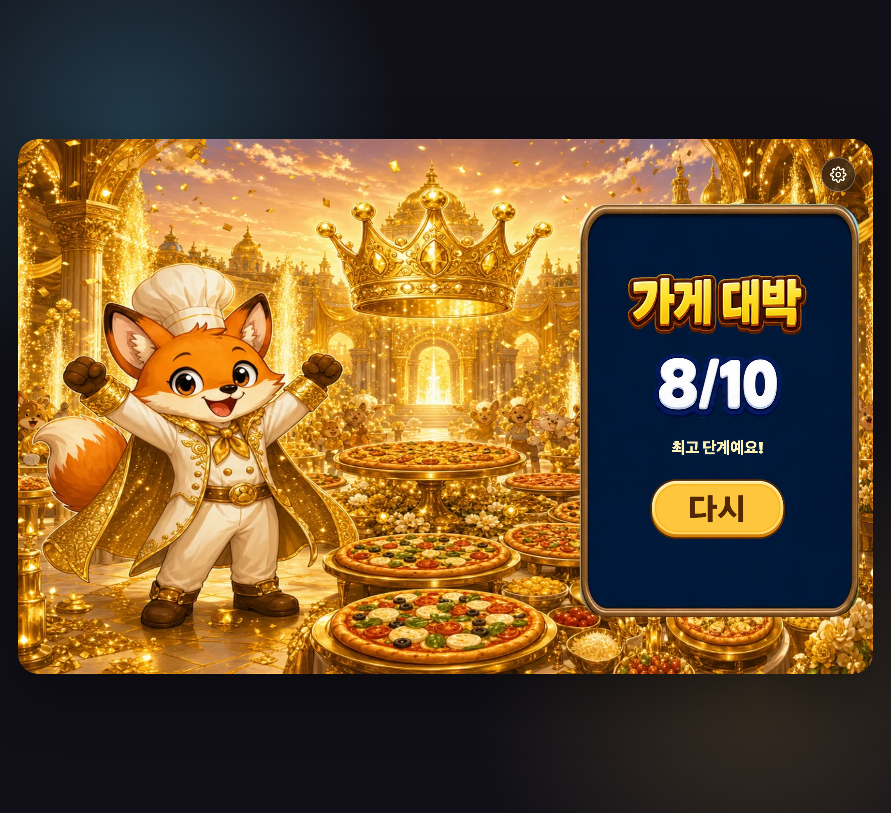

- 학생이 보는 것: 완성 장면과 결과 이름, 정답 수, 다음 목표, 다시 버튼을 봅니다.
- 판단하거나 누르는 것: 현재 결과와 다음 목표를 비교하고 다시 도전할지 결정합니다.
- 화면에서 확인되는 수학 관계: 한 판의 정답과 피자 빛 변화가 하나의 결과 단계로 정리됩니다.
- 다음 상태로 넘어가는 이유: 다시를 누르면 새 문제 순서와 새 보상 흐름으로 시작합니다.

#### 결과 단계 · legend · `engine-flow-user-reported-missing-left-progress-08a-result-legend.png`

- 학생이 보는 것: 완성 장면과 결과 이름, 정답 수, 다음 목표, 다시 버튼을 봅니다.
- 판단하거나 누르는 것: 현재 결과와 다음 목표를 비교하고 다시 도전할지 결정합니다.
- 화면에서 확인되는 수학 관계: 한 판의 정답과 피자 빛 변화가 하나의 결과 단계로 정리됩니다.
- 다음 상태로 넘어가는 이유: 다시를 누르면 새 문제 순서와 새 보상 흐름으로 시작합니다.

### empty-reward-fixture · 1280×800 · DPR 1 · 24장

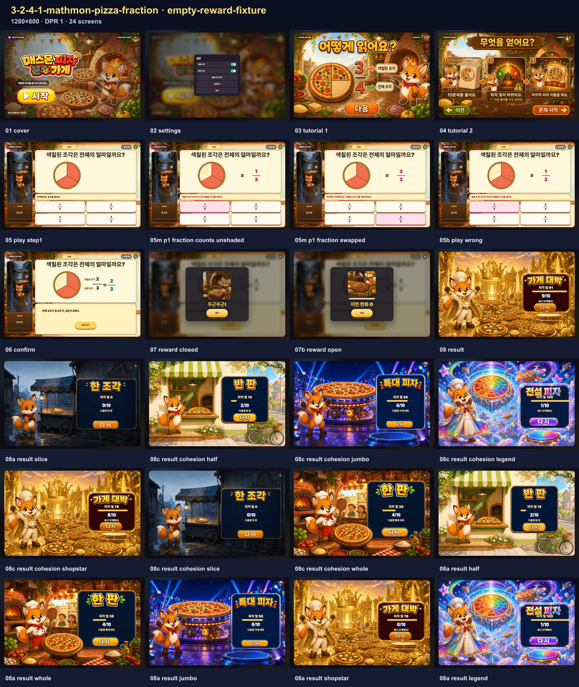

#### 시작 화면 · `engine-flow-empty-reward-fixture-01-cover.png`

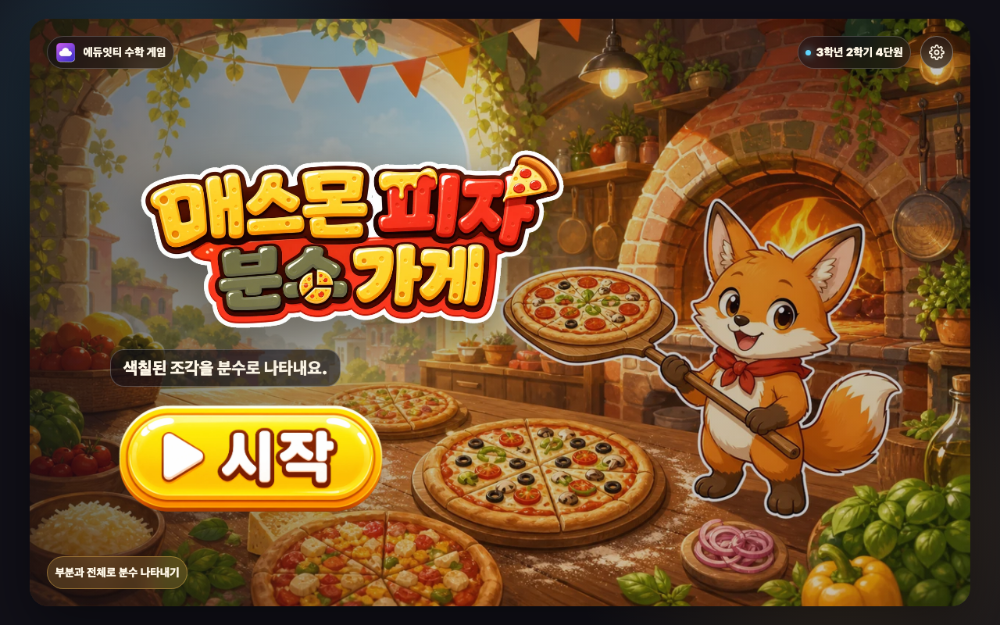

- 학생이 보는 것: 매스몬 피자 분수 가게 제목과 한 줄 목표, 시작 버튼을 봅니다.
- 판단하거나 누르는 것: 게임을 시작할 준비가 되면 시작을 누릅니다.
- 화면에서 확인되는 수학 관계: 부분과 전체로 분수 나타내기을 배우는 차시임을 확인합니다.
- 다음 상태로 넘어가는 이유: 문제를 푸는 방법을 보는 설명 화면으로 이동합니다.

#### 설정 화면 · `engine-flow-empty-reward-fixture-02-settings.png`

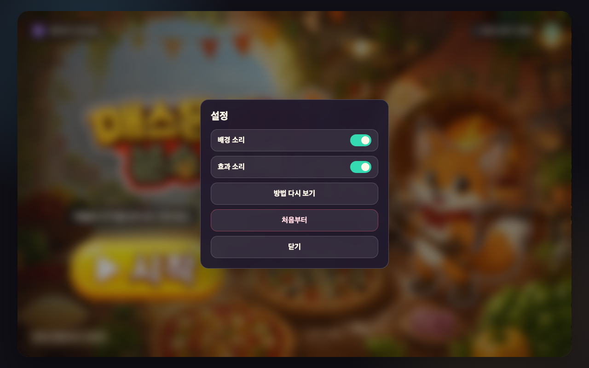

- 학생이 보는 것: 배경 소리·효과 소리와 방법 다시 보기, 처음부터, 닫기를 봅니다.
- 판단하거나 누르는 것: 필요한 소리나 이동 행동 하나를 고릅니다.
- 화면에서 확인되는 수학 관계: 수학 문제는 바꾸지 않고 게임 조작만 설정합니다.
- 다음 상태로 넘어가는 이유: 설정을 마치면 열기 전 화면으로 돌아갑니다.

#### 설명 1 · 풀이 방법 · `engine-flow-empty-reward-fixture-03-tutorial-1.png`

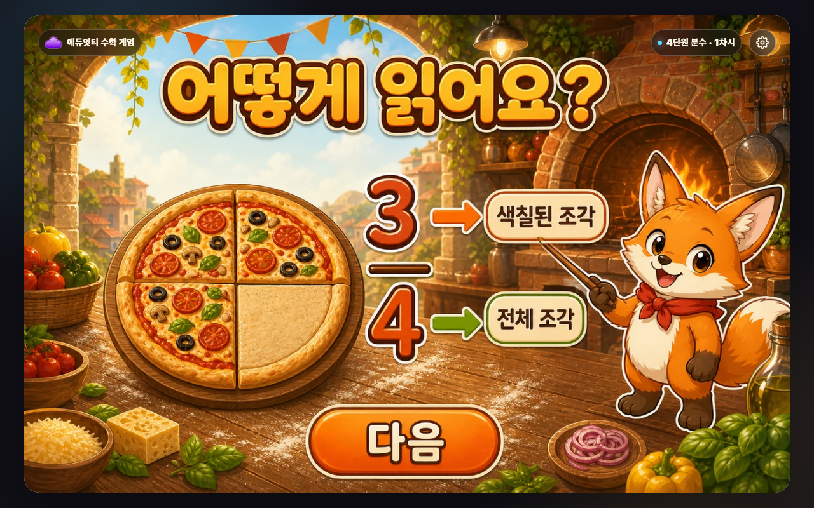

- 학생이 보는 것: 부분과 전체로 분수 나타내기 문제를 푸는 방법과 게임 흐름을 그림으로 봅니다.
- 판단하거나 누르는 것: 그림 속 순서와 누를 곳을 확인한 뒤 다음 행동 버튼을 누릅니다.
- 화면에서 확인되는 수학 관계: 부분과 전체로 분수 나타내기에서 무엇을 비교하거나 계산하는지 확인합니다.
- 다음 상태로 넘어가는 이유: 다음 설명으로 이동합니다.

#### 설명 2 · 보상과 목표 · `engine-flow-empty-reward-fixture-04-tutorial-2.png`

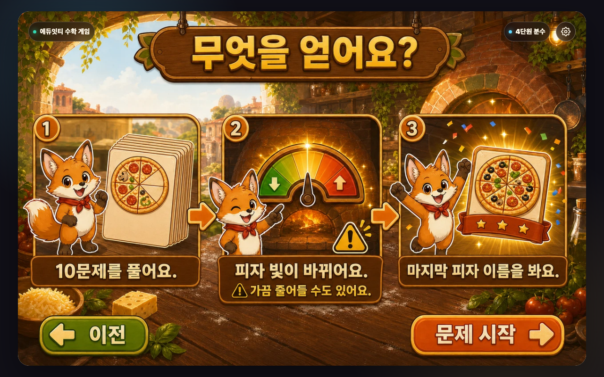

- 학생이 보는 것: 부분과 전체로 분수 나타내기 문제를 푸는 방법과 게임 흐름을 그림으로 봅니다.
- 판단하거나 누르는 것: 그림 속 순서와 누를 곳을 확인한 뒤 다음 행동 버튼을 누릅니다.
- 화면에서 확인되는 수학 관계: 부분과 전체로 분수 나타내기에서 무엇을 비교하거나 계산하는지 확인합니다.
- 다음 상태로 넘어가는 이유: 첫 문제로 이동합니다.

#### 문제 상태 · 05-play-step1 · `engine-flow-empty-reward-fixture-05-play-step1.png`

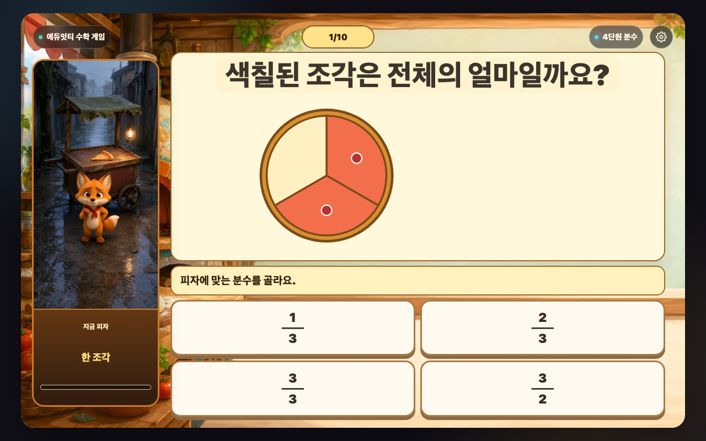

- 학생이 보는 것: 현재 문제, 핵심 계산판이나 물건, 고를 수 있는 답을 봅니다.
- 판단하거나 누르는 것: 문제에서 묻는 값이나 관계에 맞는 답 하나를 고릅니다.
- 화면에서 확인되는 수학 관계: 부분과 전체로 분수 나타내기을 이용해 선택지를 판단합니다.
- 다음 상태로 넘어가는 이유: 고른 답에 따라 오답 또는 정답 확인 상태로 이동합니다.

#### 오개념 확인 · p1-fraction-counts-unshaded · `engine-flow-empty-reward-fixture-05m-p1-fraction-counts-unshaded.png`

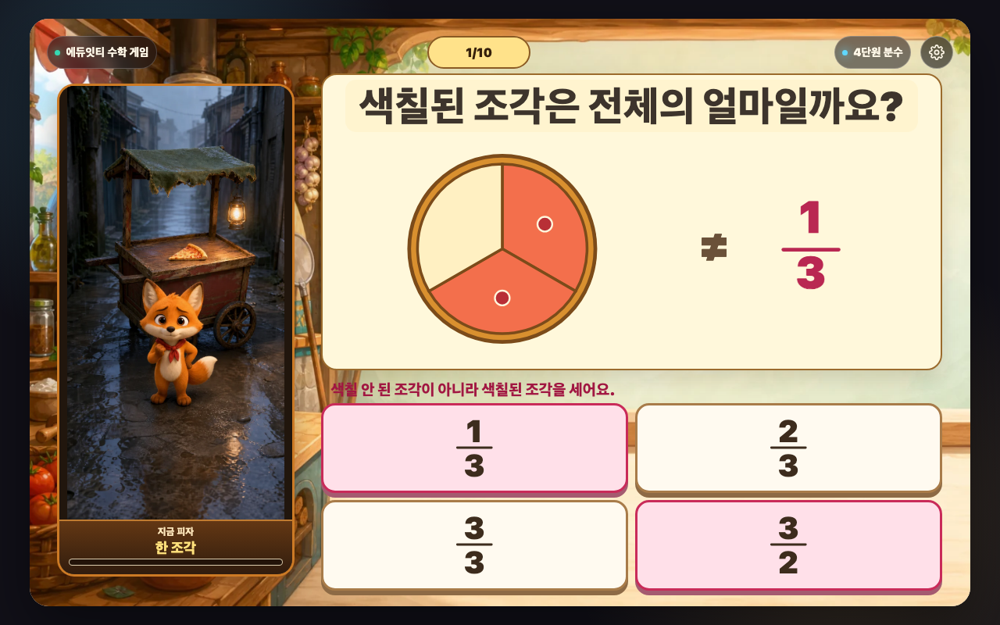

- 학생이 보는 것: 고른 답이 계산판이나 물건에 들어간 모습과 짧은 오답 피드백을 봅니다.
- 판단하거나 누르는 것: 어디가 맞지 않는지 확인하고 같은 문제에서 다른 답을 고릅니다.
- 화면에서 확인되는 수학 관계: 부분과 전체로 분수 나타내기의 관계와 고른 답이 왜 맞지 않는지 확인합니다.
- 다음 상태로 넘어가는 이유: 같은 문제에서 다시 판단할 수 있는 상태로 돌아갑니다.

#### 오개념 확인 · p1-fraction-swapped · `engine-flow-empty-reward-fixture-05m-p1-fraction-swapped.png`

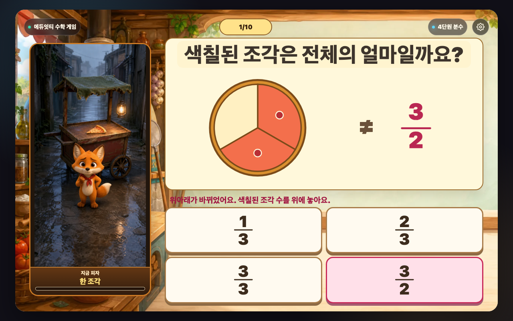

- 학생이 보는 것: 고른 답이 계산판이나 물건에 들어간 모습과 짧은 오답 피드백을 봅니다.
- 판단하거나 누르는 것: 어디가 맞지 않는지 확인하고 같은 문제에서 다른 답을 고릅니다.
- 화면에서 확인되는 수학 관계: 부분과 전체로 분수 나타내기의 관계와 고른 답이 왜 맞지 않는지 확인합니다.
- 다음 상태로 넘어가는 이유: 같은 문제에서 다시 판단할 수 있는 상태로 돌아갑니다.

#### 오답 확인 · 05b-play-wrong · `engine-flow-empty-reward-fixture-05b-play-wrong.png`

- 학생이 보는 것: 고른 답이 계산판이나 물건에 들어간 모습과 짧은 오답 피드백을 봅니다.
- 판단하거나 누르는 것: 어디가 맞지 않는지 확인하고 같은 문제에서 다른 답을 고릅니다.
- 화면에서 확인되는 수학 관계: 부분과 전체로 분수 나타내기의 관계와 고른 답이 왜 맞지 않는지 확인합니다.
- 다음 상태로 넘어가는 이유: 같은 문제에서 다시 판단할 수 있는 상태로 돌아갑니다.

#### 마지막 확인 · 06-confirm · `engine-flow-empty-reward-fixture-06-confirm.png`

- 학생이 보는 것: 마지막으로 완성된 계산이나 값과 보상으로 가는 행동 버튼을 봅니다.
- 판단하거나 누르는 것: 완성된 관계를 읽은 뒤 보상 확인 버튼을 누릅니다.
- 화면에서 확인되는 수학 관계: 부분과 전체로 분수 나타내기의 완성값을 보상 화면 전에 다시 확인합니다.
- 다음 상태로 넘어가는 이유: 수학 관계를 확인한 뒤 보상 상태로 이동합니다.

#### 닫힌 보상 · `engine-flow-empty-reward-fixture-07-reward-closed.png`

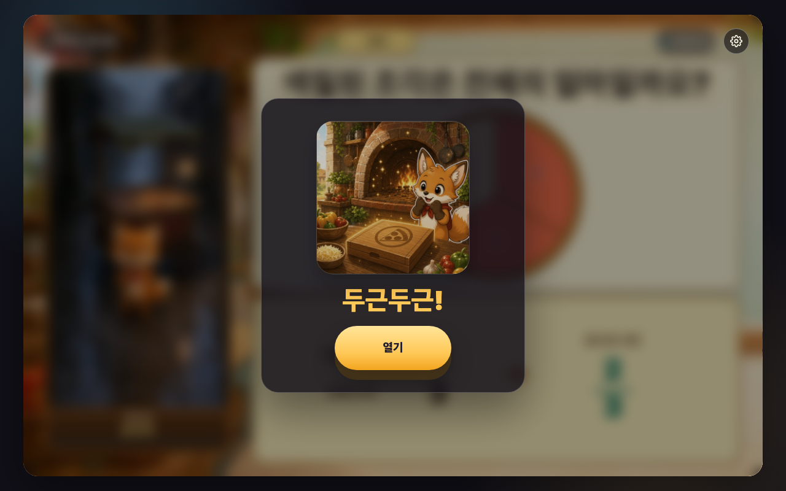

- 학생이 보는 것: 결과가 아직 드러나지 않은 보상 그림과 열기 버튼을 봅니다.
- 판단하거나 누르는 것: 이번 피자 빛 변화를 확인하기 위해 열기를 누릅니다.
- 화면에서 확인되는 수학 관계: 뒤 문제 화면에는 방금 완성한 계산이나 관계가 그대로 남습니다.
- 다음 상태로 넘어가는 이유: 학생이 직접 연 뒤에만 이번 보상 사건이 공개됩니다.

#### 열린 보상 · `engine-flow-empty-reward-fixture-07b-reward-open.png`

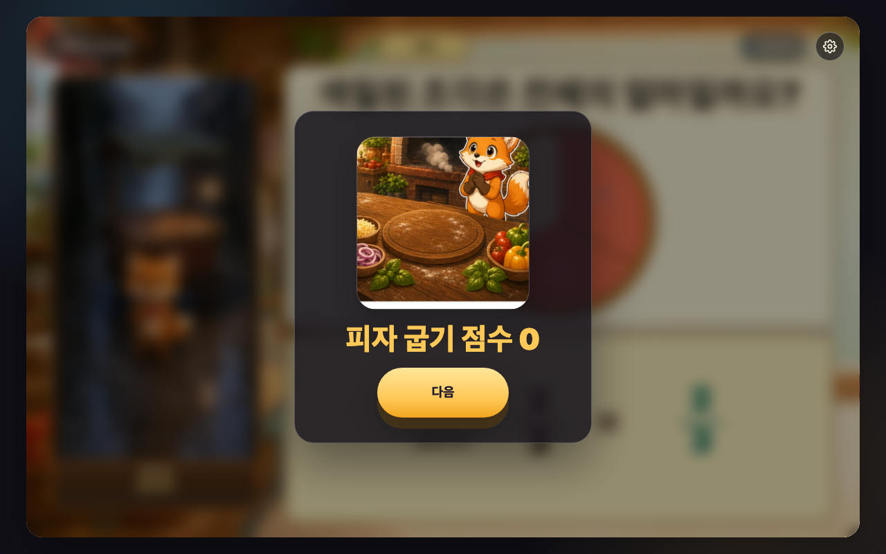

- 학생이 보는 것: 보상 사건 그림과 이번 피자 빛 변화, 다음 행동 버튼을 봅니다.
- 판단하거나 누르는 것: 이번 변화를 확인하고 다음을 누릅니다.
- 화면에서 확인되는 수학 관계: 수학 정답과 무작위 보상 변화가 서로 분리되어 있음을 확인합니다.
- 다음 상태로 넘어가는 이유: 현재 진행 장면의 변화를 본 뒤 다음 문제나 결과로 이동합니다.

#### 실제 결과 · `engine-flow-empty-reward-fixture-08-result.png`

- 학생이 보는 것: 완성 장면과 결과 이름, 정답 수, 다음 목표, 다시 버튼을 봅니다.
- 판단하거나 누르는 것: 현재 결과와 다음 목표를 비교하고 다시 도전할지 결정합니다.
- 화면에서 확인되는 수학 관계: 한 판의 정답과 피자 빛 변화가 하나의 결과 단계로 정리됩니다.
- 다음 상태로 넘어가는 이유: 다시를 누르면 새 문제 순서와 새 보상 흐름으로 시작합니다.

#### 결과 단계 · slice · `engine-flow-empty-reward-fixture-08a-result-slice.png`

- 학생이 보는 것: 완성 장면과 결과 이름, 정답 수, 다음 목표, 다시 버튼을 봅니다.
- 판단하거나 누르는 것: 현재 결과와 다음 목표를 비교하고 다시 도전할지 결정합니다.
- 화면에서 확인되는 수학 관계: 한 판의 정답과 피자 빛 변화가 하나의 결과 단계로 정리됩니다.
- 다음 상태로 넘어가는 이유: 다시를 누르면 새 문제 순서와 새 보상 흐름으로 시작합니다.

#### 결과 결속 · half · `engine-flow-empty-reward-fixture-08c-result-cohesion-half.png`

- 학생이 보는 것: 완성 장면과 결과 이름, 정답 수, 다음 목표, 다시 버튼을 봅니다.
- 판단하거나 누르는 것: 현재 결과와 다음 목표를 비교하고 다시 도전할지 결정합니다.
- 화면에서 확인되는 수학 관계: 한 판의 정답과 피자 빛 변화가 하나의 결과 단계로 정리됩니다.
- 다음 상태로 넘어가는 이유: 다시를 누르면 새 문제 순서와 새 보상 흐름으로 시작합니다.

#### 결과 결속 · jumbo · `engine-flow-empty-reward-fixture-08c-result-cohesion-jumbo.png`

- 학생이 보는 것: 완성 장면과 결과 이름, 정답 수, 다음 목표, 다시 버튼을 봅니다.
- 판단하거나 누르는 것: 현재 결과와 다음 목표를 비교하고 다시 도전할지 결정합니다.
- 화면에서 확인되는 수학 관계: 한 판의 정답과 피자 빛 변화가 하나의 결과 단계로 정리됩니다.
- 다음 상태로 넘어가는 이유: 다시를 누르면 새 문제 순서와 새 보상 흐름으로 시작합니다.

#### 결과 결속 · legend · `engine-flow-empty-reward-fixture-08c-result-cohesion-legend.png`

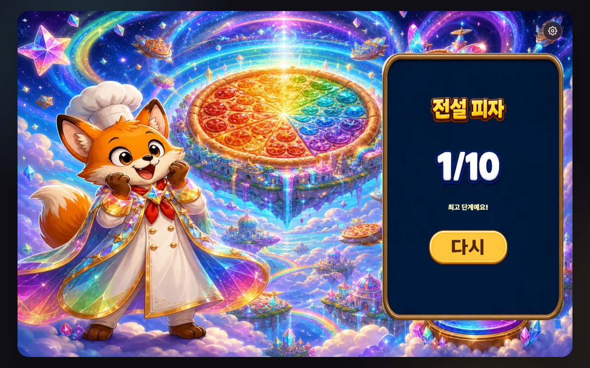

- 학생이 보는 것: 완성 장면과 결과 이름, 정답 수, 다음 목표, 다시 버튼을 봅니다.
- 판단하거나 누르는 것: 현재 결과와 다음 목표를 비교하고 다시 도전할지 결정합니다.
- 화면에서 확인되는 수학 관계: 한 판의 정답과 피자 빛 변화가 하나의 결과 단계로 정리됩니다.
- 다음 상태로 넘어가는 이유: 다시를 누르면 새 문제 순서와 새 보상 흐름으로 시작합니다.

#### 결과 결속 · shopstar · `engine-flow-empty-reward-fixture-08c-result-cohesion-shopstar.png`

- 학생이 보는 것: 완성 장면과 결과 이름, 정답 수, 다음 목표, 다시 버튼을 봅니다.
- 판단하거나 누르는 것: 현재 결과와 다음 목표를 비교하고 다시 도전할지 결정합니다.
- 화면에서 확인되는 수학 관계: 한 판의 정답과 피자 빛 변화가 하나의 결과 단계로 정리됩니다.
- 다음 상태로 넘어가는 이유: 다시를 누르면 새 문제 순서와 새 보상 흐름으로 시작합니다.

#### 결과 결속 · slice · `engine-flow-empty-reward-fixture-08c-result-cohesion-slice.png`

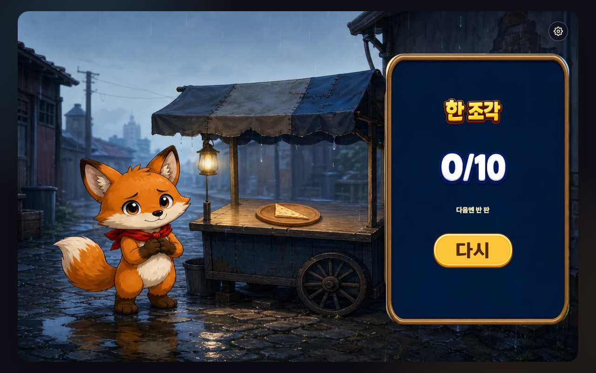

- 학생이 보는 것: 완성 장면과 결과 이름, 정답 수, 다음 목표, 다시 버튼을 봅니다.
- 판단하거나 누르는 것: 현재 결과와 다음 목표를 비교하고 다시 도전할지 결정합니다.
- 화면에서 확인되는 수학 관계: 한 판의 정답과 피자 빛 변화가 하나의 결과 단계로 정리됩니다.
- 다음 상태로 넘어가는 이유: 다시를 누르면 새 문제 순서와 새 보상 흐름으로 시작합니다.

#### 결과 결속 · whole · `engine-flow-empty-reward-fixture-08c-result-cohesion-whole.png`

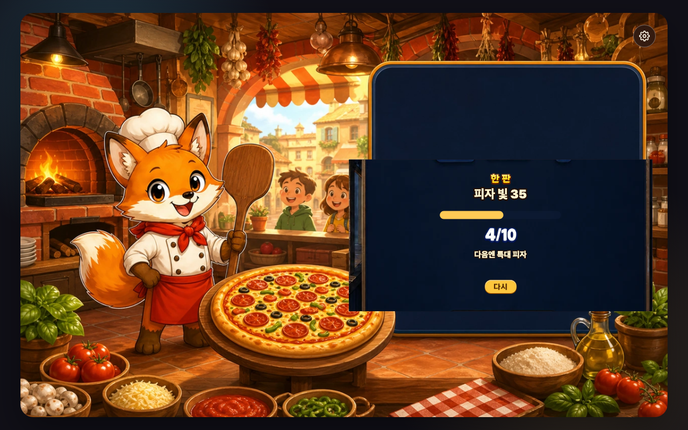

- 학생이 보는 것: 완성 장면과 결과 이름, 정답 수, 다음 목표, 다시 버튼을 봅니다.
- 판단하거나 누르는 것: 현재 결과와 다음 목표를 비교하고 다시 도전할지 결정합니다.
- 화면에서 확인되는 수학 관계: 한 판의 정답과 피자 빛 변화가 하나의 결과 단계로 정리됩니다.
- 다음 상태로 넘어가는 이유: 다시를 누르면 새 문제 순서와 새 보상 흐름으로 시작합니다.

#### 결과 단계 · half · `engine-flow-empty-reward-fixture-08a-result-half.png`

- 학생이 보는 것: 완성 장면과 결과 이름, 정답 수, 다음 목표, 다시 버튼을 봅니다.
- 판단하거나 누르는 것: 현재 결과와 다음 목표를 비교하고 다시 도전할지 결정합니다.
- 화면에서 확인되는 수학 관계: 한 판의 정답과 피자 빛 변화가 하나의 결과 단계로 정리됩니다.
- 다음 상태로 넘어가는 이유: 다시를 누르면 새 문제 순서와 새 보상 흐름으로 시작합니다.

#### 결과 단계 · whole · `engine-flow-empty-reward-fixture-08a-result-whole.png`

- 학생이 보는 것: 완성 장면과 결과 이름, 정답 수, 다음 목표, 다시 버튼을 봅니다.
- 판단하거나 누르는 것: 현재 결과와 다음 목표를 비교하고 다시 도전할지 결정합니다.
- 화면에서 확인되는 수학 관계: 한 판의 정답과 피자 빛 변화가 하나의 결과 단계로 정리됩니다.
- 다음 상태로 넘어가는 이유: 다시를 누르면 새 문제 순서와 새 보상 흐름으로 시작합니다.

#### 결과 단계 · jumbo · `engine-flow-empty-reward-fixture-08a-result-jumbo.png`

- 학생이 보는 것: 완성 장면과 결과 이름, 정답 수, 다음 목표, 다시 버튼을 봅니다.
- 판단하거나 누르는 것: 현재 결과와 다음 목표를 비교하고 다시 도전할지 결정합니다.
- 화면에서 확인되는 수학 관계: 한 판의 정답과 피자 빛 변화가 하나의 결과 단계로 정리됩니다.
- 다음 상태로 넘어가는 이유: 다시를 누르면 새 문제 순서와 새 보상 흐름으로 시작합니다.

#### 결과 단계 · shopstar · `engine-flow-empty-reward-fixture-08a-result-shopstar.png`

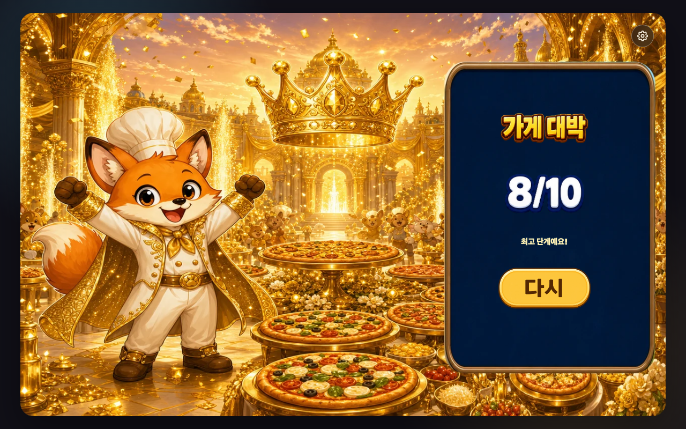

- 학생이 보는 것: 완성 장면과 결과 이름, 정답 수, 다음 목표, 다시 버튼을 봅니다.
- 판단하거나 누르는 것: 현재 결과와 다음 목표를 비교하고 다시 도전할지 결정합니다.
- 화면에서 확인되는 수학 관계: 한 판의 정답과 피자 빛 변화가 하나의 결과 단계로 정리됩니다.
- 다음 상태로 넘어가는 이유: 다시를 누르면 새 문제 순서와 새 보상 흐름으로 시작합니다.

#### 결과 단계 · legend · `engine-flow-empty-reward-fixture-08a-result-legend.png`

- 학생이 보는 것: 완성 장면과 결과 이름, 정답 수, 다음 목표, 다시 버튼을 봅니다.
- 판단하거나 누르는 것: 현재 결과와 다음 목표를 비교하고 다시 도전할지 결정합니다.
- 화면에서 확인되는 수학 관계: 한 판의 정답과 피자 빛 변화가 하나의 결과 단계로 정리됩니다.
- 다음 상태로 넘어가는 이유: 다시를 누르면 새 문제 순서와 새 보상 흐름으로 시작합니다.

<!-- REPORT-EVIDENCE-ALL:END -->
