# 매스몬 음료 제조 주문 구현 보고서

<!-- CURRENT-PUBLIC-RUNTIME:START -->

## 현재 공개 실행본

- 보고서 기준: `eduitit-current-public-report-v1`
- 공개 입력 커밋: `59b0ce7855228b1b28e84a424bf8ca0f678d56b8`
- 입력 커밋 시각: `2026-09-28T23:22:34+09:00`
- 제작 보고서 원본 SHA-256: `8426b8fd79e5b5cb9c2e88d3f17dd682f5aceff3ca200f6be0a71d0a1f05dc46`
- 실제 실행 진입점: `3-2-5-2-mathmon-drink-order/index.html`
- 실행 진입점 SHA-256: `a5c55678217c6320ae5e523b8f4455a32aa9768cf825105da741a17d453cf203`
- Pages 파일 집합 SHA-256: `a5013ea3861bd432cd1152cd6a309af5ec7bb327f69c2681bbebb9774d83ceaa` (140개)
- 상세 화면 증거: 현재 실행 진입점과 일치
- 공개 페이지: https://kakio426.github.io/eduitit-math-3-2/3-2-5-2-mathmon-drink-order/
- 공개 보고서: https://github.com/kakio426/eduitit-math-3-2/blob/main/3-2-5-2-mathmon-drink-order/REPORT.md

<!-- CURRENT-PUBLIC-RUNTIME:END -->

## 2026-09-28 현재 실행본

- 차시: 3학년 2학기 5단원 2차시
- 게임: [공개 실행](https://kakio426.github.io/eduitit-math-3-2/3-2-5-2-mathmon-drink-order/)
- 현재 검수판: `review/unit5/` · 실행 기록 `2026-09-28T14-08-24-568Z`
- 이 보고서의 현재 화면은 검수 HTML에 실린 원본 PNG와 바이트 단위로 같습니다. 사람의 확인 체크·기존 메모를 자동 완료하거나 삭제하지 않았습니다.
- 이미지 검수표는 20장(문제 14장 + 결과 6장)입니다. 그림은 맥락을 돕고 정답은 구조화 데이터와 HTML 표시가 결정합니다.
- 과거 전체 QA 결과는 아래 제작 이력으로만 보존합니다. 이번 공개를 위해 10,000문항 검사나 무관한 전체 QA를 다시 실행하지 않았습니다.

<!-- PORTABLE-RUNTIME:START -->
## 공통 컴포넌트와 배포 파일

- 내장 위치: `assets/runtime-vendor/`
- 공통 파일: `19개`
- 매니페스트: `assets/PORTABLE_RUNTIME_MANIFEST.json` · SHA-256 `0f4fe767ca10808a6a16e191c7b4f2ab63d15531a6cb5c51e8a58653e0f50e3e`
- 다시 버튼: 공용 `_shared/result-actions/retry-button-v2-generated.webp`의 동일 바이트 사본입니다. 차시별 표시 배치는 차시 설정에서 관리합니다.
<!-- PORTABLE-RUNTIME:END -->

## 학습 구성과 실행 흐름

기준 용기로 들이를 어림하고 직접 잰 값과 비교합니다. L·mL 덧셈과 뺄셈에서 받아올림·받아내림 과정을 구분합니다.

- 교육 근거: 기존 5단원 지도서의 4~5차시 기준 어림·직접 측정 비교·L/mL 계산를 유지합니다.
- 흐름: 첫 화면 → 설명 → 문제 10개(문항별 단계) → 중앙 보상 모달 → 최종 결과
- 보상·정답·문제 수는 이번 결과 버튼 수정에서 변경하지 않았습니다.

| 문제 | 학습 판단 |
| --- | --- |
| 1 | 기준 용기와 비교해 들이 어림 |
| 2 | 기준 용기와 비교해 들이 어림 |
| 3 | 어림값과 직접 잰 값 비교 |
| 4 | 어림값과 직접 잰 값 비교 |
| 5 | 들이의 덧셈 |
| 6 | 들이의 덧셈 |
| 7 | 받아올림이 있는 들이의 덧셈 |
| 8 | 들이의 뺄셈 |
| 9 | 들이의 뺄셈 |
| 10 | 받아내림이 있는 들이의 뺄셈 |

## 최종 결과 전체

점수는 내부 보상 누적값이고 결과 등급을 고르는 조건입니다. 학생 화면에는 단계 이름·정답 수·다음 목표·다시 버튼을 표시합니다.

| 단계 | 누적값 조건 | 바로 맞힌 문제 조건 |
| --- | --- | --- |
| 작은 컵 주문 | 0 이상 | 0개 이상 |
| 맛있는 주문 | 15 이상 | 2개 이상 |
| 음료 쟁반 주문 | 35 이상 | 4개 이상 |
| 인기 가게 주문 | 55 이상 | 6개 이상 |
| 황금 축제 주문 | 78 이상 | 8개 이상 |
| 무지개 음료 주문 | 100 이상 | 1개 이상 + 특별 보상 |

## 현재 변경 검증과 사람 확인

- 검수판 수집: 각 차시 1~10번과 중간 풀이 단계, 최종 결과 6등급을 실제 실행 화면에서 모았습니다. 전체 검수판 36개 카드·최종 결과 12개를 유지합니다.
- 문제 그림의 교육적 타당성에 대한 사람 확인과 자동 정답/화면 검사는 구분합니다. 화면 수집을 사람의 승인으로 표시하지 않습니다.
- 현재 화면 기록: `screenshots/human-review-evidence.json` (원본 검수판 경로·SHA-256·자동 표시 검사 포함). 기존 full-flow 영수증은 역사 기록이며 새 해시로 덮어 봉인하지 않습니다.

<!-- REPORT-EVIDENCE-ALL:START -->

## 최신 검수표 원본 스크린샷

- 실행본 SHA-256: `a5c55678217c6320ae5e523b8f4455a32aa9768cf825105da741a17d453cf203`
- 검수표 실행 기록: `2026-09-28T14-08-24-568Z`
- 화면: `1280×800 · DPR 1`
- 원본 이미지: `20장` · 최종 결과 `6등급 전부`
- 수집 범위: 문제 대기/중간 단계와 결과 화면. 오답·보상 전체의 신규 전수 QA를 의미하지 않습니다.

### 문제 1

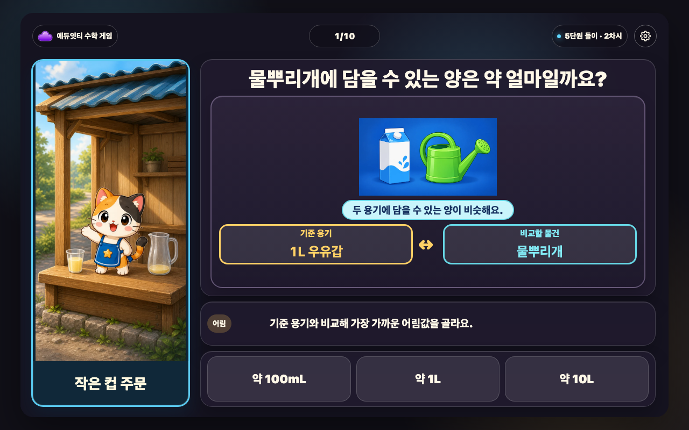

- 학생이 보는 것: 물뿌리개에 담을 수 있는 양은 약 얼마일까요? 기준 용기와 비교해 가장 가까운 어림값을 골라요.
- 판단하거나 누르는 것: 조건을 읽고 해당 단계의 보기 또는 조작을 선택합니다.
- 화면에서 확인되는 수학 관계: 문항 유형: 기준 용기와 비교해 들이 어림 — 표시한 조건과 HTML 보기로 판단합니다.
- 다음 상태로 넘어가는 이유: 정답 확인 후 남은 단계 또는 보상으로 이동합니다.

### 문제 2

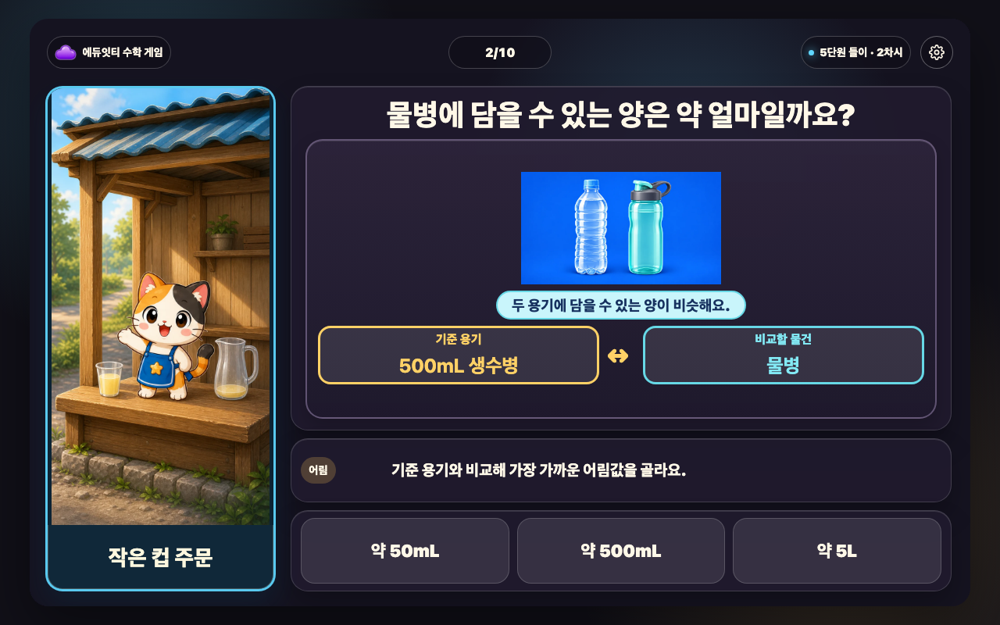

- 학생이 보는 것: 물병에 담을 수 있는 양은 약 얼마일까요? 기준 용기와 비교해 가장 가까운 어림값을 골라요.
- 판단하거나 누르는 것: 조건을 읽고 해당 단계의 보기 또는 조작을 선택합니다.
- 화면에서 확인되는 수학 관계: 문항 유형: 기준 용기와 비교해 들이 어림 — 표시한 조건과 HTML 보기로 판단합니다.
- 다음 상태로 넘어가는 이유: 정답 확인 후 남은 단계 또는 보상으로 이동합니다.

### 문제 3

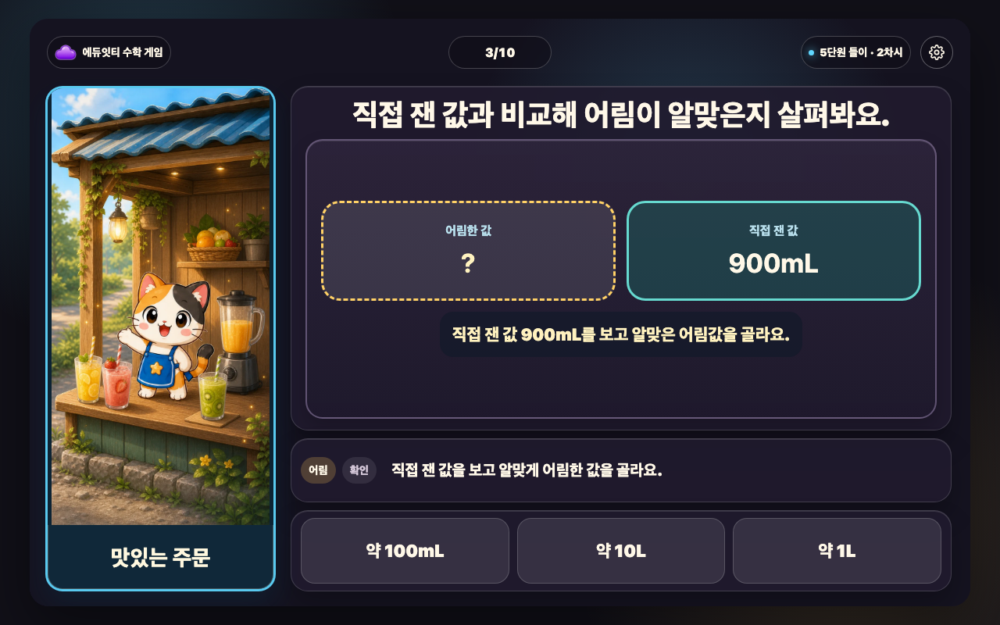

- 학생이 보는 것: 직접 잰 값과 비교해 어림이 알맞은지 살펴봐요. 직접 잰 값을 보고 알맞게 어림한 값을 골라요.
- 판단하거나 누르는 것: 조건을 읽고 해당 단계의 보기 또는 조작을 선택합니다.
- 화면에서 확인되는 수학 관계: 문항 유형: 어림값과 직접 잰 값 비교 — 표시한 조건과 HTML 보기로 판단합니다.
- 다음 상태로 넘어가는 이유: 정답 확인 후 남은 단계 또는 보상으로 이동합니다.

### 문제 3 · 2단계

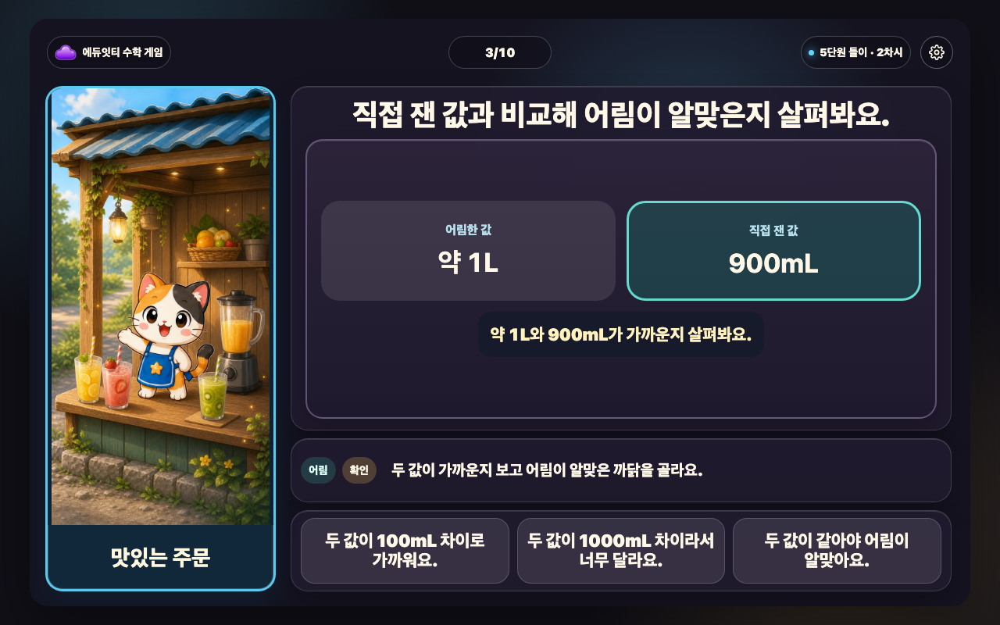

- 학생이 보는 것: 직접 잰 값과 비교해 어림이 알맞은지 살펴봐요. 두 값이 가까운지 보고 어림이 알맞은 까닭을 골라요.
- 판단하거나 누르는 것: 조건을 읽고 해당 단계의 보기 또는 조작을 선택합니다.
- 화면에서 확인되는 수학 관계: 문항 유형: 어림값과 직접 잰 값 비교 — 표시한 조건과 HTML 보기로 판단합니다.
- 다음 상태로 넘어가는 이유: 정답 확인 후 남은 단계 또는 보상으로 이동합니다.

### 문제 4

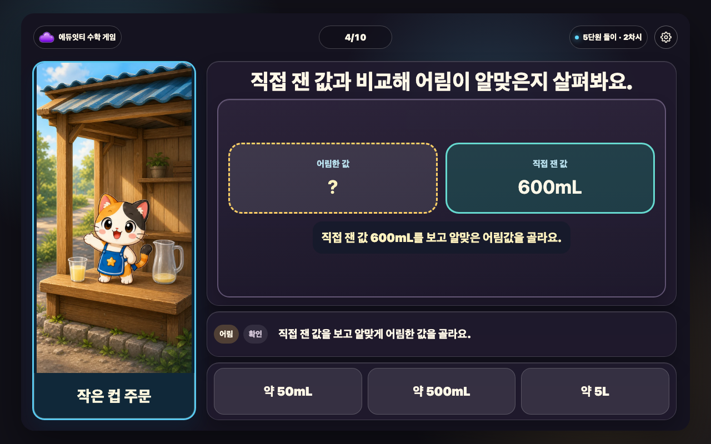

- 학생이 보는 것: 직접 잰 값과 비교해 어림이 알맞은지 살펴봐요. 직접 잰 값을 보고 알맞게 어림한 값을 골라요.
- 판단하거나 누르는 것: 조건을 읽고 해당 단계의 보기 또는 조작을 선택합니다.
- 화면에서 확인되는 수학 관계: 문항 유형: 어림값과 직접 잰 값 비교 — 표시한 조건과 HTML 보기로 판단합니다.
- 다음 상태로 넘어가는 이유: 정답 확인 후 남은 단계 또는 보상으로 이동합니다.

### 문제 4 · 2단계

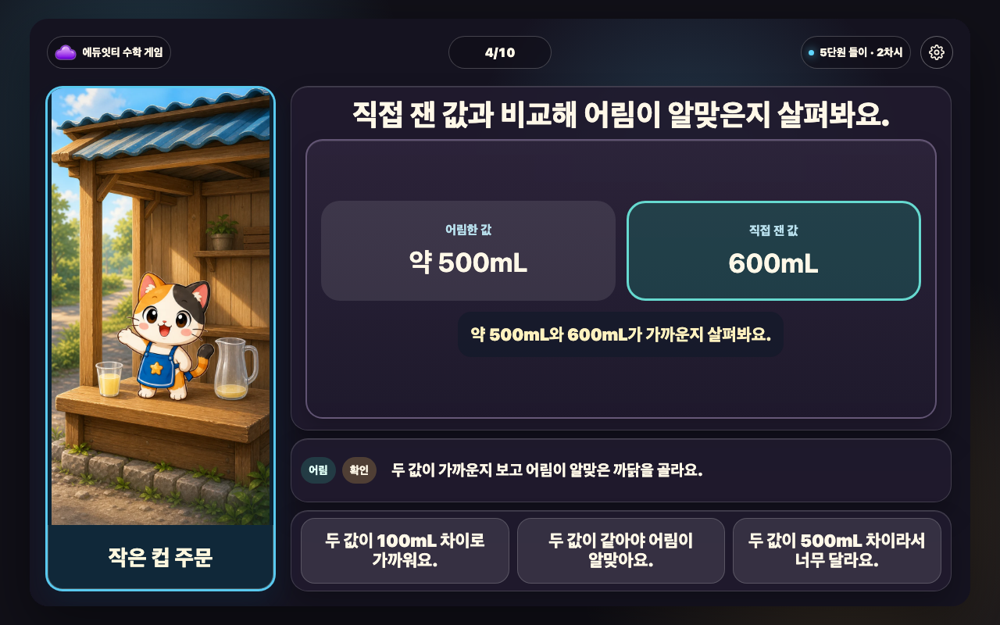

- 학생이 보는 것: 직접 잰 값과 비교해 어림이 알맞은지 살펴봐요. 두 값이 가까운지 보고 어림이 알맞은 까닭을 골라요.
- 판단하거나 누르는 것: 조건을 읽고 해당 단계의 보기 또는 조작을 선택합니다.
- 화면에서 확인되는 수학 관계: 문항 유형: 어림값과 직접 잰 값 비교 — 표시한 조건과 HTML 보기로 판단합니다.
- 다음 상태로 넘어가는 이유: 정답 확인 후 남은 단계 또는 보상으로 이동합니다.

### 문제 5


- 학생이 보는 것: 1L 300mL + 3L 400mL L끼리, mL끼리 계산해요.
- 판단하거나 누르는 것: 조건을 읽고 해당 단계의 보기 또는 조작을 선택합니다.
- 화면에서 확인되는 수학 관계: 문항 유형: 들이의 덧셈 — 표시한 조건과 HTML 보기로 판단합니다.
- 다음 상태로 넘어가는 이유: 정답 확인 후 남은 단계 또는 보상으로 이동합니다.

### 문제 6

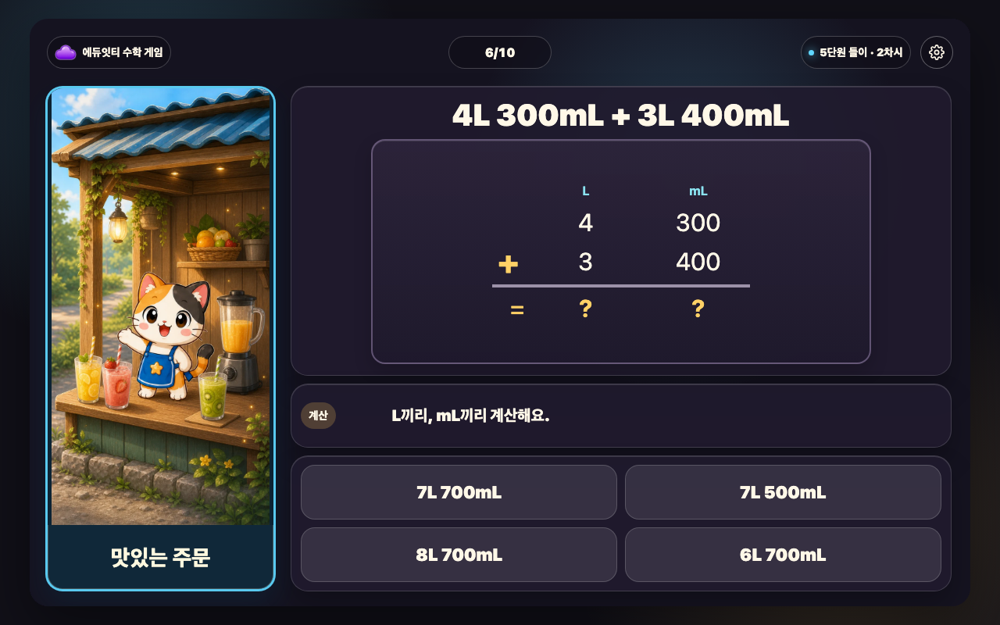

- 학생이 보는 것: 4L 300mL + 3L 400mL L끼리, mL끼리 계산해요.
- 판단하거나 누르는 것: 조건을 읽고 해당 단계의 보기 또는 조작을 선택합니다.
- 화면에서 확인되는 수학 관계: 문항 유형: 들이의 덧셈 — 표시한 조건과 HTML 보기로 판단합니다.
- 다음 상태로 넘어가는 이유: 정답 확인 후 남은 단계 또는 보상으로 이동합니다.

### 문제 7

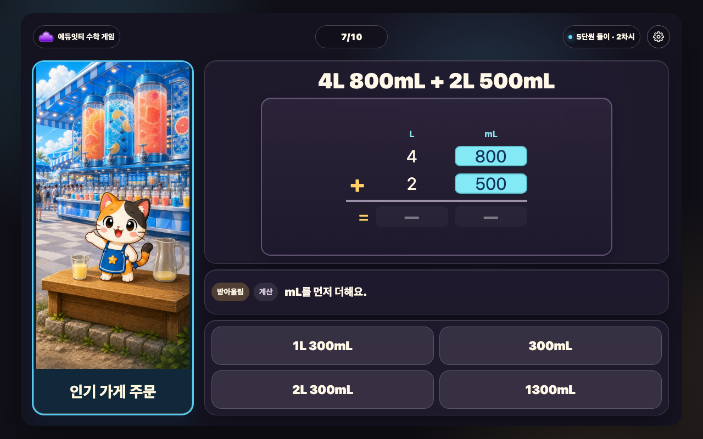

- 학생이 보는 것: 4L 800mL + 2L 500mL mL를 먼저 더해요.
- 판단하거나 누르는 것: 조건을 읽고 해당 단계의 보기 또는 조작을 선택합니다.
- 화면에서 확인되는 수학 관계: 문항 유형: 받아올림이 있는 들이의 덧셈 — 표시한 조건과 HTML 보기로 판단합니다.
- 다음 상태로 넘어가는 이유: 정답 확인 후 남은 단계 또는 보상으로 이동합니다.

### 문제 7 · 2단계


- 학생이 보는 것: 4L 800mL + 2L 500mL 받아올림한 1L를 더해 L끼리 계산해요.
- 판단하거나 누르는 것: 조건을 읽고 해당 단계의 보기 또는 조작을 선택합니다.
- 화면에서 확인되는 수학 관계: 문항 유형: 받아올림이 있는 들이의 덧셈 — 표시한 조건과 HTML 보기로 판단합니다.
- 다음 상태로 넘어가는 이유: 정답 확인 후 남은 단계 또는 보상으로 이동합니다.

### 문제 8

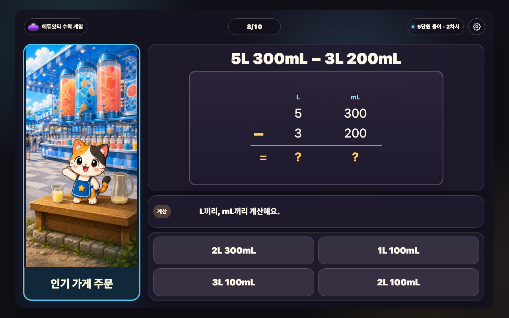

- 학생이 보는 것: 5L 300mL − 3L 200mL L끼리, mL끼리 계산해요.
- 판단하거나 누르는 것: 조건을 읽고 해당 단계의 보기 또는 조작을 선택합니다.
- 화면에서 확인되는 수학 관계: 문항 유형: 들이의 뺄셈 — 표시한 조건과 HTML 보기로 판단합니다.
- 다음 상태로 넘어가는 이유: 정답 확인 후 남은 단계 또는 보상으로 이동합니다.

### 문제 9

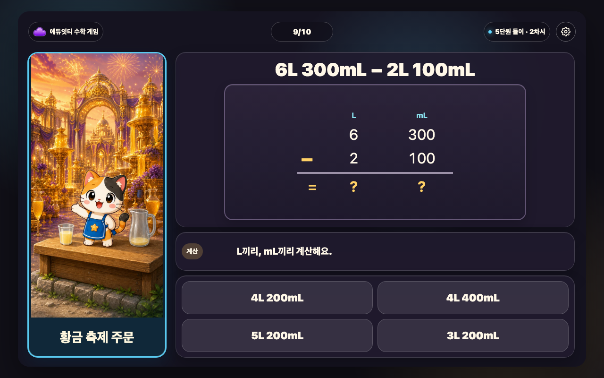

- 학생이 보는 것: 6L 300mL − 2L 100mL L끼리, mL끼리 계산해요.
- 판단하거나 누르는 것: 조건을 읽고 해당 단계의 보기 또는 조작을 선택합니다.
- 화면에서 확인되는 수학 관계: 문항 유형: 들이의 뺄셈 — 표시한 조건과 HTML 보기로 판단합니다.
- 다음 상태로 넘어가는 이유: 정답 확인 후 남은 단계 또는 보상으로 이동합니다.

### 문제 10

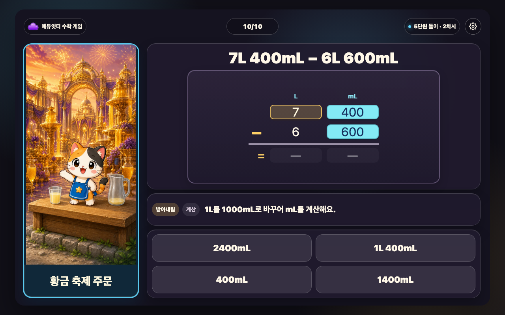

- 학생이 보는 것: 7L 400mL − 6L 600mL 1L를 1000mL로 바꾸어 mL를 계산해요.
- 판단하거나 누르는 것: 조건을 읽고 해당 단계의 보기 또는 조작을 선택합니다.
- 화면에서 확인되는 수학 관계: 문항 유형: 받아내림이 있는 들이의 뺄셈 — 표시한 조건과 HTML 보기로 판단합니다.
- 다음 상태로 넘어가는 이유: 정답 확인 후 남은 단계 또는 보상으로 이동합니다.

### 문제 10 · 2단계

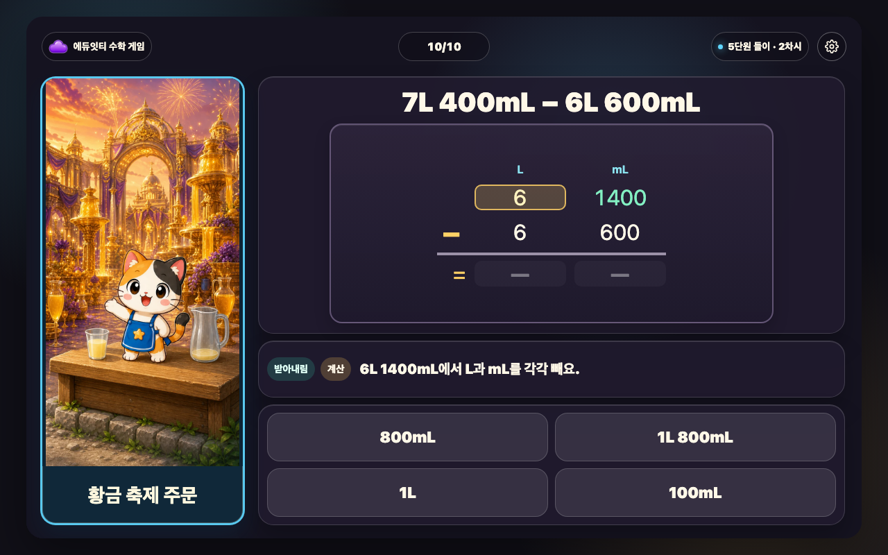

- 학생이 보는 것: 7L 400mL − 6L 600mL 6L 1400mL에서 L과 mL를 각각 빼요.
- 판단하거나 누르는 것: 조건을 읽고 해당 단계의 보기 또는 조작을 선택합니다.
- 화면에서 확인되는 수학 관계: 문항 유형: 받아내림이 있는 들이의 뺄셈 — 표시한 조건과 HTML 보기로 판단합니다.
- 다음 상태로 넘어가는 이유: 정답 확인 후 남은 단계 또는 보상으로 이동합니다.

### 최종 결과 · 작은 컵 주문

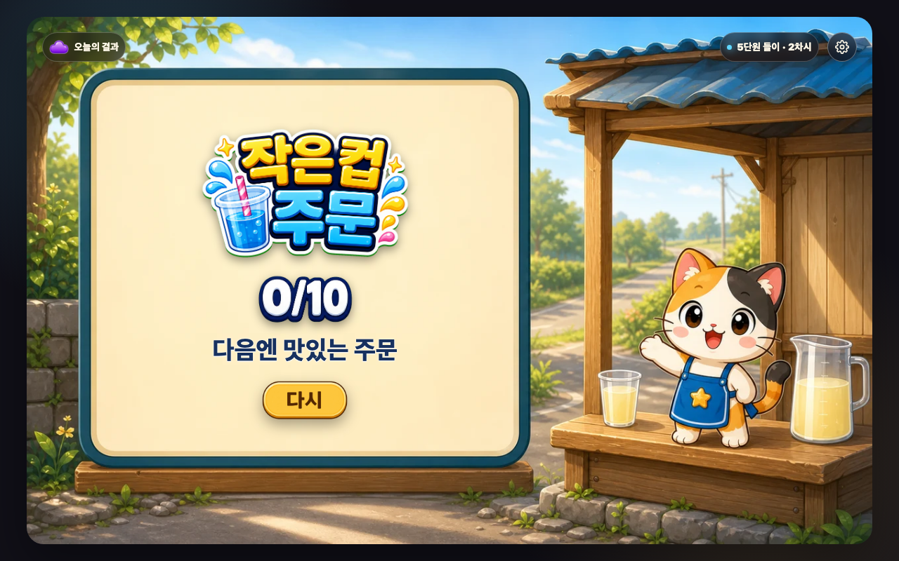

- 학생이 보는 것: 최종 결과 · 작은 컵 주문 단계 이름, 정답 수, 다음 목표와 다시 버튼을 봅니다.
- 판단하거나 누르는 것: 결과를 확인한 뒤 공용 다시 버튼으로 새 판을 시작합니다.
- 화면에서 확인되는 수학 관계: 정답 수와 보상에 따른 최종 단계이며, 새 수학 문항은 아닙니다.
- 다음 상태로 넘어가는 이유: 다시를 누르면 1번 문제·정답 수 0·진행값 0으로 시작합니다.

### 최종 결과 · 맛있는 주문

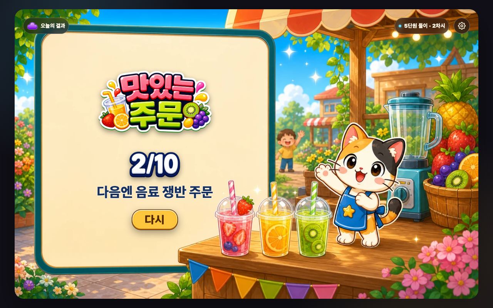

- 학생이 보는 것: 최종 결과 · 맛있는 주문 단계 이름, 정답 수, 다음 목표와 다시 버튼을 봅니다.
- 판단하거나 누르는 것: 결과를 확인한 뒤 공용 다시 버튼으로 새 판을 시작합니다.
- 화면에서 확인되는 수학 관계: 정답 수와 보상에 따른 최종 단계이며, 새 수학 문항은 아닙니다.
- 다음 상태로 넘어가는 이유: 다시를 누르면 1번 문제·정답 수 0·진행값 0으로 시작합니다.

### 최종 결과 · 음료 쟁반 주문

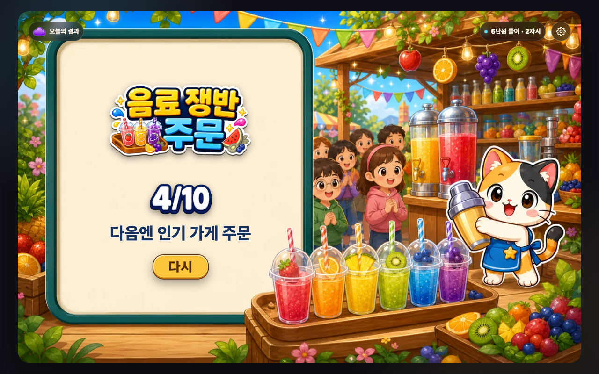

- 학생이 보는 것: 최종 결과 · 음료 쟁반 주문 단계 이름, 정답 수, 다음 목표와 다시 버튼을 봅니다.
- 판단하거나 누르는 것: 결과를 확인한 뒤 공용 다시 버튼으로 새 판을 시작합니다.
- 화면에서 확인되는 수학 관계: 정답 수와 보상에 따른 최종 단계이며, 새 수학 문항은 아닙니다.
- 다음 상태로 넘어가는 이유: 다시를 누르면 1번 문제·정답 수 0·진행값 0으로 시작합니다.

### 최종 결과 · 인기 가게 주문

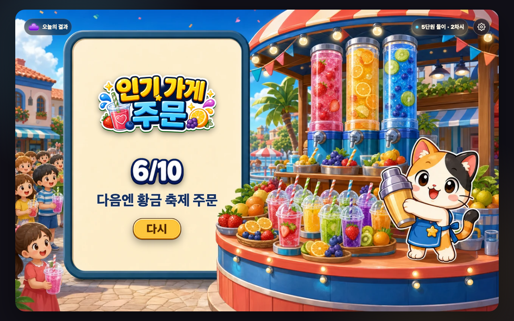

- 학생이 보는 것: 최종 결과 · 인기 가게 주문 단계 이름, 정답 수, 다음 목표와 다시 버튼을 봅니다.
- 판단하거나 누르는 것: 결과를 확인한 뒤 공용 다시 버튼으로 새 판을 시작합니다.
- 화면에서 확인되는 수학 관계: 정답 수와 보상에 따른 최종 단계이며, 새 수학 문항은 아닙니다.
- 다음 상태로 넘어가는 이유: 다시를 누르면 1번 문제·정답 수 0·진행값 0으로 시작합니다.

### 최종 결과 · 황금 축제 주문

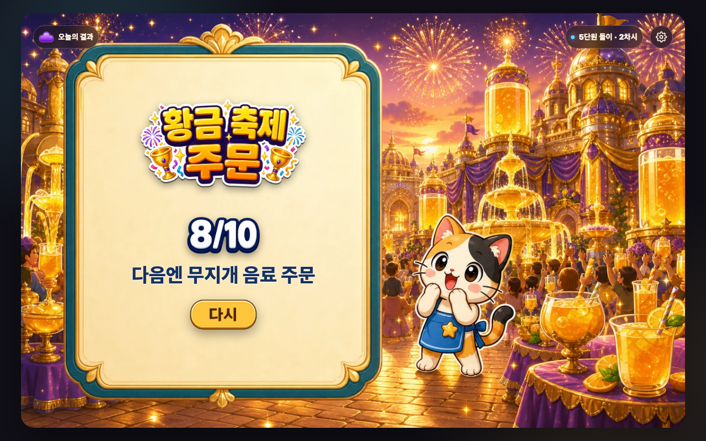

- 학생이 보는 것: 최종 결과 · 황금 축제 주문 단계 이름, 정답 수, 다음 목표와 다시 버튼을 봅니다.
- 판단하거나 누르는 것: 결과를 확인한 뒤 공용 다시 버튼으로 새 판을 시작합니다.
- 화면에서 확인되는 수학 관계: 정답 수와 보상에 따른 최종 단계이며, 새 수학 문항은 아닙니다.
- 다음 상태로 넘어가는 이유: 다시를 누르면 1번 문제·정답 수 0·진행값 0으로 시작합니다.

### 최종 결과 · 무지개 음료 주문

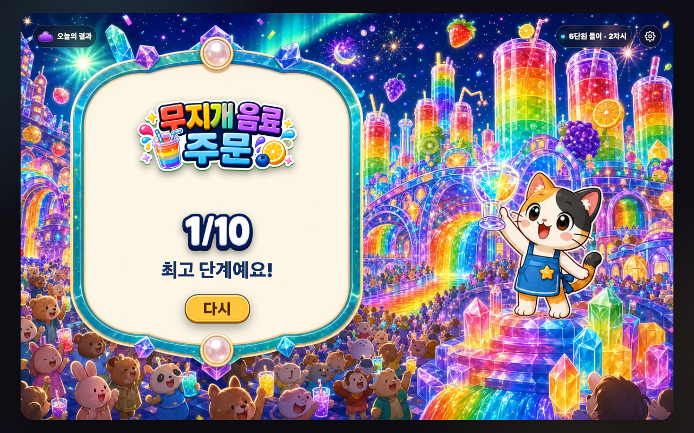

- 학생이 보는 것: 최종 결과 · 무지개 음료 주문 단계 이름, 정답 수, 다음 목표와 다시 버튼을 봅니다.
- 판단하거나 누르는 것: 결과를 확인한 뒤 공용 다시 버튼으로 새 판을 시작합니다.
- 화면에서 확인되는 수학 관계: 정답 수와 보상에 따른 최종 단계이며, 새 수학 문항은 아닙니다.
- 다음 상태로 넘어가는 이유: 다시를 누르면 1번 문제·정답 수 0·진행값 0으로 시작합니다.

<!-- REPORT-EVIDENCE-ALL:END -->

<details>
<summary>이전 제작·검사 이력 — 당시 실행본의 기록이며 현재 QA 판정으로 사용하지 않습니다.</summary>

## 2026-09-20 기준 어림 비교 이미지 일관화

- `capacityBenchmarkEstimate` 1~4번을 모두 생성 비교 이미지로 연결했습니다. 각 문항은 `우유갑–물뿌리개`, `500mL 생수병–물병`, `200mL 컵–종이컵`, `2L 생수병–냄비`를 보여 줍니다.
- 새 실행 자산은 `estimate-water-bottle-v1-generated.webp`, `estimate-paper-cup-v1-generated.webp`, `estimate-pot-bottle-v1-generated.webp`이며 모두 `1672×941` 원본/실행 비율로 맞췄습니다.
- 이미지에는 비교 맥락만 담고 수치·정답 판정은 `capacityBenchmarkEstimate` 구조화 데이터가 계속 담당합니다.
- 사용자 제보 화면에서 2번 문항의 생수병–물병 이미지 로드와 관계 문장·기준 카드·선택지 배치를 확인했습니다.

## 2026-09-19 어림값 확인 문항 재설계

- 기존 3~4번은 `어림한 값`과 `직접 잰 값`의 차이를 계산하게 했지만, 왜 그 값으로 어림했는지는 묻지 않았습니다.
- 3번은 `직접 잰 값 900mL`를 먼저 보여 주고 `약 1L`를 고르게 한 뒤, `두 값이 100mL 차이로 가까워요.`라는 근거를 고르게 합니다.
- 4번은 `직접 잰 값 600mL`와 `약 500mL` 사례로 같은 판단을 확인합니다. 어림값 카드는 첫 단계에서는 `?`로 두었다가, 어림값을 고른 뒤 공개합니다.
- 최종 확인 문장은 `900mL를 약 1L로 어림했어요. 두 값이 100mL 차이로 가까워요.`처럼 어림값·실제값·판단 근거를 한 흐름으로 연결합니다.
- 모델 QA `1,000회·10,000문제`와 사용자 신고 viewport `1074×987`, `DPR 2` 차시 브라우저 QA를 통과했습니다. Unit 5 통합 하네스는 수정 대상과 무관한 3-2-5-1 직접붓기 오답 시각화 회귀에서 중단되어, 전체 통합 PASS로 기록하지 않습니다.

## 2026-09-19 문항 이해도 재설계

- 기존 1번 어림 문항은 `500mL 생수병 ↔ 물병`처럼 카드 이름과 수치만 보여 주어, 비교의 뜻과 정답을 고르는 이유가 화면에서 드러나지 않았습니다.
- 현재 1번은 `1L 우유갑`과 `물뿌리개`의 비교 그림, `두 용기에 담을 수 있는 양이 비슷해요.`라는 관계 문장, `물뿌리개에 담을 수 있는 양은 약 얼마일까요?`라는 질문, 세 가지 어림값 선택지를 한 흐름으로 보여 줍니다.
- 새 자산은 `estimate-watering-can-milk-carton-v1-source.png`에서 생성하고 `estimate-watering-can-milk-carton-v1-generated.webp`로 변환했습니다. 그림은 비교 맥락을 돕고, 정답은 구조화된 문제 데이터가 판정합니다.
- `serial` 순서를 바로잡아 첫 문항이 의도한 비교 사례부터 시작하도록 했습니다. 사용자 신고 viewport `1074×987`, `DPR 2`에서 그림·관계 문장·질문·선택지와 정답 확인 문장을 브라우저로 확인했습니다.
- 당시 변경은 1번의 이해도 보강이었습니다. 후속 문항 재설계 이후에도 2번 어림 문항, 3~4번의 실제 측정 조작 연결, 5~10번의 음료 주문 맥락과 단위 관계는 별도 보강이 필요하므로 차시 전체 성취기준 `PASS`로 기록하지 않습니다.

기존 `zero-factory-animal-pack`의 냥냥몬 결과 6단계와 `result-tiers-v5-contact-sheet.png`는 그대로 유지했습니다.

진행 장면 증거는 `_shared/mathmon/diversity-reward-pack/lesson-scenes/3-2-5-2/play-progress-v1/source`, `_shared/mathmon/diversity-reward-pack/lesson-scenes/3-2-5-2/play-progress-v1/contact-sheets/play-drink-progress-v1-contact-sheet.png`, `_shared/mathmon/diversity-reward-pack/lesson-scenes/3-2-5-2/play-progress-v1/contact-sheets/play-drink-progress-v1-anchor-audit.png`입니다.

상단 조작은 `stage-top-controls-v2`를 쓰며, 배지 글자 `14px`, 문제 번호 `16px`를 실제 측정 기준으로 삼습니다.

## 2026-09-19 보상 모달 하네스 정합성 수정

- 보상 설정을 전체 단계 화면인 `stage-reveal`에서 공용 중앙 `modal-art`로 되돌렸습니다. 이전 설정이 잘못된 모드였기 때문에 `screen-reward`가 전체 화면으로 열렸습니다.
- 정답 확인 뒤에도 `screen-play`를 유지하고, `#rewardPop` 안의 `#rewardVisual`, `#modalRewardLabel`, `#modalRewardOpenButton`, `#modalRewardNextButton`만 사용합니다.
- 닫힌 상태는 `두근두근!`, 열린 상태는 `주문 점수 +N/-N/0`처럼 한 가지 변화만 보여 줍니다. 모달을 닫은 뒤에만 왼쪽 주문 진행 장면에 보상을 한 번 반영합니다.
- `unit3-modal-art-compact-v2` 카드 `430×480px`, 이미지 `250×250px`, `reward-single-consumption-v1` 재진입 계약을 차시 설정에 선언했습니다.

## 2026-09-01 교육과정 재설계

- 지도서 5단원 4~5차시의 기준 어림·직접 측정 비교·L와 mL 계산 흐름으로 문제 10개를 다시 구성했습니다.
- 받아내림에서는 빌린 `1 L`를 계산 중 `1000 mL`로 풀어 표시하도록 바로잡았습니다.
- 공용 Unit 5 모델·측정 작업대·단계 공개 보상을 적용하고 기존 주문 6단계 진행·결과 자산은 유지했습니다.
- 새 튜토리얼 그림은 맥락만 제공하며 수치 정답은 모델 데이터가 결정합니다.
- Humanizer QA에서 어림 결과를 `500mL 생수병을 기준으로 약 500mL로 어림했어요.`처럼 짧은 확인 문장으로 바꾸고, 받아올림·받아내림은 한 행동씩 읽히게 정리했습니다.
- 모델 10,000회에서 100,000문제를 검사했고, 전체 브라우저 QA는 6개 화면 프로필·163개 상태 캡처로 통과했습니다.

## 2026-08-09 보상 패널 효과·폭 회귀

- 일반 점수 상승은 `is-changing` 패널 플레어만 사용하고 Stage 임팩트는 쓰지 않으며, 표시 시간은 `640ms`입니다. 등급 상승은 `is-tier-up`·진행 장면 교체·Stage 폭 `32% 이상` 임팩트를 사용하고 `1560ms`(최소 읽기 시간 `1200ms`) 유지합니다.
- 왼쪽 진행 패널은 Stage 폭 `24.5%`(`23.4375~25.2%` 허용), 문제 작업 영역과 최소 간격 `1.5625%`로 데스크톱·태블릿에서 측정했습니다. 넘침·교차는 `0건`입니다.
- 현재 실행본에서 `qa-lesson-flow.mjs` 보상 fixture, `check-stage-ratio.mjs`, `check-lesson-contract.mjs`, 학생 보상 문구 브라우저 QA `176/176`을 통과했습니다.

## 2026-08-09 중간 보상 명칭 QA

- 보상 모달의 `이번 변화`·`가게 힘`을 `가게 인기 +N/-N/0`으로 통일했습니다.
- Chrome `1280×800`, `1024×768`에서 보상 8상태를 전수 확인했습니다. 텍스트 넘침·요소 교차·Stage 이탈은 모두 0건입니다.
- 중앙 보상은 `unit3-modal-art-compact-v2`로 고정했습니다: 카드 `430×480px(43:48)`, Stage 최대 폭 `82%`, 이미지 `250×250px`. reward-only 브라우저 하네스에서 닫힘·열림 실제 rect를 확인했습니다.

## 1. 구현 요약

3학년 2학기 5단원 2차시 `들이의 덧셈·뺄셈과 어림`을 단일 HTML 게임으로 구현했습니다. 학생은 10문제 동안 주문에 맞는 들이를 골라요. 정답을 고르면 값이 계산판에 먼저 들어가고, 마지막 단계에서는 완성값을 본 뒤 `주문 보기`를 눌러 보상으로 넘어갑니다.

## 2. 등록

- lesson id: `3-2-5-2`
- folder: `3-2-5-2-mathmon-drink-order`
- title: `매스몬 음료 제조 주문`
- learningGoal: 들이의 덧셈·뺄셈과 어림

## 3. 화면 흐름

```text
첫 화면 -> 설명 -> 문제 -> 보상 -> 결과
```

- 첫 화면: 생성형 배경, 생성형 제목 아트, HTML 목표 문장, 생성형 시작 버튼 아트
- 설명: 2쪽 생성 포스터
- 문제: 큰 문제, 현재 계산판, 한 줄 지시, 선택지만 기본 노출
- 보상: 주문 변화 하나만 표시
- 결과: 결과 단계 생성 이미지, 생성형 결과 타이틀, 생성형 `다시` 버튼 아트

## 4. 생성 이미지 자산

| 파일명 | 역할 |
| --- | --- |
| `cover-source.png` / `cover-generated.webp` | 글자 없는 첫 화면 배경 |
| `title-logo-chromakey.png` / `title-logo-generated.png` / `title-logo-generated.webp` | 생성형 제목 아트 |
| `../_shared/mathmon/cover-start-button/start-button-generated.webp` | 공용 시작 버튼 아트 |
| `reward-event-closed-v2-generated.webp` | 닫힌 보상 장면 |
| `reward-event-*-source.png` / `reward-event-*-generated.webp` | 공개 보상 6상태 개별 512×512 장면 |
| `reward-events-v3-contact-sheet.png` | 보상 7상태 컨택시트 |
| `result-order-*-source.png` / `result-order-*-generated.webp` | 결과 배경 |
| `result-title-*-source.png` / `result-title-*-generated.webp` | 결과 이름 타이틀 아트 |
| `result-retry-button-source.png` / `result-retry-button-generated.webp` | 생성형 다시 버튼 아트 |

## 5. 매스몬 기준

사용 팩은 `zero-factory-animal-pack`이고 기준 매스몬은 냥냥몬(`zfa-04-nyangnyangmon`)입니다. 차시 폴더에는 매스몬 원본을 복사하지 않고, 커버/보상/결과 장면 생성 단계에서 함께 넣는 방식으로 처리합니다.

## 6. 보상과 확률

정답의 숨은 기본 가산값은 0입니다. 정답 사건은 `64%/+6~+10`, `15%/-5~-2`, `12%/+14~+22`, `5%/+30`, `3.8%/0(누적 유지)`, `0.2%/100(특별)`이며, 오답은 문제당 최초 1회 `-6~-3`입니다.

| 결과 | 조건 |
| --- | --- |
| 작은 컵 주문 | 0 이상, 바로 맞힌 문제 0개 이상 |
| 맛있는 주문 | 30 이상, 바로 맞힌 문제 3개 이상 |
| 인기 가게 주문 | 70 이상, 바로 맞힌 문제 7개 이상 |
| 무지개 음료 주문 | 100 이상, 바로 맞힌 문제 1개 이상, 특별 보상 필요 |

## 7. Humanizer QA

학생 문구는 3학년이 소리 내어 읽고 바로 행동할 수 있는 말로 구성했습니다.

- 첫 화면 목표: `기준으로 어림하고 들이를 계산해요.`
- 어림 확인: `500mL 생수병을 기준으로 약 500mL로 어림했어요.`
- 계산 지시: `1000mL를 1L로 바꿔요.`, `1L를 1000mL로 바꿔요.`
- 완료 상태: 큰 확인 문장을 왼쪽에, `주문 단계 보기` 버튼을 오른쪽에 둡니다.

학생 화면에는 내부 작업실 이름이나 제작자용 말을 보이지 않게 합니다.

## 8. 텍스트 넘침·요소 겹침 QA

브라우저 QA에서 등록된 6개 화면 프로필과 163개 상태 캡처를 확인했습니다.

확인 대상:

- 첫 화면
- 설명 1
- 설명 2
- 문제 1단계
- 정답 확인 상태
- 오답 상태
- 보상
- 결과 단계별 화면

확인 결과: 텍스트 넘침 0건, 요소 겹침 0건, Stage 밖 이탈 0건입니다. 결과 화면은 `작은 컵 주문`, `맛있는 주문`, `인기 가게 주문`, `무지개 음료 주문` 4단계를 실제 문제 풀이 흐름으로 도달해 캡처했습니다.

## 9. 검증 명령

- `node scripts/check-rule-consistency.mjs`
- `node scripts/check-stage-ratio.mjs`
- `node scripts/qa-lesson5-drink-order-model.mjs --runs 10000`
- `node scripts/simulate-lesson5-drink-order.mjs --runs 10000`
- Browser QA: Chrome CDP 자동 캡처로 데스크톱과 태블릿 가로 화면 확인

실행 결과: 위 명령과 브라우저 QA 모두 통과했습니다.

## 10. 2026-07-12 이미지 설명·엔진 소스 리마스터

- 2쪽 설명을 생성 포스터로 교체했습니다. 1쪽은 `mL` 계산과 `1000mL = 1L`, 2쪽은 10문제·주문 보상·마지막 결과를 보여 줍니다.
- `_lessons/3-2-5-2-mathmon-drink-order/lesson.json`을 만들고 공통 엔진 빌드 대상으로 옮겼습니다.
- 공유 모델 경로를 빌더와 계약 검사기가 읽도록 `sourceFiles` 계약을 적용했습니다.
- 결과 상태 세트: 4장, 컨택시트 `result-states-contact-sheet.png`
- 매스몬 팩: `zero-factory-animal-pack` / `zfa-04-nyangnyangmon`
- `node scripts/qa-lesson5-drink-order-model.mjs --runs 10000` 통과 (`100,000`문제)
- `node scripts/qa-lesson-flow.mjs 3-2-5-2-mathmon-drink-order` 통과
- 데스크톱 `1280×800`, 태블릿 가로 `1024×768`에서 깨진 이미지·텍스트 넘침·요소 겹침·Stage 밖 이탈 `0건`

## 11. 2026-07-28 전체 점검과 수정

- 닫힌 주문 컵 1장과 `smallOrder`, `bigOrder`, `styleOrder`, `smallOnly`, `specialOrder`, `repair` 6상태 개별 512×512 장면으로 보상 화면을 교체했습니다.
- 결과는 `hybrid-generated-dynamic`으로 바꾸고 결과 제목, 가게 인기, 진행 막대, 바로 맞힌 수, 다음 목표, 다시 버튼을 왼쪽 한 축에 정렬했습니다.
- 결과 4상태를 `1280×800` PNG/WebP로 맞추고 데스크톱·태블릿에서 각각 모두 캡처했습니다.
- Humanizer QA에서 수학 판단이 아닌 `알 수 없어요` 선택지를 삭제했습니다. 주문 비교의 `/` 구분도 가운데점 `·`으로 바꿔 소리 내어 읽기 자연스럽게 했습니다.
- 이미지 생성은 Codex 내장 `imagegen`을 사용했습니다. 최종 프롬프트는 “냥냥몬 음료 가게, 글자 없는 3×2 정사각 패널, 작은 주문·큰 주문·달콤 주문·흘린 컵·무지개 주문·다시 만들기, 같은 카메라와 조명, UI·문자·숫자 없음”과 “같은 장면의 닫힌 주문 컵, 정사각, 문자 없음”입니다.
- 원본 묶음: `reward-events-v2-source.png`, 닫힌 원본: `reward-event-closed-v2-source.png`; 런타임은 상태별 `reward-event-*-generated.webp`이며 전수표는 `reward-events-v3-contact-sheet.png`입니다.
- `check-lesson-contract`, `check-lesson-visual-contract`, 100,000문항 모델 QA, 10,000회 보상 시뮬레이션, 두 viewport 전체 흐름 QA가 PASS입니다.

## 2026-07-31 최종 회귀

- 통합 보상 사건 `64% / 15% / 12% / 5% / 3.8% / 0.2%`, 오답 최초 1회 `-6~-3`을 고정 하네스로 검증했습니다. 빈 사건은 누적값을 유지합니다.
- `1280×800`, `1024×768`에서 긴 문제도 학습 그림이 문제 카드 안에 남고, 오답·각 계산 단계·마지막 확인·보상·결과까지 넘침·교차·누락 `0건`임을 확인했습니다.
- 완료 상태는 선택지만 접고 문제 그림·정답이 들어간 계산판·완성 문장·다음 행동을 그대로 보여 줍니다. `calculation-preserved-v1` 하네스가 대기↔완료 계산판 경계 오차 `1px` 이하와 완료 요소 교차 `0px`를 검사합니다.
- `sourceFiles`는 5단원 들이·무게용 공용 모델·뷰·스타일을 의도적으로 참조하며, 차시별 `workbench.type`과 전용 모델 QA로 문제 유형을 분리합니다.

## 2026-08-01 비교·보상 문구 회귀

- 주문량이 같은 경우 `같아요`가 실제 정답으로 생성됩니다. 전용 10,000회 모델 QA가 동률 정답 발생을 검사합니다.
- 보상은 닫힌 상태 `두근두근!`, 열린 상태 `이번 변화 +N` 또는 `이번 변화 0`만 보여 줍니다.

## 2026-08-01 모델·브라우저 최종 회귀

- 10,000회 실행, 100,000문항에서 `같아요` 정답 5,906건을 확인했습니다.
- 더하기 마지막 지시는 `다 더한 들이를 골라요.`, 빼기 첫 지시는 `1L를 1000mL로 바꿔요.`, 마지막 지시는 `다 뺀 뒤의 들이를 골라요.`로 한 화면 한 행동을 유지합니다.
- `L까지 더한/뺀`과 `1L 줄이고 1000mL 늘려요` 같은 교사용·두 행동 문구는 제거했고, 전용 모델 QA가 되돌아오지 않게 검사합니다.
- desktop `1280×800`, tablet landscape `1024×768` 전체 흐름의 넘침·교차·누락은 `0건`입니다.

## 2026-08-01 Kiro 8차 심층 회귀

- 왼쪽에 L·mL 세로 계산판을 추가했습니다. 대기에는 원래 두 수, 첫 정답 뒤에는 L 합과 mL 합, 단위 바꾸기 뒤에는 정규화한 값, 마지막에는 완성 들이가 차례로 누적됩니다. 빼기에서도 처음 들이를 지우지 않고 빌려 온 수를 위에 따로 표시합니다.
- 오답 문구는 `답보다 1L 많아요`처럼 정답 차이를 알려 주지 않고 `고른 수가 너무 커요/작아요. 계산판을 다시 봐요.`로 바꿨습니다.
- `primary-calculation-accumulates-v1` 하네스가 세 단계 누적값 `1→2→3`, 실색, 실제 정보, 넘침 `0건`을 검사합니다. 100,000회 실행·1,000,000문항에서 동률 정답 `59,465건`을 확인했습니다.

## 2026-08-01 최종 보상 선조정·왼쪽 진행 보상 v1

- 최종 결과를 먼저 `작은 컵 주문 → 맛있는 주문 → 음료 쟁반 주문 → 인기 가게 주문 → 황금 축제 주문 → 무지개 음료 주문` 6단계로 확정했습니다. 기준은 `0/0`, `15/2`, `35/4`, `55/6`, `78/8`, 특별 `100/1`입니다.
- 최종 결과 원본은 `result-order-*-v5-source.png`, 런타임은 `result-order-*-generated.webp`, 자산 컨택시트는 `result-tiers-v5-contact-sheet.png`, 실제 브라우저 컨택시트는 `result-tiers-v5-browser-contact-sheet.png`입니다.
- 여섯 결과 장면은 컵·음료 수·가게 규모·손님 수·조명·색 계열이 단계마다 커지며, 상위 둘은 금빛 궁전과 밤의 무지개 수정 도시로 구분됩니다.
- 결과판 픽셀 중심은 단계별 `423.5`, `387`, `369.5`, `375.5`, `389`, `383.5px`로 검출했고, 선언 축과 최대 오차 `3px` 이하로 연결했습니다.
- 최종 결과 승인 뒤에만 문제 왼쪽 전용 진행 장면 6장을 만들었습니다. 원본은 `_shared/mathmon/diversity-reward-pack/lesson-scenes/3-2-5-2/play-progress-v1/source/`, 런타임은 `play-drink-v1-*-generated.webp`, 컨택시트는 `_shared/mathmon/diversity-reward-pack/lesson-scenes/3-2-5-2/play-progress-v1/contact-sheets/play-drink-progress-v1-contact-sheet.png`입니다.
- 진행 이미지는 `768×1536`, `object-fit: contain`이며 최종 결과를 자르거나 재사용하지 않았습니다. 냥냥몬의 같은 카메라·중심·크기·발 기준선과 전신 잘림 `0건`을 유지합니다.
- 현재 원본의 냥냥몬 중심·발 기준선·전신 높이는 `_shared/mathmon/diversity-reward-pack/lesson-scenes/3-2-5-2/play-progress-v1/contact-sheets/play-drink-progress-v1-anchor-audit.png`에서 6장 전수 확인합니다.
- 패널은 Stage 기준 `left 1.65%`, `top 11%`, `width 24.5%`, `height 84%`입니다. 전환은 모달 닫힘 뒤 `320ms`를 두고 등급 상승 때만 Stage 폭 `35%` 효과와 새 단계 이미지를 `1560ms` 보여 준 뒤 다음 문제로 이동합니다.
- Humanizer 학생 문구 QA에서 패널 문구를 `지금의 주문`, 단계 이름, `가게 인기` 한 줄로 유지했습니다.

## 결과판 내부 결속 v2 (2026-08-03)

- `qa.resultPanelContainmentAudit.standard`를 `result-panel-containment-v2`로 선언했습니다. 결과 배경, 결과 패널, 단계명·정답 수·다시 버튼은 각각 선택 가능한 raster/WebP 레이어이며, 진행값·진행 막대·다음 목표만 동적 UI입니다.
- 안전 여백 `24px` 안에서 패널 네 변, 실제 보이는 rect, hitbox, 요소 간 교차, 공통 중심축 `1px`, 다시 버튼 아트↔hitbox 네 변 `1px`을 검사합니다. 숨긴 다음 목표는 `display:none`과 `0×0` rect를 확인합니다.
- `1280×800`, `1024×768`, `1280×720 DPR2`, `994×632`, `1082×987 DPR2`에서 결과 6단계를 전수 재실행했고, 넘침·요소 겹침·Stage 잘림은 `0건`입니다. 런타임 commit SHA와 lesson JSON SHA도 일치했습니다.

## 2026-08-02 현재 화면 증거

- 시작·설명·문제·보상·결과 상태와 화면 크기별 현재 캡처: `screenshots/report-flow-desktop-contact-sheet.png`, `screenshots/report-flow-tablet-landscape-contact-sheet.png`, `screenshots/report-flow-codex-in-app-contact-sheet.png`, `screenshots/report-flow-user-visibility-contact-sheet.png`, `screenshots/report-flow-user-reported-missing-left-progress-contact-sheet.png`, `screenshots/report-flow-empty-reward-fixture-contact-sheet.png`
- 현재 실행본 해시와 캡처 목록: `screenshots/report-evidence-manifest.json`


## 2026-08-09 최종 보상 정렬 회귀 QA

- 6개 생성 장면의 실제 결과판 중심을 각각 측정해 제목·동적 값·정답 수·다시 버튼 축을 상태별로 맞췄다.
- 데스크톱 `1280×800`, 태블릿 가로 `1024×768` 전수 캡처에서 축 오차 `1px 이하`, 텍스트 넘침·요소 겹침 `0건`을 확인했다.
- 증거: `screenshots/result-typography-desktop-after.png`

## 2026-08-09 결과 타이틀 래스터 무결성 QA

- 범위: `result-title-only-v1` — 원본 PNG·투명 WebP·manifest와 제목 레이어를 전수 확인했다.
- 6단계 독립 생성 제목의 실제 알파 경계·팔레트·노란색 외 색·판 안전영역 포함·동적 값 간격을 전수 검사했다.
- 데스크톱 `1280×800`과 태블릿 가로 `1024×768`에서 모두 PASS, 텍스트 넘침·요소 겹침 `0건`이다.
- 증거: `screenshots/result-typography-desktop-contain-after.png`, `screenshots/result-typography-tablet-landscape-contain-after.png`

</details>
