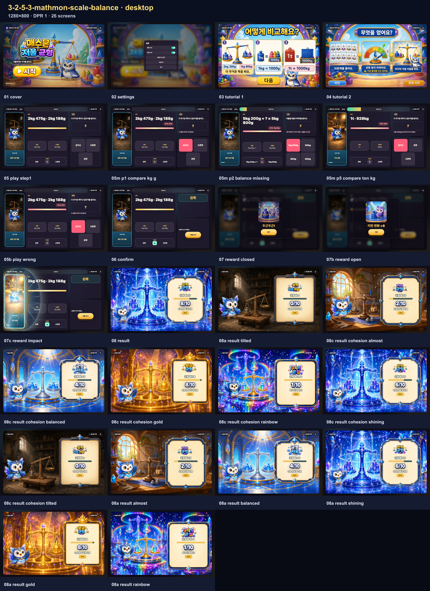
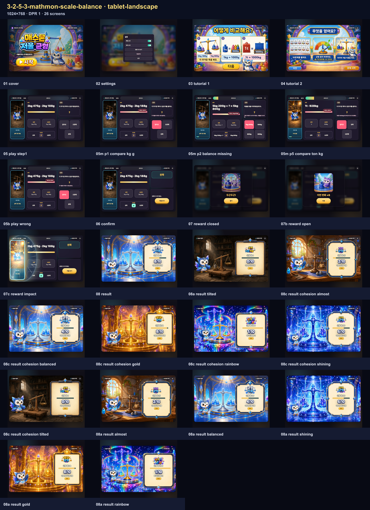
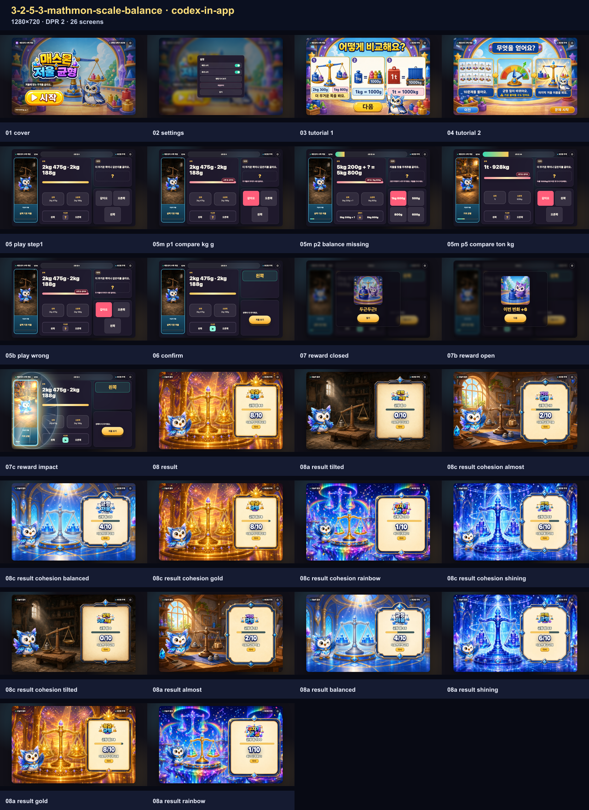
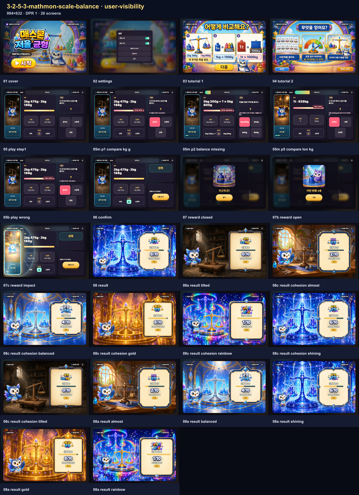
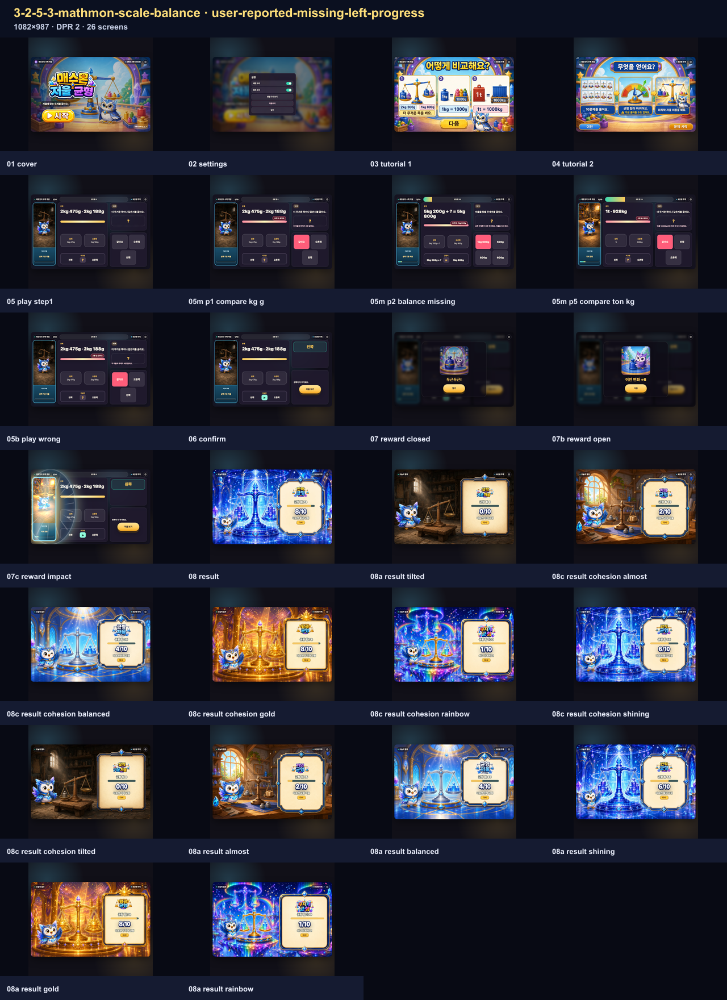
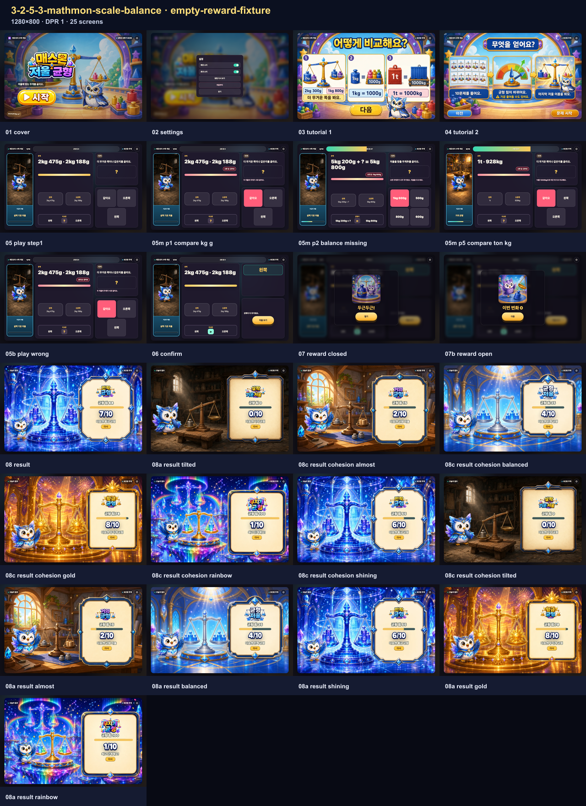

# 매스몬 저울 균형 구현 보고서

## 1. 구현 요약

3학년 2학기 5단원 3차시 `무게 비교와 kg, g, t`을 단일 HTML 게임으로 구현했습니다. 학생은 10문제 동안 저울에 맞는 무게를 골라요. 정답을 고르면 값이 계산판에 먼저 들어가고, 마지막 단계에서는 완성값을 본 뒤 `저울 보기`를 눌러 보상으로 넘어갑니다.

## 2. 등록

- lesson id: `3-2-5-3`
- folder: `3-2-5-3-mathmon-scale-balance`
- title: `매스몬 저울 균형`
- learningGoal: 무게 비교와 kg, g, t

## 3. 화면 흐름

```text
첫 화면 -> 설명 -> 문제 -> 보상 -> 결과
```

- 첫 화면: 생성형 배경, 생성형 제목 아트, HTML 목표 문장, 생성형 시작 버튼 아트
- 설명: 2쪽 생성 포스터
- 문제: 큰 문제, 현재 계산판, 한 줄 지시, 선택지만 기본 노출
- 보상: 저울 변화 하나만 표시
- 결과: 단계별 1280×800 완성 장면 안의 생성형 결과 타이틀·`다시` 버튼 표면과 동적 값 슬롯

## 4. 생성 이미지 자산

| 파일명 | 역할 |
| --- | --- |
| `cover-source.png` / `cover-generated.webp` | 글자 없는 첫 화면 배경 |
| `title-logo-chromakey.png` / `title-logo-generated.png` / `title-logo-generated.webp` | 생성형 제목 아트 |
| `../_shared/mathmon/cover-start-button/start-button-generated.webp` | 공용 시작 버튼 아트 |
| `reward-event-closed-v2-generated.webp` | 닫힌 보상 장면 |
| `reward-event-*-source.png` / `reward-event-*-generated.webp` | 공개 보상 6상태 개별 512×512 장면 |
| `reward-events-v3-contact-sheet.png` | 보상 7상태 컨택시트 |
| `result-scale-*-source.png` / `result-scale-*-generated.webp` | 결과 배경 |
| `result-title-*-source.png` / `result-title-*-generated.webp` | 완성 장면 제작에 사용한 생성형 결과 이름 원본 |
| `../_shared/result-actions/retry-button-v2-generated.webp` | 완성 장면 제작에 사용한 공용 생성형 다시 버튼 원본 |

## 5. 매스몬 기준

사용 팩은 `diversity-reward-pack`이고 기준 매스몬은 수정부엉몬(`mathmon-drv-05-crystalowl`)입니다. 차시 폴더에는 매스몬 원본을 복사하지 않고, 커버/보상/결과 장면 생성 단계에서 함께 넣는 방식으로 처리합니다.

## 6. 보상과 확률

정답의 숨은 기본 가산값은 0입니다. 정답 사건은 `64%/+6~+10`, `15%/-5~-2`, `12%/+14~+22`, `5%/+30`, `3.8%/0(누적 유지)`, `0.2%/100(특별)`이며, 오답은 문제당 최초 1회 `-6~-3`입니다.

| 결과 | 조건 |
| --- | --- |
| 살짝 기운 저울 | 0 이상, 바로 맞힌 문제 0개 이상 |
| 거의 균형 | 15 이상, 바로 맞힌 문제 2개 이상 |
| 균형 저울 | 35 이상, 바로 맞힌 문제 4개 이상 |
| 반짝 균형 | 55 이상, 바로 맞힌 문제 6개 이상 |
| 황금 균형 | 78 이상, 바로 맞힌 문제 8개 이상 |
| 무지개 균형 | 100 이상, 바로 맞힌 문제 1개 이상, 특별 보상 필요 |

## 7. Humanizer QA

학생 문구는 짧은 행동 말 중심으로 구성했습니다.

- 첫 화면 목표: `저울에 맞는 무게를 골라요.`
- 설명 카드: `양쪽 무게를 봐요.`, `1kg은 1000g이에요.`, `1t는 1000kg이에요.`
- 오답 피드백: `다시 골라요.`
- 보상/결과: `살짝 기운 저울`, `거의 균형`, `반짝 균형`, `황금 균형`

학생 화면에는 내부 작업실 이름이나 제작자용 말을 보이지 않게 합니다.

## 8. 텍스트 넘침·요소 겹침 QA

브라우저 QA에서 desktop `1280x800`과 tablet landscape `1024x768`을 확인했습니다.

확인 대상:

- 첫 화면
- 설명 1
- 설명 2
- 문제 1단계
- 정답 확인 상태
- 오답 상태
- 보상
- 결과 단계별 화면

확인 결과: 텍스트 넘침 0건, 요소 겹침 0건, Stage 밖 이탈 0건입니다. 결과 화면은 `살짝 기운 저울`, `거의 균형`, `반짝 균형`, `황금 균형` 4단계를 실제 문제 풀이 흐름으로 도달해 캡처했습니다.

## 9. 검증 명령

- `node scripts/check-rule-consistency.mjs`
- `node scripts/check-stage-ratio.mjs`
- `node scripts/qa-lesson5-scale-balance-model.mjs --runs 10000`
- `node scripts/simulate-lesson5-scale-balance.mjs --runs 10000`
- Browser QA: Chrome CDP 자동 캡처로 데스크톱과 태블릿 가로 화면 확인

실행 결과: 위 명령과 브라우저 QA 모두 통과했습니다.

## 10. 2026-07-12 이미지 설명·엔진 소스 리마스터

- 2쪽 설명을 생성 포스터로 교체했습니다. 1쪽은 양쪽 무게를 보고 저울을 맞추는 행동, 2쪽은 10문제·보석 보상·마지막 결과를 보여 줍니다.
- `_lessons/3-2-5-3-mathmon-scale-balance/lesson.json`을 만들고 공통 엔진 빌드 대상으로 옮겼습니다.
- 공유 모델 경로를 빌더와 계약 검사기가 읽도록 `sourceFiles` 계약을 적용했습니다.
- 결과 상태 세트: 4장, 컨택시트 `result-states-contact-sheet.png`
- 매스몬 팩: `diversity-reward-pack` / `mathmon-drv-05-crystalowl`
- `node scripts/qa-lesson5-scale-balance-model.mjs --runs 10000` 통과 (`100,000`문제)
- `node scripts/qa-lesson-flow.mjs 3-2-5-3-mathmon-scale-balance` 통과
- 데스크톱 `1280×800`, 태블릿 가로 `1024×768`에서 깨진 이미지·텍스트 넘침·요소 겹침·Stage 밖 이탈 `0건`

## 11. 2026-07-28 전체 점검과 수정

- 닫힌 무게추 캡슐 1장과 `smallBalance`, `bigBalance`, `shineBalance`, `smallOnly`, `specialBalance`, `repair` 6상태 개별 512×512 장면으로 보상 화면을 교체했습니다.
- 결과는 `hybrid-generated-dynamic`으로 바꾸고 결과 제목, 저울 힘, 진행 막대, 바로 맞힌 수, 다음 목표, 다시 버튼을 오른쪽 한 축에 정렬해 수정부엉몬을 가리지 않게 했습니다.
- 결과 4상태를 `1280×800` PNG/WebP로 맞추고 데스크톱·태블릿에서 각각 모두 캡처했습니다.
- Humanizer QA에서 수학 판단이 아닌 `알 수 없어요` 선택지를 삭제했습니다. 무게 비교의 `/` 구분도 가운데점 `·`으로 바꿨습니다.
- 이미지 생성은 Codex 내장 `imagegen`을 사용했습니다. 최종 프롬프트는 “수정부엉몬 저울 공방, 글자 없는 3×2 정사각 패널, 작은 무게추·튼튼 무게추·반짝 무게추·흔들 무게추·황금 무게추·다시 맞추기, 같은 카메라와 조명, UI·문자·숫자 없음”과 “같은 장면의 닫힌 무게추 캡슐, 정사각, 문자 없음”입니다.
- 원본 묶음: `reward-events-v2-source.png`, 닫힌 원본: `reward-event-closed-v2-source.png`; 런타임은 상태별 `reward-event-*-generated.webp`이며 전수표는 `reward-events-v3-contact-sheet.png`입니다.
- `check-lesson-contract`, `check-lesson-visual-contract`, 100,000문항 모델 QA, 10,000회 보상 시뮬레이션, 두 viewport 전체 흐름 QA가 PASS입니다.

## 2026-07-31 최종 회귀

- 통합 보상 사건 `64% / 15% / 12% / 5% / 3.8% / 0.2%`, 오답 최초 1회 `-6~-3`을 고정 하네스로 검증했습니다. 빈 사건은 누적값을 유지합니다.
- t·kg 동률 정답 오류를 고치고 100,000문항 회귀를 추가했습니다. `1280×800`, `1024×768`에서 오답 저울 기울기·각 상태·결과 4단계의 넘침·교차·누락은 `0건`입니다.
- 완료 상태는 선택지만 접고 문제 그림·정답이 들어간 계산판·완성 문장·다음 행동을 그대로 보여 줍니다. `calculation-preserved-v1` 하네스가 대기↔완료 계산판 경계 오차 `1px` 이하와 완료 요소 교차 `0px`를 검사합니다.
- `sourceFiles`는 5단원 들이·무게용 공용 모델·뷰·스타일을 의도적으로 참조하며, 차시별 `workbench.type`과 전용 모델 QA로 문제 유형을 분리합니다. 이전 실행 엔진 캡처는 `screenshots/_archive/pre-20260801-engine-flow/`로 분리했습니다.

## 2026-08-01 비교·보상 문구 회귀

- kg·g와 t·kg 비교 모두 동률일 때 `같아요`가 실제 정답으로 생성됩니다. 저울 기울기도 `0deg`로 맞춥니다.
- 보상은 닫힌 상태 `두근두근!`, 열린 상태 `이번 변화 +N` 또는 `이번 변화 0`만 보여 줍니다.

## 2026-08-02 저울 대기 상태 회귀

- 답을 고르기 전에는 모든 비교 저울을 수평으로 두어 정답 방향을 먼저 보여 주지 않습니다. 정답 확인 뒤에만 숨겨 둔 목표 기울기를 적용합니다.
- 10,000회 실행, 100,000문항에서 `같아요` 정답 11,966건을 확인했습니다. 모델 QA가 대기 `0deg`와 정답 확인 뒤 목표 기울기 적용을 함께 검사합니다.
- desktop `1280×800`, tablet landscape `1024×768` 전체 흐름의 넘침·교차·누락은 `0건`입니다.

## 2026-08-01 Kiro 8차 심층 회귀

- 한 저울의 두 접시를 `왼쪽 저울/오른쪽 저울`이 아닌 `왼쪽/오른쪽/같아요`로 부릅니다. 모델 QA가 선택지와 정답 문구에 `저울`을 접시 이름처럼 붙이지 못하게 검사합니다.
- 왼쪽 문제판에 실제 두 무게와 `?`가 있는 비교판 또는 균형식을 두고, 정답 뒤 비교 부호·빠진 무게가 같은 판에 들어갑니다. 누적 하네스가 대기 정보, 정답 누적, 실색, 넘침을 확인합니다.
- 100,000회 실행·1,000,000문항에서 동률 정답 `119,804건`을 확인했습니다.

## 2026-08-01 최종 보상 선조정 v5

- 문제 왼쪽 진행 보상보다 먼저 최종 결과를 `살짝 기운 저울 → 거의 균형 → 균형 저울 → 반짝 균형 → 황금 균형 → 무지개 균형` 6단계로 확정했습니다. 기준은 `0/0`, `15/2`, `35/4`, `55/6`, `78/8`, 특별 `100/1`입니다.
- 최종 결과 원본은 `result-scale-*-v5-source.png`, 런타임은 `result-scale-*-generated.webp`, 자산 컨택시트는 `result-tiers-v5-contact-sheet.png`, 실제 브라우저 결과 컨택시트는 `result-tiers-v5-browser-contact-sheet.png`입니다.
- 여섯 장은 낡은 나무 공방, 청동 공방, 은빛 수정 홀, 푸른 수정 성전, 황금 축제 궁전, 무지개 수정 도시로 공간·저울 재질·빛·효과·색 계열이 단계마다 달라집니다. 상위 두 단계도 금빛과 무지개 밤하늘로 구분됩니다.
- 결과판 픽셀 중심은 단계별 `971.5`, `951.5`, `969`, `943.5`, `1004`, `984.5px`로 검출했으며, 화면 동적 정보는 단계별 축에 맞춥니다.
- 최종 결과 6단계의 브라우저 QA가 먼저 통과한 뒤 문제 왼쪽 전용 진행 장면 6장을 만들었습니다. 원본은 `_shared/mathmon/diversity-reward-pack/lesson-scenes/3-2-5-3/play-progress-v1/source/`, 런타임은 `play-scale-v1-*-generated.webp`, 컨택시트는 `_shared/mathmon/diversity-reward-pack/lesson-scenes/3-2-5-3/play-progress-v1/contact-sheets/play-scale-progress-v1-contact-sheet.png`입니다.
- 진행 이미지는 `768×1536`, `object-fit: contain`이며 최종 결과를 자르거나 재사용하지 않았습니다. 수정부엉몬의 같은 카메라·중심·크기·발 기준선과 전신 잘림 `0건`을 유지합니다.
- 현재 원본의 수정부엉몬 중심·발 기준선·전신 높이는 `_shared/mathmon/diversity-reward-pack/lesson-scenes/3-2-5-3/play-progress-v1/contact-sheets/play-scale-progress-v1-anchor-audit.png`에서 6장 전수 확인합니다.
- 패널은 Stage 기준 `left 1.65%`, `top 11%`, `width 19.2%`, `height 84%`입니다. 전환은 모달 닫힘 뒤 `320ms`를 두고 Stage 폭 `35%` 효과와 새 단계 이미지를 `1560ms` 보여 준 뒤 다음 문제로 이동합니다.
- Humanizer 학생 문구 QA에서 패널 문구를 `지금의 저울`, 단계 이름, `균형 힘` 한 줄로 유지했습니다.
- 브라우저 하네스는 `1280×800`, `1024×768`, `1280×720 DPR2`, `994×632`, `1082×987 DPR2`에서 문제 대기·오답·정답 확인·닫힌/열린 보상·단계 상승 효과·결과 6단계를 검사했습니다. 패널 네 변 최대 오차는 `0.016px`, 학습 영역 교차·텍스트 넘침·누락 이미지는 모두 `0건`입니다.
- `modal-dismiss-world-impact-v2` 고정 fixture에서 모달 선행 닫힘, `320ms` 지연, `35%` 효과 폭, 새 단계 이미지 교체, `1560ms` 표시와 문제 번호 고정을 통과했습니다.

## 2026-08-01 독립 검수 보완 v6

- 독립 검수에서 `result-tier-fullscene-native-v1`인데 제목과 `다시` 버튼 표면을 별도 이미지로 합성하던 계약 위반을 발견했습니다. 여섯 배경을 `result-scale-*-v6-source.png`로 다시 만들고, 생성형 제목과 공용 생성형 `다시` 버튼 표면을 각 1280×800 장면 안에 넣었습니다.
- 현재 런타임은 `generated-result-fullscene-v3`이며 별도 결과 제목·버튼 아트는 보이지 않습니다. 넓게 바뀌는 `균형 힘`, 진행 막대, 정답 수, 다음 목표와 투명 hitbox만 결과판 위에 표시합니다.
- `qa.resultVisualAudit`를 추가하고 밝은 결과판의 실제 픽셀 경계를 행 단위로 검출합니다. 여섯 등급의 결과판 중심과 동적 슬롯 중심은 `3px` 이내, 슬롯·hitbox 네 변은 `1px` 이내, 요소 교차는 `0px`를 강제합니다.
- 자산 팩 manifest에 `3-2-5-3-play-progress-v1`과 `3-2-5-3-result-fullscene-v1`을 등록했습니다.
- Humanizer QA에서 설명 문구를 `같은 단위로 바꾼 뒤 무게를 비교해요.`로 고쳐 한 문장 안 행동 순서를 분명히 했습니다.
- 현재 자산 컨택시트는 `_shared/mathmon/diversity-reward-pack/lesson-scenes/3-2-5-3/result-fullscene-v1/contact-sheets/result-tiers-v6-contact-sheet.png`, 현재 브라우저 컨택시트는 `result-tiers-v6-browser-contact-sheet.png`입니다. 5개 viewport 전체 흐름과 결과 6단계 전수 브라우저 QA를 다시 통과했습니다.

## 현재 화면 증거

아래 컨택시트는 현재 `index.html`과 같은 빌드에서 시작·설명·문제·보상·결과 상태를 캡처한 화면 크기별 증거입니다.













현재 실행본 해시와 화면 크기별 캡처 목록은 `screenshots/report-evidence-manifest.json`에 있습니다.
