# 매스몬 저울 균형 구현 보고서

<!-- CURRENT-PUBLIC-RUNTIME:START -->

## 현재 공개 실행본

- 보고서 기준: `eduitit-current-public-report-v1`
- 공개 입력 커밋: `59b0ce7855228b1b28e84a424bf8ca0f678d56b8`
- 입력 커밋 시각: `2026-09-28T23:22:34+09:00`
- 제작 보고서 원본 SHA-256: `8484af240a8f40ebd37af3befcb51bb24458f3aa8f31eefc5db2a46e0d8d72d8`
- 실제 실행 진입점: `3-2-5-3-mathmon-scale-balance/index.html`
- 실행 진입점 SHA-256: `004260f781962e2fba75be9c4c0baa9c04ecff806403ea101a20207fcc840f39`
- Pages 파일 집합 SHA-256: `f9b2fb82ff822b506130466e33892f21285412efe482684856448afe2a1ff041` (137개)
- 상세 화면 증거: 현재 실행 진입점과 일치
- 공개 페이지: https://kakio426.github.io/eduitit-math-3-2/3-2-5-3-mathmon-scale-balance/
- 공개 보고서: https://github.com/kakio426/eduitit-math-3-2/blob/main/3-2-5-3-mathmon-scale-balance/REPORT.md

<!-- CURRENT-PUBLIC-RUNTIME:END -->

## 2026-09-28 현재 실행본

- 차시: 3학년 2학기 5단원 3차시
- 게임: [공개 실행](https://kakio426.github.io/eduitit-math-3-2/3-2-5-3-mathmon-scale-balance/)
- 현재 검수판: `review/unit5/` · 실행 기록 `2026-09-28T14-08-24-568Z`
- 이 보고서의 현재 화면은 검수 HTML에 실린 원본 PNG와 바이트 단위로 같습니다. 사람의 확인 체크·기존 메모를 자동 완료하거나 삭제하지 않았습니다.
- 이미지 검수표는 16장(문제 10장 + 결과 6장)입니다. 그림은 맥락을 돕고 정답은 구조화 데이터와 HTML 표시가 결정합니다.
- 과거 전체 QA 결과는 아래 제작 이력으로만 보존합니다. 이번 공개를 위해 10,000문항 검사나 무관한 전체 QA를 다시 실행하지 않았습니다.

<!-- PORTABLE-RUNTIME:START -->
## 공통 컴포넌트와 배포 파일

- 내장 위치: `assets/runtime-vendor/`
- 공통 파일: `21개`
- 매니페스트: `assets/PORTABLE_RUNTIME_MANIFEST.json` · SHA-256 `d2f46e4c823a0972a7383715a3bf65bfaf00de5ac290da3d82f957e581242dca`
- 다시 버튼: 공용 `_shared/result-actions/retry-button-v2-generated.webp`의 동일 바이트 사본입니다. 차시별 표시 배치는 차시 설정에서 관리합니다.
- 3차시 버튼 슬롯은 Stage 기준 `320×160`이며, 투명 여백을 제외한 실제 버튼 면은 약 `244×108`입니다. 제목·정답 수·안내·버튼 간격을 조정하고, 반응형 안내는 한 줄로 유지합니다.
<!-- PORTABLE-RUNTIME:END -->

## 학습 구성과 실행 흐름

손과 양팔저울로 무게를 비교하고, 같은 무게추의 개수와 서로 다른 무게추의 정보 부족을 구분합니다. kg·g·t의 관계와 알맞은 무게 단위를 판단합니다.

- 교육 근거: 기존 5단원 지도서의 6~7차시 손 비교·양팔저울·같은 무게추·kg/g/t 관계를 유지합니다.
- 흐름: 첫 화면 → 설명 → 문제 10개(문항별 단계) → 중앙 보상 모달 → 최종 결과
- 보상·정답·문제 수는 이번 결과 버튼 수정에서 변경하지 않았습니다.

| 문제 | 학습 판단 |
| --- | --- |
| 1 | 손과 저울로 무게 비교 |
| 2 | 손과 저울로 무게 비교 |
| 3 | 양팔저울의 균형·기울기로 비교 |
| 4 | 양팔저울의 균형·기울기로 비교 |
| 5 | 무게추의 단위 조건에 따른 판단 |
| 6 | 무게추의 단위 조건에 따른 판단 |
| 7 | kg와 g의 관계 |
| 8 | kg와 g의 관계 |
| 9 | 알맞은 무게 단위 |
| 10 | t와 kg의 관계 |

## 최종 결과 전체

점수는 내부 보상 누적값이고 결과 등급을 고르는 조건입니다. 학생 화면에는 단계 이름·정답 수·다음 목표·다시 버튼을 표시합니다.

| 단계 | 누적값 조건 | 바로 맞힌 문제 조건 |
| --- | --- | --- |
| 살짝 기운 저울 | 0 이상 | 0개 이상 |
| 거의 균형 | 15 이상 | 2개 이상 |
| 균형 저울 | 35 이상 | 4개 이상 |
| 반짝 균형 | 55 이상 | 6개 이상 |
| 황금 균형 | 78 이상 | 8개 이상 |
| 무지개 균형 | 100 이상 | 1개 이상 + 특별 보상 |

## 현재 변경 검증과 사람 확인

- 검수판 수집: 각 차시 1~10번과 중간 풀이 단계, 최종 결과 6등급을 실제 실행 화면에서 모았습니다. 전체 검수판 36개 카드·최종 결과 12개를 유지합니다.
- 결과 버튼 검증: `review/unit5/result-retry-qa.json` — 6등급 × 4크기(1280×800, 1024×768, 1095×977·DPR 2, 1000×600)의 실제 버튼 면적·생성 판/보석 여백·한 줄 안내·다시 동작을 검사했습니다.
- 문제 그림의 교육적 타당성에 대한 사람 확인과 자동 정답/화면 검사는 구분합니다. 화면 수집을 사람의 승인으로 표시하지 않습니다.
- 현재 화면 기록: `screenshots/human-review-evidence.json` (원본 검수판 경로·SHA-256·자동 표시 검사 포함). 기존 full-flow 영수증은 역사 기록이며 새 해시로 덮어 봉인하지 않습니다.

<!-- REPORT-EVIDENCE-ALL:START -->

## 최신 검수표 원본 스크린샷

- 실행본 SHA-256: `004260f781962e2fba75be9c4c0baa9c04ecff806403ea101a20207fcc840f39`
- 검수표 실행 기록: `2026-09-28T14-08-24-568Z`
- 화면: `1280×800 · DPR 1`
- 원본 이미지: `16장` · 최종 결과 `6등급 전부`
- 수집 범위: 문제 대기/중간 단계와 결과 화면. 오답·보상 전체의 신규 전수 QA를 의미하지 않습니다.

### 문제 1

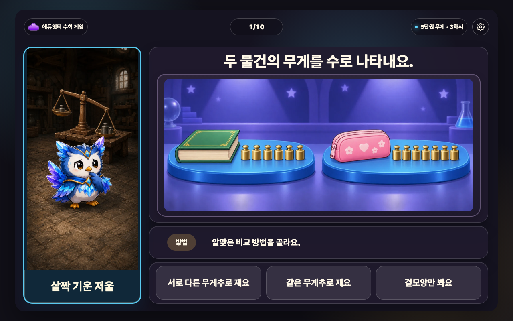

- 학생이 보는 것: 두 물건의 무게를 수로 나타내요. 알맞은 비교 방법을 골라요.
- 판단하거나 누르는 것: 조건을 읽고 해당 단계의 보기 또는 조작을 선택합니다.
- 화면에서 확인되는 수학 관계: 문항 유형: 손과 저울로 무게 비교 — 표시한 조건과 HTML 보기로 판단합니다.
- 다음 상태로 넘어가는 이유: 정답 확인 후 남은 단계 또는 보상으로 이동합니다.

### 문제 2

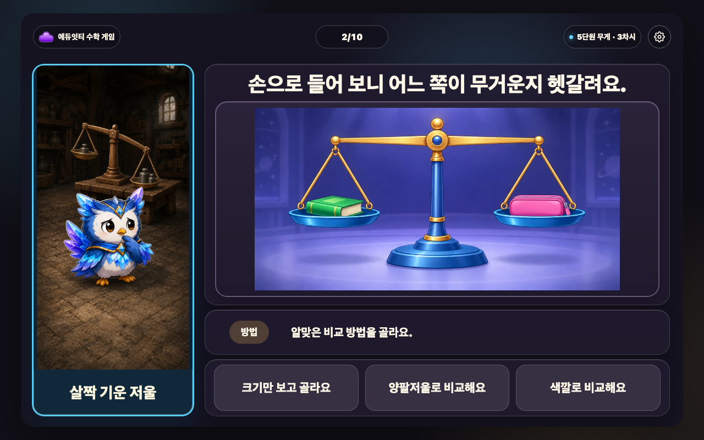

- 학생이 보는 것: 손으로 들어 보니 어느 쪽이 무거운지 헷갈려요. 알맞은 비교 방법을 골라요.
- 판단하거나 누르는 것: 조건을 읽고 해당 단계의 보기 또는 조작을 선택합니다.
- 화면에서 확인되는 수학 관계: 문항 유형: 손과 저울로 무게 비교 — 표시한 조건과 HTML 보기로 판단합니다.
- 다음 상태로 넘어가는 이유: 정답 확인 후 남은 단계 또는 보상으로 이동합니다.

### 문제 3

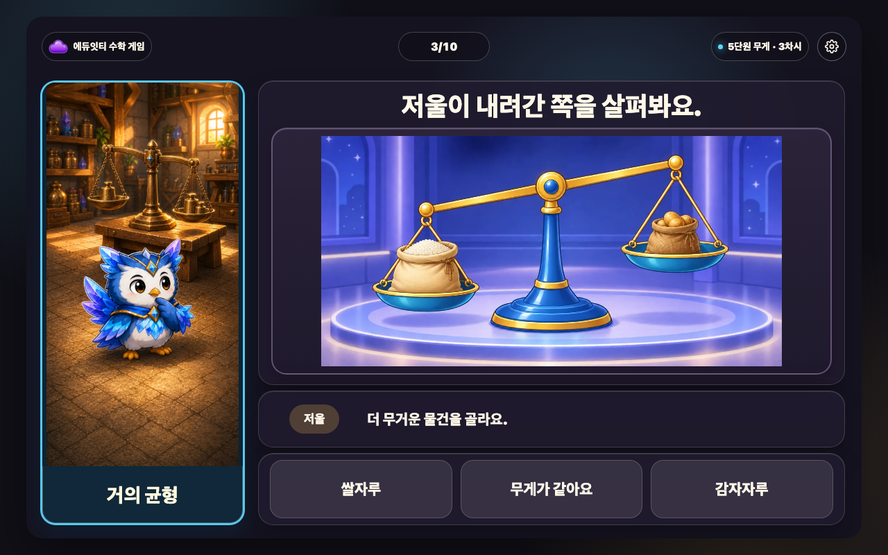

- 학생이 보는 것: 저울이 내려간 쪽을 살펴봐요. 더 무거운 물건을 골라요.
- 판단하거나 누르는 것: 조건을 읽고 해당 단계의 보기 또는 조작을 선택합니다.
- 화면에서 확인되는 수학 관계: 문항 유형: 양팔저울의 균형·기울기로 비교 — 표시한 조건과 HTML 보기로 판단합니다.
- 다음 상태로 넘어가는 이유: 정답 확인 후 남은 단계 또는 보상으로 이동합니다.

### 문제 4

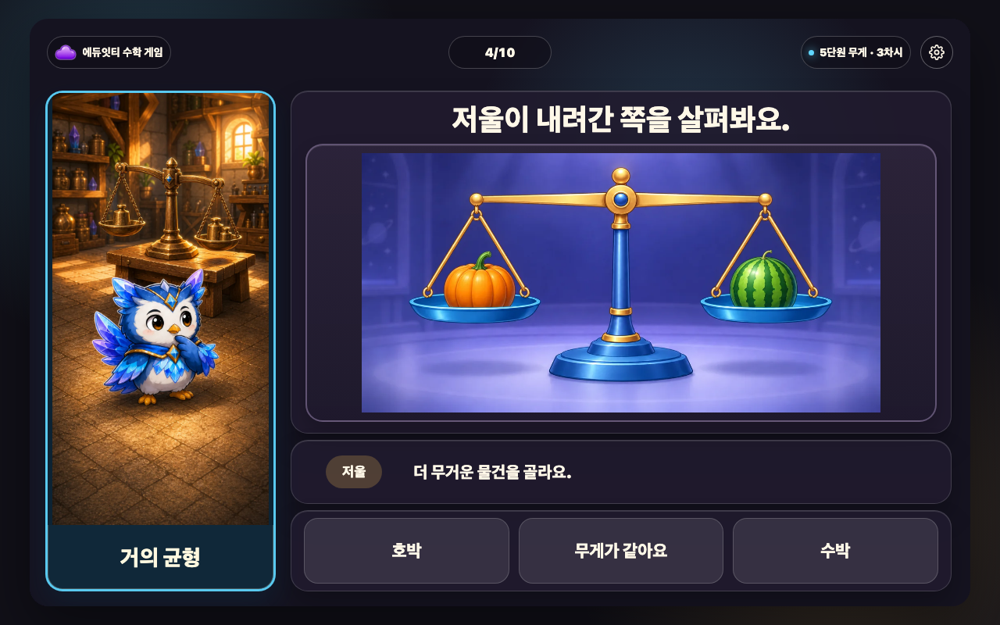

- 학생이 보는 것: 저울이 내려간 쪽을 살펴봐요. 더 무거운 물건을 골라요.
- 판단하거나 누르는 것: 조건을 읽고 해당 단계의 보기 또는 조작을 선택합니다.
- 화면에서 확인되는 수학 관계: 문항 유형: 양팔저울의 균형·기울기로 비교 — 표시한 조건과 HTML 보기로 판단합니다.
- 다음 상태로 넘어가는 이유: 정답 확인 후 남은 단계 또는 보상으로 이동합니다.

### 문제 5

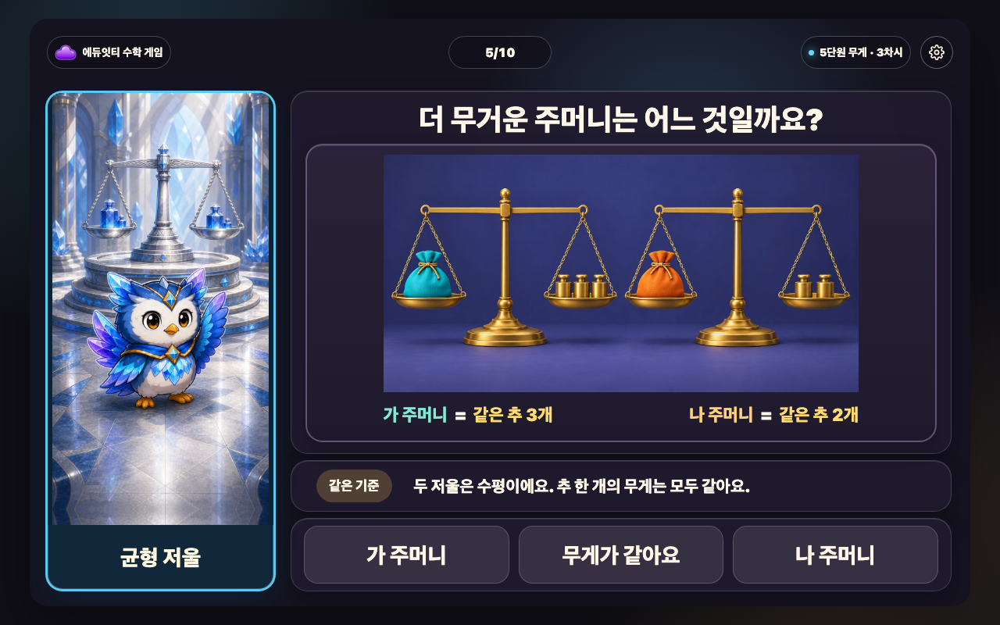

- 학생이 보는 것: 더 무거운 주머니는 어느 것일까요? 두 저울은 수평이에요. 추 한 개의 무게는 모두 같아요.
- 판단하거나 누르는 것: 조건을 읽고 해당 단계의 보기 또는 조작을 선택합니다.
- 화면에서 확인되는 수학 관계: 같은 추 한 개의 무게가 같으므로 3개와 2개의 개수를 비교합니다.
- 다음 상태로 넘어가는 이유: 정답 확인 후 남은 단계 또는 보상으로 이동합니다.

### 문제 6

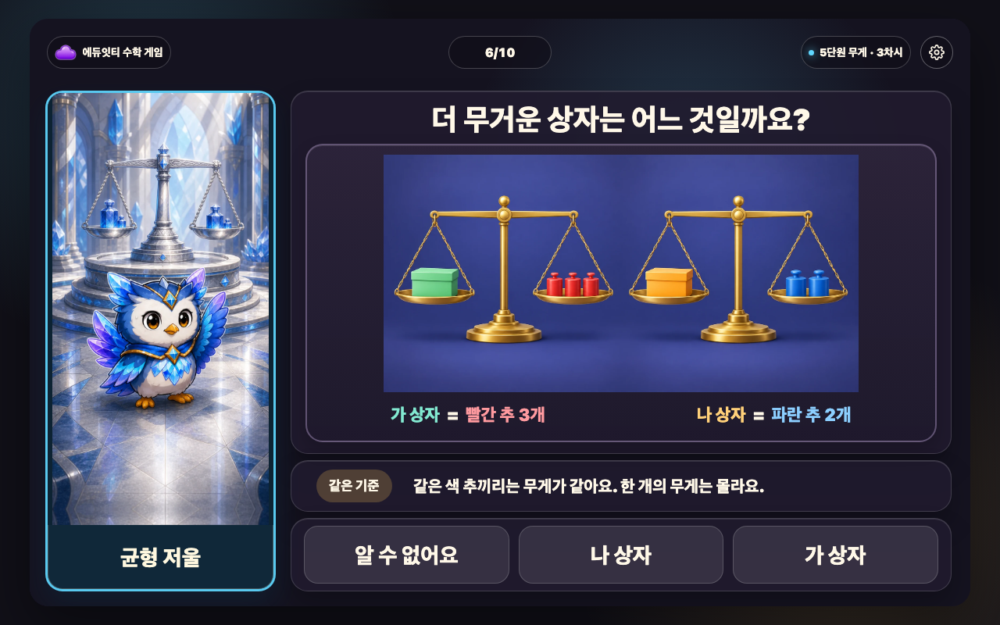

- 학생이 보는 것: 더 무거운 상자는 어느 것일까요? 같은 색 추끼리는 무게가 같아요. 한 개의 무게는 몰라요.
- 판단하거나 누르는 것: 조건을 읽고 해당 단계의 보기 또는 조작을 선택합니다.
- 화면에서 확인되는 수학 관계: 빨간 추와 파란 추 한 개의 무게를 모르므로 개수만으로는 상자의 무게를 결정할 수 없습니다.
- 다음 상태로 넘어가는 이유: 정답 확인 후 남은 단계 또는 보상으로 이동합니다.

### 문제 7

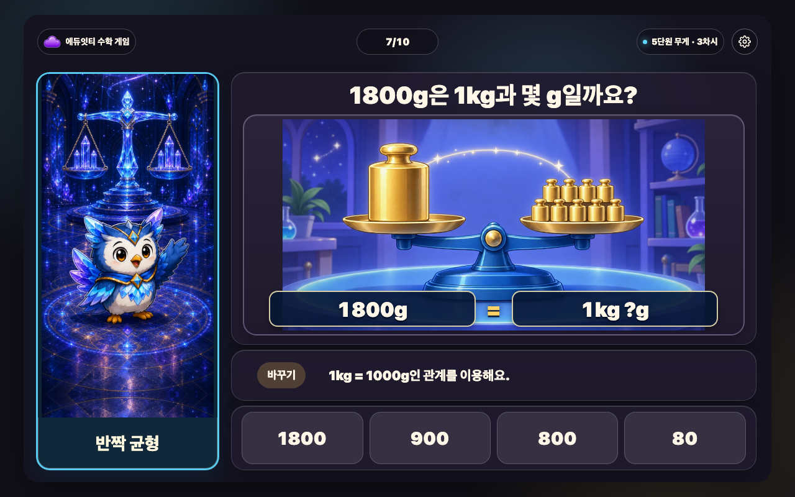

- 학생이 보는 것: 1800g은 1kg과 몇 g일까요? 1kg = 1000g인 관계를 이용해요.
- 판단하거나 누르는 것: 조건을 읽고 해당 단계의 보기 또는 조작을 선택합니다.
- 화면에서 확인되는 수학 관계: 문항 유형: kg와 g의 관계 — 표시한 조건과 HTML 보기로 판단합니다.
- 다음 상태로 넘어가는 이유: 정답 확인 후 남은 단계 또는 보상으로 이동합니다.

### 문제 8

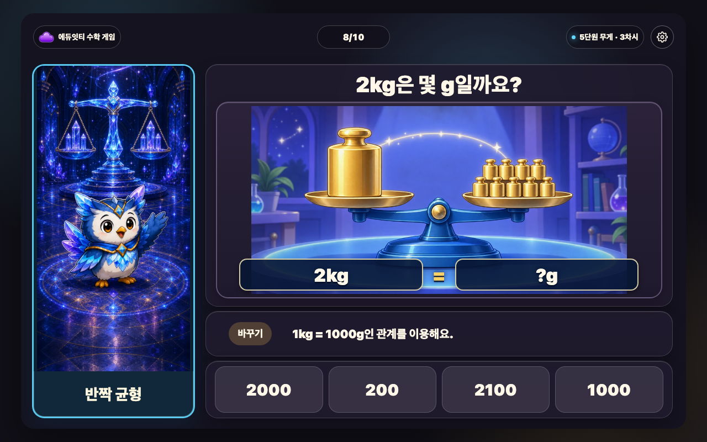

- 학생이 보는 것: 2kg은 몇 g일까요? 1kg = 1000g인 관계를 이용해요.
- 판단하거나 누르는 것: 조건을 읽고 해당 단계의 보기 또는 조작을 선택합니다.
- 화면에서 확인되는 수학 관계: 문항 유형: kg와 g의 관계 — 표시한 조건과 HTML 보기로 판단합니다.
- 다음 상태로 넘어가는 이유: 정답 확인 후 남은 단계 또는 보상으로 이동합니다.

### 문제 9

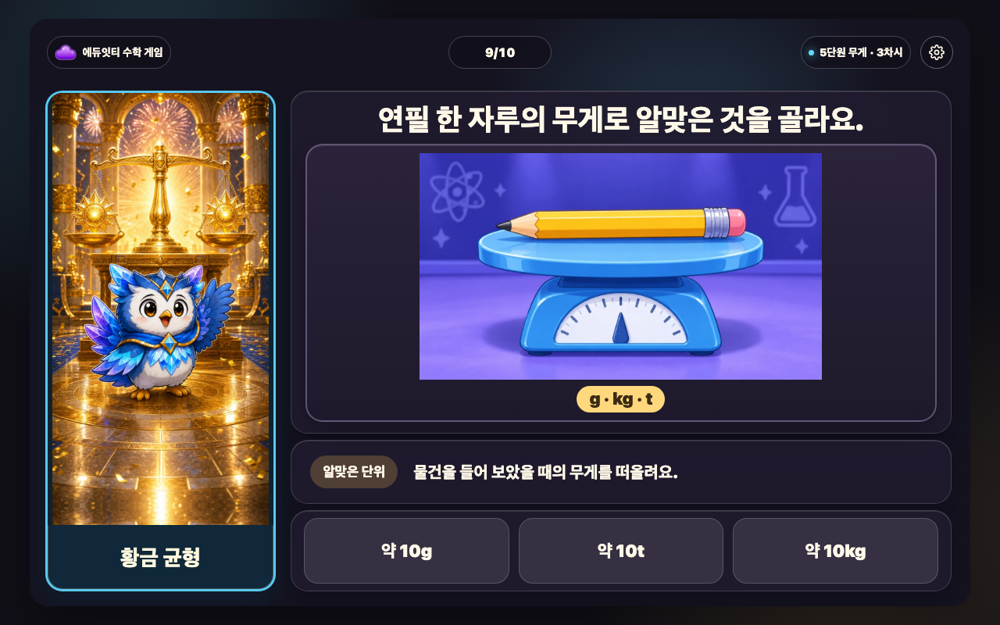

- 학생이 보는 것: 연필 한 자루의 무게로 알맞은 것을 골라요. 물건을 들어 보았을 때의 무게를 떠올려요.
- 판단하거나 누르는 것: 조건을 읽고 해당 단계의 보기 또는 조작을 선택합니다.
- 화면에서 확인되는 수학 관계: 문항 유형: 알맞은 무게 단위 — 표시한 조건과 HTML 보기로 판단합니다.
- 다음 상태로 넘어가는 이유: 정답 확인 후 남은 단계 또는 보상으로 이동합니다.

### 문제 10

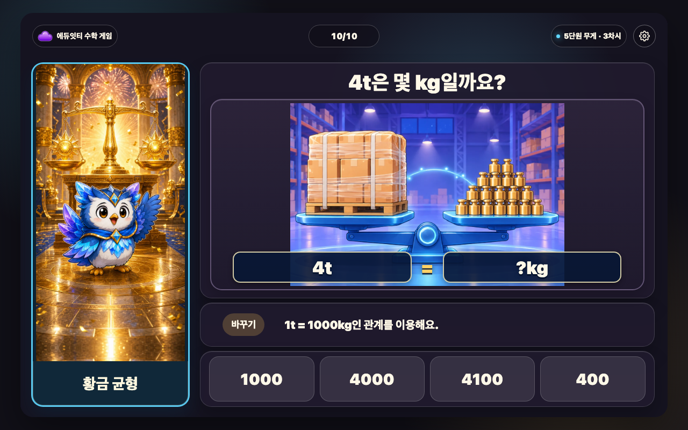

- 학생이 보는 것: 4t은 몇 kg일까요? 1t = 1000kg인 관계를 이용해요.
- 판단하거나 누르는 것: 조건을 읽고 해당 단계의 보기 또는 조작을 선택합니다.
- 화면에서 확인되는 수학 관계: 문항 유형: t와 kg의 관계 — 표시한 조건과 HTML 보기로 판단합니다.
- 다음 상태로 넘어가는 이유: 정답 확인 후 남은 단계 또는 보상으로 이동합니다.

### 최종 결과 · 살짝 기운 저울

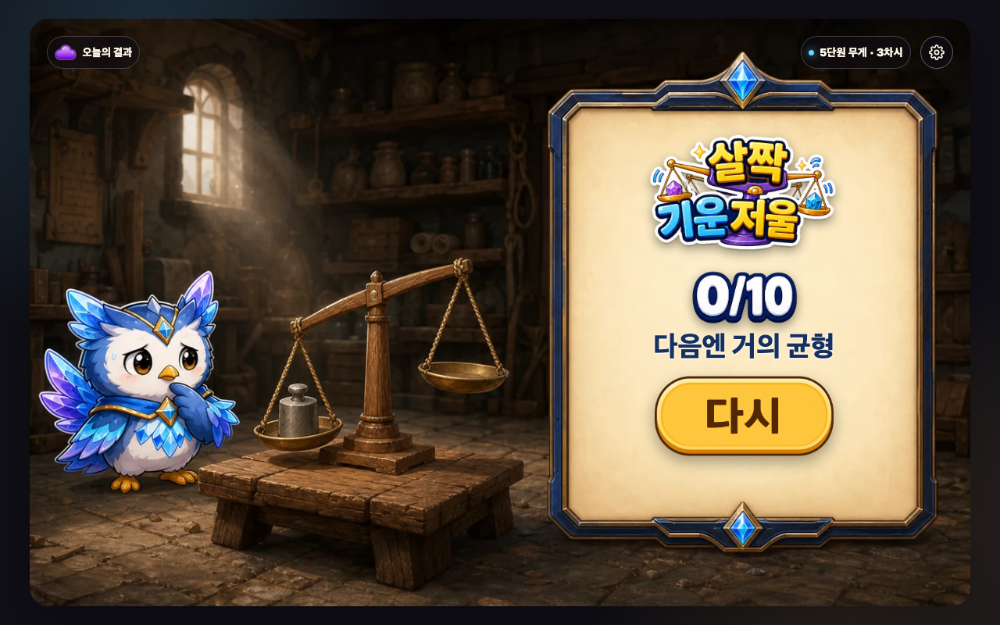

- 학생이 보는 것: 최종 결과 · 살짝 기운 저울 단계 이름, 정답 수, 다음 목표와 다시 버튼을 봅니다.
- 판단하거나 누르는 것: 결과를 확인한 뒤 공용 다시 버튼으로 새 판을 시작합니다.
- 화면에서 확인되는 수학 관계: 정답 수와 보상에 따른 최종 단계이며, 새 수학 문항은 아닙니다.
- 다음 상태로 넘어가는 이유: 다시를 누르면 1번 문제·정답 수 0·진행값 0으로 시작합니다.

### 최종 결과 · 거의 균형

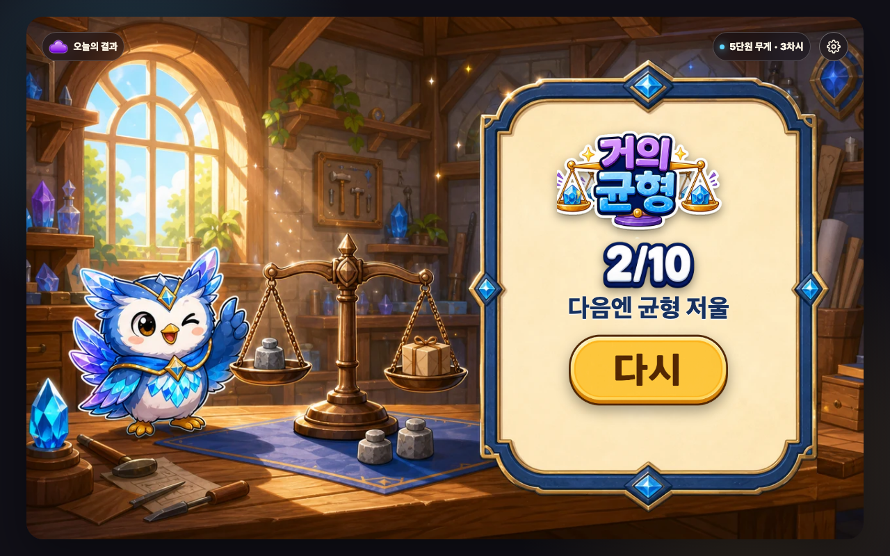

- 학생이 보는 것: 최종 결과 · 거의 균형 단계 이름, 정답 수, 다음 목표와 다시 버튼을 봅니다.
- 판단하거나 누르는 것: 결과를 확인한 뒤 공용 다시 버튼으로 새 판을 시작합니다.
- 화면에서 확인되는 수학 관계: 정답 수와 보상에 따른 최종 단계이며, 새 수학 문항은 아닙니다.
- 다음 상태로 넘어가는 이유: 다시를 누르면 1번 문제·정답 수 0·진행값 0으로 시작합니다.

### 최종 결과 · 균형 저울

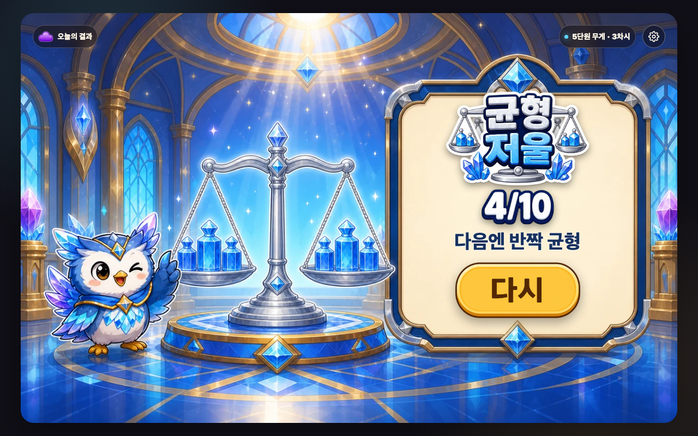

- 학생이 보는 것: 최종 결과 · 균형 저울 단계 이름, 정답 수, 다음 목표와 다시 버튼을 봅니다.
- 판단하거나 누르는 것: 결과를 확인한 뒤 공용 다시 버튼으로 새 판을 시작합니다.
- 화면에서 확인되는 수학 관계: 정답 수와 보상에 따른 최종 단계이며, 새 수학 문항은 아닙니다.
- 다음 상태로 넘어가는 이유: 다시를 누르면 1번 문제·정답 수 0·진행값 0으로 시작합니다.

### 최종 결과 · 반짝 균형

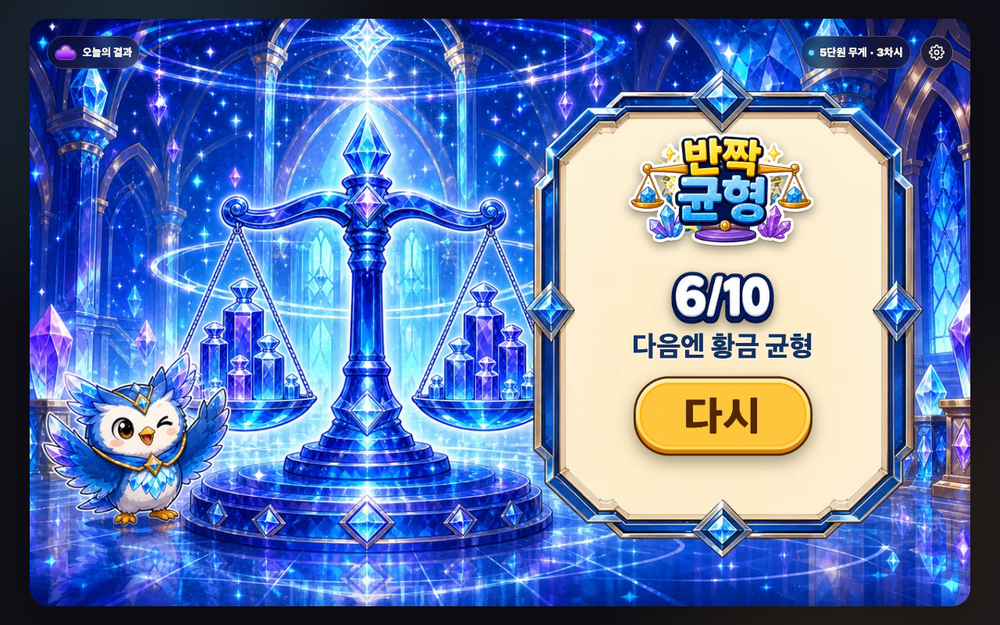

- 학생이 보는 것: 최종 결과 · 반짝 균형 단계 이름, 정답 수, 다음 목표와 다시 버튼을 봅니다.
- 판단하거나 누르는 것: 결과를 확인한 뒤 공용 다시 버튼으로 새 판을 시작합니다.
- 화면에서 확인되는 수학 관계: 정답 수와 보상에 따른 최종 단계이며, 새 수학 문항은 아닙니다.
- 다음 상태로 넘어가는 이유: 다시를 누르면 1번 문제·정답 수 0·진행값 0으로 시작합니다.

### 최종 결과 · 황금 균형

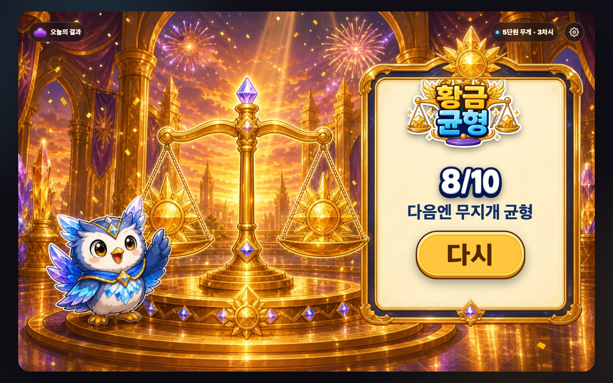

- 학생이 보는 것: 최종 결과 · 황금 균형 단계 이름, 정답 수, 다음 목표와 다시 버튼을 봅니다.
- 판단하거나 누르는 것: 결과를 확인한 뒤 공용 다시 버튼으로 새 판을 시작합니다.
- 화면에서 확인되는 수학 관계: 정답 수와 보상에 따른 최종 단계이며, 새 수학 문항은 아닙니다.
- 다음 상태로 넘어가는 이유: 다시를 누르면 1번 문제·정답 수 0·진행값 0으로 시작합니다.

### 최종 결과 · 무지개 균형

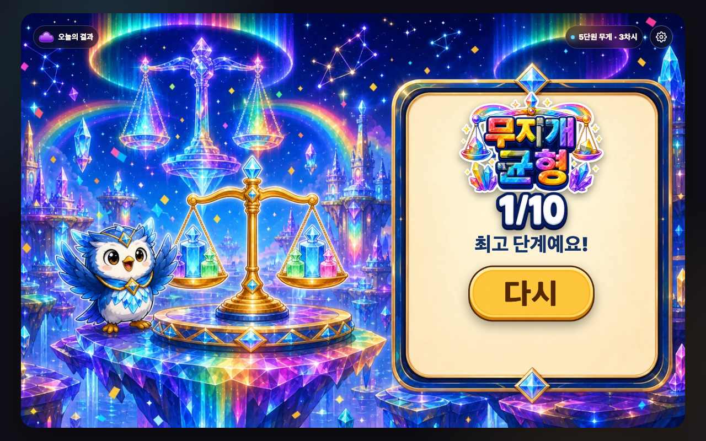

- 학생이 보는 것: 최종 결과 · 무지개 균형 단계 이름, 정답 수, 다음 목표와 다시 버튼을 봅니다.
- 판단하거나 누르는 것: 결과를 확인한 뒤 공용 다시 버튼으로 새 판을 시작합니다.
- 화면에서 확인되는 수학 관계: 정답 수와 보상에 따른 최종 단계이며, 새 수학 문항은 아닙니다.
- 다음 상태로 넘어가는 이유: 다시를 누르면 1번 문제·정답 수 0·진행값 0으로 시작합니다.

<!-- REPORT-EVIDENCE-ALL:END -->

<details>
<summary>이전 제작·검사 이력 — 당시 실행본의 기록이며 현재 QA 판정으로 사용하지 않습니다.</summary>

기존 `diversity-reward-pack`의 수정부엉몬 결과 6단계와 `_shared/mathmon/diversity-reward-pack/lesson-scenes/3-2-5-3/result-fullscene-v1/contact-sheets/result-tiers-v6-contact-sheet.png`는 그대로 유지했습니다.

진행 장면 증거는 `_shared/mathmon/diversity-reward-pack/lesson-scenes/3-2-5-3/play-progress-v1/source`, `_shared/mathmon/diversity-reward-pack/lesson-scenes/3-2-5-3/play-progress-v1/contact-sheets/play-scale-progress-v1-contact-sheet.png`, `_shared/mathmon/diversity-reward-pack/lesson-scenes/3-2-5-3/play-progress-v1/contact-sheets/play-scale-progress-v1-anchor-audit.png`입니다.

상단 조작은 `stage-top-controls-v2`를 쓰며, 배지 글자 `14px`, 문제 번호 `16px`를 실제 측정 기준으로 삼습니다.

## 2026-09-27 저울 위 물건 시각화

- 글자 라벨만 있던 저울 문제를 책·연필통, 쌀자루·감자자루, 호박·수박이 접시에 실제로 놓인 1280×640 완성 장면 3종으로 교체했습니다.
- 장면별 저울 방향은 `level`, `left-down`, `level`이며, 정답과 관계 판정은 기존 구조화 데이터가 계속 담당합니다.
- 자산 전수표는 `balance-object-scenes-v1-contact-sheet.png`입니다.

## 2026-09-01 교육과정 재설계

- 지도서 5단원 6~7차시의 손 비교·저울 확인·같은 무게추·kg/g/t 관계 흐름으로 문제 10개를 다시 구성했습니다.
- 생성형 저울 받침 위에 동적 빔과 접시를 올려, 무거운 물건 쪽 접시가 실제로 내려가게 했습니다.
- 왼쪽/오른쪽 반복 대신 물건 이름과 `가`, `나`를 쓰고, 기존 수정부엉몬 6단계 진행·결과는 유지했습니다.
- 생성 그림은 맥락만 제공하며 저울 관계와 정답은 구조화된 데이터가 결정합니다.
- Humanizer QA에서 `양감` 같은 교사용 말을 `알맞은 단위`로 바꾸고, `같은 단위로 바꾼 뒤 무게를 비교해요.`처럼 행동 순서를 한 문장에 담았습니다.
- 모델 10,000회에서 100,000문제를 검사했고, 전체 브라우저 QA는 6개 화면 프로필·193개 상태 캡처로 통과했습니다.

## 2026-08-09 보상 패널 효과·폭 회귀

- 일반 점수 상승은 `is-changing` 패널 플레어만 사용하고 Stage 임팩트는 쓰지 않으며, 표시 시간은 `640ms`입니다. 등급 상승은 `is-tier-up`·진행 장면 교체·Stage 폭 `32% 이상` 임팩트를 사용하고 `1560ms`(최소 읽기 시간 `1200ms`) 유지합니다.
- 왼쪽 진행 패널은 Stage 폭 `24.5%`(`23.4375~25.2%` 허용), 문제 작업 영역과 최소 간격 `1.5625%`로 데스크톱·태블릿에서 측정했습니다. 넘침·교차는 `0건`입니다.
- 현재 실행본에서 `qa-lesson-flow.mjs` 보상 fixture, `check-stage-ratio.mjs`, `check-lesson-contract.mjs`, 학생 보상 문구 브라우저 QA `176/176`을 통과했습니다.

## 2026-08-09 중간 보상 명칭 QA

- 보상 모달의 `이번 변화`·`균형 힘`을 `균형 점수 +N/-N/0`으로 통일했습니다.
- Chrome `1280×800`, `1024×768`에서 보상 8상태를 전수 확인했습니다. 텍스트 넘침·요소 교차·Stage 이탈은 모두 0건입니다.
- 중앙 보상은 `unit3-modal-art-compact-v2`로 고정했습니다: 카드 `430×480px(43:48)`, Stage 최대 폭 `82%`, 이미지 `250×250px`. reward-only 브라우저 하네스에서 닫힘·열림 실제 rect를 확인했습니다.

## 1. 구현 요약

3학년 2학기 5단원 3차시 `무게 비교와 kg, g, t`을 단일 HTML 게임으로 구현했습니다. 학생은 10문제 동안 저울에 맞는 무게를 골라요. 정답을 고르면 값이 계산판에 먼저 들어가고, 마지막 단계에서는 완성값을 본 뒤 `저울 보기`를 눌러 보상으로 넘어갑니다.

## 2. 등록

- lesson id: `3-2-5-3`
- folder: `3-2-5-3-mathmon-scale-balance`
- title: `매스몬 저울 균형`
- learningGoal: 무게 비교와 kg, g, t

## 3. 화면 흐름

```text
첫 화면 -> 설명 -> 문제 -> 보상 -> 결과
```

- 첫 화면: 생성형 배경, 생성형 제목 아트, HTML 목표 문장, 생성형 시작 버튼 아트
- 설명: 2쪽 생성 포스터
- 문제: 큰 문제, 현재 계산판, 한 줄 지시, 선택지만 기본 노출
- 보상: 저울 변화 하나만 표시
- 결과: 단계별 1280×800 완성 장면 안의 생성형 결과 타이틀·`다시` 버튼 표면과 동적 값 슬롯

## 4. 생성 이미지 자산

| 파일명 | 역할 |
| --- | --- |
| `cover-source.png` / `cover-generated.webp` | 글자 없는 첫 화면 배경 |
| `title-logo-chromakey.png` / `title-logo-generated.png` / `title-logo-generated.webp` | 생성형 제목 아트 |
| `../_shared/mathmon/cover-start-button/start-button-generated.webp` | 공용 시작 버튼 아트 |
| `reward-event-closed-v2-generated.webp` | 닫힌 보상 장면 |
| `reward-event-*-source.png` / `reward-event-*-generated.webp` | 공개 보상 6상태 개별 512×512 장면 |
| `reward-events-v3-contact-sheet.png` | 보상 7상태 컨택시트 |
| `result-scale-*-source.png` / `result-scale-*-generated.webp` | 결과 배경 |
| `result-title-*-source.png` / `result-title-*-generated.webp` | 완성 장면 제작에 사용한 생성형 결과 이름 원본 |
| `../_shared/result-actions/retry-button-v2-generated.webp` | 완성 장면 제작에 사용한 공용 생성형 다시 버튼 원본 |

## 5. 매스몬 기준

사용 팩은 `diversity-reward-pack`이고 기준 매스몬은 수정부엉몬(`mathmon-drv-05-crystalowl`)입니다. 차시 폴더에는 매스몬 원본을 복사하지 않고, 커버/보상/결과 장면 생성 단계에서 함께 넣는 방식으로 처리합니다.

## 6. 보상과 확률

정답의 숨은 기본 가산값은 0입니다. 정답 사건은 `64%/+6~+10`, `15%/-5~-2`, `12%/+14~+22`, `5%/+30`, `3.8%/0(누적 유지)`, `0.2%/100(특별)`이며, 오답은 문제당 최초 1회 `-6~-3`입니다.

| 결과 | 조건 |
| --- | --- |
| 살짝 기운 저울 | 0 이상, 바로 맞힌 문제 0개 이상 |
| 거의 균형 | 15 이상, 바로 맞힌 문제 2개 이상 |
| 균형 저울 | 35 이상, 바로 맞힌 문제 4개 이상 |
| 반짝 균형 | 55 이상, 바로 맞힌 문제 6개 이상 |
| 황금 균형 | 78 이상, 바로 맞힌 문제 8개 이상 |
| 무지개 균형 | 100 이상, 바로 맞힌 문제 1개 이상, 특별 보상 필요 |

## 7. Humanizer QA

학생 문구는 3학년이 소리 내어 읽고 바로 행동할 수 있는 말로 구성했습니다.

- 첫 화면 목표: `같은 기준으로 무게를 재고 나타내요.`
- 방법 문구: `손으로 비교하기 어렵다면 양팔저울이나 같은 무게추를 써요.`
- 단위 문구: `1kg은 1000g, 1t은 1000kg인 것을 이용해요.`
- 비교 문구: `같은 단위로 바꾼 뒤 무게를 비교해요.`

학생 화면에는 내부 작업실 이름이나 제작자용 말을 보이지 않게 합니다.

## 8. 텍스트 넘침·요소 겹침 QA

브라우저 QA에서 등록된 6개 화면 프로필과 193개 상태 캡처를 확인했습니다.

확인 대상:

- 첫 화면
- 설명 1
- 설명 2
- 문제 1단계
- 정답 확인 상태
- 오답 상태
- 보상
- 결과 단계별 화면

확인 결과: 텍스트 넘침 0건, 요소 겹침 0건, Stage 밖 이탈 0건입니다. 결과 화면은 `살짝 기운 저울`, `거의 균형`, `반짝 균형`, `황금 균형` 4단계를 실제 문제 풀이 흐름으로 도달해 캡처했습니다.

## 9. 검증 명령

- `node scripts/check-rule-consistency.mjs`
- `node scripts/check-stage-ratio.mjs`
- `node scripts/qa-lesson5-scale-balance-model.mjs --runs 10000`
- `node scripts/simulate-lesson5-scale-balance.mjs --runs 10000`
- Browser QA: Chrome CDP 자동 캡처로 데스크톱과 태블릿 가로 화면 확인

실행 결과: 위 명령과 브라우저 QA 모두 통과했습니다.

## 10. 2026-07-12 이미지 설명·엔진 소스 리마스터

- 2쪽 설명을 생성 포스터로 교체했습니다. 1쪽은 양쪽 무게를 보고 저울을 맞추는 행동, 2쪽은 10문제·보석 보상·마지막 결과를 보여 줍니다.
- `_lessons/3-2-5-3-mathmon-scale-balance/lesson.json`을 만들고 공통 엔진 빌드 대상으로 옮겼습니다.
- 공유 모델 경로를 빌더와 계약 검사기가 읽도록 `sourceFiles` 계약을 적용했습니다.
- 결과 상태 세트: 4장, 컨택시트 `result-states-contact-sheet.png`
- 매스몬 팩: `diversity-reward-pack` / `mathmon-drv-05-crystalowl`
- `node scripts/qa-lesson5-scale-balance-model.mjs --runs 10000` 통과 (`100,000`문제)
- `node scripts/qa-lesson-flow.mjs 3-2-5-3-mathmon-scale-balance` 통과
- 데스크톱 `1280×800`, 태블릿 가로 `1024×768`에서 깨진 이미지·텍스트 넘침·요소 겹침·Stage 밖 이탈 `0건`

## 11. 2026-07-28 전체 점검과 수정

- 닫힌 무게추 캡슐 1장과 `smallBalance`, `bigBalance`, `shineBalance`, `smallOnly`, `specialBalance`, `repair` 6상태 개별 512×512 장면으로 보상 화면을 교체했습니다.
- 결과는 `hybrid-generated-dynamic`으로 바꾸고 결과 제목, 저울 힘, 진행 막대, 바로 맞힌 수, 다음 목표, 다시 버튼을 오른쪽 한 축에 정렬해 수정부엉몬을 가리지 않게 했습니다.
- 결과 4상태를 `1280×800` PNG/WebP로 맞추고 데스크톱·태블릿에서 각각 모두 캡처했습니다.
- Humanizer QA에서 수학 판단이 아닌 `알 수 없어요` 선택지를 삭제했습니다. 무게 비교의 `/` 구분도 가운데점 `·`으로 바꿨습니다.
- 이미지 생성은 Codex 내장 `imagegen`을 사용했습니다. 최종 프롬프트는 “수정부엉몬 저울 공방, 글자 없는 3×2 정사각 패널, 작은 무게추·튼튼 무게추·반짝 무게추·흔들 무게추·황금 무게추·다시 맞추기, 같은 카메라와 조명, UI·문자·숫자 없음”과 “같은 장면의 닫힌 무게추 캡슐, 정사각, 문자 없음”입니다.
- 원본 묶음: `reward-events-v2-source.png`, 닫힌 원본: `reward-event-closed-v2-source.png`; 런타임은 상태별 `reward-event-*-generated.webp`이며 전수표는 `reward-events-v3-contact-sheet.png`입니다.
- `check-lesson-contract`, `check-lesson-visual-contract`, 100,000문항 모델 QA, 10,000회 보상 시뮬레이션, 두 viewport 전체 흐름 QA가 PASS입니다.

## 2026-07-31 최종 회귀

- 통합 보상 사건 `64% / 15% / 12% / 5% / 3.8% / 0.2%`, 오답 최초 1회 `-6~-3`을 고정 하네스로 검증했습니다. 빈 사건은 누적값을 유지합니다.
- t·kg 동률 정답 오류를 고치고 100,000문항 회귀를 추가했습니다. `1280×800`, `1024×768`에서 오답 저울 기울기·각 상태·결과 4단계의 넘침·교차·누락은 `0건`입니다.
- 완료 상태는 선택지만 접고 문제 그림·정답이 들어간 계산판·완성 문장·다음 행동을 그대로 보여 줍니다. `calculation-preserved-v1` 하네스가 대기↔완료 계산판 경계 오차 `1px` 이하와 완료 요소 교차 `0px`를 검사합니다.
- `sourceFiles`는 5단원 들이·무게용 공용 모델·뷰·스타일을 의도적으로 참조하며, 차시별 `workbench.type`과 전용 모델 QA로 문제 유형을 분리합니다. 이전 실행 엔진 캡처는 `screenshots/_archive/pre-20260801-engine-flow/`로 분리했습니다.

## 2026-08-01 비교·보상 문구 회귀

- kg·g와 t·kg 비교 모두 동률일 때 `같아요`가 실제 정답으로 생성됩니다. 저울 기울기도 `0deg`로 맞춥니다.
- 보상은 닫힌 상태 `두근두근!`, 열린 상태 `이번 변화 +N` 또는 `이번 변화 0`만 보여 줍니다.

## 2026-08-02 저울 대기 상태 회귀

- 답을 고르기 전에는 모든 비교 저울을 수평으로 두어 정답 방향을 먼저 보여 주지 않습니다. 정답 확인 뒤에만 숨겨 둔 목표 기울기를 적용합니다.
- 10,000회 실행, 100,000문항에서 `같아요` 정답 11,966건을 확인했습니다. 모델 QA가 대기 `0deg`와 정답 확인 뒤 목표 기울기 적용을 함께 검사합니다.
- desktop `1280×800`, tablet landscape `1024×768` 전체 흐름의 넘침·교차·누락은 `0건`입니다.

## 2026-08-01 Kiro 8차 심층 회귀

- 한 저울의 두 접시를 `왼쪽 저울/오른쪽 저울`이 아닌 `왼쪽/오른쪽/같아요`로 부릅니다. 모델 QA가 선택지와 정답 문구에 `저울`을 접시 이름처럼 붙이지 못하게 검사합니다.
- 왼쪽 문제판에 실제 두 무게와 `?`가 있는 비교판 또는 균형식을 두고, 정답 뒤 비교 부호·빠진 무게가 같은 판에 들어갑니다. 누적 하네스가 대기 정보, 정답 누적, 실색, 넘침을 확인합니다.
- 100,000회 실행·1,000,000문항에서 동률 정답 `119,804건`을 확인했습니다.

## 2026-08-01 최종 보상 선조정 v5

- 문제 왼쪽 진행 보상보다 먼저 최종 결과를 `살짝 기운 저울 → 거의 균형 → 균형 저울 → 반짝 균형 → 황금 균형 → 무지개 균형` 6단계로 확정했습니다. 기준은 `0/0`, `15/2`, `35/4`, `55/6`, `78/8`, 특별 `100/1`입니다.
- 최종 결과 원본은 `result-scale-*-v5-source.png`, 런타임은 `result-scale-*-generated.webp`, 자산 컨택시트는 `result-tiers-v5-contact-sheet.png`, 실제 브라우저 결과 컨택시트는 `result-tiers-v5-browser-contact-sheet.png`입니다.
- 여섯 장은 낡은 나무 공방, 청동 공방, 은빛 수정 홀, 푸른 수정 성전, 황금 축제 궁전, 무지개 수정 도시로 공간·저울 재질·빛·효과·색 계열이 단계마다 달라집니다. 상위 두 단계도 금빛과 무지개 밤하늘로 구분됩니다.
- 결과판 픽셀 중심은 단계별 `971.5`, `951.5`, `969`, `943.5`, `1004`, `984.5px`로 검출했으며, 화면 동적 정보는 단계별 축에 맞춥니다.
- 최종 결과 6단계의 브라우저 QA가 먼저 통과한 뒤 문제 왼쪽 전용 진행 장면 6장을 만들었습니다. 원본은 `_shared/mathmon/diversity-reward-pack/lesson-scenes/3-2-5-3/play-progress-v1/source/`, 런타임은 `play-scale-v1-*-generated.webp`, 컨택시트는 `_shared/mathmon/diversity-reward-pack/lesson-scenes/3-2-5-3/play-progress-v1/contact-sheets/play-scale-progress-v1-contact-sheet.png`입니다.
- 진행 이미지는 `768×1536`, `object-fit: contain`이며 최종 결과를 자르거나 재사용하지 않았습니다. 수정부엉몬의 같은 카메라·중심·크기·발 기준선과 전신 잘림 `0건`을 유지합니다.
- 현재 원본의 수정부엉몬 중심·발 기준선·전신 높이는 `_shared/mathmon/diversity-reward-pack/lesson-scenes/3-2-5-3/play-progress-v1/contact-sheets/play-scale-progress-v1-anchor-audit.png`에서 6장 전수 확인합니다.
- 패널은 Stage 기준 `left 1.65%`, `top 11%`, `width 24.5%`, `height 84%`입니다. 전환은 모달 닫힘 뒤 `320ms`를 두고 등급 상승 때만 Stage 폭 `35%` 효과와 새 단계 이미지를 `1560ms` 보여 준 뒤 다음 문제로 이동합니다.
- Humanizer 학생 문구 QA에서 패널 문구를 `지금의 저울`, 단계 이름, `균형 힘` 한 줄로 유지했습니다.
- 브라우저 하네스는 `1280×800`, `1024×768`, `1280×720 DPR2`, `994×632`, `1082×987 DPR2`에서 문제 대기·오답·정답 확인·닫힌/열린 보상·단계 상승 효과·결과 6단계를 검사했습니다. 패널 네 변 최대 오차는 `0.016px`, 학습 영역 교차·텍스트 넘침·누락 이미지는 모두 `0건`입니다.
- `modal-dismiss-world-impact-v2` 고정 fixture에서 모달 선행 닫힘, `320ms` 지연, `35%` 효과 폭, 새 단계 이미지 교체, `1560ms` 표시와 문제 번호 고정을 통과했습니다.

## 2026-08-01 독립 검수 보완 v6

- 독립 검수에서 `result-tier-fullscene-native-v1`인데 제목과 `다시` 버튼 표면을 별도 이미지로 합성하던 계약 위반을 발견했습니다. 여섯 배경을 `result-scale-*-v6-source.png`로 다시 만들고, 생성형 제목과 공용 생성형 `다시` 버튼 표면을 각 1280×800 장면 안에 넣었습니다.
- 현재 런타임은 `generated-result-fullscene-v3`이며 별도 결과 제목·버튼 아트는 보이지 않습니다. 넓게 바뀌는 `균형 힘`, 진행 막대, 정답 수, 다음 목표와 투명 hitbox만 결과판 위에 표시합니다.
- `qa.resultVisualAudit`를 추가하고 밝은 결과판의 실제 픽셀 경계를 행 단위로 검출합니다. 여섯 등급의 결과판 중심과 동적 슬롯 중심은 `3px` 이내, 슬롯·hitbox 네 변은 `1px` 이내, 요소 교차는 `0px`를 강제합니다.
- 자산 팩 manifest에 `3-2-5-3-play-progress-v1`과 `3-2-5-3-result-fullscene-v1`을 등록했습니다.
- Humanizer QA에서 설명 문구를 `같은 단위로 바꾼 뒤 무게를 비교해요.`로 고쳐 한 문장 안 행동 순서를 분명히 했습니다.
- 현재 자산 컨택시트는 `_shared/mathmon/diversity-reward-pack/lesson-scenes/3-2-5-3/result-fullscene-v1/contact-sheets/result-tiers-v6-contact-sheet.png`, 현재 브라우저 컨택시트는 `result-tiers-v6-browser-contact-sheet.png`입니다. 5개 viewport 전체 흐름과 결과 6단계 전수 브라우저 QA를 다시 통과했습니다.

## 현재 화면 증거

아래 컨택시트는 현재 `index.html`과 같은 빌드에서 시작·설명·문제·보상·결과 상태를 캡처한 화면 크기별 증거입니다.

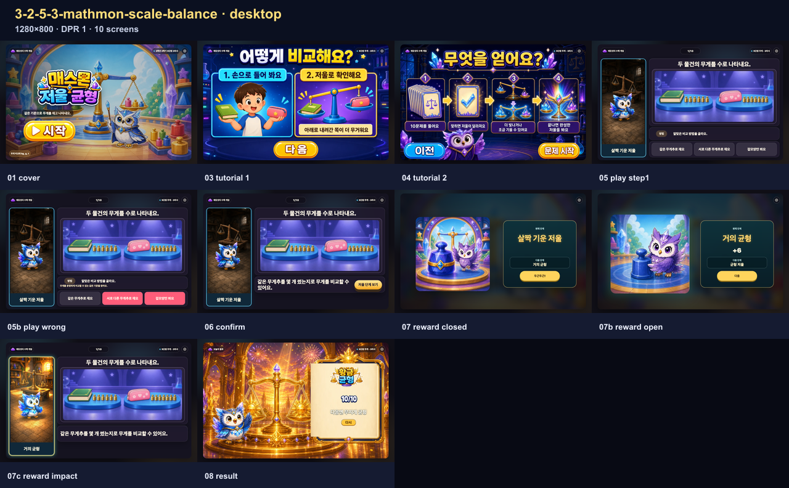

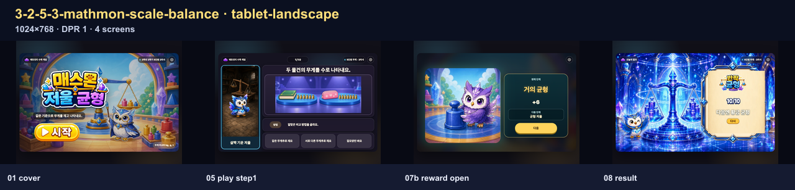

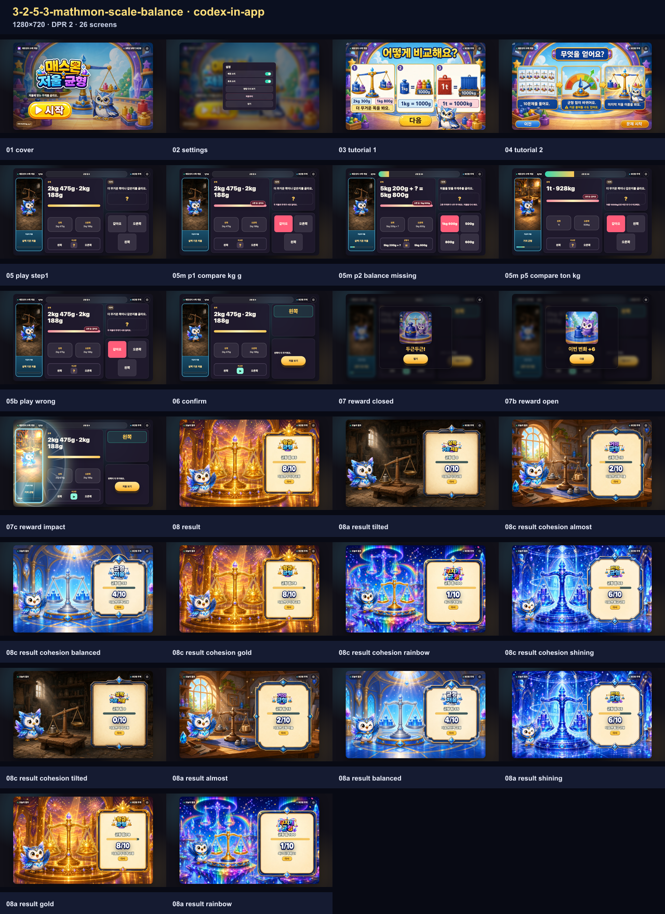

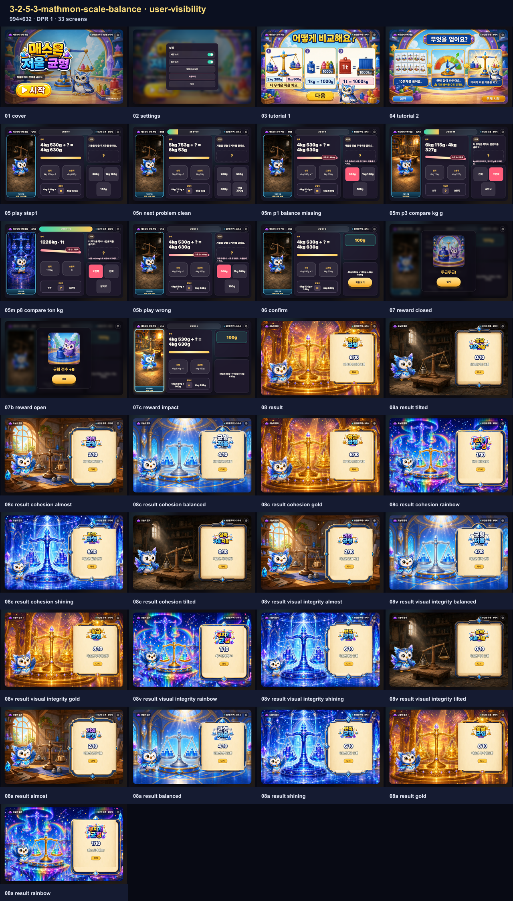

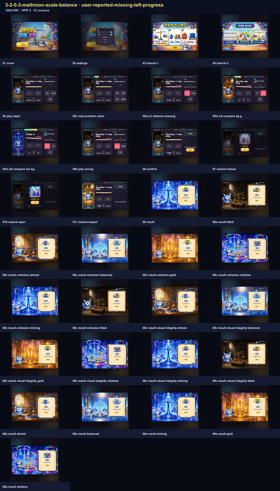

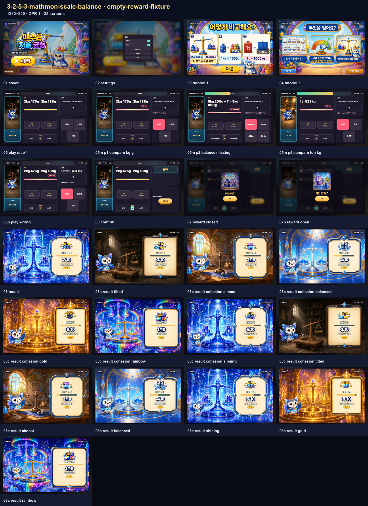

현재 실행본 해시와 화면 크기별 캡처 목록은 `screenshots/report-evidence-manifest.json`에 있습니다.

## 결과판 내부 결속 v2 (2026-08-03)

- `qa.resultPanelContainmentAudit.standard`를 `result-panel-containment-v2`로 선언했습니다. 결과 배경, 결과 패널, 단계명·정답 수·다시 버튼은 각각 선택 가능한 raster/WebP 레이어이며, 진행값·진행 막대·다음 목표만 동적 UI입니다.
- 안전 여백 `24px` 안에서 패널 네 변, 실제 보이는 rect, hitbox, 요소 간 교차, 공통 중심축 `1px`, 다시 버튼 아트↔hitbox 네 변 `1px`을 검사합니다. 숨긴 다음 목표는 `display:none`과 `0×0` rect를 확인합니다.
- `1280×800`, `1024×768`, `1280×720 DPR2`, `994×632`, `1082×987 DPR2`에서 결과 6단계를 전수 재실행했고, 넘침·요소 겹침·Stage 잘림은 `0건`입니다. 런타임 commit SHA와 lesson JSON SHA도 일치했습니다.


## 2026-09-28 5·6번 무게 비교 문항 재설계

- 5번: 수평인 저울 두 대에서 가 주머니는 같은 추 3개, 나 주머니는 같은 추 2개와 균형을 이룬다. 정답 확인은 `3개 > 2개`와 가 주머니를 강조한다.
- 6번: 가 상자는 빨간 추 3개, 나 상자는 파란 추 2개와 균형을 이룬다. 추 한 개의 무게 정보가 없어 개수만으로 더 무거운 상자를 정할 수 없다. 어느 상자가 더 무겁다고 그림이나 정답 확인에 임의로 표현하지 않는다.
- 수학 검사: 같은 추의 개수가 많음·적음·같음, 서로 다른 추의 알려진 무게로 비교할 수 있는 경우, 정보 부족 시 가 상자가 무겁거나·같거나·나 상자가 무거운 실제 반례를 검증했다. `알 수 없어요` 예외는 이 증명을 통과한 해당 문항에만 허용한다.
- 화면·동작 검사: 두 문항의 대기, 각 오답, 정답 확인, 보상 진입, 다음 문제 전환을 `1280×800`, `1024×768`, `1095×977·DPR 2`에서 확인했다. 태블릿에서는 그림이 작아지지 않게 빈 설명 공간을 줄였고, 오답 안내는 지시문을 대체하는 같은 영역에 표시한다.
- 재빌드 보존: 이전 실행본에만 있던 숫자 보기·결과 배치를 원본으로 옮겼다. 나머지 8문항의 같은 시드 결과, 10문제 순서, 보상과 최종 결과 기준, 2차시 실행 HTML은 유지했다.
- 검수판: 2·3차시 36개 카드·최종 결과 12개를 현재 실행본으로 모았다. 기존 실행본과 메모를 삭제하지 않았으며, 자동 수학·화면 대조와 사람의 그림 확인 대기를 구분해 표시한다.
- 생성 그림: `weight-comparison-v2`의 원본 PNG 2장과 실행 WebP 2장. 생성 도구는 `image_gen.imagegen`, 로컬 변환은 인코딩 변경만 수행한 `cwebp -q 90 -m 6`이다. 프롬프트·SHA·에이전트 육안 관찰은 `ART_META.json`에 기록하며 사람의 승인으로 대체하지 않는다.
- 이번 증거는 `screenshots/weight-comparison-qa.json`과 영향 범위 `screenshots/change-qa-receipt.json`이다. 위의 이전 전체 화면 기록은 과거 증거이며 이번 변경의 전체 QA 통과를 뜻하지 않는다. 10,000회 문항 반복, 무관한 전체 QA, 커밋·공개 배포는 수행하지 않았다.

## 2026-08-09 최종 보상 정렬 회귀 QA

- 6개 생성 장면마다 다른 결과판 축을 실제 픽셀 위치에 맞추고, 장면에 포함된 큰 생성 제목·다시 버튼만 보이게 중복 레이어를 제거했다.
- 데스크톱 `1280×800`, 태블릿 가로 `1024×768`에서 축 오차 `1px 이하`, 중복 제목·버튼 `0건`, 넘침·겹침 `0건`을 확인했다.
- 증거: `screenshots/result-typography-desktop-after.png`

## 2026-08-09 결과 타이틀 래스터 무결성 QA

- 범위: `result-title-only-v1` — 장면에 구워진 제목의 실제 배경 픽셀 영역까지 전수 검사했다.
- 장면에 baked-in된 6단계 제목은 독립 DOM 제목을 숨기고 `scene-baked` 픽셀·중복 레이어 검사를 통과했다.
- 데스크톱 `1280×800`과 태블릿 가로 `1024×768` 전수 PASS, 텍스트 넘침·요소 겹침·중복 제목 `0건`이다.
- 증거: `screenshots/result-typography-desktop-contain-after.png`, `screenshots/result-typography-tablet-landscape-contain-after.png`

</details>
